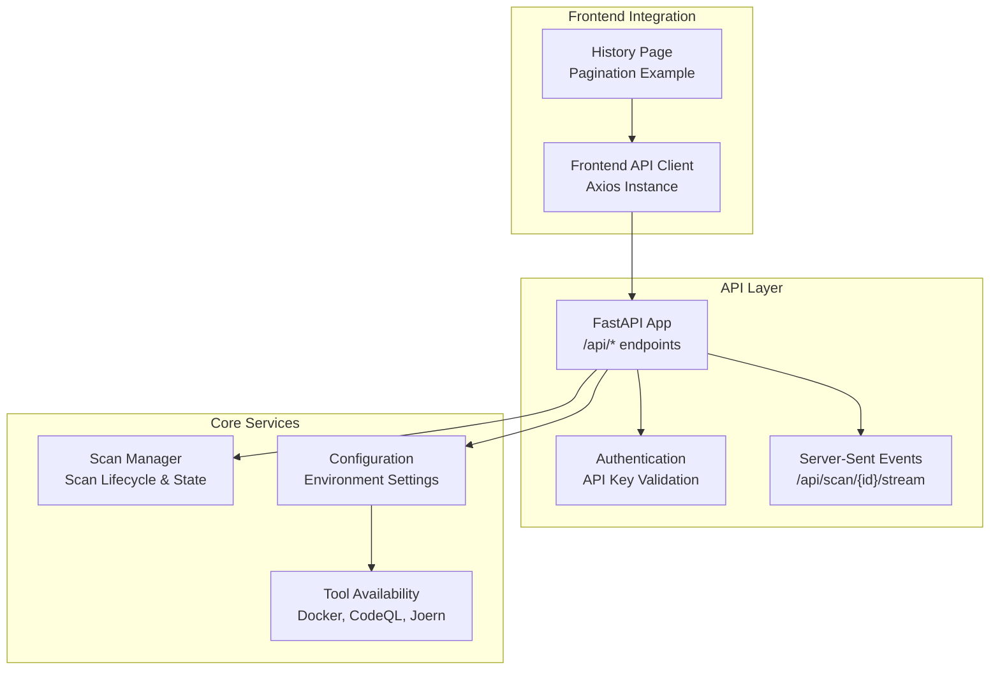
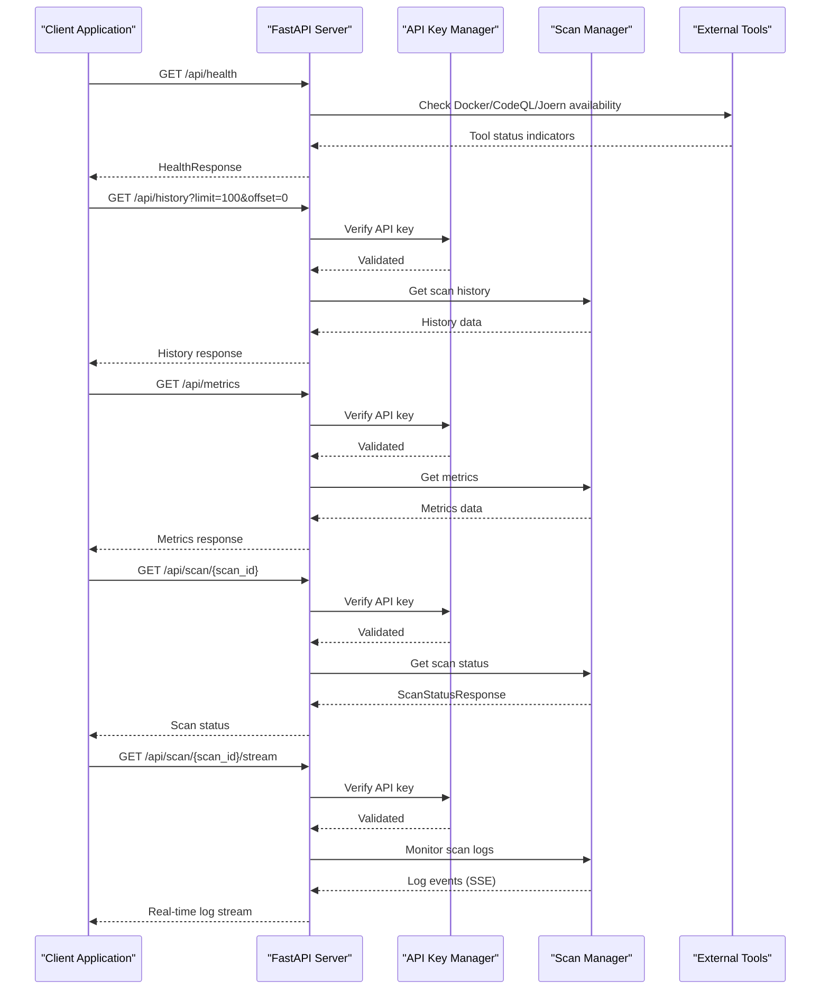
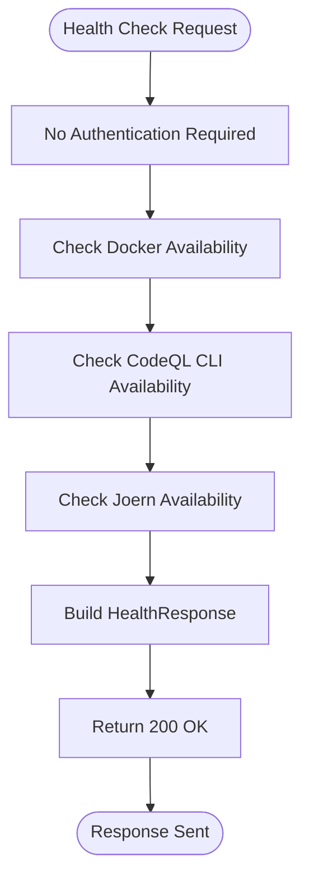
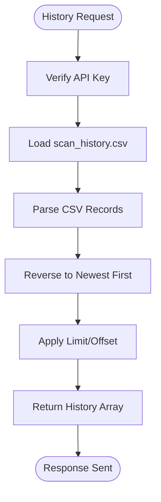
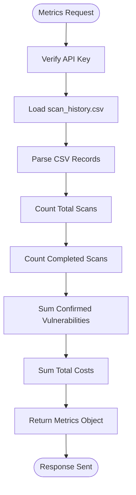
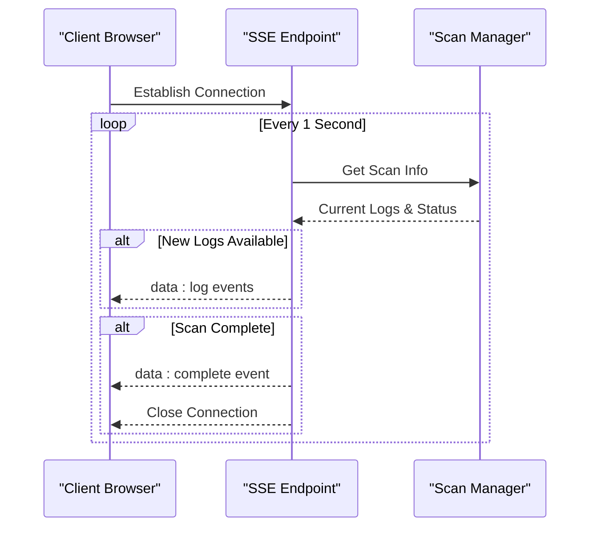
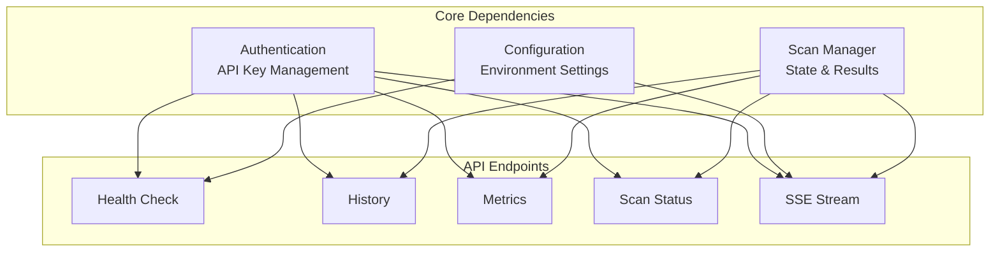

# System and Utility Endpoints

<cite>
**Referenced Files in This Document**
- [main.py](file://autopov/app/main.py)
- [scan_manager.py](file://autopov/app/scan_manager.py)
- [config.py](file://autopov/app/config.py)
- [auth.py](file://autopov/app/auth.py)
- [client.js](file://autopov/frontend/src/api/client.js)
- [History.jsx](file://autopov/frontend/src/pages/History.jsx)
- [test_api.py](file://autopov/tests/test_api.py)
</cite>

## Table of Contents
1. [Introduction](#introduction)
2. [Project Structure](#project-structure)
3. [Core Components](#core-components)
4. [Architecture Overview](#architecture-overview)
5. [Detailed Component Analysis](#detailed-component-analysis)
6. [Dependency Analysis](#dependency-analysis)
7. [Performance Considerations](#performance-considerations)
8. [Troubleshooting Guide](#troubleshooting-guide)
9. [Conclusion](#conclusion)

## Introduction
This document provides comprehensive API documentation for AutoPoV's system and utility endpoints focused on health checks, metrics, and system information. It covers the GET /api/health endpoint returning system status, version information, and tool availability indicators for Docker, CodeQL, and Joern. It documents the GET /api/history endpoint with pagination support through limit and offset parameters for retrieving scan history. It details the GET /api/metrics endpoint providing system performance metrics and usage statistics. It includes the GET /api/scan/{scan_id} status endpoint with comprehensive scan information including progress, logs, and results. It documents the server-sent events streaming endpoint /api/scan/{scan_id}/stream for real-time log monitoring. The document also provides examples of system monitoring, health assessment, and integration patterns for automated system management, along with error handling, status code meanings, and troubleshooting guidance.

## Project Structure
AutoPoV is structured around a FastAPI application that exposes REST endpoints for vulnerability scanning and system management. The key components include:
- API endpoints in the main application module
- Scan lifecycle management in the scan manager
- Configuration and environment settings
- Authentication and API key management
- Frontend API client for consuming endpoints

**Diagram sources**
- [main.py](file://autopov/app/main.py#L103-L121)
- [scan_manager.py](file://autopov/app/scan_manager.py#L40-L85)
- [config.py](file://autopov/app/config.py#L13-L210)
- [auth.py](file://autopov/app/auth.py#L137-L176)
- [client.js](file://autopov/frontend/src/api/client.js#L1-L69)
- [History.jsx](file://autopov/frontend/src/pages/History.jsx#L1-L50)

**Section sources**
- [main.py](file://autopov/app/main.py#L103-L121)
- [scan_manager.py](file://autopov/app/scan_manager.py#L40-L85)
- [config.py](file://autopov/app/config.py#L13-L210)
- [auth.py](file://autopov/app/auth.py#L137-L176)
- [client.js](file://autopov/frontend/src/api/client.js#L1-L69)
- [History.jsx](file://autopov/frontend/src/pages/History.jsx#L1-L50)

## Core Components
This section documents the primary system and utility endpoints with their request/response specifications, authentication requirements, and operational behavior.

### Health Check Endpoint
- **Endpoint**: GET /api/health
- **Description**: Returns system health status, version information, and tool availability indicators
- **Authentication**: Not required
- **Response Model**: HealthResponse
  - status: String indicating system health ("healthy")
  - version: String containing application version
  - docker_available: Boolean indicating Docker availability
  - codeql_available: Boolean indicating CodeQL CLI availability
  - joern_available: Boolean indicating Joern availability

**Section sources**
- [main.py](file://autopov/app/main.py#L164-L174)
- [config.py](file://autopov/app/config.py#L123-L159)

### Scan History Endpoint
- **Endpoint**: GET /api/history
- **Description**: Retrieves scan history with pagination support
- **Authentication**: Required (API key)
- **Query Parameters**:
  - limit: Integer, default 100, maximum number of records to return
  - offset: Integer, default 0, starting position for pagination
- **Response**: JSON object containing history array

**Section sources**
- [main.py](file://autopov/app/main.py#L388-L397)
- [scan_manager.py](file://autopov/app/scan_manager.py#L252-L273)

### Metrics Endpoint
- **Endpoint**: GET /api/metrics
- **Description**: Provides system performance metrics and usage statistics
- **Authentication**: Required (API key)
- **Response**: JSON object containing metrics
  - total_scans: Total number of scans performed
  - completed_scans: Number of successful scans
  - failed_scans: Number of failed scans
  - active_scans: Number of currently running scans
  - total_confirmed_vulnerabilities: Sum of confirmed vulnerabilities across completed scans
  - total_cost_usd: Total cost in USD across completed scans

**Section sources**
- [main.py](file://autopov/app/main.py#L513-L517)
- [scan_manager.py](file://autopov/app/scan_manager.py#L304-L334)

### Scan Status Endpoint
- **Endpoint**: GET /api/scan/{scan_id}
- **Description**: Returns comprehensive scan information including progress, logs, and results
- **Authentication**: Required (API key)
- **Path Parameter**:
  - scan_id: Unique identifier for the scan
- **Response Model**: ScanStatusResponse
  - scan_id: String identifier
  - status: String indicating current status
  - progress: Integer percentage (0-100)
  - logs: Array of log messages
  - result: Object containing scan results (when available)

**Section sources**
- [main.py](file://autopov/app/main.py#L319-L347)
- [scan_manager.py](file://autopov/app/scan_manager.py#L237-L250)

### Server-Sent Events Stream Endpoint
- **Endpoint**: GET /api/scan/{scan_id}/stream
- **Description**: Real-time streaming of scan logs and completion status via Server-Sent Events
- **Authentication**: Required (API key)
- **Path Parameter**:
  - scan_id: Unique identifier for the scan
- **Response**: Text/event-stream
- **Event Types**:
  - log: New log entries during scan execution
  - complete: Final scan result when scan completes
  - error: Error messages when scan not found

**Section sources**
- [main.py](file://autopov/app/main.py#L350-L385)
- [auth.py](file://autopov/app/auth.py#L137-L156)

## Architecture Overview
The system follows a layered architecture with clear separation between API endpoints, business logic, and external tool integrations.

**Diagram sources**
- [main.py](file://autopov/app/main.py#L164-L174)
- [main.py](file://autopov/app/main.py#L388-L397)
- [main.py](file://autopov/app/main.py#L513-L517)
- [main.py](file://autopov/app/main.py#L319-L347)
- [main.py](file://autopov/app/main.py#L350-L385)
- [auth.py](file://autopov/app/auth.py#L137-L156)
- [scan_manager.py](file://autopov/app/scan_manager.py#L252-L273)

## Detailed Component Analysis

### Health Check Implementation
The health check endpoint provides a comprehensive system status assessment by checking tool availability and returning version information.

**Diagram sources**
- [main.py](file://autopov/app/main.py#L164-L174)
- [config.py](file://autopov/app/config.py#L123-L159)

**Section sources**
- [main.py](file://autopov/app/main.py#L164-L174)
- [config.py](file://autopov/app/config.py#L123-L159)

### Scan History Pagination
The history endpoint implements efficient pagination using limit and offset parameters with CSV-based data storage.

**Diagram sources**
- [main.py](file://autopov/app/main.py#L388-L397)
- [scan_manager.py](file://autopov/app/scan_manager.py#L252-L273)

**Section sources**
- [main.py](file://autopov/app/main.py#L388-L397)
- [scan_manager.py](file://autopov/app/scan_manager.py#L252-L273)

### Metrics Calculation
The metrics endpoint aggregates data from CSV logs to provide system-wide statistics.

**Diagram sources**
- [main.py](file://autopov/app/main.py#L513-L517)
- [scan_manager.py](file://autopov/app/scan_manager.py#L304-L334)

**Section sources**
- [main.py](file://autopov/app/main.py#L513-L517)
- [scan_manager.py](file://autopov/app/scan_manager.py#L304-L334)

### Server-Sent Events Streaming
The streaming endpoint provides real-time log monitoring using Server-Sent Events with automatic connection management.

**Diagram sources**
- [main.py](file://autopov/app/main.py#L350-L385)
- [auth.py](file://autopov/app/auth.py#L137-L156)

**Section sources**
- [main.py](file://autopov/app/main.py#L350-L385)
- [auth.py](file://autopov/app/auth.py#L137-L156)

## Dependency Analysis
The system exhibits clear dependency relationships between components, with authentication and configuration providing foundational services.

**Diagram sources**
- [auth.py](file://autopov/app/auth.py#L137-L176)
- [config.py](file://autopov/app/config.py#L123-L159)
- [scan_manager.py](file://autopov/app/scan_manager.py#L40-L85)
- [main.py](file://autopov/app/main.py#L164-L174)

**Section sources**
- [auth.py](file://autopov/app/auth.py#L137-L176)
- [config.py](file://autopov/app/config.py#L123-L159)
- [scan_manager.py](file://autopov/app/scan_manager.py#L40-L85)
- [main.py](file://autopov/app/main.py#L164-L174)

## Performance Considerations
- **Tool Availability Checks**: Docker, CodeQL, and Joern checks use subprocess calls with timeouts to prevent blocking
- **Pagination Efficiency**: CSV-based history storage with reverse ordering for optimal pagination performance
- **Streaming Optimization**: SSE endpoint maintains minimal memory footprint by tracking last log count
- **Thread Pool Management**: Scan execution uses ThreadPoolExecutor for concurrent processing
- **Resource Cleanup**: Automatic cleanup of vector stores and temporary files

## Troubleshooting Guide

### Authentication Issues
- **401 Unauthorized**: Invalid or missing API key
- **403 Forbidden**: Admin-only endpoints accessed without proper credentials
- **Solution**: Verify API key validity and ensure proper bearer token format

### Health Check Failures
- **Docker Unavailable**: Docker daemon not running or not accessible
- **CodeQL/Joern Missing**: Tools not installed or not in PATH
- **Solution**: Install required tools and verify PATH configuration

### History Endpoint Issues
- **Empty Results**: No scan history data found
- **Pagination Problems**: Incorrect limit/offset values
- **Solution**: Check CSV file existence and verify parameter values

### Metrics Endpoint Issues
- **Missing Data**: CSV file not found or empty
- **Calculation Errors**: Corrupted CSV data
- **Solution**: Verify CSV file integrity and re-run scans

### Streaming Issues
- **Connection Drops**: Network interruptions or server restarts
- **Scan Not Found**: Invalid scan_id or scan completed/cancelled
- **Solution**: Re-establish SSE connection and verify scan status

**Section sources**
- [auth.py](file://autopov/app/auth.py#L137-L176)
- [config.py](file://autopov/app/config.py#L123-L159)
- [scan_manager.py](file://autopov/app/scan_manager.py#L252-L273)
- [main.py](file://autopov/app/main.py#L350-L385)

## Conclusion
AutoPoV provides a comprehensive set of system and utility endpoints for monitoring, managing, and integrating with the vulnerability scanning framework. The endpoints offer robust health monitoring, detailed metrics collection, efficient history pagination, and real-time streaming capabilities. Proper authentication ensures secure access to sensitive operations, while the modular architecture supports easy integration and extension. The documented endpoints enable automated system management, continuous monitoring, and reliable integration patterns for production environments.