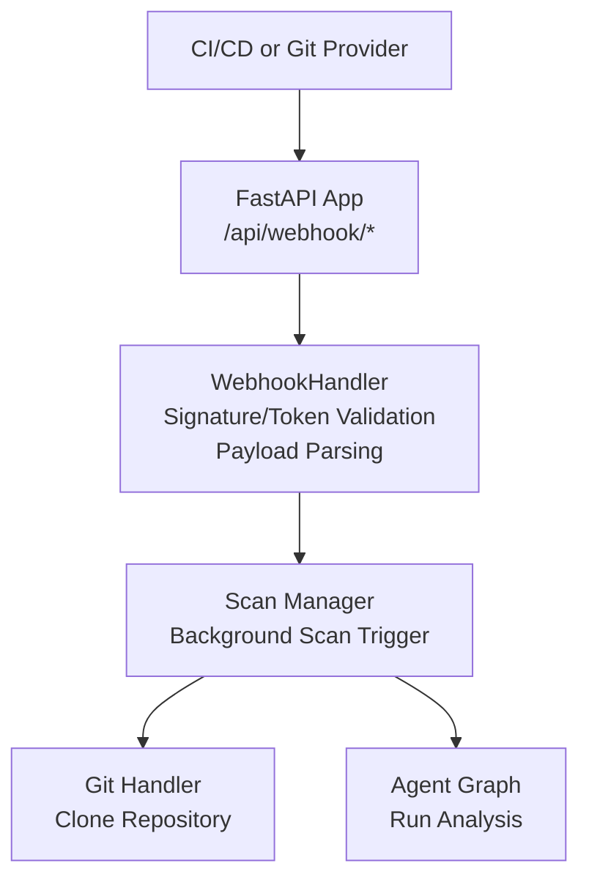
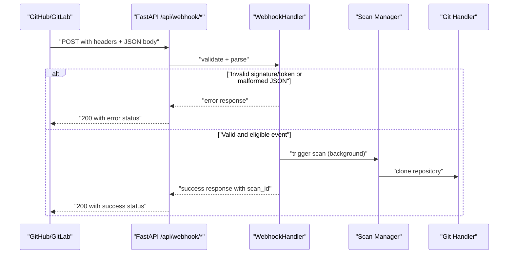
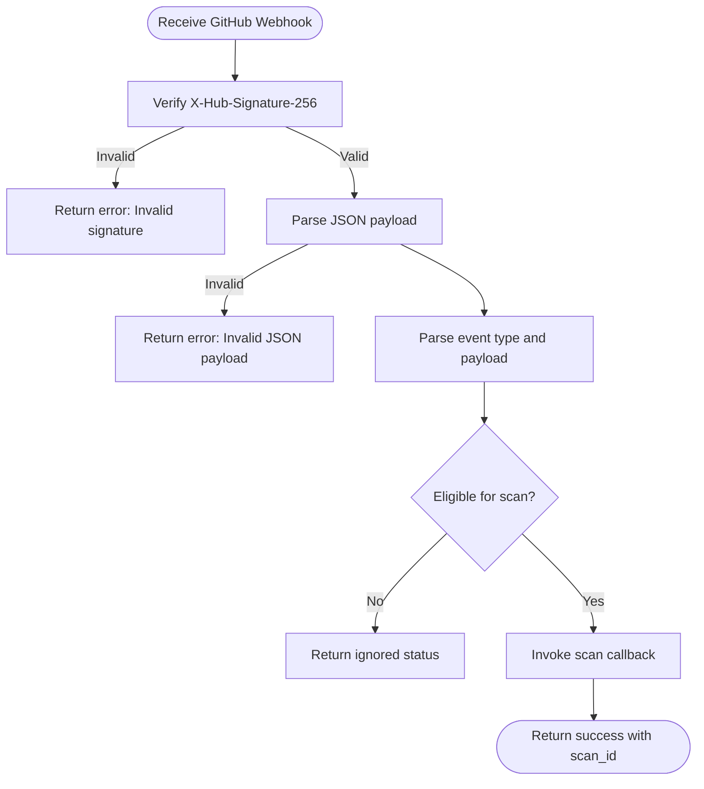
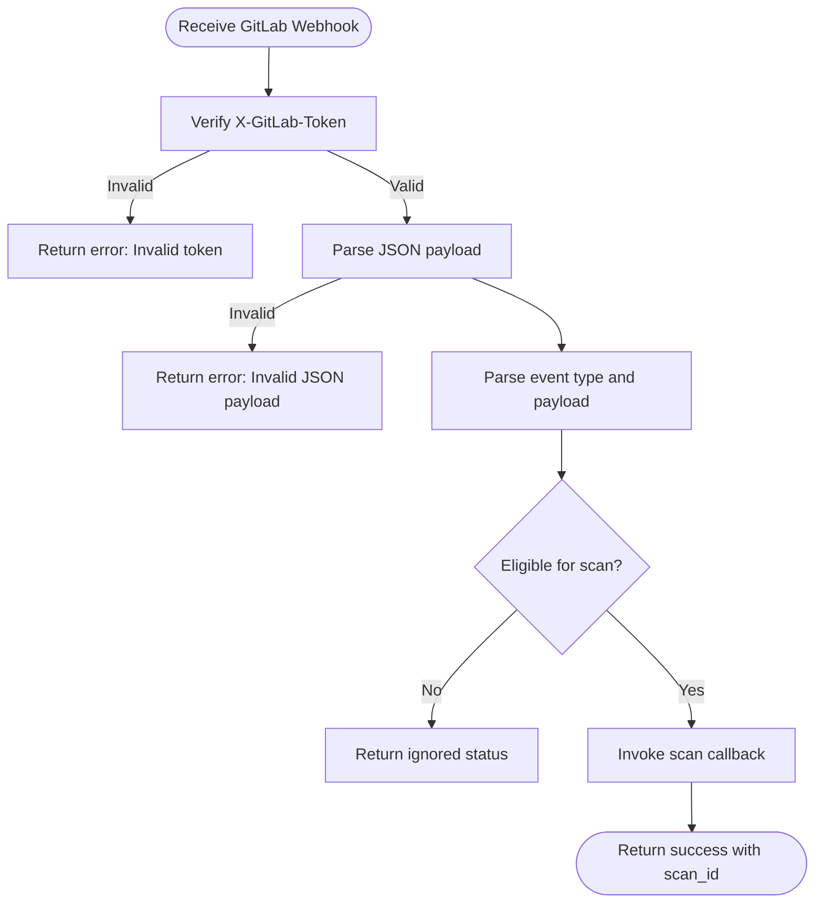
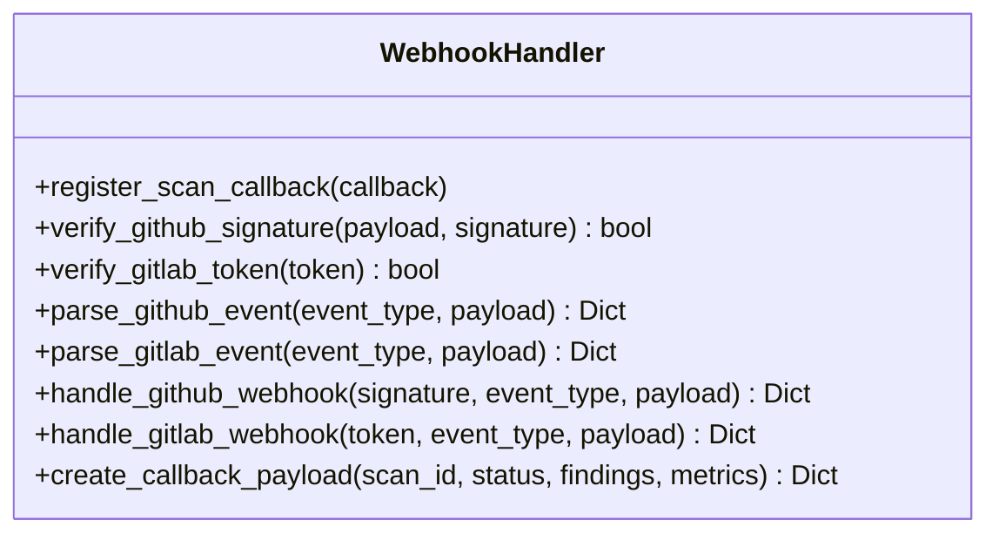
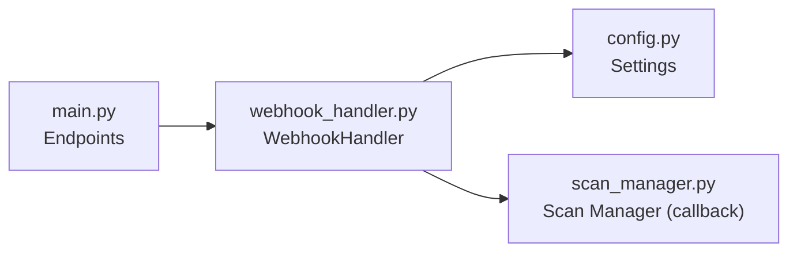

# Webhook Endpoints

<cite>
**Referenced Files in This Document**
- [main.py](file://autopov/app/main.py)
- [webhook_handler.py](file://autopov/app/webhook_handler.py)
- [config.py](file://autopov/app/config.py)
- [WebhookSetup.jsx](file://autopov/frontend/src/components/WebhookSetup.jsx)
- [test_webhook_handler.py](file://autopov/tests/test_webhook_handler.py)
- [test_api.py](file://autopov/tests/test_api.py)
- [README.md](file://autopov/README.md)
</cite>

## Table of Contents
1. [Introduction](#introduction)
2. [Project Structure](#project-structure)
3. [Core Components](#core-components)
4. [Architecture Overview](#architecture-overview)
5. [Detailed Component Analysis](#detailed-component-analysis)
6. [Dependency Analysis](#dependency-analysis)
7. [Performance Considerations](#performance-considerations)
8. [Troubleshooting Guide](#troubleshooting-guide)
9. [Conclusion](#conclusion)
10. [Appendices](#appendices)

## Introduction
This document describes AutoPoV’s webhook integration endpoints for GitHub and GitLab. It covers:
- Endpoint definitions and request/response semantics
- Security validation (signatures and tokens)
- Payload parsing and supported event types
- Automatic scan triggering workflow
- Setup configuration, payload examples, and CI/CD integration patterns
- Error handling, retries, and debugging approaches

## Project Structure
The webhook endpoints are implemented in the FastAPI application and handled by a dedicated webhook handler module. Configuration is managed centrally via environment variables.

**Diagram sources**
- [main.py](file://autopov/app/main.py#L433-L475)
- [webhook_handler.py](file://autopov/app/webhook_handler.py#L15-L363)
- [config.py](file://autopov/app/config.py#L56-L58)

**Section sources**
- [main.py](file://autopov/app/main.py#L433-L475)
- [webhook_handler.py](file://autopov/app/webhook_handler.py#L15-L363)
- [config.py](file://autopov/app/config.py#L56-L58)

## Core Components
- FastAPI endpoints for GitHub and GitLab webhooks
- WebhookHandler for signature/token validation, payload parsing, and scan triggering
- Configuration settings for webhook secrets
- Frontend component for quick webhook setup guidance

Key responsibilities:
- Validate inbound requests using provider-specific security mechanisms
- Parse event payloads and extract repository/branch/commit metadata
- Decide whether to trigger a scan based on event type and content
- Trigger asynchronous scans and return structured responses

**Section sources**
- [main.py](file://autopov/app/main.py#L433-L475)
- [webhook_handler.py](file://autopov/app/webhook_handler.py#L15-L363)
- [config.py](file://autopov/app/config.py#L56-L58)
- [WebhookSetup.jsx](file://autopov/frontend/src/components/WebhookSetup.jsx#L1-L88)

## Architecture Overview
The webhook flow is consistent across providers:
1. Provider sends HTTP POST with headers and JSON body
2. FastAPI endpoint extracts headers and body
3. WebhookHandler validates security and parses payload
4. If eligible, triggers a background scan via the scan manager
5. Returns a standardized response indicating status

**Diagram sources**
- [main.py](file://autopov/app/main.py#L433-L475)
- [webhook_handler.py](file://autopov/app/webhook_handler.py#L196-L336)

## Detailed Component Analysis

### GitHub Webhook Endpoint
- Path: POST /api/webhook/github
- Headers:
  - X-Hub-Signature-256: HMAC-SHA256 signature of the raw request body
  - X-GitHub-Event: Event type (e.g., push, pull_request)
- Request body: JSON payload delivered by GitHub
- Response: WebhookResponse with status, message, and optional scan_id

Security validation:
- Signature verification using HMAC-SHA256 against the configured GITHUB_WEBHOOK_SECRET
- Rejects missing or invalid signatures

Supported events:
- push: Triggers scan when commit is non-zero
- pull_request: Triggers scan for opened/synchronize/reopened actions

Triggered scan metadata:
- source_type: git
- source_url: repository clone URL
- branch: branch name derived from ref
- commit: SHA of the commit
- triggered_by: provider-specific identifier

**Diagram sources**
- [main.py](file://autopov/app/main.py#L433-L453)
- [webhook_handler.py](file://autopov/app/webhook_handler.py#L196-L265)

**Section sources**
- [main.py](file://autopov/app/main.py#L433-L453)
- [webhook_handler.py](file://autopov/app/webhook_handler.py#L25-L55)
- [webhook_handler.py](file://autopov/app/webhook_handler.py#L75-L132)
- [webhook_handler.py](file://autopov/app/webhook_handler.py#L196-L265)
- [config.py](file://autopov/app/config.py#L56-L58)

### GitLab Webhook Endpoint
- Path: POST /api/webhook/gitlab
- Headers:
  - X-GitLab-Token: Shared secret token
  - X-GitLab-Event: Event type (e.g., Push Hook, Merge Request Hook)
- Request body: JSON payload delivered by GitLab
- Response: WebhookResponse with status, message, and optional scan_id

Security validation:
- Token verification against the configured GITLAB_WEBHOOK_SECRET
- Rejects missing or mismatched tokens

Supported events:
- push: Triggers scan when commit is non-zero
- merge_request: Triggers scan for open/update/reopen actions

Triggered scan metadata:
- source_type: git
- source_url: repository HTTP URL
- branch: branch name derived from ref
- commit: SHA of the commit
- triggered_by: provider-specific identifier

**Diagram sources**
- [main.py](file://autopov/app/main.py#L456-L475)
- [webhook_handler.py](file://autopov/app/webhook_handler.py#L267-L336)

**Section sources**
- [main.py](file://autopov/app/main.py#L456-L475)
- [webhook_handler.py](file://autopov/app/webhook_handler.py#L57-L73)
- [webhook_handler.py](file://autopov/app/webhook_handler.py#L134-L194)
- [webhook_handler.py](file://autopov/app/webhook_handler.py#L267-L336)
- [config.py](file://autopov/app/config.py#L57-L58)

### WebhookHandler Class
Responsibilities:
- Signature/token verification
- Event parsing and eligibility checks
- Asynchronous scan callback invocation
- Standardized response creation

**Diagram sources**
- [webhook_handler.py](file://autopov/app/webhook_handler.py#L15-L363)

**Section sources**
- [webhook_handler.py](file://autopov/app/webhook_handler.py#L15-L363)

### Configuration and Setup
- Environment variables:
  - GITHUB_WEBHOOK_SECRET: Secret used to validate GitHub signatures
  - GITLAB_WEBHOOK_SECRET: Secret used to validate GitLab tokens
- Frontend component provides quick setup guidance and copies webhook URLs

**Section sources**
- [config.py](file://autopov/app/config.py#L56-L58)
- [WebhookSetup.jsx](file://autopov/frontend/src/components/WebhookSetup.jsx#L1-L88)
- [README.md](file://autopov/README.md#L211-L218)

## Dependency Analysis
- FastAPI endpoints depend on WebhookHandler for processing
- WebhookHandler depends on configuration settings for secrets
- WebhookHandler invokes the scan manager callback during successful events

**Diagram sources**
- [main.py](file://autopov/app/main.py#L433-L475)
- [webhook_handler.py](file://autopov/app/webhook_handler.py#L15-L363)
- [config.py](file://autopov/app/config.py#L56-L58)

**Section sources**
- [main.py](file://autopov/app/main.py#L433-L475)
- [webhook_handler.py](file://autopov/app/webhook_handler.py#L15-L363)
- [config.py](file://autopov/app/config.py#L56-L58)

## Performance Considerations
- Webhook processing is synchronous but triggers scans asynchronously, minimizing latency for the provider
- Signature/token verification uses constant-time comparison to prevent timing attacks
- Payload parsing occurs only after successful validation to reduce unnecessary work

[No sources needed since this section provides general guidance]

## Troubleshooting Guide

Common errors and causes:
- Invalid signature (GitHub): Returned when X-Hub-Signature-256 is missing, malformed, or does not match the expected HMAC-SHA256
- Invalid token (GitLab): Returned when X-GitLab-Token is missing or does not match the configured secret
- Invalid JSON payload: Returned when the request body is not valid JSON
- Unsupported event type: Returned when the event is not push or pull_request (GitHub) or push or merge_request (GitLab)
- Event does not require scan: Returned when the event is eligible but not actionable (e.g., zero commit)
- No scan callback registered: Returned when the webhook is processed but no scan callback is available

Debugging steps:
- Confirm environment variables GITHUB_WEBHOOK_SECRET or GITLAB_WEBHOOK_SECRET are set
- Verify provider webhook configuration (URL, secret, selected events)
- Inspect response body for status and message fields
- Check application logs for exceptions during background scan execution
- Use the frontend Webhook Setup component to copy correct webhook URLs and headers

**Section sources**
- [webhook_handler.py](file://autopov/app/webhook_handler.py#L213-L242)
- [webhook_handler.py](file://autopov/app/webhook_handler.py#L284-L313)
- [test_api.py](file://autopov/tests/test_api.py#L46-L59)
- [WebhookSetup.jsx](file://autopov/frontend/src/components/WebhookSetup.jsx#L78-L83)

## Conclusion
AutoPoV’s webhook endpoints provide secure, event-driven triggers for automated vulnerability scanning. By validating provider-specific signatures/tokens, parsing structured payloads, and conditionally initiating scans, the system integrates smoothly with CI/CD pipelines and development workflows.

[No sources needed since this section summarizes without analyzing specific files]

## Appendices

### API Definitions

- POST /api/webhook/github
  - Headers:
    - X-Hub-Signature-256: HMAC-SHA256 signature of the raw request body
    - X-GitHub-Event: Event type (push or pull_request)
  - Body: JSON payload
  - Response: WebhookResponse with status, message, optional scan_id

- POST /api/webhook/gitlab
  - Headers:
    - X-GitLab-Token: Shared secret token
    - X-GitLab-Event: Event type (Push Hook or Merge Request Hook)
  - Body: JSON payload
  - Response: WebhookResponse with status, message, optional scan_id

**Section sources**
- [main.py](file://autopov/app/main.py#L433-L475)

### Supported Events and Payload Fields

- GitHub push
  - Eligibility: commit is non-zero
  - Fields extracted: repository.clone_url, repository.full_name, ref, after, pusher.name
  - Triggers scan with branch and commit

- GitHub pull_request
  - Eligibility: action in [opened, synchronize, reopened]
  - Fields extracted: repository.clone_url, repository.full_name, pull_request.number, pull_request.title, head.ref, head.sha, user.login
  - Triggers scan with branch and commit

- GitLab push
  - Eligibility: commit is non-zero
  - Fields extracted: project.git_http_url or project.http_url, project.path_with_namespace, ref, after, user_name
  - Triggers scan with branch and commit

- GitLab merge_request
  - Eligibility: action in [open, update, reopen]
  - Fields extracted: project.git_http_url or project.http_url, project.path_with_namespace, object_attributes.iid, object_attributes.title, source_branch, last_commit.id, author_id
  - Triggers scan with branch and commit

**Section sources**
- [webhook_handler.py](file://autopov/app/webhook_handler.py#L75-L132)
- [webhook_handler.py](file://autopov/app/webhook_handler.py#L134-L194)

### Security Validation Processes

- GitHub
  - Requires GITHUB_WEBHOOK_SECRET to be set
  - Validates X-Hub-Signature-256 starts with sha256= and compares digest using constant-time comparison

- GitLab
  - Requires GITLAB_WEBHOOK_SECRET to be set
  - Validates X-GitLab-Token using constant-time comparison

**Section sources**
- [webhook_handler.py](file://autopov/app/webhook_handler.py#L25-L55)
- [webhook_handler.py](file://autopov/app/webhook_handler.py#L57-L73)
- [config.py](file://autopov/app/config.py#L56-L58)

### Automatic Scan Triggering Workflow

- On successful validation and eligibility:
  - A background scan is created and started
  - The repository is cloned using the extracted source_url, branch, and commit
  - The scan proceeds asynchronously

**Section sources**
- [main.py](file://autopov/app/main.py#L123-L161)
- [webhook_handler.py](file://autopov/app/webhook_handler.py#L244-L259)
- [webhook_handler.py](file://autopov/app/webhook_handler.py#L315-L330)

### Example Setup and Integration Patterns

- Webhook setup locations and headers:
  - GitHub: Settings > Webhooks > Add webhook; use X-Hub-Signature-256
  - GitLab: Settings > Webhooks; use X-GitLab-Token

- CI/CD integration:
  - Configure provider webhooks to POST to AutoPoV endpoints
  - Ensure secrets are set in environment variables
  - Monitor response statuses and scan_id for downstream automation

**Section sources**
- [README.md](file://autopov/README.md#L211-L218)
- [WebhookSetup.jsx](file://autopov/frontend/src/components/WebhookSetup.jsx#L8-L21)

### Error Handling Reference

- Status values:
  - error: Indicates failure due to invalid signature/token, malformed JSON, or missing secrets
  - ignored: Indicates the event type is not supported or does not require a scan
  - success: Indicates the event was processed and a scan was triggered or would be triggered

- Typical messages:
  - "Invalid signature"
  - "Invalid token"
  - "Invalid JSON payload"
  - "Event type '...' does not trigger scans"
  - "Event does not require scan"
  - "Scan triggered"
  - "Event processed but no scan callback registered"

**Section sources**
- [webhook_handler.py](file://autopov/app/webhook_handler.py#L214-L242)
- [webhook_handler.py](file://autopov/app/webhook_handler.py#L285-L313)
- [test_api.py](file://autopov/tests/test_api.py#L46-L59)

### Tests Coverage

- Signature/token verification tests
- Event parsing tests for push and pull_request (GitHub) and push and merge_request (GitLab)
- Callback payload creation tests

**Section sources**
- [test_webhook_handler.py](file://autopov/tests/test_webhook_handler.py#L21-L166)
- [test_api.py](file://autopov/tests/test_api.py#L46-L59)