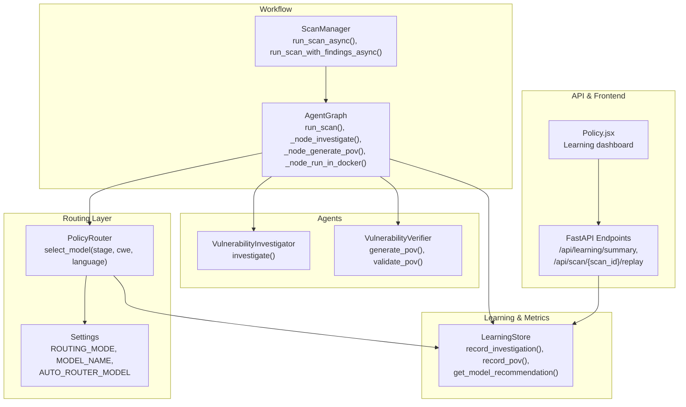
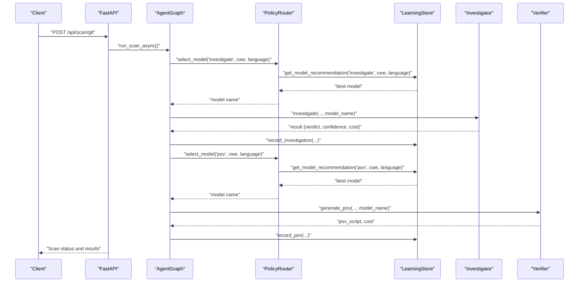
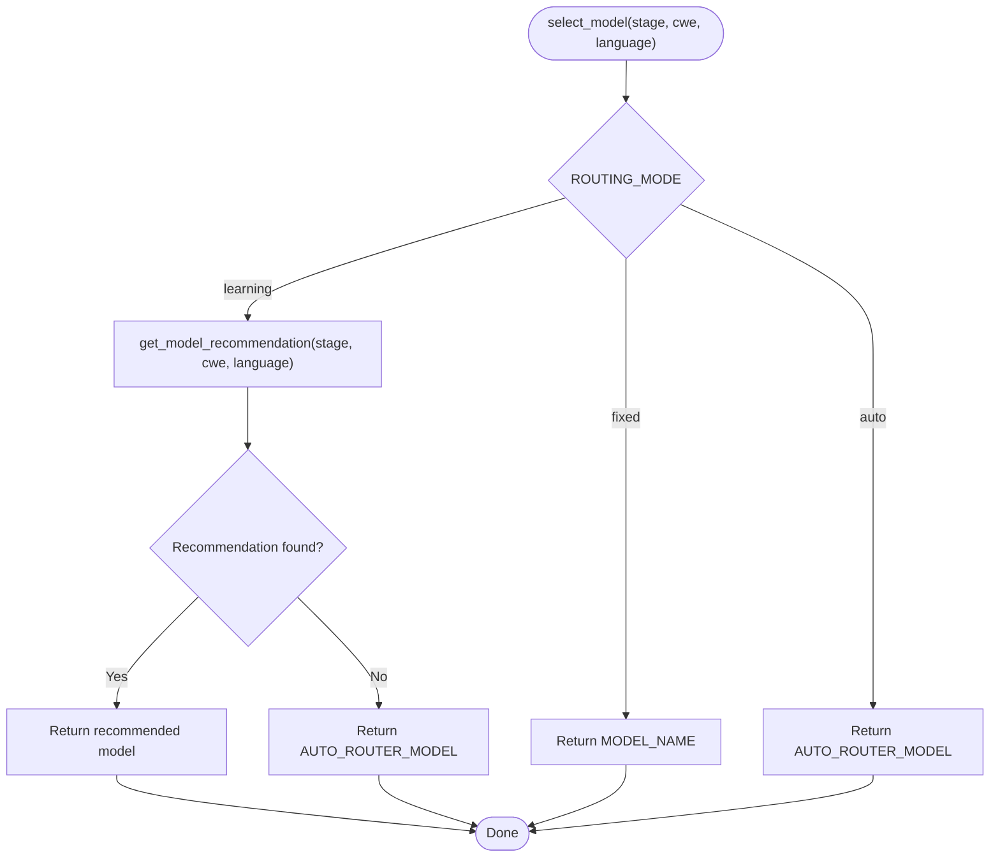
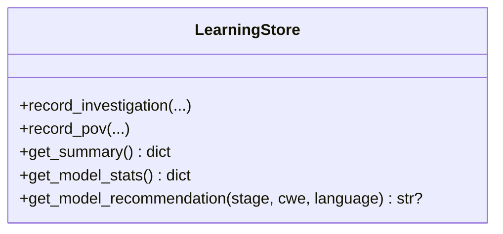
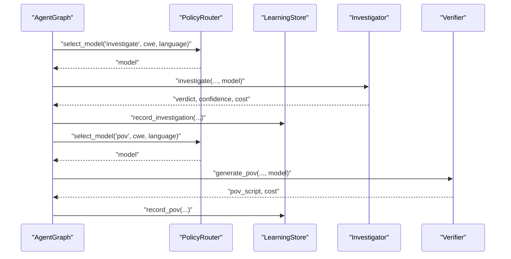
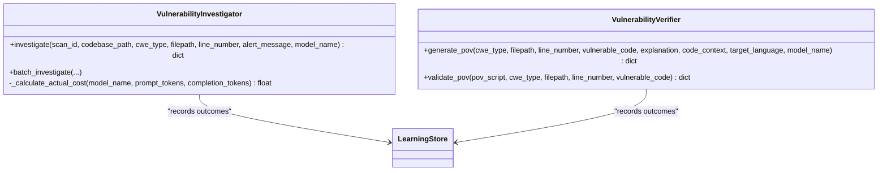
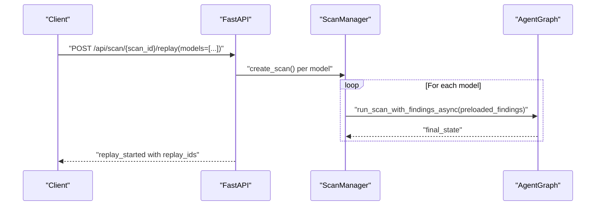
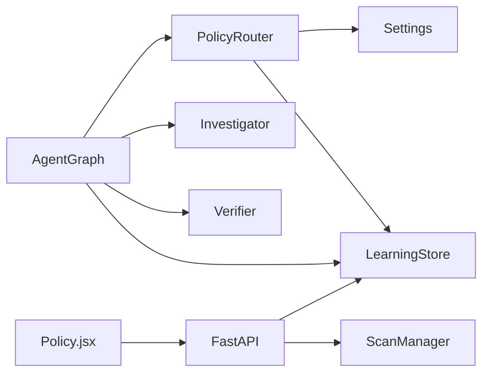

# Adaptive Model Routing

<cite>
**Referenced Files in This Document**
- [policy.py](file://app/policy.py)
- [learning_store.py](file://app/learning_store.py)
- [config.py](file://app/config.py)
- [agent_graph.py](file://app/agent_graph.py)
- [investigator.py](file://agents/investigator.py)
- [verifier.py](file://agents/verifier.py)
- [scan_manager.py](file://app/scan_manager.py)
- [main.py](file://app/main.py)
- [Policy.jsx](file://frontend/src/pages/Policy.jsx)
</cite>

## Table of Contents
1. [Introduction](#introduction)
2. [Project Structure](#project-structure)
3. [Core Components](#core-components)
4. [Architecture Overview](#architecture-overview)
5. [Detailed Component Analysis](#detailed-component-analysis)
6. [Dependency Analysis](#dependency-analysis)
7. [Performance Considerations](#performance-considerations)
8. [Troubleshooting Guide](#troubleshooting-guide)
9. [Conclusion](#conclusion)

## Introduction
This document explains AutoPoV's adaptive model routing system. It covers the policy-based model selection algorithm, performance tracking, and decision-making logic. It documents how the learning store integrates with the system to collect performance metrics and evaluate models, and details the routing criteria including CWE type, language detection, confidence thresholds, and historical performance data. It also describes model switching mechanisms, fallback strategies, and A/B testing capabilities, along with practical examples, monitoring approaches, and optimization techniques for model availability detection, cost control, and quality assurance.

## Project Structure
The adaptive routing system spans several modules:
- Policy Router: selects models per stage based on routing mode and learning signals
- Learning Store: persists outcomes and computes recommendations
- Configuration: defines routing modes, models, and cost controls
- Agent Graph: orchestrates the scan workflow and invokes the policy
- Agents: implement investigation and verification with cost tracking
- API: exposes endpoints for metrics and replay-based A/B testing
- Frontend: displays learning summaries and model performance

**Diagram sources**
- [policy.py:12-39](file://app/policy.py#L12-L39)
- [learning_store.py:14-255](file://app/learning_store.py#L14-L255)
- [config.py:13-255](file://app/config.py#L13-L255)
- [agent_graph.py:82-168](file://app/agent_graph.py#L82-L168)
- [investigator.py:37-519](file://agents/investigator.py#L37-L519)
- [verifier.py:42-562](file://agents/verifier.py#L42-L562)
- [scan_manager.py:47-663](file://app/scan_manager.py#L47-L663)
- [main.py:745-751](file://app/main.py#L745-L751)
- [Policy.jsx:45-111](file://frontend/src/pages/Policy.jsx#L45-L111)

**Section sources**
- [policy.py:12-39](file://app/policy.py#L12-L39)
- [learning_store.py:14-255](file://app/learning_store.py#L14-L255)
- [config.py:13-255](file://app/config.py#L13-L255)
- [agent_graph.py:82-168](file://app/agent_graph.py#L82-L168)
- [investigator.py:37-519](file://agents/investigator.py#L37-L519)
- [verifier.py:42-562](file://agents/verifier.py#L42-L562)
- [scan_manager.py:47-663](file://app/scan_manager.py#L47-L663)
- [main.py:745-751](file://app/main.py#L745-L751)
- [Policy.jsx:45-111](file://frontend/src/pages/Policy.jsx#L45-L111)

## Core Components
- PolicyRouter: Implements routing logic across three modes—fixed, learning, and auto router—and delegates recommendation to the learning store when appropriate.
- LearningStore: Persists investigation and PoV outcomes, aggregates statistics, and recommends models based on historical performance.
- Configuration: Defines routing modes, default models, and cost-related settings.
- AgentGraph: Orchestrates the scan pipeline, invoking the policy at each stage and recording outcomes.
- Agents: Investigator and Verifier handle LLM calls, cost extraction, and validation, feeding metrics back to the learning store.
- API and Frontend: Expose metrics and enable A/B testing via replay.

**Section sources**
- [policy.py:12-39](file://app/policy.py#L12-L39)
- [learning_store.py:14-255](file://app/learning_store.py#L14-L255)
- [config.py:13-255](file://app/config.py#L13-L255)
- [agent_graph.py:691-1004](file://app/agent_graph.py#L691-L1004)
- [investigator.py:37-519](file://agents/investigator.py#L37-L519)
- [verifier.py:42-562](file://agents/verifier.py#L42-L562)
- [main.py:745-751](file://app/main.py#L745-L751)
- [Policy.jsx:45-111](file://frontend/src/pages/Policy.jsx#L45-L111)

## Architecture Overview
The adaptive routing system operates as follows:
- At runtime, the AgentGraph requests a model for each stage (investigate or PoV) using PolicyRouter.
- PolicyRouter consults the learning store for recommendations when in learning mode; otherwise it falls back to configured defaults.
- Agents perform their tasks and record outcomes (verdict, confidence, cost, model) into the learning store.
- The API exposes endpoints to retrieve learning summaries and to run A/B tests by replaying findings across models.

**Diagram sources**
- [agent_graph.py:708-777](file://app/agent_graph.py#L708-L777)
- [policy.py:18-32](file://app/policy.py#L18-L32)
- [learning_store.py:188-248](file://app/learning_store.py#L188-L248)
- [investigator.py:270-432](file://agents/investigator.py#L270-L432)
- [verifier.py:90-223](file://agents/verifier.py#L90-L223)
- [main.py:204-285](file://app/main.py#L204-L285)

## Detailed Component Analysis

### Policy Router
- Modes:
  - fixed: returns a hardcoded model name from configuration.
  - learning: asks the learning store for a recommendation filtered by stage, optional CWE, and language; falls back to the auto router model if none is available.
  - auto: returns the auto router model without learning.
- Decision flow:
  - Stage-aware selection for "investigate" and "pov".
  - Optional filters: cwe and language improve recommendation precision.

**Diagram sources**
- [policy.py:18-32](file://app/policy.py#L18-L32)

**Section sources**
- [policy.py:12-39](file://app/policy.py#L12-L39)
- [config.py:42-44](file://app/config.py#L42-L44)

### Learning Store
- Data persistence:
  - investigations: captures per-findings verdicts, confidence, model, cost, and metadata.
  - pov_runs: captures per-PoV run success, model, cost, and validation method.
- Aggregations:
  - get_summary(): totals and costs for investigations and PoV runs.
  - get_model_stats(): per-model confirm rates and success rates with costs.
- Recommendations:
  - get_model_recommendation(stage, cwe, language): computes a score as confirmed/(cost + ε) and picks the best model per stage and filters.

**Diagram sources**
- [learning_store.py:14-255](file://app/learning_store.py#L14-L255)

**Section sources**
- [learning_store.py:61-124](file://app/learning_store.py#L61-L124)
- [learning_store.py:126-186](file://app/learning_store.py#L126-L186)
- [learning_store.py:188-248](file://app/learning_store.py#L188-L248)

### Agent Graph Integration
- Model selection points:
  - During autonomous discovery: uses policy for LLM scout.
  - During investigation: selects model per finding and records outcome.
  - During PoV generation: selects model and records outcome.
- Outcome recording:
  - Records investigation outcomes with cwe, language, verdict, confidence, model, cost.
  - Records PoV outcomes with success, model, cost, validation method.
- Decision logic:
  - Confidence threshold for PoV generation.
  - Retry logic with maximum attempts.

**Diagram sources**
- [agent_graph.py:220-227](file://app/agent_graph.py#L220-L227)
- [agent_graph.py:708-777](file://app/agent_graph.py#L708-L777)
- [agent_graph.py:795-840](file://app/agent_graph.py#L795-L840)
- [agent_graph.py:935-1004](file://app/agent_graph.py#L935-L1004)

**Section sources**
- [agent_graph.py:206-227](file://app/agent_graph.py#L206-L227)
- [agent_graph.py:691-777](file://app/agent_graph.py#L691-L777)
- [agent_graph.py:779-840](file://app/agent_graph.py#L779-L840)
- [agent_graph.py:905-1004](file://app/agent_graph.py#L905-L1004)

### Agents: Investigation and Verification
- Investigation:
  - Calls LLM with selected model, parses structured output, extracts token usage, calculates cost, and attaches metadata.
  - Records outcomes to learning store.
- Verification:
  - Generates PoV with selected model.
  - Validates using hybrid approach (static, unit test, LLM), then optionally runs in Docker.
  - Records PoV outcomes to learning store.

**Diagram sources**
- [investigator.py:270-432](file://agents/investigator.py#L270-L432)
- [verifier.py:90-223](file://agents/verifier.py#L90-L223)
- [verifier.py:225-387](file://agents/verifier.py#L225-L387)
- [learning_store.py:61-124](file://app/learning_store.py#L61-L124)

**Section sources**
- [investigator.py:270-432](file://agents/investigator.py#L270-L432)
- [verifier.py:90-223](file://agents/verifier.py#L90-L223)
- [verifier.py:225-387](file://agents/verifier.py#L225-L387)
- [learning_store.py:61-124](file://app/learning_store.py#L61-L124)

### Routing Criteria and Decision Logic
- Routing criteria:
  - Stage: "investigate" vs "pov".
  - CWE: filters recommendations by CWE when provided.
  - Language: filters by detected language.
- Decision logic:
  - Investigate: confidence ≥ 0.7 triggers PoV generation.
  - PoV: retry up to configured maximum attempts; otherwise mark failed.
- Fallback strategies:
  - Policy falls back to AUTO_ROUTER_MODEL when learning has no signal.
  - Docker-based execution as a final fallback for PoV validation.

**Section sources**
- [agent_graph.py:1059-1093](file://app/agent_graph.py#L1059-L1093)
- [policy.py:24-29](file://app/policy.py#L24-L29)
- [agent_graph.py:905-1004](file://app/agent_graph.py#L905-L1004)

### A/B Testing and Replay
- Replay endpoint enables running the same findings through multiple models to compare performance.
- The frontend dashboard surfaces learning summaries and model statistics for informed comparisons.

**Diagram sources**
- [main.py:404-490](file://app/main.py#L404-L490)
- [scan_manager.py:117-232](file://app/scan_manager.py#L117-L232)
- [agent_graph.py:1146-1192](file://app/agent_graph.py#L1146-L1192)

**Section sources**
- [main.py:404-490](file://app/main.py#L404-L490)
- [scan_manager.py:117-232](file://app/scan_manager.py#L117-L232)
- [Policy.jsx:45-111](file://frontend/src/pages/Policy.jsx#L45-L111)

## Dependency Analysis
- PolicyRouter depends on:
  - Settings for routing mode and fallback models.
  - LearningStore for recommendations.
- AgentGraph depends on:
  - PolicyRouter for model selection.
  - LearningStore for outcome recording.
  - Agents for execution.
- API depends on:
  - LearningStore for metrics endpoints.
  - ScanManager for orchestration.

**Diagram sources**
- [policy.py:8-16](file://app/policy.py#L8-L16)
- [agent_graph.py:19-28](file://app/agent_graph.py#L19-L28)
- [main.py:24-27](file://app/main.py#L24-L27)

**Section sources**
- [policy.py:8-16](file://app/policy.py#L8-L16)
- [agent_graph.py:19-28](file://app/agent_graph.py#L19-L28)
- [main.py:24-27](file://app/main.py#L24-L27)

## Performance Considerations
- Cost tracking:
  - Token usage is extracted from LLM responses and converted to USD using model-specific pricing.
  - Costs are recorded per investigation and PoV run.
- Recommendation scoring:
  - Confirmed/(cost + ε) balances effectiveness and cost efficiency.
- Confidence thresholds:
  - Reduce unnecessary PoV generation for low-confidence findings.
- Retry strategy:
  - Controlled retries to improve PoV success rate without unlimited cost growth.

[No sources needed since this section provides general guidance]

## Troubleshooting Guide
- No recommendation returned:
  - Ensure sufficient historical data; the system falls back to AUTO_ROUTER_MODEL when no signal is available.
- Unexpected model usage:
  - Verify ROUTING_MODE and AUTO_ROUTER_MODEL settings.
  - Confirm that CWE/language filters match the data stored in the learning store.
- Cost discrepancies:
  - Check token usage extraction logic in agents and pricing configuration.
- PoV validation failures:
  - Review static/unit test/LM validation results and adjust retry counts or models.

**Section sources**
- [policy.py:24-29](file://app/policy.py#L24-L29)
- [investigator.py:434-471](file://agents/investigator.py#L434-L471)
- [verifier.py:151-188](file://agents/verifier.py#L151-L188)
- [agent_graph.py:1079-1093](file://app/agent_graph.py#L1079-L1093)

## Conclusion
AutoPoV’s adaptive model routing system combines configurable routing modes with a learning-driven recommendation engine. By persisting outcomes and computing performance scores, it continuously improves model selection for investigation and PoV generation. The system integrates cost tracking, confidence-based decisions, and robust fallbacks, enabling effective A/B testing and operational optimization. The API and frontend provide visibility into model performance and enable data-driven tuning.