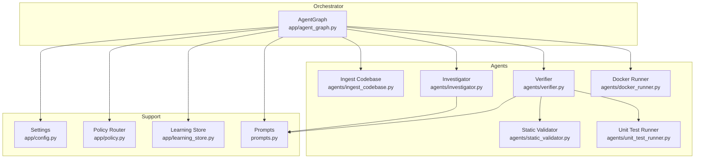
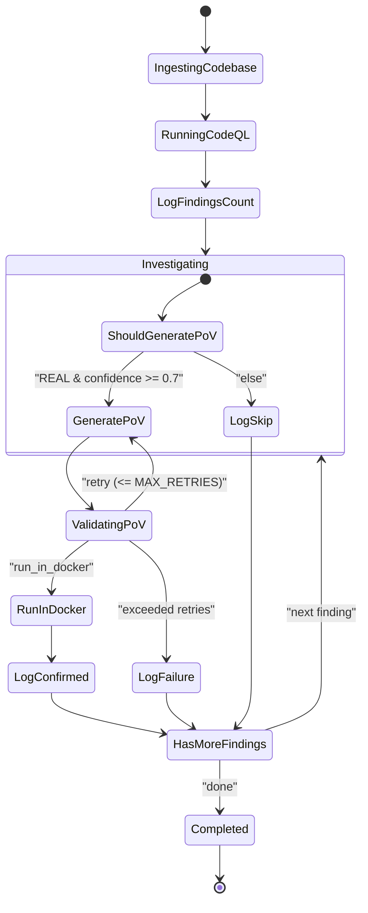
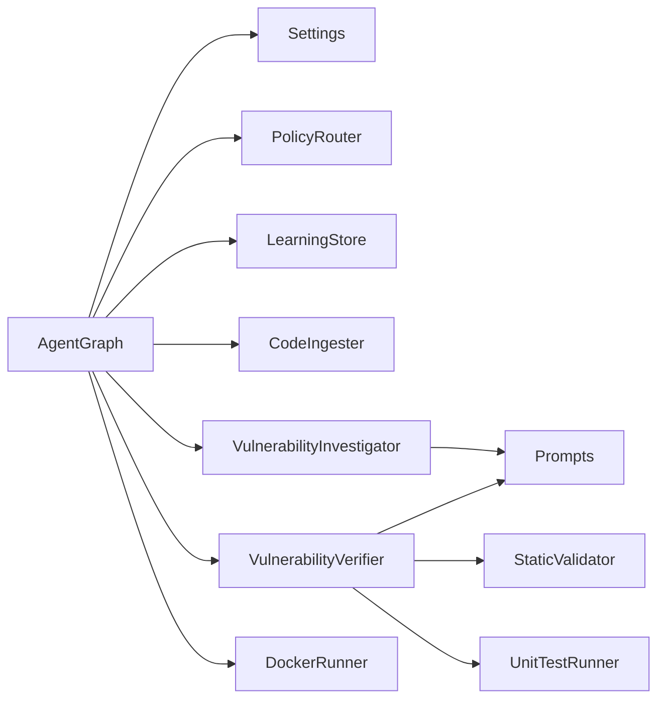

# Agent Graph Orchestration

<cite>
**Referenced Files in This Document**
- [agent_graph.py](file://app/agent_graph.py)
- [config.py](file://app/config.py)
- [policy.py](file://app/policy.py)
- [learning_store.py](file://app/learning_store.py)
- [ingest_codebase.py](file://agents/ingest_codebase.py)
- [investigator.py](file://agents/investigator.py)
- [verifier.py](file://agents/verifier.py)
- [docker_runner.py](file://agents/docker_runner.py)
- [static_validator.py](file://agents/static_validator.py)
- [unit_test_runner.py](file://agents/unit_test_runner.py)
- [prompts.py](file://prompts.py)
</cite>

## Table of Contents
1. [Introduction](#introduction)
2. [Project Structure](#project-structure)
3. [Core Components](#core-components)
4. [Architecture Overview](#architecture-overview)
5. [Detailed Component Analysis](#detailed-component-analysis)
6. [Dependency Analysis](#dependency-analysis)
7. [Performance Considerations](#performance-considerations)
8. [Troubleshooting Guide](#troubleshooting-guide)
9. [Conclusion](#conclusion)

## Introduction
This document explains AutoPoV’s LangGraph-based agent orchestration system for vulnerability detection and Proof-of-Vulnerability (PoV) generation. It covers the state machine architecture, workflow definition, agent coordination patterns, data models, node responsibilities, conditional edges, state transitions, error handling, execution examples, state persistence, debugging techniques, and performance considerations.

## Project Structure
AutoPoV organizes the orchestration in a single LangGraph module with typed state and modular agent components:
- Orchestrator: app/agent_graph.py defines the ScanState and VulnerabilityState models, the workflow graph, and node implementations.
- Agents: specialized modules under agents/ implement ingestion, investigation, PoV generation/validation, and Docker execution.
- Configuration and policies: app/config.py, app/policy.py, and app/learning_store.py manage runtime settings, model selection, and learning-driven routing.
- Prompts: prompts.py centralizes LLM prompts for investigation, PoV generation, validation, and retry analysis.

**Diagram sources**
- [agent_graph.py:82-168](file://app/agent_graph.py#L82-L168)
- [ingest_codebase.py:41-413](file://agents/ingest_codebase.py#L41-L413)
- [investigator.py:37-519](file://agents/investigator.py#L37-L519)
- [verifier.py:42-562](file://agents/verifier.py#L42-L562)
- [docker_runner.py:27-377](file://agents/docker_runner.py#L27-L377)
- [static_validator.py:22-305](file://agents/static_validator.py#L22-L305)
- [unit_test_runner.py:28-344](file://agents/unit_test_runner.py#L28-L344)
- [config.py:13-255](file://app/config.py#L13-L255)
- [policy.py:12-40](file://app/policy.py#L12-L40)
- [learning_store.py:14-256](file://app/learning_store.py#L14-L256)
- [prompts.py:7-424](file://prompts.py#L7-L424)

**Section sources**
- [agent_graph.py:82-168](file://app/agent_graph.py#L82-L168)
- [config.py:13-255](file://app/config.py#L13-L255)

## Core Components
- ScanState: orchestrator-level state capturing scan identity, status, codebase path, selected model, CWE list, findings, detected language, current finding index, timing, cost, logs, and error.
- VulnerabilityState: per-finding state including CVE ID, file path, line number, CWE type, code chunk, LLM verdict/explanation/confidence, PoV fields (script/path/result), retry count, inference time, cost, and final status.

Key responsibilities:
- ScanState drives iteration across findings and aggregates total cost and logs.
- VulnerabilityState stores the evolving result of investigation and PoV validation.

Validation rules and constraints:
- Confidence thresholds drive decisions (e.g., PoV generation requires confidence ≥ 0.7).
- Retry limits govern PoV regeneration attempts.
- Final statuses include confirmed, skipped, failed, and pending.

**Section sources**
- [agent_graph.py:45-80](file://app/agent_graph.py#L45-L80)

## Architecture Overview
The workflow is a LangGraph StateGraph with typed ScanState and deterministic edges. It proceeds from ingestion to automated discovery, CodeQL analysis, investigation, PoV generation, validation, and execution. Conditional edges route based on verdicts and validation outcomes.

**Diagram sources**
- [agent_graph.py:105-168](file://app/agent_graph.py#L105-L168)
- [agent_graph.py:1059-1110](file://app/agent_graph.py#L1059-L1110)

## Detailed Component Analysis

### Data Models

#### ScanState
Fields:
- scan_id: unique scan identifier
- status: orchestrator status (pending, ingesting, running_codeql, investigating, generating_pov, validating_pov, running_pov, completed, failed, skipped)
- codebase_path: absolute path to scanned code
- model_name: default model name
- cwes: list of CWEs to check
- findings: list of VulnerabilityState items
- preloaded_findings: optional list of findings to reuse
- detected_language: inferred language for CodeQL
- current_finding_idx: index of current finding under investigation
- start_time/end_time: ISO timestamps
- total_cost_usd: cumulative cost across findings
- logs: list of log entries
- error: optional error message

Validation rules:
- current_finding_idx must be within findings length.
- total_cost_usd accumulates per finding.
- status transitions are enforced by node logic.

**Section sources**
- [agent_graph.py:64-80](file://app/agent_graph.py#L64-L80)

#### VulnerabilityState
Fields:
- cve_id: optional CVE identifier
- filepath: relative path to file
- line_number: line index
- cwe_type: CWE identifier
- code_chunk: vulnerable code snippet
- llm_verdict: “REAL” or “FALSE_POSITIVE”
- llm_explanation: LLM rationale
- confidence: numeric confidence (0–1)
- pov_script: generated PoV script
- pov_path: optional path to PoV
- pov_result: execution result (stdout/stderr/exit code/time)
- retry_count: number of PoV generation attempts
- inference_time_s: seconds spent on LLM inference
- cost_usd: actual or estimated cost
- final_status: “pending”, “confirmed”, “skipped”, “failed”

Validation rules:
- llm_verdict and confidence guide conditional routing.
- retry_count caps PoV regeneration attempts.
- final_status updated by logging nodes.

**Section sources**
- [agent_graph.py:45-62](file://app/agent_graph.py#L45-L62)

### Workflow Nodes and Responsibilities

#### ingest_code
Responsibilities:
- Ingest codebase into vector store (ChromaDB) with chunking and embeddings.
- Progress callbacks log processed files.
- Non-fatal failures continue scan without vector store context.

Data transformations:
- Adds ingestion stats to logs.
- Sets status to ingesting.

Error handling:
- Exceptions caught and logged; scan continues.

**Section sources**
- [agent_graph.py:178-204](file://app/agent_graph.py#L178-L204)
- [ingest_codebase.py:207-313](file://agents/ingest_codebase.py#L207-L313)

#### run_codeql
Responsibilities:
- Detect language and create CodeQL database once per scan.
- Run queries per CWE and merge with autonomous discovery findings.
- Fallback to LLM-only analysis if CodeQL unavailable.

Data transformations:
- Populates findings with SARIF results.
- Merges heuristic and LLM candidates.

Error handling:
- Cleans up database after queries.
- Gracefully falls back to autonomous discovery.

**Section sources**
- [agent_graph.py:241-307](file://app/agent_graph.py#L241-L307)
- [agent_graph.py:309-341](file://app/agent_graph.py#L309-L341)
- [agent_graph.py:342-381](file://app/agent_graph.py#L342-L381)
- [agent_graph.py:382-505](file://app/agent_graph.py#L382-L505)
- [agent_graph.py:506-606](file://app/agent_graph.py#L506-L606)
- [agent_graph.py:607-689](file://app/agent_graph.py#L607-L689)

#### investigate
Responsibilities:
- Select model via policy router.
- Invoke investigator with RAG context and optional Joern analysis for CWE-416.
- Record investigation metrics to learning store.

Data transformations:
- Updates finding with verdict, explanation, confidence, inference time, and cost.
- Aggregates total cost.

Error handling:
- Defaults to UNKNOWN verdict on failure; logs stack traces.

**Section sources**
- [agent_graph.py:691-777](file://app/agent_graph.py#L691-L777)
- [investigator.py:270-432](file://agents/investigator.py#L270-L432)
- [policy.py:18-32](file://app/policy.py#L18-L32)
- [learning_store.py:61-94](file://app/learning_store.py#L61-L94)

#### generate_pov
Responsibilities:
- Generate PoV script using verifier with language-aware prompts.
- Track PoV model usage and cost.

Data transformations:
- Stores PoV script and metadata in finding.
- Accumulates cost.

**Section sources**
- [agent_graph.py:779-840](file://app/agent_graph.py#L779-L840)
- [verifier.py:90-224](file://agents/verifier.py#L90-L224)

#### validate_pov
Responsibilities:
- Hybrid validation: static analysis, unit test execution, and LLM analysis.
- Determines whether PoV will trigger and records validation method.

Data transformations:
- Stores validation_result in finding.

**Section sources**
- [agent_graph.py:842-903](file://app/agent_graph.py#L842-L903)
- [verifier.py:225-387](file://agents/verifier.py#L225-L387)
- [static_validator.py:123-233](file://agents/static_validator.py#L123-L233)
- [unit_test_runner.py:34-116](file://agents/unit_test_runner.py#L34-L116)

#### run_in_docker
Responsibilities:
- Execute PoV in Docker container with resource limits.
- If Docker unavailable or inconclusive, use unit/static results or skip.

Data transformations:
- Records execution result and success flag.
- Persists PoV outcome to learning store.

**Section sources**
- [agent_graph.py:905-1004](file://app/agent_graph.py#L905-L1004)
- [docker_runner.py:62-192](file://agents/docker_runner.py#L62-L192)
- [learning_store.py:96-123](file://app/learning_store.py#L96-L123)

#### Logging nodes
- log_confirmed: marks current finding as confirmed, increments index, sets end time when done.
- log_skip: marks as skipped, increments index, sets end time when done.
- log_failure: marks as failed, increments index, sets end time when done.

**Section sources**
- [agent_graph.py:1006-1057](file://app/agent_graph.py#L1006-L1057)

### Conditional Edge Logic and State Transitions
- From investigate:
  - REAL and confidence ≥ 0.7 → generate_pov
  - Else → log_skip
- From validate_pov:
  - run_in_docker if PoV exists and retry_count < MAX_RETRIES
  - generate_pov to retry if retry_count < MAX_RETRIES
  - log_failure if retries exhausted
- After logging:
  - HasMoreFindings checks current_finding_idx vs total; loop back to investigate or end

Decision functions:
- _should_generate_pov: evaluates verdict and confidence
- _should_run_pov: checks PoV presence and retry count
- _has_more_findings: advances index or completes scan

**Section sources**
- [agent_graph.py:1059-1110](file://app/agent_graph.py#L1059-L1110)
- [agent_graph.py:111-168](file://app/agent_graph.py#L111-L168)

### Error Handling Mechanisms
- Ingestion: non-fatal; continues without vector store context.
- CodeQL: fallback to LLM-only and autonomous discovery; cleans up database.
- Investigation: default UNKNOWN verdict with error explanation; logs stack traces.
- Validation: collects issues and suggestions; uses static/unit/LLM judiciously.
- Docker: graceful skip with stderr note; cleans up temp directories.

**Section sources**
- [agent_graph.py:199-202](file://app/agent_graph.py#L199-L202)
- [agent_graph.py:293-299](file://app/agent_graph.py#L293-L299)
- [agent_graph.py:727-738](file://app/agent_graph.py#L727-L738)
- [agent_graph.py:974-990](file://app/agent_graph.py#L974-L990)
- [docker_runner.py:81-90](file://agents/docker_runner.py#L81-L90)

### Examples of Workflow Execution
- Typical end-to-end:
  - ingest_code → run_codeql → log_findings_count → investigate → generate_pov → validate_pov → run_in_docker → log_confirmed → has_more_findings → investigate (repeat) → completed.
- Fallback scenario:
  - CodeQL unavailable → run LLM-only analysis and heuristic discovery → investigate → generate_pov → validate_pov → run_in_docker.

**Section sources**
- [agent_graph.py:105-168](file://app/agent_graph.py#L105-L168)
- [agent_graph.py:256-262](file://app/agent_graph.py#L256-L262)
- [agent_graph.py:607-689](file://app/agent_graph.py#L607-L689)

### State Persistence and Debugging
- Logs appended to state and streamed to scan manager in real-time.
- Learning store persists investigation and PoV outcomes for model recommendation.
- Cost tracking uses actual token usage when available; otherwise estimates.

Debugging tips:
- Inspect logs for each node invocation and error messages.
- Review validation_result and learning store summaries for model performance insights.
- Verify CodeQL availability and database creation steps.

**Section sources**
- [agent_graph.py:1111-1130](file://app/agent_graph.py#L1111-L1130)
- [learning_store.py:61-123](file://app/learning_store.py#L61-L123)
- [config.py:162-211](file://app/config.py#L162-L211)

## Dependency Analysis
The orchestrator depends on:
- Configuration for tool availability and limits
- Policy router for model selection
- Learning store for routing signals
- Agent modules for domain tasks

**Diagram sources**
- [agent_graph.py:19-29](file://app/agent_graph.py#L19-L29)
- [config.py:13-255](file://app/config.py#L13-L255)
- [policy.py:12-40](file://app/policy.py#L12-L40)
- [learning_store.py:14-256](file://app/learning_store.py#L14-L256)
- [ingest_codebase.py:41-413](file://agents/ingest_codebase.py#L41-L413)
- [investigator.py:37-519](file://agents/investigator.py#L37-L519)
- [verifier.py:42-562](file://agents/verifier.py#L42-L562)
- [docker_runner.py:27-377](file://agents/docker_runner.py#L27-L377)
- [static_validator.py:22-305](file://agents/static_validator.py#L22-L305)
- [unit_test_runner.py:28-344](file://agents/unit_test_runner.py#L28-L344)
- [prompts.py:7-424](file://prompts.py#L7-L424)

**Section sources**
- [agent_graph.py:19-29](file://app/agent_graph.py#L19-L29)

## Performance Considerations
- Cost control:
  - Token-based cost calculation preferred; fallback estimation discouraged.
  - MAX_COST_USD and cost tracking enabled by default.
- Resource limits:
  - Docker memory and CPU quotas applied; timeouts enforced.
  - CodeQL database created once and cleaned up after queries.
- Throughput:
  - Batched ingestion to ChromaDB.
  - LLM-only analysis capped to first N files to control cost.
- Scalability:
  - Modular agents enable independent scaling.
  - Persistent learning store enables adaptive model selection.

[No sources needed since this section provides general guidance]

## Troubleshooting Guide
Common issues and resolutions:
- CodeQL not available:
  - Use LLM-only analysis and heuristic discovery; verify settings and PATH.
- Ingestion failures:
  - Continue scan without vector store; inspect warnings and errors.
- Investigation errors:
  - Defaults to UNKNOWN; review logs and stack traces; adjust prompts or model.
- Validation inconclusive:
  - Static analysis with high confidence can confirm; unit test execution provides evidence; LLM analysis as last resort.
- Docker not available:
  - Skip Docker execution; rely on unit/static results; verify Docker daemon and image availability.

**Section sources**
- [agent_graph.py:256-262](file://app/agent_graph.py#L256-L262)
- [agent_graph.py:199-202](file://app/agent_graph.py#L199-L202)
- [agent_graph.py:727-738](file://app/agent_graph.py#L727-L738)
- [agent_graph.py:974-990](file://app/agent_graph.py#L974-L990)
- [docker_runner.py:50-61](file://agents/docker_runner.py#L50-L61)

## Conclusion
AutoPoV’s LangGraph-based orchestration coordinates ingestion, discovery, investigation, PoV generation, validation, and execution with robust conditional logic and state persistence. The typed state models and modular agents enable maintainability, observability, and adaptability. By leveraging configuration, policy routing, and learning store insights, the system balances accuracy and cost while supporting scalable vulnerability detection workflows.