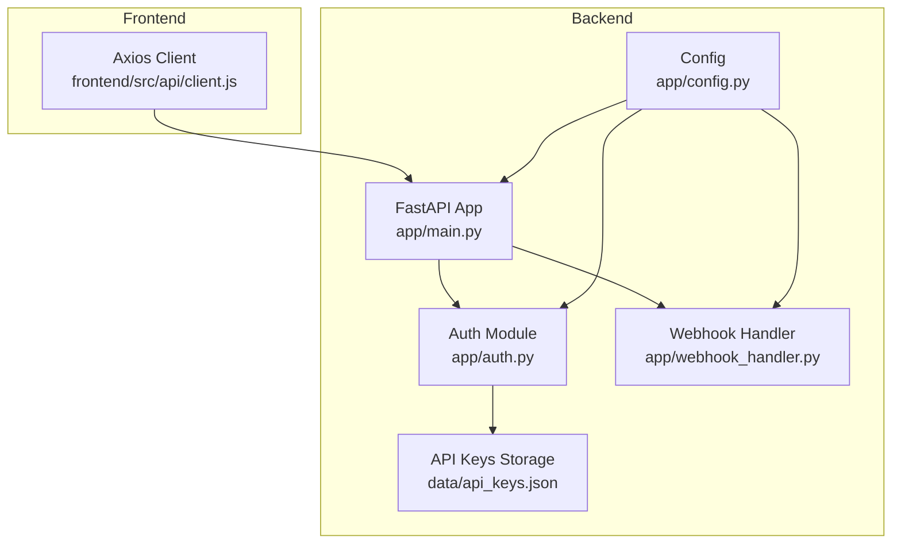
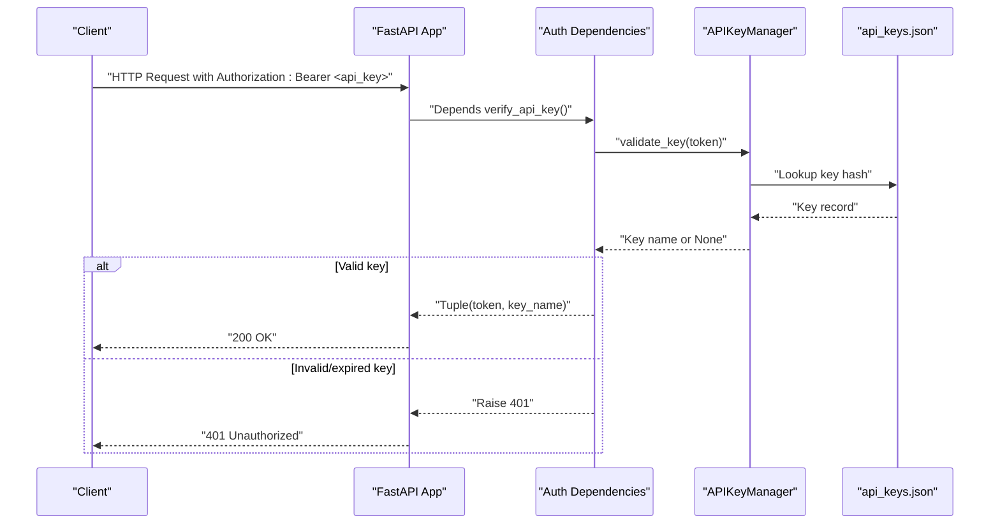
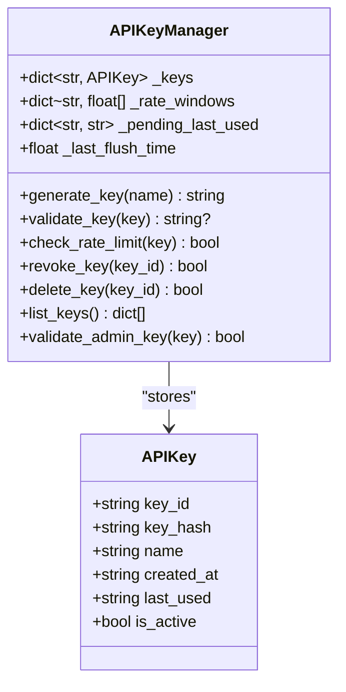
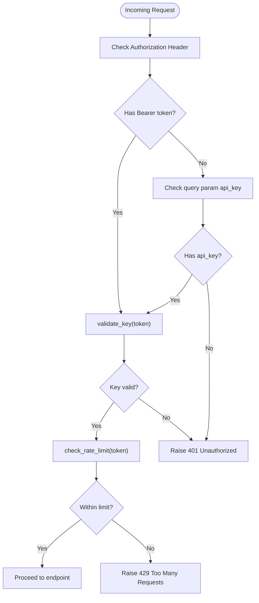
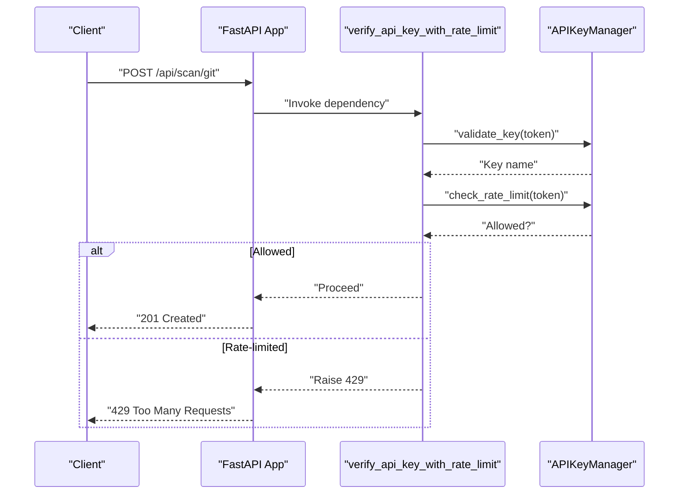
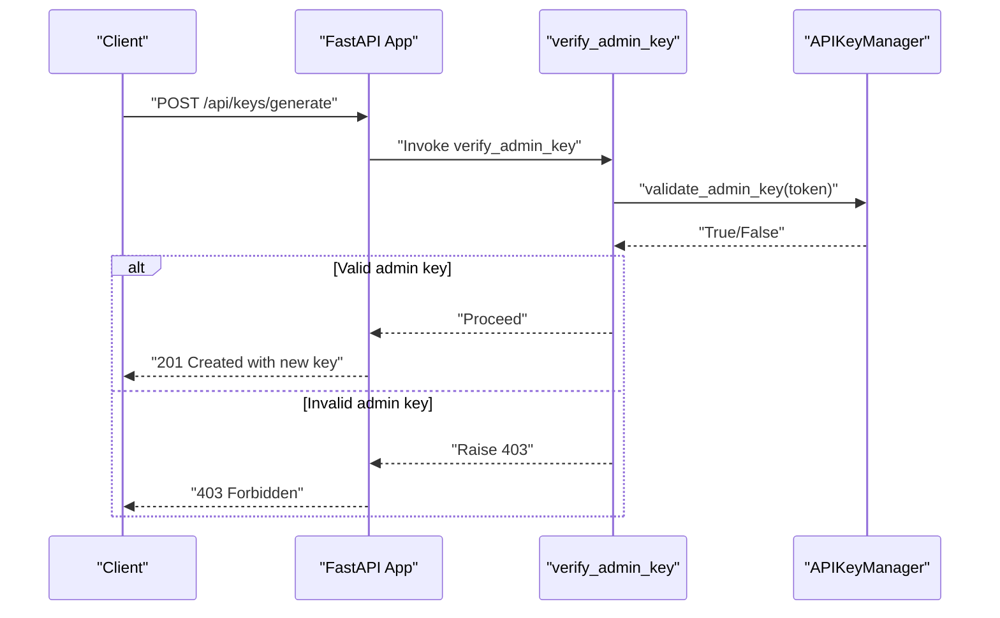
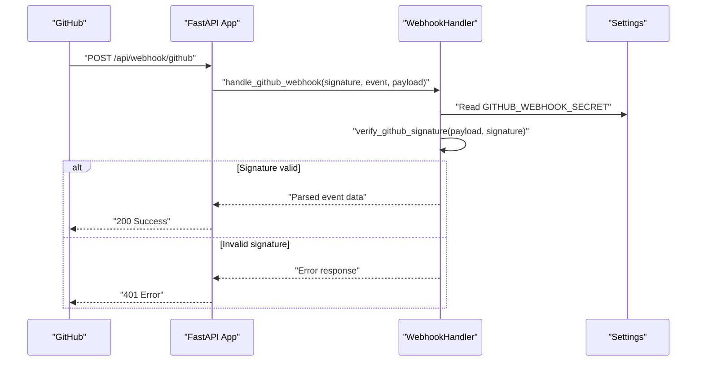
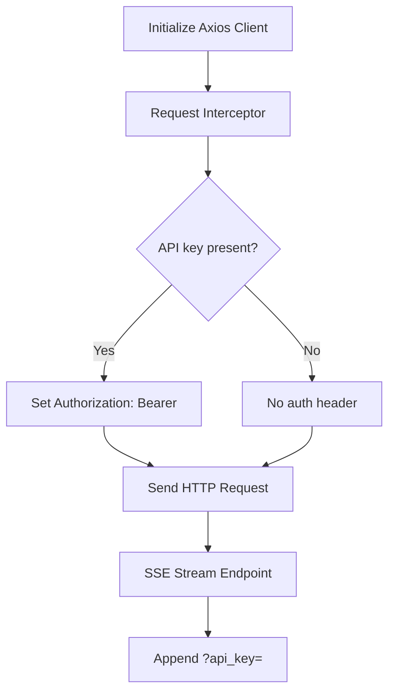
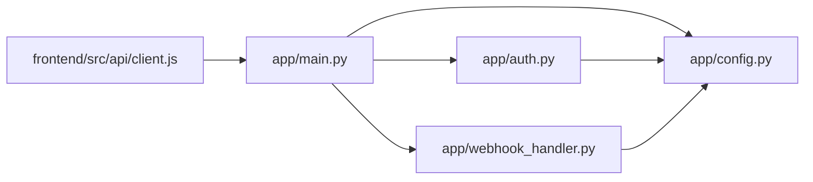

# Authentication & Authorization

<cite>
**Referenced Files in This Document**
- [app/auth.py](file://app/auth.py)
- [app/main.py](file://app/main.py)
- [app/config.py](file://app/config.py)
- [app/webhook_handler.py](file://app/webhook_handler.py)
- [frontend/src/api/client.js](file://frontend/src/api/client.js)
- [data/api_keys.json](file://data/api_keys.json)
- [tests/test_auth.py](file://tests/test_auth.py)
</cite>

## Table of Contents
1. [Introduction](#introduction)
2. [Project Structure](#project-structure)
3. [Core Components](#core-components)
4. [Architecture Overview](#architecture-overview)
5. [Detailed Component Analysis](#detailed-component-analysis)
6. [Dependency Analysis](#dependency-analysis)
7. [Performance Considerations](#performance-considerations)
8. [Troubleshooting Guide](#troubleshooting-guide)
9. [Conclusion](#conclusion)

## Introduction
This document explains AutoPoV’s authentication and authorization system. It covers the API key–based access control, rate limiting, webhook authentication, and how endpoints are protected. It also outlines best practices for securing the system, including token lifecycle, audit logging, and integration considerations.

AutoPoV does not implement JWT-based authentication or role-based access control (RBAC) in the backend. Instead, it uses a simple API key scheme with admin-only endpoints for administrative tasks.

## Project Structure
The authentication and authorization logic is primarily implemented in the backend FastAPI application:
- API key generation, validation, and rate limiting live in the authentication module.
- Protected endpoints are decorated with FastAPI dependency injection that validates API keys.
- Webhook handlers authenticate incoming events from Git providers using HMAC signatures.
- The frontend sends API keys via Authorization headers or query parameters for streaming endpoints.

**Diagram sources**
- [app/main.py:114-122](file://app/main.py#L114-L122)
- [app/auth.py:40-52](file://app/auth.py#L40-L52)
- [app/webhook_handler.py:15-24](file://app/webhook_handler.py#L15-L24)
- [app/config.py:13-28](file://app/config.py#L13-L28)
- [frontend/src/api/client.js:11-25](file://frontend/src/api/client.js#L11-L25)

**Section sources**
- [app/main.py:114-122](file://app/main.py#L114-L122)
- [app/auth.py:40-52](file://app/auth.py#L40-L52)
- [app/webhook_handler.py:15-24](file://app/webhook_handler.py#L15-L24)
- [app/config.py:13-28](file://app/config.py#L13-L28)
- [frontend/src/api/client.js:11-25](file://frontend/src/api/client.js#L11-L25)

## Core Components
- APIKeyManager: Generates, stores, validates, and rate-limits API keys. Supports admin-only operations.
- FastAPI dependencies: verify_api_key, verify_api_key_with_rate_limit, verify_admin_key.
- Webhook handlers: GitHub and GitLab webhook authenticators using HMAC signatures.
- Frontend client: Adds Authorization headers and passes API keys via query parameters for streaming.

Key behaviors:
- API keys are stored as SHA-256 hashes with plaintext names and timestamps.
- Rate limiting is enforced per key hash within a sliding window.
- Admin-only endpoints require a dedicated admin API key configured via environment variables.
- Webhooks are authenticated using shared secrets and HMAC signatures.

**Section sources**
- [app/auth.py:40-186](file://app/auth.py#L40-L186)
- [app/auth.py:192-250](file://app/auth.py#L192-L250)
- [app/webhook_handler.py:15-74](file://app/webhook_handler.py#L15-L74)
- [frontend/src/api/client.js:18-25](file://frontend/src/api/client.js#L18-L25)

## Architecture Overview
The authentication flow is centralized around FastAPI dependencies and a shared configuration module. Admin-only endpoints are gated by a separate admin key. Webhooks are authenticated independently using provider-specific signatures.

**Diagram sources**
- [app/auth.py:192-218](file://app/auth.py#L192-L218)
- [app/auth.py:107-127](file://app/auth.py#L107-L127)
- [data/api_keys.json:1-42](file://data/api_keys.json#L1-42)

**Section sources**
- [app/auth.py:192-218](file://app/auth.py#L192-L218)
- [app/auth.py:107-127](file://app/auth.py#L107-L127)
- [data/api_keys.json:1-42](file://data/api_keys.json#L1-42)

## Detailed Component Analysis

### API Key Management
- Generation: Creates a random key ID and a random secret, hashes the secret with SHA-256, and persists metadata.
- Validation: Compares the hashed input against stored hashes using constant-time comparison; tracks last_used updates with debounced disk writes.
- Rate limiting: Maintains a sliding window of timestamps per key hash and rejects requests exceeding the configured limit.
- Admin-only operations: Revocation, deletion, listing, and admin key verification using HMAC comparisons.

**Diagram sources**
- [app/auth.py:30-186](file://app/auth.py#L30-L186)

**Section sources**
- [app/auth.py:30-186](file://app/auth.py#L30-L186)
- [data/api_keys.json:1-42](file://data/api_keys.json#L1-42)

### Authentication Dependencies
- verify_api_key: Extracts Bearer token from Authorization header or api_key from query parameters; raises 401 on failure.
- verify_api_key_with_rate_limit: Same as above plus checks per-key rate limit; raises 429 if exceeded.
- verify_admin_key: Validates admin-only access using a dedicated admin API key.

**Diagram sources**
- [app/auth.py:192-236](file://app/auth.py#L192-L236)

**Section sources**
- [app/auth.py:192-236](file://app/auth.py#L192-L236)

### Protected Endpoints
- Public health endpoint: No authentication required.
- Config endpoint: Requires a valid API key.
- Scan endpoints: Require a valid API key and enforce rate limits for triggering scans.
- History, reports, metrics, learning summary: Require a valid API key.
- Admin endpoints: Generate/list/revoke keys and cleanup require admin API key.

**Diagram sources**
- [app/main.py:204-285](file://app/main.py#L204-L285)
- [app/auth.py:221-236](file://app/auth.py#L221-L236)

**Section sources**
- [app/main.py:176-201](file://app/main.py#L176-L201)
- [app/main.py:204-285](file://app/main.py#L204-L285)
- [app/main.py:587-595](file://app/main.py#L587-L595)
- [app/main.py:599-644](file://app/main.py#L599-L644)
- [app/main.py:745-757](file://app/main.py#L745-L757)

### Admin-Only Endpoints
- Generate API key: Requires admin API key.
- List API keys: Requires admin API key.
- Revoke API key: Requires admin API key.
- Cleanup old results: Requires admin API key.

**Diagram sources**
- [app/main.py:692-702](file://app/main.py#L692-L702)
- [app/auth.py:239-250](file://app/auth.py#L239-L250)

**Section sources**
- [app/main.py:692-702](file://app/main.py#L692-L702)
- [app/main.py:705-724](file://app/main.py#L705-L724)
- [app/main.py:726-741](file://app/main.py#L726-L741)
- [app/auth.py:239-250](file://app/auth.py#L239-L250)

### Webhook Authentication
- GitHub: Verifies X-Hub-Signature-256 using HMAC-SHA256 against a shared secret.
- GitLab: Verifies X-Gitlab-Token using HMAC comparison against a shared secret.
- Events parsed include push and pull/merge request triggers; only specific events initiate scans.

**Diagram sources**
- [app/main.py:647-666](file://app/main.py#L647-L666)
- [app/webhook_handler.py:196-265](file://app/webhook_handler.py#L196-L265)
- [app/webhook_handler.py:25-55](file://app/webhook_handler.py#L25-L55)
- [app/config.py:69-71](file://app/config.py#L69-L71)

**Section sources**
- [app/main.py:647-666](file://app/main.py#L647-L666)
- [app/webhook_handler.py:196-265](file://app/webhook_handler.py#L196-L265)
- [app/webhook_handler.py:25-55](file://app/webhook_handler.py#L25-L55)
- [app/config.py:69-71](file://app/config.py#L69-L71)

### Frontend Authentication Behavior
- Axios client adds Authorization: Bearer <api_key> to all requests.
- For Server-Sent Events (SSE), the API key is passed as a query parameter because Authorization headers are not supported by EventSource.

**Diagram sources**
- [frontend/src/api/client.js:11-25](file://frontend/src/api/client.js#L11-L25)
- [frontend/src/api/client.js:44-47](file://frontend/src/api/client.js#L44-L47)

**Section sources**
- [frontend/src/api/client.js:11-25](file://frontend/src/api/client.js#L11-L25)
- [frontend/src/api/client.js:44-47](file://frontend/src/api/client.js#L44-L47)

## Dependency Analysis
- app/main.py depends on app/auth.py for authentication dependencies and app/config.py for configuration.
- app/auth.py depends on app/config.py for admin key and storage path.
- app/webhook_handler.py depends on app/config.py for provider secrets.
- frontend/src/api/client.js depends on environment variables for API URL and API key fallback.

**Diagram sources**
- [app/main.py:19-27](file://app/main.py#L19-L27)
- [app/auth.py:19](file://app/auth.py#L19)
- [app/webhook_handler.py:12](file://app/webhook_handler.py#L12)
- [frontend/src/api/client.js:3](file://frontend/src/api/client.js#L3)

**Section sources**
- [app/main.py:19-27](file://app/main.py#L19-L27)
- [app/auth.py:19](file://app/auth.py#L19)
- [app/webhook_handler.py:12](file://app/webhook_handler.py#L12)
- [frontend/src/api/client.js:3](file://frontend/src/api/client.js#L3)

## Performance Considerations
- API key validation uses constant-time comparison to prevent timing attacks.
- Rate limiting uses a sliding window with O(n) cleanup per request; acceptable for moderate traffic.
- Debounced disk writes reduce I/O overhead for last_used updates.
- Webhook signature verification uses HMAC with constant-time comparison.

Recommendations:
- Consider caching validated keys in memory for high-throughput scenarios.
- Monitor rate-limiting thresholds and adjust window size and max scans per key.
- Use asynchronous persistence for high-frequency write patterns.

**Section sources**
- [app/auth.py:107-127](file://app/auth.py#L107-L127)
- [app/auth.py:129-146](file://app/auth.py#L129-L146)
- [app/auth.py:79-82](file://app/auth.py#L79-L82)
- [app/webhook_handler.py:52-55](file://app/webhook_handler.py#L52-L55)

## Troubleshooting Guide
Common issues and resolutions:
- 401 Unauthorized:
  - Cause: Missing or invalid Authorization header or query parameter.
  - Resolution: Ensure the Authorization header is set to Bearer <api_key> or pass api_key as a query parameter for SSE.
- 429 Too Many Requests:
  - Cause: Exceeded per-key rate limit within the configured window.
  - Resolution: Wait for the window to reset or reduce request frequency.
- 403 Forbidden (Admin endpoints):
  - Cause: Missing or incorrect admin API key.
  - Resolution: Provide the correct ADMIN_API_KEY via environment variable.
- Webhook failures:
  - Cause: Incorrect provider secret or malformed payload.
  - Resolution: Verify GITHUB_WEBHOOK_SECRET or GITLAB_WEBHOOK_SECRET and ensure signatures match.

Verification tips:
- Use the health endpoint to confirm service availability.
- Generate and list API keys to validate admin operations.
- Inspect api_keys.json for persisted keys and last_used timestamps.

**Section sources**
- [app/auth.py:212-218](file://app/auth.py#L212-L218)
- [app/auth.py:230-235](file://app/auth.py#L230-L235)
- [app/auth.py:243-248](file://app/auth.py#L243-L248)
- [app/webhook_handler.py:213-218](file://app/webhook_handler.py#L213-L218)
- [app/main.py:176-185](file://app/main.py#L176-L185)
- [tests/test_auth.py:27-55](file://tests/test_auth.py#L27-L55)

## Conclusion
AutoPoV implements a straightforward, secure API key–based access control system:
- Strong cryptographic hashing and constant-time comparisons mitigate common attack vectors.
- Per-key rate limiting protects against abuse.
- Admin-only endpoints are secured with a dedicated admin API key.
- Webhooks are authenticated using HMAC signatures with provider-specific headers.
- The frontend integrates seamlessly with the backend using Authorization headers and query parameters for SSE.

Future enhancements could include:
- Optional JWT-based sessions for user-facing flows.
- Role-based access control (RBAC) for granular permissions.
- Audit logging for all protected actions.
- Token rotation and refresh mechanisms.
- Centralized rate limiting with Redis or similar.

[No sources needed since this section summarizes without analyzing specific files]