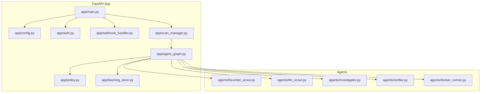
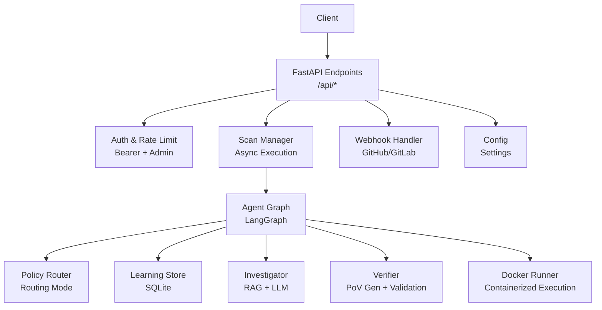
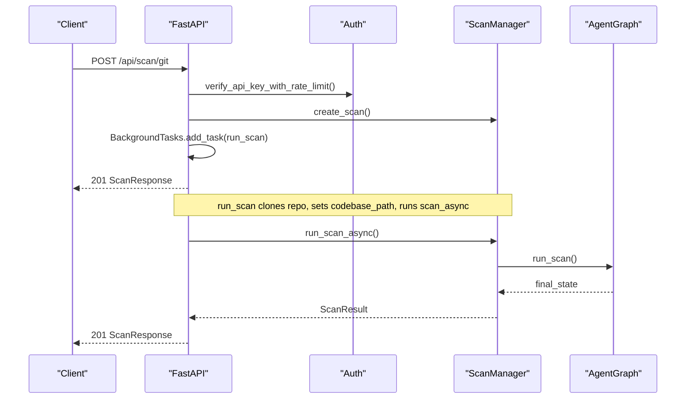
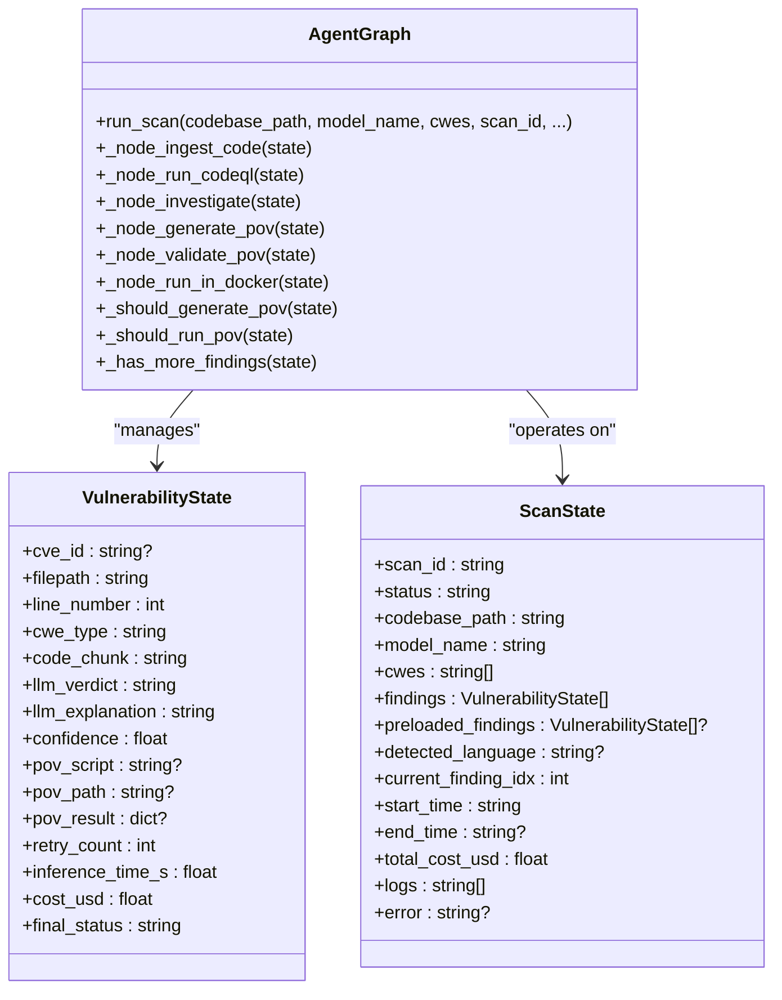
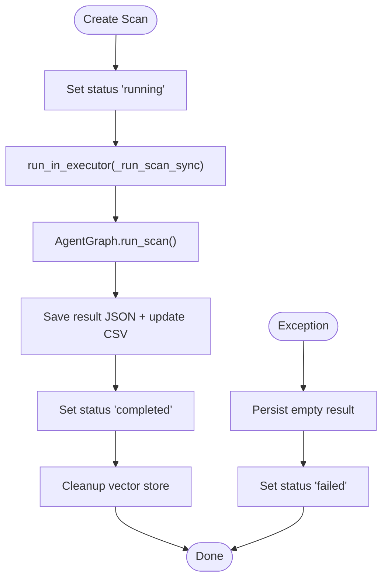
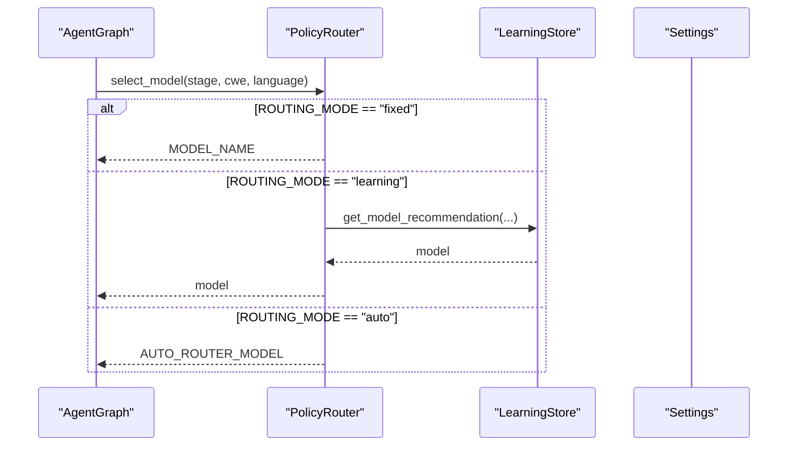
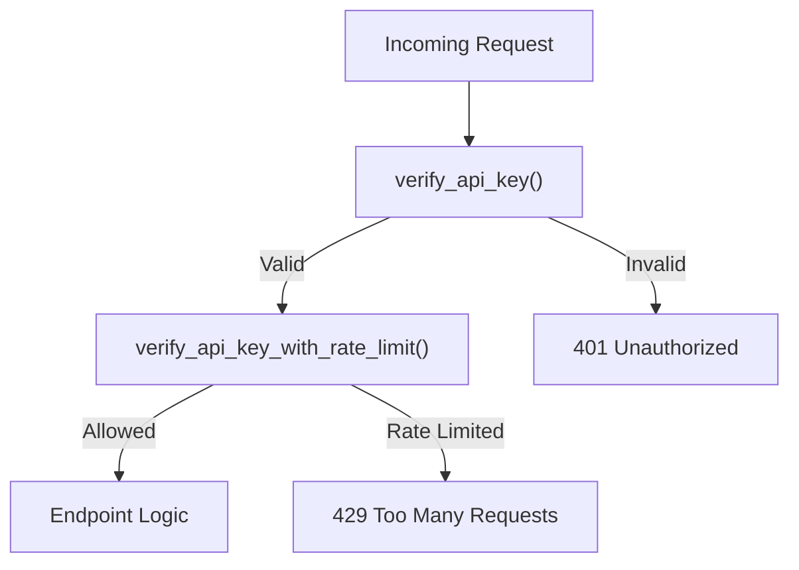
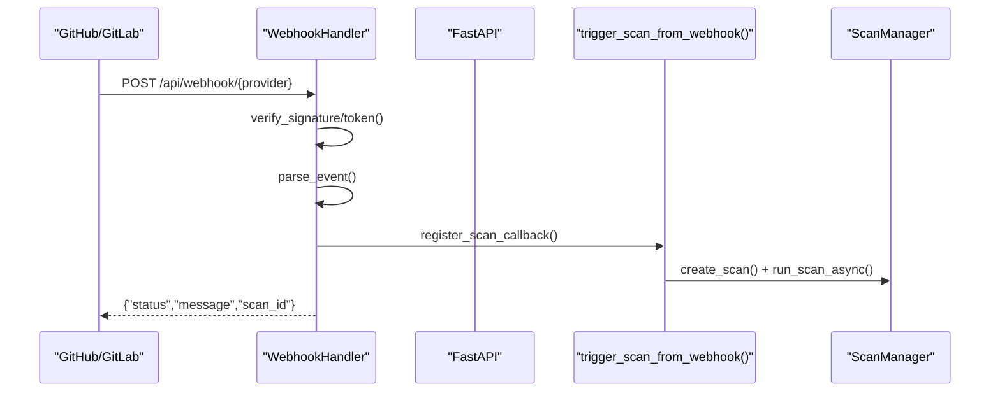
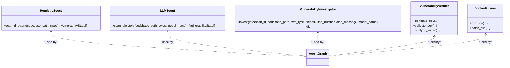
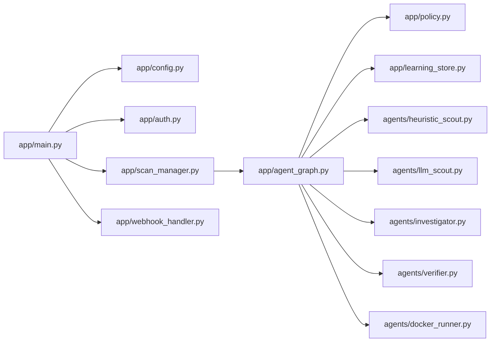

# Backend Services

<cite>
**Referenced Files in This Document**
- [app/main.py](file://app/main.py)
- [app/agent_graph.py](file://app/agent_graph.py)
- [app/scan_manager.py](file://app/scan_manager.py)
- [app/config.py](file://app/config.py)
- [app/auth.py](file://app/auth.py)
- [app/policy.py](file://app/policy.py)
- [app/learning_store.py](file://app/learning_store.py)
- [app/webhook_handler.py](file://app/webhook_handler.py)
- [agents/heuristic_scout.py](file://agents/heuristic_scout.py)
- [agents/llm_scout.py](file://agents/llm_scout.py)
- [agents/investigator.py](file://agents/investigator.py)
- [agents/verifier.py](file://agents/verifier.py)
- [agents/docker_runner.py](file://agents/docker_runner.py)
</cite>

## Table of Contents
1. [Introduction](#introduction)
2. [Project Structure](#project-structure)
3. [Core Components](#core-components)
4. [Architecture Overview](#architecture-overview)
5. [Detailed Component Analysis](#detailed-component-analysis)
6. [Dependency Analysis](#dependency-analysis)
7. [Performance Considerations](#performance-considerations)
8. [Troubleshooting Guide](#troubleshooting-guide)
9. [Conclusion](#conclusion)
10. [Appendices](#appendices)

## Introduction
This document describes the backend services powering AutoPoV, an autonomous framework for discovering and validating software vulnerabilities using LLM-driven agents. It covers the FastAPI application structure, REST endpoints, request/response handling, the agent graph orchestration system, scan lifecycle management, adaptive model routing, authentication and rate limiting, configuration, webhook processing, and report generation. It also includes operational guidance for deployment, monitoring, and maintenance.

## Project Structure
The backend is organized around a FastAPI application that exposes REST endpoints, delegates orchestration to a LangGraph-based agent graph, manages scan lifecycles, and integrates with agents for code ingestion, vulnerability investigation, PoV generation, validation, and containerized execution. Supporting modules handle configuration, authentication, policy-based model routing, learning store persistence, and webhook processing.

**Diagram sources**
- [app/main.py:114-122](file://app/main.py#L114-L122)
- [app/agent_graph.py:82-168](file://app/agent_graph.py#L82-L168)
- [app/scan_manager.py:47-72](file://app/scan_manager.py#L47-L72)
- [app/config.py:13-254](file://app/config.py#L13-L254)
- [app/auth.py:192-255](file://app/auth.py#L192-L255)
- [app/policy.py:12-39](file://app/policy.py#L12-L39)
- [app/learning_store.py:14-255](file://app/learning_store.py#L14-L255)
- [app/webhook_handler.py:15-362](file://app/webhook_handler.py#L15-L362)
- [agents/heuristic_scout.py:13-241](file://agents/heuristic_scout.py#L13-L241)
- [agents/llm_scout.py:32-207](file://agents/llm_scout.py#L32-L207)
- [agents/investigator.py:37-518](file://agents/investigator.py#L37-L518)
- [agents/verifier.py:42-561](file://agents/verifier.py#L42-L561)
- [agents/docker_runner.py:27-376](file://agents/docker_runner.py#L27-L376)

**Section sources**
- [app/main.py:114-122](file://app/main.py#L114-L122)
- [app/agent_graph.py:82-168](file://app/agent_graph.py#L82-L168)
- [app/scan_manager.py:47-72](file://app/scan_manager.py#L47-L72)
- [app/config.py:13-254](file://app/config.py#L13-L254)
- [app/auth.py:192-255](file://app/auth.py#L192-L255)
- [app/policy.py:12-39](file://app/policy.py#L12-L39)
- [app/learning_store.py:14-255](file://app/learning_store.py#L14-L255)
- [app/webhook_handler.py:15-362](file://app/webhook_handler.py#L15-L362)
- [agents/heuristic_scout.py:13-241](file://agents/heuristic_scout.py#L13-L241)
- [agents/llm_scout.py:32-207](file://agents/llm_scout.py#L32-L207)
- [agents/investigator.py:37-518](file://agents/investigator.py#L37-L518)
- [agents/verifier.py:42-561](file://agents/verifier.py#L42-L561)
- [agents/docker_runner.py:27-376](file://agents/docker_runner.py#L27-L376)

## Core Components
- FastAPI application with CORS, lifespan hooks, and endpoint groups for health, scans, history, reports, webhooks, API keys, and metrics.
- Agent graph orchestrating vulnerability discovery and validation via LangGraph nodes and conditional edges.
- Scan manager coordinating scan lifecycle, background execution, persistence, and metrics.
- Adaptive model routing via policy router integrating with a learning store.
- Authentication with bearer tokens, admin keys, and rate limiting.
- Webhook handlers for GitHub and GitLab with signature/token verification and event parsing.
- Agents for heuristic/LLM-based candidate discovery, investigation, PoV generation/validation, and Docker-based execution.

**Section sources**
- [app/main.py:175-767](file://app/main.py#L175-L767)
- [app/agent_graph.py:82-168](file://app/agent_graph.py#L82-L168)
- [app/scan_manager.py:47-662](file://app/scan_manager.py#L47-L662)
- [app/policy.py:12-39](file://app/policy.py#L12-L39)
- [app/learning_store.py:14-255](file://app/learning_store.py#L14-L255)
- [app/auth.py:192-255](file://app/auth.py#L192-L255)
- [app/webhook_handler.py:15-362](file://app/webhook_handler.py#L15-L362)

## Architecture Overview
The backend follows a layered architecture:
- Presentation layer: FastAPI endpoints handling requests, authentication, and streaming responses.
- Orchestration layer: Agent graph implementing a state machine for vulnerability discovery and validation.
- Management layer: Scan manager encapsulating scan state, persistence, and metrics.
- Integration layer: Agents for code ingestion, investigation, PoV generation/validation, and containerized execution.
- Persistence and routing: Learning store and policy router for adaptive model selection.

**Diagram sources**
- [app/main.py:175-767](file://app/main.py#L175-L767)
- [app/agent_graph.py:82-168](file://app/agent_graph.py#L82-L168)
- [app/scan_manager.py:234-264](file://app/scan_manager.py#L234-L264)
- [app/policy.py:12-39](file://app/policy.py#L12-L39)
- [app/learning_store.py:14-255](file://app/learning_store.py#L14-L255)
- [app/auth.py:192-255](file://app/auth.py#L192-L255)
- [app/webhook_handler.py:15-362](file://app/webhook_handler.py#L15-L362)
- [app/config.py:13-254](file://app/config.py#L13-L254)

## Detailed Component Analysis

### FastAPI Application and REST Endpoints
- Health and configuration endpoints expose system readiness and runtime settings.
- Scan endpoints support Git repositories, ZIP uploads, and raw code pastes, with background task execution and SSE streaming.
- Replay and cancellation endpoints enable iterative analysis and control.
- History, metrics, and report endpoints provide insights and artifacts.
- Webhook endpoints integrate with GitHub and GitLab for CI-driven scanning.
- Admin endpoints manage API keys and cleanup old results.

**Diagram sources**
- [app/main.py:204-285](file://app/main.py#L204-L285)
- [app/scan_manager.py:234-264](file://app/scan_manager.py#L234-L264)
- [app/agent_graph.py:82-168](file://app/agent_graph.py#L82-L168)

**Section sources**
- [app/main.py:175-767](file://app/main.py#L175-L767)
- [app/scan_manager.py:47-662](file://app/scan_manager.py#L47-L662)

### Agent Graph Orchestration
The agent graph defines a state machine with nodes for ingestion, CodeQL analysis, investigation, PoV generation, validation, and containerized execution. Conditional edges route findings based on investigation outcomes and validation results. The graph maintains per-finding state and aggregates metrics.

**Diagram sources**
- [app/agent_graph.py:82-168](file://app/agent_graph.py#L82-L168)
- [app/agent_graph.py:45-80](file://app/agent_graph.py#L45-L80)

**Section sources**
- [app/agent_graph.py:82-168](file://app/agent_graph.py#L82-L168)
- [app/agent_graph.py:178-777](file://app/agent_graph.py#L178-L777)

### Scan Management System
The scan manager coordinates scan creation, asynchronous execution, persistence, and cleanup. It maintains an in-memory registry of active scans, thread-safe logging, and CSV-based history. It supports replay scans with preloaded findings and integrates with the agent graph.

**Diagram sources**
- [app/scan_manager.py:234-365](file://app/scan_manager.py#L234-L365)
- [app/scan_manager.py:367-418](file://app/scan_manager.py#L367-L418)

**Section sources**
- [app/scan_manager.py:47-662](file://app/scan_manager.py#L47-L662)

### Adaptive Model Routing and Learning Store
The policy router selects models based on routing mode:
- Fixed: uses a configured model.
- Auto router: uses a configurable auto-routing model.
- Learning: selects models based on historical performance from the learning store.

The learning store persists investigation and PoV run outcomes to SQLite, enabling model recommendation and performance metrics.

**Diagram sources**
- [app/policy.py:12-39](file://app/policy.py#L12-L39)
- [app/learning_store.py:188-248](file://app/learning_store.py#L188-L248)
- [app/config.py:42-44](file://app/config.py#L42-L44)

**Section sources**
- [app/policy.py:12-39](file://app/policy.py#L12-L39)
- [app/learning_store.py:14-255](file://app/learning_store.py#L14-L255)
- [app/config.py:42-44](file://app/config.py#L42-L44)

### Authentication, Authorization, and Rate Limiting
- Bearer token authentication supports both Authorization header and query parameter for streaming.
- Admin-only endpoints require admin API key verification.
- Per-key rate limiting restricts scan-triggering requests to a fixed window.

**Diagram sources**
- [app/auth.py:192-255](file://app/auth.py#L192-L255)

**Section sources**
- [app/auth.py:192-255](file://app/auth.py#L192-L255)

### Webhook Processing
Webhook handlers verify signatures/tokens, parse provider events, and trigger scans via a registered callback. GitHub and GitLab events are supported with selective triggering conditions.

**Diagram sources**
- [app/webhook_handler.py:196-336](file://app/webhook_handler.py#L196-L336)
- [app/main.py:134-172](file://app/main.py#L134-L172)
- [app/scan_manager.py:234-264](file://app/scan_manager.py#L234-L264)

**Section sources**
- [app/webhook_handler.py:15-362](file://app/webhook_handler.py#L15-L362)
- [app/main.py:134-172](file://app/main.py#L134-L172)

### Report Generation
Report endpoints generate JSON or PDF reports from scan results and return them as downloadable files with appropriate headers.

**Section sources**
- [app/main.py:599-644](file://app/main.py#L599-L644)

### Agent Components
- Heuristic Scout: Lightweight pattern matching across supported CWEs.
- LLM Scout: Candidate discovery using LLMs with cost caps.
- Investigator: RAG-enhanced LLM investigation with token usage and cost tracking.
- Verifier: PoV generation and multi-stage validation (static, unit tests, LLM).
- Docker Runner: Secure containerized execution of PoV scripts with resource limits.

**Diagram sources**
- [agents/heuristic_scout.py:13-241](file://agents/heuristic_scout.py#L13-L241)
- [agents/llm_scout.py:32-207](file://agents/llm_scout.py#L32-L207)
- [agents/investigator.py:270-432](file://agents/investigator.py#L270-L432)
- [agents/verifier.py:90-387](file://agents/verifier.py#L90-L387)
- [agents/docker_runner.py:62-191](file://agents/docker_runner.py#L62-L191)

**Section sources**
- [agents/heuristic_scout.py:13-241](file://agents/heuristic_scout.py#L13-L241)
- [agents/llm_scout.py:32-207](file://agents/llm_scout.py#L32-L207)
- [agents/investigator.py:270-432](file://agents/investigator.py#L270-L432)
- [agents/verifier.py:90-387](file://agents/verifier.py#L90-L387)
- [agents/docker_runner.py:62-191](file://agents/docker_runner.py#L62-L191)

## Dependency Analysis
- FastAPI depends on configuration, authentication, scan manager, agent graph, webhook handler, report generator, and learning store.
- Agent graph depends on policy router, learning store, and agents for ingestion, investigation, verification, and Docker execution.
- Scan manager depends on agent graph and code ingestion cleanup.
- Policy router depends on learning store and configuration.
- Webhook handler depends on configuration and triggers scan manager via callback.

**Diagram sources**
- [app/main.py:19-27](file://app/main.py#L19-L27)
- [app/agent_graph.py:19-28](file://app/agent_graph.py#L19-L28)
- [app/scan_manager.py:18-20](file://app/scan_manager.py#L18-L20)
- [app/policy.py:8-9](file://app/policy.py#L8-L9)
- [app/learning_store.py:11-11](file://app/learning_store.py#L11-L11)
- [agents/heuristic_scout.py:10-10](file://agents/heuristic_scout.py#L10-L10)
- [agents/llm_scout.py:24-25](file://agents/llm_scout.py#L24-L25)
- [agents/investigator.py:27-29](file://agents/investigator.py#L27-L29)
- [agents/verifier.py:27-33](file://agents/verifier.py#L27-L33)
- [agents/docker_runner.py:19-19](file://agents/docker_runner.py#L19-L19)

**Section sources**
- [app/main.py:19-27](file://app/main.py#L19-L27)
- [app/agent_graph.py:19-28](file://app/agent_graph.py#L19-L28)
- [app/scan_manager.py:18-20](file://app/scan_manager.py#L18-L20)
- [app/policy.py:8-9](file://app/policy.py#L8-L9)
- [app/learning_store.py:11-11](file://app/learning_store.py#L11-L11)
- [agents/heuristic_scout.py:10-10](file://agents/heuristic_scout.py#L10-L10)
- [agents/llm_scout.py:24-25](file://agents/llm_scout.py#L24-L25)
- [agents/investigator.py:27-29](file://agents/investigator.py#L27-L29)
- [agents/verifier.py:27-33](file://agents/verifier.py#L27-L33)
- [agents/docker_runner.py:19-19](file://agents/docker_runner.py#L19-L19)

## Performance Considerations
- Asynchronous execution: Scans run in thread pools via run_in_executor to avoid blocking the event loop.
- Cost control: LLM scouts and investigations track token usage and estimated costs; configurable max cost caps.
- Resource limits: Docker execution uses memory and CPU quotas; timeouts prevent runaway tasks.
- Vector store ingestion: Optional ingestion failure does not block scans; warnings are logged.
- Cleanup: Periodic cleanup of old result files and CSV rebuilding to control disk usage.

[No sources needed since this section provides general guidance]

## Troubleshooting Guide
- Authentication failures: Verify API key presence and validity; ensure headers or query parameters are correct.
- Rate limit exceeded: Reduce scan frequency or upgrade rate limits; monitor per-key counters.
- Scan stuck or failing: Inspect scan logs via status endpoint; check error fields and logs array.
- CodeQL not available: The system falls back to heuristic/LLM-only analysis; verify CodeQL CLI installation.
- Docker not available: Execution results indicate Docker unavailability; ensure Docker is installed and accessible.
- Webhook signature/token mismatch: Confirm secrets and event types; verify provider configurations.

**Section sources**
- [app/auth.py:192-255](file://app/auth.py#L192-L255)
- [app/scan_manager.py:423-447](file://app/scan_manager.py#L423-L447)
- [app/agent_graph.py:241-307](file://app/agent_graph.py#L241-L307)
- [agents/docker_runner.py:50-61](file://agents/docker_runner.py#L50-L61)
- [app/webhook_handler.py:25-74](file://app/webhook_handler.py#L25-L74)

## Conclusion
AutoPoV’s backend combines a robust FastAPI surface, a flexible LangGraph agent orchestration, and a suite of specialized agents to deliver autonomous vulnerability discovery and validation. Its adaptive model routing, comprehensive logging, and secure execution model provide a scalable foundation for continuous security assessment.

[No sources needed since this section summarizes without analyzing specific files]

## Appendices

### Endpoint Reference
- GET /api/health: Health status and tool availability.
- GET /api/config: System configuration including routing mode and supported CWEs.
- POST /api/scan/git: Initiate Git repository scan.
- POST /api/scan/zip: Initiate ZIP upload scan.
- POST /api/scan/paste: Initiate raw code paste scan.
- POST /api/scan/{scan_id}/replay: Replay findings with selected models.
- POST /api/scan/{scan_id}/cancel: Cancel running scan.
- GET /api/scan/{scan_id}: Retrieve scan status and results.
- GET /api/scan/{scan_id}/stream: Stream logs via Server-Sent Events.
- GET /api/history: Retrieve scan history.
- GET /api/report/{scan_id}?format=json|pdf: Download report.
- POST /api/webhook/github: GitHub webhook.
- POST /api/webhook/gitlab: GitLab webhook.
- POST /api/keys/generate: Admin-only key generation.
- GET /api/keys: Admin-only key listing.
- DELETE /api/keys/{key_id}: Admin-only key revocation.
- POST /api/admin/cleanup: Admin-only cleanup of old results.
- GET /api/learning/summary: Learning store summary.
- GET /api/metrics: System metrics.

**Section sources**
- [app/main.py:175-767](file://app/main.py#L175-L767)