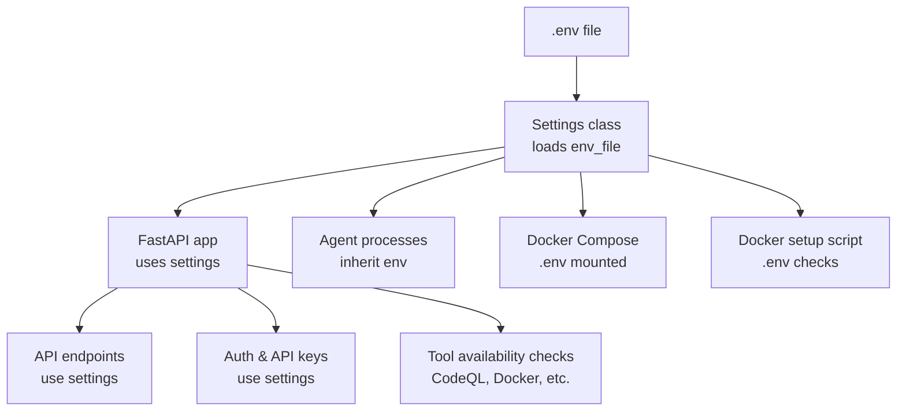
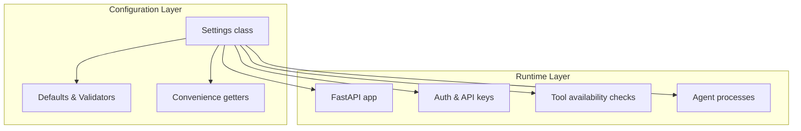
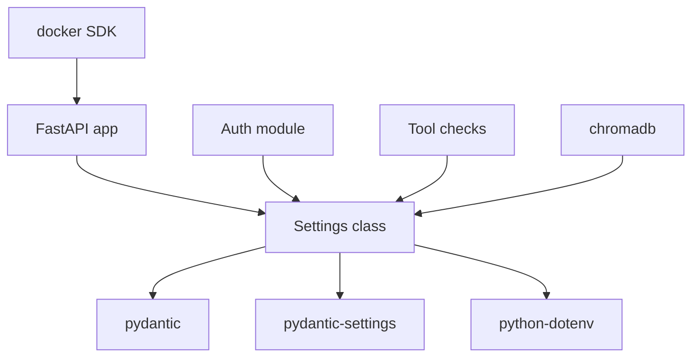

# Configuration Management

<cite>
**Referenced Files in This Document**
- [app/config.py](file://app/config.py)
- [app/main.py](file://app/main.py)
- [data/api_keys.json](file://data/api_keys.json)
- [requirements.txt](file://requirements.txt)
- [docker-compose.yml](file://docker-compose.yml)
- [docker-setup.sh](file://docker-setup.sh)
- [README.md](file://README.md)
- [agents/app_runner.py](file://agents/app_runner.py)
- [agents/pov_tester.py](file://agents/pov_tester.py)
- [results/snapshots/2abbd20f-3152-4cfb-b1ed-ab9c3a5bfe60/config.schema.yml](file://results/snapshots/2abbd20f-3152-4cfb-b1ed-ab9c3a5bfe60/config.schema.yml)
</cite>

## Table of Contents
1. [Introduction](#introduction)
2. [Project Structure](#project-structure)
3. [Core Components](#core-components)
4. [Architecture Overview](#architecture-overview)
5. [Detailed Component Analysis](#detailed-component-analysis)
6. [Dependency Analysis](#dependency-analysis)
7. [Performance Considerations](#performance-considerations)
8. [Troubleshooting Guide](#troubleshooting-guide)
9. [Conclusion](#conclusion)
10. [Appendices](#appendices)

## Introduction
This document describes AutoPoV’s configuration management system. It explains how environment-based configuration is loaded, validated, inherited, and applied across the application. It covers all configuration categories (LLM providers, tool integrations, database connections, security parameters), precedence rules, defaults, validation, environment variable mapping, secrets handling, and hot-reload behavior. It also includes practical examples, troubleshooting guidance, security considerations, backup procedures, and migration strategies.

## Project Structure
AutoPoV centralizes configuration in a single Pydantic Settings class that loads from a .env file and exposes typed configuration to the entire application. Supporting files include:
- Environment file mounting in container orchestration
- Setup scripts that validate presence of required environment variables
- Example and documentation references for environment configuration
- Agent processes that inherit environment variables from the runtime

**Diagram sources**
- [app/config.py:150-154](file://app/config.py#L150-L154)
- [app/main.py:114-122](file://app/main.py#L114-L122)
- [docker-compose.yml:11-11](file://docker-compose.yml#L11-L11)
- [docker-setup.sh:76-94](file://docker-setup.sh#L76-L94)

**Section sources**
- [app/config.py:150-154](file://app/config.py#L150-L154)
- [app/main.py:114-122](file://app/main.py#L114-L122)
- [docker-compose.yml:11-11](file://docker-compose.yml#L11-L11)
- [docker-setup.sh:76-94](file://docker-setup.sh#L76-L94)

## Core Components
AutoPoV’s configuration is defined and enforced by a single Pydantic Settings class. It supports:
- Environment variable mapping via Field(env="...") declarations
- Case-sensitive environment loading
- Default values for all configurable parameters
- Runtime validators for constrained fields
- Utility methods to probe external tool availability
- Directory creation for persistent data stores

Key characteristics:
- Loads from .env with UTF-8 encoding
- Case-sensitive environment keys
- Provides convenience getters for LLM configuration
- Ensures required directories exist on startup

**Section sources**
- [app/config.py:13-154](file://app/config.py#L13-L154)
- [app/config.py:212-231](file://app/config.py#L212-L231)
- [app/config.py:233-245](file://app/config.py#L233-L245)

## Architecture Overview
The configuration architecture follows a layered approach:
- Settings class encapsulates all configuration and validation
- FastAPI app reads settings for startup, CORS, and runtime behavior
- Authentication and authorization rely on security settings
- Tool integrations (CodeQL, Docker) are probed using settings values
- Agents and background tasks inherit environment variables from the runtime

**Diagram sources**
- [app/config.py:13-154](file://app/config.py#L13-L154)
- [app/main.py:114-122](file://app/main.py#L114-L122)
- [app/main.py:176-185](file://app/main.py#L176-L185)
- [agents/app_runner.py:75-75](file://agents/app_runner.py#L75-L75)
- [agents/pov_tester.py:148-148](file://agents/pov_tester.py#L148-L148)
- [agents/pov_tester.py:190-190](file://agents/pov_tester.py#L190-L190)

## Detailed Component Analysis

### Environment-Based Configuration Loading
- File: .env
- Loader: Pydantic Settings with env_file=".env" and env_file_encoding="utf-8"
- Behavior: Case-sensitive environment keys; values override defaults
- Mounting: Docker Compose mounts .env read-only into the container

Validation and precedence:
- Environment variables take precedence over defaults
- Case-sensitive keys prevent accidental mismatches
- On module load, directories are ensured to exist

**Section sources**
- [app/config.py:150-154](file://app/config.py#L150-L154)
- [docker-compose.yml:11-11](file://docker-compose.yml#L11-L11)
- [app/config.py:251-252](file://app/config.py#L251-L252)

### Validation and Constraints
- MODEL_MODE must be one of ["online", "offline"]
- Other constraints are implicit through defaults and type hints
- Runtime checks for external tools (CodeQL, Docker, Joern, Kaitai) are available via convenience methods

**Section sources**
- [app/config.py:156-160](file://app/config.py#L156-L160)
- [app/config.py:162-210](file://app/config.py#L162-L210)

### Configuration Categories and Environment Variable Mapping

#### Application and API
- APP_NAME, APP_VERSION, DEBUG
- API_HOST, API_PORT, API_PREFIX
- FRONTEND_URL

**Section sources**
- [app/config.py:17-28](file://app/config.py#L17-L28)
- [app/config.py:148-148](file://app/config.py#L148-L148)

#### Security
- ADMIN_API_KEY, WEBHOOK_SECRET
- GITHUB_WEBHOOK_SECRET, GITLAB_WEBHOOK_SECRET

Notes:
- Admin key is used for administrative endpoints
- Webhook secrets are used to validate incoming webhook signatures
- API keys are managed separately and persisted in a JSON file

**Section sources**
- [app/config.py:27-28](file://app/config.py#L27-L28)
- [app/config.py:69-71](file://app/config.py#L69-L71)
- [data/api_keys.json:1-42](file://data/api_keys.json#L1-L42)

#### LLM Providers
- Online (OpenRouter): OPENROUTER_API_KEY, OPENROUTER_BASE_URL
- Offline (Ollama): OLLAMA_BASE_URL
- Model selection: MODEL_MODE ("online"|"offline"), MODEL_NAME
- Auto routing: AUTO_ROUTER_MODEL
- Embedding models: EMBEDDING_MODEL_ONLINE, EMBEDDING_MODEL_OFFLINE
- Online model list: ONLINE_MODELS
- Offline model list: OFFLINE_MODELS

Retrieval:
- get_llm_config() returns provider-specific configuration based on MODEL_MODE

**Section sources**
- [app/config.py:30-62](file://app/config.py#L30-L62)
- [app/config.py:212-231](file://app/config.py#L212-L231)

#### Routing and Learning
- ROUTING_MODE ("auto"|"fixed"|"learning")
- LEARNING_DB_PATH

**Section sources**
- [app/config.py:41-44](file://app/config.py#L41-L44)

#### Scout Settings
- SCOUT_ENABLED, SCOUT_LLM_ENABLED
- SCOUT_MAX_FILES, SCOUT_MAX_CHARS_PER_FILE, SCOUT_MAX_FINDINGS, SCOUT_MAX_COST_USD

**Section sources**
- [app/config.py:46-52](file://app/config.py#L46-L52)

#### Git Provider Tokens
- GITHUB_TOKEN, GITLAB_TOKEN, BITBUCKET_TOKEN

**Section sources**
- [app/config.py:64-67](file://app/config.py#L64-L67)

#### Vector Store (ChromaDB)
- CHROMA_PERSIST_DIR, CHROMA_COLLECTION_NAME

**Section sources**
- [app/config.py:73-75](file://app/config.py#L73-L75)

#### LangSmith Tracing
- LANGCHAIN_TRACING_V2, LANGCHAIN_API_KEY, LANGCHAIN_PROJECT

**Section sources**
- [app/config.py:81-84](file://app/config.py#L81-L84)

#### Code Analysis Tools
- CODEQL_CLI_PATH, CODEQL_PACKS_BASE
- JOERN_CLI_PATH
- KAITAI_STRUCT_COMPILER_PATH

Availability checks:
- is_codeql_available(), is_joern_available(), is_kaitai_available()

**Section sources**
- [app/config.py:86-90](file://app/config.py#L86-L90)
- [app/config.py:176-210](file://app/config.py#L176-L210)

#### Docker Configuration
- DOCKER_ENABLED, DOCKER_IMAGE, DOCKER_TIMEOUT, DOCKER_MEMORY_LIMIT, DOCKER_CPU_LIMIT

Availability check:
- is_docker_available()

**Section sources**
- [app/config.py:92-98](file://app/config.py#L92-L98)
- [app/config.py:162-174](file://app/config.py#L162-L174)

#### Cost Controls
- MAX_COST_USD, COST_TRACKING_ENABLED

**Section sources**
- [app/config.py:99-101](file://app/config.py#L99-L101)

#### Scanning Configuration
- MAX_CHUNK_SIZE, CHUNK_OVERLAP, MAX_RETRIES

**Section sources**
- [app/config.py:103-106](file://app/config.py#L103-L106)

#### Supported CWEs
- SUPPORTED_CWES: curated list of high-impact web vulnerabilities

**Section sources**
- [app/config.py:108-134](file://app/config.py#L108-L134)

#### File Paths and Snapshots
- DATA_DIR, RESULTS_DIR, POVS_DIR, RUNS_DIR, TEMP_DIR, SNAPSHOT_DIR
- SAVE_CODEBASE_SNAPSHOT

**Section sources**
- [app/config.py:136-145](file://app/config.py#L136-L145)

### Configuration Precedence and Defaults
- Precedence order (highest to lowest):
  1) Environment variables (.env)
  2) Defaults defined in the Settings class
- Case sensitivity: Keys are case-sensitive; ensure correct casing in .env
- Defaults are defined per field; missing environment variables fall back to defaults

**Section sources**
- [app/config.py:150-154](file://app/config.py#L150-L154)

### Validation Rules
- MODEL_MODE constrained to "online" or "offline"
- No explicit validator for other fields; type hints imply constraints
- Runtime probes validate external tool availability

**Section sources**
- [app/config.py:156-160](file://app/config.py#L156-L160)
- [app/config.py:162-210](file://app/config.py#L162-L210)

### Environment Variable Mapping Examples
- LLM online mode: OPENROUTER_API_KEY, MODEL_NAME, MODEL_MODE
- LLM offline mode: OLLAMA_BASE_URL, MODEL_NAME, MODEL_MODE
- Security: ADMIN_API_KEY, WEBHOOK_SECRET, GITHUB_WEBHOOK_SECRET, GITLAB_WEBHOOK_SECRET
- Tools: CODEQL_CLI_PATH, JOERN_CLI_PATH, KAITAI_STRUCT_COMPILER_PATH
- Docker: DOCKER_ENABLED, DOCKER_IMAGE, DOCKER_TIMEOUT
- Vector store: CHROMA_PERSIST_DIR
- LangSmith: LANGCHAIN_TRACING_V2, LANGCHAIN_API_KEY, LANGCHAIN_PROJECT
- Git tokens: GITHUB_TOKEN, GITLAB_TOKEN, BITBUCKET_TOKEN
- Paths: DATA_DIR, RESULTS_DIR, SNAPSHOT_DIR

**Section sources**
- [app/config.py:27-28](file://app/config.py#L27-L28)
- [app/config.py:30-62](file://app/config.py#L30-L62)
- [app/config.py:64-67](file://app/config.py#L64-L67)
- [app/config.py:73-75](file://app/config.py#L73-L75)
- [app/config.py:81-84](file://app/config.py#L81-L84)
- [app/config.py:86-90](file://app/config.py#L86-L90)
- [app/config.py:92-98](file://app/config.py#L92-L98)
- [app/config.py:136-145](file://app/config.py#L136-L145)

### Secret Management
- Admin API key: ADMIN_API_KEY
- Webhook secrets: WEBHOOK_SECRET, GITHUB_WEBHOOK_SECRET, GITLAB_WEBHOOK_SECRET
- API keys: stored in data/api_keys.json with hashed values and metadata
- Recommendations:
  - Store secrets in .env and mount via Docker Compose
  - Use strong, random values
  - Rotate regularly and revoke unused keys
  - Restrict filesystem permissions on .env and JSON key files

**Section sources**
- [app/config.py:27-28](file://app/config.py#L27-L28)
- [app/config.py:69-71](file://app/config.py#L69-L71)
- [data/api_keys.json:1-42](file://data/api_keys.json#L1-L42)

### Configuration Hot-Reloading
- The Settings class loads from .env at import time
- There is no built-in hot-reload mechanism
- To apply changes, restart the service or container

**Section sources**
- [app/config.py:150-154](file://app/config.py#L150-L154)
- [app/main.py:760-767](file://app/main.py#L760-L767)

### Tool Availability Checks
- CodeQL: is_codeql_available() validates CLI presence
- Docker: is_docker_available() validates daemon connectivity
- Joern and Kaitai Struct: is_joern_available() and is_kaitai_available()

These methods are used by the health endpoint and throughout the application.

**Section sources**
- [app/config.py:162-210](file://app/config.py#L162-L210)
- [app/main.py:176-185](file://app/main.py#L176-L185)

### Example: Custom Configuration
- Online LLM mode:
  - Set MODEL_MODE=online
  - Set OPENROUTER_API_KEY
  - Optionally set MODEL_NAME to one of ONLINE_MODELS
- Offline LLM mode:
  - Set MODEL_MODE=offline
  - Set OLLAMA_BASE_URL
  - Optionally set MODEL_NAME to one of OFFLINE_MODELS
- Enable Docker sandboxing:
  - Set DOCKER_ENABLED=true
  - Ensure DOCKER_IMAGE and limits are appropriate
- Configure vector store:
  - Set CHROMA_PERSIST_DIR to a writable path

**Section sources**
- [app/config.py:30-62](file://app/config.py#L30-L62)
- [app/config.py:92-98](file://app/config.py#L92-L98)
- [app/config.py:73-75](file://app/config.py#L73-L75)

### Example: Environment-Specific Settings
- Development:
  - DEBUG=true
  - API_HOST=0.0.0.0
  - API_PORT=8000
  - LANGCHAIN_TRACING_V2=false
- Production:
  - DEBUG=false
  - API_HOST=127.0.0.1
  - API_PORT=8000
  - ADMIN_API_KEY and WEBHOOK_SECRET set securely
  - DOCKER_ENABLED=true for sandboxing

**Section sources**
- [app/config.py:19-23](file://app/config.py#L19-L23)
- [app/config.py:81-84](file://app/config.py#L81-L84)
- [app/config.py:92-98](file://app/config.py#L92-L98)

### Configuration Migration Strategies
- Version control .env alongside code
- Use .env.example to document required variables
- During upgrades, compare current .env against .env.example and add missing entries
- For breaking changes, introduce new fields with defaults and update documentation

**Section sources**
- [README.md:158-161](file://README.md#L158-L161)
- [README.md:391-391](file://README.md#L391-L391)

## Dependency Analysis
AutoPoV’s configuration depends on:
- Pydantic and pydantic-settings for environment loading and validation
- python-dotenv for .env parsing
- Docker SDK for container operations
- ChromaDB for vector storage persistence

**Diagram sources**
- [requirements.txt:3-6](file://requirements.txt#L3-L6)
- [requirements.txt:42-42](file://requirements.txt#L42-L42)
- [requirements.txt:24-25](file://requirements.txt#L24-L25)
- [requirements.txt:17-18](file://requirements.txt#L17-L18)

**Section sources**
- [requirements.txt:1-44](file://requirements.txt#L1-L44)

## Performance Considerations
- Keep MODEL_NAME aligned with provider capabilities to avoid retries
- Limit SCOUT_MAX_FINDINGS and SCOUT_MAX_COST_USD to control resource usage
- Tune Docker CPU and memory limits for safe sandboxing
- Persist vector store on fast disks to reduce latency

[No sources needed since this section provides general guidance]

## Troubleshooting Guide
Common issues and resolutions:
- Missing .env or unset variables:
  - Ensure .env exists and contains required keys
  - Verify case sensitivity of keys
- Tool not found errors:
  - Confirm CODEQL_CLI_PATH, JOERN_CLI_PATH, and KAITAI_STRUCT_COMPILER_PATH are correct
  - Use is_codeql_available(), is_joern_available(), is_kaitai_available() to diagnose
- Docker connectivity issues:
  - Verify DOCKER_ENABLED and that docker info succeeds
  - Check DOCKER_IMAGE and resource limits
- Webhook signature verification failures:
  - Confirm WEBHOOK_SECRET, GITHUB_WEBHOOK_SECRET, or GITLAB_WEBHOOK_SECRET match provider configurations
- API key problems:
  - Use admin endpoints to manage keys and verify hashes in data/api_keys.json

**Section sources**
- [docker-setup.sh:76-94](file://docker-setup.sh#L76-L94)
- [app/config.py:162-210](file://app/config.py#L162-L210)
- [app/config.py:27-28](file://app/config.py#L27-L28)
- [app/config.py:69-71](file://app/config.py#L69-L71)
- [data/api_keys.json:1-42](file://data/api_keys.json#L1-L42)

## Conclusion
AutoPoV’s configuration system is centralized, typed, and environment-driven. It provides robust defaults, strict validation, and convenient helpers for external tool detection. By following the documented precedence, mapping, and security practices, operators can reliably deploy and operate AutoPoV across environments while maintaining security and performance.

[No sources needed since this section summarizes without analyzing specific files]

## Appendices

### Appendix A: Environment Variable Reference
- Application: APP_NAME, APP_VERSION, DEBUG, API_HOST, API_PORT, API_PREFIX, FRONTEND_URL
- Security: ADMIN_API_KEY, WEBHOOK_SECRET, GITHUB_WEBHOOK_SECRET, GITLAB_WEBHOOK_SECRET
- LLM: MODEL_MODE, MODEL_NAME, OPENROUTER_API_KEY, OPENROUTER_BASE_URL, OLLAMA_BASE_URL, ONLINE_MODELS, OFFLINE_MODELS, AUTO_ROUTER_MODEL, EMBEDDING_MODEL_ONLINE, EMBEDDING_MODEL_OFFLINE
- Routing/Learning: ROUTING_MODE, LEARNING_DB_PATH
- Scout: SCOUT_ENABLED, SCOUT_LLM_ENABLED, SCOUT_MAX_FILES, SCOUT_MAX_CHARS_PER_FILE, SCOUT_MAX_FINDINGS, SCOUT_MAX_COST_USD
- Git tokens: GITHUB_TOKEN, GITLAB_TOKEN, BITBUCKET_TOKEN
- Vector store: CHROMA_PERSIST_DIR, CHROMA_COLLECTION_NAME
- LangSmith: LANGCHAIN_TRACING_V2, LANGCHAIN_API_KEY, LANGCHAIN_PROJECT
- Tools: CODEQL_CLI_PATH, CODEQL_PACKS_BASE, JOERN_CLI_PATH, KAITAI_STRUCT_COMPILER_PATH
- Docker: DOCKER_ENABLED, DOCKER_IMAGE, DOCKER_TIMEOUT, DOCKER_MEMORY_LIMIT, DOCKER_CPU_LIMIT
- Cost controls: MAX_COST_USD, COST_TRACKING_ENABLED
- Scanning: MAX_CHUNK_SIZE, CHUNK_OVERLAP, MAX_RETRIES
- Paths: DATA_DIR, RESULTS_DIR, POVS_DIR, RUNS_DIR, TEMP_DIR, SNAPSHOT_DIR, SAVE_CODEBASE_SNAPSHOT
- Supported CWEs: SUPPORTED_CWES

**Section sources**
- [app/config.py:17-145](file://app/config.py#L17-L145)
- [app/config.py:108-134](file://app/config.py#L108-L134)

### Appendix B: Example .env Entries
- Required minimum:
  - OPENROUTER_API_KEY
  - ADMIN_API_KEY
  - WEBHOOK_SECRET
  - GITHUB_WEBHOOK_SECRET
  - GITLAB_WEBHOOK_SECRET
- Optional:
  - MODEL_MODE, MODEL_NAME, OLLAMA_BASE_URL
  - DOCKER_ENABLED, DOCKER_IMAGE
  - CHROMA_PERSIST_DIR
  - LANGCHAIN_TRACING_V2, LANGCHAIN_API_KEY, LANGCHAIN_PROJECT

**Section sources**
- [README.md:158-161](file://README.md#L158-L161)
- [README.md:391-391](file://README.md#L391-L391)

### Appendix C: Backup and Restore Procedures
- Back up .env and data/api_keys.json
- Back up ChromaDB persistence directory (CHROMA_PERSIST_DIR)
- For migrations, keep a .env.example with documented variables and update incrementally

**Section sources**
- [app/config.py:73-75](file://app/config.py#L73-L75)
- [README.md:158-161](file://README.md#L158-L161)