# FastAPI Application

<cite>
**Referenced Files in This Document**
- [app/main.py](file://app/main.py)
- [app/auth.py](file://app/auth.py)
- [app/config.py](file://app/config.py)
- [app/scan_manager.py](file://app/scan_manager.py)
- [app/webhook_handler.py](file://app/webhook_handler.py)
- [app/source_handler.py](file://app/source_handler.py)
- [app/git_handler.py](file://app/git_handler.py)
- [app/report_generator.py](file://app/report_generator.py)
- [app/learning_store.py](file://app/learning_store.py)
- [agents/__init__.py](file://agents/__init__.py)
- [requirements.txt](file://requirements.txt)
- [README.md](file://README.md)
</cite>

## Table of Contents
1. [Introduction](#introduction)
2. [Project Structure](#project-structure)
3. [Core Components](#core-components)
4. [Architecture Overview](#architecture-overview)
5. [Detailed Component Analysis](#detailed-component-analysis)
6. [Dependency Analysis](#dependency-analysis)
7. [Performance Considerations](#performance-considerations)
8. [Troubleshooting Guide](#troubleshooting-guide)
9. [Conclusion](#conclusion)
10. [Appendices](#appendices)

## Introduction
This document describes the FastAPI application architecture powering AutoPoV’s REST API. It covers the application entry point, routing configuration, middleware setup, authentication and rate limiting, request/response schemas, error handling patterns, application lifecycle, dependency injection, configuration management, security controls (JWT-like bearer tokens, rate limiting, CORS), and operational topics such as deployment, health checks, and monitoring. Practical endpoint usage examples and parameter validation are included to guide both developers and operators.

## Project Structure
The FastAPI backend resides primarily under app/, orchestrated by a central main.py that defines routes, middleware, and dependency injection. Supporting modules encapsulate authentication, configuration, scan lifecycle, source handling, Git operations, webhooks, reporting, and learning persistence. Agent implementations live under agents/ and are integrated via dependency injection.

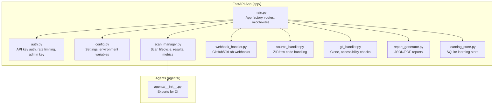

**Diagram sources**
- [app/main.py:114-122](file://app/main.py#L114-L122)
- [app/auth.py:192-256](file://app/auth.py#L192-L256)
- [app/config.py:13-255](file://app/config.py#L13-L255)
- [app/scan_manager.py:47-663](file://app/scan_manager.py#L47-L663)
- [app/webhook_handler.py:15-363](file://app/webhook_handler.py#L15-L363)
- [app/source_handler.py:18-382](file://app/source_handler.py#L18-L382)
- [app/git_handler.py:20-392](file://app/git_handler.py#L20-L392)
- [app/report_generator.py:200-830](file://app/report_generator.py#L200-L830)
- [app/learning_store.py:14-256](file://app/learning_store.py#L14-L256)
- [agents/__init__.py:1-21](file://agents/__init__.py#L1-L21)

**Section sources**
- [app/main.py:114-122](file://app/main.py#L114-L122)
- [README.md:89-124](file://README.md#L89-L124)

## Core Components
- Application factory and lifespan: Creates the FastAPI app with docs URLs, sets up CORS, registers a webhook callback, and prints startup/shutdown messages.
- Authentication and rate limiting: Implements bearer token verification, admin key enforcement, and per-key scan rate limiting.
- Configuration: Centralized settings via Pydantic Settings with environment variable support and runtime checks for tool availability.
- Scan lifecycle: Manages scan creation, background execution, logs, results, cancellation, and cleanup.
- Source and Git handlers: Support ZIP uploads, raw code paste, and Git repository cloning with provider-specific credential injection and accessibility checks.
- Webhook handler: Validates GitHub/GitLab signatures/tokens and triggers scans from events.
- Reporting: Generates JSON and PDF reports from scan results.
- Learning store: Persists agent outcomes to SQLite for performance tracking and adaptive routing.

**Section sources**
- [app/main.py:94-122](file://app/main.py#L94-L122)
- [app/auth.py:192-256](file://app/auth.py#L192-L256)
- [app/config.py:13-255](file://app/config.py#L13-L255)
- [app/scan_manager.py:47-663](file://app/scan_manager.py#L47-L663)
- [app/source_handler.py:18-382](file://app/source_handler.py#L18-L382)
- [app/git_handler.py:20-392](file://app/git_handler.py#L20-L392)
- [app/webhook_handler.py:15-363](file://app/webhook_handler.py#L15-L363)
- [app/report_generator.py:200-830](file://app/report_generator.py#L200-L830)
- [app/learning_store.py:14-256](file://app/learning_store.py#L14-L256)

## Architecture Overview
The FastAPI app exposes REST endpoints for initiating scans, polling status, streaming logs, retrieving reports, managing API keys, and administrative tasks. Requests are authenticated and optionally rate-limited. Scans are executed asynchronously via a scan manager and agent graph, persisting results and metrics. Webhooks integrate with Git providers to trigger scans automatically.

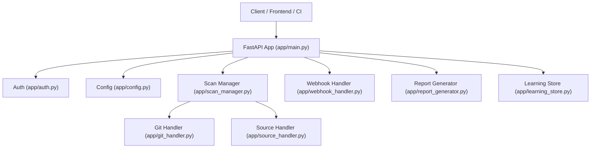

**Diagram sources**
- [app/main.py:176-768](file://app/main.py#L176-L768)
- [app/auth.py:192-256](file://app/auth.py#L192-L256)
- [app/config.py:13-255](file://app/config.py#L13-L255)
- [app/scan_manager.py:47-663](file://app/scan_manager.py#L47-L663)
- [app/git_handler.py:20-392](file://app/git_handler.py#L20-L392)
- [app/source_handler.py:18-382](file://app/source_handler.py#L18-L382)
- [app/webhook_handler.py:15-363](file://app/webhook_handler.py#L15-L363)
- [app/report_generator.py:200-830](file://app/report_generator.py#L200-L830)
- [app/learning_store.py:14-256](file://app/learning_store.py#L14-L256)

## Detailed Component Analysis

### Application Entry Point and Lifecycle
- App factory: Defines title, description, version, docs/redoc/openapi paths, and lifespan hooks.
- Lifespan: On startup, ensures directories and registers a webhook callback; on shutdown, prints a message.
- CORS: Allows configured origins, credentials, methods, and headers.
- Uvicorn runner: When executed directly, serves the app with host/port from settings and debug flag.

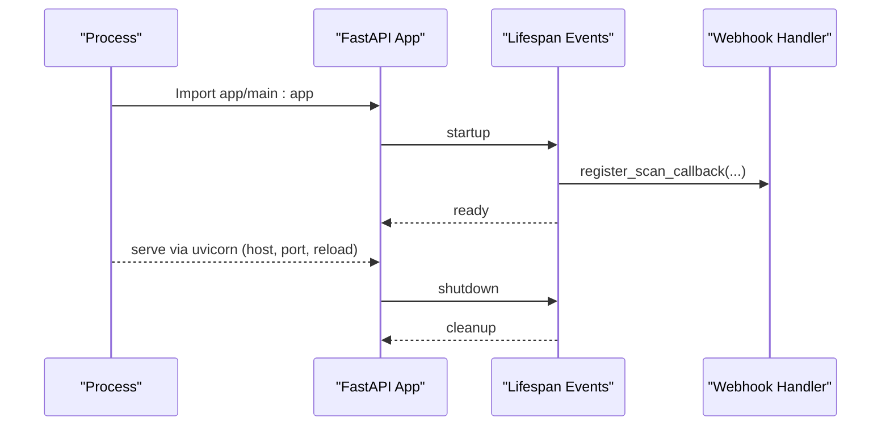

**Diagram sources**
- [app/main.py:94-122](file://app/main.py#L94-L122)
- [app/main.py:760-768](file://app/main.py#L760-L768)

**Section sources**
- [app/main.py:94-122](file://app/main.py#L94-L122)
- [app/main.py:760-768](file://app/main.py#L760-L768)

### Authentication and Rate Limiting
- Bearer token verification: Supports Authorization header or query param api_key for SSE compatibility.
- Admin key verification: Enforces admin-only endpoints with timing-safe comparison.
- Per-key rate limiting: Tracks scan attempts per key within a rolling window and rejects excess requests.

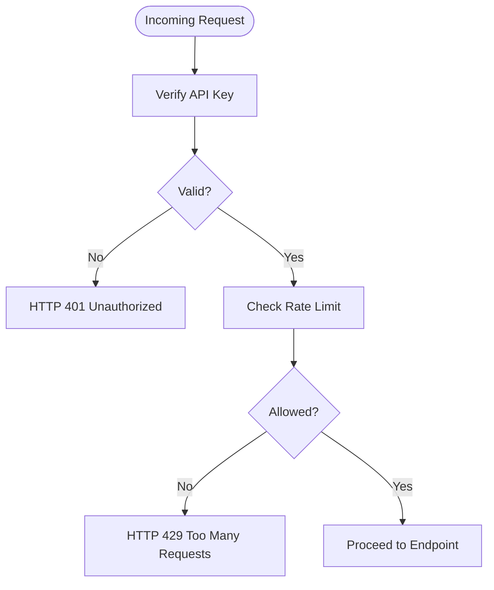

**Diagram sources**
- [app/auth.py:192-256](file://app/auth.py#L192-L256)

**Section sources**
- [app/auth.py:192-256](file://app/auth.py#L192-L256)

### Configuration Management
- Centralized settings via Pydantic Settings with environment variables.
- Tool availability checks: Docker, CodeQL, Joern, Kaitai Struct.
- LLM configuration selection: Online (OpenRouter) vs offline (Ollama).
- Directory provisioning and constants for data/results.

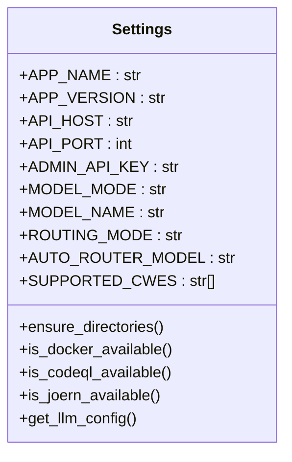

**Diagram sources**
- [app/config.py:13-255](file://app/config.py#L13-L255)

**Section sources**
- [app/config.py:13-255](file://app/config.py#L13-L255)

### Scan Lifecycle and Dependency Injection
- Scan manager: Singleton managing active scans, logs, results, metrics, and cleanup.
- Background execution: Scans run in thread pool; agent graph orchestrates stages.
- Dependency injection: Endpoints call get_* functions to obtain managers and handlers.

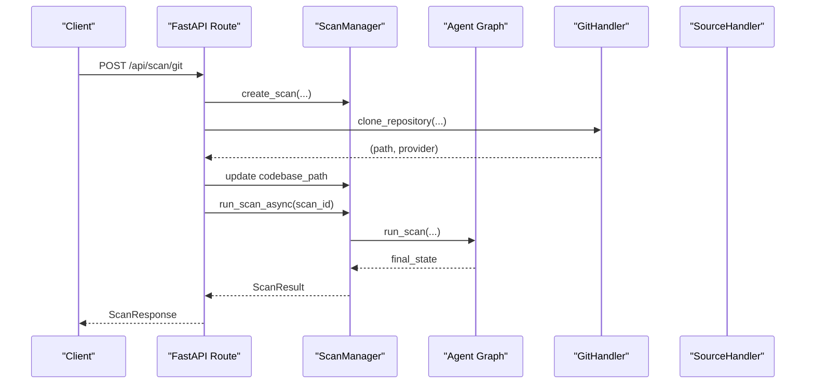

**Diagram sources**
- [app/main.py:204-285](file://app/main.py#L204-L285)
- [app/scan_manager.py:234-264](file://app/scan_manager.py#L234-L264)
- [app/git_handler.py:199-294](file://app/git_handler.py#L199-L294)
- [app/source_handler.py:31-78](file://app/source_handler.py#L31-L78)

**Section sources**
- [app/scan_manager.py:47-663](file://app/scan_manager.py#L47-L663)
- [app/main.py:204-285](file://app/main.py#L204-L285)

### Source and Git Handling
- ZIP upload: Reads UploadFile content, extracts securely, normalizes directory layout.
- Raw code paste: Writes code to a file with inferred language extension.
- Git clone: Injects provider credentials, shallow clones, validates branch/size, removes .git.

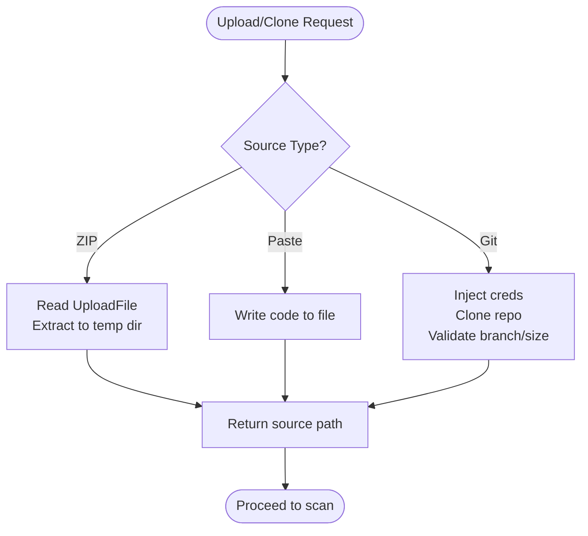

**Diagram sources**
- [app/main.py:288-400](file://app/main.py#L288-L400)
- [app/source_handler.py:31-78](file://app/source_handler.py#L31-L78)
- [app/git_handler.py:199-294](file://app/git_handler.py#L199-L294)

**Section sources**
- [app/source_handler.py:18-382](file://app/source_handler.py#L18-L382)
- [app/git_handler.py:20-392](file://app/git_handler.py#L20-L392)

### Webhook Integration
- GitHub: Validates HMAC signature, parses push/PR events, triggers scan callback.
- GitLab: Validates token, parses push/MR events, triggers scan callback.

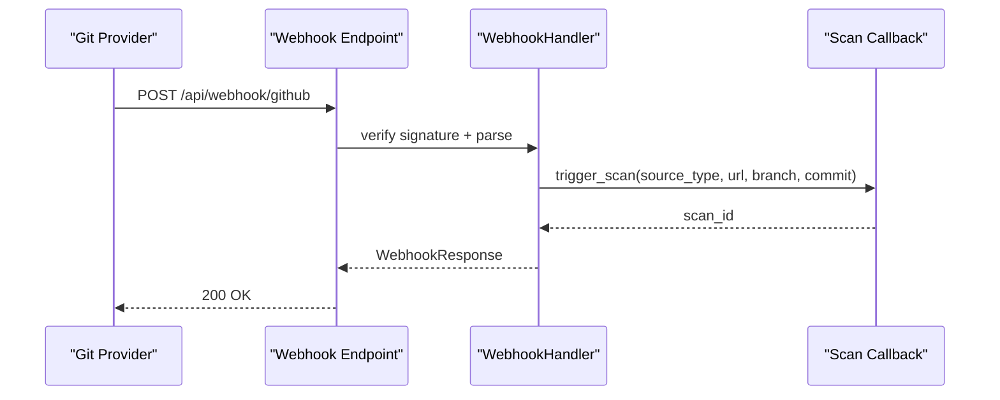

**Diagram sources**
- [app/main.py:647-666](file://app/main.py#L647-L666)
- [app/webhook_handler.py:196-265](file://app/webhook_handler.py#L196-L265)

**Section sources**
- [app/webhook_handler.py:15-363](file://app/webhook_handler.py#L15-L363)
- [app/main.py:134-172](file://app/main.py#L134-L172)

### Reporting and Metrics
- JSON report: Comprehensive metadata, findings, model usage, and methodology.
- PDF report: Professional layout with executive summary, confirmed findings, false positives, and methodology.
- Metrics: Aggregated counts, rates, and costs from scan history.

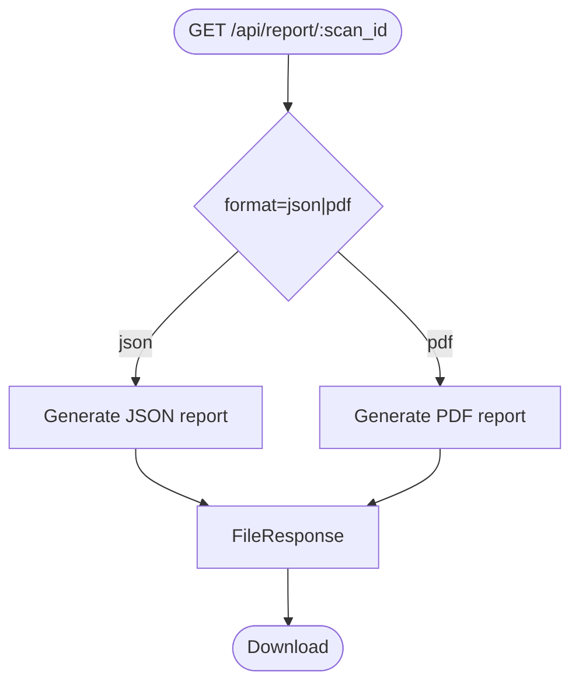

**Diagram sources**
- [app/main.py:599-644](file://app/main.py#L599-L644)
- [app/report_generator.py:209-262](file://app/report_generator.py#L209-L262)
- [app/report_generator.py:264-610](file://app/report_generator.py#L264-L610)

**Section sources**
- [app/report_generator.py:200-830](file://app/report_generator.py#L200-L830)
- [app/scan_manager.py:604-653](file://app/scan_manager.py#L604-L653)

### Learning Store and Adaptive Routing
- Records investigation outcomes and PoV runs with model, CWE, language, verdict/confidence, cost.
- Provides summaries and model performance stats for routing decisions.

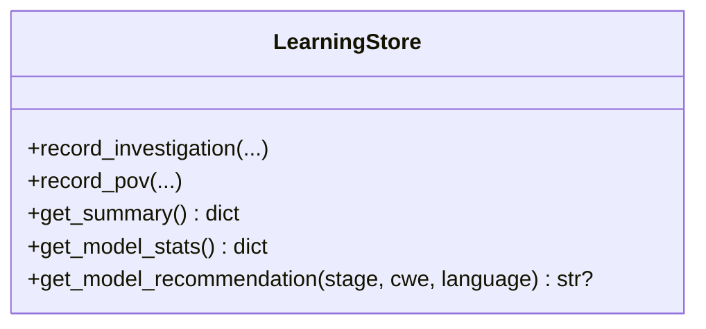

**Diagram sources**
- [app/learning_store.py:14-256](file://app/learning_store.py#L14-L256)

**Section sources**
- [app/learning_store.py:14-256](file://app/learning_store.py#L14-L256)

## Dependency Analysis
External dependencies are declared in requirements.txt. The FastAPI app integrates LangChain/LangGraph for agent orchestration, ChromaDB for embeddings, Docker for sandboxed execution, and optional CodeQL/Joirn for static analysis.

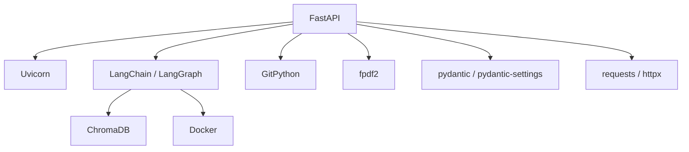

**Diagram sources**
- [requirements.txt:1-44](file://requirements.txt#L1-L44)

**Section sources**
- [requirements.txt:1-44](file://requirements.txt#L1-L44)

## Performance Considerations
- Asynchronous execution: Scans run in thread pools; SSE streaming avoids blocking.
- Rate limiting: Prevents API key abuse and protects downstream systems.
- Tool availability checks: Avoids unnecessary work when CodeQL/Docker are unavailable.
- Cost control: Per-scan cost cap and configurable model modes.
- Cleanup: Admin-triggered cleanup of old results to manage disk usage.

[No sources needed since this section provides general guidance]

## Troubleshooting Guide
Common issues and resolutions:
- Authentication failures: Ensure Authorization header uses Bearer token or api_key query param for SSE. Confirm admin key for admin endpoints.
- Rate limit exceeded: Wait until the next window or reduce request frequency.
- Git clone failures: Verify repository URL, branch, and provider credentials; ensure network connectivity and repository size limits.
- Missing tools: Confirm Docker, CodeQL, and Joern are installed and accessible; adjust settings accordingly.
- Report generation errors: Check fpdf2 availability and permissions for results directory.

**Section sources**
- [app/auth.py:192-256](file://app/auth.py#L192-L256)
- [app/git_handler.py:243-294](file://app/git_handler.py#L243-L294)
- [app/config.py:162-210](file://app/config.py#L162-L210)
- [app/report_generator.py:264-268](file://app/report_generator.py#L264-L268)

## Conclusion
AutoPoV’s FastAPI application provides a robust, modular backend for autonomous vulnerability detection. It emphasizes secure, rate-limited access, flexible scan sources, asynchronous execution, and comprehensive reporting. The architecture cleanly separates concerns through dependency injection and supports both manual and webhook-driven workflows.

[No sources needed since this section summarizes without analyzing specific files]

## Appendices

### Endpoint Reference and Examples
- Health check: GET /api/health
- Configuration: GET /api/config (requires API key)
- Scans:
  - POST /api/scan/git (requires rate-limited API key)
  - POST /api/scan/zip (requires rate-limited API key)
  - POST /api/scan/paste (requires rate-limited API key)
  - POST /api/scan/{scan_id}/replay (requires rate-limited API key)
  - POST /api/scan/{scan_id}/cancel (requires API key)
- Status and logs:
  - GET /api/scan/{scan_id}
  - GET /api/scan/{scan_id}/stream
- History and metrics:
  - GET /api/history
  - GET /api/metrics
- Reports:
  - GET /api/report/{scan_id}?format=json|pdf
- Webhooks:
  - POST /api/webhook/github
  - POST /api/webhook/gitlab
- API key management (admin):
  - POST /api/keys/generate
  - GET /api/keys
  - DELETE /api/keys/{key_id}
  - POST /api/admin/cleanup
- Learning summary:
  - GET /api/learning/summary

Example usage (conceptual):
- Trigger a Git scan: POST /api/scan/git with JSON body containing url, optional token/branch, and cwes array.
- Poll status: GET /api/scan/{scan_id} to receive ScanStatusResponse.
- Stream logs: GET /api/scan/{scan_id}/stream with api_key query param.
- Generate report: GET /api/report/{scan_id}?format=pdf to download a PDF report.

**Section sources**
- [app/main.py:176-768](file://app/main.py#L176-L768)
- [README.md:245-284](file://README.md#L245-L284)

### Security Controls
- Authentication: Bearer token verification with fallback to query param for SSE.
- Admin key: HMAC-safe comparison for privileged endpoints.
- Rate limiting: Per-key sliding window enforcing maximum scans per minute.
- CORS: Configured origins, credentials, methods, and headers.
- Sandbox: Docker-based execution for PoV validation with resource limits.

**Section sources**
- [app/auth.py:192-256](file://app/auth.py#L192-L256)
- [app/main.py:124-131](file://app/main.py#L124-L131)
- [README.md:377-383](file://README.md#L377-L383)

### Deployment and Monitoring
- Deployment: Run via uvicorn with host/port from settings; use run.sh for backend/frontend.
- Health checks: GET /api/health for readiness.
- Monitoring: GET /api/metrics for aggregated scan statistics; GET /api/learning/summary for model performance insights.
- Cleanup: POST /api/admin/cleanup to remove old result files.

**Section sources**
- [app/main.py:760-768](file://app/main.py#L760-L768)
- [app/scan_manager.py:604-653](file://app/scan_manager.py#L604-L653)
- [README.md:171-177](file://README.md#L171-L177)