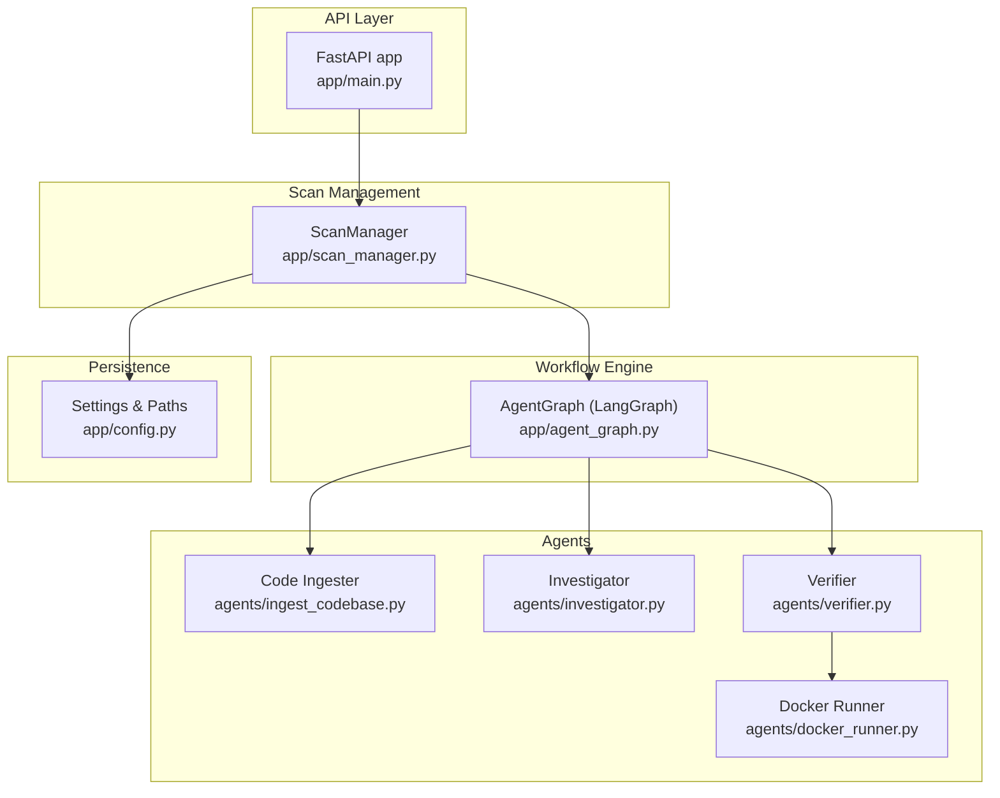
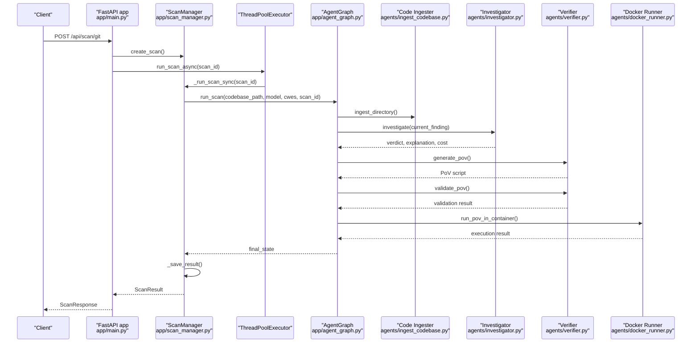
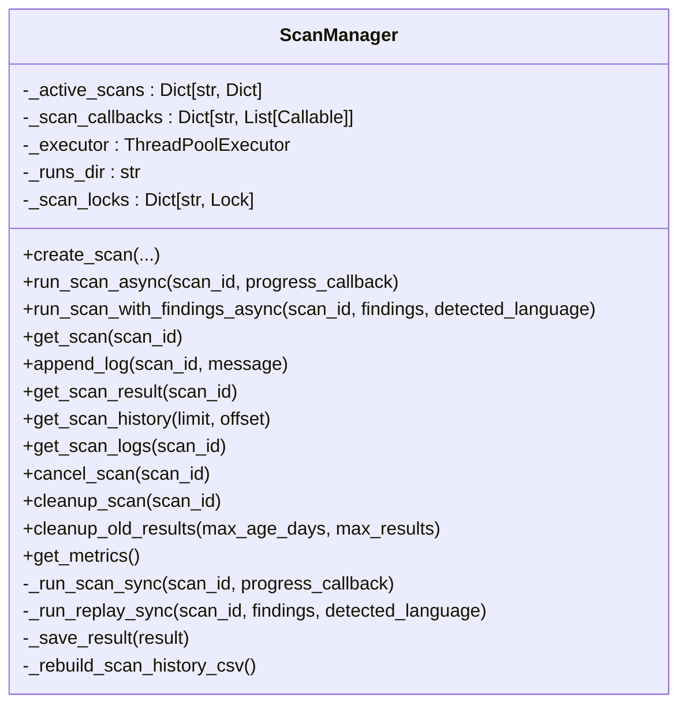
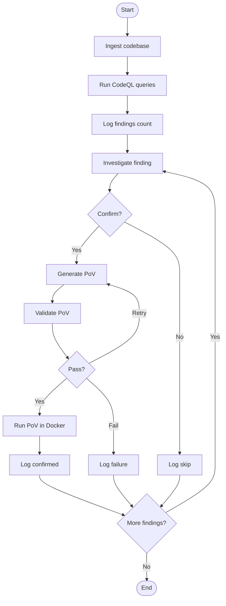
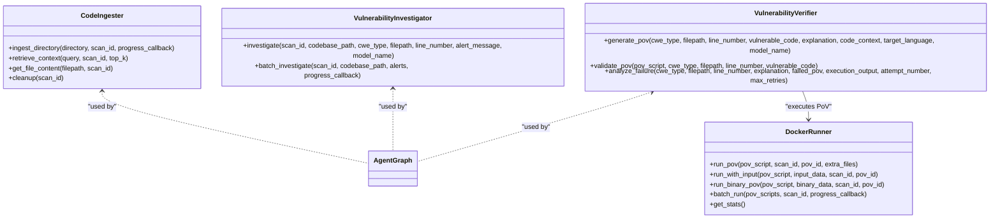
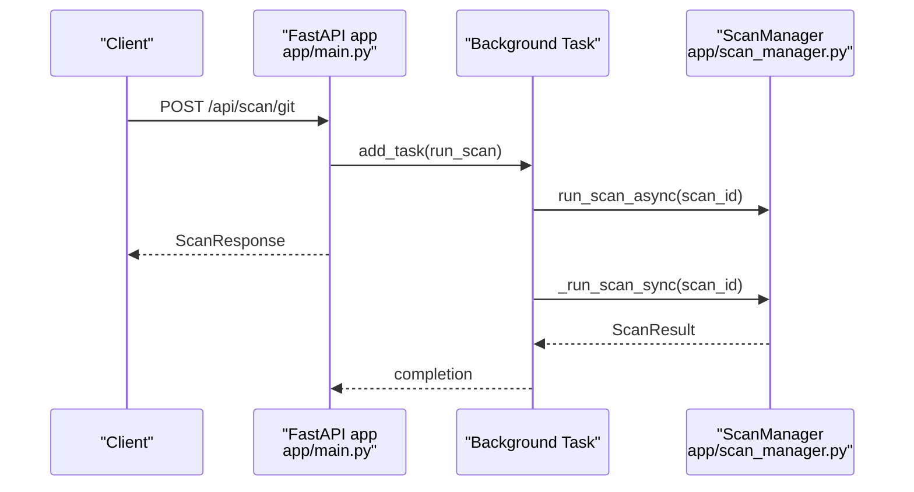
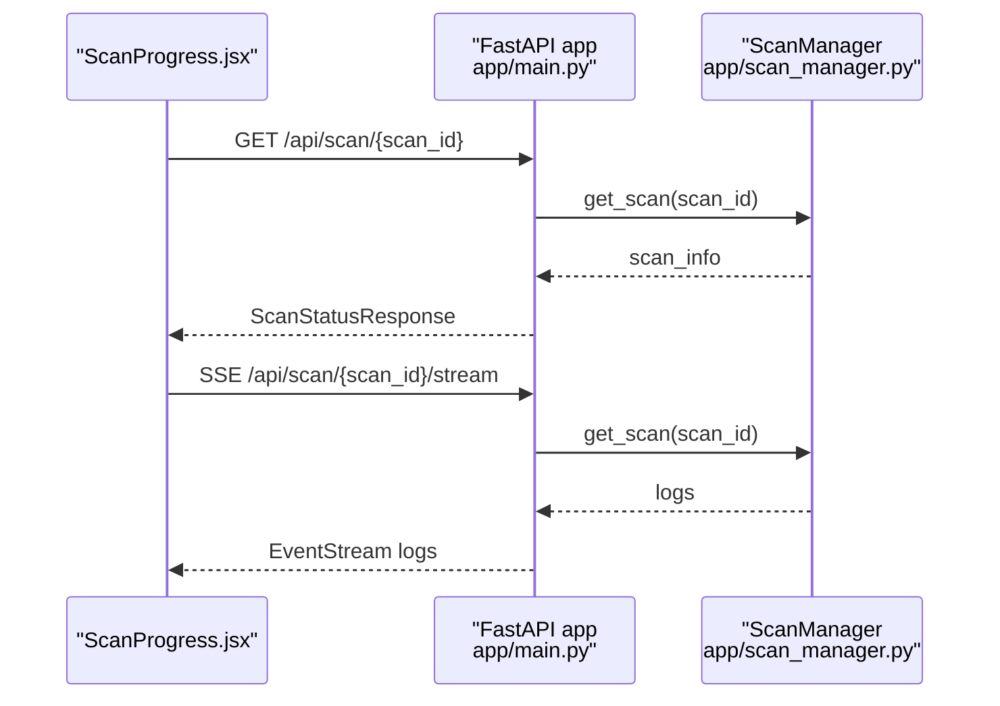
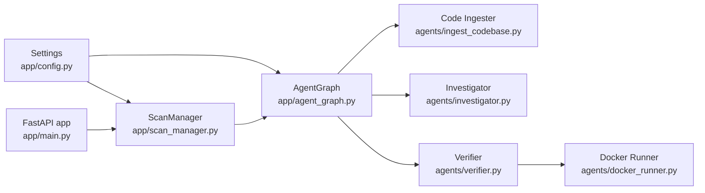

# Scan Management

<cite>
**Referenced Files in This Document**
- [app/scan_manager.py](file://app/scan_manager.py)
- [app/main.py](file://app/main.py)
- [app/agent_graph.py](file://app/agent_graph.py)
- [app/config.py](file://app/config.py)
- [agents/ingest_codebase.py](file://agents/ingest_codebase.py)
- [agents/investigator.py](file://agents/investigator.py)
- [agents/verifier.py](file://agents/verifier.py)
- [agents/docker_runner.py](file://agents/docker_runner.py)
- [frontend/src/pages/ScanProgress.jsx](file://frontend/src/pages/ScanProgress.jsx)
- [monitor_scan.py](file://monitor_scan.py)
- [check_scan.py](file://check_scan.py)
</cite>

## Table of Contents
1. [Introduction](#introduction)
2. [Project Structure](#project-structure)
3. [Core Components](#core-components)
4. [Architecture Overview](#architecture-overview)
5. [Detailed Component Analysis](#detailed-component-analysis)
6. [Dependency Analysis](#dependency-analysis)
7. [Performance Considerations](#performance-considerations)
8. [Troubleshooting Guide](#troubleshooting-guide)
9. [Conclusion](#conclusion)
10. [Appendices](#appendices)

## Introduction
This document explains AutoPoV’s scan management system: how scans are initialized, executed, tracked, and finalized; how results are aggregated and persisted; and how the system integrates with external tools for distributed processing and storage. It covers the background job processing architecture, queue management, worker coordination, scheduling, concurrency control, resource management, monitoring, progress reporting, error recovery, performance optimization, scaling, and operational best practices.

## Project Structure
AutoPoV organizes scan management across several modules:
- API entrypoint and orchestration: FastAPI application exposes endpoints to start scans, track progress, and retrieve results.
- Scan lifecycle management: Centralized manager handles scan creation, execution, persistence, and cleanup.
- Agent graph workflow: LangGraph-based state machine orchestrates steps like code ingestion, CodeQL analysis, investigation, PoV generation/validation, and containerized execution.
- Agent components: Specialized agents implement ingestion, investigation, verification, and containerized PoV execution.
- Frontend and CLI monitoring: Real-time progress UI and CLI tools for monitoring and replay.

**Diagram sources**
- [app/main.py:204-401](file://app/main.py#L204-L401)
- [app/scan_manager.py:47-114](file://app/scan_manager.py#L47-L114)
- [app/agent_graph.py:82-168](file://app/agent_graph.py#L82-L168)
- [agents/ingest_codebase.py:41-122](file://agents/ingest_codebase.py#L41-L122)
- [agents/investigator.py:37-104](file://agents/investigator.py#L37-L104)
- [agents/verifier.py:42-89](file://agents/verifier.py#L42-L89)
- [agents/docker_runner.py:27-61](file://agents/docker_runner.py#L27-L61)
- [app/config.py:136-146](file://app/config.py#L136-L146)

**Section sources**
- [app/main.py:114-132](file://app/main.py#L114-L132)
- [app/scan_manager.py:47-114](file://app/scan_manager.py#L47-L114)
- [app/agent_graph.py:82-168](file://app/agent_graph.py#L82-L168)
- [app/config.py:136-146](file://app/config.py#L136-L146)

## Core Components
- ScanManager: Singleton orchestrator for scan lifecycle, thread-safe logging, result persistence, and cleanup.
- AgentGraph: LangGraph workflow defining nodes and transitions for ingestion, CodeQL, investigation, PoV generation/validation, and containerized execution.
- Agent components: Code ingestion, investigation, verification, and Docker-based PoV execution.
- API endpoints: Entrypoints to start scans, stream logs, cancel scans, and retrieve results.
- Monitoring: Frontend page and CLI tools for real-time progress and status checks.

**Section sources**
- [app/scan_manager.py:47-114](file://app/scan_manager.py#L47-L114)
- [app/agent_graph.py:82-168](file://app/agent_graph.py#L82-L168)
- [app/main.py:204-401](file://app/main.py#L204-L401)

## Architecture Overview
The system uses a hybrid synchronous/asynchronous execution model:
- API endpoints enqueue scans and delegate execution to ScanManager.
- ScanManager runs scans in a thread pool executor to keep the API responsive.
- AgentGraph coordinates the multi-stage workflow with explicit state transitions.
- Results are persisted to JSON and CSV, with optional codebase snapshots.

**Diagram sources**
- [app/main.py:204-285](file://app/main.py#L204-L285)
- [app/scan_manager.py:234-366](file://app/scan_manager.py#L234-L366)
- [app/agent_graph.py:691-777](file://app/agent_graph.py#L691-L777)
- [agents/ingest_codebase.py:207-313](file://agents/ingest_codebase.py#L207-L313)
- [agents/investigator.py:270-432](file://agents/investigator.py#L270-L432)
- [agents/verifier.py:90-223](file://agents/verifier.py#L90-L223)
- [agents/docker_runner.py:62-191](file://agents/docker_runner.py#L62-L191)

## Detailed Component Analysis

### ScanManager: Lifecycle, Persistence, and Concurrency
- Initialization and singleton pattern ensure a single coordinator across threads.
- Thread pool executor runs CPU-bound tasks off the main API event loop.
- Thread-safe logging per scan using per-scan locks.
- Result persistence to JSON and CSV; optional codebase snapshots.
- Cleanup routines for old results and vector store collections.

**Diagram sources**
- [app/scan_manager.py:47-663](file://app/scan_manager.py#L47-L663)

**Section sources**
- [app/scan_manager.py:47-114](file://app/scan_manager.py#L47-L114)
- [app/scan_manager.py:234-366](file://app/scan_manager.py#L234-L366)
- [app/scan_manager.py:367-418](file://app/scan_manager.py#L367-L418)
- [app/scan_manager.py:512-603](file://app/scan_manager.py#L512-L603)

### AgentGraph: Workflow Orchestration
- Defines nodes for ingestion, CodeQL, investigation, PoV generation/validation, and containerized execution.
- Uses conditional edges to decide whether to generate PoV, skip, or fail based on investigation outcomes.
- Tracks per-scan state including findings, current index, costs, and logs.
- Integrates with CodeQL, heuristic/LLM scouts, and vector store retrieval.

**Diagram sources**
- [app/agent_graph.py:82-168](file://app/agent_graph.py#L82-L168)
- [app/agent_graph.py:241-307](file://app/agent_graph.py#L241-L307)
- [app/agent_graph.py:691-777](file://app/agent_graph.py#L691-L777)

**Section sources**
- [app/agent_graph.py:82-168](file://app/agent_graph.py#L82-L168)
- [app/agent_graph.py:241-307](file://app/agent_graph.py#L241-L307)
- [app/agent_graph.py:691-777](file://app/agent_graph.py#L691-L777)

### Agent Components
- Code Ingester: Chunks code, generates embeddings, persists to ChromaDB, and cleans up collections.
- Investigator: Uses RAG and LLM to assess findings, tracks token usage and cost.
- Verifier: Generates PoV scripts, validates via static analysis, unit tests, and LLM fallback.
- Docker Runner: Executes PoV scripts in isolated containers with resource limits.

**Diagram sources**
- [agents/ingest_codebase.py:41-122](file://agents/ingest_codebase.py#L41-L122)
- [agents/investigator.py:37-104](file://agents/investigator.py#L37-L104)
- [agents/verifier.py:42-89](file://agents/verifier.py#L42-L89)
- [agents/docker_runner.py:27-61](file://agents/docker_runner.py#L27-L61)

**Section sources**
- [agents/ingest_codebase.py:207-313](file://agents/ingest_codebase.py#L207-L313)
- [agents/investigator.py:270-432](file://agents/investigator.py#L270-L432)
- [agents/verifier.py:90-223](file://agents/verifier.py#L90-L223)
- [agents/docker_runner.py:62-191](file://agents/docker_runner.py#L62-L191)

### API Endpoints and Background Jobs
- Git/ZIP/Paste scan endpoints create scans and run them in background tasks.
- Replay endpoint replays prior findings with selected models.
- Stream endpoint provides real-time logs via Server-Sent Events.
- Cancel endpoint attempts to mark a running scan as cancelled.

**Diagram sources**
- [app/main.py:204-285](file://app/main.py#L204-L285)
- [app/main.py:404-491](file://app/main.py#L404-L491)
- [app/main.py:548-583](file://app/main.py#L548-L583)
- [app/scan_manager.py:234-366](file://app/scan_manager.py#L234-L366)

**Section sources**
- [app/main.py:204-285](file://app/main.py#L204-L285)
- [app/main.py:404-491](file://app/main.py#L404-L491)
- [app/main.py:548-583](file://app/main.py#L548-L583)
- [app/main.py:492-508](file://app/main.py#L492-L508)

### Monitoring and Progress Reporting
- Frontend page polls status and subscribes to SSE for live logs.
- CLI monitor periodically fetches status and prints logs and results.
- API provides streaming logs endpoint for real-time updates.

**Diagram sources**
- [frontend/src/pages/ScanProgress.jsx:16-79](file://frontend/src/pages/ScanProgress.jsx#L16-L79)
- [app/main.py:548-583](file://app/main.py#L548-L583)
- [app/scan_manager.py:419-494](file://app/scan_manager.py#L419-L494)

**Section sources**
- [frontend/src/pages/ScanProgress.jsx:16-79](file://frontend/src/pages/ScanProgress.jsx#L16-L79)
- [monitor_scan.py:29-71](file://monitor_scan.py#L29-L71)
- [check_scan.py:10-16](file://check_scan.py#L10-L16)
- [app/main.py:548-583](file://app/main.py#L548-L583)

## Dependency Analysis
- Configuration-driven paths and feature toggles (CodeQL, Docker, LLM routing) centralize behavior.
- AgentGraph depends on agent components for ingestion, investigation, verification, and containerized execution.
- ScanManager depends on configuration for paths and on agent components for execution.
- API depends on ScanManager for orchestration and on agent graph for workflow execution.

**Diagram sources**
- [app/config.py:136-146](file://app/config.py#L136-L146)
- [app/scan_manager.py:18-21](file://app/scan_manager.py#L18-L21)
- [app/agent_graph.py:19-28](file://app/agent_graph.py#L19-L28)
- [agents/ingest_codebase.py:33-34](file://agents/ingest_codebase.py#L33-L34)
- [agents/investigator.py:27-29](file://agents/investigator.py#L27-L29)
- [agents/verifier.py:27-34](file://agents/verifier.py#L27-L34)
- [agents/docker_runner.py:19-20](file://agents/docker_runner.py#L19-L20)
- [app/main.py:24-25](file://app/main.py#L24-L25)

**Section sources**
- [app/config.py:136-146](file://app/config.py#L136-L146)
- [app/scan_manager.py:18-21](file://app/scan_manager.py#L18-L21)
- [app/agent_graph.py:19-28](file://app/agent_graph.py#L19-L28)

## Performance Considerations
- Concurrency and resource control:
  - Thread pool executor limits concurrent scans to avoid CPU saturation.
  - Docker runner enforces memory and CPU quotas to prevent resource exhaustion.
  - CodeQL and LLM calls are bounded by configurable limits (max files, chars, findings).
- Storage and I/O:
  - Batched ChromaDB writes reduce overhead.
  - Result persistence to JSON and CSV avoids heavy ORM overhead.
- Cost control:
  - Token usage extraction and cost calculation enable budget tracking.
  - Configurable max cost and cost tracking enable budget enforcement.
- Scalability:
  - Stateless agents and persistent storage enable horizontal scaling across workers.
  - SSE and polling provide efficient client-side updates without tight coupling.

[No sources needed since this section provides general guidance]

## Troubleshooting Guide
- Scan stuck or slow:
  - Verify CodeQL availability and language detection logic.
  - Check vector store ingestion progress and errors.
  - Inspect logs via streaming endpoint or CLI monitor.
- Docker execution failures:
  - Confirm Docker availability and image pull.
  - Review container logs and timeouts.
- Investigation or verification errors:
  - Validate LLM provider credentials and model availability.
  - Check token usage extraction and cost tracking.
- Cleanup and maintenance:
  - Use admin endpoint to clean old results and reclaim disk space.
  - Rebuild scan history CSV after cleanup.

**Section sources**
- [app/agent_graph.py:241-307](file://app/agent_graph.py#L241-L307)
- [agents/ingest_codebase.py:207-313](file://agents/ingest_codebase.py#L207-L313)
- [agents/investigator.py:270-432](file://agents/investigator.py#L270-L432)
- [agents/verifier.py:90-223](file://agents/verifier.py#L90-L223)
- [agents/docker_runner.py:62-191](file://agents/docker_runner.py#L62-L191)
- [app/main.py:726-741](file://app/main.py#L726-L741)

## Conclusion
AutoPoV’s scan management system combines a centralized ScanManager with a LangGraph-based workflow to deliver robust, observable, and scalable vulnerability scanning. By leveraging thread pools, containerized execution, and structured persistence, it supports real-time monitoring, replay capabilities, and operational controls for cost and resource management.

## Appendices

### Example Workflows

#### Start a Git scan and monitor progress
- Use the Git scan endpoint to initiate a scan.
- Poll status or subscribe to SSE for live logs.
- Cancel if needed; results persist for later retrieval.

**Section sources**
- [app/main.py:204-285](file://app/main.py#L204-L285)
- [app/main.py:548-583](file://app/main.py#L548-L583)
- [app/main.py:492-508](file://app/main.py#L492-L508)
- [monitor_scan.py:29-71](file://monitor_scan.py#L29-L71)

#### Replay previous findings with new models
- Use the replay endpoint to create new scans from prior results.
- Select models and optionally include failed findings.
- Monitor each replay scan independently.

**Section sources**
- [app/main.py:404-491](file://app/main.py#L404-L491)

### Operational Best Practices
- Keep CodeQL and Docker available for optimal performance.
- Configure cost tracking and budgets to prevent runaway expenses.
- Use snapshots for replay scenarios and ensure snapshot retention policies.
- Monitor metrics and history to detect trends and anomalies.
- Apply rate limiting and API key management for secure access.

**Section sources**
- [app/config.py:99-101](file://app/config.py#L99-L101)
- [app/config.py:144-146](file://app/config.py#L144-L146)
- [app/main.py:726-741](file://app/main.py#L726-L741)
- [app/main.py:188-200](file://app/main.py#L188-L200)