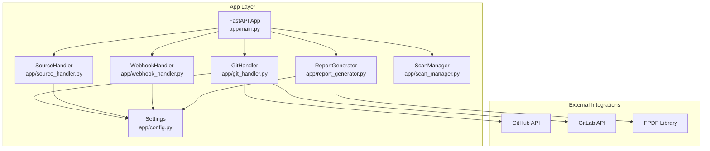
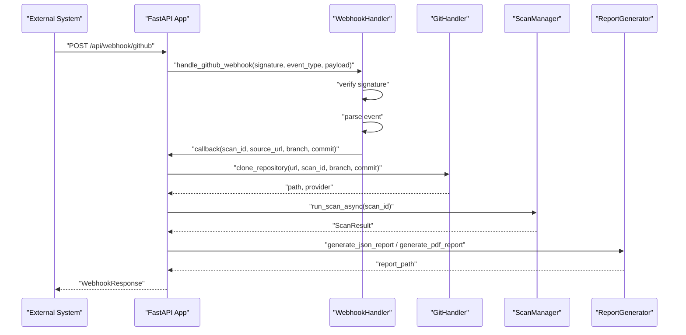
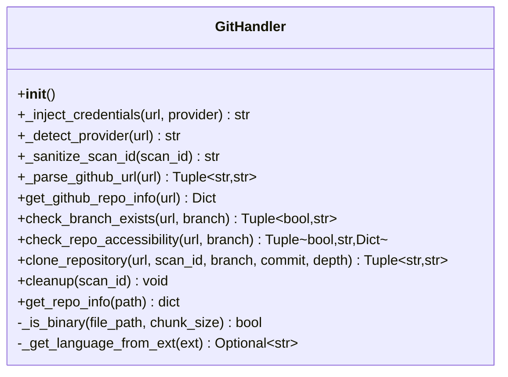
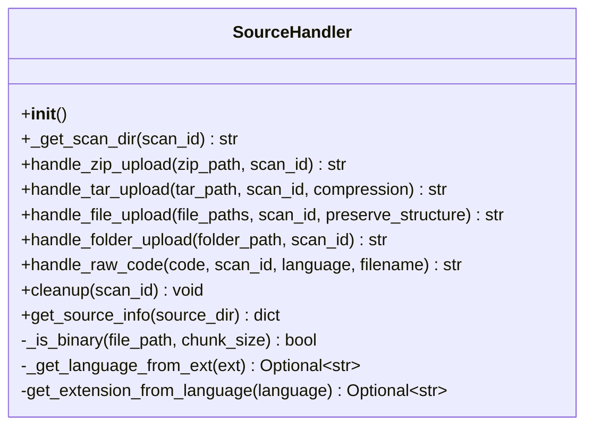
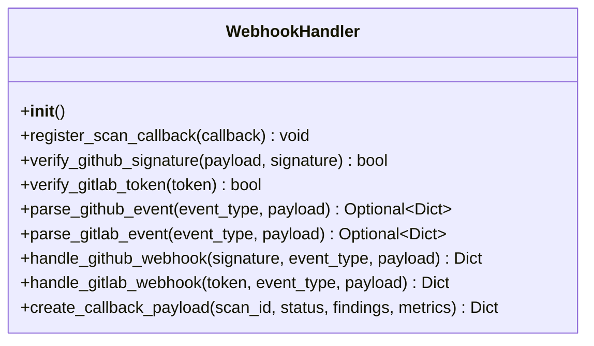
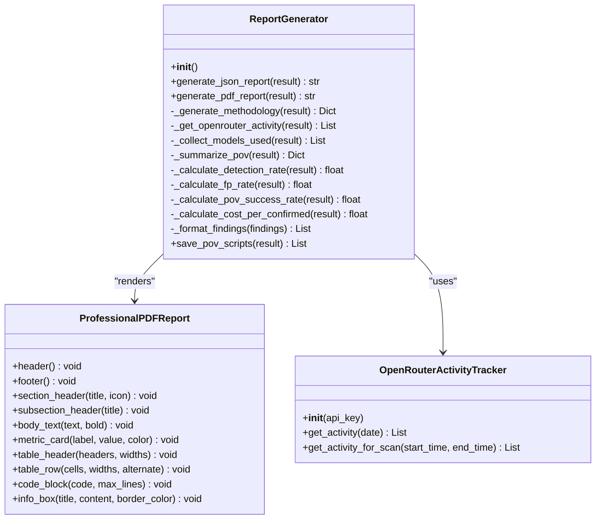
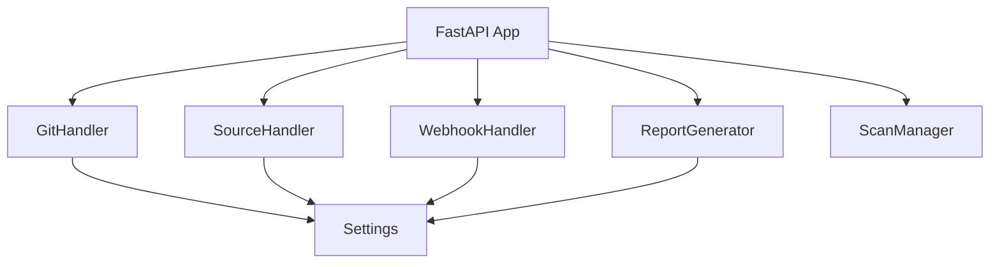

# Utility Services

<cite>
**Referenced Files in This Document**
- [git_handler.py](file://app/git_handler.py)
- [source_handler.py](file://app/source_handler.py)
- [webhook_handler.py](file://app/webhook_handler.py)
- [report_generator.py](file://app/report_generator.py)
- [config.py](file://app/config.py)
- [main.py](file://app/main.py)
- [scan_manager.py](file://app/scan_manager.py)
- [test_git_handler.py](file://tests/test_git_handler.py)
- [test_source_handler.py](file://tests/test_source_handler.py)
- [test_webhook_handler.py](file://tests/test_webhook_handler.py)
</cite>

## Table of Contents
1. [Introduction](#introduction)
2. [Project Structure](#project-structure)
3. [Core Components](#core-components)
4. [Architecture Overview](#architecture-overview)
5. [Detailed Component Analysis](#detailed-component-analysis)
6. [Dependency Analysis](#dependency-analysis)
7. [Performance Considerations](#performance-considerations)
8. [Troubleshooting Guide](#troubleshooting-guide)
9. [Conclusion](#conclusion)

## Introduction
This document provides comprehensive documentation for AutoPoV’s utility services and helper modules that power the codebase ingestion pipeline, external integrations, and reporting capabilities. It covers:
- Git handler for repository cloning, branch management, and commit tracking
- Source handler for file ingestion, preprocessing, and format conversion
- Webhook handler for external system integration, event processing, and callback management
- Report generator for PDF/JSON output, template rendering, and data export

It includes usage examples, error handling strategies, integration patterns, performance considerations, caching strategies, and operational monitoring guidance for each utility service.

## Project Structure
The utility services are implemented as cohesive modules within the application layer and integrate with configuration, scanning orchestration, and reporting systems.

**Diagram sources**
- [git_handler.py:1-392](file://app/git_handler.py#L1-L392)
- [source_handler.py:1-382](file://app/source_handler.py#L1-L382)
- [webhook_handler.py:1-363](file://app/webhook_handler.py#L1-L363)
- [report_generator.py:1-830](file://app/report_generator.py#L1-L830)
- [config.py:1-255](file://app/config.py#L1-L255)
- [main.py:1-768](file://app/main.py#L1-L768)
- [scan_manager.py:1-663](file://app/scan_manager.py#L1-L663)

**Section sources**
- [git_handler.py:1-392](file://app/git_handler.py#L1-L392)
- [source_handler.py:1-382](file://app/source_handler.py#L1-L382)
- [webhook_handler.py:1-363](file://app/webhook_handler.py#L1-L363)
- [report_generator.py:1-830](file://app/report_generator.py#L1-L830)
- [config.py:1-255](file://app/config.py#L1-L255)
- [main.py:1-768](file://app/main.py#L1-L768)
- [scan_manager.py:1-663](file://app/scan_manager.py#L1-L663)

## Core Components
- GitHandler: Clones repositories from GitHub, GitLab, and Bitbucket; injects credentials; verifies accessibility; checks branches; tracks repository metadata; cleans up temporary clones.
- SourceHandler: Handles ZIP/TAR uploads, file/folder uploads, and raw code paste; performs path traversal checks; preserves or flattens directory structure; detects binary files.
- WebhookHandler: Verifies GitHub/GitLab signatures/tokens; parses push/PR/MR events; triggers scans via callback; creates structured callback payloads.
- ReportGenerator: Generates JSON and PDF reports; renders professional templates; aggregates metrics; integrates OpenRouter usage tracking; exports PoV scripts.

**Section sources**
- [git_handler.py:20-392](file://app/git_handler.py#L20-L392)
- [source_handler.py:18-382](file://app/source_handler.py#L18-L382)
- [webhook_handler.py:15-363](file://app/webhook_handler.py#L15-L363)
- [report_generator.py:200-830](file://app/report_generator.py#L200-L830)

## Architecture Overview
The utility services integrate with the main FastAPI application and the scanning orchestrator. Webhooks trigger asynchronous scans that clone codebases, run analysis, and produce reports.

**Diagram sources**
- [main.py:134-173](file://app/main.py#L134-L173)
- [webhook_handler.py:196-266](file://app/webhook_handler.py#L196-L266)
- [git_handler.py:199-294](file://app/git_handler.py#L199-L294)
- [scan_manager.py:117-200](file://app/scan_manager.py#L117-L200)
- [report_generator.py:209-262](file://app/report_generator.py#L209-L262)

## Detailed Component Analysis

### Git Handler
The GitHandler manages repository ingestion from multiple providers, handles authentication, and prepares codebases for scanning.

- Provider detection and credential injection
- Pre-checks for repository accessibility and branch existence
- Shallow cloning with timeouts and cleanup
- Repository metadata extraction and language statistics

**Diagram sources**
- [git_handler.py:20-392](file://app/git_handler.py#L20-L392)

Key behaviors:
- Credentials are injected into URLs for GitHub, GitLab, and Bitbucket when configured.
- Accessibility checks include size limits and branch verification for GitHub.
- Cloning uses subprocess with timeouts and removes .git metadata to save space.
- Repository info aggregation counts files, lines, and languages.

Usage example paths:
- [git_handler.py:199-294](file://app/git_handler.py#L199-L294)
- [git_handler.py:303-336](file://app/git_handler.py#L303-L336)

Error handling:
- GitCommandError raised for authentication failures, not found, network errors, and timeouts.
- Cleanup removes partial clones on failure.

Integration patterns:
- Called by the webhook flow to clone repositories before scanning.
- Provides repository metadata for pre-scan validation.

**Section sources**
- [git_handler.py:20-392](file://app/git_handler.py#L20-L392)
- [test_git_handler.py:1-63](file://tests/test_git_handler.py#L1-L63)

### Source Handler
The SourceHandler ingests code from multiple input formats, enforces security against path traversal, and prepares source trees for analysis.

- ZIP/TAR extraction with path traversal checks
- File/folder upload handling with optional structure preservation
- Raw code paste with language-aware filename inference
- Binary file detection for specialized parsing

**Diagram sources**
- [source_handler.py:18-382](file://app/source_handler.py#L18-L382)

Key behaviors:
- Path traversal checks ensure extracted members stay within the destination directory.
- Raw code writes with inferred extensions based on language names.
- Binary detection supports later parsing with specialized tools.

Usage example paths:
- [source_handler.py:31-78](file://app/source_handler.py#L31-L78)
- [source_handler.py:126-164](file://app/source_handler.py#L126-L164)
- [source_handler.py:193-232](file://app/source_handler.py#L193-L232)

Error handling:
- Raises ValueError on detected path traversal attempts.
- Cleans up scan directories on completion.

Integration patterns:
- Used by the main application for non-Git ingestion flows.
- Supplies source metadata for scan configuration.

**Section sources**
- [source_handler.py:18-382](file://app/source_handler.py#L18-L382)
- [test_source_handler.py:1-79](file://tests/test_source_handler.py#L1-L79)

### Webhook Handler
The WebhookHandler validates and parses events from GitHub and GitLab, triggering scans asynchronously and managing callback payloads.

- Signature/token verification for GitHub/GitLab
- Event parsing for push and pull/merge request events
- Callback registration to trigger scans from external systems
- Structured callback payloads for downstream reporting

**Diagram sources**
- [webhook_handler.py:15-363](file://app/webhook_handler.py#L15-L363)

Key behaviors:
- HMAC verification for GitHub and GitLab tokens.
- Parses event payloads to extract repository, branch, commit, and author information.
- Triggers scans asynchronously via registered callback.

Usage example paths:
- [webhook_handler.py:196-266](file://app/webhook_handler.py#L196-L266)
- [webhook_handler.py:267-336](file://app/webhook_handler.py#L267-L336)
- [webhook_handler.py:338-353](file://app/webhook_handler.py#L338-L353)

Error handling:
- Returns structured responses for invalid signatures, malformed JSON, ignored events, and missing callbacks.

Integration patterns:
- Registered in the FastAPI lifespan to trigger scans from external systems.
- Used by the main application to orchestrate webhook-driven scans.

**Section sources**
- [webhook_handler.py:15-363](file://app/webhook_handler.py#L15-L363)
- [test_webhook_handler.py:1-166](file://tests/test_webhook_handler.py#L1-L166)
- [main.py:94-111](file://app/main.py#L94-L111)
- [main.py:134-173](file://app/main.py#L134-L173)

### Report Generator
The ReportGenerator produces JSON and PDF reports from scan results, including metrics, findings, and PoV validation outcomes. It integrates with OpenRouter for usage tracking.

- JSON report generation with comprehensive metadata and metrics
- Professional PDF report with sections for executive summary, findings, methodology, and appendices
- OpenRouter activity tracking for model usage attribution
- PoV script export and summary aggregation

**Diagram sources**
- [report_generator.py:200-830](file://app/report_generator.py#L200-L830)

Key behaviors:
- JSON report includes scan metadata, model usage, metrics, findings, and methodology.
- PDF report uses a custom ProfessionalPDFReport class with branded sections and tables.
- OpenRouter activity is fetched for usage attribution when online mode is enabled.
- PoV scripts are summarized and exported for confirmed vulnerabilities.

Usage example paths:
- [report_generator.py:209-262](file://app/report_generator.py#L209-L262)
- [report_generator.py:264-610](file://app/report_generator.py#L264-L610)
- [report_generator.py:800-830](file://app/report_generator.py#L800-L830)

Error handling:
- Raises ReportGeneratorError when PDF generation is attempted without the required library.
- Gracefully falls back to JSON when external APIs are unavailable.

Integration patterns:
- Consumed by the main application after scans complete.
- Works with ScanResult objects produced by ScanManager.

**Section sources**
- [report_generator.py:200-830](file://app/report_generator.py#L200-L830)
- [config.py:136-149](file://app/config.py#L136-L149)
- [scan_manager.py:23-45](file://app/scan_manager.py#L23-L45)

## Dependency Analysis
The utility services depend on configuration settings and integrate with the scanning orchestrator and FastAPI application.

**Diagram sources**
- [git_handler.py:17-25](file://app/git_handler.py#L17-L25)
- [source_handler.py:15-23](file://app/source_handler.py#L15-L23)
- [webhook_handler.py:12-20](file://app/webhook_handler.py#L12-L20)
- [report_generator.py:13-14](file://app/report_generator.py#L13-L14)
- [config.py:248-254](file://app/config.py#L248-L254)
- [main.py:21-27](file://app/main.py#L21-L27)
- [scan_manager.py:18-20](file://app/scan_manager.py#L18-L20)

**Section sources**
- [config.py:136-149](file://app/config.py#L136-L149)
- [main.py:21-27](file://app/main.py#L21-L27)
- [scan_manager.py:18-20](file://app/scan_manager.py#L18-L20)

## Performance Considerations
- Git cloning
  - Use shallow clones and branch-specific checkout to reduce bandwidth and storage.
  - Apply timeouts to prevent long-running operations on large repositories.
  - Remove .git metadata after cloning to minimize disk usage.
  - Validate repository size and branch availability before cloning to avoid wasted resources.

- Source ingestion
  - Enforce path traversal checks to avoid malicious archives.
  - Prefer streaming extraction for large archives when feasible.
  - Skip binary files during preprocessing to reduce I/O overhead.

- Webhook processing
  - Verify signatures/tokens early to fail fast on invalid requests.
  - Asynchronously trigger scans to keep webhook responses quick.
  - Limit event parsing to scan-relevant actions to reduce processing.

- Reporting
  - PDF generation depends on an external library; guard with availability checks.
  - Limit table rows and code block truncation to manage PDF size.
  - Aggregate metrics and summaries to minimize report payload sizes.

[No sources needed since this section provides general guidance]

## Troubleshooting Guide
Common issues and resolutions:
- GitHandler
  - Authentication failures: Ensure provider tokens are configured and valid.
  - Network errors: Verify connectivity and consider shallow clones for large repos.
  - Timeout errors: Reduce clone depth or use ZIP upload for very large repositories.

- SourceHandler
  - Path traversal errors: Validate archive contents and reject suspicious entries.
  - Permission errors: Ensure write permissions to temporary directories.

- WebhookHandler
  - Invalid signatures/tokens: Confirm secrets match provider configurations.
  - Unsupported events: Only push and pull/merge request events trigger scans.

- ReportGenerator
  - PDF generation failures: Install the required library or fall back to JSON.
  - Missing OpenRouter data: Confirm API key and online mode configuration.

Operational monitoring:
- Track scan durations and costs via ScanResult metrics.
- Monitor webhook event processing success rates and error messages.
- Observe repository size and branch availability checks to preempt failures.

**Section sources**
- [git_handler.py:243-294](file://app/git_handler.py#L243-L294)
- [source_handler.py:56-63](file://app/source_handler.py#L56-L63)
- [webhook_handler.py:213-265](file://app/webhook_handler.py#L213-L265)
- [report_generator.py:266-267](file://app/report_generator.py#L266-L267)

## Conclusion
AutoPoV’s utility services provide robust, secure, and scalable foundations for codebase ingestion, external integration, and reporting. By leveraging provider-specific authentication, strict security checks, asynchronous processing, and comprehensive reporting, the system supports efficient vulnerability discovery and validation workflows. Proper configuration, monitoring, and error handling ensure reliable operation across diverse environments.