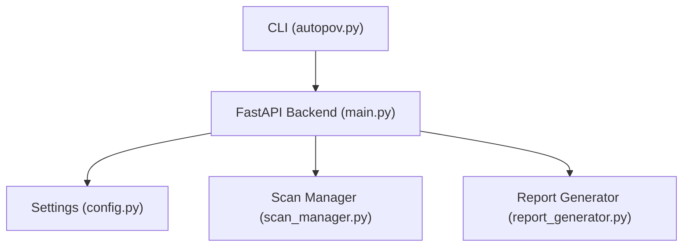
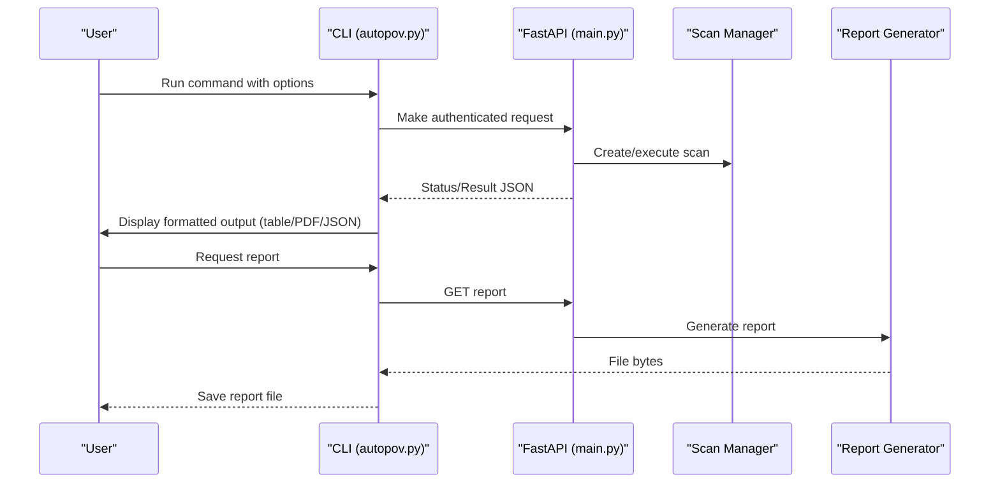
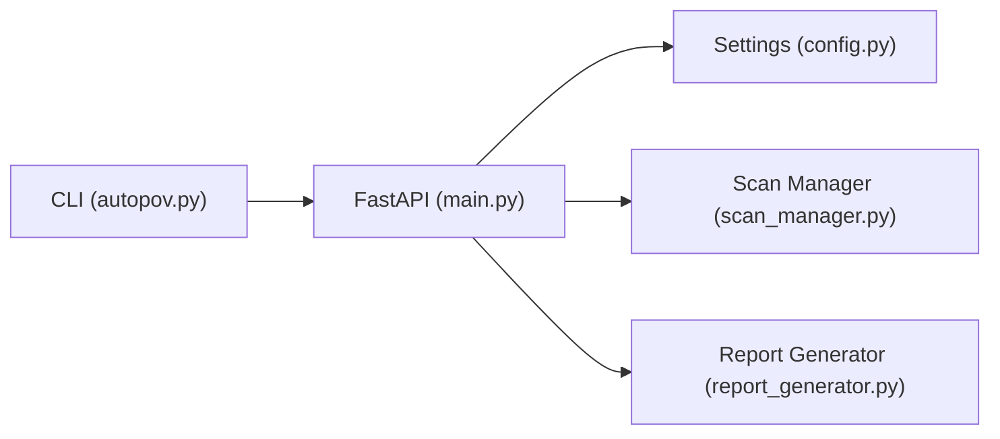

# CLI Reference

<cite>
**Referenced Files in This Document**
- [autopov.py](file://cli/autopov.py)
- [main.py](file://app/main.py)
- [config.py](file://app/config.py)
- [scan_manager.py](file://app/scan_manager.py)
- [report_generator.py](file://app/report_generator.py)
- [README.md](file://README.md)
- [agent-run.sh](file://cli/agent-run.sh)
</cite>

## Table of Contents
1. [Introduction](#introduction)
2. [Project Structure](#project-structure)
3. [Core Components](#core-components)
4. [Architecture Overview](#architecture-overview)
5. [Detailed Component Analysis](#detailed-component-analysis)
6. [Dependency Analysis](#dependency-analysis)
7. [Performance Considerations](#performance-considerations)
8. [Troubleshooting Guide](#troubleshooting-guide)
9. [Conclusion](#conclusion)
10. [Appendices](#appendices)

## Introduction
This document provides a comprehensive CLI reference for AutoPoV’s command-line interface. It covers all available commands, options, and arguments for scanning, result viewing, report generation, and key management. It explains interactive model selection, specific model targeting, and batch operation capabilities. It documents scan input options including Git repositories, local directories, ZIP uploads, and raw code pasting. It also details result formatting options, filtering capabilities, and output customization. Automation examples for CI/CD integration, scheduled scanning, and bulk operations are included, along with environment variable usage, configuration overrides, and troubleshooting common CLI issues. Advanced workflows such as benchmarking and replay operations are explained alongside integration with external tools.

## Project Structure
The CLI is implemented as a Click-based command-line tool that communicates with the AutoPoV backend API. The CLI wraps the backend endpoints and provides a convenient interface for users to trigger scans, monitor progress, and retrieve results.

**Diagram sources**
- [autopov.py:1-1096](file://cli/autopov.py#L1-L1096)
- [main.py:1-768](file://app/main.py#L1-L768)
- [config.py:1-255](file://app/config.py#L1-L255)
- [scan_manager.py:1-200](file://app/scan_manager.py#L1-L200)
- [report_generator.py:1-200](file://app/report_generator.py#L1-L200)

**Section sources**
- [autopov.py:1-1096](file://cli/autopov.py#L1-L1096)
- [main.py:1-768](file://app/main.py#L1-L768)
- [config.py:1-255](file://app/config.py#L1-L255)

## Core Components
- CLI entry point and command groups:
  - Root group with version option and global options.
  - Subcommands for scanning, pasting code, managing results, history, policy, metrics, health, report generation, key management, and admin operations.
- API integration:
  - Centralized request helper handles HTTP methods, authentication, and error handling.
  - Supports GET, POST, and DELETE requests to backend endpoints.
- Interactive model selection:
  - Provides a menu to choose among providers and models when not explicitly specified.
- Output formatting:
  - Supports JSON, table, and PDF output for results and reports.

**Section sources**
- [autopov.py:93-137](file://cli/autopov.py#L93-L137)
- [autopov.py:56-91](file://cli/autopov.py#L56-L91)
- [autopov.py:118-133](file://cli/autopov.py#L118-L133)

## Architecture Overview
The CLI communicates with the backend API, which orchestrates agent-based vulnerability scanning. The CLI encapsulates the API interactions and presents a user-friendly interface.

**Diagram sources**
- [autopov.py:888-1096](file://cli/autopov.py#L888-L1096)
- [main.py:204-400](file://app/main.py#L204-L400)
- [report_generator.py:144-200](file://app/report_generator.py#L144-L200)

## Detailed Component Analysis

### Command Groups and Commands
- Root group:
  - Version option via Click decorator.
- Subcommands:
  - scan: Git repository, ZIP file, or local directory scanning.
  - paste: Scan code pasted from stdin.
  - cancel: Cancel a running scan.
  - replay: Re-run findings against one or more models for benchmarking.
  - results: Retrieve and display scan results.
  - history: Paginated scan history.
  - policy: Show agent learning store summary and model performance.
  - metrics: Show system metrics.
  - health: Show server health and tool availability.
  - report: Download JSON or PDF report.
  - keys: Admin-only API key management (generate, list, revoke).
  - admin: Admin-only server maintenance (cleanup).
  - config: Show client and server configuration.

**Section sources**
- [autopov.py:139-1096](file://cli/autopov.py#L139-L1096)

### Scan Command
Purpose:
- Initiate vulnerability scans from Git repositories, ZIP archives, or local directories.

Inputs:
- Positional argument source:
  - Git URL (supports http/https/git@), ZIP file path, or local directory path.
- Options:
  - --model, -m: Specific model identifier (overrides interactive selection).
  - --cwe, -c: One or more CWE identifiers (repeatable).
  - --output, -o: Output format (json, table, pdf).
  - --api-key, -k: API key override.
  - --branch, -b: Git branch for repository scans.
  - --lite: Lite scan mode (static analysis only).
  - --wait/--no-wait: Wait for completion or return immediately.

Behavior:
- Determines source type and constructs appropriate request payload.
- For Git: Sends POST to /scan/git with URL, branch, model, CWEs, and lite flag.
- For ZIP: Sends POST to /scan/zip with model, CWEs, and file content.
- For directory: Zips the directory and uploads it as a ZIP.
- On success, prints scan_id and either monitors until completion or instructs to use results command.

Interactive model selection:
- If --model is not provided, displays a menu of providers and models and returns the selected model identifier.

Supported CWEs:
- If --cwe is not provided, fetches supported CWEs from backend configuration.

Output formatting:
- If --output=json, prints raw JSON.
- If --output=table, prints a formatted table with summary and confirmed findings.
- If --output=pdf, downloads a PDF report.

**Section sources**
- [autopov.py:139-240](file://cli/autopov.py#L139-L240)
- [autopov.py:100-107](file://cli/autopov.py#L100-L107)
- [autopov.py:118-133](file://cli/autopov.py#L118-L133)
- [autopov.py:888-975](file://cli/autopov.py#L888-L975)

### Paste Command
Purpose:
- Scan code pasted from stdin.

Inputs:
- Options:
  - --language, -l: Target language (python, javascript, c, cpp, java, go, rust).
  - --filename, -f: Virtual filename for the pasted code.
  - --model, -m: Specific model identifier.
  - --cwe, -c: One or more CWE identifiers (repeatable).
  - --output, -o: Output format (json, table, pdf).
  - --api-key, -k: API key override.
  - --lite: Lite scan mode.
  - --wait/--no-wait: Wait for completion or return immediately.

Behavior:
- Reads code from stdin; if stdin is not attached, prompts for input.
- Sends POST to /scan/paste with code, language, filename, model, CWEs, and lite flag.
- Prints scan_id and either monitors until completion or instructs to use results command.

**Section sources**
- [autopov.py:246-322](file://cli/autopov.py#L246-L322)
- [autopov.py:888-975](file://cli/autopov.py#L888-L975)

### Cancel Command
Purpose:
- Cancel a running scan.

Inputs:
- Positional argument scan_id.
- Option --api-key, -k: API key override.

Behavior:
- Sends POST to /scan/{scan_id}/cancel.
- Prints confirmation message.

**Section sources**
- [autopov.py:328-343](file://cli/autopov.py#L328-L343)

### Replay Command
Purpose:
- Re-run a completed scan’s findings against one or more agent models for benchmarking.

Inputs:
- Positional argument scan_id.
- Option --model, -m: One or more model identifiers (repeatable; required).
- Option --include-failed: Include failed/unconfirmed findings in replay.
- Option --max-findings: Maximum number of findings to replay (default 50).
- Option --api-key, -k: API key override.

Behavior:
- Sends POST to /scan/{scan_id}/replay with models, include_failed, and max_findings.
- Starts one or more replay scans and prints a table of replay IDs and models.

**Section sources**
- [autopov.py:349-405](file://cli/autopov.py#L349-L405)

### Results Command
Purpose:
- Retrieve and display scan results.

Inputs:
- Positional argument scan_id.
- Option --output, -o: Output format (json, table, pdf).
- Option --api-key, -k: API key override.

Behavior:
- Calls display_results(scan_id, api_key, output) which:
  - GETs /scan/{scan_id}.
  - If output=json, prints raw JSON.
  - If output=table, prints a summary panel and tables for confirmed findings, errors, and pending/skipped findings.
  - If output=pdf, downloads a PDF report.

**Section sources**
- [autopov.py:411-426](file://cli/autopov.py#L411-L426)
- [autopov.py:977-1092](file://cli/autopov.py#L977-L1092)

### History Command
Purpose:
- Show paginated scan history.

Inputs:
- Option --limit, -l: Number of results per page (default 20).
- Option --page, -p: Page number (default 1).
- Option --api-key, -k: API key override.

Behavior:
- GETs /history with limit and offset.
- Prints a table with scan_id, status, model, confirmed count, cost, and date.
- Shows pagination hints for previous and next pages.

**Section sources**
- [autopov.py:432-502](file://cli/autopov.py#L432-L502)

### Policy Command
Purpose:
- Show agent learning store: model performance and cost statistics.

Inputs:
- Option --api-key, -k: API key override.

Behavior:
- GETs /learning/summary.
- Prints a summary panel and separate tables for Investigator and PoV generator agent performance.

**Section sources**
- [autopov.py:508-575](file://cli/autopov.py#L508-L575)

### Metrics Command
Purpose:
- Show system metrics (scan counts, durations, costs).

Inputs:
- Option --api-key, -k: API key override.

Behavior:
- GETs /metrics.
- Prints a panel with key-value metrics.

**Section sources**
- [autopov.py:580-607](file://cli/autopov.py#L580-L607)

### Health Command
Purpose:
- Show server health and available tool integrations.

Behavior:
- GETs /api/health.
- Prints status, version, and availability of Docker, CodeQL, and Joern.

**Section sources**
- [autopov.py:613-637](file://cli/autopov.py#L613-L637)

### Report Command
Purpose:
- Download a scan report (JSON or PDF).

Inputs:
- Positional argument scan_id.
- Option --format, -f: Report format (json, pdf).
- Option --api-key, -k: API key override.

Behavior:
- GETs /report/{scan_id}?format={format}.
- Saves the report to a file named {scan_id}_report.{format}.

**Section sources**
- [autopov.py:643-673](file://cli/autopov.py#L643-L673)

### Keys Command Group (Admin)
- keys generate:
  - Generates a new API key (admin only).
  - Saves the key to ~/.autopov/config.json.
- keys list:
  - Lists all API keys (admin only).
- keys revoke:
  - Revokes an API key by ID (admin only).

Options:
- --admin-key, -a: Admin API key override.
- --name, -n: Key name for generate.

**Section sources**
- [autopov.py:679-793](file://cli/autopov.py#L679-L793)

### Admin Command Group (Admin)
- admin cleanup:
  - Cleans up old scan result files on the server (admin only).
  - Options: --max-age-days, --max-results.

**Section sources**
- [autopov.py:800-842](file://cli/autopov.py#L800-L842)

### Config Command
Purpose:
- Show client and server configuration.

Behavior:
- Prints API base URL, stored API key, and config file path.
- Optionally prints server configuration (app version, routing mode, model mode, auto model, tool availability, supported CWE count).

**Section sources**
- [autopov.py:847-882](file://cli/autopov.py#L847-L882)

### Interactive Model Selection
When a model is not specified via --model, the CLI presents a menu of providers and models and returns the selected model identifier. This enables quick experimentation without hardcoding model names.

**Section sources**
- [autopov.py:118-133](file://cli/autopov.py#L118-L133)

### Batch Operations and Automation
- Multiple scans:
  - Chain multiple scan commands in shell scripts or CI jobs.
  - Use --wait/--no-wait to control blocking behavior.
- Scheduled scanning:
  - Use cron or scheduler to run autopov scan commands at intervals.
- Bulk operations:
  - Iterate over a list of repositories or directories and invoke autopov scan for each.
- CI/CD integration:
  - Use results and report commands to publish artifacts.
  - Use cancel to abort long-running scans if needed.

**Section sources**
- [autopov.py:139-240](file://cli/autopov.py#L139-L240)
- [autopov.py:411-426](file://cli/autopov.py#L411-L426)
- [autopov.py:643-673](file://cli/autopov.py#L643-L673)

### Advanced Workflows
- Benchmarking:
  - Use replay to compare model performance on the same findings.
- Replay operations:
  - Re-run any prior scan’s findings against different models for comparative analysis.
- Integration with external tools:
  - Use the REST API endpoints for programmatic control and integration with CI systems.

**Section sources**
- [autopov.py:349-405](file://cli/autopov.py#L349-L405)
- [main.py:404-491](file://app/main.py#L404-L491)

## Dependency Analysis
The CLI depends on the backend API for all operations. The backend orchestrates scanning, manages results, and generates reports.

**Diagram sources**
- [autopov.py:56-91](file://cli/autopov.py#L56-L91)
- [main.py:1-768](file://app/main.py#L1-L768)
- [config.py:1-255](file://app/config.py#L1-L255)
- [scan_manager.py:1-200](file://app/scan_manager.py#L1-L200)
- [report_generator.py:1-200](file://app/report_generator.py#L1-L200)

**Section sources**
- [autopov.py:56-91](file://cli/autopov.py#L56-L91)
- [main.py:1-768](file://app/main.py#L1-L768)

## Performance Considerations
- Lite scans:
  - Use --lite to reduce runtime and cost by skipping certain validations.
- Output formatting:
  - JSON output avoids rendering overhead; table output provides readability; PDF generation requires server-side report generation.
- Pagination:
  - Use history with appropriate limits and pages to avoid large payloads.
- Rate limiting:
  - The backend enforces rate limits per API key; avoid excessive concurrent scans.

[No sources needed since this section provides general guidance]

## Troubleshooting Guide
Common issues and resolutions:
- API key missing:
  - Set AUTOPOV_API_KEY or use --api-key.
  - For admin commands, set AUTOPOV_ADMIN_KEY or use --admin-key.
- Server connectivity:
  - Use health to verify server status and tool availability.
- Authentication failures:
  - Verify API key validity and rate limit status.
- Scan cancellation:
  - Use cancel only when the scan is in running state.
- Report generation:
  - Ensure the scan has completed and the report endpoint is reachable.

**Section sources**
- [autopov.py:29-54](file://cli/autopov.py#L29-L54)
- [autopov.py:613-637](file://cli/autopov.py#L613-L637)
- [main.py:492-508](file://app/main.py#L492-L508)

## Conclusion
The AutoPoV CLI provides a powerful, flexible interface for triggering vulnerability scans, monitoring progress, retrieving results, and managing keys and server resources. It supports multiple input sources, interactive and explicit model selection, and various output formats. The CLI integrates tightly with the backend API and exposes advanced features such as replay and benchmarking, enabling robust automation and research workflows.

[No sources needed since this section summarizes without analyzing specific files]

## Appendices

### Environment Variables and Configuration Overrides
- Client-side:
  - AUTOPOV_API_KEY: API key for authentication.
  - AUTOPOV_ADMIN_KEY: Admin key for admin-only commands.
  - AUTOPOV_API_URL: Override backend base URL (defaults to http://localhost:8000/api).
- Server-side (backend configuration):
  - OPENROUTER_API_KEY: LLM reasoning provider key.
  - ADMIN_API_KEY: Admin key for key management.
  - MODEL_MODE: online or offline.
  - MODEL_NAME: Fixed model name when routing mode is fixed.
  - ROUTING_MODE: auto, fixed, or learning.
  - AUTO_ROUTER_MODEL: Auto-router model ID.
  - DOCKER_ENABLED: Enable Docker for PoV execution.
  - MAX_COST_USD: Per-scan cost ceiling.
  - Other settings influence tool availability and agent behavior.

**Section sources**
- [autopov.py:26](file://cli/autopov.py#L26)
- [config.py:13-255](file://app/config.py#L13-L255)
- [README.md:288-328](file://README.md#L288-L328)

### Example Usage Patterns
- Interactive model selection:
  - autopov scan https://github.com/user/repo.git
- Specific model targeting:
  - autopov scan https://github.com/user/repo.git --model openai/gpt-4o
- Local directory scanning:
  - autopov scan /path/to/code
- Specific CWEs:
  - autopov scan https://github.com/user/repo.git --cwe CWE-89 --cwe CWE-79
- View results as table:
  - autopov results <scan_id>
- Download PDF report:
  - autopov report <scan_id> --format pdf
- View scan history:
  - autopov history --limit 20
- Key management:
  - autopov keys generate --admin-key <admin_key> --name team
  - autopov keys list --admin-key <admin_key>

**Section sources**
- [README.md:196-284](file://README.md#L196-L284)

### Container Bridge Script
- agent-run.sh:
  - Bridges CLI commands to a running Docker container named autopov-api.
  - Ensures the container is running before forwarding commands.

**Section sources**
- [agent-run.sh:1-11](file://cli/agent-run.sh#L1-L11)