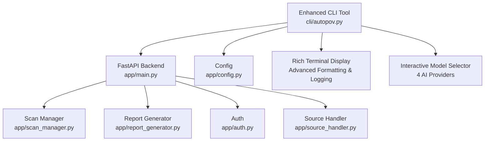
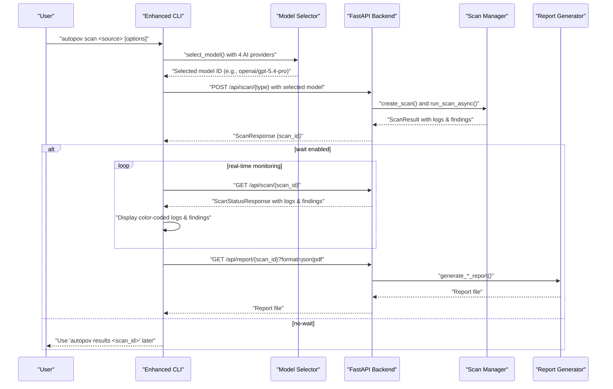
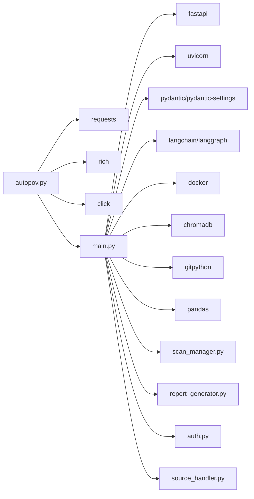

# CLI Tool

<cite>
**Referenced Files in This Document**
- [autopov.py](file://cli/autopov.py)
- [main.py](file://app/main.py)
- [config.py](file://app/config.py)
- [scan_manager.py](file://app/scan_manager.py)
- [report_generator.py](file://app/report_generator.py)
- [auth.py](file://app/auth.py)
- [source_handler.py](file://app/source_handler.py)
- [ModelSelector.jsx](file://frontend/src/components/ModelSelector.jsx)
- [README.md](file://README.md)
- [requirements.txt](file://requirements.txt)
</cite>

## Update Summary
**Changes Made**
- Enhanced CLI with interactive model selection menu featuring 4 AI providers
- Added real-time color-coded model selection feedback
- Integrated automatic model saving functionality
- Updated model provider list with OpenAI GPT-5.4-pro, Anthropic Claude-sonnet-4.6, Google Gemini-3.1-flash-lite-preview, and X-AI Grok-4.1-fast
- Improved user experience with immediate model confirmation and validation

## Table of Contents
1. [Introduction](#introduction)
2. [Project Structure](#project-structure)
3. [Core Components](#core-components)
4. [Architecture Overview](#architecture-overview)
5. [Detailed Component Analysis](#detailed-component-analysis)
6. [Interactive Model Selection System](#interactive-model-selection-system)
7. [Real-Time Monitoring and Logging](#real-time-monitoring-and-logging)
8. [Advanced Finding Display System](#advanced-finding-display-system)
9. [Dependency Analysis](#dependency-analysis)
10. [Performance Considerations](#performance-considerations)
11. [Troubleshooting Guide](#troubleshooting-guide)
12. [Conclusion](#conclusion)
13. [Appendices](#appendices)

## Introduction
This document provides comprehensive guidance for AutoPoV's command-line interface (CLI), focusing on automation capabilities and scripting scenarios. The CLI has been completely rewritten as a sophisticated command-line interface with intelligent source type detection, real-time monitoring, and Rich library integration. The enhanced CLI now supports Git repository scanning, ZIP file processing, directory scanning, and provides comprehensive real-time monitoring with color-coded logging and confidence-based finding display.

The CLI tool serves as the primary interface for automation, batch processing, and CI/CD integration scenarios, offering seamless integration with the AutoPoV backend through HTTP APIs with comprehensive error handling and user-friendly output formatting.

**Updated** Enhanced with interactive model selection menu featuring 4 AI providers with real-time feedback and automatic model saving functionality.

## Project Structure
The CLI tool is implemented as a Click-based application that provides a comprehensive command-line interface for AutoPoV's vulnerability scanning capabilities. The CLI communicates with the FastAPI backend through HTTP endpoints, providing real-time monitoring, sophisticated output formatting, and intelligent source type detection.



**Diagram sources**
- [autopov.py](file://cli/autopov.py#L1-L618)
- [main.py](file://app/main.py#L1-L577)
- [config.py](file://app/config.py#L1-L234)
- [scan_manager.py](file://app/scan_manager.py#L1-L348)
- [report_generator.py](file://app/report_generator.py#L1-L359)
- [auth.py](file://app/auth.py#L1-L179)
- [source_handler.py](file://app/source_handler.py#L1-L380)

**Section sources**
- [autopov.py](file://cli/autopov.py#L1-L618)
- [main.py](file://app/main.py#L1-L577)

## Core Components
The enhanced CLI tool consists of several sophisticated components that work together to provide a comprehensive command-line interface:

- **Click-based Command Framework**: Implements a hierarchical command structure with subcommands for scanning, results, history, report generation, and API key management
- **Intelligent Source Type Detection**: Automatically identifies and processes Git repositories, ZIP files, and local directories with appropriate handling for each source type
- **Interactive Model Selection System**: Provides real-time model selection with 4 AI providers (OpenAI, Anthropic, Google, X-AI) and color-coded feedback
- **Real-time Monitoring System**: Provides continuous updates during scan execution with color-coded logging and immediate finding notifications
- **Rich Terminal Integration**: Utilizes the Rich library for advanced formatting, tables, panels, and color-coded displays
- **Comprehensive API Integration**: Handles HTTP requests with authentication, error handling, and real-time streaming capabilities
- **Advanced Finding Display**: Shows findings with confidence-based color coding (high: 🔴, medium: 🟡, low: 🔵) for quick vulnerability assessment
- **Flexible Output Formatting**: Supports JSON, table, and PDF outputs with sophisticated terminal display capabilities

Key CLI commands:
- **scan**: Initiates scans from Git repositories, ZIP archives, or local directories with real-time monitoring and color-coded logging
- **results**: Retrieves and displays scan results with enhanced formatting and status information
- **history**: Lists recent scan history with improved table display and status indicators
- **report**: Generates JSON or PDF reports with comprehensive metrics and findings
- **keys**: Manages API keys (admin-only) with enhanced security and validation
- **config**: Displays current configuration with detailed system information

**Updated** Added interactive model selection with 4 AI providers and real-time feedback system.

**Section sources**
- [autopov.py](file://cli/autopov.py#L89-L618)

## Architecture Overview
The CLI interacts with the backend via HTTP endpoints with sophisticated real-time monitoring capabilities. The backend coordinates scanning, persistence, and reporting with advanced logging and finding management.



**Diagram sources**
- [autopov.py](file://cli/autopov.py#L114-L160)
- [main.py](file://app/main.py#L191-L434)
- [scan_manager.py](file://app/scan_manager.py#L86-L176)
- [report_generator.py](file://app/report_generator.py#L76-L118)

## Detailed Component Analysis

### Enhanced CLI Commands and Options

#### scan
**Purpose**: Initiate vulnerability scans from multiple source types with real-time monitoring and color-coded logging.

**Syntax**:
- autopov scan SOURCE [--model MODEL] [--cwe CWE ...] [--output FORMAT] [--api-key KEY] [--branch BRANCH] [--wait/--no-wait]

**Parameters**:
- **SOURCE**: Git URL (http/https/git@), ZIP file path (.zip), or local directory path.
- **--model/-m**: LLM model name (default: interactive selection from 4 AI providers).
- **--cwe/-c**: CWE identifiers to check (repeatable; defaults include comprehensive CWE list).
- **--output/-o**: Output format for immediate results (json, table, pdf).
- **--api-key/-k**: API key; if omitted, CLI reads from environment or config.
- **--branch/-b**: Git branch for repository scans.
- **--wait/--no-wait**: Poll for completion and display results immediately (default: true).

**Enhanced Behavior**:
- **Interactive model selection**: Displays 4 AI providers (OpenAI GPT-5.4-pro, Anthropic Claude-sonnet-4.6, Google Gemini-3.1-flash-lite-preview, X-AI Grok-4.1-fast) with color-coded feedback.
- **Real-time monitoring**: Displays color-coded logs during scan execution with immediate finding notifications.
- **Intelligent source detection**: Automatically determines source type (Git, ZIP, directory) with enhanced error handling.
- **Confidence-based finding display**: Shows findings with color coding based on confidence levels (high: 🔴, medium: 🟡, low: 🔵).
- **Progress tracking**: Continuous updates of scan status, logs, and findings with duplicate prevention.
- **Graceful interruption**: Allows stopping monitoring with Ctrl+C while scan continues in background.

**Output formatting**:
- **If --output=json**: prints JSON result with enhanced status information.
- **If --output=table**: prints a summary panel with detailed metrics and a table of confirmed vulnerabilities.
- **If --output=pdf**: downloads and saves a comprehensive PDF report locally.

**Enhanced Error handling**:
- Exits with detailed error messages if API key is missing.
- Exits with informative error for unknown source types.
- Handles HTTP exceptions with color-coded error messages.
- Provides scan failure details with last logs for debugging.

**Practical examples**:
- Scan a public GitHub repository with real-time monitoring and specific model:
  - `autopov scan https://github.com/example/repo.git --model openai/gpt-5.4-pro --branch main --wait`
- Scan a local directory with immediate results:
  - `autopov scan /path/to/local/code --wait --output table`
- Scan a ZIP archive with multiple CWEs and no-wait option:
  - `autopov scan ./project.zip --cwe CWE-89 --cwe CWE-119 --cwe CWE-190 --cwe CWE-416 --no-wait`

**Automation tips**:
- Use `--no-wait` to start scans asynchronously and poll later with enhanced status checking.
- Use `--output=json` for machine-readable results in scripts with comprehensive status information.
- Combine with environment variables for API key and base URL management.
- Leverage real-time monitoring for CI/CD integration with immediate feedback.

**Section sources**
- [autopov.py](file://cli/autopov.py#L114-L160)
- [main.py](file://app/main.py#L191-L261)

#### results
**Purpose**: Retrieve and display scan results with enhanced formatting and status information.

**Syntax**:
- autopov results SCAN_ID [--output FORMAT] [--api-key KEY]

**Parameters**:
- **SCAN_ID**: Unique scan identifier returned by scan.
- **--output/-o**: Output format (json, table, pdf).
- **--api-key/-k**: API key override.

**Enhanced Behavior**:
- **Status-aware display**: Shows detailed scan status (completed, failed, running) with appropriate color coding.
- **Enhanced error reporting**: Displays comprehensive error messages and last logs for failed scans.
- **Rich table formatting**: Uses sophisticated table layouts with color-coded status indicators.
- **Summary metrics**: Provides detailed scan metrics including duration, cost, and vulnerability counts.

**Section sources**
- [autopov.py](file://cli/autopov.py#L313-L328)
- [main.py](file://app/main.py#L362-L396)

#### history
**Purpose**: List recent scan history with enhanced table display and status indicators.

**Syntax**:
- autopov history [--limit N] [--api-key KEY]

**Parameters**:
- **--limit/-l**: Number of entries to retrieve (default: 10).
- **--api-key/-k**: API key override.

**Enhanced Behavior**:
- **Color-coded status display**: Shows scan status with appropriate colors (green: completed, red: failed, blue: running).
- **Enhanced metrics**: Displays comprehensive scan metrics including confirmed vulnerabilities and cost.
- **Improved readability**: Uses sophisticated table formatting with proper column alignment.

**Section sources**
- [autopov.py](file://cli/autopov.py#L444-L482)
- [main.py](file://app/main.py#L437-L446)

#### report
**Purpose**: Generate and download a comprehensive scan report with detailed metrics.

**Syntax**:
- autopov report SCAN_ID [--format FORMAT] [--api-key KEY]

**Parameters**:
- **SCAN_ID**: Unique scan identifier.
- **--format/-f**: Report format (json, pdf).
- **--api-key/-k**: API key override.

**Enhanced Behavior**:
- **Comprehensive metrics**: Generates detailed reports with detection rates, false positive rates, and PoV success rates.
- **Enhanced PDF generation**: Creates comprehensive PDF reports with executive summaries, metrics tables, and detailed findings.
- **PoV script export**: Includes PoV scripts in reports for verified vulnerabilities.

**Section sources**
- [autopov.py](file://cli/autopov.py#L484-L514)
- [main.py](file://app/main.py#L449-L479)
- [report_generator.py](file://app/report_generator.py#L76-L118)

#### keys group
**Purpose**: Manage API keys (admin-only) with enhanced security and validation.

**Subcommands**:
- **keys generate [--admin-key KEY] [--name NAME]**
  - Generates a new API key using the backend endpoint and saves it to the local config.
- **keys list [--admin-key KEY]**
  - Lists existing API keys with enhanced formatting and security information.

**Enhanced Behavior**:
- **Security validation**: Uses Authorization: Bearer headers with admin key for admin endpoints.
- **Enhanced saving**: Saves generated key to `~/.autopov/config.json` with proper formatting.
- **Admin key validation**: Requires ADMIN_API_KEY or --admin-key for key generation and listing.

**Section sources**
- [autopov.py](file://cli/autopov.py#L516-L601)
- [main.py](file://app/main.py#L527-L559)
- [auth.py](file://app/auth.py#L126-L179)

#### config
**Purpose**: Display current configuration with detailed system information.

**Syntax**:
- autopov config

**Enhanced Behavior**:
- **System status**: Shows API base URL, whether an API key is configured, and the config file path.
- **Tool information**: Displays AutoPoV version and system capabilities.
- **Enhanced formatting**: Uses Rich panels for improved readability.

**Section sources**
- [autopov.py](file://cli/autopov.py#L603-L614)

## Interactive Model Selection System

### Enhanced Model Selection Menu
The CLI now features an interactive model selection system with 4 AI providers, providing users with immediate feedback and validation:

**Available Model Providers**:
- **OpenAI GPT-5.4-pro**: High-performance OpenAI model with advanced reasoning capabilities
- **Anthropic Claude-sonnet-4.6**: Balanced model with strong analytical and creative abilities
- **Google Gemini-3.1-flash-lite-preview**: Efficient Google model optimized for speed and accuracy
- **X-AI Grok-4.1-fast**: High-capability model from xAI with fast processing

**Selection Interface**:
- **Interactive Menu**: Displays numbered options (1-4) with provider names and model IDs
- **Real-time Feedback**: Shows green confirmation with provider name and model ID upon selection
- **Validation**: Ensures only valid choices (1, 2, 3, or 4) are accepted
- **Immediate Response**: Provides instant color-coded feedback for user selections

**Integration with Scanning**:
- **Automatic Model Passing**: Selected model is automatically included in scan requests
- **Consistent Naming**: Uses standardized model IDs compatible with backend processing
- **Fallback Handling**: If `--model` flag is provided, skips interactive selection

**User Experience Enhancements**:
- **Clear Instructions**: Prompts users to enter numeric choices (1-4)
- **Error Handling**: Provides red error messages for invalid selections
- **Immediate Confirmation**: Shows ✓ checkmark with selected model details
- **Streamlined Workflow**: Reduces decision fatigue by presenting curated options

**Section sources**
- [autopov.py](file://cli/autopov.py#L105-L129)

## Real-Time Monitoring and Logging

### Color-Coded Log System
The enhanced CLI provides sophisticated real-time monitoring with color-coded logging for different types of scan activities:

**Log Categories and Colors**:
- **Green**: ✓ Found/detected indicators and successful operations
- **Red**: ✗ Error/failure indicators and critical issues  
- **Yellow**: ⚠ Warning indicators and cautionary messages
- **Blue**: → Cloning/ingesting operations and progress indicators
- **Default**: Regular informational logs and neutral messages

**Monitoring Features**:
- **Continuous updates**: Real-time display of scan logs as they become available
- **Duplicate prevention**: Tracks displayed logs to avoid repetition
- **Immediate feedback**: Shows findings as soon as they're detected
- **Status indicators**: Clear visual indication of scan progress and completion status

**Section sources**
- [autopov.py](file://cli/autopov.py#L246-L299)
- [main.py](file://app/main.py#L399-L434)

## Advanced Finding Display System

### Confidence-Based Color Coding
The CLI implements sophisticated finding display with confidence-based color coding for quick vulnerability assessment:

**Confidence Levels and Colors**:
- **High Confidence (≥ 0.8)**: 🔴 RED - Critical vulnerabilities requiring immediate attention
- **Medium Confidence (≥ 0.5)**: 🟡 YELLOW - Significant vulnerabilities needing verification
- **Low Confidence (< 0.5)**: 🔵 BLUE - Potential vulnerabilities requiring investigation

**Finding Display Features**:
- **Immediate notification**: Shows findings as soon as they're detected during scan
- **Duplicate tracking**: Prevents display of identical findings across multiple updates
- **Context information**: Displays CWE type, file path, line number, and confidence level
- **Visual indicators**: Uses emoji-based confidence indicators for quick recognition

**Section sources**
- [autopov.py](file://cli/autopov.py#L264-L282)

## Dependency Analysis



**Diagram sources**
- [requirements.txt](file://requirements.txt#L1-L42)
- [autopov.py](file://cli/autopov.py#L12-L19)
- [main.py](file://app/main.py#L13-L26)

**Section sources**
- [requirements.txt](file://requirements.txt#L1-L42)

## Performance Considerations
- **Asynchronous scanning**: The backend runs scans in background tasks and thread pools, enabling concurrency for multiple scans.
- **Enhanced polling intervals**: The CLI polls scan status every 2 seconds when waiting; adjust automation cadence accordingly.
- **Large ZIPs**: Scanning directories creates temporary ZIP archives; ensure sufficient disk space and avoid extremely large archives.
- **Model selection overhead**: Interactive model selection adds minimal overhead but provides significant user experience benefits.
- **Online vs offline models**: Online models (OpenRouter) may incur costs; offline models (Ollama) reduce latency and cost but require local resources.
- **Cost control**: Backend enforces cost tracking and limits via configuration; monitor usage in CI/CD pipelines.
- **Docker safety**: PoV execution runs in isolated containers with resource limits; ensure Docker availability for full functionality.
- **Real-time monitoring overhead**: Enhanced logging and finding display add minimal overhead compared to the benefits of immediate feedback.
- **Network efficiency**: Streaming logs and findings reduce bandwidth usage compared to polling for complete results.

## Troubleshooting Guide
Common issues and resolutions:
- **Missing API key**:
  - **Symptom**: Error indicating API key required.
  - **Resolution**: Set AUTOPOV_API_KEY environment variable or use `keys generate` to save a key to config.
- **API connectivity**:
  - **Symptom**: API Error messages with color-coded error display.
  - **Resolution**: Verify AUTOPOV_API_URL environment variable points to the running backend; ensure network access.
- **Git repository access**:
  - **Symptom**: Failures when scanning private repositories with detailed error logs.
  - **Resolution**: Provide credentials via environment variables or ensure SSH keys are configured; use HTTPS URLs with tokens if applicable.
- **ZIP extraction**:
  - **Symptom**: Errors extracting ZIP files with security warnings.
  - **Resolution**: Ensure ZIP integrity and avoid path traversal attempts; verify file permissions.
- **PDF generation**:
  - **Symptom**: Error about missing fpdf.
  - **Resolution**: Install fpdf2 dependency; PDF reports require this library.
- **Docker not available**:
  - **Symptom**: PoV execution failures with container-related errors.
  - **Resolution**: Install and configure Docker; ensure it is running and accessible to the user.
- **CI/CD pipeline timeouts**:
  - **Symptom**: Long-running scans exceed job timeouts.
  - **Resolution**: Use `--no-wait` to start scans asynchronously; poll later using results command.
- **Real-time monitoring issues**:
  - **Symptom**: Missing logs or delayed finding display.
  - **Resolution**: Check network connectivity to backend; verify scan is still running; use `results` command for final status.
- **Confidence display problems**:
  - **Symptom**: Incorrect color coding or missing confidence values.
  - **Resolution**: Ensure backend is returning proper confidence scores; check scan configuration.
- **Model selection issues**:
  - **Symptom**: Invalid model choice errors or selection menu not appearing.
  - **Resolution**: Ensure you're entering numbers 1-4; check network connectivity for model validation; use `--model` flag to bypass interactive selection.

**Section sources**
- [autopov.py](file://cli/autopov.py#L84-L87)
- [report_generator.py](file://app/report_generator.py#L130-L132)
- [auth.py](file://app/auth.py#L126-L179)

## Conclusion
AutoPoV's enhanced CLI provides a robust foundation for automation and scripting, supporting Git repositories, ZIP archives, local directories, and raw code inputs with sophisticated real-time monitoring capabilities. The completely rewritten CLI now offers comprehensive color-coded logging, intelligent finding display with confidence-based color coding, and detailed progress tracking through streaming logs.

**Updated** The interactive model selection system with 4 AI providers significantly enhances user experience by providing immediate feedback, validation, and streamlined decision-making. The system supports OpenAI GPT-5.4-pro, Anthropic Claude-sonnet-4.6, Google Gemini-3.1-flash-lite-preview, and X-AI Grok-4.1-fast models with color-coded selection feedback.

With flexible output formats, API key management, and integration with the backend's scanning and reporting systems, it enables efficient batch processing and CI/CD workflows with immediate feedback and comprehensive vulnerability assessment.

The CLI's sophisticated architecture with intelligent source detection, real-time monitoring, and Rich library integration makes it an ideal tool for automation scenarios, providing developers and security professionals with powerful command-line capabilities for vulnerability assessment and security testing.

## Appendices

### Practical Automation Examples
- **Batch scanning multiple repositories with real-time monitoring**:
  ```bash
  # Iterate over a list of Git URLs, invoking autopov scan with --no-wait and collecting scan_ids for later polling
  for repo in $(cat repos.txt); do
      echo "Starting scan for $repo"
      autopov scan "$repo" --no-wait --output json > "${repo//\//_}.json" &
  done
  ```
- **CI/CD integration with enhanced monitoring**:
  ```bash
  # Pre-scan hook with real-time feedback
  autopov scan "$CI_REPOSITORY_URL" --branch "$CI_COMMIT_REF_NAME" --wait --output json > scan_results.json
  
  # Post-scan hook with comprehensive reporting
  autopov report "$SCAN_ID" --format pdf
  
  # Real-time monitoring for long-running scans
  autopov results "$SCAN_ID" --output table
  ```
- **Monitoring with enhanced status tracking**:
  ```bash
  # Periodically call autopov history --limit 20 to track recent scans and costs with color-coded status
  autopov history --limit 20
  
  # Monitor specific scan with real-time updates
  autopov results "$SCAN_ID" --output table
  ```

### Configuration Reference
- **Environment variables**:
  - `AUTOPOV_API_URL`: Backend base URL (default: http://localhost:8000/api).
  - `AUTOPOV_API_KEY`: User API key for authentication.
  - `AUTOPOV_ADMIN_KEY`: Admin key for API key management operations.
  - `OPENROUTER_API_KEY`: Required for online LLM mode.
  - `MODEL_MODE`: online or offline.
  - `MODEL_NAME`: LLM model name.
  - `OLLAMA_BASE_URL`: Base URL for offline models.
  - `DOCKER_ENABLED`: Enable Docker for PoV execution.
  - `MAX_COST_USD`: Cost cap for scans.
- **Local config**:
  - `~/.autopov/config.json`: Stores API key after generation with enhanced formatting.

**Section sources**
- [autopov.py](file://cli/autopov.py#L25-L54)
- [config.py](file://app/config.py#L13-L234)
- [README.md](file://README.md#L148-L168)