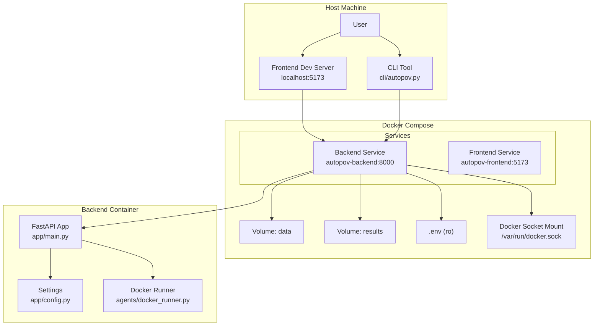
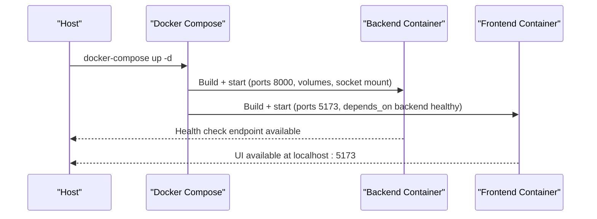
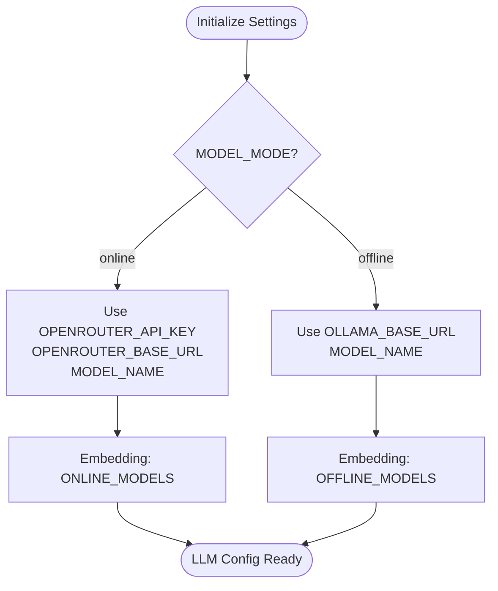
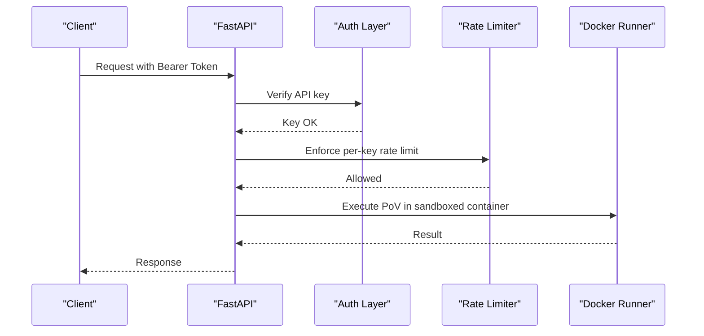
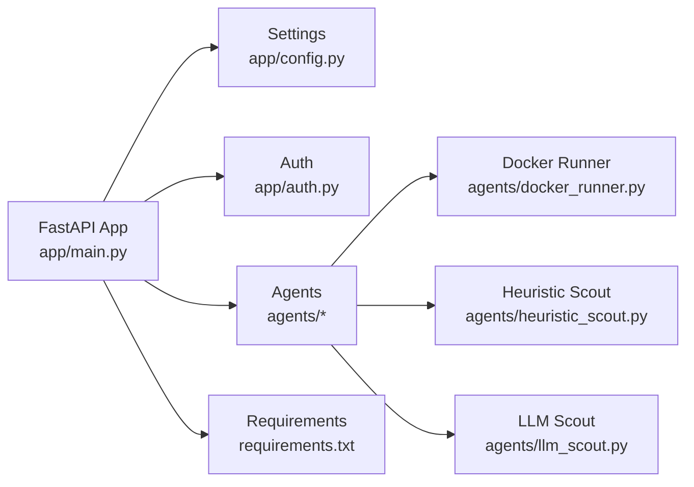

# Configuration & Setup

<cite>
**Referenced Files in This Document**
- [README.md](file://README.md)
- [.env.example](file://.env.example)
- [app/config.py](file://app/config.py)
- [app/main.py](file://app/main.py)
- [app/auth.py](file://app/auth.py)
- [docker-compose.yml](file://docker-compose.yml)
- [Dockerfile.backend](file://Dockerfile.backend)
- [Dockerfile.frontend](file://Dockerfile.frontend)
- [docker-setup.sh](file://docker-setup.sh)
- [start-all.sh](file://start-all.sh)
- [requirements.txt](file://requirements.txt)
- [agents/docker_runner.py](file://agents/docker_runner.py)
- [agents/heuristic_scout.py](file://agents/heuristic_scout.py)
- [agents/llm_scout.py](file://agents/llm_scout.py)
- [cli/autopov.py](file://cli/autopov.py)
</cite>

## Table of Contents
1. [Introduction](#introduction)
2. [Project Structure](#project-structure)
3. [Core Components](#core-components)
4. [Architecture Overview](#architecture-overview)
5. [Detailed Component Analysis](#detailed-component-analysis)
6. [Dependency Analysis](#dependency-analysis)
7. [Performance Considerations](#performance-considerations)
8. [Troubleshooting Guide](#troubleshooting-guide)
9. [Conclusion](#conclusion)
10. [Appendices](#appendices)

## Introduction
This document provides comprehensive configuration and setup guidance for deploying and customizing AutoPoV. It covers environment variables, agent routing modes, scout agent parameters, Docker-based deployment architecture, LLM provider setup (online OpenRouter and offline Ollama), tool integration requirements, security configuration (authentication, rate limiting, sandboxing), performance tuning, scaling considerations, and troubleshooting common configuration issues.

## Project Structure
AutoPoV is organized into:
- Backend API and agent orchestration (FastAPI + LangGraph)
- Agent modules implementing specialized roles (scouts, investigators, validators, executors)
- Frontend dashboard (React/Vite)
- CLI for automation and administration
- Docker assets for containerized deployment

```mermaid
graph TB
subgraph "Backend"
M["FastAPI App<br/>app/main.py"]
CFG["Settings<br/>app/config.py"]
AUTH["Auth & Rate Limit<br/>app/auth.py"]
AGENTS["Agents<br/>agents/*"]
end
subgraph "Frontend"
FE["React UI<br/>frontend/"]
end
subgraph "CLI"
CLI["autopov CLI<br/>cli/autopov.py"]
end
subgraph "Docker"
DC["Compose<br/>docker-compose.yml"]
DB["Backend Image<br/>Dockerfile.backend"]
DF["Frontend Image<br/>Dockerfile.frontend"]
end
FE --> M
CLI --> M
M --> AGENTS
M --> CFG
M --> AUTH
DC --> DB
DC --> DF
```

**Diagram sources**
- [app/main.py:114-122](file://app/main.py#L114-L122)
- [app/config.py:13-254](file://app/config.py#L13-L254)
- [app/auth.py:192-255](file://app/auth.py#L192-L255)
- [docker-compose.yml:1-41](file://docker-compose.yml#L1-L41)
- [Dockerfile.backend:1-64](file://Dockerfile.backend#L1-L64)
- [Dockerfile.frontend:1-29](file://Dockerfile.frontend#L1-L29)

**Section sources**
- [README.md:89-124](file://README.md#L89-L124)
- [docker-compose.yml:1-41](file://docker-compose.yml#L1-L41)
- [Dockerfile.backend:1-64](file://Dockerfile.backend#L1-L64)
- [Dockerfile.frontend:1-29](file://Dockerfile.frontend#L1-L29)

## Core Components
This section documents the primary configuration surfaces and their roles.

- Environment-driven settings
  - Centralized via a Pydantic settings class that loads from a .env file and exposes typed configuration for all subsystems.
  - Includes application, API, security, LLM providers, routing, scouts, vector store, embeddings, tool paths, Docker, cost controls, and paths.

- Authentication and rate limiting
  - Two-tier authentication: Admin API key for administrative endpoints and user API keys for agent operations.
  - Rate limiting enforced per API key to prevent abuse.

- Docker orchestration
  - Backend and frontend containers orchestrated by Docker Compose.
  - Backend image pre-installs Docker CLI, Node.js, and CodeQL for agent execution and static analysis.

- Agent routing modes
  - auto: OpenRouter auto-routing model selection.
  - fixed: Use a single fixed model.
  - learning: Use the Policy Agent’s learned routing decisions.

- Scout agent parameters
  - Controls for enabling scouts, maximum files analyzed, maximum characters per file, maximum findings, and cost caps.

- LLM provider setup
  - Online (OpenRouter): Requires OPENROUTER_API_KEY and supports configurable base URL and model names.
  - Offline (Ollama): Requires OLLAMA_BASE_URL and compatible models.

- Tool integration
  - CodeQL CLI path and packs base directory.
  - Optional tools: Joern and Kaitai Struct compiler.

- Security configuration
  - Admin API key, API keys with HMAC-safe validation, rate limits, and Docker sandboxing for PoV execution.

**Section sources**
- [app/config.py:13-254](file://app/config.py#L13-L254)
- [app/auth.py:192-255](file://app/auth.py#L192-L255)
- [docker-compose.yml:14-26](file://docker-compose.yml#L14-L26)
- [Dockerfile.backend:29-41](file://Dockerfile.backend#L29-L41)
- [agents/docker_runner.py:27-192](file://agents/docker_runner.py#L27-L192)
- [agents/heuristic_scout.py:13-242](file://agents/heuristic_scout.py#L13-L242)
- [agents/llm_scout.py:32-208](file://agents/llm_scout.py#L32-L208)

## Architecture Overview
The deployment architecture supports both local and containerized setups. The backend exposes a REST API and agent orchestration, while the frontend provides a dashboard. Docker Compose coordinates backend and frontend services, mounts persistent volumes, and enables Docker-in-Docker for sandboxed PoV execution.



**Diagram sources**
- [docker-compose.yml:1-41](file://docker-compose.yml#L1-L41)
- [Dockerfile.backend:1-64](file://Dockerfile.backend#L1-L64)
- [Dockerfile.frontend:1-29](file://Dockerfile.frontend#L1-L29)
- [app/main.py:114-122](file://app/main.py#L114-L122)
- [app/config.py:13-254](file://app/config.py#L13-L254)
- [agents/docker_runner.py:27-192](file://agents/docker_runner.py#L27-L192)

## Detailed Component Analysis

### Environment Variables and Settings
AutoPoV centralizes configuration through a typed settings class that loads from a .env file. Key categories include:
- Application and API: APP_NAME, APP_VERSION, DEBUG, API_HOST, API_PORT, API_PREFIX
- Security: ADMIN_API_KEY, WEBHOOK_SECRET
- LLM Providers: OPENROUTER_API_KEY, OPENROUTER_BASE_URL, OLLAMA_BASE_URL, MODEL_MODE, MODEL_NAME
- Routing and Policy: ROUTING_MODE, AUTO_ROUTER_MODEL, LEARNING_DB_PATH
- Scouts: SCOUT_ENABLED, SCOUT_LLM_ENABLED, SCOUT_MAX_FILES, SCOUT_MAX_CHARS_PER_FILE, SCOUT_MAX_FINDINGS, SCOUT_MAX_COST_USD
- Git and Webhooks: GITHUB_TOKEN, GITLAB_TOKEN, BITBUCKET_TOKEN, GITHUB_WEBHOOK_SECRET, GITLAB_WEBHOOK_SECRET
- Vector Store and Embeddings: CHROMA_PERSIST_DIR, CHROMA_COLLECTION_NAME, EMBEDDING_MODEL_ONLINE, EMBEDDING_MODEL_OFFLINE
- LangSmith Tracing: LANGCHAIN_TRACING_V2, LANGCHAIN_API_KEY, LANGCHAIN_PROJECT
- Code Analysis Tools: CODEQL_CLI_PATH, CODEQL_PACKS_BASE, JOERN_CLI_PATH, KAITAI_STRUCT_COMPILER_PATH
- Docker: DOCKER_ENABLED, DOCKER_IMAGE, DOCKER_TIMEOUT, DOCKER_MEMORY_LIMIT, DOCKER_CPU_LIMIT
- Cost Control: MAX_COST_USD, COST_TRACKING_ENABLED
- Paths: DATA_DIR, RESULTS_DIR, POVS_DIR, RUNS_DIR, TEMP_DIR, SNAPSHOT_DIR
- Frontend: FRONTEND_URL

Validation ensures MODEL_MODE is either “online” or “offline”.

**Section sources**
- [app/config.py:13-254](file://app/config.py#L13-L254)
- [README.md:288-328](file://README.md#L288-L328)

### Agent Routing Modes
Routing modes determine how the system selects models for agents:
- auto: Uses AUTO_ROUTER_MODEL for dynamic selection.
- fixed: Uses MODEL_NAME for all agents.
- learning: Uses the Policy Agent’s learned routing decisions; falls back to auto when insufficient data.

Routing integrates with the scan manager and agent graph to route tasks to the optimal model per CWE and language.

**Section sources**
- [app/config.py:42-44](file://app/config.py#L42-L44)
- [app/main.py:142-147](file://app/main.py#L142-L147)

### Scout Agent Parameters
Scout agents (heuristic and LLM-based) are configurable to balance speed and accuracy:
- Heuristic Scout: Lightweight pattern matching across supported languages.
- LLM Scout: Analyzes file snippets up to SCOUT_MAX_FILES and SCOUT_MAX_CHARS_PER_FILE, capped at SCOUT_MAX_FINDINGS and SCOUT_MAX_COST_USD.

These parameters control resource usage and cost for the initial candidate discovery phase.

**Section sources**
- [agents/heuristic_scout.py:13-242](file://agents/heuristic_scout.py#L13-L242)
- [agents/llm_scout.py:32-208](file://agents/llm_scout.py#L32-L208)
- [app/config.py:46-52](file://app/config.py#L46-L52)

### Docker-Based Deployment Architecture
Docker Compose defines two services:
- Backend service builds from Dockerfile.backend, exposing port 8000, mounting data and results volumes, sharing .env, and enabling Docker-in-Docker via /var/run/docker.sock.
- Frontend service builds from Dockerfile.frontend, exposing port 5173, and depends on backend health.

The backend image pre-installs Docker CLI, Node.js, and CodeQL, ensuring tool availability inside the container.



**Diagram sources**
- [docker-compose.yml:1-41](file://docker-compose.yml#L1-L41)
- [Dockerfile.backend:1-64](file://Dockerfile.backend#L1-L64)
- [Dockerfile.frontend:1-29](file://Dockerfile.frontend#L1-L29)

**Section sources**
- [docker-compose.yml:1-41](file://docker-compose.yml#L1-L41)
- [Dockerfile.backend:1-64](file://Dockerfile.backend#L1-L64)
- [Dockerfile.frontend:1-29](file://Dockerfile.frontend#L1-L29)

### LLM Provider Setup
AutoPoV supports two LLM provider modes:
- Online (OpenRouter)
  - Requires OPENROUTER_API_KEY and optionally MODEL_NAME.
  - Embedding model defaults to a prefixed online model.
- Offline (Ollama)
  - Requires OLLAMA_BASE_URL and compatible models.
  - Embedding model defaults to a sentence-transformers model.

The settings module provides a helper to select the appropriate configuration based on MODEL_MODE.



**Diagram sources**
- [app/config.py:212-231](file://app/config.py#L212-L231)
- [app/config.py:30-62](file://app/config.py#L30-L62)

**Section sources**
- [app/config.py:212-231](file://app/config.py#L212-L231)
- [app/config.py:30-62](file://app/config.py#L30-L62)

### Tool Integration Requirements
AutoPoV integrates with external tools for enhanced analysis:
- CodeQL CLI: Required for static discovery; configurable via CODEQL_CLI_PATH and CODEQL_PACKS_BASE.
- Docker Engine: Required for sandboxed PoV execution; configurable via DOCKER_* settings.
- Optional: Joern (CPG analysis) and Kaitai Struct compiler.

The settings module includes availability checks for these tools.

**Section sources**
- [app/config.py:86-91](file://app/config.py#L86-L91)
- [app/config.py:176-210](file://app/config.py#L176-L210)
- [Dockerfile.backend:29-41](file://Dockerfile.backend#L29-L41)

### Security Configuration
Security is enforced at multiple layers:
- Authentication
  - Admin API key for administrative endpoints (HMAC-safe comparison).
  - User API keys validated via SHA-256 hashing and stored securely.
- Rate Limiting
  - 10 scans per API key per 60 seconds to prevent abuse.
- Sandbox
  - Docker-based sandboxing for PoV execution with no network, memory and CPU limits, and timeouts.



**Diagram sources**
- [app/auth.py:192-255](file://app/auth.py#L192-L255)
- [agents/docker_runner.py:27-192](file://agents/docker_runner.py#L27-L192)

**Section sources**
- [app/auth.py:192-255](file://app/auth.py#L192-L255)
- [agents/docker_runner.py:27-192](file://agents/docker_runner.py#L27-L192)
- [README.md:377-383](file://README.md#L377-L383)

### CLI and API Keys
The CLI supports:
- Generating and managing API keys (admin-only).
- Scanning repositories, ZIP archives, or pasted code.
- Retrieving results, history, metrics, and reports.
- Health checks and policy summaries.

API keys are required for most endpoints; the CLI can persist keys locally for convenience.

**Section sources**
- [cli/autopov.py:29-91](file://cli/autopov.py#L29-L91)
- [cli/autopov.py:679-793](file://cli/autopov.py#L679-L793)
- [README.md:196-244](file://README.md#L196-L244)

## Dependency Analysis
The backend depends on several libraries and external tools:
- FastAPI and Uvicorn for the REST API
- LangChain/LangGraph for agent orchestration
- ChromaDB for vector storage
- Docker SDK for Python for sandbox execution
- GitPython for repository handling
- CodeQL CLI for static analysis
- Optional: Joern and Kaitai Struct compiler



**Diagram sources**
- [app/main.py:114-122](file://app/main.py#L114-L122)
- [app/config.py:13-254](file://app/config.py#L13-L254)
- [app/auth.py:192-255](file://app/auth.py#L192-L255)
- [agents/docker_runner.py:27-192](file://agents/docker_runner.py#L27-L192)
- [agents/heuristic_scout.py:13-242](file://agents/heuristic_scout.py#L13-L242)
- [agents/llm_scout.py:32-208](file://agents/llm_scout.py#L32-L208)
- [requirements.txt:1-44](file://requirements.txt#L1-L44)

**Section sources**
- [requirements.txt:1-44](file://requirements.txt#L1-L44)

## Performance Considerations
- Model selection
  - Use ROUTING_MODE=learning to leverage historical performance and reduce cost.
  - Cap per-scan cost via MAX_COST_USD to control spending.
- Scout configuration
  - Adjust SCOUT_MAX_FILES, SCOUT_MAX_CHARS_PER_FILE, and SCOUT_MAX_FINDINGS to balance speed and coverage.
- Docker sandbox
  - Tune DOCKER_MEMORY_LIMIT and DOCKER_CPU_LIMIT for resource-constrained environments.
  - Increase DOCKER_TIMEOUT if PoV scripts require longer execution windows.
- Static analysis
  - Ensure CodeQL CLI is available and configured to improve candidate discovery quality.
- Embeddings and vector store
  - Persist ChromaDB to avoid re-embedding on startup; configure CHROMA_PERSIST_DIR accordingly.

[No sources needed since this section provides general guidance]

## Troubleshooting Guide
Common configuration issues and resolutions:
- Missing OPENROUTER_API_KEY
  - Ensure OPENROUTER_API_KEY is set in .env; otherwise, OpenRouter-based agents will fail.
- Docker not available
  - Confirm Docker is installed and the daemon is running; the backend performs availability checks.
  - For Docker-in-Docker, ensure /var/run/docker.sock is mounted in the backend container.
- CodeQL CLI not found
  - Verify CODEQL_CLI_PATH points to a valid installation; the backend checks availability.
- Joern or Kaitai Struct compiler missing
  - These are optional; availability checks will reflect degraded functionality if not present.
- Rate limit exceeded
  - Reduce concurrent scans or increase the per-key window; adjust rate-limit thresholds if necessary.
- Port conflicts
  - Change API_PORT and FRONTEND_URL in .env if ports 8000 and 5173 are in use.
- Health check failures
  - Use the health endpoint to confirm tool availability and Docker status.

**Section sources**
- [app/config.py:162-210](file://app/config.py#L162-L210)
- [docker-compose.yml:13-26](file://docker-compose.yml#L13-L26)
- [README.md:377-383](file://README.md#L377-L383)

## Conclusion
AutoPoV offers a flexible, containerized deployment with robust configuration surfaces for LLM providers, agent routing, tool integration, and security. By tuning environment variables, leveraging Docker Compose, and applying the provided performance and troubleshooting guidance, operators can deploy AutoPoV reliably across development and production environments.

[No sources needed since this section summarizes without analyzing specific files]

## Appendices

### Environment Variables Reference
- Core settings
  - OPENROUTER_API_KEY, ADMIN_API_KEY, MODEL_MODE, MODEL_NAME, ROUTING_MODE, AUTO_ROUTER_MODEL
- Security
  - WEBHOOK_SECRET, GITHUB_WEBHOOK_SECRET, GITLAB_WEBHOOK_SECRET
- LLM and embeddings
  - OPENROUTER_BASE_URL, OLLAMA_BASE_URL, EMBEDDING_MODEL_ONLINE, EMBEDDING_MODEL_OFFLINE
- Scouts
  - SCOUT_ENABLED, SCOUT_LLM_ENABLED, SCOUT_MAX_FILES, SCOUT_MAX_CHARS_PER_FILE, SCOUT_MAX_FINDINGS, SCOUT_MAX_COST_USD
- Tools
  - CODEQL_CLI_PATH, CODEQL_PACKS_BASE, JOERN_CLI_PATH, KAITAI_STRUCT_COMPILER_PATH
- Docker
  - DOCKER_ENABLED, DOCKER_IMAGE, DOCKER_TIMEOUT, DOCKER_MEMORY_LIMIT, DOCKER_CPU_LIMIT
- Cost control
  - MAX_COST_USD, COST_TRACKING_ENABLED
- Paths and URLs
  - CHROMA_PERSIST_DIR, DATA_DIR, RESULTS_DIR, POVS_DIR, RUNS_DIR, TEMP_DIR, SNAPSHOT_DIR, FRONTEND_URL

**Section sources**
- [app/config.py:13-254](file://app/config.py#L13-L254)
- [README.md:288-328](file://README.md#L288-L328)

### Deployment Scripts
- docker-setup.sh: Guides Docker installation, validates Docker Compose availability, and prepares .env.
- start-all.sh: Starts backend in Docker and frontend locally, waits for backend readiness, and launches the UI.

**Section sources**
- [docker-setup.sh:1-126](file://docker-setup.sh#L1-L126)
- [start-all.sh:1-63](file://start-all.sh#L1-L63)