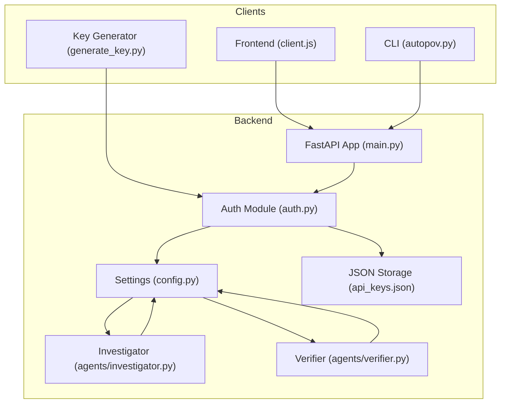
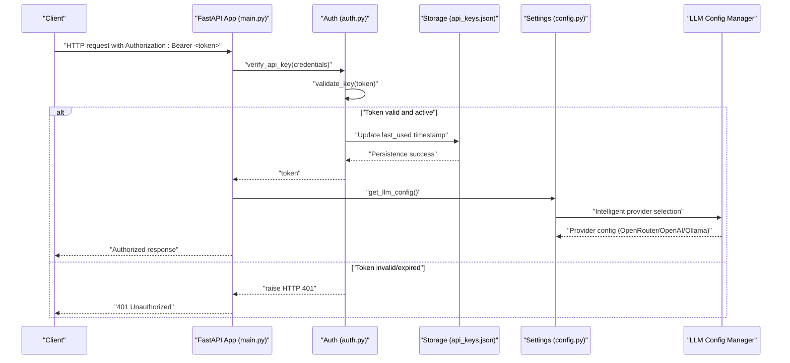
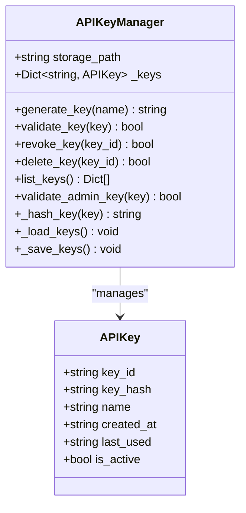
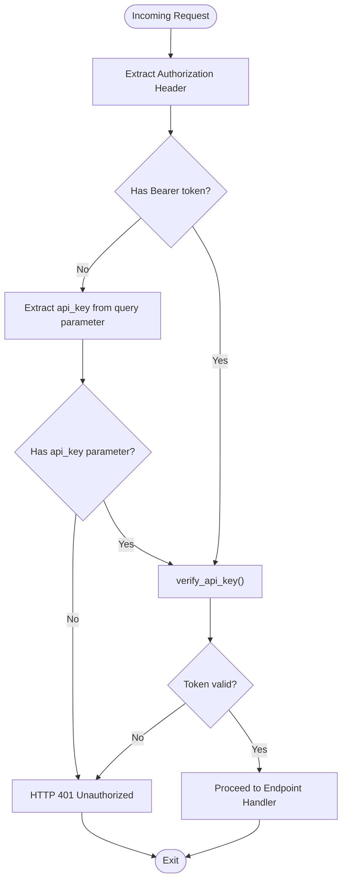
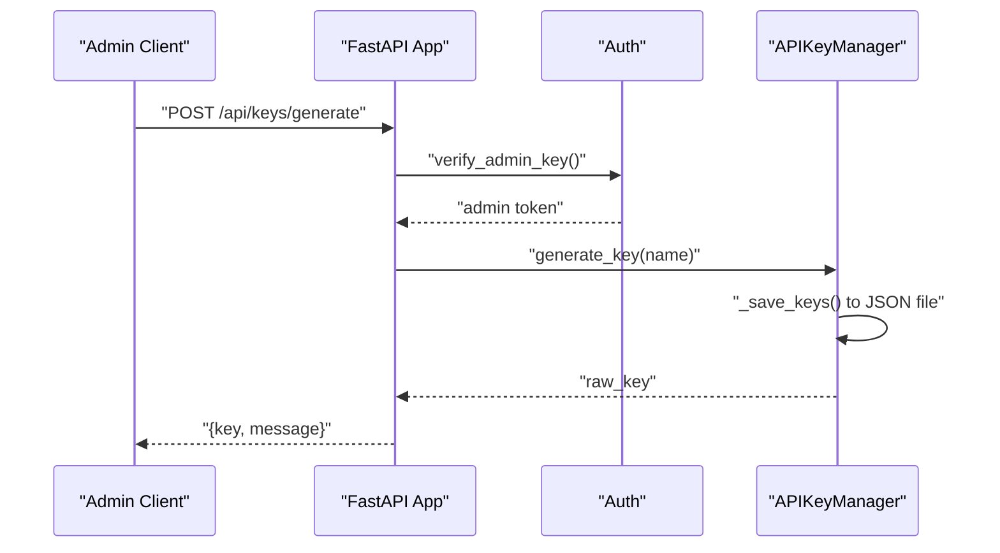
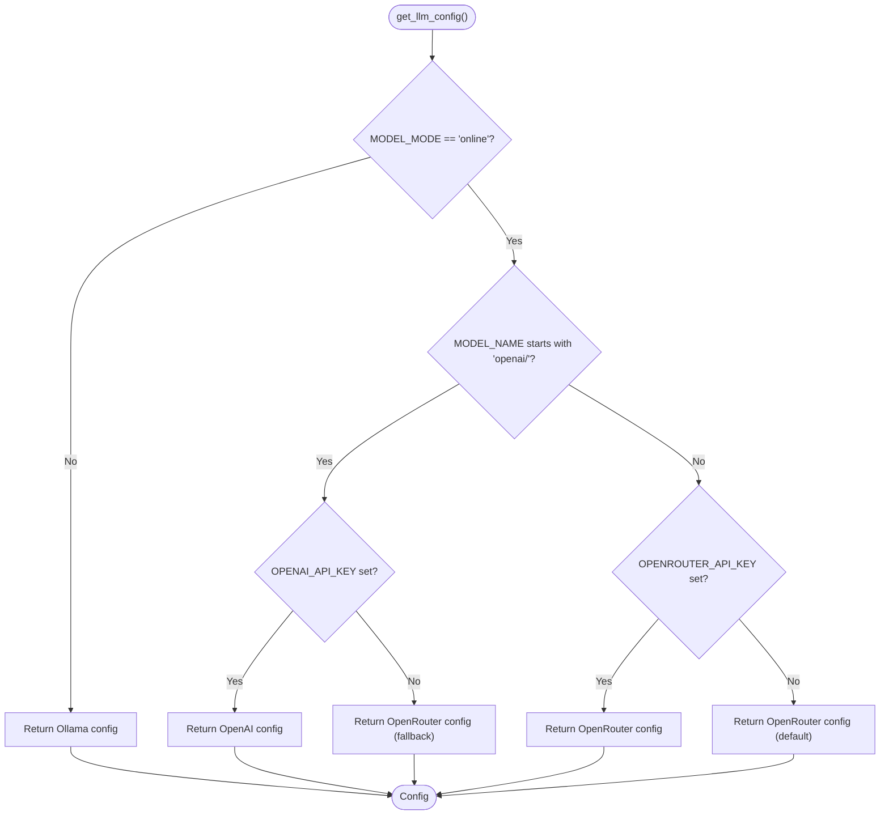
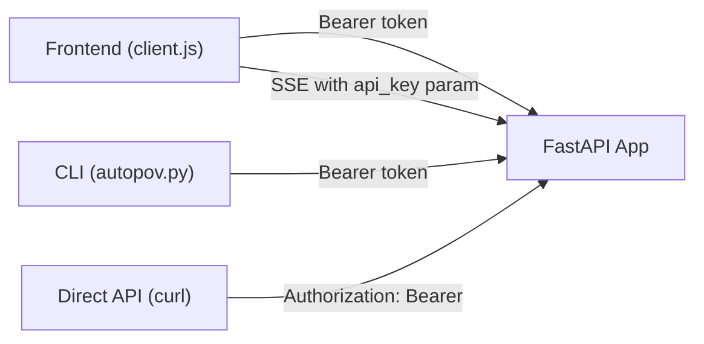
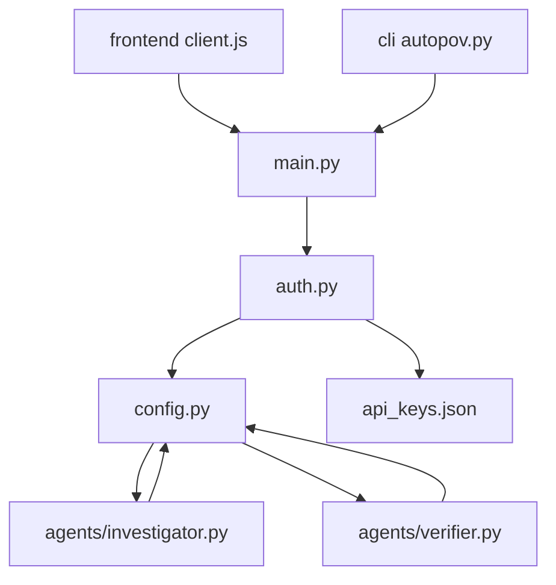

# API Key Management and Authentication

<cite>
**Referenced Files in This Document**
- [auth.py](file://autopov/app/auth.py)
- [config.py](file://autopov/app/config.py)
- [main.py](file://autopov/app/main.py)
- [client.js](file://autopov/frontend/src/api/client.js)
- [autopov.py](file://autopov/cli/autopov.py)
- [test_auth.py](file://autopov/tests/test_auth.py)
- [README.md](file://autopov/README.md)
- [api_keys.json](file://autopov/data/api_keys.json)
- [generate_key.py](file://autopov/generate_key.py)
- [investigator.py](file://autopov/agents/investigator.py)
- [verifier.py](file://autopov/agents/verifier.py)
</cite>

## Update Summary
**Changes Made**
- Enhanced API key configuration with support for OpenRouter and direct OpenAI integration
- Implemented intelligent fallback logic for LLM provider selection based on environment variables and model naming
- Added comprehensive validation mechanisms for API key configuration in agent components
- Enhanced environment variable handling with robust provider switching capabilities
- Updated authentication system to support dual LLM provider configurations

## Table of Contents
1. [Introduction](#introduction)
2. [Project Structure](#project-structure)
3. [Core Components](#core-components)
4. [Architecture Overview](#architecture-overview)
5. [Detailed Component Analysis](#detailed-component-analysis)
6. [Dependency Analysis](#dependency-analysis)
7. [Performance Considerations](#performance-considerations)
8. [Troubleshooting Guide](#troubleshooting-guide)
9. [Conclusion](#conclusion)
10. [Appendices](#appendices)

## Introduction
This document provides comprehensive guidance for AutoPoV API key management and authentication. It focuses on security token configuration, access control, and operational procedures for managing API keys across the system. The authentication system has been enhanced with robust security features including secure key generation with SHA-256 hashing, key lifecycle management (creation, revocation, deletion), admin-level access controls, support for both Bearer token authentication and query parameter authentication for server-sent events, and secure JSON file storage with automatic persistence and validation mechanisms.

**Updated** Enhanced with support for OpenRouter and direct OpenAI integration, intelligent fallback logic, and comprehensive validation mechanisms for LLM provider configuration.

Topics include:
- ADMIN_API_KEY setup and administration
- User API key lifecycle: generation, rotation, and revocation
- Dual authentication methods (Bearer tokens and query parameters)
- Authentication middleware and request validation
- API key scopes and permissions (read-only vs administrative)
- Rate limiting and quota enforcement mechanisms
- Storage security for keys (encryption, hashing, secure transmission)
- Validation procedures and error handling for invalid/expired tokens
- Examples of API key usage in client applications (CLI, Web UI, direct API)
- Security best practices and incident response
- LLM provider configuration with OpenRouter and OpenAI integration

## Project Structure
AutoPoV's authentication and API key management are implemented in the backend FastAPI application. Key areas:
- Authentication and key storage: [auth.py](file://autopov/app/auth.py)
- Configuration and environment variables: [config.py](file://autopov/app/config.py)
- API endpoints and middleware integration: [main.py](file://autopov/app/main.py)
- Frontend client usage: [client.js](file://autopov/frontend/src/api/client.js)
- CLI usage: [autopov.py](file://autopov/cli/autopov.py)
- Tests: [test_auth.py](file://autopov/tests/test_auth.py)
- Setup and usage guidance: [README.md](file://autopov/README.md)
- Key storage: [api_keys.json](file://autopov/data/api_keys.json)
- Key generation utility: [generate_key.py](file://autopov/generate_key.py)
- Agent components with LLM provider validation: [investigator.py](file://autopov/agents/investigator.py), [verifier.py](file://autopov/agents/verifier.py)

**Diagram sources**
- [auth.py](file://autopov/app/auth.py#L1-L179)
- [config.py](file://autopov/app/config.py#L1-L263)
- [main.py](file://autopov/app/main.py#L1-L577)
- [client.js](file://autopov/frontend/src/api/client.js#L1-L69)
- [autopov.py](file://autopov/cli/autopov.py#L1-L588)
- [api_keys.json](file://autopov/data/api_keys.json#L1-L26)
- [generate_key.py](file://autopov/generate_key.py#L1-L9)
- [investigator.py](file://autopov/agents/investigator.py#L60-L70)
- [verifier.py](file://autopov/agents/verifier.py#L45-L60)

**Section sources**
- [auth.py](file://autopov/app/auth.py#L1-L179)
- [config.py](file://autopov/app/config.py#L1-L263)
- [main.py](file://autopov/app/main.py#L1-L577)
- [client.js](file://autopov/frontend/src/api/client.js#L1-L69)
- [autopov.py](file://autopov/cli/autopov.py#L1-L588)
- [README.md](file://autopov/README.md#L88-L101)
- [api_keys.json](file://autopov/data/api_keys.json#L1-L26)
- [generate_key.py](file://autopov/generate_key.py#L1-L9)
- [investigator.py](file://autopov/agents/investigator.py#L60-L70)
- [verifier.py](file://autopov/agents/verifier.py#L45-L60)

## Core Components
- APIKey model: stores key metadata and state
- APIKeyManager: key generation, hashing, persistence, validation, revocation, listing, and admin key validation with automatic JSON file storage
- FastAPI dependencies verify_api_key and verify_admin_key: enforce authentication and authorization with dual authentication support
- Settings: ADMIN_API_KEY and DATA_DIR define admin key and key storage location
- API endpoints: key generation, listing, and revocation are admin-only
- Automatic persistence: JSON file storage with validation and error handling
- LLM Configuration Manager: intelligent provider selection with OpenRouter and OpenAI support

Key behaviors:
- Keys are stored hashed (SHA-256) with plaintext metadata in JSON format
- Admin key is validated against environment configuration
- Last-used timestamps are updated on successful validation
- Dual authentication methods: Bearer tokens for standard requests and query parameters for SSE
- Automatic storage management with directory creation and file validation
- **Updated** Intelligent LLM provider selection based on MODEL_NAME prefix and available API keys

**Section sources**
- [auth.py](file://autopov/app/auth.py#L22-L131)
- [config.py](file://autopov/app/config.py#L26-L28)
- [main.py](file://autopov/app/main.py#L478-L511)
- [api_keys.json](file://autopov/data/api_keys.json#L1-L26)
- [config.py](file://autopov/app/config.py#L196-L242)

## Architecture Overview
The enhanced authentication pipeline integrates FastAPI security with a local key store and supports dual authentication methods for different client scenarios. The system now includes intelligent LLM provider configuration with support for both OpenRouter and direct OpenAI integration.

**Diagram sources**
- [auth.py](file://autopov/app/auth.py#L137-L162)
- [config.py](file://autopov/app/config.py#L26-L28)
- [config.py](file://autopov/app/config.py#L196-L242)
- [main.py](file://autopov/app/main.py#L478-L511)
- [api_keys.json](file://autopov/data/api_keys.json#L1-L26)

## Detailed Component Analysis

### Enhanced APIKey Model and APIKeyManager
Responsibilities:
- Generate keys with cryptographically secure identifiers and raw values
- Hash keys using SHA-256 for storage
- Persist keys to JSON file under DATA_DIR with automatic directory creation
- Validate keys by comparing hash and ensuring activation status
- Revoke/delete keys and update persistence automatically
- List keys without exposing hashes
- Validate admin key against ADMIN_API_KEY setting
- Handle storage loading with error recovery and validation

**Diagram sources**
- [auth.py](file://autopov/app/auth.py#L22-L131)

**Section sources**
- [auth.py](file://autopov/app/auth.py#L32-L131)
- [api_keys.json](file://autopov/data/api_keys.json#L1-L26)

### Enhanced Authentication Middleware and Dependencies
- verify_api_key: enforces dual authentication - Bearer token for standard requests and query parameter for server-sent events
- verify_admin_key: enforces admin-only access for key management endpoints
- Both raise appropriate HTTP exceptions with WWW-Authenticate headers
- Automatic fallback from Authorization header to query parameter for SSE compatibility

**Diagram sources**
- [auth.py](file://autopov/app/auth.py#L137-L162)

**Section sources**
- [auth.py](file://autopov/app/auth.py#L137-L162)

### API Endpoints for Key Management
Admin-only endpoints:
- POST /api/keys/generate: generate a new API key
- GET /api/keys: list all API keys
- DELETE /api/keys/{key_id}: revoke a key

Read-only endpoints (require standard API key):
- GET /api/health, /api/history, /api/report/{scan_id}, /api/metrics, /api/scan/{scan_id}, /api/scan/{scan_id}/stream

**Diagram sources**
- [main.py](file://autopov/app/main.py#L528-L538)
- [auth.py](file://autopov/app/auth.py#L162-L173)
- [auth.py](file://autopov/app/auth.py#L63-L79)

**Section sources**
- [main.py](file://autopov/app/main.py#L528-L560)

### Enhanced LLM Configuration and Provider Management
**Updated** The system now includes intelligent LLM provider configuration with support for both OpenRouter and direct OpenAI integration.

Responsibilities:
- Determine LLM provider based on MODEL_NAME prefix and available API keys
- Support OpenAI direct API with "openai/" prefixed model names
- Fallback to OpenRouter when direct OpenAI is not configured
- Provide graceful error handling when no API keys are available
- Return appropriate configuration for agent components

**Diagram sources**
- [config.py](file://autopov/app/config.py#L196-L242)

**Section sources**
- [config.py](file://autopov/app/config.py#L196-L242)

### Enhanced Client Applications and Usage Patterns
- Frontend (React): Adds Authorization header automatically for all requests; supports generating keys via admin endpoint; uses query parameter for SSE connections
- CLI (Click): Generates keys using admin endpoint and persists to local config
- Direct API: curl examples demonstrate Authorization header usage

**Diagram sources**
- [client.js](file://autopov/frontend/src/api/client.js#L18-L25)
- [client.js](file://autopov/frontend/src/api/client.js#L42-L45)
- [client.js](file://autopov/frontend/src/api/client.js#L57-L66)
- [autopov.py](file://autopov/cli/autopov.py#L370-L408)
- [README.md](file://autopov/README.md#L128-L144)

**Section sources**
- [client.js](file://autopov/frontend/src/api/client.js#L1-L69)
- [autopov.py](file://autopov/cli/autopov.py#L1-L588)
- [README.md](file://autopov/README.md#L128-L144)

### Enhanced Agent Components with Provider Validation
**Updated** Agent components now include comprehensive validation for LLM provider configuration.

Responsibilities:
- Investigator agent validates API key availability before initialization
- Verifier agent validates OpenAI availability and API key configuration
- Provide meaningful error messages when providers are not properly configured
- Support graceful degradation when required dependencies are unavailable

**Section sources**
- [investigator.py](file://autopov/agents/investigator.py#L60-L70)
- [verifier.py](file://autopov/agents/verifier.py#L45-L60)

## Dependency Analysis
- API endpoints depend on FastAPI security and the auth module
- APIKeyManager depends on settings for storage path and admin key
- Frontend and CLI clients depend on the API endpoints and FastAPI security scheme
- JSON storage depends on filesystem permissions and directory structure
- **Updated** Agent components depend on settings for LLM configuration validation

**Diagram sources**
- [main.py](file://autopov/app/main.py#L19-L25)
- [auth.py](file://autopov/app/auth.py#L16-L17)
- [config.py](file://autopov/app/config.py#L26-L28)
- [api_keys.json](file://autopov/data/api_keys.json#L1-L26)
- [investigator.py](file://autopov/agents/investigator.py#L60-L70)
- [verifier.py](file://autopov/agents/verifier.py#L45-L60)

**Section sources**
- [main.py](file://autopov/app/main.py#L19-L25)
- [auth.py](file://autopov/app/auth.py#L16-L17)
- [config.py](file://autopov/app/config.py#L26-L28)
- [api_keys.json](file://autopov/data/api_keys.json#L1-L26)
- [investigator.py](file://autopov/agents/investigator.py#L60-L70)
- [verifier.py](file://autopov/agents/verifier.py#L45-L60)

## Performance Considerations
- Key validation iterates through stored keys; performance scales with number of keys
- JSON file persistence occurs on every key change; consider batching for very large key sets
- Hashing is constant-time per validation; SHA-256 is efficient and secure for this scale
- Query parameter extraction adds minimal overhead compared to header parsing
- Automatic storage ensures data consistency but may cause write contention with concurrent operations
- **Updated** LLM configuration lookup is cached and performed per-agent initialization, minimizing repeated configuration overhead

## Troubleshooting Guide
Common issues and resolutions:
- 401 Unauthorized: Token missing, empty, or does not match any active key
  - Regenerate a key using admin endpoint and ensure Authorization header is present
  - For SSE connections, ensure query parameter `api_key` is included in the URL
- 403 Forbidden: Admin-only operation attempted without valid ADMIN_API_KEY
  - Confirm ADMIN_API_KEY is set and use it for key management endpoints
- Key not found during revocation: key_id incorrect or already deleted
  - List keys to confirm ID and state
- Storage errors: api_keys.json unreadable or corrupted
  - Check DATA_DIR permissions and file integrity
  - Verify JSON format is valid and keys are properly hashed
- Frontend/CLI not sending Authorization header
  - Verify local storage/env configuration and interceptor logic
  - For SSE, ensure query parameter is properly encoded in the EventSource URL
- JSON storage corruption: automatic recovery handles malformed JSON by resetting to empty state
- **Updated** LLM provider configuration errors:
  - OpenAI API key not configured: Set OPENAI_API_KEY environment variable
  - OpenRouter API key not configured: Set OPENROUTER_API_KEY environment variable
  - Model name format error: Use "openai/model-name" for direct OpenAI API
  - Provider fallback issues: Check both OPENAI_API_KEY and OPENROUTER_API_KEY availability

**Section sources**
- [auth.py](file://autopov/app/auth.py#L141-L146)
- [auth.py](file://autopov/app/auth.py#L155-L160)
- [auth.py](file://autopov/app/auth.py#L40-L57)
- [main.py](file://autopov/app/main.py#L556-L559)
- [test_auth.py](file://autopov/tests/test_auth.py#L33-L46)
- [investigator.py](file://autopov/agents/investigator.py#L64-L68)
- [verifier.py](file://autopov/agents/verifier.py#L57-L59)

## Conclusion
AutoPoV implements a robust, file-backed API key system with strong separation between standard and admin operations. The enhanced authentication system now supports dual authentication methods for different client scenarios, including server-sent events with query parameter authentication. Keys are hashed at rest with automatic JSON file persistence, and validation is enforced via FastAPI dependencies. Administrators manage keys through dedicated endpoints secured by ADMIN_API_KEY. Clients (frontend, CLI, direct API) consistently apply Bearer tokens, with special handling for SSE connections. For production hardening, consider adding quotas/rate limiting, encrypted storage, and audit logging.

**Updated** The system now includes intelligent LLM provider configuration supporting both OpenRouter and direct OpenAI integration with comprehensive validation mechanisms and graceful fallback logic.

## Appendices

### ADMIN_API_KEY Setup and Management
- Set ADMIN_API_KEY in environment variables
- Use admin endpoints to generate/list/revoke user keys
- Rotate ADMIN_API_KEY by updating environment and regenerating user keys

**Section sources**
- [config.py](file://autopov/app/config.py#L26-L28)
- [README.md](file://autopov/README.md#L88-L101)
- [main.py](file://autopov/app/main.py#L528-L560)

### Enhanced User API Key Lifecycle
- Generation: POST /api/keys/generate (admin)
- Distribution: Client stores raw key securely
- Rotation: Generate new key, replace in clients, revoke old key
- Revocation: DELETE /api/keys/{key_id} (admin)
- Automatic persistence: Keys are automatically saved to JSON file with validation

**Section sources**
- [auth.py](file://autopov/app/auth.py#L63-L79)
- [auth.py](file://autopov/app/auth.py#L97-L111)
- [auth.py](file://autopov/app/auth.py#L52-L57)
- [main.py](file://autopov/app/main.py#L528-L560)
- [api_keys.json](file://autopov/data/api_keys.json#L1-L26)

### Enhanced Authentication Middleware and Request Validation
- verify_api_key: validates standard API key for protected endpoints with dual authentication support
- verify_admin_key: validates ADMIN_API_KEY for admin endpoints
- Errors: 401 for invalid/expired, 403 for insufficient privileges
- Dual authentication: Bearer tokens for standard requests, query parameters for SSE

**Section sources**
- [auth.py](file://autopov/app/auth.py#L137-L162)

### API Key Scopes and Permissions
- Standard API key: read-only access to scan/status/report/metrics/history
- Admin API key: manage keys (generate/list/revoke)
- Automatic storage: JSON file persistence with validation and error recovery

**Section sources**
- [main.py](file://autopov/app/main.py#L528-L560)
- [auth.py](file://autopov/app/auth.py#L52-L57)

### Rate Limiting and Quota Enforcement
- Current implementation does not include built-in rate limiting or quotas
- Consider integrating rate-limit/quota enforcement at gateway or within FastAPI for production deployments

### Key Storage Security
- Keys are stored as JSON with SHA-256 hashes and metadata
- Automatic directory creation ensures proper file permissions
- JSON validation prevents corruption and maintains data integrity
- Recommend encrypting api_keys.json at rest and securing file permissions
- Avoid logging raw keys; mask display in UI/CLI

**Section sources**
- [auth.py](file://autopov/app/auth.py#L40-L57)
- [auth.py](file://autopov/app/auth.py#L40-L51)

### Enhanced Key Validation and Error Handling
- Validation compares SHA-256 hash against stored value and checks is_active
- On failure, raises HTTPException with WWW-Authenticate header
- Automatic storage updates last_used timestamps on successful validation
- JSON storage handles errors gracefully with recovery mechanisms
- Tests cover generation, validation, revocation, and listing

**Section sources**
- [auth.py](file://autopov/app/auth.py#L81-L95)
- [auth.py](file://autopov/app/auth.py#L40-L51)
- [test_auth.py](file://autopov/tests/test_auth.py#L27-L55)

### Enhanced Client Usage Examples
- Frontend: Authorization header added automatically; key generation via admin endpoint; SSE uses query parameter
- CLI: Generates keys using admin endpoint and saves to local config
- Direct API: curl demonstrates Authorization header usage

**Section sources**
- [client.js](file://autopov/frontend/src/api/client.js#L18-L25)
- [client.js](file://autopov/frontend/src/api/client.js#L42-L45)
- [client.js](file://autopov/frontend/src/api/client.js#L57-L66)
- [autopov.py](file://autopov/cli/autopov.py#L461-L495)
- [README.md](file://autopov/README.md#L128-L144)

### Security Best Practices
- Rotate ADMIN_API_KEY periodically and rotate user keys quarterly
- Monitor unauthorized access attempts and alert on repeated 401/403 responses
- Incident response: revoke compromised keys immediately, rotate ADMIN_API_KEY, reissue new user keys
- Secure transmission: always use HTTPS/TLS; avoid transmitting keys over insecure channels
- Storage security: ensure proper file permissions on api_keys.json and DATA_DIR
- Regular backup of api_keys.json for disaster recovery
- **Updated** LLM provider security: rotate API keys regularly, monitor provider quotas, implement fallback strategies

### Enhanced LLM Provider Configuration
**Updated** Comprehensive configuration for OpenRouter and OpenAI integration.

Environment variables:
- OPENROUTER_API_KEY: OpenRouter API key for third-party model access
- OPENAI_API_KEY: Direct OpenAI API key for official OpenAI models
- OPENAI_BASE_URL: Custom OpenAI-compatible endpoint (default: https://api.openai.com/v1)
- MODEL_NAME: Model specification with "openai/" prefix for direct OpenAI API

Configuration logic:
- Direct OpenAI API: MODEL_NAME starts with "openai/" AND OPENAI_API_KEY is set
- OpenRouter fallback: OPENROUTER_API_KEY is set (or default to OpenRouter)
- Provider detection: Automatic selection based on model naming and key availability

**Section sources**
- [config.py](file://autopov/app/config.py#L30-L35)
- [config.py](file://autopov/app/config.py#L196-L242)
- [investigator.py](file://autopov/agents/investigator.py#L64-L68)
- [verifier.py](file://autopov/agents/verifier.py#L57-L59)

### Enhanced Agent Validation and Error Handling
**Updated** Comprehensive validation for LLM provider configuration in agent components.

Investigator agent validation:
- Checks for API key availability before LLM initialization
- Raises InvestigationError with specific guidance for missing configuration
- Supports both OpenAI and OpenRouter provider detection

Verifier agent validation:
- Validates OpenAI availability and API key configuration
- Provides meaningful error messages for dependency issues
- Supports graceful degradation when required components are unavailable

**Section sources**
- [investigator.py](file://autopov/agents/investigator.py#L60-L70)
- [verifier.py](file://autopov/agents/verifier.py#L45-L60)

### Key Generation Utility
The system includes a utility script for programmatic key generation:
- [generate_key.py](file://autopov/generate_key.py#L1-L9): Simple script to generate and output API keys
- Can be used for automated key provisioning in CI/CD pipelines

**Section sources**
- [generate_key.py](file://autopov/generate_key.py#L1-L9)