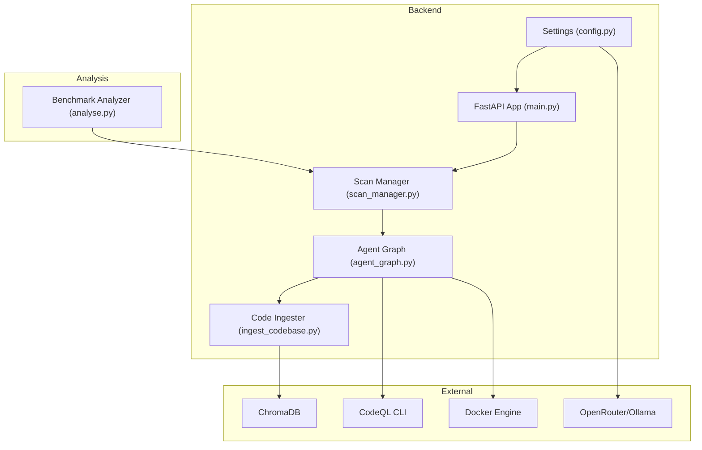
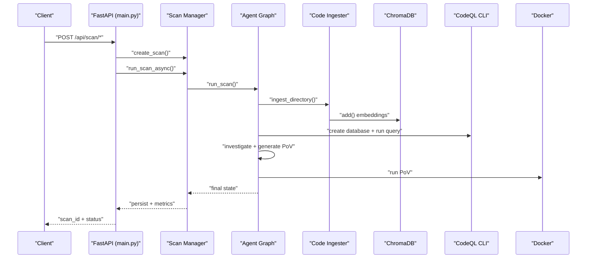
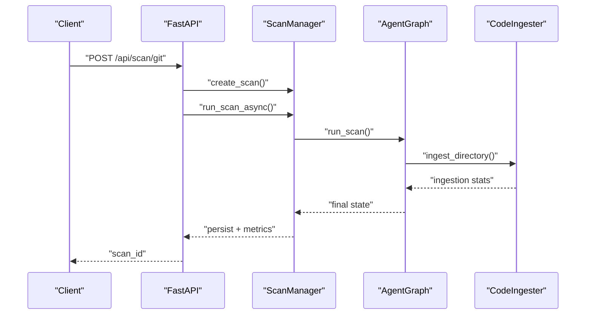
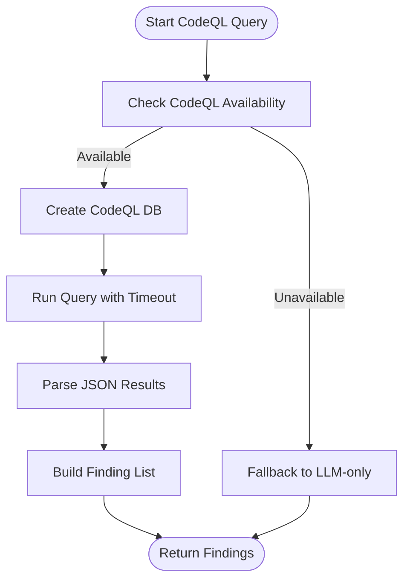
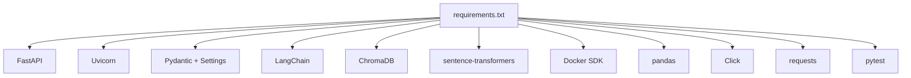

# Advanced Configuration Options

<cite>
**Referenced Files in This Document**
- [config.py](file://autopov/app/config.py)
- [main.py](file://autopov/app/main.py)
- [scan_manager.py](file://autopov/app/scan_manager.py)
- [agent_graph.py](file://autopov/app/agent_graph.py)
- [ingest_codebase.py](file://autopov/agents/ingest_codebase.py)
- [analyse.py](file://autopov/analyse.py)
- [requirements.txt](file://autopov/requirements.txt)
- [BufferOverflow.ql](file://autopov/codeql_queries/BufferOverflow.ql)
- [SqlInjection.ql](file://autopov/codeql_queries/SqlInjection.ql)
- [autopov.py](file://autopov/cli/autopov.py)
- [Settings.jsx](file://autopov/frontend/src/pages/Settings.jsx)
- [ModelSelector.jsx](file://autopov/frontend/src/components/ModelSelector.jsx)
- [WebhookSetup.jsx](file://autopov/frontend/src/components/WebhookSetup.jsx)
</cite>

## Table of Contents
1. [Introduction](#introduction)
2. [Project Structure](#project-structure)
3. [Core Components](#core-components)
4. [Architecture Overview](#architecture-overview)
5. [Detailed Component Analysis](#detailed-component-analysis)
6. [Dependency Analysis](#dependency-analysis)
7. [Performance Considerations](#performance-considerations)
8. [Troubleshooting Guide](#troubleshooting-guide)
9. [Conclusion](#conclusion)
10. [Appendices](#appendices)

## Introduction
This document provides comprehensive guidance for AutoPoV advanced configuration options. It focuses on fine-tuning system behavior and performance optimization, covering:
- Budgeting and cost control (MAX_COST_USD)
- Operation duration limits and timeouts
- Logging and debugging granularity
- Vector store configuration (ChromaDB), embedding model selection, and similarity tuning
- Static analysis configuration (CodeQL query customization, CodeQL CLI integration)
- Performance tuning (parallelism, memory, caching)
- Benchmark configuration for research and evaluation
- Integration settings for external systems (webhooks, Docker, cloud providers)
- Configuration templates for different deployment scales
- Validation and testing procedures
- Troubleshooting and optimization techniques

## Project Structure
AutoPoV is organized around a FastAPI backend, LangGraph-based scanning workflow, vector store ingestion, and optional frontend and CLI clients. Configuration is centralized in a Pydantic settings class and consumed across modules.

**Diagram sources**
- [config.py](file://autopov/app/config.py#L13-L210)
- [main.py](file://autopov/app/main.py#L102-L121)
- [scan_manager.py](file://autopov/app/scan_manager.py#L40-L49)
- [agent_graph.py](file://autopov/app/agent_graph.py#L78-L135)
- [ingest_codebase.py](file://autopov/agents/ingest_codebase.py#L41-L116)
- [analyse.py](file://autopov/analyse.py#L39-L45)

**Section sources**
- [config.py](file://autopov/app/config.py#L13-L210)
- [main.py](file://autopov/app/main.py#L102-L121)

## Core Components
- Settings: Centralized configuration with environment variable support, model modes, vector store, embeddings, Docker, cost control, and path management.
- Scan Manager: Orchestrates scan lifecycle, persistence, metrics, and concurrency.
- Agent Graph: LangGraph workflow coordinating ingestion, static analysis, investigation, PoV generation, validation, and Docker execution.
- Code Ingester: Handles chunking, embeddings, and ChromaDB persistence.
- Benchmark Analyzer: Loads historical results and computes metrics for comparative analysis.

**Section sources**
- [config.py](file://autopov/app/config.py#L13-L210)
- [scan_manager.py](file://autopov/app/scan_manager.py#L40-L344)
- [agent_graph.py](file://autopov/app/agent_graph.py#L78-L582)
- [ingest_codebase.py](file://autopov/agents/ingest_codebase.py#L41-L407)
- [analyse.py](file://autopov/analyse.py#L39-L357)

## Architecture Overview
The system integrates configuration-driven behavior across the stack. The FastAPI app exposes endpoints that delegate to the Scan Manager, which coordinates the Agent Graph. The Agent Graph uses the Code Ingester for RAG, CodeQL for static analysis, and Docker for PoV execution. Results are persisted and metrics are tracked for benchmarking.

**Diagram sources**
- [main.py](file://autopov/app/main.py#L177-L317)
- [scan_manager.py](file://autopov/app/scan_manager.py#L86-L176)
- [agent_graph.py](file://autopov/app/agent_graph.py#L136-L434)
- [ingest_codebase.py](file://autopov/agents/ingest_codebase.py#L201-L307)

## Detailed Component Analysis

### Advanced Configuration Options

#### Budgeting and Cost Control (MAX_COST_USD)
- Purpose: Cap cumulative LLM usage costs across scans.
- Implementation:
  - Configuration field controls budget enforcement.
  - Cost tracking enabled/disabled flag.
  - Per-finding cost estimation is accumulated in the Agent Graph.
- Tuning guidance:
  - Set a realistic monthly budget based on model pricing and expected throughput.
  - Monitor total cost via metrics and scan history.
- Related fields:
  - MAX_COST_USD
  - COST_TRACKING_ENABLED

**Section sources**
- [config.py](file://autopov/app/config.py#L85-L87)
- [agent_graph.py](file://autopov/app/agent_graph.py#L521-L531)
- [scan_manager.py](file://autopov/app/scan_manager.py#L304-L334)

#### Operation Duration Limits and Timeouts
- Scanner-level:
  - MAX_RETRIES governs PoV regeneration/validation attempts.
- CodeQL execution:
  - Subprocess calls enforce timeouts for database creation and query execution.
- Docker execution:
  - Docker timeout configurable globally.
- Recommendations:
  - Increase MAX_RETRIES for higher validation robustness.
  - Tune CodeQL timeouts based on repository size and CI latency.
  - Adjust Docker timeout for complex PoVs.

**Section sources**
- [config.py](file://autopov/app/config.py#L92-L82)
- [agent_graph.py](file://autopov/app/agent_graph.py#L214-L241)
- [config.py](file://autopov/app/config.py#L82)

#### Logging and Debugging Granularity
- Application logging:
  - DEBUG toggles development-mode logging.
  - Health endpoint surfaces availability checks for Docker, CodeQL, and Joern.
- Runtime logs:
  - Agent Graph maintains a structured log list with ISO timestamps.
  - Frontend consumes logs via server-sent events and polling.
- Recommendations:
  - Enable DEBUG locally for verbose logs.
  - Use SSE streaming for real-time visibility in production.

**Section sources**
- [config.py](file://autopov/app/config.py#L19)
- [main.py](file://autopov/app/main.py#L165-L174)
- [agent_graph.py](file://autopov/app/agent_graph.py#L516-L519)
- [main.py](file://autopov/app/main.py#L350-L385)

#### Vector Store Configuration (ChromaDB)
- Persistence:
  - Persist directory configurable; collection names scoped by scan ID.
- Embedding model selection:
  - Online vs offline embedding models selected via LLM configuration mode.
- Similarity tuning:
  - Retrieval uses ChromaDB query; adjust top_k and chunk sizes to balance recall and latency.
- Recommendations:
  - Use larger chunk sizes for coarser-grained retrieval; smaller chunks for precise context.
  - Monitor disk usage in persist directory and clean up old scan collections.

**Section sources**
- [config.py](file://autopov/app/config.py#L60-L67)
- [ingest_codebase.py](file://autopov/agents/ingest_codebase.py#L44-L58)
- [ingest_codebase.py](file://autopov/agents/ingest_codebase.py#L309-L352)
- [ingest_codebase.py](file://autopov/agents/ingest_codebase.py#L387-L397)

#### Embedding Model Selection
- Online mode: text-embedding-3-small via OpenRouter.
- Offline mode: sentence-transformers/all-MiniLM-L6-v2 via Ollama.
- Recommendations:
  - Prefer online embeddings for broader language coverage.
  - Use offline embeddings for privacy or constrained environments.

**Section sources**
- [config.py](file://autopov/app/config.py#L65-L66)
- [config.py](file://autopov/app/config.py#L173-L189)
- [ingest_codebase.py](file://autopov/agents/ingest_codebase.py#L60-L88)

#### Static Analysis Configuration (CodeQL)
- Query mapping:
  - CWE-specific queries mapped to built-in CodeQL query files.
- Execution:
  - Creates a temporary CodeQL database and runs queries with timeouts.
- Fallback:
  - If CodeQL is unavailable, falls back to LLM-only analysis.
- Recommendations:
  - Customize query files for domain-specific patterns.
  - Ensure CodeQL CLI is installed and discoverable.

**Section sources**
- [agent_graph.py](file://autopov/app/agent_graph.py#L193-L278)
- [BufferOverflow.ql](file://autopov/codeql_queries/BufferOverflow.ql#L1-L59)
- [SqlInjection.ql](file://autopov/codeql_queries/SqlInjection.ql#L1-L67)

#### Performance Tuning
- Concurrency:
  - Thread pool executor with fixed workers powers synchronous scan execution.
- Memory:
  - Docker memory limits configurable; tune per workload.
  - ChromaDB batch size influences memory footprint during ingestion.
- Caching:
  - ChromaDB persistent directory acts as a cache for embeddings.
  - Temporary directories used for CodeQL databases and results.
- Recommendations:
  - Scale thread pool based on CPU cores and I/O.
  - Limit Docker CPU and memory to prevent resource contention.
  - Pre-warm embeddings by reusing scan IDs or collections.

**Section sources**
- [scan_manager.py](file://autopov/app/scan_manager.py#L46)
- [config.py](file://autopov/app/config.py#L82-L83)
- [ingest_codebase.py](file://autopov/agents/ingest_codebase.py#L290-L307)

#### Benchmark Configuration
- Data sources:
  - CSV history and JSON results persisted per scan.
- Metrics computed:
  - Detection rate, false positive rate, cost per confirmed finding, average duration.
- Recommendations:
  - Use CSV and JSON outputs for automated comparisons.
  - Compare models by generating reports and CSV summaries.

**Section sources**
- [analyse.py](file://autopov/analyse.py#L46-L98)
- [analyse.py](file://autopov/analyse.py#L216-L247)
- [analyse.py](file://autopov/analyse.py#L249-L267)
- [scan_manager.py](file://autopov/app/scan_manager.py#L201-L235)

#### Integration Settings
- Webhooks:
  - GitHub and GitLab webhook endpoints with signature verification.
  - Frontend guidance for setting secrets.
- Docker:
  - Availability checks and configurable limits.
- Cloud providers:
  - OpenRouter base URL and API key for online models.
  - Ollama base URL for offline models.

**Section sources**
- [main.py](file://autopov/app/main.py#L433-L475)
- [WebhookSetup.jsx](file://autopov/frontend/src/components/WebhookSetup.jsx#L78-L83)
- [config.py](file://autopov/app/config.py#L30-L35)
- [config.py](file://autopov/app/config.py#L78-L83)

#### Configuration Templates
- Minimal local (offline):
  - MODEL_MODE=offline
  - OLLAMA_BASE_URL=http://localhost:11434
  - DOCKER_ENABLED=true
- CI/CD (online):
  - MODEL_MODE=online
  - OPENROUTER_API_KEY=your_key
  - MAX_COST_USD=your_budget
- Research (benchmarking):
  - COST_TRACKING_ENABLED=true
  - Persist directory for ChromaDB and results

Note: Replace placeholders with environment variables or .env values.

**Section sources**
- [config.py](file://autopov/app/config.py#L38-L39)
- [config.py](file://autopov/app/config.py#L31-L35)
- [config.py](file://autopov/app/config.py#L85-L87)
- [config.py](file://autopov/app/config.py#L60-L67)

#### Configuration Validation and Testing
- Health endpoint validates external tool availability.
- CLI supports API key management and result retrieval.
- Frontend stores API keys locally for convenience.
- Recommendations:
  - Verify Docker, CodeQL, and Joern availability before scans.
  - Test API endpoints with the CLI before production use.

**Section sources**
- [main.py](file://autopov/app/main.py#L165-L174)
- [autopov.py](file://autopov/cli/autopov.py#L29-L54)
- [Settings.jsx](file://autopov/frontend/src/pages/Settings.jsx#L10-L21)

### Component Interactions

#### Class Diagram: Configuration and Agents

```mermaid
classDiagram
class Settings {
+APP_NAME
+APP_VERSION
+DEBUG
+API_HOST
+API_PORT
+ADMIN_API_KEY
+WEBHOOK_SECRET
+OPENROUTER_API_KEY
+OPENROUTER_BASE_URL
+OLLAMA_BASE_URL
+MODEL_MODE
+MODEL_NAME
+ONLINE_MODELS
+OFFLINE_MODELS
+GITHUB_TOKEN
+GITLAB_TOKEN
+BITBUCKET_TOKEN
+GITHUB_WEBHOOK_SECRET
+GITLAB_WEBHOOK_SECRET
+CHROMA_PERSIST_DIR
+CHROMA_COLLECTION_NAME
+EMBEDDING_MODEL_ONLINE
+EMBEDDING_MODEL_OFFLINE
+LANGCHAIN_TRACING_V2
+LANGCHAIN_API_KEY
+LANGCHAIN_PROJECT
+CODEQL_CLI_PATH
+JOERN_CLI_PATH
+KAITAI_STRUCT_COMPILER_PATH
+DOCKER_ENABLED
+DOCKER_IMAGE
+DOCKER_TIMEOUT
+DOCKER_MEMORY_LIMIT
+DOCKER_CPU_LIMIT
+MAX_COST_USD
+COST_TRACKING_ENABLED
+MAX_CHUNK_SIZE
+CHUNK_OVERLAP
+MAX_RETRIES
+SUPPORTED_CWES
+DATA_DIR
+RESULTS_DIR
+POVS_DIR
+RUNS_DIR
+TEMP_DIR
+FRONTEND_URL
+ensure_directories()
+get_llm_config()
+is_docker_available()
+is_codeql_available()
+is_joern_available()
+is_kaitai_available()
}
class ScanManager {
+create_scan()
+run_scan_async()
+get_scan()
+get_scan_result()
+get_scan_history()
+get_metrics()
+cancel_scan()
+cleanup_scan()
}
class AgentGraph {
+run_scan()
-_node_ingest_code()
-_node_run_codeql()
-_node_investigate()
-_node_generate_pov()
-_node_validate_pov()
-_node_run_in_docker()
-_should_generate_pov()
-_should_run_pov()
}
class CodeIngester {
+ingest_directory()
+retrieve_context()
+get_file_content()
+cleanup()
}
Settings --> ScanManager : "consumed by"
ScanManager --> AgentGraph : "coordinates"
AgentGraph --> CodeIngester : "uses"
```

**Diagram sources**
- [config.py](file://autopov/app/config.py#L13-L210)
- [scan_manager.py](file://autopov/app/scan_manager.py#L40-L344)
- [agent_graph.py](file://autopov/app/agent_graph.py#L78-L582)
- [ingest_codebase.py](file://autopov/agents/ingest_codebase.py#L41-L407)

#### Sequence Diagram: Scan Lifecycle

**Diagram sources**
- [main.py](file://autopov/app/main.py#L177-L219)
- [scan_manager.py](file://autopov/app/scan_manager.py#L86-L176)
- [agent_graph.py](file://autopov/app/agent_graph.py#L532-L572)
- [ingest_codebase.py](file://autopov/agents/ingest_codebase.py#L201-L307)

#### Flowchart: CodeQL Query Execution

**Diagram sources**
- [agent_graph.py](file://autopov/app/agent_graph.py#L163-L191)
- [agent_graph.py](file://autopov/app/agent_graph.py#L193-L278)

## Dependency Analysis
External dependencies impacting configuration:
- FastAPI, Uvicorn, Pydantic, LangChain, ChromaDB, sentence-transformers, Docker SDK, pandas, Click, requests, pytest, python-dotenv.

**Diagram sources**
- [requirements.txt](file://autopov/requirements.txt#L1-L42)

**Section sources**
- [requirements.txt](file://autopov/requirements.txt#L1-L42)

## Performance Considerations
- Cost control:
  - Monitor total_cost_usd and detection metrics to optimize model selection.
- Throughput:
  - Tune thread pool size and Docker limits to match hardware.
- Latency:
  - Reduce MAX_CHUNK_SIZE for faster retrieval; increase for richer context.
- Reliability:
  - Increase MAX_RETRIES for PoV validation to reduce false negatives.
- Observability:
  - Enable LangSmith tracing for detailed LLM usage insights.

[No sources needed since this section provides general guidance]

## Troubleshooting Guide
- Docker not available:
  - Verify Docker daemon and permissions; check is_docker_available().
- CodeQL not available:
  - Ensure CODEQL_CLI_PATH points to a working installation; fallback to LLM-only occurs automatically.
- Embedding failures:
  - Confirm API keys for online embeddings or model availability for offline embeddings.
- Webhook verification:
  - Set appropriate webhook secrets for GitHub/GitLab; frontend displays setup notes.
- CLI/API key issues:
  - Use CLI keys generate/list endpoints; frontend/localStorage saves API keys.

**Section sources**
- [config.py](file://autopov/app/config.py#L123-L171)
- [agent_graph.py](file://autopov/app/agent_graph.py#L168-L173)
- [ingest_codebase.py](file://autopov/agents/ingest_codebase.py#L67-L88)
- [WebhookSetup.jsx](file://autopov/frontend/src/components/WebhookSetup.jsx#L78-L83)
- [autopov.py](file://autopov/cli/autopov.py#L371-L409)
- [Settings.jsx](file://autopov/frontend/src/pages/Settings.jsx#L10-L21)

## Conclusion
AutoPoV’s configuration system centralizes runtime behavior across LLM selection, vector store ingestion, static analysis, and execution orchestration. By tuning budgeting, timeouts, chunking, and concurrency, teams can optimize cost, performance, and reliability. Benchmarking tools enable iterative improvements, while integrations with webhooks, Docker, and cloud providers support diverse deployment scenarios.

[No sources needed since this section summarizes without analyzing specific files]

## Appendices

### Environment Variables Reference
- Application: APP_NAME, APP_VERSION, DEBUG
- API: API_HOST, API_PORT, API_PREFIX, FRONTEND_URL
- Security: ADMIN_API_KEY, WEBHOOK_SECRET, GITHUB_WEBHOOK_SECRET, GITLAB_WEBHOOK_SECRET
- LLM: MODEL_MODE, MODEL_NAME, OPENROUTER_API_KEY, OPENROUTER_BASE_URL, OLLAMA_BASE_URL
- Embeddings: EMBEDDING_MODEL_ONLINE, EMBEDDING_MODEL_OFFLINE
- Vector Store: CHROMA_PERSIST_DIR, CHROMA_COLLECTION_NAME
- Tools: CODEQL_CLI_PATH, JOERN_CLI_PATH, KAITAI_STRUCT_COMPILER_PATH
- Docker: DOCKER_ENABLED, DOCKER_IMAGE, DOCKER_TIMEOUT, DOCKER_MEMORY_LIMIT, DOCKER_CPU_LIMIT
- Cost Control: MAX_COST_USD, COST_TRACKING_ENABLED
- Scanning: MAX_CHUNK_SIZE, CHUNK_OVERLAP, MAX_RETRIES
- Paths: DATA_DIR, RESULTS_DIR, POVS_DIR, RUNS_DIR, TEMP_DIR

**Section sources**
- [config.py](file://autopov/app/config.py#L16-L111)