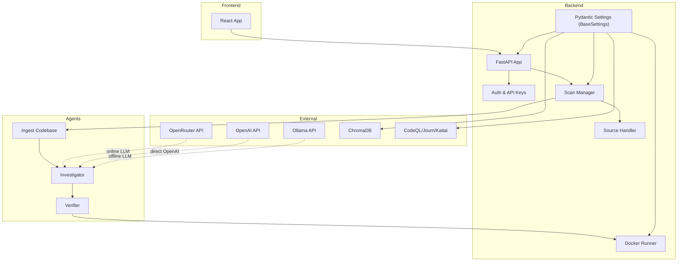
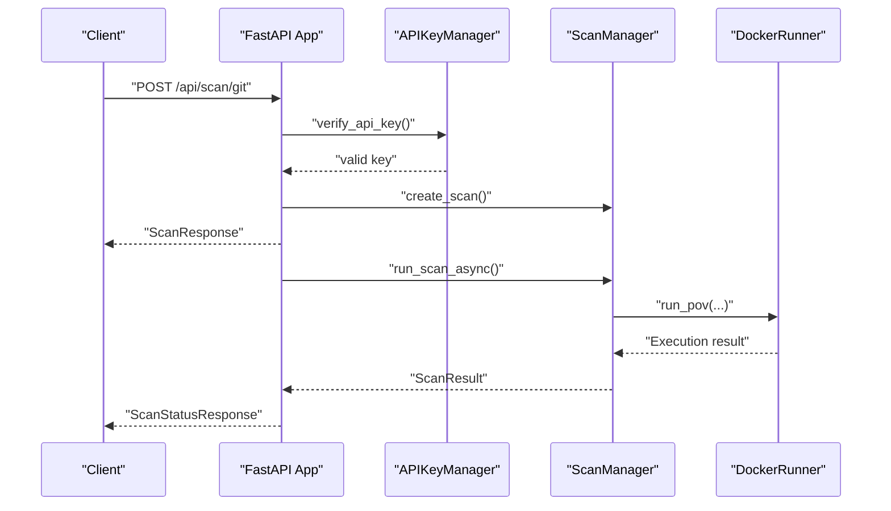
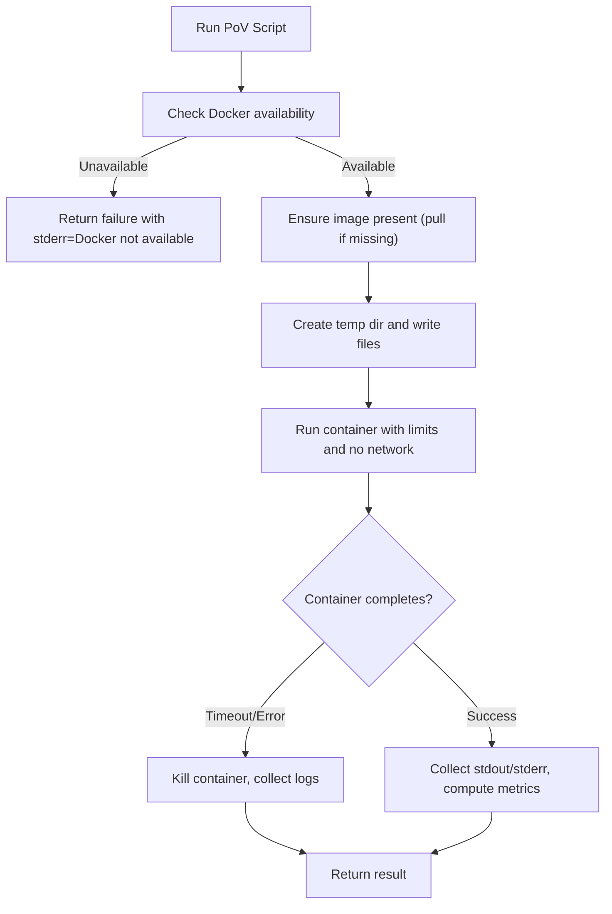
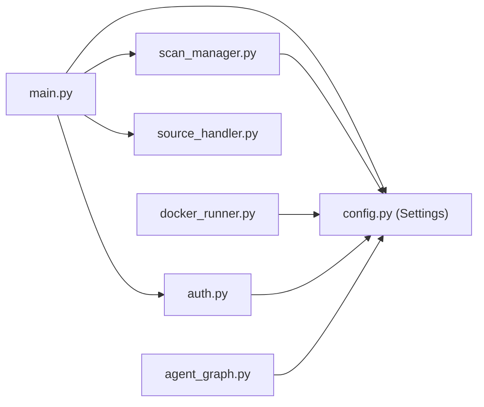

# Configuration and Setup

<cite>
**Referenced Files in This Document**
- [config.py](file://autopov/app/config.py)
- [main.py](file://autopov/app/main.py)
- [auth.py](file://autopov/app/auth.py)
- [docker_runner.py](file://autopov/agents/docker_runner.py)
- [scan_manager.py](file://autopov/app/scan_manager.py)
- [source_handler.py](file://autopov/app/source_handler.py)
- [agent_graph.py](file://autopov/app/agent_graph.py)
- [README.md](file://autopov/README.md)
- [run.sh](file://autopov/run.sh)
- [requirements.txt](file://autopov/requirements.txt)
- [autopov.py](file://autopov/cli/autopov.py)
</cite>

## Update Summary
**Changes Made**
- Enhanced configuration system with comprehensive model provider support (OpenRouter for online models, Ollama for offline models)
- Added model mode switching between online/offline configurations with automatic provider detection
- Updated project structure documentation to reflect current directory layout
- Expanded environment variable documentation with new configuration options
- Enhanced API key management system with improved security and validation
- Updated Docker setup with comprehensive resource limits and security measures

## Table of Contents
1. [Introduction](#introduction)
2. [Project Structure](#project-structure)
3. [Core Components](#core-components)
4. [Architecture Overview](#architecture-overview)
5. [Detailed Component Analysis](#detailed-component-analysis)
6. [Dependency Analysis](#dependency-analysis)
7. [Performance Considerations](#performance-considerations)
8. [Troubleshooting Guide](#troubleshooting-guide)
9. [Conclusion](#conclusion)
10. [Appendices](#appendices)

## Introduction
This document provides comprehensive guidance for configuring and setting up AutoPoV with its enhanced Pydantic-based configuration system. The new configuration architecture offers environment-driven settings management, secure API key handling, robust Docker-based sandboxing, and intelligent cost control. AutoPoV now features dynamic LLM configuration enabling seamless switching between online and offline modes with comprehensive validation and security measures.

## Project Structure
AutoPoV is organized into a FastAPI backend, LangGraph agents, a React frontend, CLI tooling, and test suites. The configuration system is now managed through a centralized Pydantic Settings class with comprehensive validation, dynamic configuration methods, and environment variable support.



**Diagram sources**
- [config.py](file://autopov/app/config.py#L13-L234)
- [main.py](file://autopov/app/main.py#L105-L113)
- [auth.py](file://autopov/app/auth.py#L32-L179)
- [scan_manager.py](file://autopov/app/scan_manager.py#L40-L348)
- [docker_runner.py](file://autopov/agents/docker_runner.py#L27-L379)
- [source_handler.py](file://autopov/app/source_handler.py#L18-L380)

**Section sources**
- [README.md](file://autopov/README.md#L17-L35)
- [config.py](file://autopov/app/config.py#L13-L234)
- [run.sh](file://autopov/run.sh#L77-L118)

## Core Components
- **Pydantic BaseSettings Configuration**: Centralized configuration via Pydantic BaseSettings with comprehensive environment variable binding, validation, and dynamic helper methods
- **Enhanced LLM Configuration**: Dynamic model switching between OpenRouter (online) and Ollama (offline) with automatic API key detection and validation
- **Advanced Security System**: Comprehensive validation methods, Docker availability checks, and external tool detection with secure storage
- **Cost Management**: Budget control system with MAX_COST_USD and COST_TRACKING_ENABLED for online LLM usage
- **API Key Management**: Admin-only and user API key management with hashed storage, bearer token verification, and administrative controls
- **Docker Execution**: Secure containerization with resource limits, network isolation, cleanup, and enhanced error handling
- **Vector Store Configuration**: ChromaDB setup with embedding model management and persistence configuration
- **External Tool Integration**: Optional integration points for CodeQL, Joern, and Kaitai Struct compiler with availability detection

**Section sources**
- [config.py](file://autopov/app/config.py#L13-L234)
- [auth.py](file://autopov/app/auth.py#L32-L179)
- [docker_runner.py](file://autopov/agents/docker_runner.py#L27-L379)
- [scan_manager.py](file://autopov/app/scan_manager.py#L40-L348)
- [source_handler.py](file://autopov/app/source_handler.py#L18-L380)

## Architecture Overview
The enhanced configuration system initializes settings from environment variables (.env) using Pydantic BaseSettings with comprehensive validation. The system provides dynamic configuration methods for runtime checks, secure API key management with hashed storage, and integrated cost tracking. Scans are orchestrated by the scan manager with Docker-based execution under strict isolation and comprehensive error handling.



**Diagram sources**
- [main.py](file://autopov/app/main.py#L191-L261)
- [auth.py](file://autopov/app/auth.py#L137-L179)
- [scan_manager.py](file://autopov/app/scan_manager.py#L86-L116)
- [docker_runner.py](file://autopov/agents/docker_runner.py#L62-L192)

## Detailed Component Analysis

### Pydantic-Based Configuration System
AutoPoV now uses Pydantic BaseSettings to manage configuration from .env files with comprehensive validation, environment variable binding, and dynamic configuration methods.

**Core Configuration Class** (`Settings`):
- **Application Settings**: APP_NAME, APP_VERSION, DEBUG with environment variable binding
- **API Configuration**: API_HOST, API_PORT, API_PREFIX with validation
- **Security Settings**: ADMIN_API_KEY, WEBHOOK_SECRET with environment variable support
- **LLM Configuration**: OPENROUTER_API_KEY, OLLAMA_BASE_URL with model validation
- **Model Selection**: MODEL_MODE ('online' or 'offline'), MODEL_NAME with validation
- **Git Provider Tokens**: GITHUB_TOKEN, GITLAB_TOKEN, BITBUCKET_TOKEN for private repository access
- **Vector Store**: CHROMA_PERSIST_DIR, CHROMA_COLLECTION_NAME with defaults
- **Embedding Models**: EMBEDDING_MODEL_ONLINE/OFFLINE with platform-specific defaults
- **External Tools**: CODEQL_CLI_PATH, JOERN_CLI_PATH, KAITAI_STRUCT_COMPILER_PATH
- **Docker Configuration**: DOCKER_ENABLED, DOCKER_IMAGE, DOCKER_TIMEOUT with resource limits
- **Cost Control**: MAX_COST_USD, COST_TRACKING_ENABLED for budget management
- **Scanning Defaults**: MAX_CHUNK_SIZE, CHUNK_OVERLAP, MAX_RETRIES with validation
- **Supported CWEs**: Comprehensive vulnerability detection list for high-impact web vulnerabilities

**Dynamic Configuration Methods**:
- `get_llm_config()`: Returns LLM configuration based on MODEL_MODE with automatic provider detection
- `is_docker_available()`: Validates Docker daemon connectivity with comprehensive error handling
- `is_codeql_available()`: Checks CodeQL CLI availability with timeout protection
- `is_joern_available()`: Validates Joern availability with version detection
- `is_kaitai_available()`: Confirms Kaitai Struct compiler presence

**Section sources**
- [config.py](file://autopov/app/config.py#L13-L234)

### Enhanced LLM Configuration: Dynamic Online vs Offline Mode
The configuration system provides automatic model switching between online and offline modes with comprehensive validation and dynamic configuration.

**Online Mode (MODEL_MODE=online)**:
- **OpenRouter Integration**: Uses OPENROUTER_API_KEY for authentication with fallback to OpenAI API
- **Supported Models**: openai/gpt-4o, anthropic/claude-3.5-sonnet with automatic provider detection
- **Base URLs**: OPENROUTER_BASE_URL=https://openrouter.ai/api/v1
- **Embedding Model**: text-embedding-3-small for online mode

**Offline Mode (MODEL_MODE=offline)**:
- **Ollama Integration**: Uses OLLAMA_BASE_URL for local inference with configurable base URL
- **Supported Models**: llama3:70b, mixtral:8x7b for local execution
- **Embedding Model**: sentence-transformers/all-MiniLM-L6-v2 for offline mode
- **Local Execution**: No external API dependencies

**Dynamic Configuration Logic**:
```python
def get_llm_config(self) -> dict:
    """Get LLM configuration based on MODEL_MODE"""
    if self.MODEL_MODE == "online":
        # Use OpenRouter for all online models
        return {
            "mode": "online",
            "model": self.MODEL_NAME,
            "api_key": self.OPENROUTER_API_KEY,
            "base_url": self.OPENROUTER_BASE_URL,
            "embedding_model": self.EMBEDDING_MODEL_ONLINE,
            "provider": "openrouter"
        }
    else:
        return {
            "mode": "offline",
            "model": self.MODEL_NAME,
            "base_url": self.OLLAMA_BASE_URL,
            "embedding_model": self.EMBEDDING_MODEL_OFFLINE,
            "provider": "ollama"
        }
```

**Section sources**
- [config.py](file://autopov/app/config.py#L38-L49)
- [config.py](file://autopov/app/config.py#L194-L213)

### Docker Setup and Enhanced Security Configuration
The Docker runner now includes comprehensive resource management, security validation, and enhanced error handling with strict isolation policies.

**Resource Management**:
- **Memory Limit**: DOCKER_MEMORY_LIMIT (default 512m) with configurable limits
- **CPU Quota**: DOCKER_CPU_LIMIT (default 1.0) with precise resource allocation
- **Timeout**: DOCKER_TIMEOUT (default 60s) with graceful termination
- **Image**: DOCKER_IMAGE (default python:3.12-slim) with automatic pull capability

**Security Enhancements**:
- **Network Isolation**: network_mode='none' prevents all outbound connections
- **Read-Only Filesystem**: volumes mounted as read-only for container integrity
- **Automatic Cleanup**: containers and temp directories automatically removed
- **Exit Code Monitoring**: comprehensive error detection and logging
- **Vulnerability Detection**: "VULNERABILITY TRIGGERED" pattern recognition in output

**Availability Checks**:
- `is_available()`: Comprehensive Docker daemon validation with ping test
- `is_docker_available()`: Settings-based availability check with timeout protection
- **Automatic Image Management**: Images pulled automatically if missing



**Diagram sources**
- [docker_runner.py](file://autopov/agents/docker_runner.py#L62-L192)
- [docker_runner.py](file://autopov/agents/docker_runner.py#L232-L312)

**Section sources**
- [config.py](file://autopov/app/config.py#L81-L86)
- [docker_runner.py](file://autopov/agents/docker_runner.py#L27-L379)

### Enhanced API Key Management System
The API key management system now uses Pydantic models with comprehensive validation and secure storage mechanisms.

**API Key Model**:
```python
class APIKey(BaseModel):
    key_id: str
    key_hash: str
    name: str
    created_at: str
    last_used: Optional[str] = None
    is_active: bool = True
```

**Key Management Features**:
- **Secure Hashing**: SHA-256 hashing for key storage with cryptographic security
- **Admin Controls**: ADMIN_API_KEY validation for administrative operations
- **User Key Generation**: Random token creation with apov_ prefix for identification
- **Key Lifecycle**: Support for key revocation, deletion, and listing operations
- **Usage Tracking**: Last-used timestamp tracking for audit purposes
- **Query Parameter Support**: SSE stream compatibility with query parameter authentication

**Section sources**
- [auth.py](file://autopov/app/auth.py#L22-L179)

### Vector Store and Database Configuration
Enhanced ChromaDB configuration with comprehensive persistence and embedding model management for both online and offline modes.

**Vector Store Settings**:
- **Persistence Directory**: CHROMA_PERSIST_DIR (default ./data/chroma) with automatic creation
- **Collection Name**: code_chunks with configurable collection management
- **Online Embedding**: text-embedding-3-small for OpenRouter/OpenAI integration
- **Offline Embedding**: sentence-transformers/all-MiniLM-L6-v2 for Ollama local execution
- **Automatic Directory Creation**: Ensures all required directories exist on startup

**Section sources**
- [config.py](file://autopov/app/config.py#L62-L68)

### External Tool Integration and Availability Detection
Comprehensive external tool integration with automatic availability detection and validation for enhanced functionality.

**Tools Configuration**:
- **CodeQL CLI**: CODEQL_CLI_PATH (default "codeql") with version detection
- **Joern**: JOERN_CLI_PATH (default "joern") with availability validation
- **Kaitai Struct**: KAITAI_STRUCT_COMPILER_PATH (default "kaitai-struct-compiler") with version check

**Availability Detection**:
- `is_codeql_available()`: Validates CodeQL CLI installation with timeout protection
- `is_joern_available()`: Checks Joern availability with version detection
- `is_kaitai_available()`: Confirms Kaitai Struct compiler presence with error handling

**Section sources**
- [config.py](file://autopov/app/config.py#L75-L79)
- [config.py](file://autopov/app/config.py#L160-L194)

### Cost Management and Budget Control
New cost tracking system with comprehensive budget control and monitoring capabilities for online LLM usage.

**Cost Configuration**:
- **Maximum Cost**: MAX_COST_USD (default 100.0) with configurable limits
- **Tracking Control**: COST_TRACKING_ENABLED (default True) for cost monitoring
- **Real-Time Calculation**: Cost tracking based on inference time and model usage
- **Provider-Specific Pricing**: Different pricing models for online vs offline execution

**Cost Estimation**:
- **Online Mode**: $0.01 per second of inference with provider-specific rates
- **Offline Mode**: $0.0 (GPU hours tracked separately) with local resource monitoring
- **Integrated Tracking**: Cost calculation included in scan results and metrics

**Section sources**
- [config.py](file://autopov/app/config.py#L88-L90)
- [agent_graph.py](file://autopov/app/agent_graph.py#L635-L644)

### Enhanced CWE Support and Vulnerability Detection
Expanded list of supported CWEs for comprehensive vulnerability detection across high-impact web vulnerabilities.

**Supported CWE Categories**:
- **OWASP Top 10 2021**: CWE-89 (SQL Injection), CWE-79 (XSS), CWE-20 (Insecure Design)
- **Critical Security Issues**: CWE-22 (Path Traversal), CWE-352 (CSRF), CWE-502 (Deserialization)
- **Authentication & Session**: CWE-287 (Auth), CWE-798 (Hardcoded Creds), CWE-306 (Missing Auth)
- **Additional High-Impact**: CWE-94 (Code Injection), CWE-78 (OS Command Injection)
- **Network Security**: CWE-601 (Open Redirect), CWE-918 (SSRF), CWE-434 (File Upload)
- **Data Security**: CWE-312 (Cleartext Storage), CWE-327 (Broken Crypto), CWE-611 (XXE)
- **Resource Management**: CWE-400 (DoS), CWE-384 (Session Fixation)

**Section sources**
- [config.py](file://autopov/app/config.py#L97-L121)

### System Initialization and Enhanced Startup
Improved system initialization with comprehensive directory creation, validation, and environment setup.

**Startup Process**:
- **Automatic .env Creation**: Creates .env from template if missing with user guidance
- **Directory Management**: Automatic creation of data, results, temp directories
- **Settings Validation**: Comprehensive validation of all configuration parameters
- **Tool Detection**: Automatic availability checking for external tools
- **Docker Connectivity**: Docker daemon validation with comprehensive error handling

**Section sources**
- [run.sh](file://autopov/run.sh#L77-L118)
- [config.py](file://autopov/app/config.py#L215-L227)

### Configuration Examples for Deployment Scenarios
Enhanced configuration examples for various deployment scenarios with comprehensive validation and security considerations.

**Online Mode with OpenRouter**:
```bash
MODEL_MODE=online
MODEL_NAME=openai/gpt-4o
OPENROUTER_API_KEY=sk-or-v1-your_openrouter_key_here
FRONTEND_URL=http://localhost:5173
MAX_COST_USD=100.0
COST_TRACKING_ENABLED=true
```

**Online Mode with Direct OpenAI**:
```bash
MODEL_MODE=online
MODEL_NAME=openai/gpt-4o
OPENAI_API_KEY=sk-or-v1-your_openai_key_here
OPENROUTER_API_KEY= # Leave empty for direct OpenAI
FRONTEND_URL=http://localhost:5173
DOCKER_ENABLED=true
```

**Offline Mode with Ollama**:
```bash
MODEL_MODE=offline
MODEL_NAME=llama3:70b
OLLAMA_BASE_URL=http://localhost:11434
FRONTEND_URL=http://localhost:5173
DOCKER_ENABLED=true
```

**Production Configuration**:
```bash
DEBUG=false
API_HOST=0.0.0.0
API_PORT=8000
MAX_COST_USD=1000.0
COST_TRACKING_ENABLED=true
DOCKER_ENABLED=true
LANGCHAIN_TRACING_V2=false
```

**Section sources**
- [README.md](file://autopov/README.md#L146-L168)

## Dependency Analysis
Enhanced dependency structure with Pydantic BaseSettings integration and comprehensive validation throughout the system.

**Internal Dependencies**:
- main.py depends on config (Settings), auth, scan_manager, source_handler, webhook_handler, report_generator
- scan_manager depends on config (Settings) and agent_graph
- docker_runner depends on config (Settings) and Docker SDK
- auth depends on config (Settings) for storage path and admin key validation
- agent_graph depends on config (Settings) for model configuration and tool availability

**External Dependencies**:
- FastAPI, Uvicorn, Pydantic BaseSettings, LangChain/LangGraph, ChromaDB, Docker SDK
- Optional: CodeQL CLI, Joern, Kaitai Struct compiler
- Security: docker-py for container management, cryptography for key hashing



**Diagram sources**
- [main.py](file://autopov/app/main.py#L19-L26)
- [scan_manager.py](file://autopov/app/scan_manager.py#L16-L18)
- [docker_runner.py](file://autopov/agents/docker_runner.py#L19)
- [auth.py](file://autopov/app/auth.py#L16)
- [agent_graph.py](file://autopov/app/agent_graph.py#L22-L26)

**Section sources**
- [requirements.txt](file://autopov/requirements.txt#L1-L42)

## Performance Considerations
Enhanced performance optimization with comprehensive resource management, cost control, and scalability features.

**Cost Control Optimization**:
- **Budget Management**: MAX_COST_USD prevents excessive spending on online LLM usage
- **Tracking Control**: COST_TRACKING_ENABLED monitors and tracks actual usage
- **Provider Efficiency**: Automatic provider selection optimizes cost vs performance

**Resource Management**:
- **Memory Control**: DOCKER_MEMORY_LIMIT (512m default) prevents memory leaks
- **CPU Allocation**: DOCKER_CPU_LIMIT (1.0 default) ensures fair resource sharing
- **Timeout Protection**: DOCKER_TIMEOUT (60s default) prevents hanging processes

**Scalability Features**:
- **Thread Pool Executor**: Concurrent scan processing with configurable workers
- **Asynchronous Execution**: Non-blocking scan operations with progress callbacks
- **Efficient Vector Store**: Optimized ChromaDB management with cleanup

**Section sources**
- [config.py](file://autopov/app/config.py#L88-L90)
- [scan_manager.py](file://autopov/app/scan_manager.py#L46)

## Troubleshooting Guide
Enhanced troubleshooting with comprehensive validation, diagnostic capabilities, and systematic problem resolution.

**Docker Issues**:
- **Docker Daemon Unavailable**: Check Docker service status, permissions, and connectivity
- **Image Pull Failures**: Verify network connectivity and Docker registry access
- **Resource Limit Problems**: Adjust DOCKER_MEMORY_LIMIT and DOCKER_CPU_LIMIT based on workload
- **Container Cleanup Failures**: Check file system permissions and disk space

**Configuration Issues**:
- **Invalid MODEL_MODE**: Must be 'online' or 'offline' with proper validation
- **Unsupported MODEL_NAME**: Check against ONLINE_MODELS or OFFLINE_MODELS lists
- **API Key Validation**: Ensure ADMIN_API_KEY matches settings and user keys are properly hashed
- **Environment Variable Loading**: Verify .env file syntax and encoding

**External Tool Issues**:
- **CodeQL Not Found**: Install CodeQL CLI or set CODEQL_CLI_PATH correctly
- **Joern Unavailable**: Verify Joern installation and PATH configuration
- **Kaitai Compiler Missing**: Install Kaitai Struct compiler or set KAITAI_STRUCT_COMPILER_PATH

**Performance Issues**:
- **High Memory Usage**: Reduce MAX_CHUNK_SIZE or increase DOCKER_MEMORY_LIMIT
- **Slow Inference**: Consider offline mode with larger models or adjust resource limits
- **Cost Overruns**: Lower MAX_COST_USD or disable COST_TRACKING_ENABLED
- **Scan Failures**: Check Docker availability and external tool detection

**Section sources**
- [docker_runner.py](file://autopov/agents/docker_runner.py#L50-L61)
- [config.py](file://autopov/app/config.py#L140-L144)
- [auth.py](file://autopov/app/auth.py#L81-L95)

## Conclusion
AutoPoV's completely redesigned configuration system provides comprehensive environment-driven settings management with Pydantic BaseSettings integration. The system ensures type-safe configuration with automatic validation, secure API key handling, robust Docker-based sandboxing, and intelligent cost control. The dynamic LLM configuration enables seamless switching between online and offline modes with automatic provider detection and validation. Teams can deploy AutoPoV with confidence, knowing that all configurations are validated, monitored, and optimized for production use with comprehensive security measures and performance optimizations.

## Appendices

### Enhanced Environment Variables Reference
**Core Configuration**:
- OPENROUTER_API_KEY: Online LLM API key for OpenRouter integration
- ADMIN_API_KEY: Admin key for API key management operations
- MODEL_MODE: online | offline (dynamic model switching)
- MODEL_NAME: Selected LLM model (validated against supported lists)
- OLLAMA_BASE_URL: Local LLM base URL for offline mode

**Application Settings**:
- API_HOST, API_PORT, DEBUG: API server configuration and development mode
- FRONTEND_URL: CORS allow-origin for web UI integration

**Security Settings**:
- WEBHOOK_SECRET, GITHUB_WEBHOOK_SECRET, GITLAB_WEBHOOK_SECRET: Webhook signature validation
- GITHUB_TOKEN, GITLAB_TOKEN, BITBUCKET_TOKEN: Private repository access tokens

**Docker Configuration**:
- DOCKER_ENABLED: Enable/disable Docker execution
- DOCKER_IMAGE: Container image for PoV execution
- DOCKER_TIMEOUT, DOCKER_MEMORY_LIMIT, DOCKER_CPU_LIMIT: Resource management

**Cost Management**:
- MAX_COST_USD: Maximum cost limit for online LLM usage
- COST_TRACKING_ENABLED: Enable/disable cost tracking

**External Tools**:
- CODEQL_CLI_PATH, JOERN_CLI_PATH, KAITAI_STRUCT_COMPILER_PATH: Tool path configuration
- LANGCHAIN_TRACING_V2, LANGCHAIN_API_KEY, LANGCHAIN_PROJECT: Optional tracing configuration

**Vector Store**:
- CHROMA_PERSIST_DIR, CHROMA_COLLECTION_NAME: ChromaDB persistence configuration
- EMBEDDING_MODEL_ONLINE/OFFLINE: Platform-specific embedding models

**Section sources**
- [config.py](file://autopov/app/config.py#L13-L234)
- [README.md](file://autopov/README.md#L146-L168)