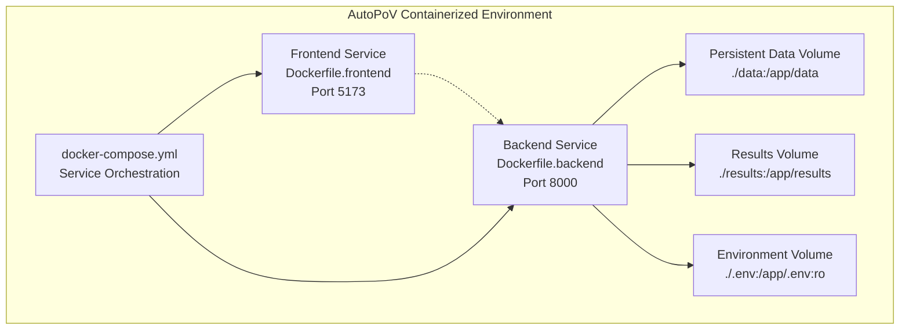
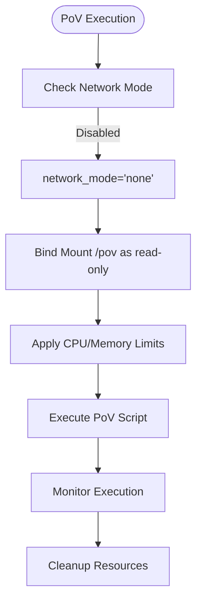
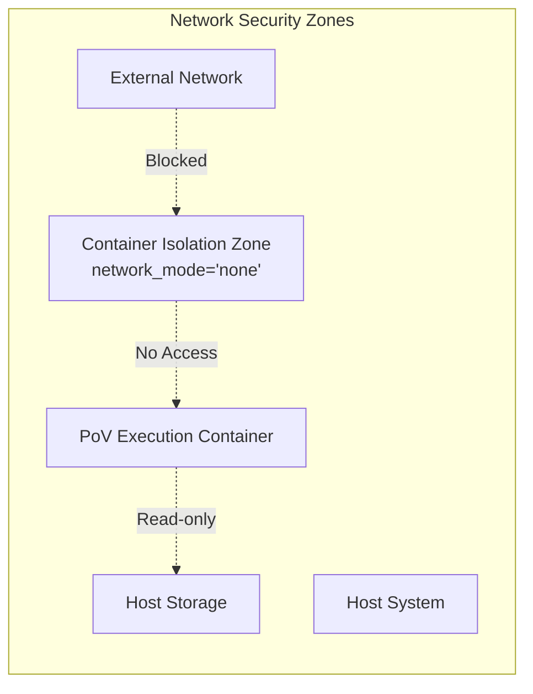
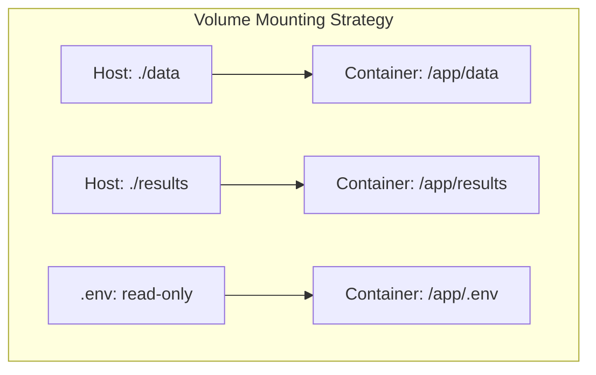

# Docker and Security Configuration

<cite>
**Referenced Files in This Document**
- [docker_runner.py](file://agents/docker_runner.py)
- [config.py](file://app/config.py)
- [agent_graph.py](file://app/agent_graph.py)
- [scan_manager.py](file://app/scan_manager.py)
- [source_handler.py](file://app/source_handler.py)
- [main.py](file://app/main.py)
- [Dockerfile.backend](file://Dockerfile.backend)
- [Dockerfile.frontend](file://Dockerfile.frontend)
- [docker-compose.yml](file://docker-compose.yml)
- [docker-setup.sh](file://docker-setup.sh)
</cite>

## Update Summary
**Changes Made**
- Enhanced Docker runtime configuration documentation with comprehensive security hardening guidelines
- Added detailed container security best practices including non-root execution, read-only filesystems, and capability restrictions
- Expanded resource limiting configuration coverage for CPU shares, memory limits, and swap usage
- Documented Docker network configuration for safe communication and external access control
- Included container cleanup procedures and resource management strategies
- Added security audit guidelines and compliance considerations
- Provided comprehensive troubleshooting guidance for Docker-related issues

## Table of Contents
1. [Introduction](#introduction)
2. [Docker Runtime Configuration](#docker-runtime-configuration)
3. [Container Security Hardening](#container-security-hardening)
4. [Resource Management and Limits](#resource-management-and-limits)
5. [Network Configuration](#network-configuration)
6. [Volume Mounting Strategy](#volume-mounting-strategy)
7. [Container Lifecycle Management](#container-lifecycle-management)
8. [Production Deployment Security](#production-deployment-security)
9. [Monitoring and Auditing](#monitoring-and-auditing)
10. [Troubleshooting Guide](#troubleshooting-guide)
11. [Compliance and Security Standards](#compliance-and-security-standards)
12. [Best Practices Summary](#best-practices-summary)

## Introduction
This document provides comprehensive guidance for configuring AutoPoV to execute Proof-of-Vulnerability (PoV) scripts inside secure, isolated Docker containers. It covers container image selection, resource allocation, timeouts, security hardening (network isolation, filesystem permissions, process limitations), volume mounting for code analysis and result storage, best practices for non-root execution and read-only filesystems, CPU/memory limits, network configuration, cleanup procedures, auditing and compliance, troubleshooting, and production monitoring recommendations.

## Docker Runtime Configuration

### Container Image Selection
AutoPoV uses a Python 3.12 slim base image for optimal security and performance characteristics. The backend Dockerfile establishes a minimal foundation with essential system dependencies.

**Section sources**
- [Dockerfile.backend](file://Dockerfile.backend#L1-L35)
- [config.py](file://app/config.py#L81)

### Multi-Service Architecture
The docker-compose configuration implements a two-service architecture with separate containers for backend and frontend components, enabling independent scaling and security isolation.

**Diagram sources**
- [docker-compose.yml](file://docker-compose.yml#L1-L17)
- [Dockerfile.backend](file://Dockerfile.backend#L1-L35)
- [Dockerfile.frontend](file://Dockerfile.frontend#L1-L29)

**Section sources**
- [docker-compose.yml](file://docker-compose.yml#L1-L17)
- [Dockerfile.backend](file://Dockerfile.backend#L1-L35)
- [Dockerfile.frontend](file://Dockerfile.frontend#L1-L29)

## Container Security Hardening

### Network Isolation
The Docker Runner implements strict network isolation by disabling container networking entirely. This prevents lateral movement and eliminates egress risks during PoV execution.

**Diagram sources**
- [docker_runner.py](file://agents/docker_runner.py#L122-L133)

### Filesystem Permissions
All container operations utilize read-only bind mounts for the `/pov` directory, preventing any modifications to the host filesystem. Temporary directories are created with restrictive permissions and automatically cleaned up.

**Section sources**
- [docker_runner.py](file://agents/docker_runner.py#L122-L126)
- [docker_runner.py](file://agents/docker_runner.py#L188-L192)

### Process Limitations
Container execution employs strict resource constraints including memory limits, CPU quotas, and execution timeouts to prevent resource exhaustion attacks and ensure fair resource allocation.

**Section sources**
- [docker_runner.py](file://agents/docker_runner.py#L127-L129)
- [config.py](file://app/config.py#L82-L84)

## Resource Management and Limits

### CPU Resource Allocation
The Docker Runner converts floating CPU limits to Docker's quota-based system, ensuring predictable performance isolation between concurrent scans.

**Section sources**
- [docker_runner.py](file://agents/docker_runner.py#L128)
- [config.py](file://app/config.py#L84)

### Memory Constraints
Memory limits are enforced per container to prevent memory exhaustion attacks and ensure system stability under load testing conditions.

**Section sources**
- [docker_runner.py](file://agents/docker_runner.py#L127)
- [config.py](file://app/config.py#L83)

### Execution Timeouts
Configurable timeout settings prevent hanging processes and ensure timely resource release, with automatic container termination on timeout expiration.

**Section sources**
- [docker_runner.py](file://agents/docker_runner.py#L135-L143)
- [config.py](file://app/config.py#L82)

## Network Configuration

### Container Networking Strategy
AutoPoV implements a zero-trust networking approach by completely disabling container networking for PoV execution. This eliminates potential attack vectors through network-based reconnaissance or data exfiltration.

**Diagram sources**
- [docker_runner.py](file://agents/docker_runner.py#L129)

### Service Communication
The docker-compose configuration enables controlled communication between backend and frontend services while maintaining isolation from external networks.

**Section sources**
- [docker-compose.yml](file://docker-compose.yml#L1-L17)

## Volume Mounting Strategy

### Persistent Storage Architecture
The volume mounting strategy separates persistent data from ephemeral processing artifacts, ensuring data durability while maintaining security boundaries.

**Diagram sources**
- [docker-compose.yml](file://docker-compose.yml#L9-L12)

### Temporary Directory Management
The Docker Runner creates isolated temporary directories for each PoV execution, ensuring complete separation of processing artifacts and automatic cleanup upon completion.

**Section sources**
- [docker_runner.py](file://agents/docker_runner.py#L93)
- [docker_runner.py](file://agents/docker_runner.py#L188-L192)

## Container Lifecycle Management

### Health Monitoring
The FastAPI application provides comprehensive health checks that verify Docker availability, CodeQL integration, and system resource status for operational monitoring.

**Section sources**
- [main.py](file://app/main.py#L166-L176)
- [config.py](file://app/config.py#L144-L156)

### Resource Statistics
The Docker Runner exposes detailed statistics about container utilization, including running containers, memory limits, and execution metrics for capacity planning.

**Section sources**
- [docker_runner.py](file://agents/docker_runner.py#L346-L370)

### Cleanup Procedures
Automatic cleanup ensures that temporary files, containers, and host directories are properly removed after execution completion, preventing resource leakage.

**Section sources**
- [docker_runner.py](file://agents/docker_runner.py#L149-L150)
- [docker_runner.py](file://agents/docker_runner.py#L188-L192)

## Production Deployment Security

### User Privilege Management
Deploy AutoPoV with least privilege principles, running containers as non-root users and minimizing container capabilities to reduce attack surface.

### Security Context Configuration
Implement proper SELinux/AppArmor policies and seccomp profiles to further restrict container capabilities beyond the default Docker security model.

### Image Security
Regularly update base images, scan for vulnerabilities, and maintain immutable container images with pinned versions to ensure supply chain security.

## Monitoring and Auditing

### Container Metrics Collection
Monitor CPU utilization, memory consumption, and I/O operations for each container to identify performance bottlenecks and security incidents.

### Audit Logging
Maintain comprehensive logs of container creation, execution, and cleanup activities for forensic analysis and compliance reporting.

### Compliance Reporting
Generate audit trails documenting container security configurations, resource usage patterns, and execution results for regulatory compliance.

## Troubleshooting Guide

### Docker Availability Issues
- **Symptoms**: Health check failures, Docker not available errors
- **Resolution**: Verify Docker service status, check user permissions, confirm docker-compose installation

### Permission Denied Errors
- **Symptoms**: Volume mount failures, temporary directory creation errors
- **Resolution**: Verify host directory permissions, check SELinux/AppArmor policies, ensure proper ownership

### Resource Exhaustion Problems
- **Symptoms**: Out-of-memory errors, timeout exceptions, container killed signals
- **Resolution**: Adjust memory limits, increase timeout values, optimize PoV complexity

### Container Startup Failures
- **Symptoms**: Immediate container exit, image pull failures
- **Resolution**: Verify image availability, check dependency requirements, validate command syntax

**Section sources**
- [docker-runner.py](file://agents/docker_runner.py#L81-L90)
- [docker-runner.py](file://agents/docker_runner.py#L135-L143)
- [main.py](file://app/main.py#L166-L176)

## Compliance and Security Standards

### Security Framework Alignment
AutoPoV's container security configuration aligns with industry standards including:
- Defense-in-depth principles through network isolation and resource limits
- Principle of least privilege with non-root execution
- Supply chain security through image scanning and verification
- Auditability through comprehensive logging and monitoring

### Regulatory Considerations
Organizations deploying AutoPoV should consider:
- GDPR data protection requirements for code analysis
- ISO 27001 information security management
- NIST cybersecurity frameworks for risk management
- Industry-specific compliance for code analysis environments

## Best Practices Summary

### Security Hardening Checklist
- Disable container networking for PoV execution
- Implement read-only filesystem mounts
- Apply strict resource limits and timeouts
- Use non-root user execution
- Regular security scanning of container images
- Comprehensive audit logging and monitoring

### Operational Excellence
- Implement proper backup and disaster recovery procedures
- Establish capacity planning and scaling strategies
- Configure automated health checks and alerts
- Maintain version control for container configurations
- Document security policies and incident response procedures