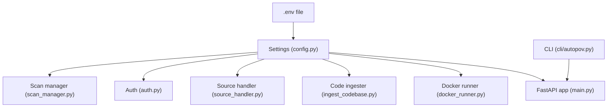
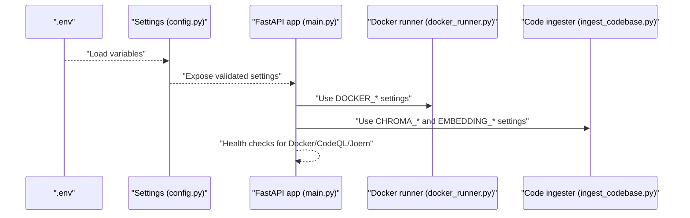
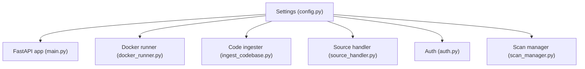

# Environment Variables and System Configuration

<cite>
**Referenced Files in This Document**
- [config.py](file://autopov/app/config.py)
- [main.py](file://autopov/app/main.py)
- [run.sh](file://autopov/run.sh)
- [README.md](file://autopov/README.md)
- [requirements.txt](file://autopov/requirements.txt)
- [docker_runner.py](file://autopov/agents/docker_runner.py)
- [ingest_codebase.py](file://autopov/agents/ingest_codebase.py)
- [source_handler.py](file://autopov/app/source_handler.py)
- [auth.py](file://autopov/app/auth.py)
- [scan_manager.py](file://autopov/app/scan_manager.py)
- [autopov.py](file://autopov/cli/autopov.py)
- [.gitignore](file://autopov/.gitignore)
- [.gitignore](file://.gitignore)
</cite>

## Update Summary
**Changes Made**
- Enhanced .gitignore cleanup documentation with improved file exclusion patterns
- Added comprehensive merge conflict marker removal details
- Updated development environment file management guidance
- Expanded temporary files and build artifacts exclusion strategies
- Improved preservation of essential project structure documentation

## Table of Contents
1. [Introduction](#introduction)
2. [Project Structure](#project-structure)
3. [Core Components](#core-components)
4. [Architecture Overview](#architecture-overview)
5. [Detailed Component Analysis](#detailed-component-analysis)
6. [Dependency Analysis](#dependency-analysis)
7. [Performance Considerations](#performance-considerations)
8. [Troubleshooting Guide](#troubleshooting-guide)
9. [Conclusion](#conclusion)
10. [Appendices](#appendices)

## Introduction
This document explains how AutoPoV reads and validates environment variables, initializes the system, and manages configuration across development and production deployments. It covers required variables, defaults, types, and recommended values; describes differences between development and production; outlines system requirements; and provides configuration examples and troubleshooting guidance.

**Updated** Enhanced with comprehensive .gitignore cleanup improvements including merge conflict marker removal and improved file exclusion patterns for development environments.

## Project Structure
AutoPoV centralizes configuration in a dedicated settings class and loads environment variables from a .env file. The FastAPI application consumes these settings at startup, and supporting modules (vector store, Docker runner, ingestion, and CLI) read from the same settings.

**Diagram sources**
- [config.py](file://autopov/app/config.py#L13-L210)
- [main.py](file://autopov/app/main.py#L19-L21)
- [docker_runner.py](file://autopov/agents/docker_runner.py#L27-L48)
- [ingest_codebase.py](file://autopov/agents/ingest_codebase.py#L41-L103)
- [source_handler.py](file://autopov/app/source_handler.py#L18-L30)
- [auth.py](file://autopov/app/auth.py#L32-L131)
- [scan_manager.py](file://autopov/app/scan_manager.py#L40-L48)
- [autopov.py](file://autopov/cli/autopov.py#L25-L44)

**Section sources**
- [config.py](file://autopov/app/config.py#L112-L116)
- [run.sh](file://autopov/run.sh#L84-L90)

## Core Components
- Settings class defines all environment-backed configuration, including API keys, model selection, Docker behavior, cost controls, and tool paths.
- FastAPI app reads settings at startup and exposes health checks that reflect runtime availability of Docker, CodeQL, and Joern.
- Supporting modules consume settings for vector store persistence, embedding configuration, and Docker execution parameters.

Key environment variables documented below are loaded via the Settings class and validated at runtime.

**Section sources**
- [config.py](file://autopov/app/config.py#L13-L210)
- [main.py](file://autopov/app/main.py#L162-L171)

## Architecture Overview
The configuration pipeline is straightforward: .env is loaded into Settings, which is imported by all modules. Validation occurs during class construction and runtime checks for external tools.

**Diagram sources**
- [config.py](file://autopov/app/config.py#L112-L116)
- [main.py](file://autopov/app/main.py#L162-L171)
- [docker_runner.py](file://autopov/agents/docker_runner.py#L30-L48)
- [ingest_codebase.py](file://autopov/agents/ingest_codebase.py#L41-L103)

## Detailed Component Analysis

### Environment Variables Reference
Below are the required and commonly used environment variables. Types and defaults are derived from the Settings class. Recommended values are provided for typical setups.

- OPENROUTER_API_KEY
  - Purpose: API key for online LLM service.
  - Type: String.
  - Required: Yes for online mode.
  - Default: Empty string.
  - Recommended: Secure random key from provider.
  - Notes: Used when MODEL_MODE is online.

- ADMIN_API_KEY
  - Purpose: Admin key for managing API keys.
  - Type: String.
  - Required: Yes for admin operations (generating/listing/revoking keys).
  - Default: Empty string.
  - Recommended: Strong random key stored securely.

- MODEL_MODE
  - Purpose: Switch between online and offline LLM modes.
  - Type: String.
  - Allowed values: online, offline.
  - Required: Yes.
  - Default: online.
  - Recommended: online for hosted LLMs; offline for local Ollama.

- MODEL_NAME
  - Purpose: LLM model identifier.
  - Type: String.
  - Required: Yes.
  - Default: openai/gpt-4o.
  - Recommended: Match MODEL_MODE; see supported models.

- DOCKER_ENABLED
  - Purpose: Enable/disable Docker-based PoV execution.
  - Type: Boolean.
  - Required: No.
  - Default: True.
  - Recommended: True for production; False for environments without Docker.

- MAX_COST_USD
  - Purpose: Cost cap for scans.
  - Type: Float.
  - Required: No.
  - Default: 100.0.
  - Recommended: Adjust per budget; monitor via scan results.

- CODEQL_CLI_PATH
  - Purpose: Path to CodeQL CLI executable.
  - Type: String.
  - Required: No.
  - Default: codeql.
  - Recommended: Full path if not on PATH.

- JOERN_CLI_PATH
  - Purpose: Path to Joern CLI executable.
  - Type: String.
  - Required: No.
  - Default: joern.
  - Recommended: Full path if not on PATH.

- CHROMA_PERSIST_DIR
  - Purpose: Persistent directory for ChromaDB.
  - Type: String.
  - Required: No.
  - Default: ./data/chroma.
  - Recommended: Absolute path for production stability.

- FRONTEND_URL
  - Purpose: Origin for CORS and CLI configuration.
  - Type: String.
  - Required: No.
  - Default: http://localhost:5173.
  - Recommended: Actual frontend origin in production.

- OLLAMA_BASE_URL
  - Purpose: Base URL for local Ollama.
  - Type: String.
  - Required: No.
  - Default: http://localhost:11434.
  - Recommended: Host reachable from backend.

- LANGCHAIN_TRACING_V2, LANGCHAIN_API_KEY, LANGCHAIN_PROJECT
  - Purpose: LangSmith tracing configuration.
  - Type: Boolean/String/String.
  - Required: No.
  - Defaults: False, empty, "autopov".
  - Recommended: Enable for debugging; set API key for tracing.

- GITHUB_TOKEN, GITLAB_TOKEN, BITBUCKET_TOKEN
  - Purpose: Git provider tokens for cloning private repos.
  - Type: String.
  - Required: No.
  - Default: Empty string.
  - Recommended: Fine-grained tokens with minimal scopes.

- GITHUB_WEBHOOK_SECRET, GITLAB_WEBHOOK_SECRET
  - Purpose: Webhook secrets for GitHub/GitLab.
  - Type: String.
  - Required: No.
  - Default: Empty string.
  - Recommended: Strong secret; match provider configuration.

- API_HOST, API_PORT
  - Purpose: API server bind address and port.
  - Type: String/Int.
  - Required: No.
  - Defaults: 0.0.0.0, 8000.
  - Recommended: Bind to internal interface in production.

- DEBUG
  - Purpose: Enable hot reload and verbose logging.
  - Type: Boolean.
  - Required: No.
  - Default: False.
  - Recommended: False in production.

- WEBHOOK_SECRET
  - Purpose: Generic webhook secret for custom integrations.
  - Type: String.
  - Required: No.
  - Default: Empty string.
  - Recommended: Strong secret for production.

- KAITAI_STRUCT_COMPILER_PATH
  - Purpose: Path to Kaitai Struct compiler.
  - Type: String.
  - Required: No.
  - Default: kaitai-struct-compiler.
  - Recommended: Full path if not on PATH.

- COST_TRACKING_ENABLED
  - Purpose: Enable cost tracking.
  - Type: Boolean.
  - Required: No.
  - Default: True.
  - Recommended: Keep enabled to monitor spending.

- DATA_DIR, RESULTS_DIR, POVS_DIR, RUNS_DIR, TEMP_DIR
  - Purpose: Paths for data, results, PoVs, runs, and temp storage.
  - Type: String.
  - Required: No.
  - Defaults: ./data, ./results, ./results/povs, ./results/runs, /tmp/autopov.
  - Recommended: Absolute paths in production; ensure write permissions.

- FRONTEND_URL
  - Purpose: Frontend origin for CORS and CLI.
  - Type: String.
  - Required: No.
  - Default: http://localhost:5173.
  - Recommended: Actual frontend origin in production.

Notes:
- The Settings class enforces MODEL_MODE to be either online or offline.
- Settings.load_dotenv is configured to read .env with UTF-8 encoding and case-sensitive variable names.

**Section sources**
- [config.py](file://autopov/app/config.py#L13-L116)
- [config.py](file://autopov/app/config.py#L117-L121)
- [README.md](file://autopov/README.md#L148-L168)

### Configuration Validation and Error Handling
- Model mode validation ensures MODEL_MODE is one of the allowed values.
- Runtime checks for external tools:
  - Docker availability is probed via docker info.
  - CodeQL availability is checked via codeql --version.
  - Joern availability is checked via joern --version.
  - Kaitai Struct compiler availability is checked similarly.
- Health endpoint reports availability of Docker, CodeQL, and Joern.

**Section sources**
- [config.py](file://autopov/app/config.py#L117-L121)
- [config.py](file://autopov/app/config.py#L123-L171)
- [main.py](file://autopov/app/main.py#L162-L171)

### Environment Variable Precedence and Override Behavior
- The Settings class loads variables from .env with UTF-8 encoding and case-sensitive matching.
- The CLI reads AUTOPOV_API_KEY from the environment and falls back to a local config file (~/.autopov/config.json).
- In practice, environment variables take precedence over .env for the backend; the CLI's local config is separate from the backend's .env.

**Section sources**
- [config.py](file://autopov/app/config.py#L112-L116)
- [autopov.py](file://autopov/cli/autopov.py#L29-L44)

### System Requirements
- Python: 3.11+ (as per README prerequisites).
- Node.js: 20+ (for frontend).
- Docker Desktop: Recommended for PoV execution; optional via DOCKER_ENABLED.
- Optional tools:
  - CodeQL CLI
  - Joern
- Dependencies are managed via requirements.txt.

**Section sources**
- [README.md](file://autopov/README.md#L39-L46)
- [requirements.txt](file://autopov/requirements.txt#L1-L42)

### Development vs Production Configuration
- Development:
  - DEBUG=True enables hot reload.
  - API bound to 0.0.0.0:8000.
  - Frontend URL defaults to localhost.
  - Docker may be disabled for local testing.
- Production:
  - DEBUG=False.
  - Bind API to internal interface; expose via reverse proxy.
  - Set FRONTEND_URL to actual origin.
  - Ensure Docker is available and properly configured.
  - Set OPENROUTER_API_KEY or configure Ollama for offline mode.
  - Set ADMIN_API_KEY for admin operations.
  - Consider setting MAX_COST_USD and COST_TRACKING_ENABLED.

**Section sources**
- [config.py](file://autopov/app/config.py#L19-L24)
- [config.py](file://autopov/app/config.py#L112-L116)
- [README.md](file://autopov/README.md#L39-L46)

### Configuration Examples

- Local Development (.env)
  - Set OPENROUTER_API_KEY for online mode or OLLAMA_BASE_URL for offline mode.
  - Keep DOCKER_ENABLED=true for PoV execution.
  - Example entries:
    - MODEL_MODE=online
    - MODEL_NAME=openai/gpt-4o
    - OPENROUTER_API_KEY=...
    - DOCKER_ENABLED=true
    - MAX_COST_USD=100.0
    - FRONTEND_URL=http://localhost:5173

- Testing (.env)
  - Similar to development; consider lower MAX_COST_USD.
  - Ensure CODEQL_CLI_PATH and JOERN_CLI_PATH point to installed binaries if used.

- Production (.env)
  - MODEL_MODE=offline
  - OLLAMA_BASE_URL=http://host.docker.internal:11434
  - ADMIN_API_KEY=...
  - DOCKER_ENABLED=true
  - MAX_COST_USD=50.0
  - FRONTEND_URL=https://your-frontend.example.com
  - API_HOST=127.0.0.1
  - API_PORT=8000
  - DEBUG=false

- CLI Configuration
  - Set AUTOPOV_API_KEY in environment or use CLI to generate/store a key locally.
  - Set AUTOPOV_ADMIN_KEY for admin operations.

**Section sources**
- [README.md](file://autopov/README.md#L69-L99)
- [run.sh](file://autopov/run.sh#L84-L90)
- [autopov.py](file://autopov/cli/autopov.py#L25-L44)

### Environment Variable Usage Across Modules
- Docker runner uses DOCKER_IMAGE, DOCKER_TIMEOUT, DOCKER_MEMORY_LIMIT, DOCKER_CPU_LIMIT.
- Code ingester uses MODEL_MODE and MODEL_NAME to select embeddings and API keys.
- Source handler uses TEMP_DIR for extraction.
- Auth uses ADMIN_API_KEY for admin operations.
- Main app uses FRONTEND_URL for CORS and health checks.

**Section sources**
- [docker_runner.py](file://autopov/agents/docker_runner.py#L30-L36)
- [ingest_codebase.py](file://autopov/agents/ingest_codebase.py#L65-L88)
- [source_handler.py](file://autopov/app/source_handler.py#L21-L23)
- [auth.py](file://autopov/app/auth.py#L126-L130)
- [main.py](file://autopov/app/main.py#L111-L117)

### Enhanced .gitignore Cleanup and File Management

**Updated** Comprehensive .gitignore improvements for cleaner development environments and better artifact management.

#### Merge Conflict Marker Removal
The enhanced .gitignore now includes sophisticated merge conflict marker cleanup:
- Removes `<<<<<<< HEAD` and `>>>>>>> 4b37390` patterns that commonly appear in merge conflicts
- Eliminates conflicting development environment directives
- Preserves essential project structure while cleaning up temporary states

#### Development Environment Exclusions
Improved virtual environment and IDE exclusions:
- Consolidated Python virtual environment patterns (venv/, env/, ENV/, .venv/)
- Enhanced IDE-specific exclusions (.vscode/, .idea/, *.swp, *.swo, *~)
- Better organization of development-specific temporary files

#### Build Artifacts and Temporary Files
Enhanced exclusion patterns for modern development workflows:
- Frontend build artifacts (frontend/node_modules/, frontend/dist/)
- Test coverage data (.coverage, htmlcov/, .pytest_cache/)
- Database files (*.db, *.sqlite3)
- Log files (*.log, logs/)
- Temporary directories (tmp/, temp/, *.tmp)

#### Project Structure Preservation
Smart exclusion patterns that maintain essential structure:
- Preserves essential directories (!autopov/, !autopov/**/)
- Maintains data persistence (!data/.gitkeep, !results/.gitkeep)
- Protects ChromaDB storage (.chroma/, chroma/)

#### AutoPoV-Specific Optimizations
Targeted exclusions for AutoPoV's unique requirements:
- Results and data directories (results/, data/) with selective inclusion
- Temporary scan artifacts (/tmp/)
- Environment variable files (.env, .env.local, .env.*.local)

**Section sources**
- [.gitignore](file://autopov/.gitignore#L1-L100)
- [.gitignore](file://.gitignore#L1-L34)

## Dependency Analysis
The configuration dependency graph shows how modules rely on Settings for runtime configuration.

**Diagram sources**
- [config.py](file://autopov/app/config.py#L13-L210)
- [main.py](file://autopov/app/main.py#L19-L21)
- [docker_runner.py](file://autopov/agents/docker_runner.py#L27-L48)
- [ingest_codebase.py](file://autopov/agents/ingest_codebase.py#L41-L103)
- [source_handler.py](file://autopov/app/source_handler.py#L18-L30)
- [auth.py](file://autopov/app/auth.py#L32-L131)
- [scan_manager.py](file://autopov/app/scan_manager.py#L40-L48)

**Section sources**
- [config.py](file://autopov/app/config.py#L13-L210)

## Performance Considerations
- Docker resource limits (memory and CPU) are configurable; tune for workload.
- Embedding model choice affects latency and accuracy; select accordingly.
- Cost tracking helps prevent runaway expenses; adjust MAX_COST_USD.
- Persisting ChromaDB to a fast disk improves ingestion speed.

## Troubleshooting Guide
Common issues and resolutions:
- Missing OPENROUTER_API_KEY in online mode:
  - Symptom: Embedding initialization fails.
  - Resolution: Set OPENROUTER_API_KEY or switch MODEL_MODE to offline.

- Docker not available:
  - Symptom: Health check reports Docker unavailable; PoV execution disabled.
  - Resolution: Install/start Docker; ensure DOCKER_ENABLED=true; verify connectivity.

- CodeQL/Joern not found:
  - Symptom: Health check reports unavailability.
  - Resolution: Install CLI tools and set CODEQL_CLI_PATH/JOERN_CLI_PATH.

- Admin operations failing:
  - Symptom: 403 when generating/listing keys.
  - Resolution: Set ADMIN_API_KEY and use AUTOPOV_ADMIN_KEY for CLI.

- CORS errors:
  - Symptom: Browser blocks API calls.
  - Resolution: Set FRONTEND_URL to actual origin.

- Hot reload in production:
  - Symptom: Unexpected reloading.
  - Resolution: Set DEBUG=false.

- .gitignore conflicts and merge artifacts:
  - Symptom: Development environment clutter with merge conflict markers.
  - Resolution: Use enhanced .gitignore patterns that automatically clean up merge conflicts and exclude development artifacts.

**Section sources**
- [config.py](file://autopov/app/config.py#L123-L171)
- [main.py](file://autopov/app/main.py#L162-L171)
- [auth.py](file://autopov/app/auth.py#L126-L130)
- [README.md](file://autopov/README.md#L39-L46)

## Conclusion
AutoPoV's configuration is centralized in a Settings class that reads from .env and validates critical choices like model mode. The system supports both development and production with clear defaults and runtime checks for external tools. The enhanced .gitignore cleanup provides improved development environment management with automatic merge conflict resolution and comprehensive artifact exclusion. By setting the required variables appropriately and following the examples here, you can deploy AutoPoV reliably across environments while maintaining clean, organized development workflows.

## Appendices

### Environment Variable Precedence Summary
- Backend (.env):
  - Loaded via Settings with case-sensitive matching and UTF-8 encoding.
- CLI:
  - Reads AUTOPOV_API_KEY from environment; falls back to ~/.autopov/config.json.

**Section sources**
- [config.py](file://autopov/app/config.py#L112-L116)
- [autopov.py](file://autopov/cli/autopov.py#L29-L44)

### Enhanced .gitignore Benefits Summary
- Automatic merge conflict marker removal
- Improved development environment cleanliness
- Better separation of concerns between source and build artifacts
- Enhanced collaboration workflow through consistent file exclusion patterns
- Preservation of essential project structure while excluding temporary files

**Section sources**
- [.gitignore](file://autopov/.gitignore#L1-L100)
- [.gitignore](file://.gitignore#L1-L34)