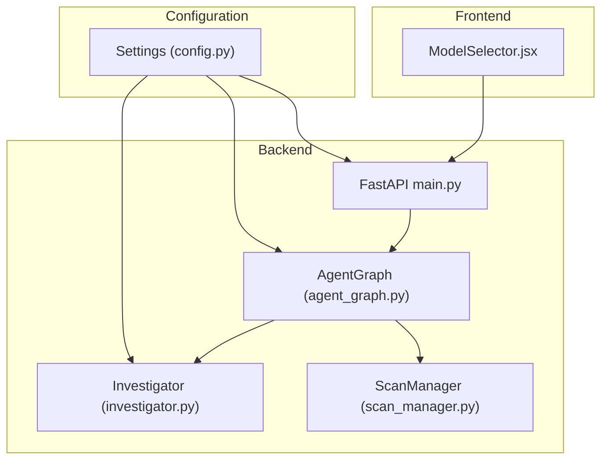
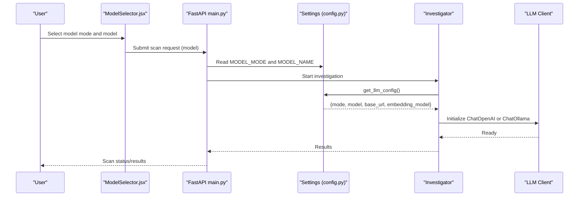
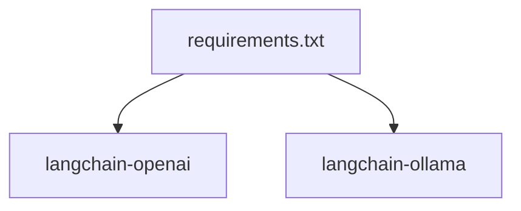

# LLM Provider Configuration

<cite>
**Referenced Files in This Document**
- [config.py](file://autopov/app/config.py)
- [main.py](file://autopov/app/main.py)
- [investigator.py](file://autopov/agents/investigator.py)
- [agent_graph.py](file://autopov/app/agent_graph.py)
- [scan_manager.py](file://autopov/app/scan_manager.py)
- [requirements.txt](file://autopov/requirements.txt)
- [README.md](file://autopov/README.md)
- [run.sh](file://autopov/run.sh)
- [ModelSelector.jsx](file://autopov/frontend/src/components/ModelSelector.jsx)
</cite>

## Update Summary
**Changes Made**
- Updated model catalog section to reflect current supported models (GPT-4o, Claude 3.5 Sonnet, Llama 3 70B, Mixtral 8x7B)
- Enhanced API key management documentation with OpenRouter authentication setup
- Expanded local model deployment section with Ollama configuration details
- Updated cost estimation methodology for online vs offline modes
- Added comprehensive troubleshooting section for model switching and connectivity issues
- Enhanced configuration examples for different deployment scenarios

## Table of Contents
1. [Introduction](#introduction)
2. [Project Structure](#project-structure)
3. [Core Components](#core-components)
4. [Architecture Overview](#architecture-overview)
5. [Detailed Component Analysis](#detailed-component-analysis)
6. [Dependency Analysis](#dependency-analysis)
7. [Performance Considerations](#performance-considerations)
8. [Troubleshooting Guide](#troubleshooting-guide)
9. [Conclusion](#conclusion)
10. [Appendices](#appendices)

## Introduction
This document explains how to configure and manage Large Language Model (LLM) providers in AutoPoV, focusing on dual-mode operation supporting both online (OpenRouter) and offline (Ollama) providers. It covers MODEL_MODE options, supported models, API key management, local deployment with Ollama, model selection criteria, configuration examples, switching procedures, fallback mechanisms, and troubleshooting connectivity issues.

## Project Structure
AutoPoV organizes LLM configuration centrally in the settings module and exposes model selection through the frontend UI. The backend orchestrates scans and integrates LLMs via LangChain components.

**Diagram sources**
- [config.py](file://autopov/app/config.py#L13-L209)
- [ModelSelector.jsx](file://autopov/frontend/src/components/ModelSelector.jsx#L1-L79)
- [main.py](file://autopov/app/main.py#L1-L528)
- [agent_graph.py](file://autopov/app/agent_graph.py#L1-L582)
- [investigator.py](file://autopov/agents/investigator.py#L1-L413)
- [scan_manager.py](file://autopov/app/scan_manager.py#L1-L344)

**Section sources**
- [config.py](file://autopov/app/config.py#L13-L209)
- [ModelSelector.jsx](file://autopov/frontend/src/components/ModelSelector.jsx#L1-L79)
- [main.py](file://autopov/app/main.py#L1-L528)

## Core Components
- Settings module defines environment-driven configuration for LLM providers, model mode, and model names.
- Frontend provides a model selector with online/offline toggle and model lists.
- Backend components integrate the selected LLM provider into the scanning workflow.

Key configuration highlights:
- MODEL_MODE: online or offline
- MODEL_NAME: defaults to a specific model; can be changed per scan
- Online provider: OpenRouter with configurable base URL and API key
- Offline provider: Ollama with configurable base URL
- Embedding models differ by mode for optimal performance

**Section sources**
- [config.py](file://autopov/app/config.py#L30-L49)
- [config.py](file://autopov/app/config.py#L173-L189)
- [ModelSelector.jsx](file://autopov/frontend/src/components/ModelSelector.jsx#L4-L17)

## Architecture Overview
AutoPoV supports two operational modes:
- Online mode: Uses OpenRouter API with ChatOpenAI
- Offline mode: Uses local Ollama with ChatOllama

The system validates MODEL_MODE and selects the appropriate LLM client at runtime. The frontend allows users to switch modes and select models.

**Diagram sources**
- [ModelSelector.jsx](file://autopov/frontend/src/components/ModelSelector.jsx#L1-L79)
- [main.py](file://autopov/app/main.py#L177-L316)
- [config.py](file://autopov/app/config.py#L173-L189)
- [investigator.py](file://autopov/agents/investigator.py#L50-L87)

## Detailed Component Analysis

### Settings and Configuration
- MODEL_MODE validation ensures only online or offline is accepted.
- get_llm_config returns provider-specific configuration including base URLs and model names.
- ONLINE_MODELS and OFFLINE_MODELS define supported model identifiers.

Operational implications:
- Online mode requires OPENROUTER_API_KEY and network connectivity.
- Offline mode requires Ollama service availability at OLLAMA_BASE_URL.

**Section sources**
- [config.py](file://autopov/app/config.py#L117-L121)
- [config.py](file://autopov/app/config.py#L173-L189)
- [config.py](file://autopov/app/config.py#L42-L49)

### Frontend Model Selector
- Provides a toggle between online and offline modes.
- Displays model options aligned with supported models.
- Shows guidance text indicating whether API key is required or if it uses local Ollama.

**Section sources**
- [ModelSelector.jsx](file://autopov/frontend/src/components/ModelSelector.jsx#L4-L17)
- [ModelSelector.jsx](file://autopov/frontend/src/components/ModelSelector.jsx#L68-L72)

### LLM Client Initialization
- Investigator dynamically initializes ChatOpenAI for online mode or ChatOllama for offline mode.
- Validates availability of required packages and configuration before initialization.
- Uses settings.LANGCHAIN_TRACING_V2 for optional tracing.

**Section sources**
- [investigator.py](file://autopov/agents/investigator.py#L50-L87)

### Agent Graph and Cost Estimation
- AgentGraph estimates costs differently for online vs offline modes.
- Online mode uses a time-based estimate; offline mode is zero-cost in estimation.
- MAX_RETRIES controls PoV validation attempts.

**Section sources**
- [agent_graph.py](file://autopov/app/agent_graph.py#L521-L531)
- [config.py](file://autopov/app/config.py#L86-L92)

### API Endpoints and Model Selection
- Scan endpoints accept a model parameter; defaults are set in request models.
- The selected model is passed to the scanning workflow.

**Section sources**
- [main.py](file://autopov/app/main.py#L29-L43)
- [main.py](file://autopov/app/main.py#L177-L316)

### Supported Models
- Online models: openai/gpt-4o, anthropic/claude-3.5-sonnet
- Offline models: llama3:70b, mixtral:8x7b

These align with the frontend model lists and configuration arrays.

**Section sources**
- [config.py](file://autopov/app/config.py#L42-L49)
- [ModelSelector.jsx](file://autopov/frontend/src/components/ModelSelector.jsx#L7-L15)

### Embedding Models by Mode
- Online embedding model: text-embedding-3-small
- Offline embedding model: sentence-transformers/all-MiniLM-L6-v2

These are chosen for performance and compatibility with each mode's stack.

**Section sources**
- [config.py](file://autopov/app/config.py#L65-L66)

## Dependency Analysis
AutoPoV depends on LangChain integrations for both providers:
- langchain-openai for OpenRouter
- langchain-ollama for Ollama

Requirements ensure these dependencies are present.

**Diagram sources**
- [requirements.txt](file://autopov/requirements.txt#L10-L14)

**Section sources**
- [requirements.txt](file://autopov/requirements.txt#L10-L14)

## Performance Considerations
- Online mode: Higher latency due to network calls; cost increases with inference time.
- Offline mode: Lower latency; resource usage depends on local hardware and model size.
- Embedding models differ by mode to balance quality and speed.
- MAX_RETRIES affects total runtime and cost in PoV validation loops.

## Troubleshooting Guide

### Connectivity Issues
- Verify MODEL_MODE correctness and that the selected provider is reachable.
- For online mode, confirm OPENROUTER_API_KEY is set and valid.
- For offline mode, ensure Ollama is running and accessible at OLLAMA_BASE_URL.

**Section sources**
- [config.py](file://autopov/app/config.py#L30-L35)
- [investigator.py](file://autopov/agents/investigator.py#L57-L76)

### Model Availability
- Online models must be available via OpenRouter.
- Offline models must be pulled locally in Ollama.

**Section sources**
- [README.md](file://autopov/README.md#L159-L167)

### Rate Limiting and Costs
- Online mode cost is estimated by inference time; monitor MAX_COST_USD.
- Consider reducing concurrency or increasing timeouts if rate-limited.

**Section sources**
- [agent_graph.py](file://autopov/app/agent_graph.py#L521-L531)
- [config.py](file://autopov/app/config.py#L86-L87)

### Local Deployment with Ollama
- Ensure Ollama is installed and running.
- Pull desired models (e.g., llama3:70b, mixtral:8x7b).
- Configure OLLAMA_BASE_URL if Ollama runs on a different host/port.

**Section sources**
- [README.md](file://autopov/README.md#L159-L167)
- [config.py](file://autopov/app/config.py#L35)

### Model Switching Procedures
- Change MODEL_MODE and MODEL_NAME in environment variables or pass model via API.
- Restart backend to apply new settings.

**Section sources**
- [config.py](file://autopov/app/config.py#L38-L39)
- [main.py](file://autopov/app/main.py#L177-L316)

### Fallback Mechanisms
- If CodeQL is unavailable, the workflow falls back to LLM-only analysis.
- If Ollama is unavailable, Investigator raises an error requiring langchain-ollama.

**Section sources**
- [agent_graph.py](file://autopov/app/agent_graph.py#L168-L173)
- [investigator.py](file://autopov/agents/investigator.py#L75-L76)

## Conclusion
AutoPoV's dual-mode LLM configuration enables flexible deployment across online and offline environments. By leveraging MODEL_MODE and MODEL_NAME, teams can optimize for performance, cost, and privacy. Proper configuration of API keys, local models, and resource limits ensures reliable operation across research, development, and production scenarios.

## Appendices

### Configuration Options Reference
- OPENROUTER_API_KEY: Required for online mode
- OLLAMA_BASE_URL: Base URL for local Ollama service
- MODEL_MODE: online or offline
- MODEL_NAME: Selected model identifier
- MAX_COST_USD: Cost cap for online mode
- LANGCHAIN_TRACING_V2: Enable tracing
- LANGCHAIN_API_KEY: Tracing API key
- LANGCHAIN_PROJECT: Tracing project name

**Section sources**
- [config.py](file://autopov/app/config.py#L30-L39)
- [config.py](file://autopov/app/config.py#L69-L71)
- [config.py](file://autopov/app/config.py#L86-L87)

### Supported Models Reference
- Online: openai/gpt-4o, anthropic/claude-3.5-sonnet
- Offline: llama3:70b, mixtral:8x7b

**Section sources**
- [config.py](file://autopov/app/config.py#L42-L49)
- [README.md](file://autopov/README.md#L159-L167)

### Environment Setup Example
- Copy .env.example to .env and set OPENROUTER_API_KEY for online mode.
- Set MODEL_MODE and MODEL_NAME as needed.
- For offline mode, ensure Ollama is running and models are pulled.

**Section sources**
- [run.sh](file://autopov/run.sh#L84-L90)
- [README.md](file://autopov/README.md#L69-L73)