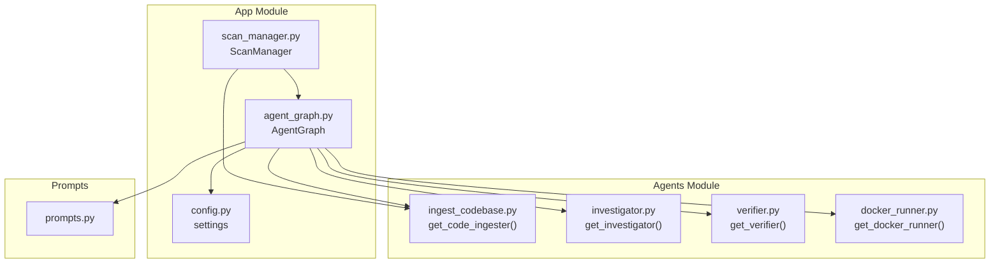
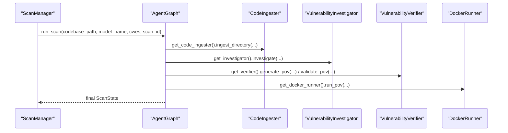
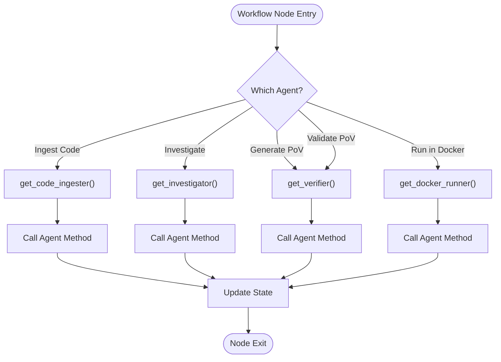
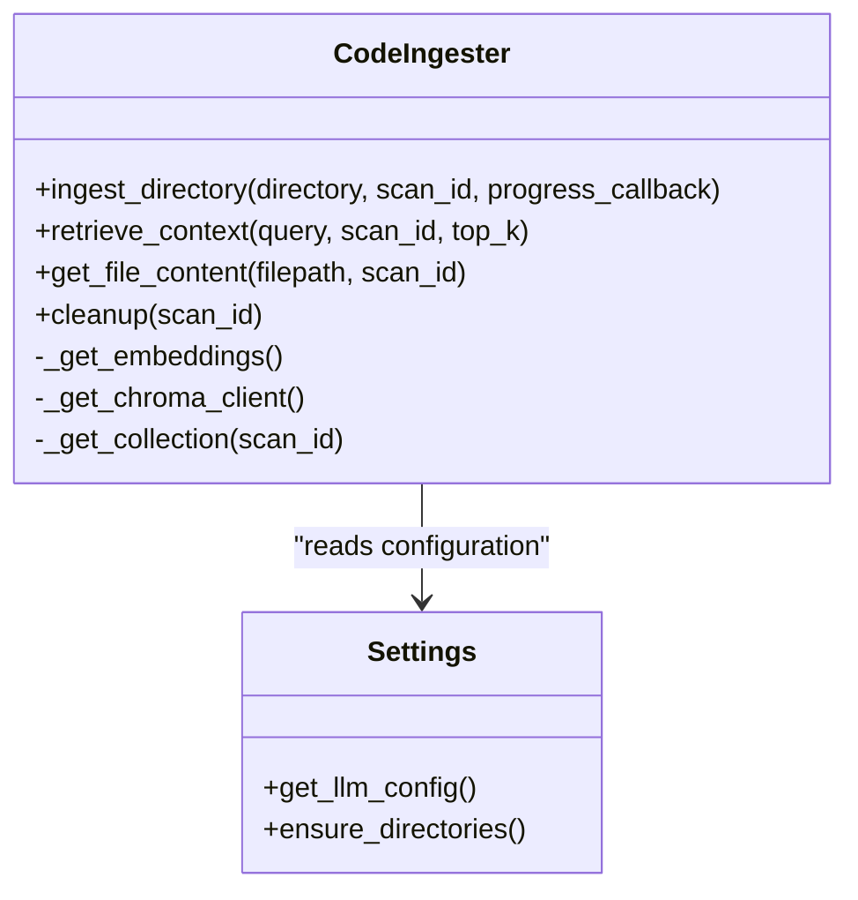
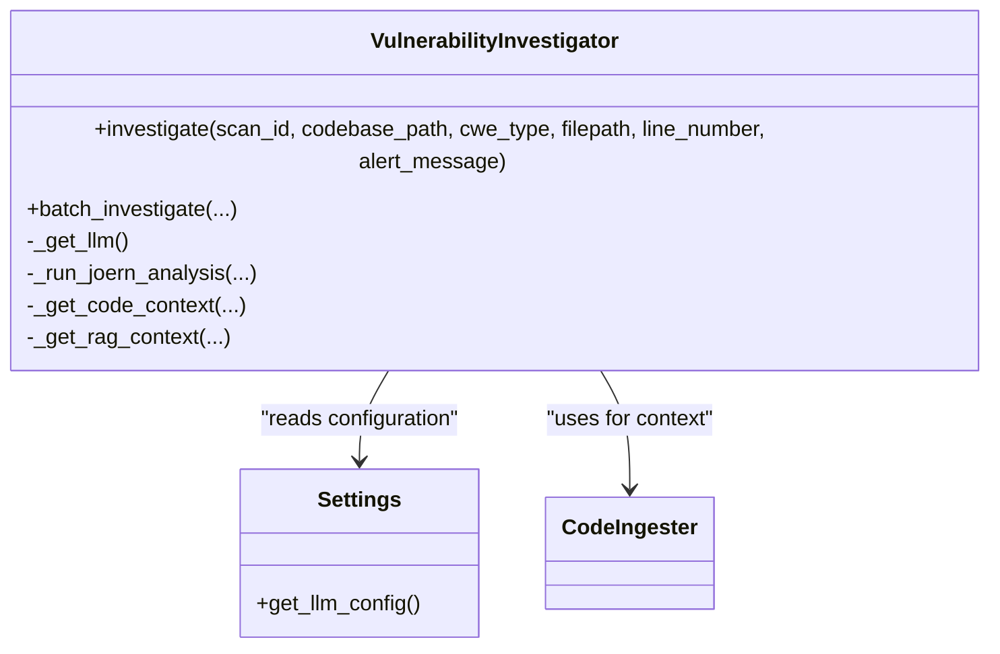
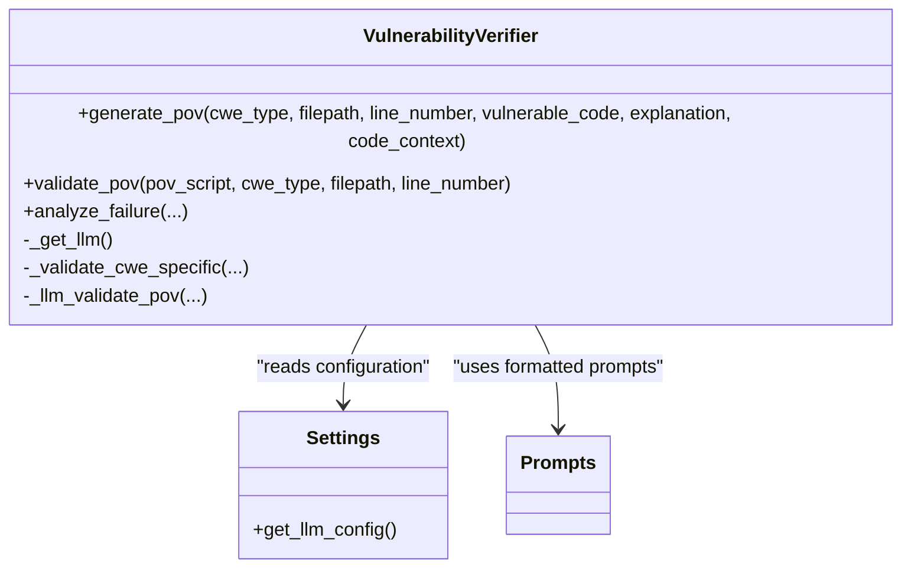
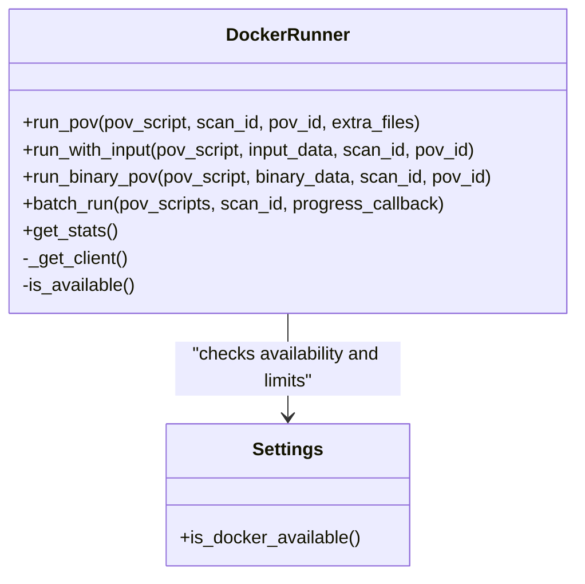
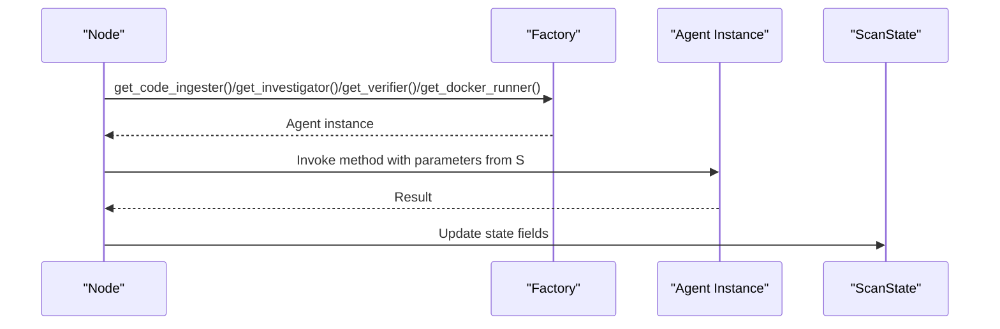
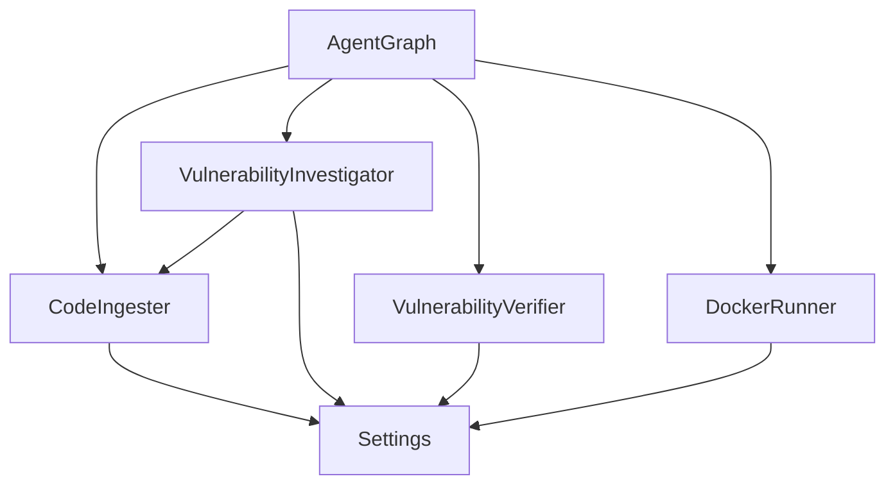

# Agent Factory Pattern and Dynamic Instantiation

<cite>
**Referenced Files in This Document**
- [agent_graph.py](file://autopov/app/agent_graph.py)
- [__init__.py](file://autopov/agents/__init__.py)
- [docker_runner.py](file://autopov/agents/docker_runner.py)
- [ingest_codebase.py](file://autopov/agents/ingest_codebase.py)
- [investigator.py](file://autopov/agents/investigator.py)
- [verifier.py](file://autopov/agents/verifier.py)
- [config.py](file://autopov/app/config.py)
- [scan_manager.py](file://autopov/app/scan_manager.py)
- [prompts.py](file://autopov/prompts.py)
</cite>

## Table of Contents
1. [Introduction](#introduction)
2. [Project Structure](#project-structure)
3. [Core Components](#core-components)
4. [Architecture Overview](#architecture-overview)
5. [Detailed Component Analysis](#detailed-component-analysis)
6. [Dependency Analysis](#dependency-analysis)
7. [Performance Considerations](#performance-considerations)
8. [Troubleshooting Guide](#troubleshooting-guide)
9. [Conclusion](#conclusion)

## Introduction
This document explains AutoPoV’s agent factory pattern implementation centered on dynamic agent instantiation via dedicated factory functions. The AgentGraph orchestrates a LangGraph-based workflow and uses factory methods to instantiate specialized agents on demand: get_code_ingester(), get_investigator(), get_verifier(), and get_docker_runner(). These factories encapsulate agent creation, configuration, and resource sharing, enabling modular, testable, and extensible workflows. The document details how agents are instantiated and configured within the workflow context, how the orchestrator delegates to specialized agents, and how configuration and dependency injection are managed through the factory pattern.

## Project Structure
AutoPoV organizes agent-related logic under autopov/agents and workflow orchestration under autopov/app. The agents module exposes factory functions that return singleton instances of specialized agents. The AgentGraph composes these agents into a stateful workflow, while the ScanManager coordinates lifecycle and persistence.

**Diagram sources**
- [agent_graph.py](file://autopov/app/agent_graph.py#L22-L26)
- [__init__.py](file://autopov/agents/__init__.py#L6-L19)
- [config.py](file://autopov/app/config.py#L13-L210)
- [scan_manager.py](file://autopov/app/scan_manager.py#L16-L18)

**Section sources**
- [agent_graph.py](file://autopov/app/agent_graph.py#L22-L26)
- [__init__.py](file://autopov/agents/__init__.py#L6-L19)
- [config.py](file://autopov/app/config.py#L13-L210)
- [scan_manager.py](file://autopov/app/scan_manager.py#L16-L18)

## Core Components
- AgentGraph: Orchestrates the vulnerability detection workflow using LangGraph. It defines nodes and conditional edges, and invokes specialized agents via factory functions to perform ingestion, investigation, PoV generation/validation, and containerized execution.
- Agents: Specialized components with factory functions:
  - get_code_ingester(): Provides code chunking, embedding, and ChromaDB storage.
  - get_investigator(): Performs vulnerability investigation using LLMs and RAG.
  - get_verifier(): Generates and validates Proof-of-Vulnerability scripts.
  - get_docker_runner(): Executes PoV scripts in isolated Docker containers.
- Configuration: Centralized settings via settings that influence agent behavior and availability.
- Lifecycle Management: ScanManager coordinates scan creation, execution, persistence, and cleanup.

Benefits of the factory pattern:
- Modularity: Each agent encapsulates distinct capabilities and can evolve independently.
- Testability: Factories return singletons, enabling controlled mocking and testing.
- Resource Sharing: Agents share configuration and persistent resources (e.g., vector stores) via shared settings and singleton instances.
- Separation of Concerns: The orchestrator delegates domain-specific tasks to specialized agents.

**Section sources**
- [agent_graph.py](file://autopov/app/agent_graph.py#L78-L135)
- [__init__.py](file://autopov/agents/__init__.py#L6-L19)
- [config.py](file://autopov/app/config.py#L13-L210)
- [scan_manager.py](file://autopov/app/scan_manager.py#L40-L200)

## Architecture Overview
The AgentGraph composes four specialized agents through factory functions. Each node in the workflow calls a factory to obtain an agent instance, passing contextual parameters derived from the shared ScanState. Configuration is injected via settings, and agents share persistent resources (e.g., vector collections) across invocations.

**Diagram sources**
- [agent_graph.py](file://autopov/app/agent_graph.py#L136-L433)
- [scan_manager.py](file://autopov/app/scan_manager.py#L86-L175)
- [ingest_codebase.py](file://autopov/agents/ingest_codebase.py#L201-L307)
- [investigator.py](file://autopov/agents/investigator.py#L254-L365)
- [verifier.py](file://autopov/agents/verifier.py#L79-L149)
- [docker_runner.py](file://autopov/agents/docker_runner.py#L62-L191)

## Detailed Component Analysis

### AgentGraph and Factory Usage
AgentGraph defines workflow nodes and uses factory functions to obtain agent instances:
- Ingestion node obtains a CodeIngester to process codebases and populate vector stores.
- Investigation node obtains a VulnerabilityInvestigator to analyze findings.
- PoV generation and validation nodes obtain a VulnerabilityVerifier to create and vet PoV scripts.
- Docker execution node obtains a DockerRunner to execute PoVs in isolation.

These factories enable:
- On-demand instantiation with shared configuration.
- Consistent agent initialization across workflow steps.
- Easy substitution of agent implementations.

**Diagram sources**
- [agent_graph.py](file://autopov/app/agent_graph.py#L136-L433)
- [__init__.py](file://autopov/agents/__init__.py#L6-L19)

**Section sources**
- [agent_graph.py](file://autopov/app/agent_graph.py#L136-L433)
- [__init__.py](file://autopov/agents/__init__.py#L6-L19)

### Code Ingester Factory
The CodeIngester factory returns a singleton instance configured via settings:
- Embedding model selection based on online/offline mode.
- ChromaDB client and collection management per scan.
- File filtering, chunking, and batched embedding insertion.
- Retrieval and file content lookup for downstream agents.

Lifecycle and resource sharing:
- Embeddings and ChromaDB clients are lazily initialized and reused.
- Collections are scoped per scan to isolate data and enable cleanup.

**Diagram sources**
- [ingest_codebase.py](file://autopov/agents/ingest_codebase.py#L41-L406)
- [config.py](file://autopov/app/config.py#L173-L189)

**Section sources**
- [ingest_codebase.py](file://autopov/agents/ingest_codebase.py#L41-L406)
- [config.py](file://autopov/app/config.py#L173-L189)

### Vulnerability Investigator Factory
The VulnerabilityInvestigator factory returns a singleton instance:
- LLM selection based on settings (online or offline).
- Optional tracing integration.
- Joern analysis for specific CWEs.
- RAG-backed context retrieval and prompt formatting.

Resource sharing:
- Reuses LLM instance and tracer across invocations.
- Leverages CodeIngester for context retrieval.

**Diagram sources**
- [investigator.py](file://autopov/agents/investigator.py#L37-L412)
- [config.py](file://autopov/app/config.py#L173-L189)
- [prompts.py](file://autopov/prompts.py#L245-L342)

**Section sources**
- [investigator.py](file://autopov/agents/investigator.py#L37-L412)
- [prompts.py](file://autopov/prompts.py#L245-L342)

### Vulnerability Verifier Factory
The VulnerabilityVerifier factory returns a singleton instance:
- LLM selection for PoV generation and validation.
- AST-based validation and CWE-specific checks.
- LLM-assisted validation and failure analysis.

Resource sharing:
- Reuses LLM instance across invocations.
- Uses prompts module for standardized templates.

**Diagram sources**
- [verifier.py](file://autopov/agents/verifier.py#L40-L400)
- [config.py](file://autopov/app/config.py#L173-L189)
- [prompts.py](file://autopov/prompts.py#L264-L342)

**Section sources**
- [verifier.py](file://autopov/agents/verifier.py#L40-L400)
- [prompts.py](file://autopov/prompts.py#L264-L342)

### Docker Runner Factory
The DockerRunner factory returns a singleton instance:
- Docker client initialization and availability checks.
- Secure container execution with resource limits and no network access.
- Batch execution and statistics reporting.

Resource sharing:
- Shares Docker client across runs.
- Manages temporary directories and cleanup.

**Diagram sources**
- [docker_runner.py](file://autopov/agents/docker_runner.py#L27-L378)
- [config.py](file://autopov/app/config.py#L123-L135)

**Section sources**
- [docker_runner.py](file://autopov/agents/docker_runner.py#L27-L378)
- [config.py](file://autopov/app/config.py#L123-L135)

### Workflow Nodes and Agent Instantiation
Each workflow node obtains agents via factory functions and passes context-derived parameters:
- Ingestion node: CodeIngester ingests codebase and populates vector store.
- Investigation node: VulnerabilityInvestigator analyzes findings and enriches state.
- PoV generation node: VulnerabilityVerifier generates PoV scripts using CodeIngester-provided context.
- PoV validation node: VulnerabilityVerifier validates PoVs and tracks retry counts.
- Docker execution node: DockerRunner executes PoVs in containers and records outcomes.

**Diagram sources**
- [agent_graph.py](file://autopov/app/agent_graph.py#L136-L433)
- [__init__.py](file://autopov/agents/__init__.py#L6-L19)

**Section sources**
- [agent_graph.py](file://autopov/app/agent_graph.py#L136-L433)
- [__init__.py](file://autopov/agents/__init__.py#L6-L19)

### Configuration Management and Dependency Injection
Configuration is centralized in settings and consumed by agents:
- LLM selection and credentials for online/offline modes.
- Tool availability checks (Docker, CodeQL, Joern).
- Vector store and runtime parameters (paths, limits).
- Directory provisioning and persistence.

Factories rely on settings to configure agent behavior without hardcoding environment-specific values.

**Section sources**
- [config.py](file://autopov/app/config.py#L13-L210)
- [ingest_codebase.py](file://autopov/agents/ingest_codebase.py#L60-L88)
- [investigator.py](file://autopov/agents/investigator.py#L50-L87)
- [verifier.py](file://autopov/agents/verifier.py#L46-L77)
- [docker_runner.py](file://autopov/agents/docker_runner.py#L30-L36)

### Extensibility Benefits
Adding new agent types follows the established pattern:
- Implement a new agent class with a corresponding factory function returning a singleton.
- Export the factory in agents/__init__.py.
- Integrate the new agent into AgentGraph nodes by invoking the factory and passing context-derived parameters.
- Optionally, add configuration fields to settings and consume them in the agent’s initialization.

This approach preserves modularity, testability, and consistent dependency injection.

**Section sources**
- [__init__.py](file://autopov/agents/__init__.py#L6-L19)
- [agent_graph.py](file://autopov/app/agent_graph.py#L78-L135)

## Dependency Analysis
The AgentGraph depends on agent factories and configuration, while agents depend on settings and each other indirectly (e.g., investigator uses CodeIngester). Factories centralize initialization and configuration, reducing coupling and enabling easy substitution.

**Diagram sources**
- [agent_graph.py](file://autopov/app/agent_graph.py#L22-L26)
- [ingest_codebase.py](file://autopov/agents/ingest_codebase.py#L41-L59)
- [investigator.py](file://autopov/agents/investigator.py#L37-L43)
- [verifier.py](file://autopov/agents/verifier.py#L40-L45)
- [docker_runner.py](file://autopov/agents/docker_runner.py#L27-L36)
- [config.py](file://autopov/app/config.py#L13-L210)

**Section sources**
- [agent_graph.py](file://autopov/app/agent_graph.py#L22-L26)
- [config.py](file://autopov/app/config.py#L13-L210)

## Performance Considerations
- Lazy initialization: Agents initialize expensive resources (e.g., embeddings, Docker client) only when needed.
- Singleton reuse: Factories return singletons, avoiding repeated initialization overhead.
- Batch operations: Code ingestion writes embeddings in batches to reduce I/O overhead.
- Resource limits: DockerRunner enforces CPU/memory limits and timeouts to prevent runaway executions.
- Conditional edges: AgentGraph avoids unnecessary PoV generation/validation for low-confidence findings.

[No sources needed since this section provides general guidance]

## Troubleshooting Guide
Common issues and diagnostics:
- Missing dependencies: Availability checks for Docker, CodeQL, and Joern are handled via settings. If unavailable, fallbacks occur (e.g., LLM-only analysis).
- Vector store errors: CodeIngester raises explicit exceptions when ChromaDB or embeddings are missing; ensure required packages are installed and configured.
- Docker failures: DockerRunner returns structured results indicating success, exit codes, and captured logs/stderr.
- LLM configuration: Investigator and Verifier raise exceptions if required credentials or providers are missing; verify environment variables and model mode.

Operational tips:
- Monitor logs emitted by AgentGraph nodes for actionable insights.
- Inspect ScanState fields for error messages and timestamps.
- Use DockerRunner.get_stats() to verify container runtime configuration.

**Section sources**
- [config.py](file://autopov/app/config.py#L123-L171)
- [ingest_codebase.py](file://autopov/agents/ingest_codebase.py#L36-L38)
- [docker_runner.py](file://autopov/agents/docker_runner.py#L22-L24)
- [investigator.py](file://autopov/agents/investigator.py#L32-L34)
- [verifier.py](file://autopov/agents/verifier.py#L35-L37)

## Conclusion
AutoPoV’s agent factory pattern enables a clean separation of concerns, robust modularity, and strong testability. AgentGraph dynamically instantiates specialized agents through well-defined factories, allowing seamless integration of ingestion, investigation, PoV generation/validation, and containerized execution. Configuration is centralized and injected consistently, while agents share resources efficiently. This design supports extensibility, maintainability, and reliable operation across diverse environments.