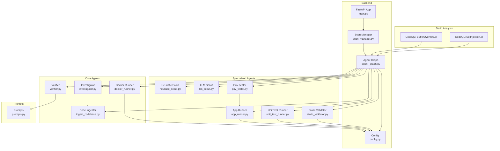
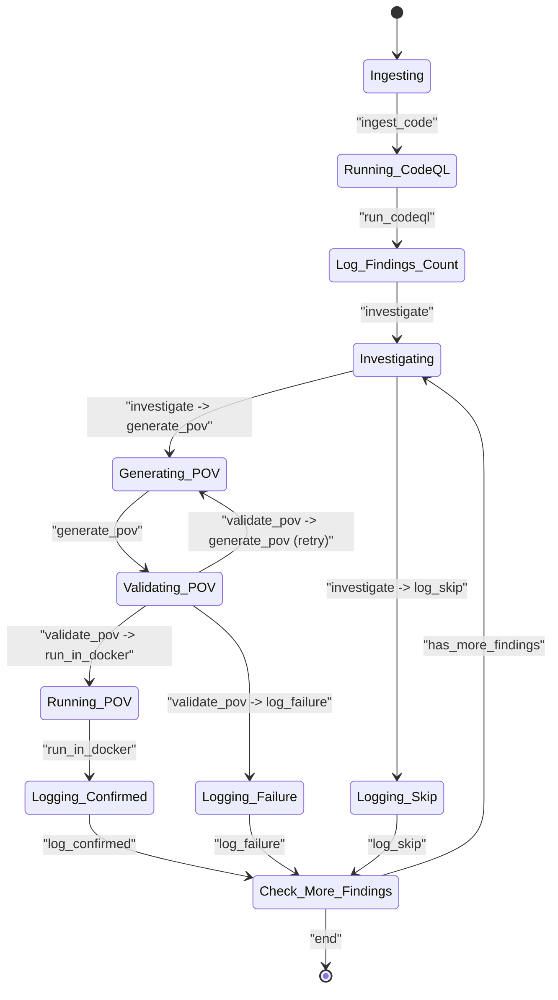
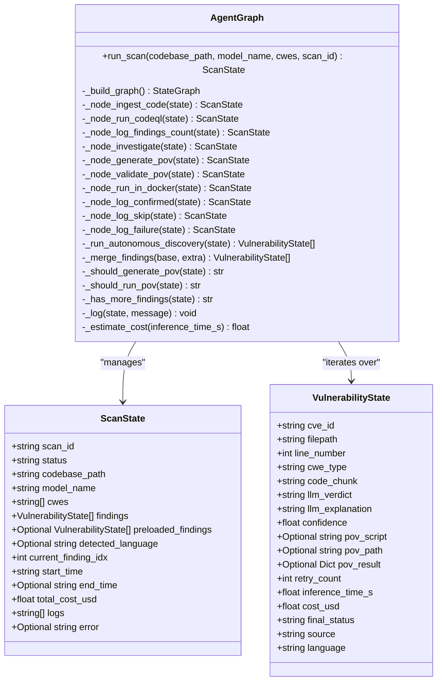
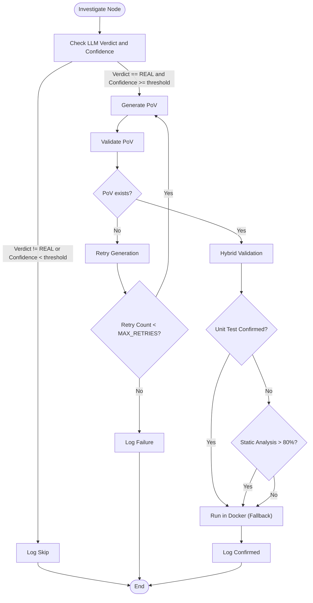
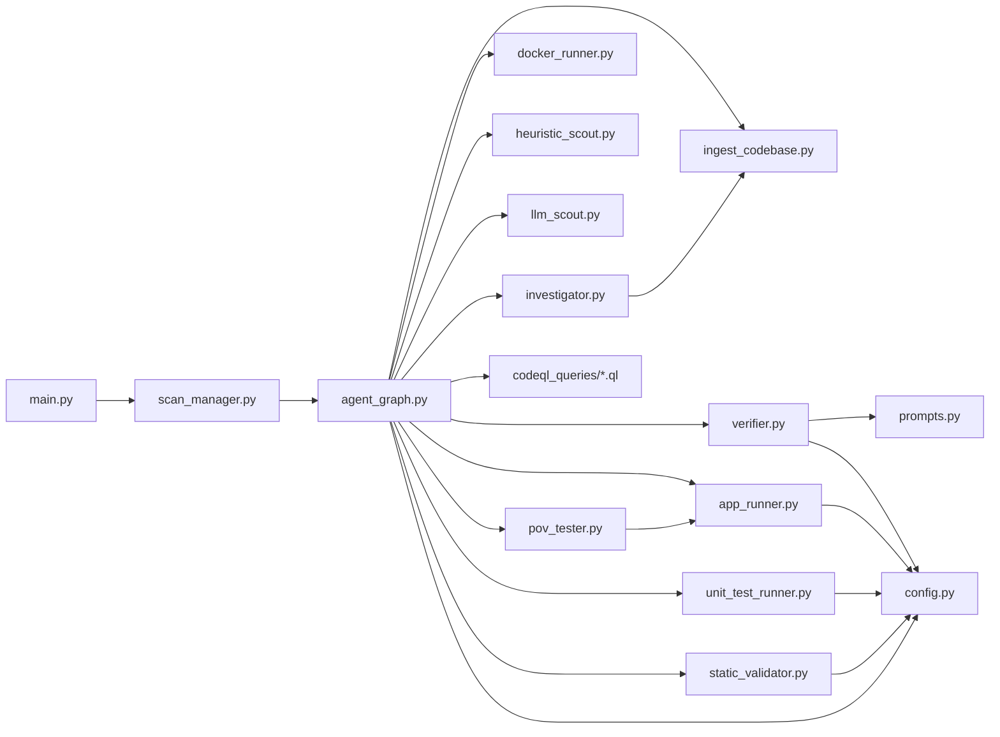

# Agent-Based Workflow System

<cite>
**Referenced Files in This Document**
- [agent_graph.py](file://app/agent_graph.py)
- [main.py](file://app/main.py)
- [config.py](file://app/config.py)
- [ingest_codebase.py](file://agents/ingest_codebase.py)
- [investigator.py](file://agents/investigator.py)
- [verifier.py](file://agents/verifier.py)
- [docker_runner.py](file://agents/docker_runner.py)
- [pov_tester.py](file://agents/pov_tester.py)
- [app_runner.py](file://agents/app_runner.py)
- [unit_test_runner.py](file://agents/unit_test_runner.py)
- [static_validator.py](file://agents/static_validator.py)
- [heuristic_scout.py](file://agents/heuristic_scout.py)
- [llm_scout.py](file://agents/llm_scout.py)
- [prompts.py](file://prompts.py)
- [README.md](file://README.md)
- [BufferOverflow.ql](file://codeql_queries/BufferOverflow.ql)
- [SqlInjection.ql](file://codeql_queries/SqlInjection.ql)
</cite>

## Update Summary
**Changes Made**
- Enhanced workflow orchestration with expanded agent graph containing 1,102 lines of sophisticated state machine architecture
- Added comprehensive LangGraph-based conditional routing with intelligent decision-making capabilities
- Implemented multi-stage vulnerability investigation workflows with enhanced validation logic
- Integrated advanced retry mechanisms with configurable MAX_RETRIES (set to 2)
- Added sophisticated PoV validation workflows combining static analysis, unit testing, and Docker execution
- Enhanced autonomous discovery agents with configurable resource limits and cost controls
- Implemented comprehensive application lifecycle management with PoV testing capabilities
- Added intelligent fallback mechanisms for CodeQL unavailability and LLM-only analysis
- Enhanced state management with detailed logging and observability features

## Table of Contents
1. [Introduction](#introduction)
2. [Project Structure](#project-structure)
3. [Core Components](#core-components)
4. [Architecture Overview](#architecture-overview)
5. [Detailed Component Analysis](#detailed-component-analysis)
6. [Dependency Analysis](#dependency-analysis)
7. [Performance Considerations](#performance-considerations)
8. [Troubleshooting Guide](#troubleshooting-guide)
9. [Conclusion](#conclusion)
10. [Appendices](#appendices)

## Introduction
This document explains AutoPoV's agent-based workflow system built on LangGraph. The system orchestrates a sophisticated nine-node workflow to detect, investigate, and validate vulnerabilities, culminating in Proof-of-Vulnerability (PoV) generation and execution. It integrates static analysis (CodeQL), semantic analysis (LLMs), autonomous discovery agents, and comprehensive validation workflows including static analysis, unit testing, and Docker execution to form a robust, configurable pipeline. The AgentGraph class defines a state machine with typed state models, dynamic agent instantiation via factory functions, and conditional edges that decide whether to generate PoVs or skip findings.

**Updated** The system has evolved from a simple sequential processing system to a sophisticated LangGraph-based workflow engine with enhanced PoV generation loop featuring 1,102 lines of workflow improvements, including sophisticated retry logic, configurable maximum attempts (MAX_RETRIES=2), proper state transitions, and comprehensive error handling throughout the vulnerability verification pipeline. The workflow now includes dedicated nodes for application lifecycle management, PoV validation workflows, and enhanced Docker execution integration.

## Project Structure
AutoPoV organizes its backend around a FastAPI application, a LangGraph-based orchestrator, and specialized agent modules for ingestion, investigation, verification, autonomous discovery, and execution. The frontend and CLI complement the backend with user interfaces and automation.

**Diagram sources**
- [main.py:114-122](file://app/main.py#L114-L122)
- [agent_graph.py:91-171](file://app/agent_graph.py#L91-L171)
- [ingest_codebase.py:41-60](file://agents/ingest_codebase.py#L41-L60)
- [investigator.py:37-50](file://agents/investigator.py#L37-L50)
- [verifier.py:40-50](file://agents/verifier.py#L40-L50)
- [docker_runner.py:27-40](file://agents/docker_runner.py#L27-L40)
- [heuristic_scout.py:13-122](file://agents/heuristic_scout.py#L13-L122)
- [llm_scout.py:32-207](file://agents/llm_scout.py#L32-L207)
- [pov_tester.py:21-296](file://agents/pov_tester.py#L21-L296)
- [app_runner.py:19-200](file://agents/app_runner.py#L19-L200)
- [unit_test_runner.py:28-339](file://agents/unit_test_runner.py#L28-L339)
- [static_validator.py:22-305](file://agents/static_validator.py#L22-L305)
- [prompts.py:7-210](file://prompts.py#L7-L210)
- [BufferOverflow.ql:1-59](file://codeql_queries/BufferOverflow.ql#L1-L59)
- [SqlInjection.ql:1-67](file://codeql_queries/SqlInjection.ql#L1-L67)

**Section sources**
- [README.md:17-35](file://README.md#L17-L35)
- [main.py:114-122](file://app/main.py#L114-L122)

## Core Components
- **AgentGraph**: Defines the LangGraph workflow, state models, and node implementations. It exposes a typed state machine with ScanState and VulnerabilityState, and implements the nine-node workflow plus logging nodes including autonomous discovery and enhanced validation.
- **Specialized Agents**:
  - **CodeIngester**: Handles code chunking, embedding, and ChromaDB storage.
  - **VulnerabilityInvestigator**: Uses LLMs and RAG to assess findings.
  - **VulnerabilityVerifier**: Generates and validates PoV scripts with sophisticated retry analysis.
  - **DockerRunner**: Executes PoV scripts in isolated containers.
  - **PoVTester**: Tests PoV scripts against running applications with lifecycle management.
  - **ApplicationRunner**: Manages target application lifecycle for PoV testing.
  - **UnitTestRunner**: Runs PoV scripts against isolated vulnerable code snippets.
  - **StaticValidator**: Validates PoV scripts using static code analysis.
  - **HeuristicScout**: Lightweight pattern matching for candidate discovery.
  - **LLMScout**: LLM-based candidate discovery across files.
- **Configuration**: Centralized settings for models, tools, and runtime behavior including MAX_RETRIES for configurable retry attempts.
- **Prompts**: Structured templates for investigation, PoV generation/validation, and retry analysis.

**Updated** The AgentGraph now contains 1,102 lines of sophisticated state machine architecture with comprehensive conditional routing logic and enhanced retry mechanisms supporting up to MAX_RETRIES=2 configurable attempts. The system now includes specialized agents for autonomous discovery, application lifecycle management, and comprehensive validation workflows.

**Section sources**
- [agent_graph.py:91-171](file://app/agent_graph.py#L91-L171)
- [ingest_codebase.py:41-60](file://agents/ingest_codebase.py#L41-L60)
- [investigator.py:37-50](file://agents/investigator.py#L37-L50)
- [verifier.py:40-50](file://agents/verifier.py#L40-L50)
- [docker_runner.py:27-40](file://agents/docker_runner.py#L27-L40)
- [pov_tester.py:21-296](file://agents/pov_tester.py#L21-L296)
- [app_runner.py:19-200](file://agents/app_runner.py#L19-L200)
- [unit_test_runner.py:28-339](file://agents/unit_test_runner.py#L28-L339)
- [static_validator.py:22-305](file://agents/static_validator.py#L22-L305)
- [heuristic_scout.py:13-122](file://agents/heuristic_scout.py#L13-L122)
- [llm_scout.py:32-207](file://agents/llm_scout.py#L32-L207)
- [config.py:13-120](file://app/config.py#L13-L120)
- [prompts.py:7-210](file://prompts.py#L7-L210)

## Architecture Overview
The workflow is a state machine orchestrated by AgentGraph. It progresses from ingestion to autonomous discovery, static analysis, investigation, PoV generation and validation, and optional Docker execution. Conditional edges govern decision-making: whether to generate PoVs based on LLM confidence, and whether to rerun or skip after validation failures with sophisticated retry logic.

**Updated** The workflow now consists of nine distinct nodes: ingest_code, run_codeql, log_findings_count, investigate, generate_pov, validate_pov, run_in_docker, plus three logging nodes (log_confirmed, log_skip, log_failure). The validate_pov node now includes sophisticated retry logic with configurable MAX_RETRIES=2 and comprehensive error handling. The workflow includes autonomous discovery through heuristic and LLM scouts.

**Diagram sources**
- [agent_graph.py:91-171](file://app/agent_graph.py#L91-L171)
- [agent_graph.py:944-994](file://app/agent_graph.py#L944-L994)

## Detailed Component Analysis

### AgentGraph: State Machine and Nodes
AgentGraph encapsulates the orchestration logic:
- **State Models**:
  - **ScanStatus**: Enumerates workflow stages including pending, ingesting, running_codeql, investigating, generating_pov, validating_pov, running_pov, completed, failed, skipped.
  - **VulnerabilityState**: Per-finding state (paths, PoV artifacts, costs, retry_count).
  - **ScanState**: Top-level scan state (findings, progress, logs).
- **Nodes**:
  - **ingest_code**: Ingest codebase into vector store.
  - **run_codeql**: Run CodeQL queries or fallback to autonomous discovery.
  - **log_findings_count**: Log the number of findings found before investigation.
  - **investigate**: LLM-based vulnerability assessment.
  - **generate_pov**: Generate PoV script.
  - **validate_pov**: Validate PoV script with hybrid static analysis and unit testing.
  - **run_in_docker**: Execute PoV in Docker with fallback mechanisms.
  - **log_confirmed/skip/failure**: Terminal/log nodes.
- **Edges**:
  - Linear progression from ingestion to investigation.
  - Conditional edges from investigate to generate_pov or log_skip.
  - Conditional edges from validate_pov to run_in_docker, generate_pov (retry), or log_failure.
  - Terminal edges to END.

**Updated** The AgentGraph now contains 1,102 lines of sophisticated state machine architecture with comprehensive conditional routing logic, detailed state management including retry_count, enhanced error handling capabilities, and autonomous discovery integration.

**Diagram sources**
- [agent_graph.py:34-83](file://app/agent_graph.py#L34-L83)
- [agent_graph.py:91-171](file://app/agent_graph.py#L91-L171)

**Section sources**
- [agent_graph.py:34-83](file://app/agent_graph.py#L34-L83)
- [agent_graph.py:91-171](file://app/agent_graph.py#L91-L171)
- [agent_graph.py:944-994](file://app/agent_graph.py#L944-L994)

### Autonomous Discovery Agents
The system now includes two specialized agents for autonomous vulnerability discovery:
- **HeuristicScout**: Lightweight pattern matching for candidate discovery across supported CWEs.
- **LLMScout**: LLM-based candidate discovery that analyzes file snippets to propose vulnerabilities.

Responsibilities:
- HeuristicScout scans codebases using predefined patterns for SQL injection, buffer overflow, integer overflow, and use-after-free vulnerabilities.
- LLMScout extracts file snippets, builds prompts, and uses LLMs to propose candidate vulnerabilities with confidence scores.
- Both agents integrate seamlessly with the main workflow and merge findings with CodeQL results.

Integration points:
- Called by run_codeql node when CodeQL is unavailable or as supplementary discovery.
- Results are merged and deduplicated based on filepath, line number, and CWE type.

**Section sources**
- [heuristic_scout.py:13-122](file://agents/heuristic_scout.py#L13-L122)
- [llm_scout.py:32-207](file://agents/llm_scout.py#L32-L207)
- [agent_graph.py:208-242](file://app/agent_graph.py#L208-L242)

### Enhanced Validation Workflow
The validation workflow now includes comprehensive validation through multiple approaches:
- **StaticValidator**: Validates PoV scripts using static code analysis with CWE-specific patterns.
- **UnitTestRunner**: Runs PoV scripts against isolated vulnerable code snippets in unit test style.
- **Hybrid Approach**: Combines static analysis, unit testing, and Docker execution for maximum reliability.

Responsibilities:
- StaticValidator checks for required imports, attack patterns, and payload indicators specific to each CWE.
- UnitTestRunner creates test harnesses to execute PoV scripts against vulnerable code in isolation.
- Hybrid validation prioritizes unit test results, then static analysis confidence, then Docker execution.

Integration points:
- Called by validate_pov node with sophisticated fallback mechanisms.
- Results are stored in validation_result field for later use in run_in_docker node.

**Updated** The validation workflow now includes comprehensive static analysis, unit testing, and hybrid validation approaches with sophisticated fallback mechanisms and enhanced error handling.

**Section sources**
- [static_validator.py:22-305](file://agents/static_validator.py#L22-L305)
- [unit_test_runner.py:28-339](file://agents/unit_test_runner.py#L28-L339)
- [agent_graph.py:727-788](file://app/agent_graph.py#L727-L788)

### Application Lifecycle Management
The system now includes comprehensive application lifecycle management for PoV testing:
- **PoVTester**: Tests PoV scripts against running applications with URL patching and language-specific execution.
- **ApplicationRunner**: Manages target application lifecycle including dependency installation, startup, monitoring, and shutdown.

Responsibilities:
- PoVTester patches PoV scripts to use the correct target URL and executes them against running applications.
- ApplicationRunner installs dependencies, starts applications, monitors health, and ensures proper cleanup.
- Full lifecycle testing: start app → test PoV → stop app.

Integration points:
- Called by run_in_docker node when unit test and static validation are inconclusive.
- Provides comprehensive application management for PoV testing scenarios.

**Updated** The application lifecycle management includes sophisticated URL patching, dependency management, and comprehensive application lifecycle control for PoV testing.

**Section sources**
- [pov_tester.py:21-296](file://agents/pov_tester.py#L21-L296)
- [app_runner.py:19-200](file://agents/app_runner.py#L19-L200)
- [agent_graph.py:790-889](file://app/agent_graph.py#L790-L889)

### Code Ingestion (CodeIngester)
Responsibilities:
- Chunk code with RecursiveCharacterTextSplitter.
- Embeddings via OpenAI or HuggingFace depending on settings.
- Persist chunks to ChromaDB with per-scan collections.
- Retrieve context for RAG and fetch full file content.

Integration points:
- Used by investigate node to retrieve context and by generate_pov to fetch code context.

**Section sources**
- [ingest_codebase.py:41-116](file://agents/ingest_codebase.py#L41-L116)
- [ingest_codebase.py:201-307](file://agents/ingest_codebase.py#L201-L307)
- [ingest_codebase.py:309-386](file://agents/ingest_codebase.py#L309-L386)

### Investigation (VulnerabilityInvestigator)
Responsibilities:
- Build LLM instances (OpenAI or Ollama) based on settings.
- Retrieve code context from ChromaDB or via RAG.
- Optionally run Joern for CWE-416 (Use After Free) to enrich context.
- Call LLM with structured prompts to produce a vulnerability assessment.

Integration points:
- Called by investigate node with scan_id, filepath, and line_number.

**Section sources**
- [investigator.py:37-87](file://agents/investigator.py#L37-L87)
- [investigator.py:186-234](file://agents/investigator.py#L186-L234)
- [investigator.py:254-366](file://agents/investigator.py#L254-L366)

### Verification (VulnerabilityVerifier)
Responsibilities:
- Generate PoV scripts using LLM with structured prompts.
- Validate PoVs via AST parsing, standard library checks, CWE-specific rules, and optional LLM review.
- Provide retry analysis to improve failed PoVs with configurable maximum attempts.
- Enhanced validation includes comprehensive error detection and suggestions.

Integration points:
- Called by generate_pov and validate_pov nodes with sophisticated retry mechanisms.

**Updated** The verifier now includes enhanced retry analysis functionality with LLM-powered failure diagnostics, allowing for intelligent improvement suggestions based on execution output and validation failures.

**Section sources**
- [verifier.py:40-77](file://agents/verifier.py#L40-L77)
- [verifier.py:79-149](file://agents/verifier.py#L79-L149)
- [verifier.py:151-227](file://agents/verifier.py#L151-L227)
- [verifier.py:492-551](file://agents/verifier.py#L492-L551)

### Docker Execution (DockerRunner)
Responsibilities:
- Run PoV scripts in isolated Docker containers with resource limits and timeouts.
- Capture stdout/stderr and determine if "VULNERABILITY TRIGGERED" was printed.
- Provide batch execution and statistics.

Integration points:
- Called by run_in_docker node.

**Section sources**
- [docker_runner.py:27-48](file://agents/docker_runner.py#L27-L48)
- [docker_runner.py:62-192](file://agents/docker_runner.py#L62-L192)
- [docker_runner.py:313-344](file://agents/docker_runner.py#L313-L344)

### Static Analysis (CodeQL)
Responsibilities:
- Run CodeQL queries for supported CWEs (Buffer Overflow, SQL Injection).
- Create CodeQL databases and parse results into VulnerabilityState entries.
- Fallback to LLM-only analysis when CodeQL is unavailable.
- Enhanced fallback includes autonomous discovery integration.

Integration points:
- Called by run_codeql node.

**Section sources**
- [agent_graph.py:243-310](file://app/agent_graph.py#L243-L310)
- [BufferOverflow.ql:1-59](file://codeql_queries/BufferOverflow.ql#L1-L59)
- [SqlInjection.ql:1-67](file://codeql_queries/SqlInjection.ql#L1-L67)

### Enhanced Conditional Edge Logic
Decision-making:
- From investigate: Generate PoV if LLM verdict is "REAL" and confidence >= threshold; otherwise log skip.
- From validate_pov: Run in Docker if PoV exists and retry_count < MAX_RETRIES; retry generation if still under max; otherwise log failure.
- Sophisticated retry analysis provides intelligent suggestions for improving failed PoVs.
- Enhanced validation prioritizes unit test results, then static analysis confidence, then Docker execution.

**Updated** The conditional logic now includes sophisticated state-based decision making with configurable thresholds, MAX_RETRIES=2 for controlling retry attempts, comprehensive error handling with retry analysis capabilities, and enhanced validation workflows with unit testing, static analysis, and Docker execution integration.

**Diagram sources**
- [agent_graph.py:944-994](file://app/agent_graph.py#L944-L994)

**Section sources**
- [agent_graph.py:944-994](file://app/agent_graph.py#L944-L994)

### Agent Factory Pattern
Dynamic instantiation:
- get_code_ingester(), get_investigator(), get_verifier(), get_docker_runner() provide singleton-like factories for agents.
- AgentGraph imports these factories and invokes agent methods per node.
- New specialized agents follow the same factory pattern for consistent instantiation.

Benefits:
- Encapsulates agent creation and configuration.
- Enables testing and swapping implementations.
- Maintains consistency across all agent types.

**Section sources**
- [agent_graph.py:22-31](file://app/agent_graph.py#L22-L31)
- [ingest_codebase.py:404-407](file://agents/ingest_codebase.py#L404-L407)
- [investigator.py:410-413](file://agents/investigator.py#L410-L413)
- [verifier.py:398-401](file://agents/verifier.py#L398-L401)
- [docker_runner.py:376-379](file://agents/docker_runner.py#L376-L379)
- [pov_tester.py:293-296](file://agents/pov_tester.py#L293-L296)
- [app_runner.py:197-200](file://agents/app_runner.py#L197-L200)
- [unit_test_runner.py:336-339](file://agents/unit_test_runner.py#L336-L339)
- [static_validator.py:302-305](file://agents/static_validator.py#L302-L305)
- [heuristic_scout.py:120-122](file://agents/heuristic_scout.py#L120-L122)
- [llm_scout.py:205-207](file://agents/llm_scout.py#L205-L207)

### Enhanced State Mutations and Error Handling
State mutations:
- Ingestion: Updates status to ingesting, logs progress, sets error on exceptions.
- CodeQL: Sets findings list; falls back to autonomous discovery when unavailable.
- Autonomous discovery: Merges heuristic and LLM scout results with CodeQL findings.
- Investigation: Populates llm_verdict, confidence, code_chunk, cost_usd.
- PoV generation: Adds pov_script and increments cost.
- Validation: Updates retry_count and marks final_status with sophisticated error tracking.
- Docker: Records execution results and triggers confirmation.

Error handling:
- Try/catch around ingestion, CodeQL, investigation, PoV generation/validation, and Docker execution.
- Logs errors to state logs and sets error field when applicable.
- Fallbacks: CodeQL unavailability triggers autonomous discovery; validation failures trigger retries or failure logging.
- Retry analysis: Enhanced failure diagnostics with LLM-powered suggestions for improving PoVs.
- Application lifecycle: Comprehensive error handling for app startup, testing, and shutdown.

**Updated** The error handling now includes comprehensive state mutation tracking, detailed logging for observability, sophisticated retry mechanisms with configurable MAX_RETRIES=2, intelligent failure analysis capabilities, and comprehensive application lifecycle management with proper cleanup.

**Section sources**
- [agent_graph.py:181-206](file://app/agent_graph.py#L181-L206)
- [agent_graph.py:243-310](file://app/agent_graph.py#L243-L310)
- [agent_graph.py:576-662](file://app/agent_graph.py#L576-L662)
- [agent_graph.py:664-725](file://app/agent_graph.py#L664-L725)
- [agent_graph.py:727-788](file://app/agent_graph.py#L727-L788)
- [agent_graph.py:790-889](file://app/agent_graph.py#L790-L889)

### Fallback Mechanisms (CodeQL Unavailable)
When CodeQL is unavailable:
- run_codeql node detects unavailability via settings.
- Creates empty findings and proceeds to autonomous discovery.
- HeuristicScout scans codebase for pattern matches.
- LLMScout analyzes file snippets to propose candidates.
- Merges and deduplicates findings from all sources.
- This maintains workflow continuity even without static analysis.

**Section sources**
- [agent_graph.py:255-301](file://app/agent_graph.py#L255-L301)
- [config.py:171-181](file://app/config.py#L171-L181)

### Enhanced Retry Logic and Configurable Attempts
The PoV generation loop now includes sophisticated retry mechanisms:
- Configurable MAX_RETRIES=2 in settings for controlling retry attempts.
- Automatic retry generation when validation fails but retry count is below threshold.
- Intelligent failure analysis with LLM-powered suggestions for improving PoVs.
- Proper state transitions between retry attempts and final failure logging.
- Enhanced validation prioritization: unit test → static analysis → Docker execution.

**Updated** The retry logic now supports up to MAX_RETRIES=2 configurable attempts, with comprehensive error handling, intelligent failure analysis, and sophisticated validation workflows that improve PoV quality through iterative refinement and comprehensive testing approaches.

**Section sources**
- [config.py:106](file://app/config.py#L106)
- [agent_graph.py:964-977](file://app/agent_graph.py#L964-L977)
- [verifier.py:492-551](file://agents/verifier.py#L492-L551)

## Dependency Analysis
The system exhibits clear separation of concerns:
- Backend (FastAPI) delegates orchestration to ScanManager, which invokes AgentGraph.
- AgentGraph depends on agents via factory functions, promoting loose coupling.
- Agents depend on configuration and prompts; DockerRunner depends on Docker availability.
- Static analysis (CodeQL) is optional and integrated via settings.
- Enhanced retry mechanisms depend on verifier's analyze_failure functionality.
- Application lifecycle management depends on ApplicationRunner and PoVTester.
- Validation workflows depend on StaticValidator and UnitTestRunner.

**Diagram sources**
- [main.py:13-17](file://app/main.py#L13-L17)
- [agent_graph.py:22-31](file://app/agent_graph.py#L22-L31)
- [investigator.py:27-29](file://agents/investigator.py#L27-L29)
- [verifier.py:27-32](file://agents/verifier.py#L27-L32)
- [config.py:73-84](file://app/config.py#L73-L84)

**Section sources**
- [main.py:13-17](file://app/main.py#L13-L17)
- [agent_graph.py:22-31](file://app/agent_graph.py#L22-L31)

## Performance Considerations
- **Cost estimation**: In online mode, inference time is used to estimate cost; offline mode tracks GPU hours.
- **Resource limits**: DockerRunner enforces memory, CPU, and timeout limits for safety and fairness.
- **Batch processing**: Code ingestion writes in batches to ChromaDB; DockerRunner supports batch execution.
- **Retries**: Controlled via MAX_RETRIES=2 to balance quality and cost with intelligent failure analysis.
- **Enhanced validation**: Comprehensive PoV validation reduces false positives and improves reliability.
- **Application lifecycle**: Efficient dependency management and resource cleanup for PoV testing.
- **Autonomous discovery**: Configurable limits for file scanning and cost control to prevent excessive resource usage.

**Updated** The performance considerations now include sophisticated cost tracking, resource management, retry optimization strategies, enhanced validation workflows, comprehensive application lifecycle management, and autonomous discovery with configurable resource limits to improve overall system reliability and reduce unnecessary computational overhead.

## Troubleshooting Guide
Common issues and resolutions:
- **CodeQL not available**: The system automatically falls back to autonomous discovery. Verify settings and environment.
- **Docker not available**: The system logs Docker unavailability and continues with non-execution steps. Ensure Docker is installed and accessible.
- **LLM model not configured**: Ensure API keys and model names are set in environment variables.
- **ChromaDB not available**: Install and configure ChromaDB; verify persistence directory permissions.
- **Validation failures**: Review validation issues and suggestions; leverage retry analysis to improve PoVs with up to MAX_RETRIES=2 configurable attempts.
- **Retry limit exceeded**: When retry_count reaches MAX_RETRIES=2, the system logs failure and moves to next finding.
- **Application startup failures**: Check application dependencies, ports, and environment variables for PoV testing.
- **Unit test timeouts**: Adjust timeout settings and ensure vulnerable code is properly isolated.
- **Static validation inconclusive**: Review CWE-specific patterns and attack indicators in PoV scripts.

**Updated** The troubleshooting guide now includes guidance for retry-related issues, configurable MAX_RETRIES=2 settings, enhanced failure analysis capabilities, application lifecycle management issues, unit test execution problems, and static validation troubleshooting.

**Section sources**
- [config.py:171-181](file://app/config.py#L171-L181)
- [docker_runner.py:50-61](file://agents/docker_runner.py#L50-L61)
- [agent_graph.py:255-301](file://app/agent_graph.py#L255-L301)
- [verifier.py:151-227](file://agents/verifier.py#L151-L227)
- [pov_tester.py:13-296](file://agents/pov_tester.py#L13-L296)
- [app_runner.py:19-200](file://agents/app_runner.py#L19-L200)
- [unit_test_runner.py:28-339](file://agents/unit_test_runner.py#L28-L339)
- [static_validator.py:22-305](file://agents/static_validator.py#L22-L305)

## Conclusion
AutoPoV's LangGraph-based workflow composes specialized agents to deliver a robust vulnerability detection and benchmarking pipeline. The AgentGraph class defines a clear state machine with typed state models, dynamic agent instantiation, and conditional logic that balances static analysis with LLM-driven reasoning. The system gracefully handles unavailability of CodeQL and Docker, offering fallbacks and clear logging for observability.

**Updated** The system has evolved into a sophisticated LangGraph-based workflow engine with comprehensive state management, conditional routing, fault-tolerant operation across nine distinct workflow nodes, and enhanced PoV generation loop featuring configurable retry mechanisms (MAX_RETRIES=2), intelligent failure analysis, comprehensive validation workflows, autonomous discovery agents, application lifecycle management, and sophisticated error handling throughout the vulnerability verification pipeline.

This architecture enables extensibility, maintainability, and reproducible benchmarking across diverse CWEs with improved reliability and quality through iterative PoV refinement, comprehensive validation workflows, and enhanced application lifecycle management.

## Appendices

### API Endpoints Overview
- **Health check**: GET /api/health
- **Scan endpoints**: POST /api/scan/git, /api/scan/zip, /api/scan/paste
- **Status streaming**: GET /api/scan/{scan_id}/stream
- **Results and reports**: GET /api/scan/{scan_id}, GET /api/report/{scan_id}
- **Webhooks**: POST /api/webhook/github, /api/webhook/gitlab
- **Metrics**: GET /api/metrics

**Section sources**
- [main.py:175-185](file://app/main.py#L175-L185)
- [main.py:200-278](file://app/main.py#L200-L278)
- [main.py:281-375](file://app/main.py#L281-L375)
- [main.py:465-499](file://app/main.py#L465-L499)
- [main.py:502-537](file://app/main.py#L502-L537)
- [main.py:540-549](file://app/main.py#L540-L549)
- [main.py:552-582](file://app/main.py#L552-L582)
- [main.py:585-627](file://app/main.py#L585-L627)
- [main.py:630-662](file://app/main.py#L630-L662)
- [main.py:666-678](file://app/main.py#L666-L678)