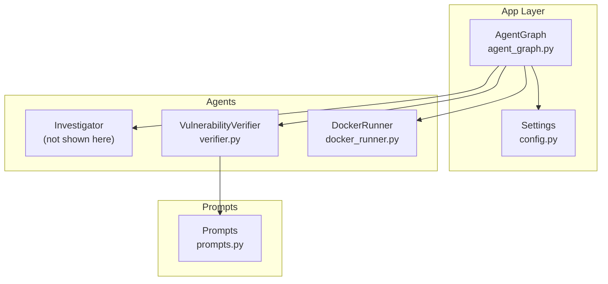
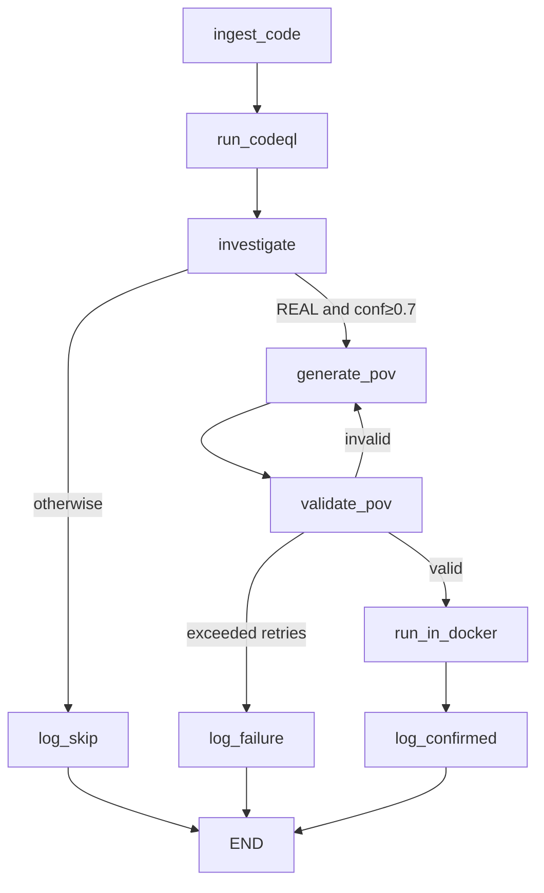
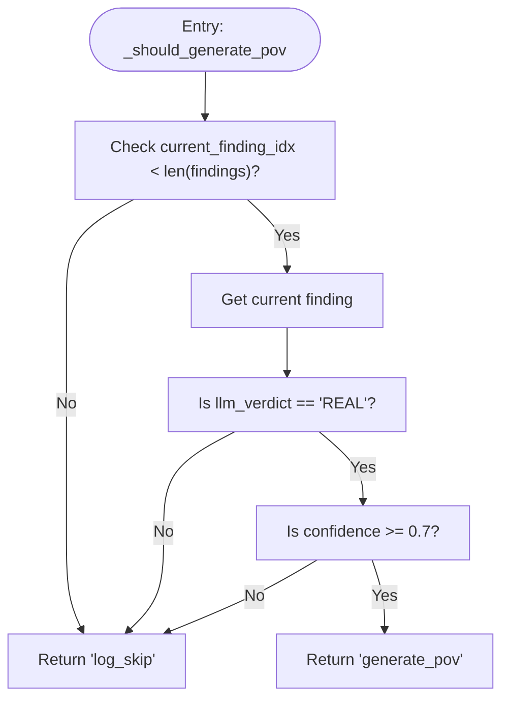
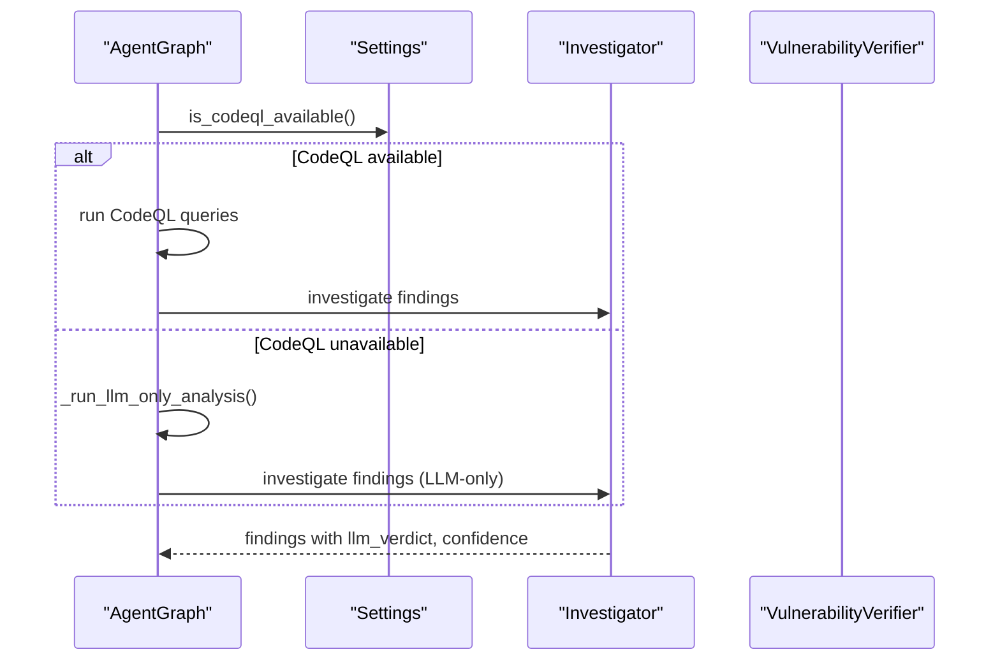
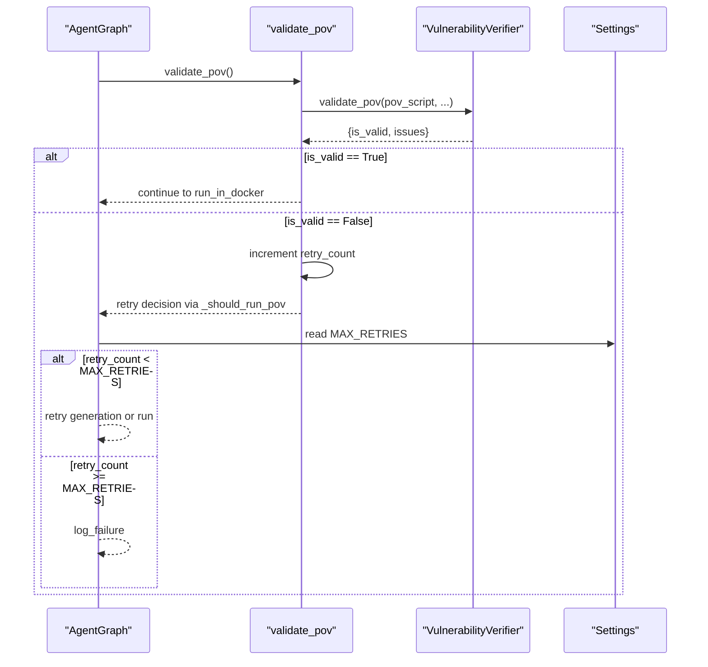
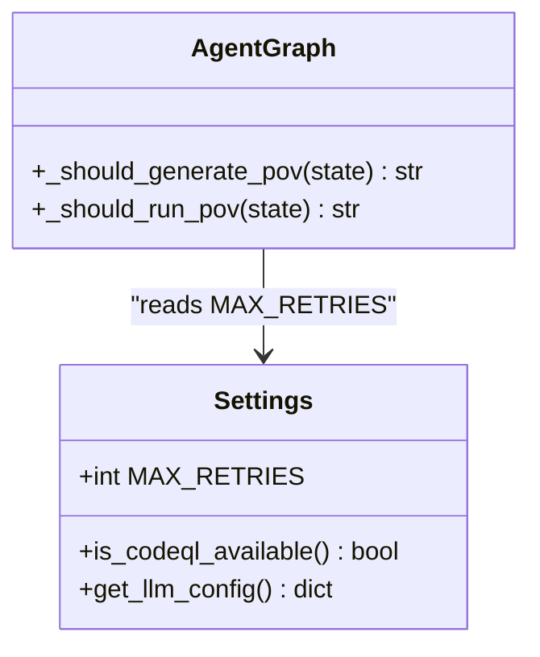
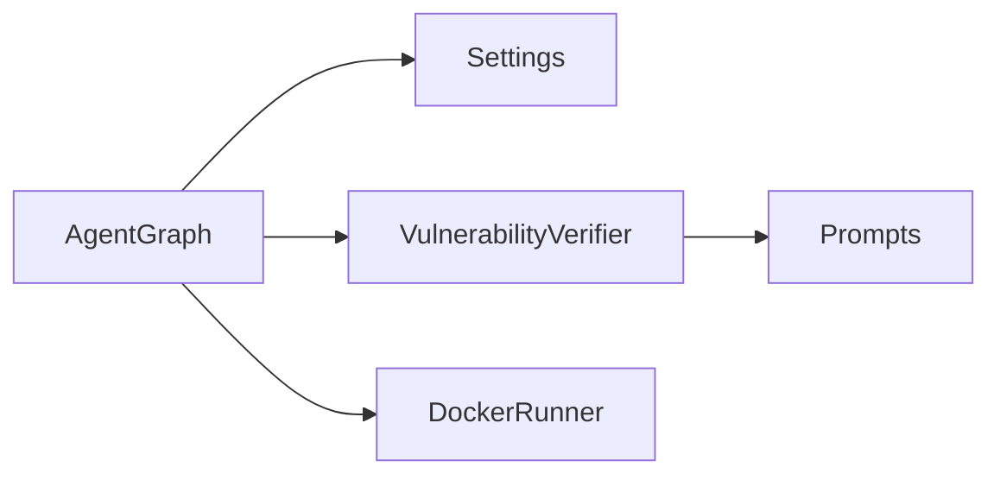

# Conditional Routing and Decision Logic

<cite>
**Referenced Files in This Document**
- [agent_graph.py](file://autopov/app/agent_graph.py)
- [config.py](file://autopov/app/config.py)
- [verifier.py](file://autopov/agents/verifier.py)
- [docker_runner.py](file://autopov/agents/docker_runner.py)
- [prompts.py](file://autopov/prompts.py)
- [README.md](file://autopov/README.md)
</cite>

## Table of Contents
1. [Introduction](#introduction)
2. [Project Structure](#project-structure)
3. [Core Components](#core-components)
4. [Architecture Overview](#architecture-overview)
5. [Detailed Component Analysis](#detailed-component-analysis)
6. [Dependency Analysis](#dependency-analysis)
7. [Performance Considerations](#performance-considerations)
8. [Troubleshooting Guide](#troubleshooting-guide)
9. [Conclusion](#conclusion)

## Introduction
This document explains AutoPoV’s conditional routing system that decides whether to generate a Proof-of-Vulnerability (PoV) script or skip a finding. It focuses on two key decision methods:
- _should_generate_pov: evaluates LLM verdict and confidence thresholds to decide PoV generation
- _should_run_pov: determines retry logic based on PoV script availability and retry count limits

It also documents edge routing patterns, fallback mechanisms when CodeQL is unavailable, the LLM-only analysis path, and the integration with settings for MAX_RETRIES and confidence thresholds.

## Project Structure
AutoPoV uses a LangGraph-based workflow with explicit conditional edges connecting nodes. The routing logic resides in the agent graph and integrates with configuration, verifier, and Docker runner components.

**Diagram sources**
- [agent_graph.py](file://autopov/app/agent_graph.py#L84-L134)
- [config.py](file://autopov/app/config.py#L13-L210)
- [verifier.py](file://autopov/agents/verifier.py#L1-L401)
- [docker_runner.py](file://autopov/agents/docker_runner.py#L1-L200)
- [prompts.py](file://autopov/prompts.py#L1-L374)

**Section sources**
- [agent_graph.py](file://autopov/app/agent_graph.py#L84-L134)
- [README.md](file://autopov/README.md#L17-L35)

## Core Components
- AgentGraph: Defines the workflow nodes and conditional edges, and implements the decision methods.
- Settings: Provides configuration including MAX_RETRIES and runtime checks for external tools.
- VulnerabilityVerifier: Generates and validates PoV scripts, and performs retry analysis.
- DockerRunner: Executes PoV scripts in isolated containers with safety constraints.
- Prompts: Supplies structured prompts for LLM-based tasks including PoV generation, validation, and retry analysis.

Key decision points:
- _should_generate_pov: REAL verdict with confidence ≥ 0.7 triggers PoV generation.
- _should_run_pov: Determines whether to run PoV in Docker, retry generation, or log failure based on retry_count and PoV script presence.

**Section sources**
- [agent_graph.py](file://autopov/app/agent_graph.py#L488-L515)
- [config.py](file://autopov/app/config.py#L92-L92)
- [verifier.py](file://autopov/agents/verifier.py#L151-L378)
- [docker_runner.py](file://autopov/agents/docker_runner.py#L62-L192)
- [prompts.py](file://autopov/prompts.py#L46-L209)

## Architecture Overview
The workflow is a directed acyclic graph with conditional edges branching on decisions.

**Diagram sources**
- [agent_graph.py](file://autopov/app/agent_graph.py#L101-L133)
- [agent_graph.py](file://autopov/app/agent_graph.py#L488-L515)

## Detailed Component Analysis

### Decision Method: _should_generate_pov
Purpose: Decide whether to generate a PoV script for the current finding.

Behavior:
- If the current finding index is out of range, route to skip.
- If the LLM verdict is REAL and confidence is greater than or equal to 0.7, route to generate_pov.
- Otherwise, route to log_skip.

**Diagram sources**
- [agent_graph.py](file://autopov/app/agent_graph.py#L488-L500)

**Section sources**
- [agent_graph.py](file://autopov/app/agent_graph.py#L488-L500)

### Decision Method: _should_run_pov
Purpose: Determine retry logic after validation.

Behavior:
- If the current finding index is out of range, route to log_failure.
- If a PoV script exists and retry_count is less than MAX_RETRIES, route to run_in_docker.
- If retry_count is less than MAX_RETRIES but no PoV script exists, route to generate_pov (retry generation).
- Otherwise, route to log_failure.

```mermaid
flowchart TD
Start(["Entry: _should_run_pov"]) --> CheckIdx["Check current_finding_idx < len(findings)?"]
CheckIdx --> |No| RouteFail["Return 'log_failure'"]
CheckIdx --> |Yes| GetFinding["Get current finding"]
GetFinding --> HasScript{"Has pov_script?"}
HasScript --> |Yes| CheckRetries["retry_count < MAX_RETRIES?"]
CheckRetries --> |Yes| RouteRun["Return 'run_in_docker'"]
CheckRetries --> |No| RouteFail
HasScript --> |No| CheckRetries2["retry_count < MAX_RETRIES?"]
CheckRetries2 --> |Yes| RouteGen["Return 'generate_pov'"]
CheckRetries2 --> |No| RouteFail
```

**Diagram sources**
- [agent_graph.py](file://autopov/app/agent_graph.py#L501-L515)
- [config.py](file://autopov/app/config.py#L92-L92)

**Section sources**
- [agent_graph.py](file://autopov/app/agent_graph.py#L501-L515)
- [config.py](file://autopov/app/config.py#L92-L92)

### Conditional Edge Definitions
The workflow defines conditional edges using the decision methods:

- From investigate to generate_pov or log_skip based on _should_generate_pov.
- From validate_pov to run_in_docker, generate_pov, or log_failure based on _should_run_pov.

These edges ensure that only high-confidence REAL findings proceed to PoV generation, and that validation failures are handled with controlled retries.

**Section sources**
- [agent_graph.py](file://autopov/app/agent_graph.py#L106-L127)

### Fallback Mechanisms: CodeQL Unavailable and LLM-only Analysis
When CodeQL is unavailable, the workflow falls back to an LLM-only analysis path:
- The run_codeql node checks availability via settings.is_codeql_available().
- If unavailable, it logs a warning and invokes _run_llm_only_analysis to synthesize findings.
- The investigation phase still populates llm_verdict, confidence, and code_chunk for each finding, enabling conditional routing to work even without CodeQL.

**Diagram sources**
- [agent_graph.py](file://autopov/app/agent_graph.py#L163-L191)
- [agent_graph.py](file://autopov/app/agent_graph.py#L279-L288)
- [agent_graph.py](file://autopov/app/agent_graph.py#L290-L325)

**Section sources**
- [agent_graph.py](file://autopov/app/agent_graph.py#L168-L173)
- [agent_graph.py](file://autopov/app/agent_graph.py#L175-L190)
- [agent_graph.py](file://autopov/app/agent_graph.py#L279-L288)

### Retry Strategy for PoV Generation Failures and Validation Issues
Retry behavior is governed by retry_count and MAX_RETRIES:

- Validation failures increment retry_count.
- If retry_count < MAX_RETRIES, the workflow attempts to regenerate the PoV (generate_pov) or run it again (run_in_docker).
- If retry_count reaches MAX_RETRIES, the workflow logs failure and moves to the next finding.

Integration points:
- MAX_RETRIES is configured in settings and used in _should_run_pov.
- The verifier increments retry_count when validation fails.

**Diagram sources**
- [agent_graph.py](file://autopov/app/agent_graph.py#L371-L401)
- [agent_graph.py](file://autopov/app/agent_graph.py#L501-L515)
- [config.py](file://autopov/app/config.py#L92-L92)

**Section sources**
- [agent_graph.py](file://autopov/app/agent_graph.py#L394-L401)
- [agent_graph.py](file://autopov/app/agent_graph.py#L509-L514)
- [config.py](file://autopov/app/config.py#L92-L92)

### Integration with Settings: MAX_RETRIES and Confidence Thresholds
- MAX_RETRIES: Controls the maximum number of retries for PoV generation/validation failures. Defined in settings and used in _should_run_pov.
- Confidence threshold: _should_generate_pov requires confidence ≥ 0.7 for REAL verdict to proceed to PoV generation.

**Diagram sources**
- [config.py](file://autopov/app/config.py#L92-L92)
- [agent_graph.py](file://autopov/app/agent_graph.py#L488-L515)

**Section sources**
- [config.py](file://autopov/app/config.py#L92-L92)
- [agent_graph.py](file://autopov/app/agent_graph.py#L496-L499)
- [agent_graph.py](file://autopov/app/agent_graph.py#L509-L514)

### Decision Scenarios and Outcomes
- Scenario A: REAL verdict with confidence ≥ 0.7
  - Outcome: generate_pov → validate_pov → run_in_docker → log_confirmed
- Scenario B: REAL verdict with confidence < 0.7
  - Outcome: log_skip → next finding
- Scenario C: Non-REAL verdict
  - Outcome: log_skip → next finding
- Scenario D: Validation fails (is_valid == False)
  - Outcome: increment retry_count → retry generation or run_in_docker depending on retry_count vs MAX_RETRIES
- Scenario E: Exceeded retries
  - Outcome: log_failure → next finding

**Section sources**
- [agent_graph.py](file://autopov/app/agent_graph.py#L488-L515)
- [agent_graph.py](file://autopov/app/agent_graph.py#L371-L401)

## Dependency Analysis
The routing logic depends on:
- AgentGraph for workflow definition and decision methods
- Settings for MAX_RETRIES and tool availability checks
- VulnerabilityVerifier for PoV generation, validation, and retry analysis
- DockerRunner for safe execution of PoV scripts
- Prompts for LLM-based tasks

**Diagram sources**
- [agent_graph.py](file://autopov/app/agent_graph.py#L22-L26)
- [config.py](file://autopov/app/config.py#L13-L210)
- [verifier.py](file://autopov/agents/verifier.py#L27-L32)
- [prompts.py](file://autopov/prompts.py#L1-L374)

**Section sources**
- [agent_graph.py](file://autopov/app/agent_graph.py#L22-L26)
- [config.py](file://autopov/app/config.py#L13-L210)
- [verifier.py](file://autopov/agents/verifier.py#L27-L32)
- [prompts.py](file://autopov/prompts.py#L1-L374)

## Performance Considerations
- Confidence threshold (≥ 0.7) reduces unnecessary PoV generation for low-confidence findings, saving compute costs.
- MAX_RETRIES bounds retry loops to prevent infinite loops while allowing recovery from transient failures.
- LLM-only fallback avoids blocking the pipeline when CodeQL is unavailable, maintaining throughput.

[No sources needed since this section provides general guidance]

## Troubleshooting Guide
Common issues and resolutions:
- PoV generation fails immediately
  - Verify llm_verdict is REAL and confidence ≥ 0.7.
  - Check that the verifier’s generate_pov succeeded and returned a valid script.
- Validation fails repeatedly
  - Confirm retry_count is incrementing and not exceeding MAX_RETRIES.
  - Review validation criteria: standard library usage, required print statement, determinism.
- Docker execution disabled or unavailable
  - Ensure Docker is available and configured; otherwise, execution will log a failure and move to next finding.
- CodeQL unavailable
  - The system falls back to LLM-only analysis; confirm findings still contain llm_verdict and confidence for routing.

**Section sources**
- [agent_graph.py](file://autopov/app/agent_graph.py#L359-L367)
- [agent_graph.py](file://autopov/app/agent_graph.py#L394-L401)
- [agent_graph.py](file://autopov/app/agent_graph.py#L168-L173)
- [docker_runner.py](file://autopov/agents/docker_runner.py#L81-L90)

## Conclusion
AutoPoV’s conditional routing ensures that only high-confidence, REAL findings proceed to PoV generation, while robust retry logic and configurable limits manage failures gracefully. The system remains resilient when CodeQL is unavailable by leveraging an LLM-only analysis path. Proper configuration of MAX_RETRIES and confidence thresholds enables balanced performance and reliability across diverse environments.