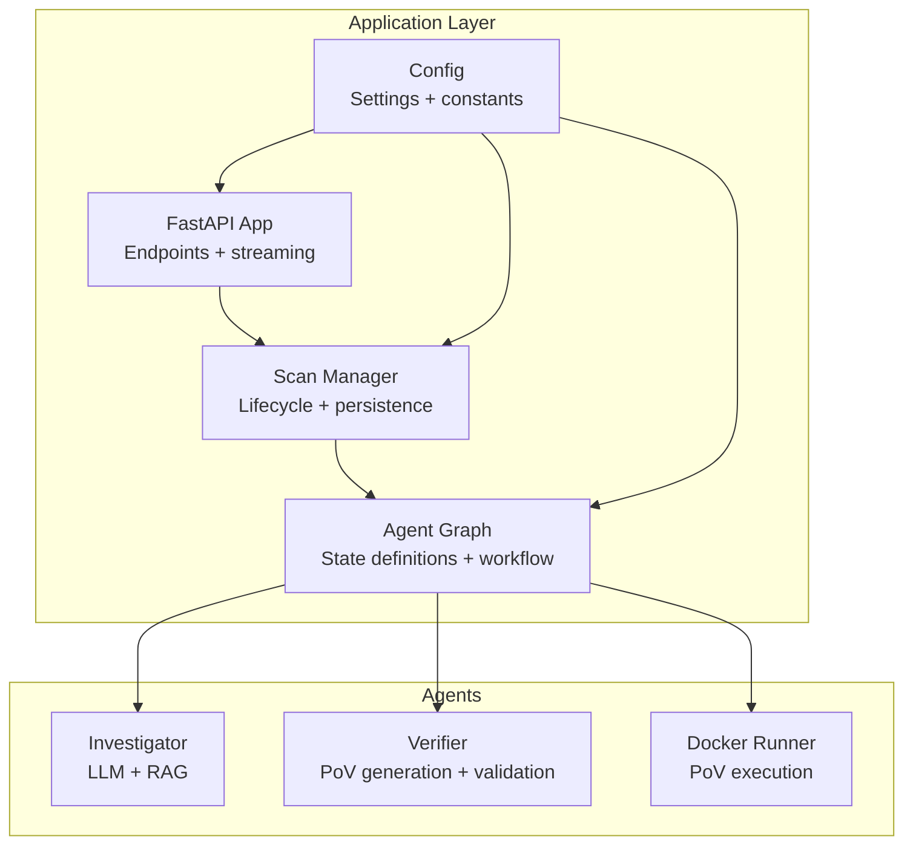
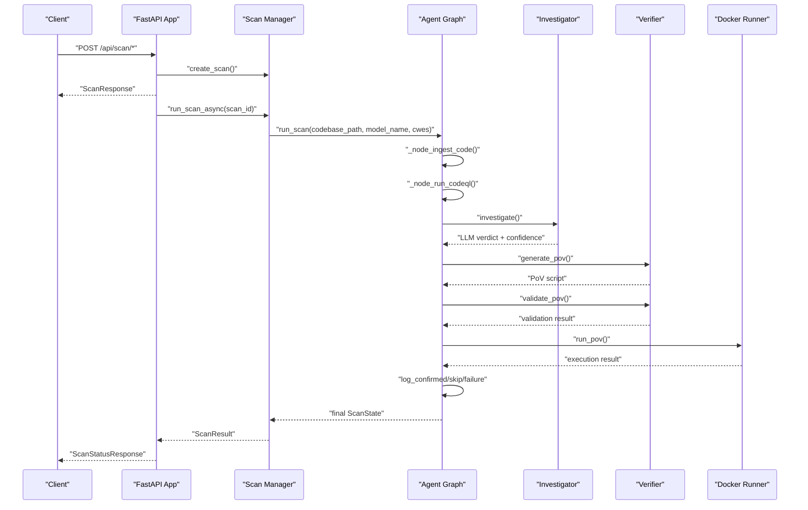
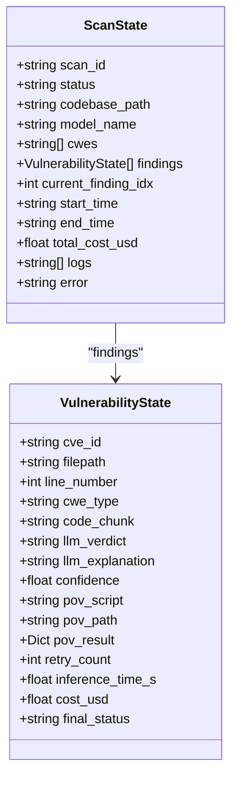
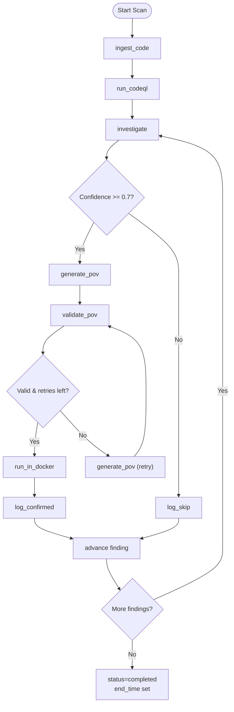
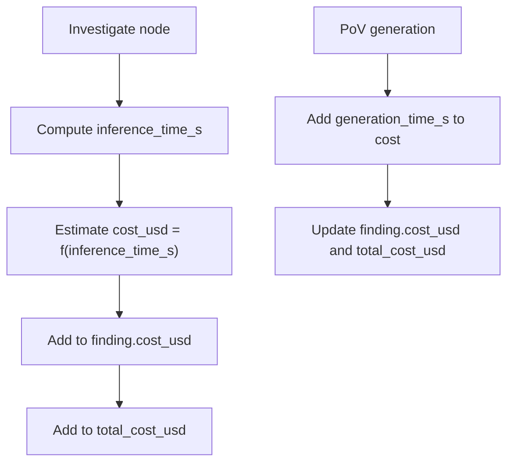
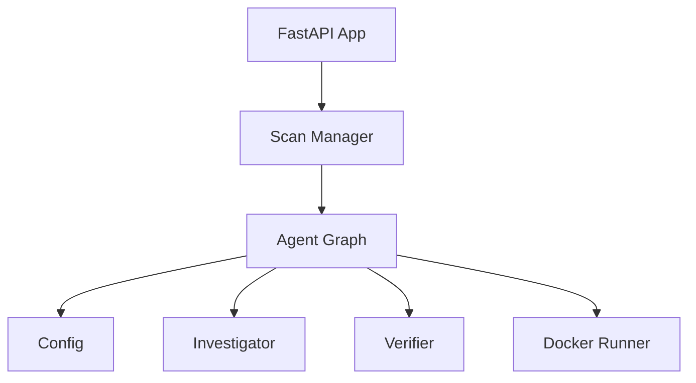

# State Machine and Data Models

<cite>
**Referenced Files in This Document**
- [agent_graph.py](file://autopov/app/agent_graph.py)
- [scan_manager.py](file://autopov/app/scan_manager.py)
- [config.py](file://autopov/app/config.py)
- [main.py](file://autopov/app/main.py)
- [verifier.py](file://autopov/agents/verifier.py)
- [investigator.py](file://autopov/agents/investigator.py)
</cite>

## Table of Contents
1. [Introduction](#introduction)
2. [Project Structure](#project-structure)
3. [Core Components](#core-components)
4. [Architecture Overview](#architecture-overview)
5. [Detailed Component Analysis](#detailed-component-analysis)
6. [Dependency Analysis](#dependency-analysis)
7. [Performance Considerations](#performance-considerations)
8. [Troubleshooting Guide](#troubleshooting-guide)
9. [Conclusion](#conclusion)

## Introduction
This document explains AutoPoV’s state machine design with a focus on the ScanState and VulnerabilityState data models. It covers the TypedDict-based state definitions, the ScanStatus enumeration, state mutation patterns across the workflow, data flow between nodes, validation rules, and cost tracking mechanisms. The goal is to help both technical and non-technical readers understand how AutoPoV orchestrates vulnerability detection and PoV generation through a structured state machine.

## Project Structure
AutoPoV organizes its state machine and orchestration logic primarily in the application layer:
- State definitions and workflow graph are defined in the agent graph module.
- Lifecycle management and persistence are handled by the scan manager.
- Configuration and runtime settings are centralized in the configuration module.
- The API server exposes endpoints that drive scans and surface results.

**Diagram sources**
- [agent_graph.py](file://autopov/app/agent_graph.py#L1-L200)
- [scan_manager.py](file://autopov/app/scan_manager.py#L1-L120)
- [config.py](file://autopov/app/config.py#L1-L120)
- [main.py](file://autopov/app/main.py#L100-L220)

**Section sources**
- [agent_graph.py](file://autopov/app/agent_graph.py#L1-L120)
- [scan_manager.py](file://autopov/app/scan_manager.py#L1-L120)
- [config.py](file://autopov/app/config.py#L1-L120)
- [main.py](file://autopov/app/main.py#L100-L220)

## Core Components
This section introduces the primary data models and their roles in the state machine.

- ScanState: The top-level state representing a complete scan run, including metadata, status, findings, and cost/time tracking.
- VulnerabilityState: The per-finding state capturing LLM analysis, PoV generation/validation, execution results, and final classification.
- ScanStatus: Enumeration of workflow stages and outcomes.

Key TypedDict fields:
- ScanState: scan_id, status, codebase_path, model_name, cwes, findings, current_finding_idx, start_time, end_time, total_cost_usd, logs, error.
- VulnerabilityState: cve_id, filepath, line_number, cwe_type, code_chunk, llm_verdict, llm_explanation, confidence, pov_script, pov_path, pov_result, retry_count, inference_time_s, cost_usd, final_status.

Validation rules:
- Confidence threshold: PoV generation is gated by a minimum confidence threshold.
- Retry policy: PoV validation can be retried up to a configurable maximum.
- Final status: Each finding resolves to confirmed, skipped, or failed.

**Section sources**
- [agent_graph.py](file://autopov/app/agent_graph.py#L29-L76)
- [agent_graph.py](file://autopov/app/agent_graph.py#L43-L60)
- [agent_graph.py](file://autopov/app/agent_graph.py#L488-L500)
- [agent_graph.py](file://autopov/app/agent_graph.py#L501-L515)

## Architecture Overview
The state machine is implemented as a LangGraph workflow that orchestrates nodes for ingestion, analysis, PoV generation, validation, and execution. The scan manager coordinates lifecycle and persistence, while the API server exposes endpoints to start scans and stream progress.

**Diagram sources**
- [main.py](file://autopov/app/main.py#L177-L317)
- [scan_manager.py](file://autopov/app/scan_manager.py#L86-L176)
- [agent_graph.py](file://autopov/app/agent_graph.py#L136-L192)
- [agent_graph.py](file://autopov/app/agent_graph.py#L290-L325)
- [agent_graph.py](file://autopov/app/agent_graph.py#L327-L433)

## Detailed Component Analysis

### ScanState and VulnerabilityState Data Models
- ScanState encapsulates the entire scan lifecycle, including metadata, status, findings, and aggregated metrics.
- VulnerabilityState captures the per-finding journey from LLM analysis to PoV execution and final classification.

**Diagram sources**
- [agent_graph.py](file://autopov/app/agent_graph.py#L62-L76)
- [agent_graph.py](file://autopov/app/agent_graph.py#L43-L60)

**Section sources**
- [agent_graph.py](file://autopov/app/agent_graph.py#L62-L76)
- [agent_graph.py](file://autopov/app/agent_graph.py#L43-L60)

### ScanStatus Enumeration
ScanStatus defines the workflow stages and outcomes:
- pending, ingesting, running_codeql, investigating, generating_pov, validating_pov, running_pov, completed, failed, skipped.

These values are used to update state.status at each node and to determine conditional edges in the workflow.

**Section sources**
- [agent_graph.py](file://autopov/app/agent_graph.py#L29-L41)

### Workflow Nodes and State Mutations
The workflow progresses through a series of nodes, each mutating the ScanState:

- ingest_code: Initializes ingestion and updates status to ingesting.
- run_codeql: Executes CodeQL queries per CWE, populating findings; falls back to LLM-only analysis if CodeQL is unavailable.
- investigate: Calls the Investigator to produce llm_verdict, confidence, code_chunk, inference_time_s, and cost_usd; accumulates total_cost_usd.
- generate_pov: Generates PoV script via the Verifier; adds generation cost to cost_usd and total_cost_usd.
- validate_pov: Validates PoV script; increments retry_count if invalid; decides whether to run in Docker or regenerate.
- run_in_docker: Executes PoV in a Docker container; records execution result.
- log_confirmed/log_skip/log_failure: Updates final_status and advances to next finding; completes scan when all findings are processed.

**Diagram sources**
- [agent_graph.py](file://autopov/app/agent_graph.py#L84-L134)
- [agent_graph.py](file://autopov/app/agent_graph.py#L488-L515)

**Section sources**
- [agent_graph.py](file://autopov/app/agent_graph.py#L136-L192)
- [agent_graph.py](file://autopov/app/agent_graph.py#L290-L325)
- [agent_graph.py](file://autopov/app/agent_graph.py#L327-L433)
- [agent_graph.py](file://autopov/app/agent_graph.py#L435-L486)

### Validation Rules and Decision Logic
- Confidence gating: PoV generation occurs only when llm_verdict is “REAL” and confidence is at least 0.7.
- Retry policy: If validation fails, the system either regenerates the PoV (up to MAX_RETRIES) or logs failure.
- Final status assignment: After PoV execution, findings are marked confirmed if vulnerability was triggered; otherwise skipped or failed.

**Section sources**
- [agent_graph.py](file://autopov/app/agent_graph.py#L488-L500)
- [agent_graph.py](file://autopov/app/agent_graph.py#L501-L515)
- [agent_graph.py](file://autopov/app/agent_graph.py#L435-L486)

### Cost Tracking Mechanism
- Per-finding cost: Estimated based on inference_time_s using a simple rate ($0.01/s) when MODEL_MODE is online; offline mode returns zero cost in the estimator.
- Aggregation: Each node contributes to cost_usd for the finding and total_cost_usd for the scan.
- Configuration: MAX_COST_USD and COST_TRACKING_ENABLED are available in settings for budget control.

**Diagram sources**
- [agent_graph.py](file://autopov/app/agent_graph.py#L316-L318)
- [agent_graph.py](file://autopov/app/agent_graph.py#L521-L531)
- [config.py](file://autopov/app/config.py#L85-L88)

**Section sources**
- [agent_graph.py](file://autopov/app/agent_graph.py#L316-L318)
- [agent_graph.py](file://autopov/app/agent_graph.py#L521-L531)
- [config.py](file://autopov/app/config.py#L85-L88)

### Inference Time Calculations
- Inference time is captured during investigation and PoV generation:
  - investigation: inference_time_s is recorded from the Investigator.
  - PoV generation: generation_time_s is computed as the elapsed time for the generation call.
- These values feed cost estimation and reporting.

**Section sources**
- [agent_graph.py](file://autopov/app/agent_graph.py#L313-L314)
- [verifier.py](file://autopov/agents/verifier.py#L102-L133)

### Data Flow Between Nodes
- CodeQL results populate initial findings with minimal fields; investigation enriches each finding with LLM analysis and cost.
- PoV generation and validation update the finding with script and validation metadata.
- Docker execution writes execution results back to the finding.
- Logging nodes finalize the finding’s status and advance the scan.

**Section sources**
- [agent_graph.py](file://autopov/app/agent_graph.py#L244-L268)
- [agent_graph.py](file://autopov/app/agent_graph.py#L310-L325)
- [agent_graph.py](file://autopov/app/agent_graph.py#L350-L368)
- [agent_graph.py](file://autopov/app/agent_graph.py#L387-L401)
- [agent_graph.py](file://autopov/app/agent_graph.py#L419-L433)

### Example State Transitions
- From pending to ingesting to running_codeql to investigating.
- From investigating to generate_pov (if confidence threshold met) or log_skip.
- From generate_pov to validate_pov; if valid, run_in_docker; if invalid and retries remain, regenerate; otherwise log_failure.
- After confirming or skipping, advance to next finding; when all are processed, set status to completed and end_time.

**Section sources**
- [agent_graph.py](file://autopov/app/agent_graph.py#L136-L192)
- [agent_graph.py](file://autopov/app/agent_graph.py#L290-L325)
- [agent_graph.py](file://autopov/app/agent_graph.py#L327-L433)
- [agent_graph.py](file://autopov/app/agent_graph.py#L435-L486)

## Dependency Analysis
The state machine depends on:
- Configuration for tool availability, limits, and cost tracking.
- Agents for investigation, PoV generation/validation, and Docker execution.
- Scan manager for lifecycle orchestration and persistence.

**Diagram sources**
- [agent_graph.py](file://autopov/app/agent_graph.py#L22-L27)
- [scan_manager.py](file://autopov/app/scan_manager.py#L16-L18)
- [main.py](file://autopov/app/main.py#L19-L26)

**Section sources**
- [agent_graph.py](file://autopov/app/agent_graph.py#L22-L27)
- [scan_manager.py](file://autopov/app/scan_manager.py#L16-L18)
- [main.py](file://autopov/app/main.py#L19-L26)

## Performance Considerations
- Cost estimation is simplified and linear in inference time for online models; consider token-based pricing for production.
- CodeQL and Docker execution are subject to timeouts; ensure adequate resource allocation.
- Retries are bounded by MAX_RETRIES; tune this value to balance quality vs. cost.
- Logging and metrics aggregation occur at scan completion; consider incremental updates for long-running scans.

[No sources needed since this section provides general guidance]

## Troubleshooting Guide
Common issues and remedies:
- CodeQL not available: The workflow falls back to LLM-only analysis; verify installation and environment variables.
- PoV generation failures: Check LLM configuration and prompts; review validation feedback for syntax or missing triggers.
- Docker execution failures: Verify Docker availability and permissions; inspect execution results for exit codes.
- Cost tracking anomalies: Ensure MODEL_MODE is set correctly; confirm inference_time_s is populated.

**Section sources**
- [agent_graph.py](file://autopov/app/agent_graph.py#L168-L190)
- [agent_graph.py](file://autopov/app/agent_graph.py#L364-L366)
- [config.py](file://autopov/app/config.py#L123-L172)

## Conclusion
AutoPoV’s state machine cleanly separates concerns across ingestion, analysis, PoV generation, validation, and execution. The TypedDict-based models provide strong structure for state transitions, while the ScanStatus enumeration and conditional edges ensure predictable control flow. Cost tracking and inference time capture enable visibility into resource usage, and configuration-driven policies govern retries and tool availability. Together, these components form a robust framework for autonomous vulnerability detection and PoV generation.