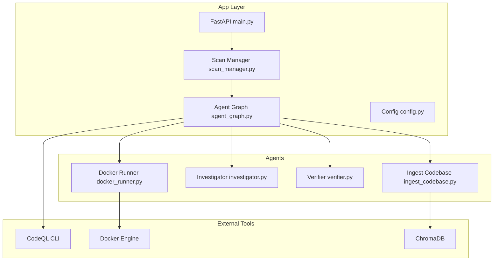
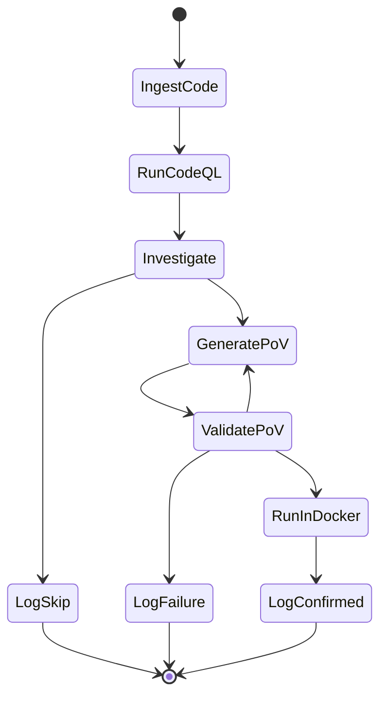
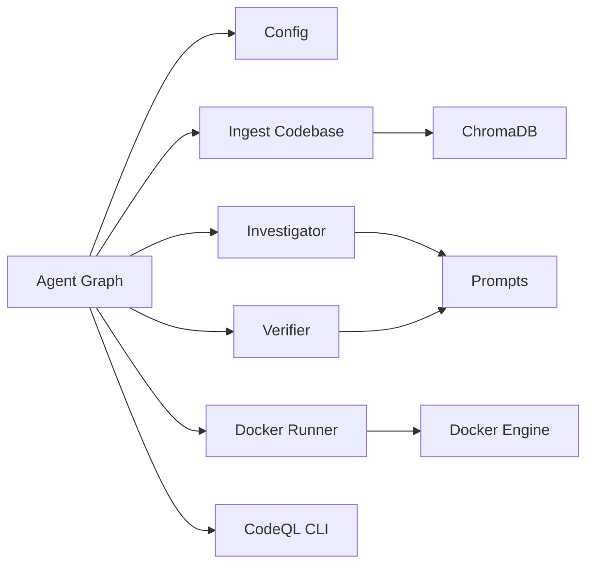

# Workflow Orchestration and Node Implementation

<cite>
**Referenced Files in This Document**
- [agent_graph.py](file://autopov/app/agent_graph.py)
- [ingest_codebase.py](file://autopov/agents/ingest_codebase.py)
- [investigator.py](file://autopov/agents/investigator.py)
- [verifier.py](file://autopov/agents/verifier.py)
- [docker_runner.py](file://autopov/agents/docker_runner.py)
- [config.py](file://autopov/app/config.py)
- [scan_manager.py](file://autopov/app/scan_manager.py)
- [prompts.py](file://autopov/prompts.py)
- [main.py](file://autopov/app/main.py)
- [README.md](file://autopov/README.md)
</cite>

## Table of Contents
1. [Introduction](#introduction)
2. [Project Structure](#project-structure)
3. [Core Components](#core-components)
4. [Architecture Overview](#architecture-overview)
5. [Detailed Component Analysis](#detailed-component-analysis)
6. [Dependency Analysis](#dependency-analysis)
7. [Performance Considerations](#performance-considerations)
8. [Troubleshooting Guide](#troubleshooting-guide)
9. [Conclusion](#conclusion)
10. [Appendices](#appendices)

## Introduction
This document explains AutoPoV’s five-node workflow orchestration system for autonomous vulnerability detection and PoV execution. The workflow ingests a codebase into a vector store, optionally runs CodeQL analysis, investigates findings with LLMs, generates PoVs, validates them, and executes them safely in Docker. It covers state transitions, error handling, external tool integrations, logging, and progress tracking.

## Project Structure
AutoPoV is organized into:
- app/: FastAPI backend, agent graph, scan manager, configuration, and API endpoints
- agents/: LangGraph node implementations for ingestion, investigation, verification, and Docker execution
- frontend/: React-based UI (not covered here)
- codeql_queries/: CodeQL query files for supported CWEs
- results/: persisted scan results and PoVs
- tests/: pytest test suite

**Diagram sources**
- [main.py](file://autopov/app/main.py#L103-L121)
- [scan_manager.py](file://autopov/app/scan_manager.py#L40-L50)
- [agent_graph.py](file://autopov/app/agent_graph.py#L84-L135)
- [ingest_codebase.py](file://autopov/agents/ingest_codebase.py#L41-L60)
- [investigator.py](file://autopov/agents/investigator.py#L37-L50)
- [verifier.py](file://autopov/agents/verifier.py#L40-L50)
- [docker_runner.py](file://autopov/agents/docker_runner.py#L27-L40)

**Section sources**
- [README.md](file://autopov/README.md#L17-L36)
- [main.py](file://autopov/app/main.py#L103-L121)

## Core Components
- Agent Graph: Defines the five-node workflow and state transitions.
- Ingest Codebase: Chunks code, embeds into ChromaDB, and retrieves context.
- Investigator: LLM-based vulnerability analysis with RAG and optional Joern CPG.
- Verifier: Generates and validates PoV scripts with LLM and static checks.
- Docker Runner: Executes PoVs in isolated containers with resource limits.
- Configuration: Centralized settings for models, tools, and runtime behavior.
- Scan Manager: Orchestrates scan lifecycle and persists results.

**Section sources**
- [agent_graph.py](file://autopov/app/agent_graph.py#L78-L135)
- [ingest_codebase.py](file://autopov/agents/ingest_codebase.py#L41-L60)
- [investigator.py](file://autopov/agents/investigator.py#L37-L50)
- [verifier.py](file://autopov/agents/verifier.py#L40-L50)
- [docker_runner.py](file://autopov/agents/docker_runner.py#L27-L40)
- [config.py](file://autopov/app/config.py#L13-L122)

## Architecture Overview
The workflow is a LangGraph StateGraph with five nodes plus auxiliary logging nodes. It proceeds from ingestion to CodeQL, then investigation, PoV generation, validation, and Docker execution. Conditional edges route findings based on confidence thresholds and validation outcomes.

**Diagram sources**
- [agent_graph.py](file://autopov/app/agent_graph.py#L90-L135)
- [agent_graph.py](file://autopov/app/agent_graph.py#L488-L515)

## Detailed Component Analysis

### Ingest Codebase Node
Purpose: Ingest codebase into vector store for RAG.
- Reads files, filters binary and non-code files, chunks with overlap-aware splitter, embeds via configured embeddings, and writes to ChromaDB collections keyed by scan_id.
- Provides retrieval and file content helpers for downstream nodes.
- Supports online (OpenAI) and offline (HuggingFace) embeddings.

Key behaviors:
- Directory traversal with hidden directory skipping.
- Batched embedding and insertion.
- Progress callback integration.
- Cleanup of per-scan collection on completion.

Error handling:
- Raises custom ingestion error when prerequisites are missing.
- Logs warnings for unreadable/binary/empty files.

Integration points:
- ChromaDB client and collection per scan.
- Embedding providers selected by configuration.

**Section sources**
- [ingest_codebase.py](file://autopov/agents/ingest_codebase.py#L201-L307)
- [ingest_codebase.py](file://autopov/agents/ingest_codebase.py#L309-L386)
- [ingest_codebase.py](file://autopov/agents/ingest_codebase.py#L60-L88)

### Run CodeQL Node
Purpose: Execute CodeQL queries for supported CWEs and synthesize findings.
- Detects CodeQL availability; if unavailable, falls back to LLM-only analysis.
- Creates a temporary CodeQL database from the codebase and runs matching .ql files.
- Parses JSON results into standardized vulnerability state entries.
- Cleans up temporary database artifacts.

Error handling:
- Gracefully handles missing query files and execution failures.
- Falls back to LLM-only when CodeQL is unavailable.

Integration points:
- CodeQL CLI path from configuration.
- Query mapping for supported CWEs.

**Section sources**
- [agent_graph.py](file://autopov/app/agent_graph.py#L163-L191)
- [agent_graph.py](file://autopov/app/agent_graph.py#L193-L278)
- [config.py](file://autopov/app/config.py#L137-L147)

### Investigate Node
Purpose: LLM-based vulnerability analysis with RAG and optional Joern CPG.
- Retrieves code context via file content or RAG, optionally augments with Joern for CWE-416.
- Calls configured LLM to produce structured verdict, confidence, and explanation.
- Estimates inference cost and accumulates total cost.

Error handling:
- Returns structured error result on failures.
- Uses LangSmith tracer if enabled.

Integration points:
- Prompts module for investigation formatting.
- Code ingester for context retrieval.

**Section sources**
- [agent_graph.py](file://autopov/app/agent_graph.py#L290-L325)
- [investigator.py](file://autopov/agents/investigator.py#L254-L366)
- [prompts.py](file://autopov/prompts.py#L245-L262)

### Generate PoV Node
Purpose: Generate PoV scripts for findings meeting confidence threshold.
- Skips if current finding is not “REAL” or below confidence threshold.
- Retrieves code context from vector store and calls verifier to generate PoV.
- Updates cost and logs success/failure.

Error handling:
- Marks failure status when generation fails.

**Section sources**
- [agent_graph.py](file://autopov/app/agent_graph.py#L327-L369)
- [verifier.py](file://autopov/agents/verifier.py#L79-L149)

### Validate PoV Node
Purpose: Validate PoV script statically and via LLM.
- Static checks: AST syntax, presence of required trigger message, only stdlib imports, CWE-specific heuristics.
- LLM validation: additional review and suggestions.
- Tracks retry attempts and updates status accordingly.

Error handling:
- Marks issues and suggestions; sets validity flag if problems found.

**Section sources**
- [agent_graph.py](file://autopov/app/agent_graph.py#L371-L401)
- [verifier.py](file://autopov/agents/verifier.py#L151-L227)
- [verifier.py](file://autopov/agents/verifier.py#L265-L291)

### Run in Docker Node
Purpose: Execute PoV in a secure, isolated container.
- Writes PoV to a temp directory and mounts it read-only into a container.
- Runs with no network, memory/CPU limits, and timeout.
- Determines success by exit code or presence of trigger message in stdout.

Error handling:
- Handles Docker unavailability, timeouts, container errors, and cleanup.

**Section sources**
- [agent_graph.py](file://autopov/app/agent_graph.py#L403-L433)
- [docker_runner.py](file://autopov/agents/docker_runner.py#L62-L192)
- [docker_runner.py](file://autopov/agents/docker_runner.py#L193-L231)

### Logging and Progress Tracking
- Each node appends timestamped log entries to the shared state.
- API endpoints expose live logs via Server-Sent Events and historical results.
- Scan manager persists results and maintains CSV history.

**Section sources**
- [agent_graph.py](file://autopov/app/agent_graph.py#L516-L520)
- [main.py](file://autopov/app/main.py#L350-L386)
- [scan_manager.py](file://autopov/app/scan_manager.py#L201-L236)

## Dependency Analysis
- Agent Graph depends on configuration for tool availability and settings, and on agent modules for node implementations.
- Agents depend on configuration for model selection and tool paths.
- Investigator depends on prompts and code ingester for context.
- Verifier depends on prompts and configuration for model selection.
- Docker Runner depends on configuration for Docker image and limits.

**Diagram sources**
- [agent_graph.py](file://autopov/app/agent_graph.py#L22-L26)
- [config.py](file://autopov/app/config.py#L13-L122)
- [prompts.py](file://autopov/prompts.py#L1-L10)

**Section sources**
- [agent_graph.py](file://autopov/app/agent_graph.py#L22-L26)
- [config.py](file://autopov/app/config.py#L137-L172)

## Performance Considerations
- Code ingestion batches embeddings and inserts to minimize overhead.
- CodeQL runs per-CWE queries with timeouts; fallback to LLM-only ensures resilience.
- Docker execution enforces memory/CPU/timeouts to prevent runaway processes.
- Cost estimation uses inference time for online mode; offline mode tracks GPU hours separately.
- RAG retrieval limits results to reduce latency.

[No sources needed since this section provides general guidance]

## Troubleshooting Guide
Common issues and resolutions:
- CodeQL not available: The workflow falls back to LLM-only analysis. Verify CLI path and permissions.
- Docker not available: PoV execution is skipped with a warning; enable Docker or disable Docker execution in settings.
- Missing embeddings: Ensure online/offline embedding model is configured and dependencies installed.
- Joern not available: Joern-specific analysis is skipped; install Joern for CWE-416 analysis.
- Vector store errors: Check ChromaDB persistence directory and disk space.
- LLM errors: Verify API keys and model availability; check LangSmith tracing if enabled.

**Section sources**
- [agent_graph.py](file://autopov/app/agent_graph.py#L168-L173)
- [docker_runner.py](file://autopov/agents/docker_runner.py#L81-L91)
- [config.py](file://autopov/app/config.py#L137-L172)
- [ingest_codebase.py](file://autopov/agents/ingest_codebase.py#L60-L88)

## Conclusion
AutoPoV’s five-node workflow integrates static analysis, RAG-enhanced LLM reasoning, and safe PoV execution. The LangGraph-based orchestration provides robust state transitions, conditional routing, and comprehensive logging. External tool integrations (CodeQL, Docker, ChromaDB) are encapsulated behind configuration-driven checks, enabling graceful fallbacks and secure execution.

[No sources needed since this section summarizes without analyzing specific files]

## Appendices

### Node Execution Flow and Parameters
- Ingest Codebase: accepts directory path, scan_id, and progress callback; returns statistics.
- Run CodeQL: accepts scan_id, codebase_path, and CWE list; returns findings.
- Investigate: accepts scan_id, codebase_path, cwe_type, filepath, line_number, alert_message; returns structured result.
- Generate PoV: accepts cwe_type, filepath, line_number, vulnerable_code, explanation, code_context; returns PoV script and metadata.
- Validate PoV: accepts PoV script, cwe_type, filepath, line_number; returns validation result.
- Run in Docker: accepts PoV script, scan_id, and PoV id; returns execution result.

**Section sources**
- [agent_graph.py](file://autopov/app/agent_graph.py#L136-L161)
- [agent_graph.py](file://autopov/app/agent_graph.py#L163-L191)
- [agent_graph.py](file://autopov/app/agent_graph.py#L290-L325)
- [agent_graph.py](file://autopov/app/agent_graph.py#L327-L369)
- [agent_graph.py](file://autopov/app/agent_graph.py#L371-L401)
- [agent_graph.py](file://autopov/app/agent_graph.py#L403-L433)

### State Transition Logic
- From Investigate: routes to Generate PoV if verdict is “REAL” and confidence ≥ threshold; otherwise to LogSkip.
- From Validate PoV: routes to Run in Docker if PoV exists and retry count < max; otherwise back to Generate PoV or LogFailure.
- Completion: moves to LogConfirmed or LogSkip or LogFailure depending on final status.

**Section sources**
- [agent_graph.py](file://autopov/app/agent_graph.py#L488-L515)

### Example Parameter Passing and Result Processing
- Ingestion: directory path and scan_id drive collection creation and embedding.
- CodeQL: CWE list drives query selection and database creation.
- Investigation: code context and RAG context inform LLM prompts.
- PoV generation/validation: structured inputs guide script creation and checks.
- Docker: mounted read-only volume with strict limits.

**Section sources**
- [agent_graph.py](file://autopov/app/agent_graph.py#L141-L161)
- [agent_graph.py](file://autopov/app/agent_graph.py#L211-L241)
- [agent_graph.py](file://autopov/app/agent_graph.py#L344-L369)
- [docker_runner.py](file://autopov/agents/docker_runner.py#L122-L151)