# Background Task Processing

<cite>
**Referenced Files in This Document**
- [main.py](file://autopov/app/main.py)
- [scan_manager.py](file://autopov/app/scan_manager.py)
- [agent_graph.py](file://autopov/app/agent_graph.py)
- [webhook_handler.py](file://autopov/app/webhook_handler.py)
- [git_handler.py](file://autopov/app/git_handler.py)
- [source_handler.py](file://autopov/app/source_handler.py)
- [config.py](file://autopov/app/config.py)
- [monitor_scan.py](file://autopov/monitor_scan.py)
- [test_bg_task.py](file://autopov/test_bg_task.py)
- [check_scan.py](file://autopov/check_scan.py)
</cite>

## Update Summary
**Changes Made**
- Updated scan lifecycle to reflect asynchronous execution with thread pool processing
- Added comprehensive metrics collection and persistent state management
- Enhanced webhook integration with improved error handling and validation
- Updated monitoring capabilities with real-time streaming and CLI tools
- Revised system architecture to show persistent state management and comprehensive metrics

## Table of Contents
1. [Introduction](#introduction)
2. [System Architecture](#system-architecture)
3. [Background Task Management](#background-task-management)
4. [Scan Lifecycle](#scan-lifecycle)
5. [Webhook Integration](#webhook-integration)
6. [Task Execution Patterns](#task-execution-patterns)
7. [Monitoring and Debugging](#monitoring-and-debugging)
8. [Performance Considerations](#performance-considerations)
9. [Troubleshooting Guide](#troubleshooting-guide)
10. [Conclusion](#conclusion)

## Introduction

AutoPoV implements a sophisticated background task processing system for autonomous proof-of-vulnerability (PoV) generation. The system leverages FastAPI's BackgroundTasks mechanism alongside custom thread pool execution to handle long-running vulnerability scanning operations asynchronously. This architecture enables the framework to process Git repositories, ZIP uploads, and raw code pastes while maintaining responsive API endpoints and real-time progress monitoring.

The background task processing system is built around three core pillars: asynchronous task execution, state management, and distributed processing capabilities. The system supports both synchronous and asynchronous execution patterns, allowing flexibility in how different types of scans are processed based on their complexity and resource requirements.

**Updated** The system now features comprehensive persistent state management with automatic JSON and CSV persistence, along with extensive metrics collection for system monitoring and performance tracking.

## System Architecture

The AutoPoV background task processing system follows a layered architecture pattern with clear separation of concerns:

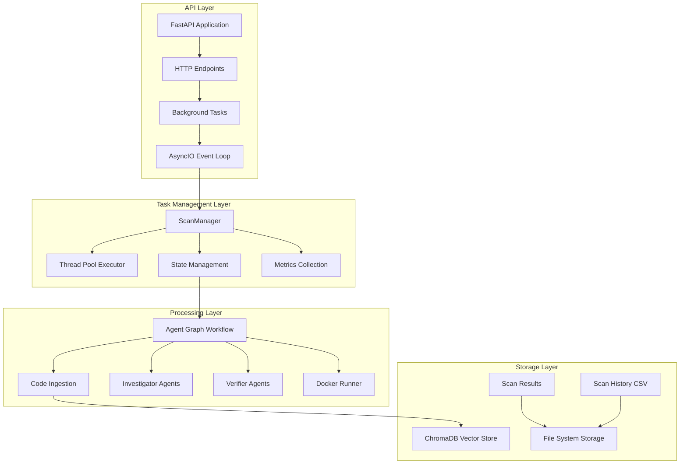

**Diagram sources**
- [main.py](file://autopov/app/main.py#L104-L122)
- [scan_manager.py](file://autopov/app/scan_manager.py#L40-L49)
- [agent_graph.py](file://autopov/app/agent_graph.py#L78-L134)

The architecture employs several key design patterns:

- **Producer-Consumer Pattern**: API endpoints act as producers of background tasks, while worker threads consume and execute them
- **State Machine Pattern**: The Agent Graph implements a finite state machine for vulnerability scanning workflows
- **Strategy Pattern**: Different execution strategies for various scan types (Git, ZIP, Paste)
- **Observer Pattern**: Real-time progress monitoring through event streaming
- **Persistence Pattern**: Automatic JSON and CSV persistence of scan results and history

## Background Task Management

The background task processing system centers around the ScanManager class, which serves as the central coordinator for all vulnerability scanning operations.

### Thread Pool Architecture

The system utilizes a configurable thread pool executor with three worker threads:

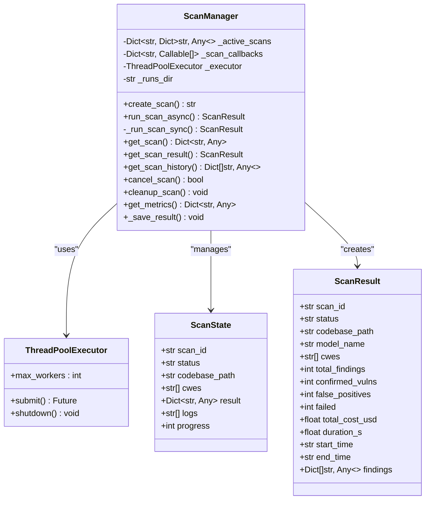

**Diagram sources**
- [scan_manager.py](file://autopov/app/scan_manager.py#L40-L84)
- [scan_manager.py](file://autopov/app/scan_manager.py#L118-L203)

### Task Creation and Registration

The system creates unique scan identifiers and maintains state dictionaries for each active scan:

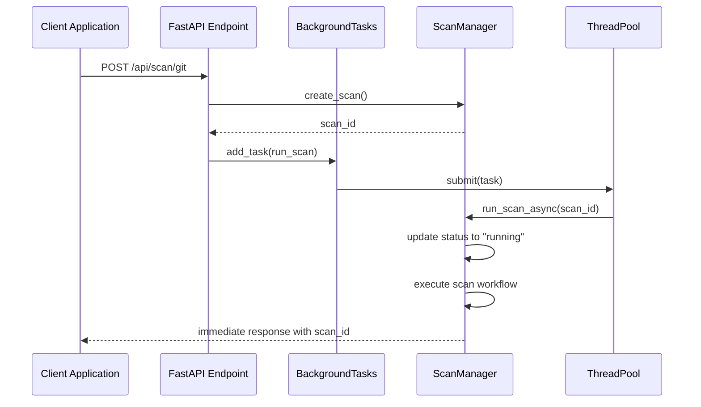

**Diagram sources**
- [main.py](file://autopov/app/main.py#L191-L261)
- [scan_manager.py](file://autopov/app/scan_manager.py#L50-L84)
- [scan_manager.py](file://autopov/app/scan_manager.py#L86-L116)

**Section sources**
- [scan_manager.py](file://autopov/app/scan_manager.py#L40-L84)
- [main.py](file://autopov/app/main.py#L191-L261)

## Scan Lifecycle

The scan lifecycle encompasses multiple phases, each with specific responsibilities and state transitions:

### Phase 1: Initialization and Setup

The scan initialization phase establishes the foundation for vulnerability analysis:

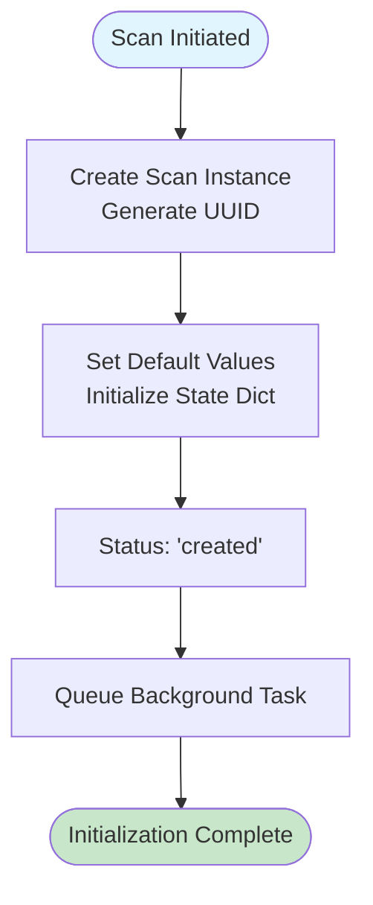

**Diagram sources**
- [scan_manager.py](file://autopov/app/scan_manager.py#L50-L84)

### Phase 2: Source Preparation

Different source types require distinct preparation approaches:

| Source Type | Preparation Steps | Complexity |
|-------------|-------------------|------------|
| Git Repository | Clone with authentication, branch selection, commit checkout | Medium |
| ZIP Upload | Extract archive, validate structure, handle path traversal | High |
| Raw Code | Create temporary file structure, language detection | Low |

### Phase 3: Analysis Execution

The analysis phase executes the LangGraph-based workflow:

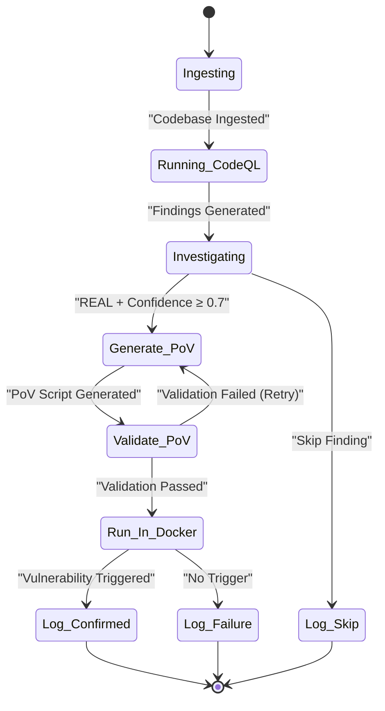

**Diagram sources**
- [agent_graph.py](file://autopov/app/agent_graph.py#L136-L133)

**Section sources**
- [agent_graph.py](file://autopov/app/agent_graph.py#L136-L133)
- [scan_manager.py](file://autopov/app/scan_manager.py#L118-L203)

## Webhook Integration

The system provides comprehensive webhook integration for automated scan triggering:

### GitHub Webhook Processing

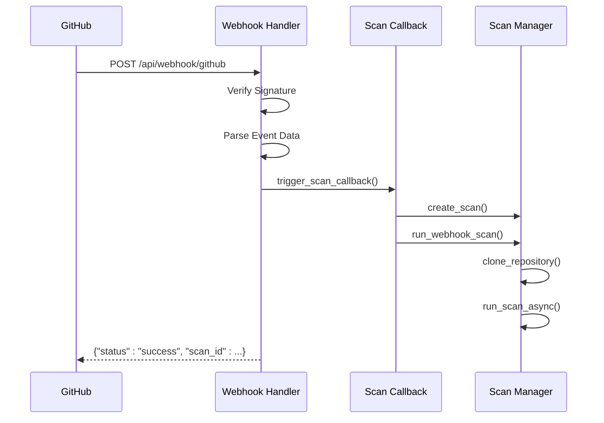

**Diagram sources**
- [webhook_handler.py](file://autopov/app/webhook_handler.py#L196-L265)
- [main.py](file://autopov/app/main.py#L125-L163)

### Event Filtering and Validation

The webhook system implements sophisticated event filtering:

| Event Type | Trigger Condition | Action |
|------------|------------------|---------|
| push | Commit SHA != "0000000000000000000000000000000000000000" | Trigger Scan |
| pull_request | action in ["opened", "synchronize", "reopened"] | Trigger Scan |
| push (GitLab) | Commit present | Trigger Scan |
| merge_request | action in ["open", "update", "reopen"] | Trigger Scan |

**Section sources**
- [webhook_handler.py](file://autopov/app/webhook_handler.py#L75-L194)
- [main.py](file://autopov/app/main.py#L125-L163)

## Task Execution Patterns

The system supports multiple execution patterns tailored to different use cases:

### Pattern 1: Immediate Background Execution

For Git repository scans, the system uses FastAPI's BackgroundTasks:

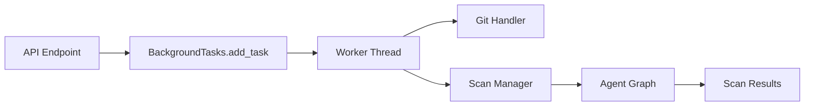

**Diagram sources**
- [main.py](file://autopov/app/main.py#L191-L261)

### Pattern 2: Async/Await Execution

For programmatic access and testing scenarios:

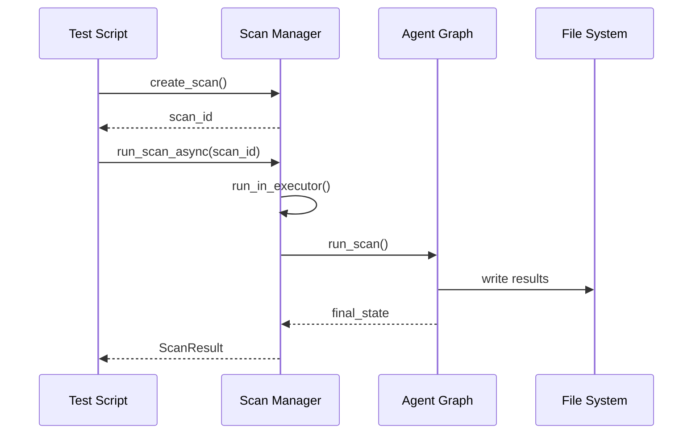

**Diagram sources**
- [test_bg_task.py](file://autopov/test_bg_task.py#L9-L27)
- [scan_manager.py](file://autopov/app/scan_manager.py#L86-L116)

### Pattern 3: Webhook-Driven Execution

Automated execution through webhook callbacks:

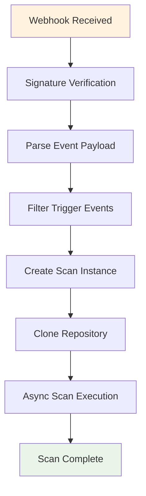

**Diagram sources**
- [main.py](file://autopov/app/main.py#L125-L163)
- [webhook_handler.py](file://autopov/app/webhook_handler.py#L196-L265)

**Section sources**
- [main.py](file://autopov/app/main.py#L191-L261)
- [test_bg_task.py](file://autopov/test_bg_task.py#L9-L27)
- [main.py](file://autopov/app/main.py#L125-L163)

## Monitoring and Debugging

The system provides comprehensive monitoring capabilities through multiple channels:

### Real-Time Status Monitoring

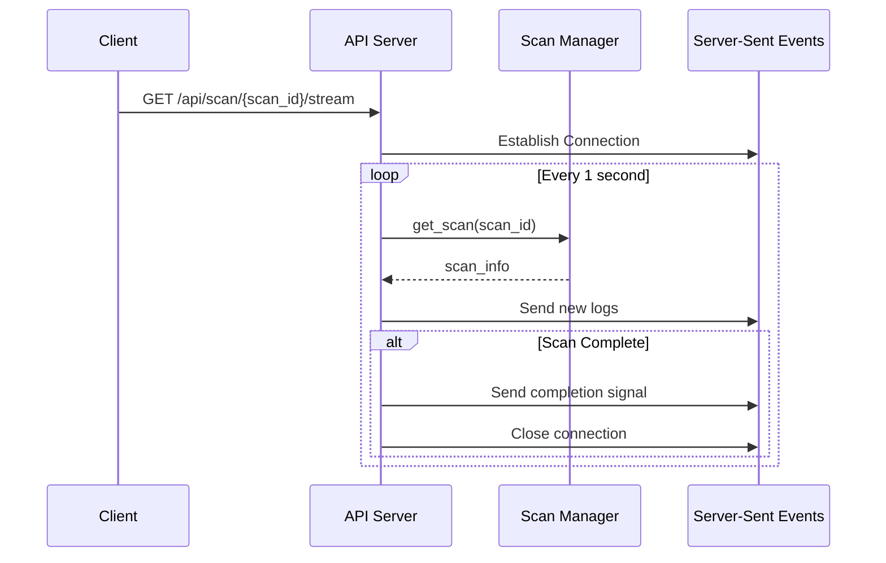

**Diagram sources**
- [main.py](file://autopov/app/main.py#L399-L434)

### CLI Monitoring Tools

The system includes dedicated CLI tools for monitoring:

| Tool | Purpose | Usage |
|------|---------|-------|
| monitor_scan.py | Real-time monitoring | `python3 monitor_scan.py <scan_id>` |
| check_scan.py | Status verification | `python3 check_scan.py` |
| test_bg_task.py | Background task testing | `python3 test_bg_task.py` |

### Persistent State Management

**Updated** The system now features comprehensive persistent state management:

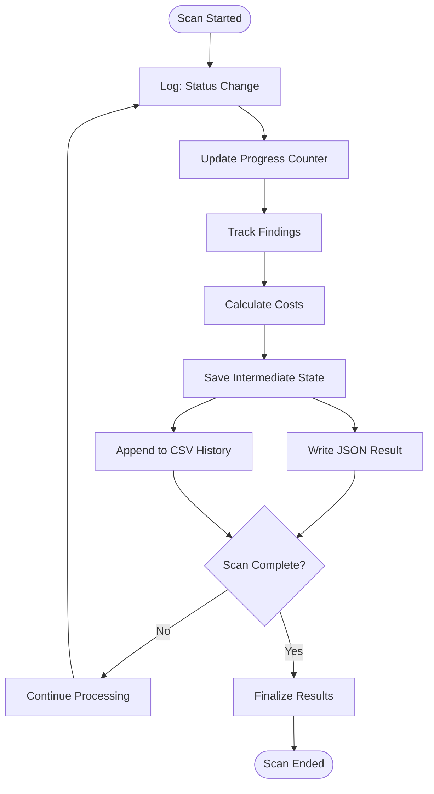

**Diagram sources**
- [agent_graph.py](file://autopov/app/agent_graph.py#L630-L634)
- [scan_manager.py](file://autopov/app/scan_manager.py#L165-L175)

**Section sources**
- [monitor_scan.py](file://autopov/monitor_scan.py#L29-L71)
- [check_scan.py](file://autopov/check_scan.py#L10-L16)
- [main.py](file://autopov/app/main.py#L399-L434)

## Performance Considerations

The background task processing system incorporates several performance optimization strategies:

### Concurrency Management

- **Thread Pool Size**: Configurable maximum of 3 concurrent scans to balance resource utilization
- **Asynchronous I/O**: Non-blocking operations for external service calls
- **Memory Management**: Automatic cleanup of temporary files and Docker containers

### Resource Optimization

| Resource Type | Optimization Strategy | Benefit |
|---------------|----------------------|---------|
| CPU | Thread pool with bounded concurrency | Prevents resource exhaustion |
| Memory | Temporary file cleanup after processing | Reduces memory footprint |
| Network | Timeout-based operations | Prevents hanging connections |
| Storage | Incremental result saving | Enables recovery from failures |

### Scalability Patterns

The system supports horizontal scaling through:

- **Distributed Workers**: Multiple instances can process different scan queues
- **Load Balancing**: Round-robin distribution of scan tasks
- **Resource Pooling**: Shared vector store and model resources

### Metrics Collection

**Updated** The system now provides comprehensive metrics collection:

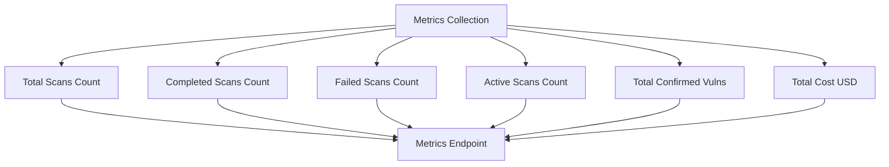

**Diagram sources**
- [scan_manager.py](file://autopov/app/scan_manager.py#L308-L338)

**Section sources**
- [scan_manager.py](file://autopov/app/scan_manager.py#L308-L338)

## Troubleshooting Guide

Common issues and their solutions:

### Task Execution Issues

**Problem**: Background tasks not executing
- **Cause**: Thread pool exhausted or blocked
- **Solution**: Check thread pool configuration and increase max_workers if needed

**Problem**: Scans stuck in "created" status
- **Cause**: Missing BackgroundTasks dependency
- **Solution**: Ensure BackgroundTasks parameter is properly injected in endpoints

### Webhook Integration Problems

**Problem**: Webhook signatures failing
- **Cause**: Incorrect secret configuration
- **Solution**: Verify WEBHOOK_SECRET environment variable matches provider configuration

**Problem**: Repository access denied
- **Cause**: Missing or invalid Git tokens
- **Solution**: Configure appropriate GITHUB_TOKEN, GITLAB_TOKEN, or BITBUCKET_TOKEN

### Resource Management Issues

**Problem**: Out of memory errors
- **Cause**: Large repository processing
- **Solution**: Implement repository size limits and consider ZIP upload alternative

**Problem**: Docker execution failures
- **Cause**: Docker daemon not available
- **Solution**: Verify Docker installation and permissions

**Problem**: Persistent state corruption
- **Cause**: File system issues or permission problems
- **Solution**: Check RUNS_DIR permissions and disk space availability

**Section sources**
- [git_handler.py](file://autopov/app/git_handler.py#L25-L44)
- [webhook_handler.py](file://autopov/app/webhook_handler.py#L25-L74)
- [config.py](file://autopov/app/config.py#L144-L180)

## Conclusion

The AutoPoV background task processing system demonstrates a robust and scalable approach to autonomous vulnerability scanning. By combining FastAPI's BackgroundTasks with custom thread pool management and LangGraph-based workflows, the system achieves:

- **Responsiveness**: Immediate API responses while performing long-running operations
- **Scalability**: Configurable concurrency with resource management
- **Reliability**: Comprehensive error handling and recovery mechanisms
- **Flexibility**: Support for multiple input sources and execution patterns
- **Persistence**: Automatic JSON and CSV persistence of scan results and history
- **Observability**: Comprehensive metrics collection and monitoring capabilities

The system's architecture provides a solid foundation for extending vulnerability detection capabilities while maintaining performance and reliability. The redesigned scan management system with asynchronous execution, thread pool processing, persistent state management, and comprehensive metrics collection represents a significant advancement in automated vulnerability assessment technology.

Future enhancements could include distributed task queuing, advanced retry mechanisms, enhanced monitoring capabilities, and integration with external vulnerability management systems.