# Core Architecture

<cite>
**Referenced Files in This Document**
- [main.py](file://app/main.py)
- [agent_graph.py](file://app/agent_graph.py)
- [config.py](file://app/config.py)
- [scan_manager.py](file://app/scan_manager.py)
- [ingest_codebase.py](file://agents/ingest_codebase.py)
- [investigator.py](file://agents/investigator.py)
- [verifier.py](file://agents/verifier.py)
- [docker_runner.py](file://agents/docker_runner.py)
- [git_handler.py](file://app/git_handler.py)
- [source_handler.py](file://app/source_handler.py)
- [webhook_handler.py](file://app/webhook_handler.py)
- [prompts.py](file://prompts.py)
- [requirements.txt](file://requirements.txt)
- [package.json](file://frontend/package.json)
</cite>

## Update Summary
**Changes Made**
- Enhanced thread-safe log management with dedicated scan-specific locks
- Improved asynchronous processing capabilities with enhanced ThreadPoolExecutor
- Comprehensive result persistence with JSON and CSV storage
- Enhanced scan manager functionality with replay capabilities and metrics
- Real-time log streaming with thread-safe append operations

## Table of Contents
1. [Introduction](#introduction)
2. [Project Structure](#project-structure)
3. [Core Components](#core-components)
4. [Architecture Overview](#architecture-overview)
5. [Detailed Component Analysis](#detailed-component-analysis)
6. [Enhanced Backend Infrastructure](#enhanced-backend-infrastructure)
7. [Dependency Analysis](#dependency-analysis)
8. [Performance Considerations](#performance-considerations)
9. [Security Architecture](#security-architecture)
10. [Monitoring and Observability](#monitoring-and-observability)
11. [Infrastructure and Deployment](#infrastructure-and-deployment)
12. [Troubleshooting Guide](#troubleshooting-guide)
13. [Conclusion](#conclusion)

## Introduction
This document describes AutoPoV's core system architecture with a focus on the agent-based workflow and system design patterns. The system integrates a FastAPI backend, a React frontend, a LangGraph-based agent orchestration engine, and external tools (CodeQL, Joern, Docker) to deliver an autonomous Proof-of-Vulnerability (PoV) pipeline. It covers the agent graph orchestrator, specialized agents (ingest, investigate, verify, docker runner), workflow management, data flow, security controls, and operational considerations.

**Updated** Enhanced backend infrastructure now includes improved asynchronous processing capabilities, thread-safe log management, comprehensive result persistence, and enhanced scan manager functionality for better scalability and reliability.

## Project Structure
AutoPoV is organized into cohesive modules:
- Backend: FastAPI application, configuration, scan management, Git and source handlers, webhook handler, and report generator
- Agents: Specialized modules implementing ingestion, investigation, verification, and Docker execution
- Frontend: React SPA built with Vite and Tailwind
- Supporting assets: Prompts, queries, and requirements

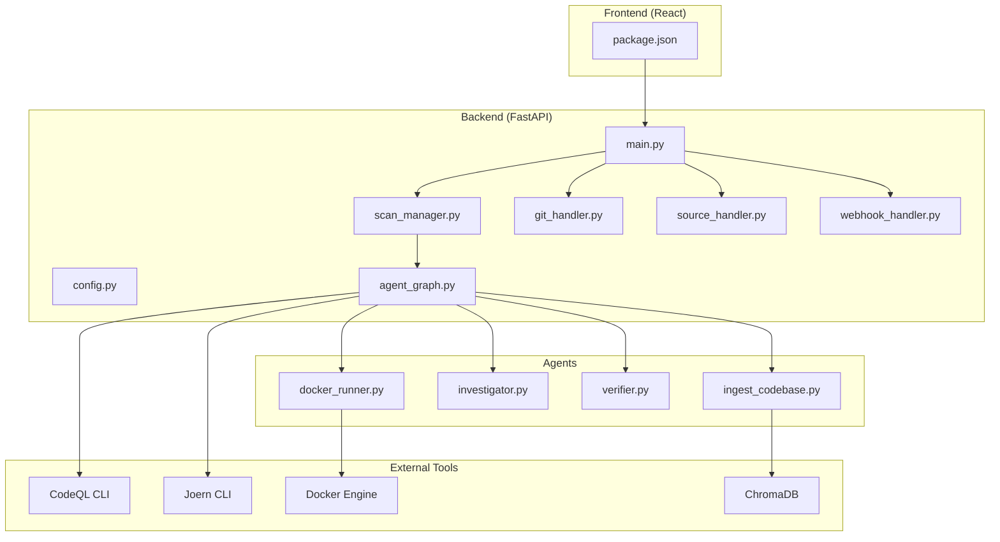

**Diagram sources**
- [main.py:114-122](file://app/main.py#L114-L122)
- [agent_graph.py:85-171](file://app/agent_graph.py#L85-L171)
- [config.py:13-249](file://app/config.py#L13-L249)
- [scan_manager.py:47-111](file://app/scan_manager.py#L47-L111)

**Section sources**
- [main.py:114-122](file://app/main.py#L114-L122)
- [agent_graph.py:85-171](file://app/agent_graph.py#L85-L171)
- [config.py:13-249](file://app/config.py#L13-L249)

## Core Components
- FastAPI backend: Exposes REST endpoints for initiating scans, streaming logs, retrieving results, managing API keys, and webhook integrations. Implements CORS, health checks, and request validation.
- Agent Graph (LangGraph): Orchestrates the vulnerability detection workflow across nodes: ingest, run CodeQL, investigate, generate PoV, validate PoV, run in Docker, and logging outcomes.
- Specialized Agents:
  - Code Ingester: Chunks code, generates embeddings, persists to ChromaDB.
  - Investigator: Uses LLMs and optional Joern to assess findings.
  - Verifier: Generates and validates PoV scripts with static and LLM-based checks.
  - Docker Runner: Executes PoVs in isolated containers with resource limits.
- Enhanced Scan Manager: Manages scan lifecycle, persistence, metrics, background execution, and thread-safe log management with comprehensive result storage.
- Handlers: Git handler clones repositories with provider credentials; source handler supports ZIP/tar/raw uploads; webhook handler validates and parses provider events.
- Configuration: Centralized settings for models, tools, Docker, paths, and availability checks.

**Updated** Enhanced Scan Manager now provides comprehensive result persistence with JSON and CSV storage, thread-safe log management with dedicated locks, and advanced replay capabilities for historical findings.

**Section sources**
- [main.py:175-689](file://app/main.py#L175-L689)
- [agent_graph.py:85-1079](file://app/agent_graph.py#L85-L1079)
- [scan_manager.py:47-549](file://app/scan_manager.py#L47-L549)
- [config.py:13-249](file://app/config.py#L13-L249)

## Architecture Overview
The system follows an agent-based workflow orchestrated by LangGraph. The FastAPI backend accepts diverse inputs (Git repositories, ZIP archives, raw code), normalizes them, and delegates to the agent graph. The agent graph coordinates specialized agents and external tools to produce verified PoVs executed inside Docker containers.

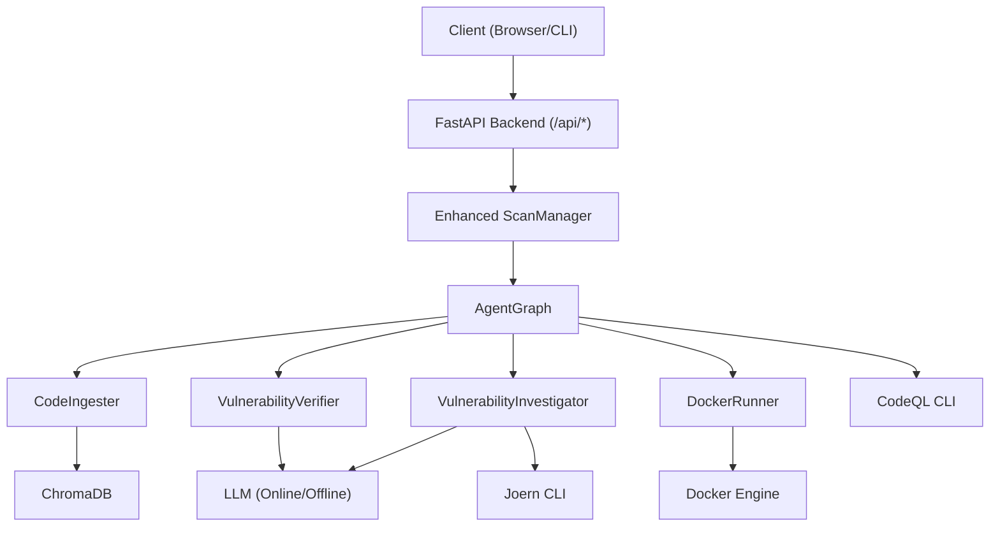

**Updated** The enhanced architecture now includes comprehensive result persistence, thread-safe log management, and advanced replay capabilities for improved reliability and observability.

**Diagram sources**
- [main.py:175-689](file://app/main.py#L175-L689)
- [agent_graph.py:85-1079](file://app/agent_graph.py#L85-L1079)
- [scan_manager.py:364-414](file://app/scan_manager.py#L364-L414)

## Detailed Component Analysis

### Agent Graph Orchestration
The AgentGraph defines a state machine with nodes and conditional edges:
- Nodes: ingest_code, run_codeql, investigate, generate_pov, validate_pov, run_in_docker, log_confirmed, log_skip, log_failure
- Edges: Deterministic transitions from ingestion to CodeQL, then investigation; conditional branching based on confidence and validation outcomes; final logging nodes.

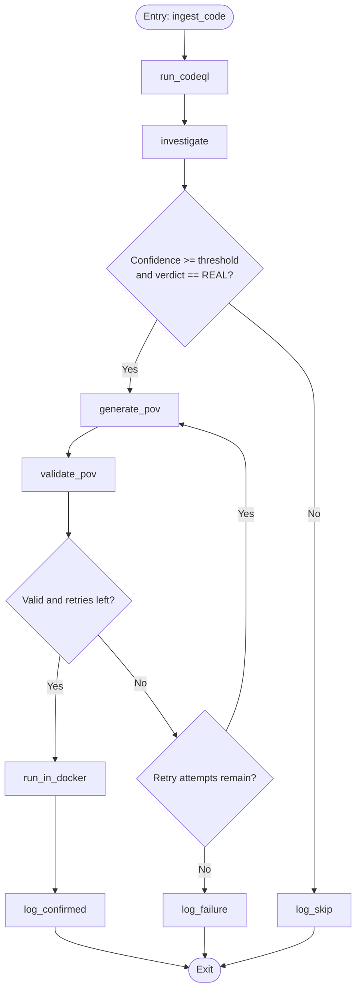

**Diagram sources**
- [agent_graph.py:944-978](file://app/agent_graph.py#L944-L978)
- [agent_graph.py:1027-1069](file://app/agent_graph.py#L1027-L1069)

**Section sources**
- [agent_graph.py:85-1079](file://app/agent_graph.py#L85-L1079)

### Specialized Agents

#### Code Ingester
- Responsibilities: Text splitting, embedding selection (online/offline), ChromaDB persistence, retrieval, and cleanup.
- Key behaviors: Language detection, binary file filtering, chunking with overlap, batched embedding insertion.

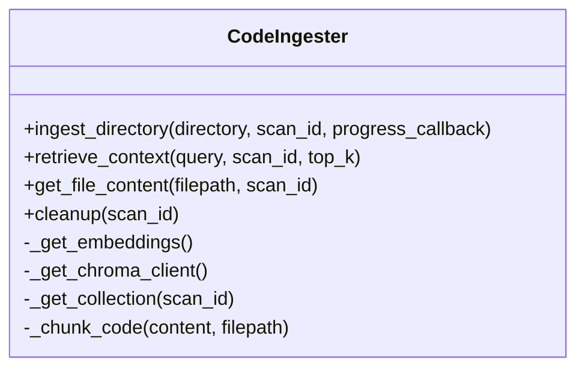

**Diagram sources**
- [ingest_codebase.py:41-407](file://agents/ingest_codebase.py#L41-L407)

**Section sources**
- [ingest_codebase.py:41-407](file://agents/ingest_codebase.py#L41-L407)

#### Vulnerability Investigator
- Responsibilities: Construct context (file content and RAG), optionally run Joern for CWE-416, call LLM to decide REAL/FALSE_POSITIVE, and compute inference cost/time.
- Integrations: LLM provider selection, LangSmith tracing, optional Joern CPG analysis.

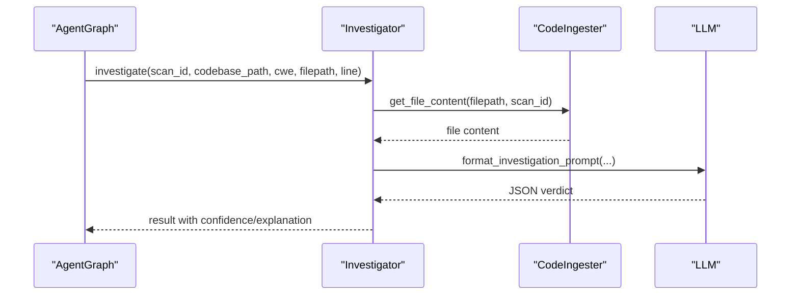

**Diagram sources**
- [investigator.py:254-366](file://agents/investigator.py#L254-L366)
- [prompts.py:245-261](file://prompts.py#L245-L261)

**Section sources**
- [investigator.py:37-413](file://agents/investigator.py#L37-L413)
- [prompts.py:7-44](file://prompts.py#L7-L44)

#### Vulnerability Verifier
- Responsibilities: Generate PoV scripts with strict constraints, validate syntax and standard library usage, CWE-specific checks, and optional LLM validation.
- Outputs: Deterministic PoVs that print a specific trigger phrase.

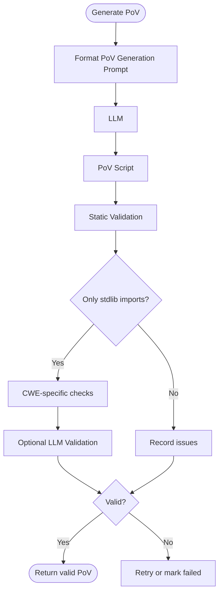

**Diagram sources**
- [verifier.py:79-227](file://agents/verifier.py#L79-L227)
- [prompts.py:264-295](file://prompts.py#L264-L295)

**Section sources**
- [verifier.py:40-401](file://agents/verifier.py#L40-L401)
- [prompts.py:81-109](file://prompts.py#L81-L109)

#### Docker Runner
- Responsibilities: Execute PoVs in isolated containers with CPU/memory limits, no network access, and bounded runtime.
- Outputs: Execution status, stdout/stderr, and trigger detection.

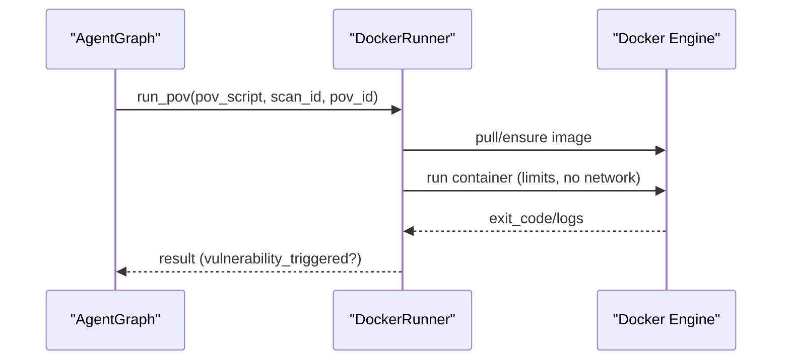

**Diagram sources**
- [docker_runner.py:62-192](file://agents/docker_runner.py#L62-L192)

**Section sources**
- [docker_runner.py:27-379](file://agents/docker_runner.py#L27-L379)

### Workflow Management
- Enhanced ScanManager creates and tracks scans, executes the agent graph in a thread pool, persists results, and maintains metrics with comprehensive storage.
- Endpoints accept Git URLs, ZIP uploads, and raw code; they delegate to handlers and scan manager.

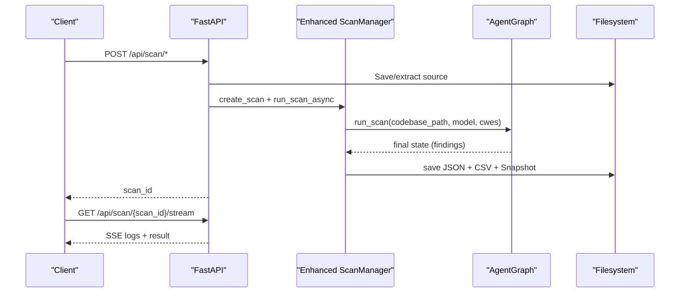

**Updated** The enhanced workflow now includes comprehensive result persistence with JSON and CSV storage, thread-safe log management, and snapshot creation for replay capabilities.

**Diagram sources**
- [main.py:200-376](file://app/main.py#L200-L376)
- [scan_manager.py:231-334](file://app/scan_manager.py#L231-L334)
- [agent_graph.py:1027-1069](file://app/agent_graph.py#L1027-L1069)

**Section sources**
- [scan_manager.py:47-549](file://app/scan_manager.py#L47-L549)
- [main.py:200-376](file://app/main.py#L200-L376)

### Data Flow Through the System
- Inputs: Git repository URL, ZIP archive, or raw code paste.
- Normalization: Git handler clones with credentials; source handler extracts and sanitizes uploads.
- Processing: Agent graph orchestrates ingestion, CodeQL/joern analysis, investigation, PoV generation/validation, and Docker execution.
- Outputs: Persisted results, logs, and reports.

```mermaid
flowchart LR
Input["Input Source"] --> Normalize["Normalize Source"]
Normalize --> Ingest["Ingest Code Chunks"]
Ingest --> CodeQL["CodeQL Analysis"]
CodeQL --> Investigate["Investigate Findings"]
Investigate --> PoVGen["Generate PoV"]
PoVGen --> Validate["Validate PoV"]
Validate --> Docker["Execute in Docker"]
Docker --> Persist["Comprehensive Persistence"]
Persist --> Report["Generate Reports"]
```

**Updated** The enhanced data flow now includes comprehensive result persistence with JSON and CSV storage, thread-safe log management, and snapshot creation for replay capabilities.

**Diagram sources**
- [git_handler.py:60-124](file://app/git_handler.py#L60-L124)
- [source_handler.py:31-231](file://app/source_handler.py#L31-L231)
- [agent_graph.py:181-310](file://app/agent_graph.py#L181-L310)
- [scan_manager.py:364-414](file://app/scan_manager.py#L364-L414)

**Section sources**
- [git_handler.py:18-222](file://app/git_handler.py#L18-L222)
- [source_handler.py:18-380](file://app/source_handler.py#L18-L380)
- [agent_graph.py:181-310](file://app/agent_graph.py#L181-L310)
- [scan_manager.py:364-414](file://app/scan_manager.py#L364-L414)

## Enhanced Backend Infrastructure

### Thread-Safe Log Management
The enhanced backend now provides comprehensive thread-safe log management with dedicated scan-specific locks:

- **Scan-Specific Locks**: Each active scan maintains its own threading lock for atomic log operations
- **Real-Time Streaming**: Logs are immediately appended to both agent state and scan manager for SSE streaming
- **Thread-Safe Operations**: All log append operations use context-managed locks to prevent race conditions
- **Fallback Mechanisms**: Graceful degradation when lock acquisition fails

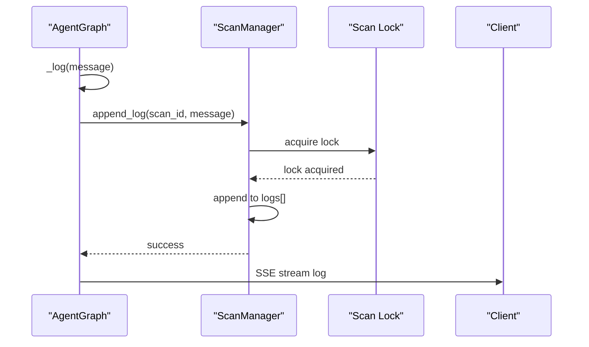

**Diagram sources**
- [scan_manager.py:420-444](file://app/scan_manager.py#L420-L444)
- [agent_graph.py:996-1011](file://app/agent_graph.py#L996-L1011)

**Section sources**
- [scan_manager.py:420-444](file://app/scan_manager.py#L420-L444)
- [agent_graph.py:996-1011](file://app/agent_graph.py#L996-L1011)

### Comprehensive Result Persistence
The enhanced scan manager now provides multi-format result persistence:

- **JSON Storage**: Complete scan results with findings, logs, and metadata
- **CSV History**: Structured scan history for analytics and reporting
- **Snapshot Creation**: Optional codebase snapshots for replay capabilities
- **Atomic Operations**: Thread-safe result writing with proper error handling

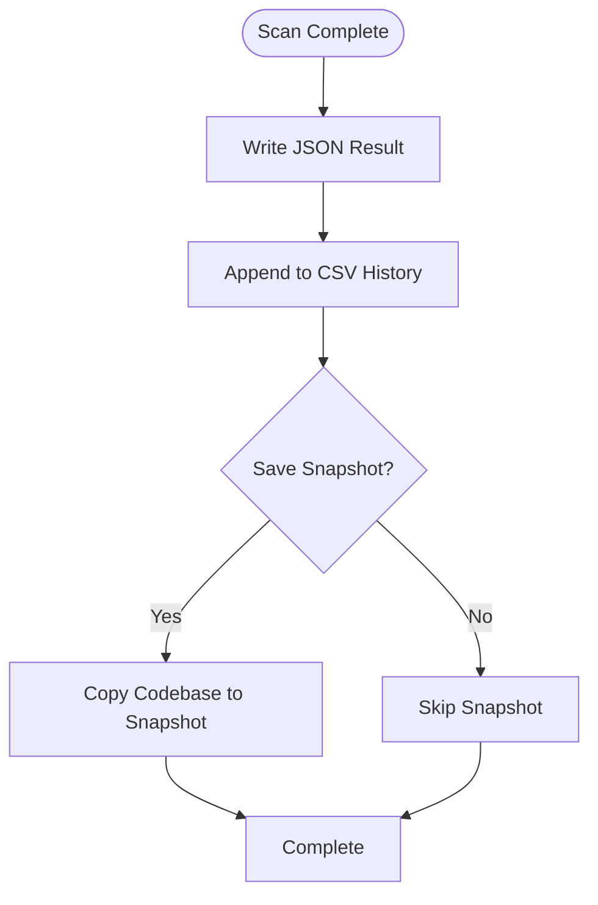

**Diagram sources**
- [scan_manager.py:364-414](file://app/scan_manager.py#L364-L414)

**Section sources**
- [scan_manager.py:364-414](file://app/scan_manager.py#L364-L414)

### Enhanced Async Processing
The backend now supports improved asynchronous processing:

- **ThreadPoolExecutor**: Configurable thread pool for concurrent scan execution
- **Async/Await Patterns**: Proper async/await usage for non-blocking operations
- **Event Loop Management**: Dedicated event loops for background tasks
- **Background Task Integration**: Seamless integration with FastAPI background tasks

**Section sources**
- [scan_manager.py:69-69](file://app/scan_manager.py#L69-L69)
- [main.py:253-261](file://app/main.py#L253-L261)

### Advanced Scan Manager Features
The enhanced scan manager includes:

- **Replay Capabilities**: Support for replaying findings with different models
- **Metrics Collection**: Comprehensive system metrics and statistics
- **History Management**: Structured scan history with pagination
- **Resource Cleanup**: Automatic cleanup of temporary files and vector stores

**Section sources**
- [scan_manager.py:114-136](file://app/scan_manager.py#L114-L136)
- [scan_manager.py:457-478](file://app/scan_manager.py#L457-L478)
- [scan_manager.py:509-539](file://app/scan_manager.py#L509-L539)

## Dependency Analysis
- Internal dependencies: FastAPI routes depend on scan manager; scan manager depends on agent graph; agent graph depends on agents and external tool availability checks.
- External dependencies: LangChain/LangGraph for LLM orchestration, ChromaDB for embeddings, Docker SDK for containerization, GitPython for repository cloning.

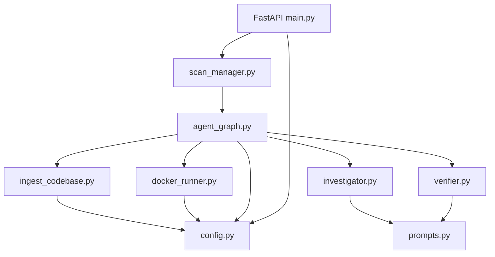

**Diagram sources**
- [main.py:19-26](file://app/main.py#L19-L26)
- [scan_manager.py:17-20](file://app/scan_manager.py#L17-L20)
- [agent_graph.py:22-31](file://app/agent_graph.py#L22-L31)
- [prompts.py:1-374](file://prompts.py#L1-L374)
- [config.py:13-249](file://app/config.py#L13-L249)

**Section sources**
- [requirements.txt:1-42](file://requirements.txt#L1-L42)
- [main.py:19-26](file://app/main.py#L19-L26)
- [scan_manager.py:17-20](file://app/scan_manager.py#L17-L20)
- [agent_graph.py:22-31](file://app/agent_graph.py#L22-L31)

## Performance Considerations
- Asynchronous execution: Background tasks and thread pool executor enable concurrency for long-running scans.
- Batched ingestion: ChromaDB embeddings are inserted in batches to reduce overhead.
- Resource limits: Docker runner enforces CPU, memory, and timeout constraints to prevent runaway workloads.
- Cost control: Inference time-based cost estimation and configurable maximum cost thresholds.
- Scalability: Stateless agents and persistent state in files/CSV enable horizontal scaling behind a load balancer.
- Thread safety: Dedicated locks prevent race conditions in concurrent environments.
- Memory management: Automatic cleanup of temporary files and vector stores.

**Updated** Enhanced performance considerations now include thread-safe operations, comprehensive result persistence, and improved resource management for better scalability.

## Security Architecture
- Docker isolation: Containers run without network access, with memory and CPU quotas; images are pulled if missing; temp directories are cleaned up.
- Input validation: ZIP/TAR extraction includes path-traversal checks; raw code and file uploads sanitize filenames and paths.
- Authentication: API key verification for most endpoints; admin-only key management endpoints.
- Tool availability: Runtime checks for Docker, CodeQL, and Joern; fallbacks when unavailable.
- Secrets management: Provider tokens and webhook secrets are loaded from environment variables.
- Thread safety: Atomic operations prevent data corruption in concurrent environments.
- Result integrity: Multi-format persistence ensures reliable data recovery.

**Updated** Enhanced security now includes thread-safe operations, comprehensive result persistence, and improved input validation for better reliability.

**Section sources**
- [docker_runner.py:62-192](file://agents/docker_runner.py#L62-L192)
- [source_handler.py:55-63](file://app/source_handler.py#L55-L63)
- [main.py:475-508](file://app/main.py#L475-L508)
- [config.py:157-205](file://app/config.py#L157-L205)
- [git_handler.py:25-42](file://app/git_handler.py#L25-L42)

## Monitoring and Observability
- Logging: Agent graph appends timestamped logs to state; SSE endpoint streams logs to clients with thread-safe operations.
- Metrics: Scan manager exposes metrics including counts of scans, confirmed vulnerabilities, and total cost.
- Tracing: Optional LangSmith integration for LLM tracing when enabled.
- Real-time streaming: Enhanced SSE implementation with atomic log operations.
- History tracking: Comprehensive scan history with structured CSV storage.

**Updated** Enhanced monitoring now includes thread-safe log management, comprehensive result persistence, and advanced metrics collection.

**Section sources**
- [agent_graph.py:1002-1011](file://app/agent_graph.py#L1002-L1011)
- [main.py:534-537](file://app/main.py#L534-L537)
- [scan_manager.py:509-539](file://app/scan_manager.py#L509-L539)
- [investigator.py:44-48](file://agents/investigator.py#L44-L48)

## Infrastructure and Deployment
- Technology stack: FastAPI, LangGraph, LangChain, ChromaDB, Docker, GitPython, React/Vite/Tailwind.
- Environment configuration: Extensive settings for models, tools, Docker, paths, and secrets.
- Frontend: React SPA with routing and charting libraries; packaged via Vite.
- Scalability: Thread-safe operations and comprehensive persistence support horizontal scaling.
- Reliability: Atomic operations and multi-format storage ensure data integrity.

**Updated** Enhanced infrastructure now supports improved scalability, reliability, and observability through thread-safe operations and comprehensive persistence.

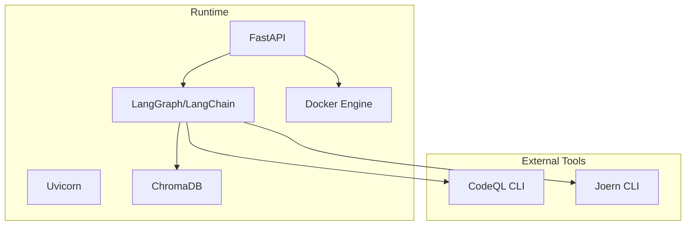

**Diagram sources**
- [requirements.txt:1-42](file://requirements.txt#L1-L42)
- [config.py:74-98](file://app/config.py#L74-L98)
- [main.py:682-689](file://app/main.py#L682-L689)

**Section sources**
- [requirements.txt:1-42](file://requirements.txt#L1-L42)
- [config.py:13-249](file://app/config.py#L13-L249)
- [package.json:1-34](file://frontend/package.json#L1-L34)

## Troubleshooting Guide
- Docker not available: Health endpoint indicates Docker availability; DockerRunner returns failure with stderr when disabled or unreachable.
- CodeQL/Joern missing: Agent graph falls back to LLM-only analysis; availability checks return false when CLIs are not installed.
- Webhook validation failures: Signature/token mismatches return explicit error messages; ensure secrets match provider configurations.
- Scan stuck or failing: Use status endpoint to inspect logs; confirm tool availability and resource limits.
- Thread safety issues: Monitor for race conditions in concurrent environments; enhanced locks prevent data corruption.
- Persistence failures: Check file permissions and disk space for JSON/CSV storage operations.
- Replay issues: Verify snapshot availability and codebase path for replay operations.

**Updated** Enhanced troubleshooting now includes thread safety, persistence, and replay-related issues.

**Section sources**
- [main.py:175-185](file://app/main.py#L175-L185)
- [agent_graph.py:258-264](file://app/agent_graph.py#L258-L264)
- [webhook_handler.py:213-265](file://app/webhook_handler.py#L213-L265)
- [docker_runner.py:81-91](file://agents/docker_runner.py#L81-L91)

## Conclusion
AutoPoV implements a robust agent-based architecture that combines LLM-driven reasoning with static analysis and controlled execution. The LangGraph orchestrator coordinates ingestion, analysis, PoV generation, validation, and Docker execution, while the FastAPI backend provides a secure, observable interface. Security is enforced through Docker isolation, input sanitization, and strict validation. The enhanced backend infrastructure now provides improved asynchronous processing capabilities, thread-safe log management, comprehensive result persistence, and enhanced scan manager functionality, supporting better scalability, reliability, and observability. The modular design supports scalability and maintainability, with clear separation of concerns across agents, handlers, and configuration.

**Updated** The enhanced backend infrastructure significantly improves the system's reliability, scalability, and observability through comprehensive thread-safe operations, multi-format result persistence, and advanced scan management capabilities.