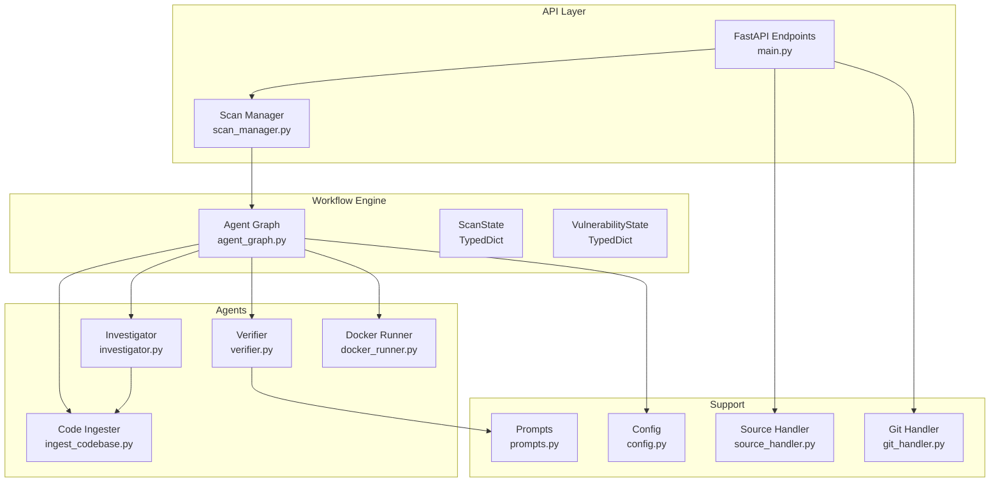
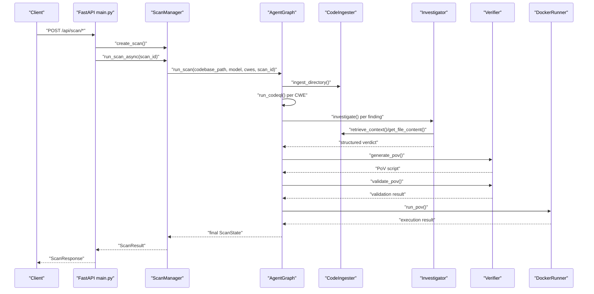
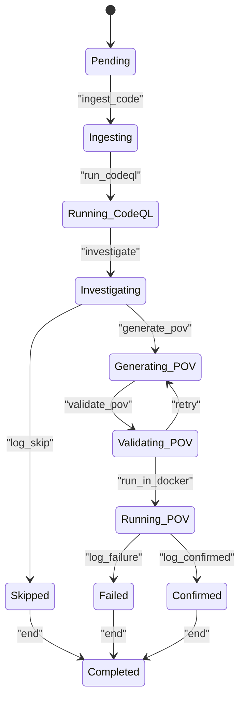
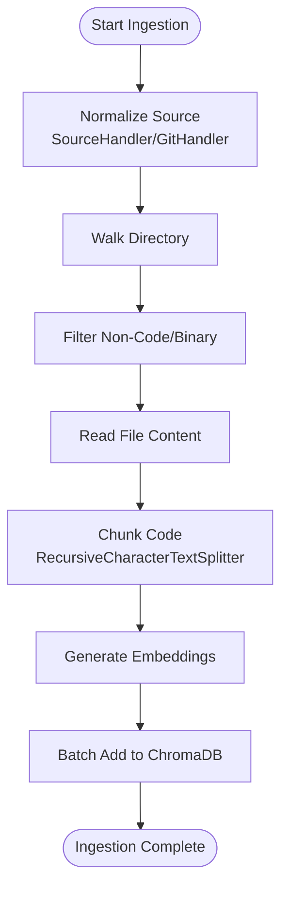
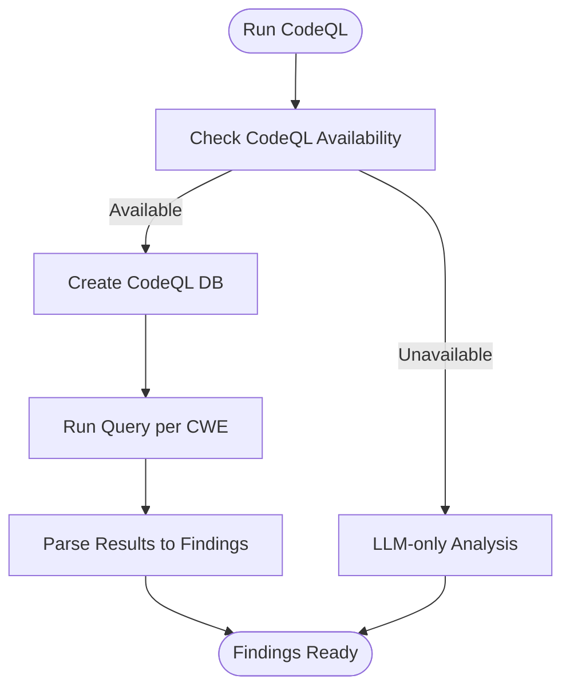
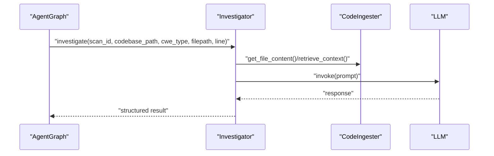
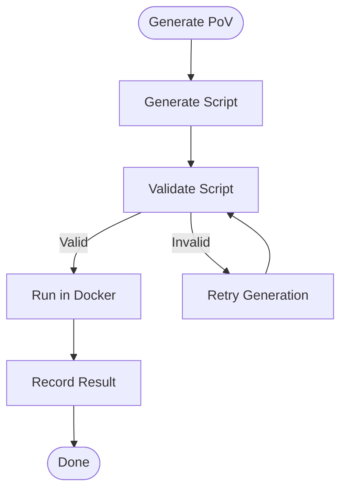
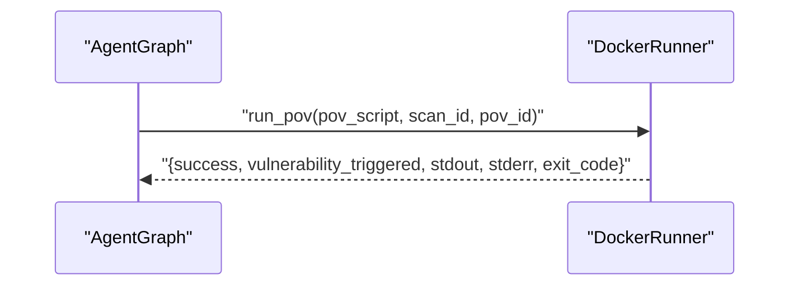
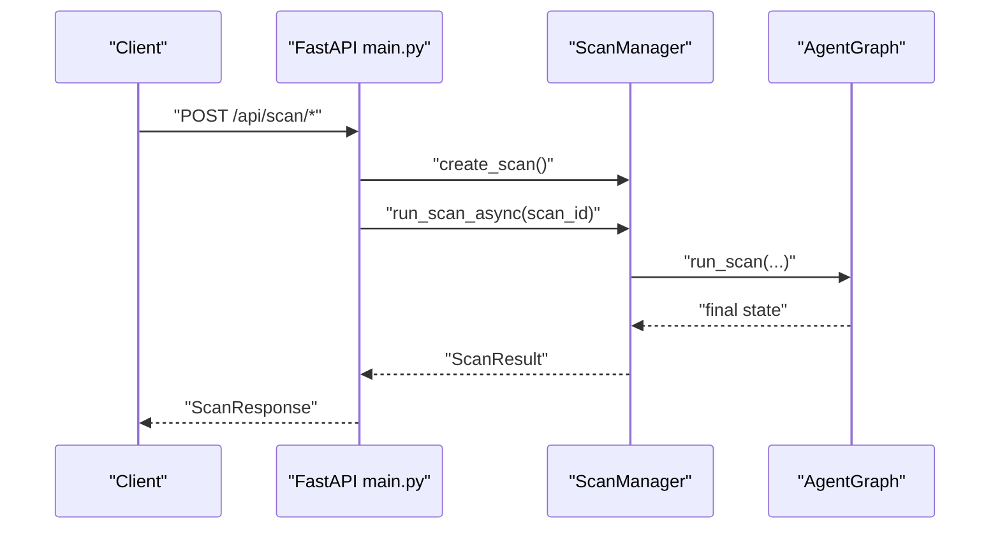
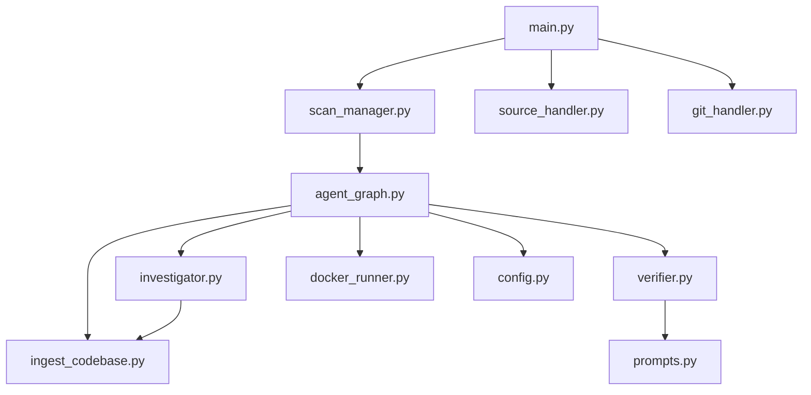

# Data Flow and Processing Pipeline

<cite>
**Referenced Files in This Document**
- [main.py](file://autopov/app/main.py)
- [agent_graph.py](file://autopov/app/agent_graph.py)
- [scan_manager.py](file://autopov/app/scan_manager.py)
- [config.py](file://autopov/app/config.py)
- [ingest_codebase.py](file://autopov/agents/ingest_codebase.py)
- [investigator.py](file://autopov/agents/investigator.py)
- [verifier.py](file://autopov/agents/verifier.py)
- [docker_runner.py](file://autopov/agents/docker_runner.py)
- [source_handler.py](file://autopov/app/source_handler.py)
- [git_handler.py](file://autopov/app/git_handler.py)
- [prompts.py](file://autopov/prompts.py)
</cite>

## Table of Contents
1. [Introduction](#introduction)
2. [Project Structure](#project-structure)
3. [Core Components](#core-components)
4. [Architecture Overview](#architecture-overview)
5. [Detailed Component Analysis](#detailed-component-analysis)
6. [Dependency Analysis](#dependency-analysis)
7. [Performance Considerations](#performance-considerations)
8. [Troubleshooting Guide](#troubleshooting-guide)
9. [Conclusion](#conclusion)

## Introduction
This document explains AutoPoV’s end-to-end vulnerability detection workflow, focusing on the data flow and processing pipeline from raw code ingestion through final PoV execution. It details how state evolves across stages using ScanState and VulnerabilityState, how external tools (CodeQL, LLMs) integrate with internal processing, and how file processing, vector store operations, and result aggregation are orchestrated. It also covers batch processing across multiple CWE types, sequential handling of individual findings, error propagation and fallbacks, and cost estimation and resource tracking.

## Project Structure
AutoPoV is organized into:
- Backend API and orchestration: FastAPI endpoints, scan manager, agent graph workflow
- Agents: code ingestion, vulnerability investigation, PoV generation/verification, Docker execution
- Supporting utilities: source handling (ZIP, raw paste), Git cloning, configuration, prompts

**Diagram sources**
- [main.py](file://autopov/app/main.py#L175-L313)
- [scan_manager.py](file://autopov/app/scan_manager.py#L86-L116)
- [agent_graph.py](file://autopov/app/agent_graph.py#L78-L134)
- [ingest_codebase.py](file://autopov/agents/ingest_codebase.py#L41-L59)
- [investigator.py](file://autopov/agents/investigator.py#L37-L87)
- [verifier.py](file://autopov/agents/verifier.py#L40-L77)
- [docker_runner.py](file://autopov/agents/docker_runner.py#L27-L48)
- [config.py](file://autopov/app/config.py#L13-L210)
- [source_handler.py](file://autopov/app/source_handler.py#L18-L30)
- [git_handler.py](file://autopov/app/git_handler.py#L18-L42)
- [prompts.py](file://autopov/prompts.py#L7-L374)

**Section sources**
- [main.py](file://autopov/app/main.py#L175-L313)
- [agent_graph.py](file://autopov/app/agent_graph.py#L78-L134)
- [scan_manager.py](file://autopov/app/scan_manager.py#L40-L84)

## Core Components
- FastAPI endpoints accept scan requests from Git, ZIP uploads, or raw paste, then delegate to the scan manager.
- ScanManager orchestrates asynchronous execution, manages scan state, and persists results.
- AgentGraph defines the LangGraph workflow with nodes for ingestion, CodeQL, investigation, PoV generation/validation, Docker execution, and logging outcomes.
- CodeIngester chunks code, embeds into ChromaDB, and retrieves context for RAG.
- Investigator uses LLMs to analyze findings and produce structured verdicts.
- Verifier generates and validates PoV scripts, then suggests improvements on failures.
- DockerRunner executes PoVs in isolated containers with safety constraints.
- SourceHandler and GitHandler normalize diverse inputs into a unified source directory.
- Prompts define the templates for investigation, PoV generation/validation, and retry analysis.

**Section sources**
- [main.py](file://autopov/app/main.py#L175-L313)
- [scan_manager.py](file://autopov/app/scan_manager.py#L40-L84)
- [agent_graph.py](file://autopov/app/agent_graph.py#L78-L134)
- [ingest_codebase.py](file://autopov/agents/ingest_codebase.py#L41-L59)
- [investigator.py](file://autopov/agents/investigator.py#L37-L87)
- [verifier.py](file://autopov/agents/verifier.py#L40-L77)
- [docker_runner.py](file://autopov/agents/docker_runner.py#L27-L48)
- [source_handler.py](file://autopov/app/source_handler.py#L18-L30)
- [git_handler.py](file://autopov/app/git_handler.py#L18-L42)
- [prompts.py](file://autopov/prompts.py#L7-L374)

## Architecture Overview
The pipeline is a LangGraph-based workflow that:
- Ingests code into a vector store
- Runs CodeQL per CWE to discover potential findings
- Investigates each finding with LLMs and RAG
- Generates PoV scripts when confident
- Validates PoVs and retries if needed
- Executes PoVs in Docker and records outcomes
- Aggregates results and persists metrics

**Diagram sources**
- [main.py](file://autopov/app/main.py#L175-L313)
- [scan_manager.py](file://autopov/app/scan_manager.py#L86-L116)
- [agent_graph.py](file://autopov/app/agent_graph.py#L136-L161)
- [ingest_codebase.py](file://autopov/agents/ingest_codebase.py#L201-L307)
- [investigator.py](file://autopov/agents/investigator.py#L254-L366)
- [verifier.py](file://autopov/agents/verifier.py#L79-L149)
- [docker_runner.py](file://autopov/agents/docker_runner.py#L62-L191)

## Detailed Component Analysis

### Data Structures and State Evolution
- ScanState: Top-level scan state including scan_id, status, codebase_path, model_name, cwes, findings, current_finding_idx, timestamps, total_cost_usd, logs, and error.
- VulnerabilityState: Per-finding state including cve_id, filepath, line_number, cwe_type, code_chunk, llm_verdict, llm_explanation, confidence, pov_script, pov_path, pov_result, retry_count, inference_time_s, cost_usd, and final_status.

State transitions occur along the AgentGraph nodes:
- Ingestion: populate vector store; update logs and status
- CodeQL: discover findings per CWE; fallback to LLM-only if unavailable
- Investigation: update llm_verdict, explanation, confidence, code_chunk, cost_usd
- PoV generation: create PoV script; accumulate cost
- Validation: validate PoV; increment retry_count if invalid
- Docker execution: run PoV; record result; mark confirmed/skipped/failed
- Logging: finalize per-finding status and advance to next finding or completion

**Diagram sources**
- [agent_graph.py](file://autopov/app/agent_graph.py#L29-L41)
- [agent_graph.py](file://autopov/app/agent_graph.py#L101-L133)

**Section sources**
- [agent_graph.py](file://autopov/app/agent_graph.py#L43-L76)
- [agent_graph.py](file://autopov/app/agent_graph.py#L136-L161)
- [agent_graph.py](file://autopov/app/agent_graph.py#L290-L325)
- [agent_graph.py](file://autopov/app/agent_graph.py#L327-L401)
- [agent_graph.py](file://autopov/app/agent_graph.py#L403-L433)
- [agent_graph.py](file://autopov/app/agent_graph.py#L435-L486)

### Raw Code Ingestion Pipeline
- SourceHandler normalizes inputs (ZIP, TAR, file/folder, raw paste) into a unified source directory under a scan-scoped temp path.
- GitHandler clones repositories with injected credentials and sanitizes paths, returning a local path and provider.
- CodeIngester walks the codebase, filters non-code and binary files, chunks code with RecursiveCharacterTextSplitter, generates document IDs, and adds embeddings to ChromaDB in batches.
- Retrieval uses embeddings to find relevant code chunks for RAG-enhanced investigation.

**Diagram sources**
- [source_handler.py](file://autopov/app/source_handler.py#L31-L78)
- [git_handler.py](file://autopov/app/git_handler.py#L60-L124)
- [ingest_codebase.py](file://autopov/agents/ingest_codebase.py#L201-L307)
- [ingest_codebase.py](file://autopov/agents/ingest_codebase.py#L309-L352)

**Section sources**
- [source_handler.py](file://autopov/app/source_handler.py#L31-L78)
- [git_handler.py](file://autopov/app/git_handler.py#L60-L124)
- [ingest_codebase.py](file://autopov/agents/ingest_codebase.py#L201-L307)
- [ingest_codebase.py](file://autopov/agents/ingest_codebase.py#L309-L352)

### CodeQL Integration and Fallback
- AgentGraph runs CodeQL queries per CWE, creating a CodeQL database and invoking the CLI to run queries and parse results into VulnerabilityState entries.
- If CodeQL is unavailable, the workflow falls back to LLM-only analysis (placeholder) and continues with investigation.

**Diagram sources**
- [agent_graph.py](file://autopov/app/agent_graph.py#L163-L191)
- [agent_graph.py](file://autopov/app/agent_graph.py#L193-L278)

**Section sources**
- [agent_graph.py](file://autopov/app/agent_graph.py#L163-L191)
- [agent_graph.py](file://autopov/app/agent_graph.py#L193-L278)

### Investigation and RAG
- Investigator constructs prompts using context from CodeIngester (full file content or RAG results) and optional Joern CPG analysis for CWE-416.
- It calls the configured LLM (online or offline) and parses structured JSON responses, adding metadata like inference time and file/line info.
- Costs are estimated per inference and accumulated into the finding’s cost_usd and total_cost_usd.

**Diagram sources**
- [agent_graph.py](file://autopov/app/agent_graph.py#L290-L325)
- [investigator.py](file://autopov/agents/investigator.py#L254-L366)
- [ingest_codebase.py](file://autopov/agents/ingest_codebase.py#L309-L352)
- [prompts.py](file://autopov/prompts.py#L7-L44)

**Section sources**
- [investigator.py](file://autopov/agents/investigator.py#L254-L366)
- [prompts.py](file://autopov/prompts.py#L7-L44)

### PoV Generation, Validation, and Retry
- Verifier generates PoV scripts using a prompt template and enforces constraints (standard library only, required trigger message).
- Validation checks syntax, required trigger, standard library imports, and CWE-specific heuristics; uses LLM for advanced validation and suggestions.
- If invalid, AgentGraph retries generation or marks failure depending on retry_count and thresholds.

**Diagram sources**
- [agent_graph.py](file://autopov/app/agent_graph.py#L327-L401)
- [agent_graph.py](file://autopov/app/agent_graph.py#L403-L433)
- [verifier.py](file://autopov/agents/verifier.py#L79-L149)
- [verifier.py](file://autopov/agents/verifier.py#L151-L227)
- [verifier.py](file://autopov/agents/verifier.py#L332-L391)

**Section sources**
- [verifier.py](file://autopov/agents/verifier.py#L79-L149)
- [verifier.py](file://autopov/agents/verifier.py#L151-L227)
- [verifier.py](file://autopov/agents/verifier.py#L332-L391)

### Docker Execution and Safety
- DockerRunner executes PoVs in isolated containers with no network, memory/CPU limits, and timeouts.
- It captures stdout/stderr, detects the “VULNERABILITY TRIGGERED” signal, and returns structured results.

**Diagram sources**
- [agent_graph.py](file://autopov/app/agent_graph.py#L403-L433)
- [docker_runner.py](file://autopov/agents/docker_runner.py#L62-L191)

**Section sources**
- [docker_runner.py](file://autopov/agents/docker_runner.py#L62-L191)

### API Endpoints and Asynchronous Execution
- FastAPI endpoints accept scan requests, create scans, and run them asynchronously via ScanManager.
- Webhook handlers trigger scans from GitHub/GitLab events.
- Status streaming and results retrieval endpoints expose logs and final results.

**Diagram sources**
- [main.py](file://autopov/app/main.py#L175-L313)
- [scan_manager.py](file://autopov/app/scan_manager.py#L86-L116)
- [agent_graph.py](file://autopov/app/agent_graph.py#L532-L572)

**Section sources**
- [main.py](file://autopov/app/main.py#L175-L313)
- [scan_manager.py](file://autopov/app/scan_manager.py#L86-L116)

## Dependency Analysis
- External tool dependencies:
  - CodeQL CLI for static analysis
  - Joern for CPG analysis (CWE-416)
  - Docker for PoV execution
  - ChromaDB for vector storage
  - LangChain integrations for embeddings and LLMs
- Internal dependencies:
  - AgentGraph depends on CodeIngester, Investigator, Verifier, and DockerRunner
  - ScanManager depends on AgentGraph and persists results
  - API endpoints depend on ScanManager, SourceHandler, and GitHandler

**Diagram sources**
- [main.py](file://autopov/app/main.py#L175-L313)
- [scan_manager.py](file://autopov/app/scan_manager.py#L86-L116)
- [agent_graph.py](file://autopov/app/agent_graph.py#L78-L134)
- [ingest_codebase.py](file://autopov/agents/ingest_codebase.py#L41-L59)
- [investigator.py](file://autopov/agents/investigator.py#L37-L87)
- [verifier.py](file://autopov/agents/verifier.py#L40-L77)
- [docker_runner.py](file://autopov/agents/docker_runner.py#L27-L48)
- [prompts.py](file://autopov/prompts.py#L7-L374)
- [source_handler.py](file://autopov/app/source_handler.py#L18-L30)
- [git_handler.py](file://autopov/app/git_handler.py#L18-L42)
- [config.py](file://autopov/app/config.py#L13-L210)

**Section sources**
- [config.py](file://autopov/app/config.py#L74-L172)

## Performance Considerations
- Vector store batching: CodeIngester embeds and inserts in batches to reduce overhead.
- Cost estimation: AgentGraph estimates cost per inference and accumulates total_cost_usd.
- Resource limits: DockerRunner enforces memory/CPU/timeouts; Config exposes configurable limits.
- Parallelism: ScanManager uses a thread pool executor for synchronous scan execution.

[No sources needed since this section provides general guidance]

## Troubleshooting Guide
- CodeQL not available: AgentGraph falls back to LLM-only analysis; verify CLI installation and PATH.
- Docker not available: DockerRunner returns failure with stderr indicating Docker unavailability; ensure Docker is installed and running.
- Embedding model missing: CodeIngester raises errors if required libraries are not installed; install langchain-openai or langchain-huggingface accordingly.
- Joern not available: Investigator skips CPG analysis for CWE-416 and returns a skip message; install and configure Joern.
- Webhook failures: Verify secrets and event types; ensure webhook endpoints receive proper headers.
- API key issues: Confirm admin key and generated API keys; endpoints enforce authentication.

**Section sources**
- [agent_graph.py](file://autopov/app/agent_graph.py#L168-L173)
- [docker_runner.py](file://autopov/agents/docker_runner.py#L81-L90)
- [ingest_codebase.py](file://autopov/agents/ingest_codebase.py#L60-L88)
- [investigator.py](file://autopov/agents/investigator.py#L112-L114)
- [main.py](file://autopov/app/main.py#L431-L472)

## Conclusion
AutoPoV integrates static analysis, RAG-enhanced LLM reasoning, and automated PoV generation/execution into a cohesive, configurable pipeline. The LangGraph workflow ensures robust state management, while external tool integrations provide fallbacks and specialized capabilities. Cost tracking and resource limits help manage operational overhead, and the modular design supports extensibility for additional CWEs and tools.