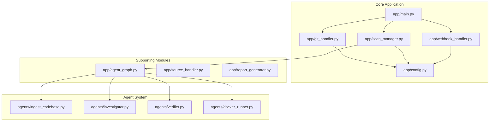
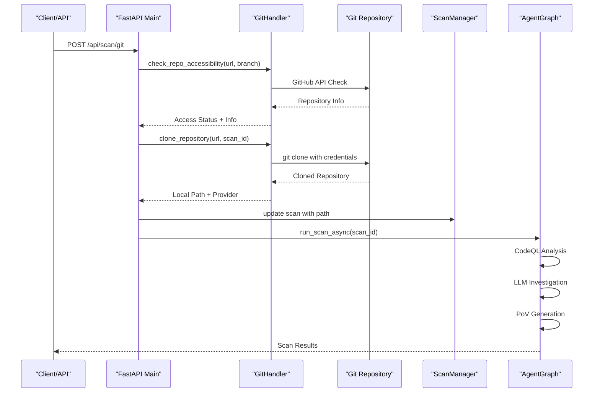
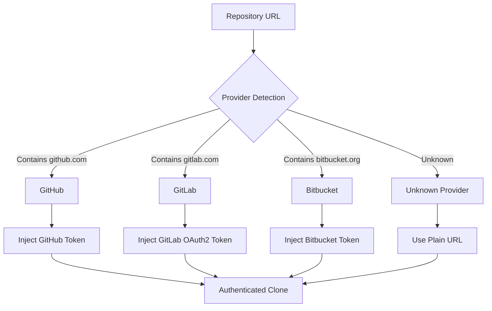
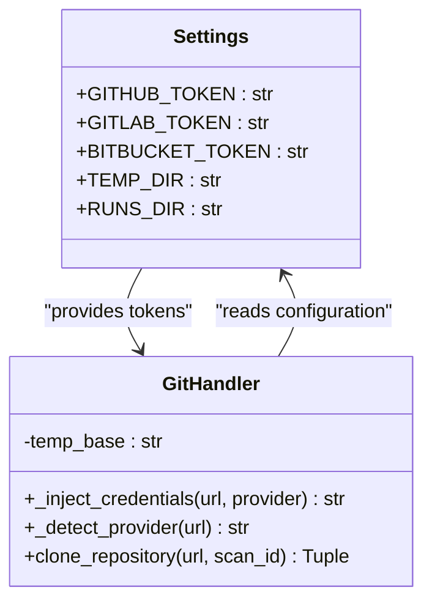
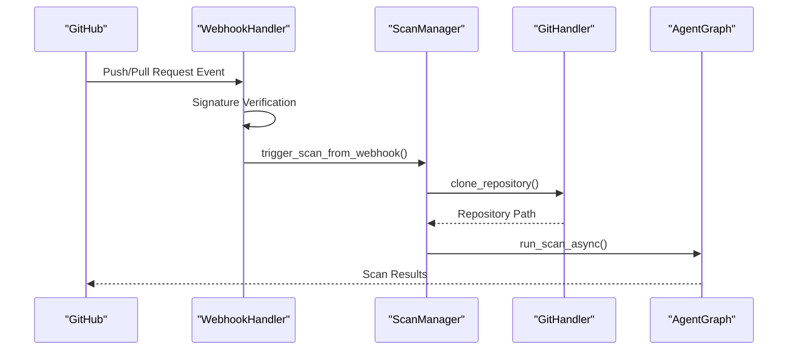
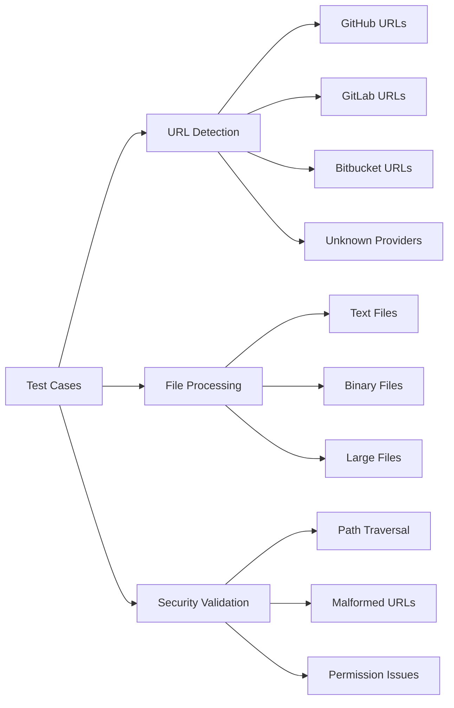
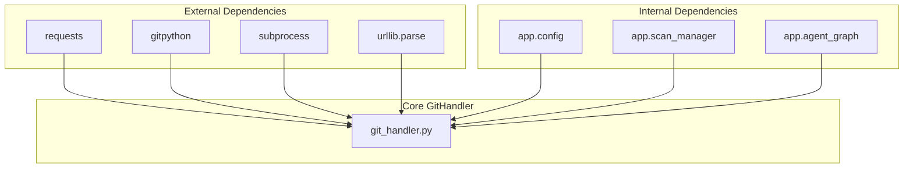

# Git Repository Handling

<cite>
**Referenced Files in This Document**
- [git_handler.py](file://autopov/app/git_handler.py)
- [test_git_handler.py](file://autopov/tests/test_git_handler.py)
- [config.py](file://autopov/app/config.py)
- [main.py](file://autopov/app/main.py)
- [webhook_handler.py](file://autopov/app/webhook_handler.py)
- [scan_manager.py](file://autopov/app/scan_manager.py)
- [agent_graph.py](file://autopov/app/agent_graph.py)
- [source_handler.py](file://autopov/app/source_handler.py)
- [README.md](file://autopov/README.md)
</cite>

## Update Summary
**Changes Made**
- Enhanced GitHandler class with comprehensive provider detection and credential injection
- Added advanced repository accessibility checking with GitHub API integration
- Implemented sophisticated cloning operations with timeout protection and error handling
- Expanded language detection and binary file handling capabilities
- Improved test coverage for Git operations and edge cases

## Table of Contents
1. [Introduction](#introduction)
2. [Project Structure](#project-structure)
3. [Core Components](#core-components)
4. [Architecture Overview](#architecture-overview)
5. [Detailed Component Analysis](#detailed-component-analysis)
6. [Advanced Git Operations](#advanced-git-operations)
7. [Dependency Analysis](#dependency-analysis)
8. [Performance Considerations](#performance-considerations)
9. [Troubleshooting Guide](#troubleshooting-guide)
10. [Conclusion](#conclusion)

## Introduction

The AutoPoV project implements a comprehensive autonomous proof-of-vulnerability framework that includes sophisticated Git repository handling capabilities. This system enables seamless integration with multiple Git providers (GitHub, GitLab, Bitbucket) while maintaining security through credential injection and access control mechanisms.

The Git repository handling functionality serves as a critical foundation for the entire vulnerability detection pipeline, enabling automated scanning of remote repositories, webhook-driven continuous integration, and flexible source code ingestion from various formats. The system has evolved from basic Git operations to a comprehensive repository management system with automatic provider detection, credential injection, repository accessibility checks, and advanced cloning operations.

## Project Structure

The AutoPoV project follows a modular architecture with clear separation of concerns:

**Diagram sources**
- [main.py](file://autopov/app/main.py#L1-L577)
- [git_handler.py](file://autopov/app/git_handler.py#L1-L392)
- [config.py](file://autopov/app/config.py#L1-L263)

**Section sources**
- [README.md](file://autopov/README.md#L1-L242)
- [main.py](file://autopov/app/main.py#L1-L577)

## Core Components

The Git repository handling system consists of several interconnected components that work together to provide comprehensive Git integration:

### GitHandler Class
The central component responsible for all Git operations, including repository cloning, credential injection, provider detection, and repository information retrieval. The system now supports advanced features like repository accessibility checking, branch verification, and comprehensive error handling.

### Configuration Management
Environment-based configuration system supporting multiple Git providers through dedicated API tokens and authentication mechanisms. The configuration system now includes comprehensive token management for GitHub, GitLab, and Bitbucket providers.

### Webhook Integration
Automated trigger system for continuous integration workflows through GitHub and GitLab webhook handlers. The webhook system now integrates seamlessly with the Git repository handling for automated scanning.

### Scan Orchestration
Integration with the broader scan management system to coordinate repository cloning with vulnerability detection workflows. The system now provides comprehensive repository validation before initiating scans.

**Section sources**
- [git_handler.py](file://autopov/app/git_handler.py#L20-L392)
- [config.py](file://autopov/app/config.py#L53-L61)
- [webhook_handler.py](file://autopov/app/webhook_handler.py#L15-L363)

## Architecture Overview

The Git repository handling architecture implements a multi-layered approach to Git integration:

**Diagram sources**
- [main.py](file://autopov/app/main.py#L190-L262)
- [git_handler.py](file://autopov/app/git_handler.py#L155-L294)
- [scan_manager.py](file://autopov/app/scan_manager.py#L86-L116)

The architecture ensures secure, scalable Git repository handling through:

- **Provider-Agnostic Design**: Supports multiple Git hosting platforms with automatic detection
- **Credential Security**: Secure token injection and management for different providers
- **Error Resilience**: Comprehensive error handling and recovery mechanisms
- **Performance Optimization**: Efficient cloning and resource management with timeout protection

## Detailed Component Analysis

### GitHandler Implementation

The GitHandler class provides comprehensive Git repository management capabilities with advanced features:

#### Provider Detection and Credential Injection

**Diagram sources**
- [git_handler.py](file://autopov/app/git_handler.py#L45-L56)

#### Repository Accessibility Checking
The system implements intelligent repository validation through multiple verification layers:

1. **Provider Detection**: Automatic identification of Git hosting platform
2. **API Validation**: GitHub API checks for repository existence and permissions
3. **Size Limiting**: Repository size monitoring to prevent resource exhaustion
4. **Branch Verification**: Specific branch existence validation

#### Advanced Cloning Operations
The cloning mechanism supports advanced features:

- **Shallow Cloning**: Optimized for large repositories with configurable depth
- **Branch Selection**: Targeted branch checkout with validation
- **Commit Pinning**: Specific commit verification and checkout
- **Timeout Protection**: Prevents hanging operations with comprehensive error handling
- **Cleanup Automation**: Resource cleanup on failures with proper error propagation

**Section sources**
- [git_handler.py](file://autopov/app/git_handler.py#L20-L392)

### Configuration Integration

The Git handling system integrates deeply with the configuration management:

#### Environment-Based Authentication

**Diagram sources**
- [config.py](file://autopov/app/config.py#L53-L61)
- [git_handler.py](file://autopov/app/git_handler.py#L23-L25)

#### Security Token Management
The configuration system supports multiple authentication mechanisms:

- **GitHub Personal Access Tokens**: Full repository access with token injection
- **GitLab OAuth2 Tokens**: Project-level access with OAuth2 protocol
- **Bitbucket API Tokens**: Repository permissions with x-token-auth protocol
- **Environment-Based Configuration**: Secure token storage and management

**Section sources**
- [config.py](file://autopov/app/config.py#L53-L61)
- [git_handler.py](file://autopov/app/git_handler.py#L27-L43)

### Webhook Integration

The webhook system enables automated Git repository scanning:

**Diagram sources**
- [webhook_handler.py](file://autopov/app/webhook_handler.py#L196-L266)
- [main.py](file://autopov/app/main.py#L125-L164)

#### Event Processing
The webhook handler processes multiple event types:

- **Push Events**: New commits trigger vulnerability scans with branch and commit information
- **Pull/Merge Request Events**: Code changes initiate analysis with comprehensive metadata
- **Signature Verification**: HMAC-based security validation for GitHub and GitLab
- **Selective Triggering**: Only relevant events initiate scans with proper filtering

**Section sources**
- [webhook_handler.py](file://autopov/app/webhook_handler.py#L75-L194)
- [main.py](file://autopov/app/main.py#L125-L164)

### Test Coverage

The Git handling system includes comprehensive testing:

#### Unit Tests
The test suite validates critical functionality:

- **Provider Detection**: URL parsing and classification accuracy across all providers
- **Scan ID Sanitization**: Path-safe identifier generation with regex validation
- **Binary File Detection**: Content-type validation with comprehensive testing
- **Language Mapping**: File extension to programming language conversion accuracy

#### Test Scenarios

**Diagram sources**
- [test_git_handler.py](file://autopov/tests/test_git_handler.py#L20-L62)

**Section sources**
- [test_git_handler.py](file://autopov/tests/test_git_handler.py#L1-L63)

## Advanced Git Operations

The Git repository handling system now provides sophisticated operations beyond basic cloning:

### Repository Information Retrieval
The system can fetch comprehensive repository information from GitHub API:

- **Repository Metadata**: Name, description, language, and visibility status
- **Size Analysis**: Repository size in KB and MB for resource planning
- **Activity Tracking**: Last updated, pushed, and created timestamps
- **Statistics**: Forks, stars, and open issues count

### Branch Management
Advanced branch handling capabilities:

- **Branch Existence Verification**: Pre-check for branch availability
- **Default Branch Detection**: Automatic detection of repository default branch
- **Branch-Specific Scanning**: Targeted analysis of specific branches

### Error Handling and Recovery
Comprehensive error handling mechanisms:

- **Authentication Errors**: Specific handling for permission and authentication failures
- **Network Issues**: Timeout handling and retry mechanisms
- **Resource Limits**: Repository size monitoring and enforcement
- **Cleanup Procedures**: Automatic resource cleanup on failure

**Section sources**
- [git_handler.py](file://autopov/app/git_handler.py#L72-L198)

## Dependency Analysis

The Git repository handling system exhibits well-managed dependencies:

**Diagram sources**
- [git_handler.py](file://autopov/app/git_handler.py#L6-L17)
- [config.py](file://autopov/app/config.py#L1-L263)

### External Dependencies
The system relies on minimal external libraries for core functionality:

- **requests**: HTTP client for API interactions and GitHub API communication
- **GitPython**: Python wrapper for Git operations with comprehensive Git functionality
- **subprocess**: Process management for command-line Git operations with timeout protection
- **urllib.parse**: URL manipulation utilities for provider detection and credential injection

### Internal Dependencies
The GitHandler integrates with the broader application ecosystem:

- **Configuration System**: Environment-based settings management with token storage
- **Scan Management**: Orchestrates repository scanning workflows with state management
- **Agent Graph**: Coordinates vulnerability detection processes with repository access

**Section sources**
- [git_handler.py](file://autopov/app/git_handler.py#L6-L17)
- [config.py](file://autopov/app/config.py#L1-L263)

## Performance Considerations

The Git repository handling system implements several performance optimization strategies:

### Memory Management
- **Temporary Directory Cleanup**: Automatic resource cleanup on completion with proper error handling
- **Binary File Detection**: Skips binary files to reduce memory usage and processing overhead
- **Streaming Operations**: Processes files incrementally rather than loading entirely into memory

### Network Optimization
- **Timeout Configuration**: Prevents hanging network operations with comprehensive timeout handling
- **Connection Pooling**: Reuses connections for API requests with proper resource management
- **Rate Limiting**: Respects provider API rate limits with graceful degradation

### Scalability Features
- **Asynchronous Processing**: Non-blocking operations for better throughput in webhook scenarios
- **Resource Limits**: Configurable memory and CPU constraints with comprehensive validation
- **Parallel Execution**: Concurrent processing of multiple repositories with proper isolation

## Troubleshooting Guide

Common issues and their solutions:

### Authentication Problems
**Issue**: Repository access denied
**Solution**: Verify token configuration in environment variables
- Check GITHUB_TOKEN, GITLAB_TOKEN, or BITBUCKET_TOKEN configuration
- Ensure tokens have appropriate repository permissions and scopes
- Verify token expiration and revocation status through provider dashboards

### Network Connectivity Issues
**Issue**: Repository clone timeouts
**Solution**: Implement network optimization strategies
- Check internet connectivity and firewall settings for outbound Git operations
- Verify proxy configuration if applicable for corporate environments
- Consider using shallow clones for large repositories with depth parameter

### Repository Size Limitations
**Issue**: Large repository processing failures
**Solution**: Implement size-based filtering and alternative approaches
- Monitor repository size using GitHub API with get_github_repo_info method
- Consider ZIP upload alternative for very large repositories exceeding 500MB
- Configure appropriate timeout values and resource limits

### Permission and Security Issues
**Issue**: Path traversal detection failures
**Solution**: Validate file upload security and path handling
- Ensure proper path validation for uploaded files with security checks
- Check file permissions and ownership for temporary directory access
- Verify temporary directory access rights and cleanup procedures

**Section sources**
- [git_handler.py](file://autopov/app/git_handler.py#L258-L294)
- [config.py](file://autopov/app/config.py#L144-L193)

## Conclusion

The AutoPoV Git repository handling system represents a sophisticated implementation of modern DevSecOps practices. Through its comprehensive provider support, robust security measures, and seamless integration with the broader vulnerability detection pipeline, it enables automated, scalable security analysis of code repositories.

The system's evolution from basic Git operations to a comprehensive repository management system demonstrates its maturity and reliability. The combination of manual API usage, webhook integration, and comprehensive testing ensures both flexibility and stability in diverse deployment scenarios.

The system's strength lies in its modular architecture, which allows for easy extension and maintenance while providing reliable, production-ready functionality. The integration of automatic provider detection, credential injection, repository accessibility checks, and advanced cloning operations creates a robust foundation for enterprise-grade vulnerability detection workflows.

Future enhancements could include expanded provider support for additional Git hosting platforms, enhanced caching mechanisms for improved performance, and improved error reporting systems with detailed diagnostic information, building upon the solid foundation established by the current comprehensive implementation.