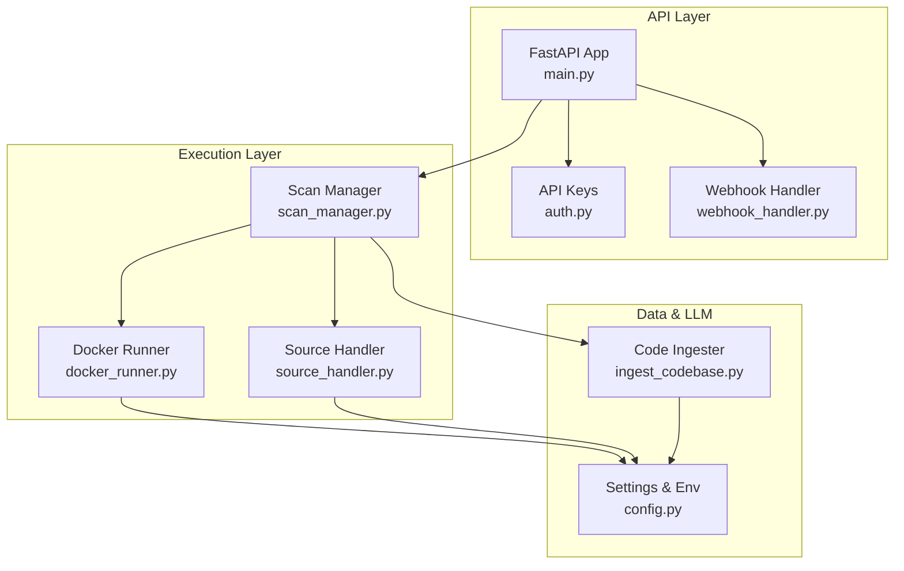
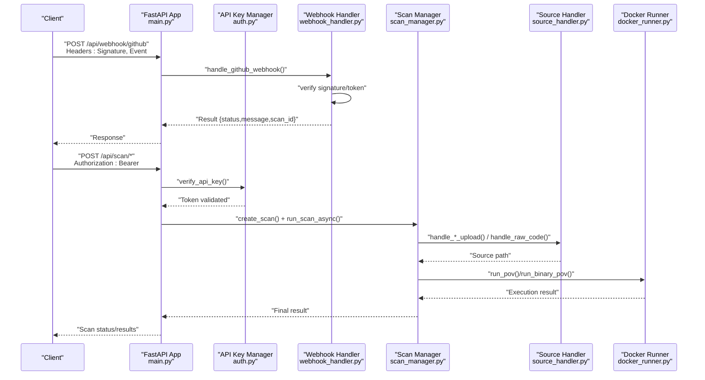
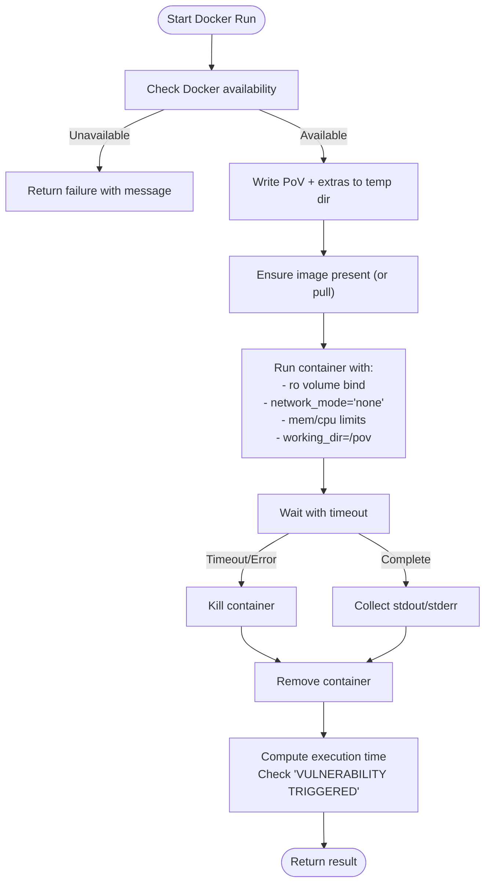
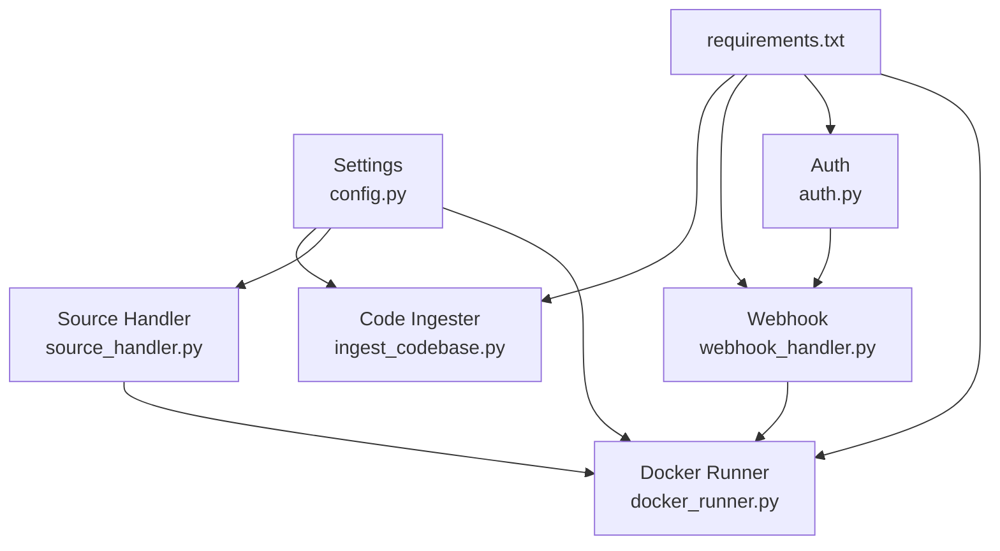

# Security and Isolation Architecture

<cite>
**Referenced Files in This Document**
- [docker_runner.py](file://autopov/agents/docker_runner.py)
- [config.py](file://autopov/app/config.py)
- [webhook_handler.py](file://autopov/app/webhook_handler.py)
- [auth.py](file://autopov/app/auth.py)
- [main.py](file://autopov/app/main.py)
- [scan_manager.py](file://autopov/app/scan_manager.py)
- [source_handler.py](file://autopov/app/source_handler.py)
- [ingest_codebase.py](file://autopov/agents/ingest_codebase.py)
- [requirements.txt](file://autopov/requirements.txt)
</cite>

## Table of Contents
1. [Introduction](#introduction)
2. [Project Structure](#project-structure)
3. [Core Components](#core-components)
4. [Architecture Overview](#architecture-overview)
5. [Detailed Component Analysis](#detailed-component-analysis)
6. [Dependency Analysis](#dependency-analysis)
7. [Performance Considerations](#performance-considerations)
8. [Troubleshooting Guide](#troubleshooting-guide)
9. [Conclusion](#conclusion)
10. [Appendices](#appendices)

## Introduction
This document describes AutoPoV’s security and isolation architecture with a focus on containerized execution and system hardening. It explains how Docker-based isolation is implemented for Proof-of-Vulnerability (PoV) execution, how resource limits are enforced, and how network isolation is applied. It also documents security configuration options (runtime settings, volume mounting restrictions, and capability limitations), the sandboxing approach for PoV execution, input validation and sanitization for code ingestion and user-provided data, and the security implications of LLM integration including prompt injection prevention and output filtering. The document concludes with a threat model, mitigation strategies, webhook security considerations, and configuration examples for different security levels and deployment environments.

## Project Structure
AutoPoV is organized around a FastAPI application that orchestrates scanning workflows. Security-relevant components include:
- Configuration management with environment-driven settings
- API authentication and authorization
- Webhook handlers for secure Git provider integrations
- Docker-based sandboxing for PoV execution
- Source ingestion and validation for safe code handling
- Vector store integration for retrieval-augmented generation (RAG)

**Diagram sources**
- [main.py](file://autopov/app/main.py#L102-L121)
- [auth.py](file://autopov/app/auth.py#L19-L20)
- [webhook_handler.py](file://autopov/app/webhook_handler.py#L15-L24)
- [scan_manager.py](file://autopov/app/scan_manager.py#L40-L50)
- [source_handler.py](file://autopov/app/source_handler.py#L18-L24)
- [docker_runner.py](file://autopov/agents/docker_runner.py#L27-L36)
- [ingest_codebase.py](file://autopov/agents/ingest_codebase.py#L41-L59)
- [config.py](file://autopov/app/config.py#L13-L20)

**Section sources**
- [main.py](file://autopov/app/main.py#L102-L121)
- [config.py](file://autopov/app/config.py#L13-L20)

## Core Components
- Docker Runner: Executes PoV scripts in isolated containers with strict resource limits and no network access.
- Configuration: Centralized settings for Docker, LLM, tokens, and security-related toggles.
- Authentication: Bearer token-based API key management with hashed storage and admin controls.
- Webhook Handler: Validates signatures/tokens and parses Git events to trigger scans.
- Source Handler: Validates and extracts user-provided archives and raw code with path-traversal checks.
- Code Ingester: Manages vector store ingestion and retrieval with configurable embedding backends.

**Section sources**
- [docker_runner.py](file://autopov/agents/docker_runner.py#L27-L379)
- [config.py](file://autopov/app/config.py#L13-L210)
- [auth.py](file://autopov/app/auth.py#L32-L168)
- [webhook_handler.py](file://autopov/app/webhook_handler.py#L15-L363)
- [source_handler.py](file://autopov/app/source_handler.py#L18-L380)
- [ingest_codebase.py](file://autopov/agents/ingest_codebase.py#L41-L407)

## Architecture Overview
The system enforces strong isolation for untrusted code execution and secures integrations with external systems.

**Diagram sources**
- [main.py](file://autopov/app/main.py#L434-L475)
- [webhook_handler.py](file://autopov/app/webhook_handler.py#L196-L265)
- [auth.py](file://autopov/app/auth.py#L137-L148)
- [scan_manager.py](file://autopov/app/scan_manager.py#L50-L116)
- [source_handler.py](file://autopov/app/source_handler.py#L31-L78)
- [docker_runner.py](file://autopov/agents/docker_runner.py#L62-L192)

## Detailed Component Analysis

### Docker-Based Security Architecture
AutoPoV executes PoV scripts inside isolated containers using a minimal base image, mounts only necessary files read-only, disables networking, and applies strict CPU and memory limits. Execution timeouts prevent runaway processes.

**Diagram sources**
- [docker_runner.py](file://autopov/agents/docker_runner.py#L62-L192)
- [docker_runner.py](file://autopov/agents/docker_runner.py#L232-L311)
- [config.py](file://autopov/app/config.py#L78-L84)

Key security controls:
- Network isolation: Containers run with network disabled to prevent outbound connections.
- Resource limits: Memory and CPU quotas are enforced via container runtime settings.
- Volume binding: Temporary directory is mounted read-only under a dedicated working directory.
- Timeout enforcement: Execution waits are bounded to avoid resource exhaustion.
- Image hygiene: Uses a minimal base image and ensures it exists locally.

Operational notes:
- The runner writes PoV scripts and auxiliary files to a temporary directory and cleans up afterward.
- On exceptions, the runner returns structured results with exit codes and logs.

**Section sources**
- [docker_runner.py](file://autopov/agents/docker_runner.py#L62-L192)
- [docker_runner.py](file://autopov/agents/docker_runner.py#L232-L311)
- [config.py](file://autopov/app/config.py#L78-L84)

### Security Configuration Options
AutoPoV centralizes security-related configuration via environment variables and settings validation.

- Docker runtime settings:
  - Image name and tag
  - Timeout, memory limit, CPU quota
  - Availability checks via CLI probing

- Volume mounting restrictions:
  - Mounts only the temporary execution directory read-only under a fixed working directory
  - No host filesystem access beyond the temporary mount

- Capability limitations:
  - Network isolation is enforced at runtime
  - No privileged mode or host PID/network namespace sharing

- LLM configuration:
  - Online vs offline modes with distinct base URLs and embedding models
  - API keys and model selection controlled by environment variables

- API security:
  - Bearer token authentication with hashed key storage
  - Admin-only endpoints protected by a separate admin key

- Webhook security:
  - GitHub: HMAC verification with SHA-256 signature
  - GitLab: Shared secret token verification
  - Payload validation and event filtering

- Input validation and sanitization:
  - ZIP/TAR extraction includes path-traversal checks
  - Raw code ingestion writes to a controlled directory with language-aware filenames
  - JSON payload decoding with explicit error handling

**Section sources**
- [config.py](file://autopov/app/config.py#L13-L210)
- [docker_runner.py](file://autopov/agents/docker_runner.py#L122-L133)
- [docker_runner.py](file://autopov/agents/docker_runner.py#L269-L280)
- [webhook_handler.py](file://autopov/app/webhook_handler.py#L25-L73)
- [source_handler.py](file://autopov/app/source_handler.py#L56-L63)
- [source_handler.py](file://autopov/app/source_handler.py#L115-L122)
- [auth.py](file://autopov/app/auth.py#L32-L168)

### Sandbox Approach for PoV Execution
The sandboxing approach combines containerization, resource controls, and input gating:

- Containerization:
  - Minimal base image for reduced attack surface
  - Read-only execution directory prevents persistent host writes
  - Working directory scoped to the mounted path

- Resource controls:
  - CPU quota and memory limit enforced per container
  - Execution timeout to bound runtime

- Input handling:
  - Scripts and inputs written to ephemeral temp directories
  - Binary inputs supported via separate entry points
  - Wrapper logic for stdin-based PoVs

- Observability:
  - Captures stdout/stderr and exit codes
  - Detects PoV-specific trigger indicators in logs

**Section sources**
- [docker_runner.py](file://autopov/agents/docker_runner.py#L62-L192)
- [docker_runner.py](file://autopov/agents/docker_runner.py#L232-L311)

### Input Validation and Sanitization
AutoPoV implements several layers of input validation and sanitization:

- Archive extraction:
  - ZIP/TAR members are checked against the absolute extraction path to prevent path traversal
  - Extraction proceeds only if all members remain within the target directory

- Raw code ingestion:
  - Writes code to a designated source directory
  - Determines file extensions from language hints to maintain proper file types

- Webhook payloads:
  - Validates signatures/tokens before processing
  - Parses and filters events to only act on triggering actions
  - Returns structured error messages for malformed payloads

- API requests:
  - Uses typed Pydantic models for request bodies
  - Enforces bearer token authentication for protected endpoints

**Section sources**
- [source_handler.py](file://autopov/app/source_handler.py#L56-L63)
- [source_handler.py](file://autopov/app/source_handler.py#L115-L122)
- [webhook_handler.py](file://autopov/app/webhook_handler.py#L213-L237)
- [webhook_handler.py](file://autopov/app/webhook_handler.py#L284-L313)
- [main.py](file://autopov/app/main.py#L29-L43)
- [auth.py](file://autopov/app/auth.py#L137-L148)

### LLM Integration Security Implications
AutoPoV integrates with online and offline LLM providers for RAG and analysis. Security considerations include:

- Prompt injection prevention:
  - Use structured prompts and few-shot examples
  - Avoid exposing internal configuration details in prompts
  - Apply output filtering to remove sensitive artifacts

- Output filtering:
  - Post-process LLM outputs to sanitize content
  - Limit verbosity and avoid echoing raw user input

- API key management:
  - Store keys in environment variables
  - Restrict access to admin-only endpoints that expose configuration

- Model mode selection:
  - Online mode requires API keys and external connectivity
  - Offline mode reduces exposure by using local LLMs

**Section sources**
- [config.py](file://autopov/app/config.py#L30-L50)
- [config.py](file://autopov/app/config.py#L173-L189)
- [ingest_codebase.py](file://autopov/agents/ingest_codebase.py#L60-L88)

### Threat Model and Mitigations
Potential threats and mitigations:

- Threat: Untrusted PoV code execution
  - Mitigation: Container isolation with network disabled, read-only mounts, CPU/memory limits, and timeouts

- Threat: Path traversal in uploaded archives
  - Mitigation: Validate archive members against extraction root before extraction

- Threat: Exfiltration via webhooks or LLM
  - Mitigation: Require shared secrets/tokens, validate signatures, and filter LLM outputs

- Threat: API abuse and unauthorized access
  - Mitigation: Enforce bearer token authentication and admin-only endpoints

- Threat: Sensitive data leakage in logs or reports
  - Mitigation: Avoid logging secrets; sanitize outputs; restrict access to results

**Section sources**
- [docker_runner.py](file://autopov/agents/docker_runner.py#L122-L133)
- [source_handler.py](file://autopov/app/source_handler.py#L56-L63)
- [webhook_handler.py](file://autopov/app/webhook_handler.py#L25-L73)
- [auth.py](file://autopov/app/auth.py#L137-L168)

### Webhook Processing and External API Integrations
- GitHub webhooks:
  - Signature verification using HMAC-SHA256
  - Event filtering to only trigger scans on relevant actions
  - JSON payload validation with error responses

- GitLab webhooks:
  - Token verification using shared secret
  - Event parsing and filtering similar to GitHub

- External APIs:
  - Online LLM endpoints require API keys
  - Offline mode uses local LLMs to reduce external exposure

**Section sources**
- [webhook_handler.py](file://autopov/app/webhook_handler.py#L196-L336)
- [config.py](file://autopov/app/config.py#L30-L50)

### Configuration Examples for Different Security Levels
Below are recommended configurations for different deployment environments. Adjust environment variables accordingly.

- Low-risk development:
  - Disable Docker sandboxing checks
  - Increase timeouts and memory limits
  - Enable verbose logging
  - Use offline LLM mode

- Moderate-risk staging:
  - Keep Docker enabled
  - Tighten CPU/memory limits
  - Enable webhook signature verification
  - Restrict API keys and enable admin key protection

- High-security production:
  - Enforce Docker sandboxing
  - Set strict CPU/memory limits and short timeouts
  - Require webhook secrets/tokens
  - Use online LLM with API key rotation
  - Audit logs and monitor metrics

Note: These are operational guidelines. Actual environment variables and values are managed via the configuration module and environment files.

**Section sources**
- [config.py](file://autopov/app/config.py#L78-L84)
- [config.py](file://autopov/app/config.py#L117-L121)
- [webhook_handler.py](file://autopov/app/webhook_handler.py#L25-L73)

## Dependency Analysis
The security-critical dependencies and their roles:

**Diagram sources**
- [requirements.txt](file://autopov/requirements.txt#L23-L24)
- [requirements.txt](file://autopov/requirements.txt#L10-L13)
- [config.py](file://autopov/app/config.py#L13-L20)
- [docker_runner.py](file://autopov/agents/docker_runner.py#L27-L36)
- [source_handler.py](file://autopov/app/source_handler.py#L18-L24)
- [ingest_codebase.py](file://autopov/agents/ingest_codebase.py#L41-L59)
- [auth.py](file://autopov/app/auth.py#L19-L20)
- [webhook_handler.py](file://autopov/app/webhook_handler.py#L15-L24)

**Section sources**
- [requirements.txt](file://autopov/requirements.txt#L1-L42)
- [config.py](file://autopov/app/config.py#L13-L20)

## Performance Considerations
- Container overhead: Using minimal images and disabling networking reduces overhead.
- Resource contention: CPU and memory limits prevent noisy-neighbor effects.
- I/O bottlenecks: Read-only mounts and ephemeral temp directories minimize disk contention.
- LLM latency: Offline mode reduces external dependency latency; online mode benefits from caching and batching.

[No sources needed since this section provides general guidance]

## Troubleshooting Guide
Common issues and resolutions:

- Docker not available:
  - Verify Docker daemon is running and accessible
  - Check environment variables for Docker settings
  - Confirm image availability and pull if missing

- Webhook signature/token failures:
  - Ensure secrets match provider configurations
  - Validate payload encoding and headers
  - Review webhook handler responses for detailed errors

- API key validation failures:
  - Confirm bearer token matches stored hash
  - Check admin key configuration for admin endpoints

- Archive extraction errors:
  - Inspect for path traversal attempts
  - Validate archive integrity and supported formats

**Section sources**
- [docker_runner.py](file://autopov/agents/docker_runner.py#L50-L60)
- [webhook_handler.py](file://autopov/app/webhook_handler.py#L213-L237)
- [webhook_handler.py](file://autopov/app/webhook_handler.py#L284-L313)
- [auth.py](file://autopov/app/auth.py#L81-L95)
- [source_handler.py](file://autopov/app/source_handler.py#L56-L63)

## Conclusion
AutoPoV’s security architecture centers on robust container isolation, strict resource controls, and secure integrations. By combining Docker-based sandboxing, input validation, webhook signature verification, and API key management, the system minimizes risk while enabling effective vulnerability discovery. Administrators should tailor security settings to their environment, enforce strict limits, and monitor execution to maintain a strong security posture.

[No sources needed since this section summarizes without analyzing specific files]

## Appendices

### Security Controls Reference
- Container isolation: Read-only mounts, network disabled, scoped working directory
- Resource controls: CPU quota, memory limit, execution timeout
- Input validation: Path-traversal checks, JSON payload validation, typed request models
- Authentication: Hashed API keys, bearer token enforcement, admin key protection
- Webhooks: HMAC-SHA256 signatures, shared secret tokens, event filtering
- LLM: Mode selection, API keys, output filtering

**Section sources**
- [docker_runner.py](file://autopov/agents/docker_runner.py#L122-L133)
- [docker_runner.py](file://autopov/agents/docker_runner.py#L269-L280)
- [source_handler.py](file://autopov/app/source_handler.py#L56-L63)
- [webhook_handler.py](file://autopov/app/webhook_handler.py#L25-L73)
- [auth.py](file://autopov/app/auth.py#L32-L168)
- [config.py](file://autopov/app/config.py#L30-L50)