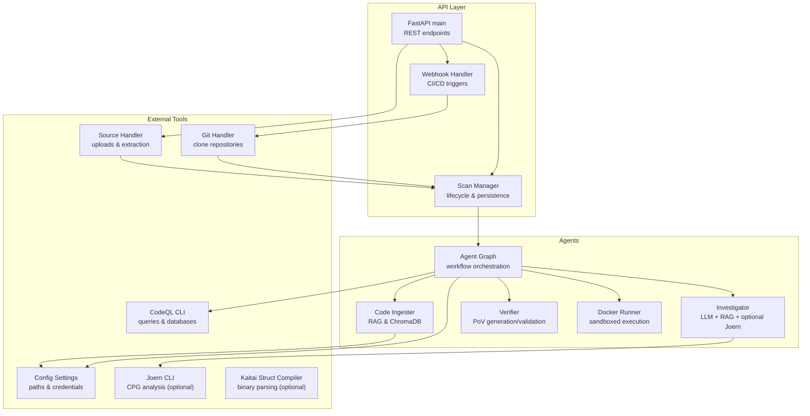
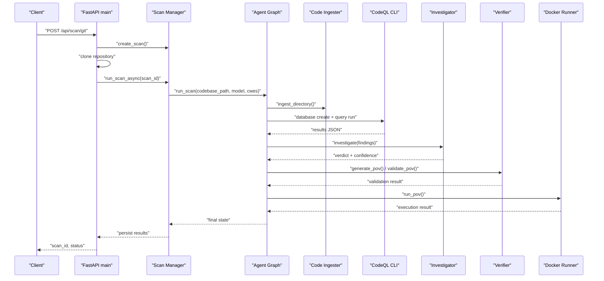
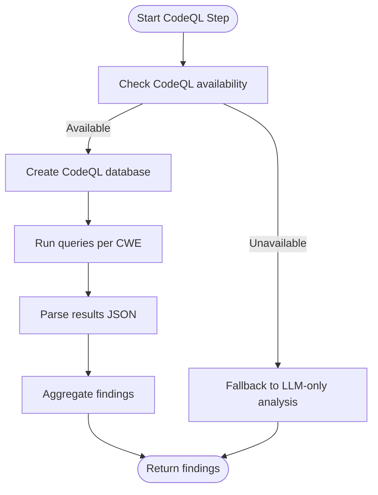
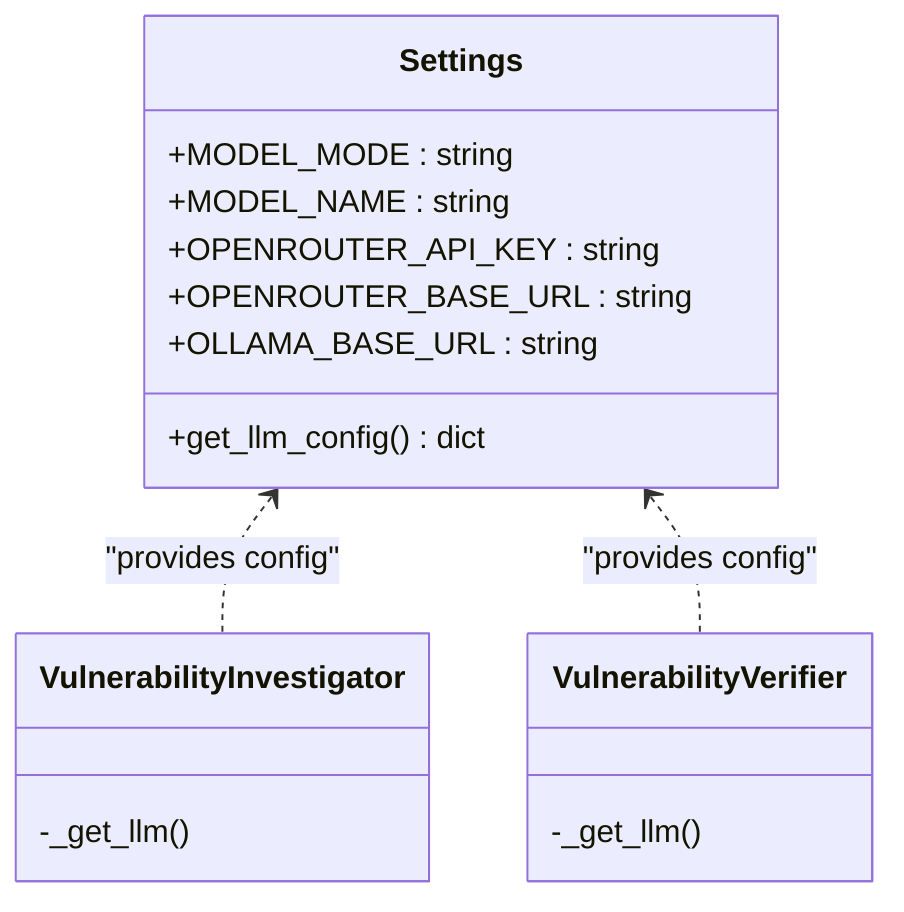
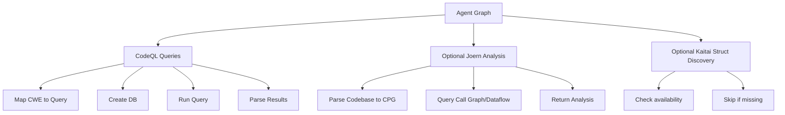
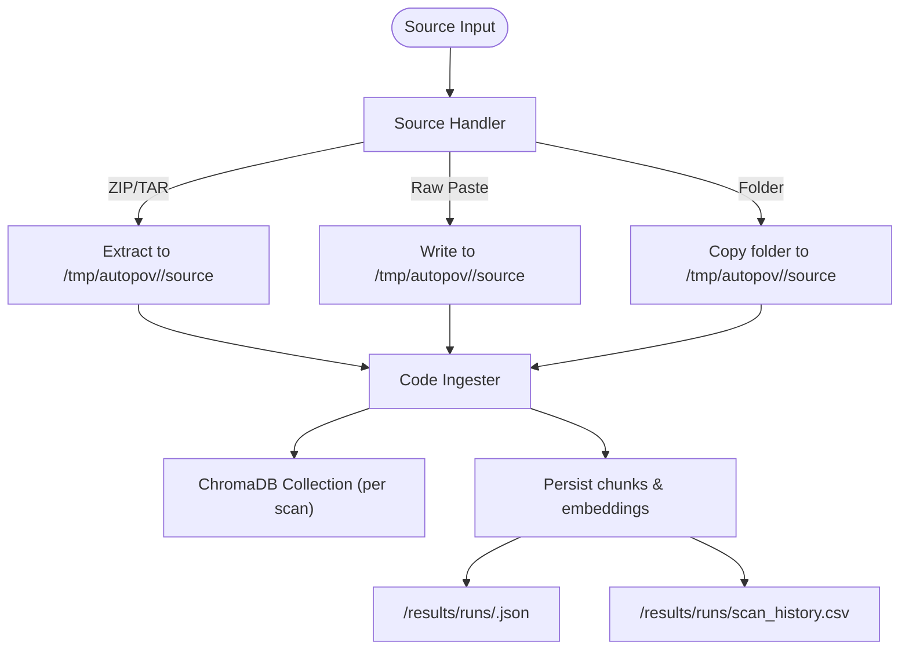
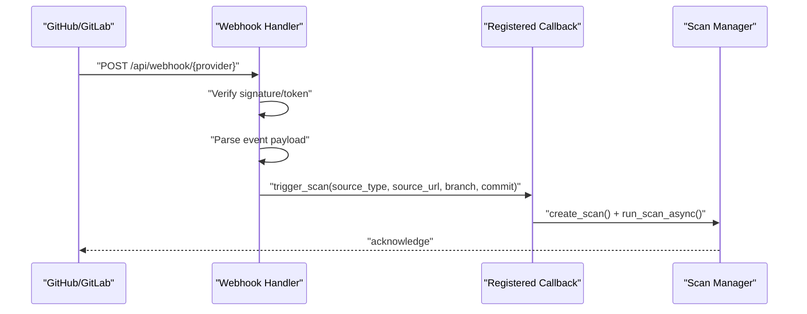
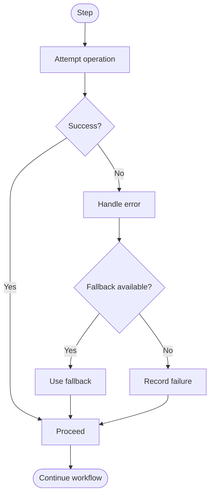
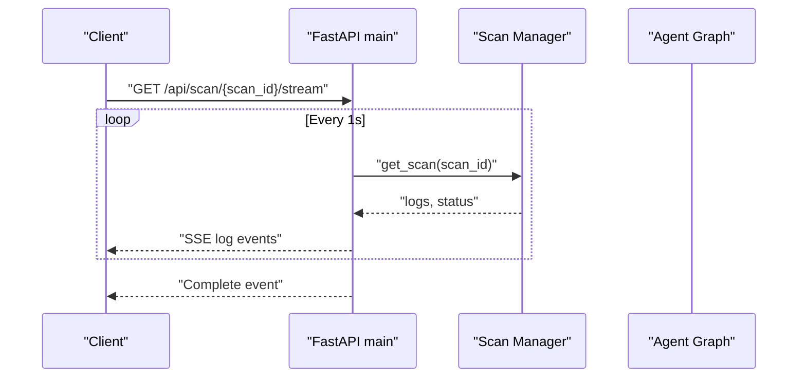
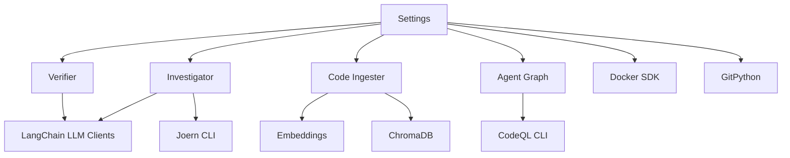

# System Integration and External Tool Coordination

<cite>
**Referenced Files in This Document**
- [main.py](file://autopov/app/main.py)
- [config.py](file://autopov/app/config.py)
- [scan_manager.py](file://autopov/app/scan_manager.py)
- [webhook_handler.py](file://autopov/app/webhook_handler.py)
- [agent_graph.py](file://autopov/app/agent_graph.py)
- [ingest_codebase.py](file://autopov/agents/ingest_codebase.py)
- [investigator.py](file://autopov/agents/investigator.py)
- [verifier.py](file://autopov/agents/verifier.py)
- [docker_runner.py](file://autopov/agents/docker_runner.py)
- [source_handler.py](file://autopov/app/source_handler.py)
- [git_handler.py](file://autopov/app/git_handler.py)
- [codeql_queries/BufferOverflow.ql](file://autopov/codeql_queries/BufferOverflow.ql)
- [codeql_queries/IntegerOverflow.ql](file://autopov/codeql_queries/IntegerOverflow.ql)
- [codeql_queries/SqlInjection.ql](file://autopov/codeql_queries/SqlInjection.ql)
- [codeql_queries/UseAfterFree.ql](file://autopov/codeql_queries/UseAfterFree.ql)
</cite>

## Table of Contents
1. [Introduction](#introduction)
2. [Project Structure](#project-structure)
3. [Core Components](#core-components)
4. [Architecture Overview](#architecture-overview)
5. [Detailed Component Analysis](#detailed-component-analysis)
6. [Dependency Analysis](#dependency-analysis)
7. [Performance Considerations](#performance-considerations)
8. [Troubleshooting Guide](#troubleshooting-guide)
9. [Conclusion](#conclusion)
10. [Appendices](#appendices)

## Introduction
This document explains AutoPoV’s system integration patterns for coordinating external tools and services. It covers:
- CodeQL integration for database creation, query execution, and result parsing
- LLM provider integration supporting online (OpenRouter) and offline (Ollama) configurations
- Static analysis tool coordination including query mapping, result aggregation, and fallback mechanisms
- File system integration for code ingestion, temporary file management, and result persistence
- Webhook integration patterns for CI/CD pipeline automation
- Configuration management for external tool paths and credentials
- Error handling and retry mechanisms for external tool failures
- Monitoring and logging integration for external tool outputs
- Examples for extending the system with additional external tools and analysis frameworks

## Project Structure
AutoPoV organizes integration concerns across application modules, agents, and configuration:
- Application entrypoint and orchestration: FastAPI endpoints, scan lifecycle, and streaming logs
- Configuration: Environment-driven settings for tools, models, and paths
- Agents: Code ingestion (RAG), investigation (LLM), verification (PoV), and Docker execution
- Integrations: Git, CodeQL, optional Joern, and optional Kaitai Struct compiler
- Webhooks: GitHub and GitLab webhook handlers for CI/CD automation

**Diagram sources**
- [main.py](file://autopov/app/main.py#L102-L528)
- [scan_manager.py](file://autopov/app/scan_manager.py#L40-L344)
- [webhook_handler.py](file://autopov/app/webhook_handler.py#L15-L363)
- [agent_graph.py](file://autopov/app/agent_graph.py#L78-L582)
- [ingest_codebase.py](file://autopov/agents/ingest_codebase.py#L41-L407)
- [investigator.py](file://autopov/agents/investigator.py#L37-L413)
- [verifier.py](file://autopov/agents/verifier.py#L40-L401)
- [docker_runner.py](file://autopov/agents/docker_runner.py#L27-L379)
- [config.py](file://autopov/app/config.py#L13-L210)
- [git_handler.py](file://autopov/app/git_handler.py#L18-L222)
- [source_handler.py](file://autopov/app/source_handler.py#L18-L380)

**Section sources**
- [main.py](file://autopov/app/main.py#L102-L528)
- [config.py](file://autopov/app/config.py#L13-L210)

## Core Components
- Configuration management centralizes environment variables for tool paths, credentials, and runtime behavior. It exposes availability checks for Docker, CodeQL, Joern, and Kaitai Struct, and provides LLM configuration selection between online and offline modes.
- Scan Manager coordinates scan lifecycle, state, persistence, and metrics. It runs the agent graph workflow and persists results to JSON and CSV.
- Agent Graph orchestrates the end-to-end vulnerability detection pipeline, integrating ingestion, static analysis (CodeQL), investigation (LLM), PoV generation/validation, and sandboxed execution.
- Webhook Handler verifies and parses provider webhooks, triggering scans with contextual data.
- Source and Git Handlers manage code ingestion from ZIP uploads, raw paste, and repository clones, including credential injection and sanitization.
- Agents implement specialized integrations:
  - Code Ingester: RAG pipeline with ChromaDB and configurable embeddings
  - Investigator: LLM-based vulnerability investigation with optional Joern CPG analysis
  - Verifier: PoV generation and validation with syntax and policy checks
  - Docker Runner: Secure, isolated execution of PoV scripts with resource limits

**Section sources**
- [config.py](file://autopov/app/config.py#L13-L210)
- [scan_manager.py](file://autopov/app/scan_manager.py#L40-L344)
- [agent_graph.py](file://autopov/app/agent_graph.py#L78-L582)
- [webhook_handler.py](file://autopov/app/webhook_handler.py#L15-L363)
- [source_handler.py](file://autopov/app/source_handler.py#L18-L380)
- [git_handler.py](file://autopov/app/git_handler.py#L18-L222)
- [ingest_codebase.py](file://autopov/agents/ingest_codebase.py#L41-L407)
- [investigator.py](file://autopov/agents/investigator.py#L37-L413)
- [verifier.py](file://autopov/agents/verifier.py#L40-L401)
- [docker_runner.py](file://autopov/agents/docker_runner.py#L27-L379)

## Architecture Overview
The system integrates external tools through a modular, layered architecture:
- API layer handles requests, streams logs, and exposes metrics
- Workflow layer executes orchestrated steps with robust error handling and fallbacks
- Integration layer manages external tool availability, credentials, and filesystem operations
- Persistence layer stores results and metrics for auditing and reporting

**Diagram sources**
- [main.py](file://autopov/app/main.py#L177-L317)
- [scan_manager.py](file://autopov/app/scan_manager.py#L86-L200)
- [agent_graph.py](file://autopov/app/agent_graph.py#L163-L433)
- [ingest_codebase.py](file://autopov/agents/ingest_codebase.py#L201-L307)
- [investigator.py](file://autopov/agents/investigator.py#L254-L366)
- [verifier.py](file://autopov/agents/verifier.py#L79-L227)
- [docker_runner.py](file://autopov/agents/docker_runner.py#L62-L192)

## Detailed Component Analysis

### CodeQL Integration Pattern
AutoPoV coordinates CodeQL for static analysis with:
- Database creation per scan and language-specific source root
- Query mapping by CWE to query files
- Result parsing into standardized vulnerability findings
- Fallback to LLM-only analysis when CodeQL is unavailable

**Diagram sources**
- [agent_graph.py](file://autopov/app/agent_graph.py#L163-L191)
- [agent_graph.py](file://autopov/app/agent_graph.py#L193-L278)

Implementation highlights:
- Query mapping: CWE to query file names
- Database path: per-scan temporary directory
- Query output: per-CWE JSON file written to temp dir
- Result parsing: extracts path and line number into standardized findings
- Cleanup: removes database directory after use

**Section sources**
- [agent_graph.py](file://autopov/app/agent_graph.py#L193-L278)
- [codeql_queries/BufferOverflow.ql](file://autopov/codeql_queries/BufferOverflow.ql)
- [codeql_queries/IntegerOverflow.ql](file://autopov/codeql_queries/IntegerOverflow.ql)
- [codeql_queries/SqlInjection.ql](file://autopov/codeql_queries/SqlInjection.ql)
- [codeql_queries/UseAfterFree.ql](file://autopov/codeql_queries/UseAfterFree.ql)

### LLM Provider Integration Patterns
AutoPoV supports two LLM modes:
- Online (OpenRouter): Uses OpenAI-compatible API with configurable base URL and API key
- Offline (Ollama): Uses local LLM server with configurable base URL

Configuration and selection:
- Mode selection via environment variable
- Model name selection with predefined lists
- Embedding model selection aligned with mode
- Optional LangSmith tracing

**Diagram sources**
- [config.py](file://autopov/app/config.py#L30-L89)
- [config.py](file://autopov/app/config.py#L173-L189)
- [investigator.py](file://autopov/agents/investigator.py#L50-L87)
- [verifier.py](file://autopov/agents/verifier.py#L46-L77)

Operational behavior:
- Investigator builds prompts using RAG context and optional Joern analysis, then invokes the selected LLM
- Verifier generates and validates PoV scripts using the same LLM selection logic
- Both agents support LangSmith tracing when enabled

**Section sources**
- [config.py](file://autopov/app/config.py#L30-L89)
- [config.py](file://autopov/app/config.py#L173-L189)
- [investigator.py](file://autopov/agents/investigator.py#L50-L87)
- [verifier.py](file://autopov/agents/verifier.py#L46-L77)

### Static Analysis Tool Coordination
The Agent Graph coordinates multiple static analysis tools:
- CodeQL: primary static analyzer with fallback to LLM-only
- Joern: optional CPG-based analysis for use-after-free (CWE-416)
- Kaitai Struct compiler: optional binary parsing tool discovery

**Diagram sources**
- [agent_graph.py](file://autopov/app/agent_graph.py#L163-L191)
- [agent_graph.py](file://autopov/app/agent_graph.py#L89-L191)
- [investigator.py](file://autopov/agents/investigator.py#L89-L185)
- [config.py](file://autopov/app/config.py#L161-L172)

Coordination specifics:
- Query mapping and execution are performed per CWE
- Joern is invoked only for CWE-416 and only when available
- Kaitai Struct availability is checked centrally; binary detection is supported in source handling

**Section sources**
- [agent_graph.py](file://autopov/app/agent_graph.py#L163-L191)
- [investigator.py](file://autopov/agents/investigator.py#L89-L185)
- [config.py](file://autopov/app/config.py#L161-L172)

### File System Integration
AutoPoV manages code ingestion, temporary files, and persistent results:
- Temporary directory structure: per-scan isolation under a shared base
- Code ingestion: recursive chunking, embedding, and ChromaDB storage per scan
- Source handling: ZIP/TAR extraction with path-traversal protection, raw code paste, and folder copy
- Git handling: credential injection, provider detection, shallow clone, and commit checkout
- Result persistence: JSON per scan and CSV audit trail

**Diagram sources**
- [source_handler.py](file://autopov/app/source_handler.py#L31-L190)
- [ingest_codebase.py](file://autopov/agents/ingest_codebase.py#L201-L307)
- [git_handler.py](file://autopov/app/git_handler.py#L60-L124)
- [scan_manager.py](file://autopov/app/scan_manager.py#L201-L236)

**Section sources**
- [source_handler.py](file://autopov/app/source_handler.py#L31-L190)
- [ingest_codebase.py](file://autopov/agents/ingest_codebase.py#L201-L307)
- [git_handler.py](file://autopov/app/git_handler.py#L60-L124)
- [scan_manager.py](file://autopov/app/scan_manager.py#L201-L236)

### Webhook Integration Patterns
AutoPoV supports automated CI/CD triggers via webhooks:
- GitHub: HMAC verification, event parsing (push, pull_request), and scan callback registration
- GitLab: token verification, event parsing (push, merge_request), and scan callback registration
- Callback registration allows downstream orchestration of scans from webhook events

**Diagram sources**
- [webhook_handler.py](file://autopov/app/webhook_handler.py#L196-L336)
- [main.py](file://autopov/app/main.py#L123-L161)
- [scan_manager.py](file://autopov/app/scan_manager.py#L86-L116)

**Section sources**
- [webhook_handler.py](file://autopov/app/webhook_handler.py#L15-L363)
- [main.py](file://autopov/app/main.py#L123-L161)

### Configuration Management
AutoPoV centralizes configuration via environment variables:
- Tool paths: CodeQL, Joern, Kaitai Struct compiler
- Credentials: OpenRouter API key, provider tokens, webhook secrets
- Model configuration: online vs offline, model names, embedding models
- Docker settings: image, timeouts, memory/cpu limits
- Paths: data, results, runs, temp directories
- Cost control and retry limits

Availability checks:
- Docker, CodeQL, Joern, and Kaitai Struct presence are verified at runtime

**Section sources**
- [config.py](file://autopov/app/config.py#L13-L210)

### Error Handling and Retry Mechanisms
AutoPoV implements layered error handling and retry strategies:
- CodeQL errors: fallback to LLM-only analysis
- Joern errors: skip analysis with error message
- Docker Runner: graceful degradation when Docker is unavailable
- Retry logic: configurable maximum retries for PoV validation failures
- Scan Manager: captures exceptions, marks status as failed, persists result

**Diagram sources**
- [agent_graph.py](file://autopov/app/agent_graph.py#L185-L191)
- [investigator.py](file://autopov/agents/investigator.py#L181-L184)
- [docker_runner.py](file://autopov/agents/docker_runner.py#L81-L91)
- [scan_manager.py](file://autopov/app/scan_manager.py#L177-L199)

**Section sources**
- [agent_graph.py](file://autopov/app/agent_graph.py#L185-L191)
- [investigator.py](file://autopov/agents/investigator.py#L181-L184)
- [docker_runner.py](file://autopov/agents/docker_runner.py#L81-L91)
- [scan_manager.py](file://autopov/app/scan_manager.py#L177-L199)

### Monitoring and Logging Integration
AutoPoV integrates logging and observability:
- Agent Graph maintains a log list in scan state with timestamps
- Streaming logs via Server-Sent Events endpoint
- Metrics endpoint aggregates scan history and totals
- Optional LangSmith tracing for LLM interactions

**Diagram sources**
- [main.py](file://autopov/app/main.py#L350-L385)
- [scan_manager.py](file://autopov/app/scan_manager.py#L237-L286)
- [agent_graph.py](file://autopov/app/agent_graph.py#L516-L520)

**Section sources**
- [main.py](file://autopov/app/main.py#L350-L385)
- [scan_manager.py](file://autopov/app/scan_manager.py#L237-L286)
- [agent_graph.py](file://autopov/app/agent_graph.py#L516-L520)

### Extending with Additional External Tools
To add new external tools or analysis frameworks:
- Add tool availability checks in configuration and integrate discovery in Agent Graph
- Implement a new agent or extend existing ones to invoke the tool and parse outputs
- Integrate with the scan state machine using conditional edges and node functions
- Ensure proper error handling, fallbacks, and cleanup
- Persist results and update metrics accordingly

Examples of extensions:
- New static analyzer: similar to CodeQL integration (create DB, run query, parse results)
- New LLM provider: mirror the LLM selection logic in configuration and agents
- New sandbox: similar to Docker Runner with resource limits and secure execution

[No sources needed since this section provides general guidance]

## Dependency Analysis
External dependencies and integration points:
- Docker SDK for Python: optional container orchestration
- GitPython: repository cloning and checkout
- LangChain ecosystem: LLM clients, embeddings, and RAG
- ChromaDB: vector store for code embeddings
- Subprocess-based tooling: CodeQL, Joern, Kaitai Struct compiler

**Diagram sources**
- [config.py](file://autopov/app/config.py#L13-L210)
- [investigator.py](file://autopov/agents/investigator.py#L15-L26)
- [verifier.py](file://autopov/agents/verifier.py#L15-L26)
- [ingest_codebase.py](file://autopov/agents/ingest_codebase.py#L14-L32)
- [agent_graph.py](file://autopov/app/agent_graph.py#L16-L27)

**Section sources**
- [config.py](file://autopov/app/config.py#L13-L210)
- [investigator.py](file://autopov/agents/investigator.py#L15-L26)
- [verifier.py](file://autopov/agents/verifier.py#L15-L26)
- [ingest_codebase.py](file://autopov/agents/ingest_codebase.py#L14-L32)
- [agent_graph.py](file://autopov/app/agent_graph.py#L16-L27)

## Performance Considerations
- Asynchronous execution: scan runs are offloaded to a thread pool for concurrency
- Resource limits: Docker containers enforce CPU and memory quotas
- Chunking and batching: code ingestion uses batched embeddings to optimize throughput
- Retries: configurable maximum retries reduce transient failure impact
- Optional tools: Joern and Docker are optional to avoid bottlenecks when unavailable

[No sources needed since this section provides general guidance]

## Troubleshooting Guide
Common issues and resolutions:
- CodeQL not available: system falls back to LLM-only analysis; install CodeQL CLI or adjust path
- Docker not available: PoV execution is skipped gracefully; install Docker or disable Docker-dependent steps
- Webhook verification failures: ensure secrets and tokens match provider configurations
- Git clone failures: verify credentials, branch/commit existence, and network connectivity
- Embedding provider errors: confirm API keys and model availability for online/offline modes

**Section sources**
- [agent_graph.py](file://autopov/app/agent_graph.py#L168-L173)
- [docker_runner.py](file://autopov/agents/docker_runner.py#L81-L91)
- [webhook_handler.py](file://autopov/app/webhook_handler.py#L213-L218)
- [git_handler.py](file://autopov/app/git_handler.py#L119-L123)
- [ingest_codebase.py](file://autopov/agents/ingest_codebase.py#L67-L87)

## Conclusion
AutoPoV’s system integration patterns provide a robust, extensible framework for coordinating external tools and services. By centralizing configuration, implementing fallbacks, and structuring workflows with clear boundaries, the system supports CodeQL, optional Joern, and flexible LLM providers while maintaining reliability and observability. The modular architecture enables straightforward extension with additional tools and analysis frameworks.

[No sources needed since this section summarizes without analyzing specific files]

## Appendices
- Example environment variables and defaults are defined in configuration
- Query files for supported CWEs are located under the codeql_queries directory
- Reports can be generated in JSON or PDF formats from persisted scan results

**Section sources**
- [config.py](file://autopov/app/config.py#L13-L210)
- [codeql_queries/BufferOverflow.ql](file://autopov/codeql_queries/BufferOverflow.ql)
- [codeql_queries/IntegerOverflow.ql](file://autopov/codeql_queries/IntegerOverflow.ql)
- [codeql_queries/SqlInjection.ql](file://autopov/codeql_queries/SqlInjection.ql)
- [codeql_queries/UseAfterFree.ql](file://autopov/codeql_queries/UseAfterFree.ql)
- [scan_manager.py](file://autopov/app/scan_manager.py#L401-L407)