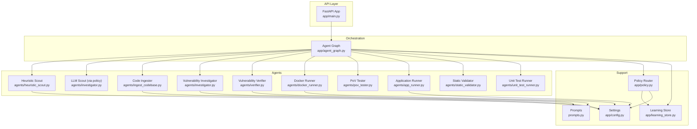
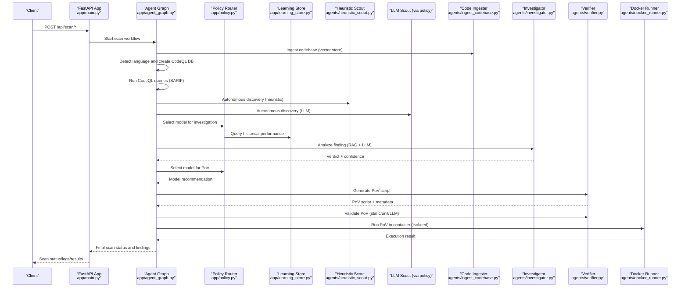
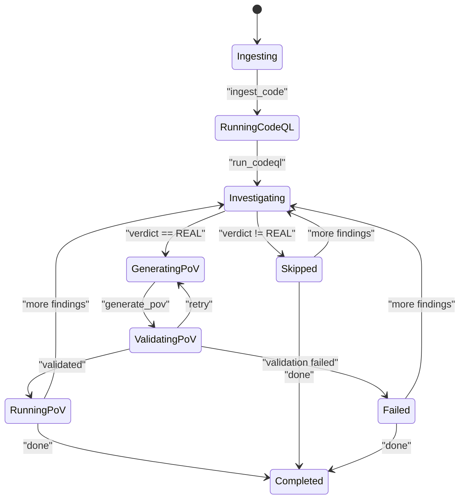
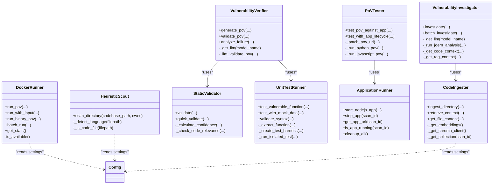
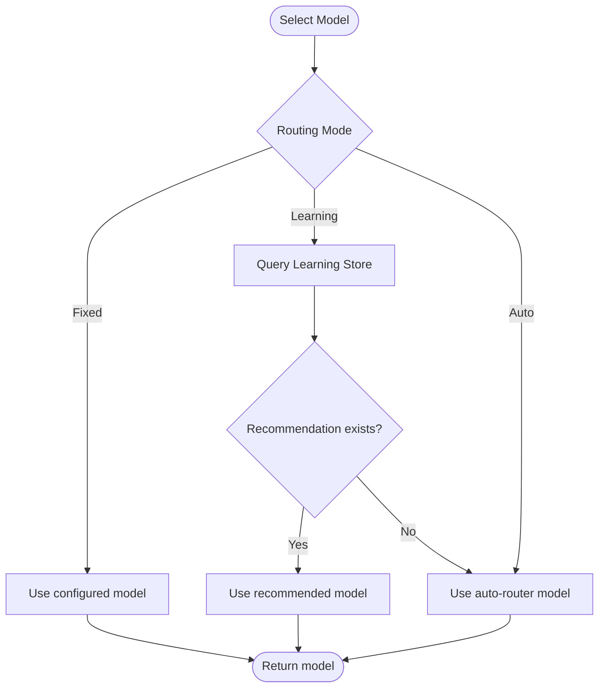
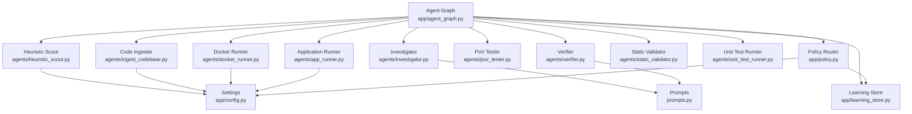

# Agent Architecture & Interfaces

<cite>
**Referenced Files in This Document**
- [agents/__init__.py](file://agents/__init__.py)
- [agents/app_runner.py](file://agents/app_runner.py)
- [agents/docker_runner.py](file://agents/docker_runner.py)
- [agents/heuristic_scout.py](file://agents/heuristic_scout.py)
- [agents/ingest_codebase.py](file://agents/ingest_codebase.py)
- [agents/investigator.py](file://agents/investigator.py)
- [agents/pov_tester.py](file://agents/pov_tester.py)
- [agents/static_validator.py](file://agents/static_validator.py)
- [agents/unit_test_runner.py](file://agents/unit_test_runner.py)
- [agents/verifier.py](file://agents/verifier.py)
- [app/agent_graph.py](file://app/agent_graph.py)
- [app/config.py](file://app/config.py)
- [app/main.py](file://app/main.py)
- [app/policy.py](file://app/policy.py)
- [app/learning_store.py](file://app/learning_store.py)
- [prompts.py](file://prompts.py)
</cite>

## Table of Contents
1. [Introduction](#introduction)
2. [Project Structure](#project-structure)
3. [Core Components](#core-components)
4. [Architecture Overview](#architecture-overview)
5. [Detailed Component Analysis](#detailed-component-analysis)
6. [Dependency Analysis](#dependency-analysis)
7. [Performance Considerations](#performance-considerations)
8. [Troubleshooting Guide](#troubleshooting-guide)
9. [Conclusion](#conclusion)

## Introduction
This document explains AutoPoV’s agent architecture and interface design with a focus on LangGraph integration, agent lifecycle management, and state machine patterns. It covers the common agent interface, base classes, shared utilities, dependency injection patterns, and communication protocols between agents. Architectural diagrams illustrate agent relationships, data flow, and state transitions. The document also addresses agent factory patterns, dynamic instantiation, configuration-driven agent selection, agent isolation, error handling, and graceful degradation mechanisms.

## Project Structure
AutoPoV organizes its agent system under the agents/ package and orchestrates workflows via app/agent_graph.py using LangGraph. The FastAPI application in app/main.py exposes endpoints that trigger scans and manage agent lifecycles. Configuration and policy routing are centralized in app/config.py and app/policy.py, respectively. Prompts for LLM interactions live in prompts.py.

**Diagram sources**
- [app/agent_graph.py](file://app/agent_graph.py)
- [agents/heuristic_scout.py](file://agents/heuristic_scout.py)
- [agents/investigator.py](file://agents/investigator.py)
- [agents/verifier.py](file://agents/verifier.py)
- [agents/docker_runner.py](file://agents/docker_runner.py)
- [agents/pov_tester.py](file://agents/pov_tester.py)
- [agents/app_runner.py](file://agents/app_runner.py)
- [agents/static_validator.py](file://agents/static_validator.py)
- [agents/unit_test_runner.py](file://agents/unit_test_runner.py)
- [app/policy.py](file://app/policy.py)
- [app/learning_store.py](file://app/learning_store.py)
- [app/config.py](file://app/config.py)
- [prompts.py](file://prompts.py)

**Section sources**
- [app/agent_graph.py](file://app/agent_graph.py)
- [app/main.py](file://app/main.py)
- [app/config.py](file://app/config.py)
- [app/policy.py](file://app/policy.py)
- [prompts.py](file://prompts.py)

## Core Components
- Agent Graph: Orchestrates vulnerability detection workflow using LangGraph nodes and conditional edges. Manages state transitions, error handling, and fallbacks.
- Agent Registry: Central exports in agents/__init__.py expose agent constructors and global instances for dependency injection.
- Agent Base Classes: Each agent encapsulates a focused responsibility (scouting, ingestion, investigation, verification, validation, execution).
- Policy Router: Selects models per stage using fixed, learning-based, or auto-router modes.
- Learning Store: Persists outcomes to inform model selection and improve routing.
- Configuration: Centralized settings for models, tools, limits, and environment.

**Section sources**
- [agents/__init__.py](file://agents/__init__.py)
- [app/agent_graph.py](file://app/agent_graph.py)
- [app/policy.py](file://app/policy.py)
- [app/learning_store.py](file://app/learning_store.py)
- [app/config.py](file://app/config.py)

## Architecture Overview
AutoPoV uses a LangGraph StateGraph to define a vulnerability detection pipeline. The graph maintains a ScanState that tracks scan metadata, findings, and logs. Nodes represent stages like code ingestion, CodeQL analysis, investigation, PoV generation, validation, and execution. Conditional edges route control flow based on outcomes (e.g., whether to generate PoV, skip, or fail). Agents are resolved via dependency injection using global getters (get_* functions) and policy routing.

**Diagram sources**
- [app/agent_graph.py](file://app/agent_graph.py)
- [app/policy.py](file://app/policy.py)
- [app/learning_store.py](file://app/learning_store.py)
- [agents/heuristic_scout.py](file://agents/heuristic_scout.py)
- [agents/ingest_codebase.py](file://agents/ingest_codebase.py)
- [agents/investigator.py](file://agents/investigator.py)
- [agents/verifier.py](file://agents/verifier.py)
- [agents/docker_runner.py](file://agents/docker_runner.py)

**Section sources**
- [app/agent_graph.py](file://app/agent_graph.py)
- [app/main.py](file://app/main.py)

## Detailed Component Analysis

### Agent Graph and State Machine
The Agent Graph defines a typed state (ScanState) and nodes representing workflow stages. It implements:
- State transitions: entry point to ingestion, then CodeQL analysis, investigation, PoV generation/validation, and execution.
- Conditional edges: branching based on investigation verdict and validation outcomes.
- Fallbacks: graceful degradation when CodeQL or vector store are unavailable.
- Logging and progress tracking: centralized via internal logging method.

**Diagram sources**
- [app/agent_graph.py](file://app/agent_graph.py)

**Section sources**
- [app/agent_graph.py](file://app/agent_graph.py)

### Agent Registration and Dependency Injection
AutoPoV uses a consistent pattern:
- Each agent module exports a class (e.g., VulnerabilityInvestigator) and a global instance (investigator).
- A getter function (e.g., get_investigator()) returns the global instance.
- The agent registry (agents/__init__.py) re-exports these constructors and getters for easy imports.

**Diagram sources**
- [agents/investigator.py](file://agents/investigator.py)
- [agents/verifier.py](file://agents/verifier.py)
- [agents/ingest_codebase.py](file://agents/ingest_codebase.py)
- [agents/docker_runner.py](file://agents/docker_runner.py)
- [agents/pov_tester.py](file://agents/pov_tester.py)
- [agents/static_validator.py](file://agents/static_validator.py)
- [agents/unit_test_runner.py](file://agents/unit_test_runner.py)
- [agents/app_runner.py](file://agents/app_runner.py)
- [agents/heuristic_scout.py](file://agents/heuristic_scout.py)
- [app/config.py](file://app/config.py)

**Section sources**
- [agents/__init__.py](file://agents/__init__.py)
- [agents/investigator.py](file://agents/investigator.py)
- [agents/verifier.py](file://agents/verifier.py)
- [agents/ingest_codebase.py](file://agents/ingest_codebase.py)
- [agents/docker_runner.py](file://agents/docker_runner.py)
- [agents/pov_tester.py](file://agents/pov_tester.py)
- [agents/static_validator.py](file://agents/static_validator.py)
- [agents/unit_test_runner.py](file://agents/unit_test_runner.py)
- [agents/app_runner.py](file://agents/app_runner.py)
- [agents/heuristic_scout.py](file://agents/heuristic_scout.py)

### Policy Routing and Model Selection
The Policy Router selects models per stage based on configuration:
- Fixed mode: always uses a configured model.
- Learning mode: queries the Learning Store for performance signals.
- Auto mode: uses an auto-router model.

**Diagram sources**
- [app/policy.py](file://app/policy.py)
- [app/learning_store.py](file://app/learning_store.py)
- [app/config.py](file://app/config.py)

**Section sources**
- [app/policy.py](file://app/policy.py)
- [app/learning_store.py](file://app/learning_store.py)
- [app/config.py](file://app/config.py)

### Agent Factory Pattern and Dynamic Instantiation
- Global instances: Each agent module defines a global instance (e.g., investigator, verifier) and a getter (e.g., get_investigator()).
- Factory-like behavior: The Agent Graph resolves agents via get_* functions, enabling dynamic selection and reuse.
- Configuration-driven: Agents read settings from app/config.py to adapt behavior (e.g., embedding providers, tool availability).

**Section sources**
- [agents/investigator.py](file://agents/investigator.py)
- [agents/verifier.py](file://agents/verifier.py)
- [agents/ingest_codebase.py](file://agents/ingest_codebase.py)
- [agents/docker_runner.py](file://agents/docker_runner.py)
- [app/agent_graph.py](file://app/agent_graph.py)
- [app/config.py](file://app/config.py)

### Communication Protocols Between Agents
- Shared state: ScanState carries findings, metadata, and logs across nodes.
- Inter-agent calls: The Agent Graph invokes agent getters and passes structured arguments (e.g., scan_id, filepath, line_number, model_name).
- Prompt orchestration: Prompts.py centralizes LLM prompts consumed by Investigator and Verifier.
- Tool integration: Agents call external tools (CodeQL, Docker, Joern) and handle timeouts and failures gracefully.

**Section sources**
- [app/agent_graph.py](file://app/agent_graph.py)
- [prompts.py](file://prompts.py)

### Agent Isolation and Safety
- Docker isolation: DockerRunner executes PoV scripts in containers with restricted CPU/memory and no network access.
- Unit test harness: UnitTestRunner creates isolated Python environments to validate PoV logic without external dependencies.
- Static validation: StaticValidator enforces safe patterns (standard library only) and CWE-specific checks.
- Process isolation: ApplicationRunner manages app lifecycle with timeouts and cleanup.

**Section sources**
- [agents/docker_runner.py](file://agents/docker_runner.py)
- [agents/unit_test_runner.py](file://agents/unit_test_runner.py)
- [agents/static_validator.py](file://agents/static_validator.py)
- [agents/app_runner.py](file://agents/app_runner.py)

### Error Handling and Graceful Degradation
- CodeQL fallback: If CodeQL is unavailable or fails, the workflow falls back to heuristic and LLM-only analysis.
- Vector store fallback: Ingestion failures do not block the scan; warnings are logged and the scan proceeds.
- Validation tiers: Verifier uses static validation first, then unit tests, then LLM analysis as fallback.
- Edge-case handling: The Agent Graph handles missing findings, invalid states, and partial results.

**Section sources**
- [app/agent_graph.py](file://app/agent_graph.py)
- [agents/verifier.py](file://agents/verifier.py)

## Dependency Analysis
The following diagram highlights key dependencies among agents, configuration, and supporting modules.

**Diagram sources**
- [app/agent_graph.py](file://app/agent_graph.py)
- [agents/heuristic_scout.py](file://agents/heuristic_scout.py)
- [agents/ingest_codebase.py](file://agents/ingest_codebase.py)
- [agents/investigator.py](file://agents/investigator.py)
- [agents/verifier.py](file://agents/verifier.py)
- [agents/docker_runner.py](file://agents/docker_runner.py)
- [agents/pov_tester.py](file://agents/pov_tester.py)
- [agents/app_runner.py](file://agents/app_runner.py)
- [agents/static_validator.py](file://agents/static_validator.py)
- [agents/unit_test_runner.py](file://agents/unit_test_runner.py)
- [app/policy.py](file://app/policy.py)
- [app/learning_store.py](file://app/learning_store.py)
- [app/config.py](file://app/config.py)
- [prompts.py](file://prompts.py)

**Section sources**
- [app/agent_graph.py](file://app/agent_graph.py)
- [app/policy.py](file://app/policy.py)
- [app/learning_store.py](file://app/learning_store.py)
- [app/config.py](file://app/config.py)
- [prompts.py](file://prompts.py)

## Performance Considerations
- Cost control: Settings include MAX_COST_USD and COST_TRACKING_ENABLED to cap spending. Investigator and Verifier extract token usage to compute costs.
- Chunking and batching: CodeIngester splits code into chunks and batches embeddings to optimize vector store throughput.
- Tool availability checks: Config provides is_codeql_available(), is_docker_available(), and is_joern_available() to avoid unnecessary waits.
- Parallelism: The Agent Graph processes findings sequentially per scan; parallelization can be introduced at higher levels (e.g., multiple scans).
- Caching and reuse: Global agent instances reduce initialization overhead.

[No sources needed since this section provides general guidance]

## Troubleshooting Guide
Common issues and remedies:
- CodeQL not available: The Agent Graph falls back to heuristic and LLM-only analysis. Verify CODEQL_CLI_PATH and CODEQL_PACKS_BASE.
- Docker not available: DockerRunner returns a non-success result with stderr indicating “Docker not available.” Disable Docker-dependent steps or install Docker.
- Vector store ingestion errors: Ingestion failures are logged as warnings; the scan continues without RAG context.
- Model selection problems: Policy Router defaults to AUTO_ROUTER_MODEL if learning has no recommendation.
- Validation failures: Use Verifier.analyze_failure to get suggestions for improving PoV scripts.

**Section sources**
- [app/agent_graph.py](file://app/agent_graph.py)
- [agents/docker_runner.py](file://agents/docker_runner.py)
- [agents/verifier.py](file://agents/verifier.py)
- [app/policy.py](file://app/policy.py)
- [app/config.py](file://app/config.py)

## Conclusion
AutoPoV’s agent architecture integrates LangGraph for robust workflow orchestration, with clear separation of concerns across agents. The system employs dependency injection via global getters, policy-based model selection, and layered validation to ensure safety and reliability. Graceful degradation and isolation mechanisms protect against tool unavailability and unsafe execution. Together, these patterns enable scalable, configurable, and maintainable vulnerability detection and PoV generation.