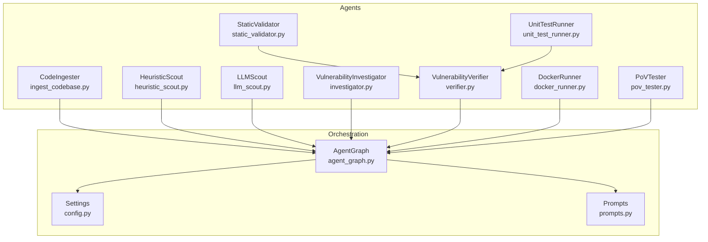
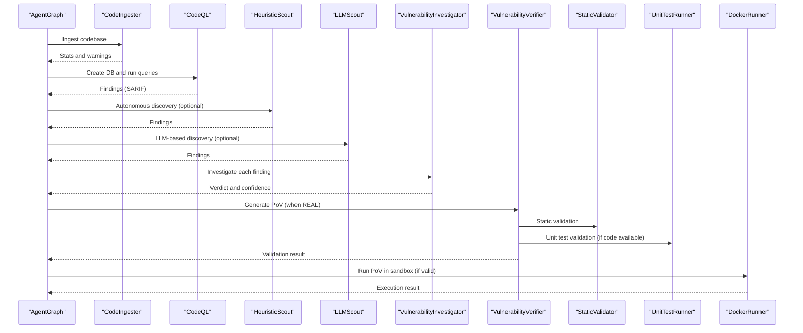
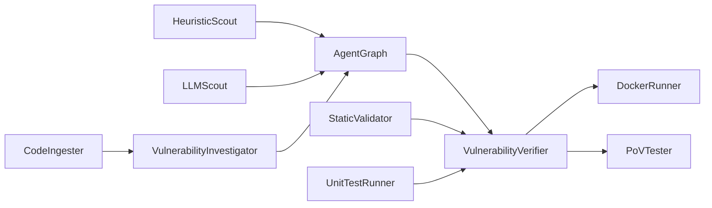

# Agent System

<cite>
**Referenced Files in This Document**
- [agents/__init__.py](file://agents/__init__.py)
- [agents/ingest_codebase.py](file://agents/ingest_codebase.py)
- [agents/heuristic_scout.py](file://agents/heuristic_scout.py)
- [agents/llm_scout.py](file://agents/llm_scout.py)
- [agents/investigator.py](file://agents/investigator.py)
- [agents/verifier.py](file://agents/verifier.py)
- [agents/docker_runner.py](file://agents/docker_runner.py)
- [agents/static_validator.py](file://agents/static_validator.py)
- [agents/unit_test_runner.py](file://agents/unit_test_runner.py)
- [agents/pov_tester.py](file://agents/pov_tester.py)
- [app/agent_graph.py](file://app/agent_graph.py)
- [app/config.py](file://app/config.py)
- [prompts.py](file://prompts.py)
</cite>

## Table of Contents
1. [Introduction](#introduction)
2. [Project Structure](#project-structure)
3. [Core Components](#core-components)
4. [Architecture Overview](#architecture-overview)
5. [Detailed Component Analysis](#detailed-component-analysis)
6. [Dependency Analysis](#dependency-analysis)
7. [Performance Considerations](#performance-considerations)
8. [Troubleshooting Guide](#troubleshooting-guide)
9. [Conclusion](#conclusion)

## Introduction
This document describes AutoPoV’s multi-agent system architecture. It explains how agents collaborate to discover, analyze, validate, and confirm vulnerabilities, and how LangGraph orchestrates the end-to-end workflow. The agents covered include:
- CodeIngester: codebase ingestion and RAG-backed retrieval
- HeuristicScout: pattern-based candidate discovery
- LLMScout: AI-powered candidate generation
- VulnerabilityInvestigator: deep analysis with LLM and RAG
- VulnerabilityVerifier: PoV script generation and validation
- DockerRunner: sandboxed execution of PoV scripts
- StaticValidator: static analysis of PoV scripts
- UnitTestRunner: isolated unit-style validation
- PoVTester: application-level testing

The document details agent lifecycles, state management, communication patterns, LangGraph integration, and practical configuration and troubleshooting guidance.

## Project Structure
AutoPoV organizes its agents under the agents/ directory and composes them into a LangGraph workflow in app/agent_graph.py. Configuration is centralized in app/config.py, and prompts for LLM interactions live in prompts.py.

**Diagram sources**
- [app/agent_graph.py:82-168](file://app/agent_graph.py#L82-L168)
- [agents/__init__.py:6-20](file://agents/__init__.py#L6-L20)
- [app/config.py:13-255](file://app/config.py#L13-L255)
- [prompts.py:1-424](file://prompts.py#L1-L424)

**Section sources**
- [agents/__init__.py:1-21](file://agents/__init__.py#L1-L21)
- [app/agent_graph.py:82-168](file://app/agent_graph.py#L82-L168)
- [app/config.py:13-255](file://app/config.py#L13-L255)
- [prompts.py:1-424](file://prompts.py#L1-L424)

## Core Components
- CodeIngester: chunks code, computes embeddings, persists to ChromaDB, and supports retrieval for RAG.
- HeuristicScout: scans codebase using predefined patterns to surface candidates quickly.
- LLMScout: summarizes file snippets and asks an LLM to propose candidates.
- VulnerabilityInvestigator: performs in-depth analysis using LLMs, RAG, and optional Joern CPG for specific CWEs.
- VulnerabilityVerifier: generates PoV scripts and validates them via static analysis, unit tests, and LLM.
- DockerRunner: executes PoV scripts in isolated containers with resource limits.
- StaticValidator: validates PoV scripts statically for required patterns and structure.
- UnitTestRunner: runs PoVs against isolated vulnerable code snippets in a restricted subprocess.
- PoVTester: executes PoVs against live applications and manages app lifecycle.

**Section sources**
- [agents/ingest_codebase.py:41-413](file://agents/ingest_codebase.py#L41-L413)
- [agents/heuristic_scout.py:13-242](file://agents/heuristic_scout.py#L13-L242)
- [agents/llm_scout.py:32-208](file://agents/llm_scout.py#L32-L208)
- [agents/investigator.py:37-519](file://agents/investigator.py#L37-L519)
- [agents/verifier.py:42-562](file://agents/verifier.py#L42-L562)
- [agents/docker_runner.py:27-377](file://agents/docker_runner.py#L27-L377)
- [agents/static_validator.py:22-305](file://agents/static_validator.py#L22-L305)
- [agents/unit_test_runner.py:28-344](file://agents/unit_test_runner.py#L28-L344)
- [agents/pov_tester.py:21-296](file://agents/pov_tester.py#L21-L296)

## Architecture Overview
AutoPoV uses LangGraph to define a stateful workflow that orchestrates agents. The workflow ingests code, optionally discovers candidates via CodeQL and autonomous scouts, investigates findings, generates and validates PoVs, and executes them in a sandbox.

**Diagram sources**
- [app/agent_graph.py:88-168](file://app/agent_graph.py#L88-L168)
- [agents/investigator.py:270-433](file://agents/investigator.py#L270-L433)
- [agents/verifier.py:90-387](file://agents/verifier.py#L90-L387)
- [agents/static_validator.py:123-234](file://agents/static_validator.py#L123-L234)
- [agents/unit_test_runner.py:34-117](file://agents/unit_test_runner.py#L34-L117)
- [agents/docker_runner.py:62-192](file://agents/docker_runner.py#L62-L192)

## Detailed Component Analysis

### CodeIngester
Responsibilities:
- Split code into chunks with metadata
- Compute embeddings (OpenAI or HuggingFace)
- Persist to ChromaDB with scan-scoped collections
- Retrieve relevant context for RAG
- Provide full-file content lookup

Key behaviors:
- Embedding selection depends on configuration mode (online/offline)
- Skips hidden directories, non-code files, binary files, and empty files
- Batched embedding insertion for performance
- Retrieval supports top-k similarity search

Configuration:
- Embedding model and provider selected via settings
- Chroma persist directory and collection naming scheme

Operational notes:
- Raises ingestion errors when required libraries are missing
- Cleanup removes per-scan collections

**Section sources**
- [agents/ingest_codebase.py:41-413](file://agents/ingest_codebase.py#L41-L413)
- [app/config.py:74-80](file://app/config.py#L74-L80)
- [app/config.py:212-231](file://app/config.py#L212-L231)

### HeuristicScout
Responsibilities:
- Scan codebase for known vulnerability patterns
- Emit candidate findings with metadata for downstream agents

Key behaviors:
- Predefined regex patterns per CWE
- Limits on findings and file sizes
- Language detection for file types

Configuration:
- Max findings and max file size governed by settings

**Section sources**
- [agents/heuristic_scout.py:13-242](file://agents/heuristic_scout.py#L13-L242)
- [app/config.py:46-53](file://app/config.py#L46-L53)

### LLMScout
Responsibilities:
- Summarize file snippets and ask an LLM to propose candidates
- Enforce cost caps and token usage extraction

Key behaviors:
- Sorts files by size and limits by configuration
- Builds a structured prompt and parses JSON results
- Estimates cost from response metadata

Configuration:
- Max files, chars per file, findings, and cost cap

**Section sources**
- [agents/llm_scout.py:32-208](file://agents/llm_scout.py#L32-L208)
- [app/config.py:46-53](file://app/config.py#L46-L53)

### VulnerabilityInvestigator
Responsibilities:
- Perform in-depth analysis using LLMs, RAG, and optional Joern CPG
- Produce structured verdicts with confidence and explanations
- Track token usage and cost

Key behaviors:
- Retrieves code context from ChromaDB or falls back to RAG
- Runs Joern for CWE-416 (use-after-free) when available
- Parses JSON responses and extracts token usage
- Calculates cost using a pricing table

Configuration:
- LLM provider and model selection via settings
- LangSmith tracing when enabled

**Section sources**
- [agents/investigator.py:37-519](file://agents/investigator.py#L37-L519)
- [app/config.py:30-44](file://app/config.py#L30-L44)
- [app/config.py:81-85](file://app/config.py#L81-L85)

### VulnerabilityVerifier
Responsibilities:
- Generate PoV scripts using LLMs
- Validate PoVs via static analysis, unit tests, and LLM fallback
- Analyze failures and suggest improvements

Key behaviors:
- Generates PoV with language-specific guidance
- Validates using StaticValidator and UnitTestRunner
- Falls back to LLM-based validation when needed
- Analyzes failures and suggests changes

Configuration:
- LLM provider and model selection via settings

**Section sources**
- [agents/verifier.py:42-562](file://agents/verifier.py#L42-L562)
- [agents/static_validator.py:22-305](file://agents/static_validator.py#L22-L305)
- [agents/unit_test_runner.py:28-344](file://agents/unit_test_runner.py#L28-L344)
- [app/config.py:30-44](file://app/config.py#L30-L44)

### DockerRunner
Responsibilities:
- Execute PoV scripts in isolated Docker containers
- Enforce timeouts, memory, and CPU quotas
- Capture stdout/stderr and determine success

Key behaviors:
- Creates ephemeral temp directories and writes PoV and extra files
- Pulls or uses configured image, runs with no network access
- Supports stdin via wrapper scripts and binary inputs
- Reports execution time and vulnerability trigger detection

Configuration:
- Docker image, timeout, memory, CPU, and availability checks

**Section sources**
- [agents/docker_runner.py:27-377](file://agents/docker_runner.py#L27-L377)
- [app/config.py:92-98](file://app/config.py#L92-L98)

### StaticValidator
Responsibilities:
- Validate PoV scripts statically for required patterns and structure
- Compute confidence scores and detect CWE-specific indicators

Key behaviors:
- Checks for “VULNERABILITY TRIGGERED” indicator
- Matches CWE-specific attack patterns and payload indicators
- Scores relevance to vulnerable code and overall confidence

**Section sources**
- [agents/static_validator.py:22-305](file://agents/static_validator.py#L22-L305)

### UnitTestRunner
Responsibilities:
- Run PoVs against isolated vulnerable code snippets
- Create test harnesses and execute in restricted subprocesses
- Support mock data testing and syntax validation

Key behaviors:
- Extracts vulnerable function and builds a harness
- Executes PoV in a subprocess with limited environment
- Times out after a fixed period and reports results

**Section sources**
- [agents/unit_test_runner.py:28-344](file://agents/unit_test_runner.py#L28-L344)

### PoVTester
Responsibilities:
- Execute PoVs against live applications
- Manage application lifecycle for end-to-end testing
- Patch target URLs and run PoVs with appropriate runtime

Key behaviors:
- Patches {{target_url}} and localhost patterns in PoVs
- Runs Python or JavaScript PoVs with environment variables
- Starts/stops apps and cleans up temp directories

**Section sources**
- [agents/pov_tester.py:21-296](file://agents/pov_tester.py#L21-L296)

### LangGraph Orchestration (AgentGraph)
Responsibilities:
- Define the multi-agent workflow and state transitions
- Coordinate ingestion, discovery, investigation, PoV generation/validation, and sandbox execution
- Maintain scan state, logs, and costs

Key behaviors:
- Nodes: ingest_code, run_codeql, investigate, generate_pov, validate_pov, run_in_docker, log_confirmed/log_skip/log_failure
- Edges: conditional routing based on investigation and validation outcomes
- State: ScanState and VulnerabilityState typed dictionaries
- Discovery: CodeQL queries with SARIF parsing; fallback to autonomous discovery
- Cost tracking: per-finding and cumulative cost tracking

Configuration:
- Policies for model selection and routing
- Learning store integration for feedback

**Section sources**
- [app/agent_graph.py:31-80](file://app/agent_graph.py#L31-L80)
- [app/agent_graph.py:88-168](file://app/agent_graph.py#L88-L168)
- [app/agent_graph.py:241-307](file://app/agent_graph.py#L241-L307)
- [app/agent_graph.py:691-777](file://app/agent_graph.py#L691-L777)

## Dependency Analysis
Agent interdependencies:
- CodeIngester is used by VulnerabilityInvestigator for context retrieval and by HeuristicScout/LLMScout for file filtering.
- VulnerabilityInvestigator is invoked by AgentGraph to analyze findings.
- VulnerabilityVerifier depends on StaticValidator and UnitTestRunner for validation.
- DockerRunner is used by AgentGraph to execute validated PoVs.
- PoVTester integrates with application lifecycle management.

External dependencies:
- LangChain (ChatOpenAI, ChatOllama, LangSmith tracing)
- ChromaDB for vector storage
- Docker SDK for Python
- CodeQL CLI and optional Joern for analysis

**Diagram sources**
- [agents/investigator.py:270-433](file://agents/investigator.py#L270-L433)
- [agents/verifier.py:225-387](file://agents/verifier.py#L225-L387)
- [agents/docker_runner.py:62-192](file://agents/docker_runner.py#L62-L192)
- [agents/pov_tester.py:24-106](file://agents/pov_tester.py#L24-L106)
- [app/agent_graph.py:88-168](file://app/agent_graph.py#L88-L168)

**Section sources**
- [agents/__init__.py:6-20](file://agents/__init__.py#L6-L20)
- [app/agent_graph.py:88-168](file://app/agent_graph.py#L88-L168)

## Performance Considerations
- Code ingestion batching reduces embedding overhead.
- LLMScout and HeuristicScout cap file counts and sizes to control cost and latency.
- DockerRunner enforces timeouts and resource limits to prevent runaway executions.
- VulnerabilityInvestigator extracts token usage to compute accurate costs.
- CodeQL queries are executed with SARIF output and parsed efficiently.

[No sources needed since this section provides general guidance]

## Troubleshooting Guide
Common issues and resolutions:
- Missing embeddings or vector store:
  - Ensure embeddings provider is installed and configured; verify ChromaDB availability.
  - Check API keys and base URLs for online mode.
- LLM availability:
  - Confirm provider SDKs are installed; verify API keys and base URLs.
  - For offline mode, ensure Ollama is reachable.
- Docker not available:
  - Verify Docker daemon is running and accessible; adjust image, timeout, and limits.
- CodeQL not available:
  - Install CodeQL CLI and ensure packs are available; fallback to heuristic/LLM-only mode.
- Joern not available:
  - Install and configure Joern for C/CPP-specific analyses.
- Cost control:
  - Adjust per-agent caps and global max cost; monitor token usage from responses.
- Static validation failures:
  - Ensure PoV prints the required indicator and uses only standard library.
- Unit test timeouts:
  - Simplify PoV logic; reduce external dependencies; increase timeouts if needed.

**Section sources**
- [agents/ingest_codebase.py:60-94](file://agents/ingest_codebase.py#L60-L94)
- [agents/docker_runner.py:37-48](file://agents/docker_runner.py#L37-L48)
- [app/config.py:162-211](file://app/config.py#L162-L211)
- [agents/static_validator.py:123-234](file://agents/static_validator.py#L123-L234)
- [agents/unit_test_runner.py:236-287](file://agents/unit_test_runner.py#L236-L287)

## Conclusion
AutoPoV’s multi-agent system combines rule-based discovery, LLM-driven analysis, and robust validation to produce reliable, executable PoVs. LangGraph coordinates the workflow, while agents encapsulate specialized capabilities—ingestion, investigation, PoV generation and validation, and sandboxed execution. Proper configuration of providers, resource limits, and cost controls ensures scalable and secure operation.