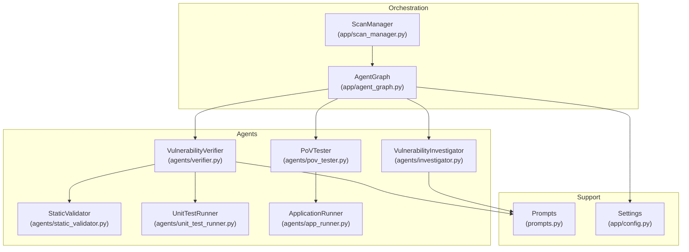
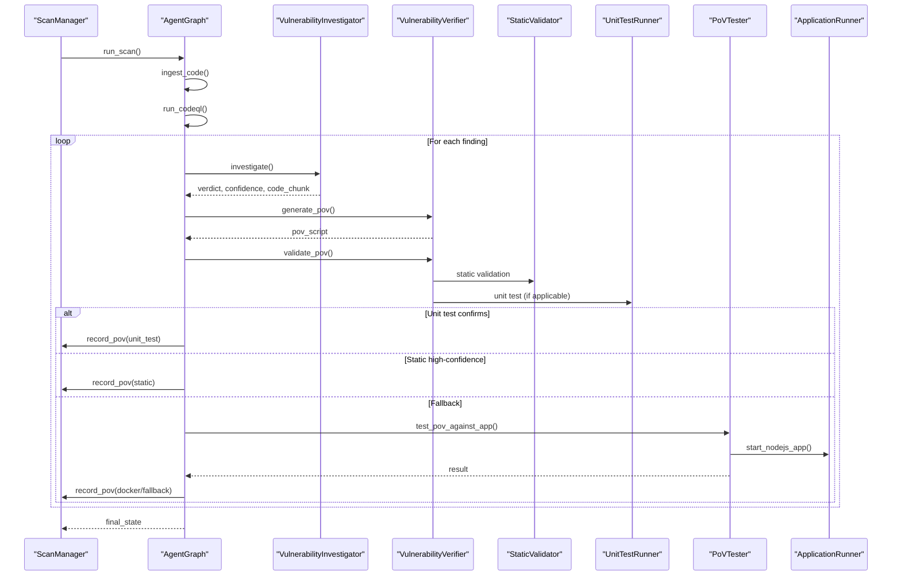
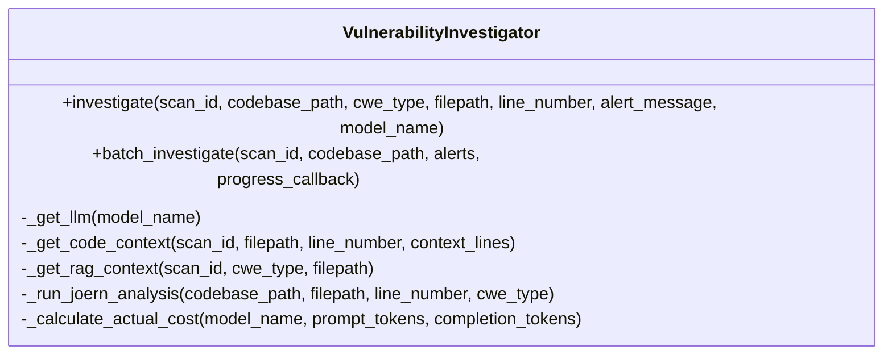
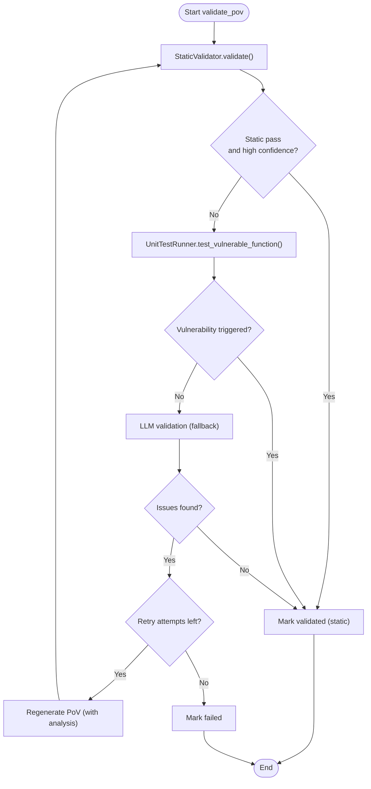
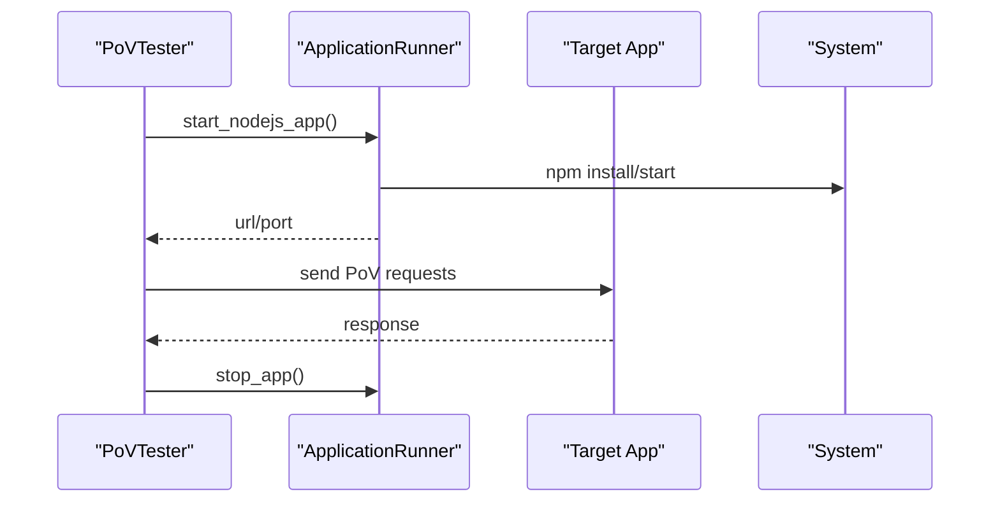
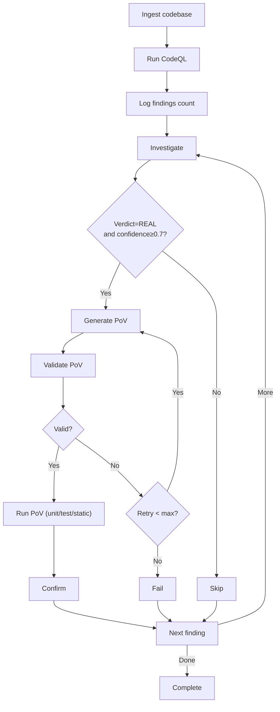
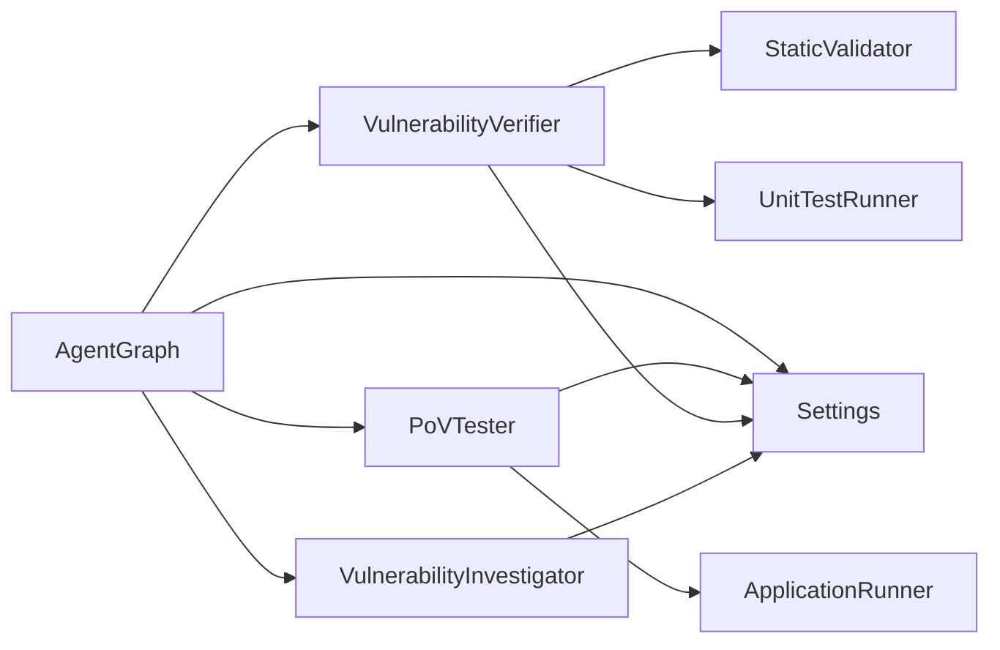

# Analysis & Generation Agents

<cite>
**Referenced Files in This Document**
- [investigator.py](file://agents/investigator.py)
- [verifier.py](file://agents/verifier.py)
- [pov_tester.py](file://agents/pov_tester.py)
- [agent_graph.py](file://app/agent_graph.py)
- [scan_manager.py](file://app/scan_manager.py)
- [prompts.py](file://prompts.py)
- [config.py](file://app/config.py)
- [static_validator.py](file://agents/static_validator.py)
- [unit_test_runner.py](file://agents/unit_test_runner.py)
- [app_runner.py](file://agents/app_runner.py)
</cite>

## Table of Contents
1. [Introduction](#introduction)
2. [Project Structure](#project-structure)
3. [Core Components](#core-components)
4. [Architecture Overview](#architecture-overview)
5. [Detailed Component Analysis](#detailed-component-analysis)
6. [Dependency Analysis](#dependency-analysis)
7. [Performance Considerations](#performance-considerations)
8. [Troubleshooting Guide](#troubleshooting-guide)
9. [Conclusion](#conclusion)

## Introduction
This document explains AutoPoV’s analysis and generation agents that collaboratively detect, analyze, and validate vulnerabilities. It focuses on:
- VulnerabilityInvestigator: deep analysis, confidence scoring, and vulnerability assessment methodology
- VulnerabilityVerifier: PoV script generation, hybrid validation, and proof creation
- Agent collaboration patterns, decision trees, and quality assurance mechanisms
- Implementation examples, configuration options, and integration with external tools

## Project Structure
AutoPoV organizes its analysis and generation agents under the agents/ directory, orchestrates workflows via app/agent_graph.py, and manages lifecycle and persistence via app/scan_manager.py. Prompts are centralized in prompts.py, and configuration is handled in app/config.py.

**Diagram sources**
- [investigator.py:37-519](file://agents/investigator.py#L37-L519)
- [verifier.py:42-562](file://agents/verifier.py#L42-L562)
- [static_validator.py:22-305](file://agents/static_validator.py#L22-L305)
- [unit_test_runner.py:28-344](file://agents/unit_test_runner.py#L28-L344)
- [pov_tester.py:21-296](file://agents/pov_tester.py#L21-L296)
- [app_runner.py:19-200](file://agents/app_runner.py#L19-L200)
- [agent_graph.py:82-168](file://app/agent_graph.py#L82-L168)
- [scan_manager.py:47-663](file://app/scan_manager.py#L47-L663)
- [prompts.py:7-424](file://prompts.py#L7-L424)
- [config.py:13-255](file://app/config.py#L13-L255)

**Section sources**
- [agent_graph.py:82-168](file://app/agent_graph.py#L82-L168)
- [scan_manager.py:47-115](file://app/scan_manager.py#L47-L115)
- [prompts.py:7-424](file://prompts.py#L7-L424)
- [config.py:13-255](file://app/config.py#L13-L255)

## Core Components
- VulnerabilityInvestigator: performs LLM-based vulnerability analysis with RAG, optional Joern CPG for use-after-free, and structured confidence scoring.
- VulnerabilityVerifier: generates PoV scripts, validates them statically and via unit tests, and falls back to LLM validation when needed.
- AgentGraph: orchestrates the full workflow from ingestion to PoV execution, with decision gates and retries.
- ScanManager: manages scan lifecycle, persists results, and streams logs.
- Supporting utilities: StaticValidator, UnitTestRunner, PoVTester, ApplicationRunner, and centralized prompts/settings.

**Section sources**
- [investigator.py:37-519](file://agents/investigator.py#L37-L519)
- [verifier.py:42-562](file://agents/verifier.py#L42-L562)
- [agent_graph.py:691-1057](file://app/agent_graph.py#L691-L1057)
- [scan_manager.py:117-365](file://app/scan_manager.py#L117-L365)
- [static_validator.py:22-305](file://agents/static_validator.py#L22-L305)
- [unit_test_runner.py:28-344](file://agents/unit_test_runner.py#L28-L344)
- [pov_tester.py:21-296](file://agents/pov_tester.py#L21-L296)
- [app_runner.py:19-200](file://agents/app_runner.py#L19-L200)
- [prompts.py:7-424](file://prompts.py#L7-L424)
- [config.py:13-255](file://app/config.py#L13-L255)

## Architecture Overview
The system uses a LangGraph-based workflow to move through ingestion, CodeQL discovery, investigation, PoV generation, validation, and execution. Agents collaborate with shared prompts and configuration, and results are aggregated into a final report.

**Diagram sources**
- [agent_graph.py:691-1057](file://app/agent_graph.py#L691-L1057)
- [investigator.py:270-433](file://agents/investigator.py#L270-L433)
- [verifier.py:90-387](file://agents/verifier.py#L90-L387)
- [static_validator.py:123-233](file://agents/static_validator.py#L123-L233)
- [unit_test_runner.py:34-116](file://agents/unit_test_runner.py#L34-L116)
- [pov_tester.py:24-105](file://agents/pov_tester.py#L24-L105)
- [app_runner.py:25-148](file://agents/app_runner.py#L25-L148)
- [scan_manager.py:266-365](file://app/scan_manager.py#L266-L365)

## Detailed Component Analysis

### VulnerabilityInvestigator
- Purpose: Deep analysis of potential vulnerabilities using LLMs with RAG and optional Joern CPG for use-after-free.
- Key capabilities:
  - Dynamic LLM selection (online via OpenRouter/Ollama) with cost tracking.
  - Code context retrieval via RAG and file-based context windows.
  - Optional Joern CPG analysis for CWE-416.
  - Structured JSON output with verdict, confidence, explanation, and vulnerability details.
- Confidence scoring:
  - Confidence is returned as part of the structured LLM response.
  - Cost tracking uses token usage metadata when available.
- Decision-making:
  - Integrates with AgentGraph decision nodes to gate PoV generation based on verdict and confidence thresholds.

**Diagram sources**
- [investigator.py:37-519](file://agents/investigator.py#L37-L519)

**Section sources**
- [investigator.py:270-433](file://agents/investigator.py#L270-L433)
- [prompts.py:7-44](file://prompts.py#L7-L44)
- [config.py:212-231](file://app/config.py#L212-L231)

### VulnerabilityVerifier
- Purpose: Generate PoV scripts and validate them using a hybrid approach.
- Validation pipeline:
  - Static analysis: pattern matching and CWE-specific checks.
  - Unit test execution: isolated harness against vulnerable code snippets.
  - LLM fallback: advanced validation when static/unit tests are inconclusive.
- PoV generation:
  - Uses prompts tailored to target language and CWE.
  - Enforces constraints (standard library only, deterministic behavior).
- Retry and refinement:
  - Analyzes failures and suggests improvements.
  - Supports configurable retry limits.

**Diagram sources**
- [verifier.py:225-387](file://agents/verifier.py#L225-L387)
- [static_validator.py:123-233](file://agents/static_validator.py#L123-L233)
- [unit_test_runner.py:34-116](file://agents/unit_test_runner.py#L34-L116)

**Section sources**
- [verifier.py:90-387](file://agents/verifier.py#L90-L387)
- [static_validator.py:123-233](file://agents/static_validator.py#L123-L233)
- [unit_test_runner.py:34-116](file://agents/unit_test_runner.py#L34-L116)
- [prompts.py:46-121](file://prompts.py#L46-L121)

### PoVTester and ApplicationRunner
- PoVTester:
  - Executes PoV scripts against running applications.
  - Supports Python and JavaScript PoVs, URL patching, and lifecycle management.
- ApplicationRunner:
  - Starts/stops Node.js applications for testing.
  - Provides health checks and resource isolation.

**Diagram sources**
- [pov_tester.py:24-105](file://agents/pov_tester.py#L24-L105)
- [app_runner.py:25-148](file://agents/app_runner.py#L25-L148)

**Section sources**
- [pov_tester.py:24-105](file://agents/pov_tester.py#L24-L105)
- [app_runner.py:25-148](file://agents/app_runner.py#L25-L148)

### Agent Collaboration and Decision Trees
- AgentGraph orchestrates the end-to-end workflow:
  - Ingestion → CodeQL discovery → Log findings → Investigate → Conditional: generate PoV or skip → Validate → Run PoV → Aggregate → Next finding or complete.
- Decisions:
  - Generate PoV only for findings with “REAL” verdict and confidence ≥ threshold.
  - Retry generation or mark failure based on retry counts.
  - Use unit test or static validation results when available; otherwise, run in Docker/fallback.

**Diagram sources**
- [agent_graph.py:109-167](file://app/agent_graph.py#L109-L167)
- [agent_graph.py:1059-1110](file://app/agent_graph.py#L1059-L1110)

**Section sources**
- [agent_graph.py:109-167](file://app/agent_graph.py#L109-L167)
- [agent_graph.py:1059-1110](file://app/agent_graph.py#L1059-L1110)

## Dependency Analysis
- Internal dependencies:
  - AgentGraph depends on Investigator, Verifier, PoVTester, and configuration.
  - Verifier depends on StaticValidator and UnitTestRunner.
  - PoVTester depends on ApplicationRunner.
- External integrations:
  - LLM providers (OpenRouter/Ollama) via LangChain.
  - CodeQL CLI and Joern CLI for analysis.
  - Docker for sandboxed execution (when enabled).
- Configuration:
  - Centralized via Settings with environment variables and runtime checks.

**Diagram sources**
- [agent_graph.py:82-168](file://app/agent_graph.py#L82-L168)
- [investigator.py:27-29](file://agents/investigator.py#L27-L29)
- [verifier.py:27-34](file://agents/verifier.py#L27-L34)
- [pov_tester.py:13-13](file://agents/pov_tester.py#L13-L13)
- [config.py:13-255](file://app/config.py#L13-L255)

**Section sources**
- [agent_graph.py:82-168](file://app/agent_graph.py#L82-L168)
- [investigator.py:27-29](file://agents/investigator.py#L27-L29)
- [verifier.py:27-34](file://agents/verifier.py#L27-L34)
- [pov_tester.py:13-13](file://agents/pov_tester.py#L13-L13)
- [config.py:13-255](file://app/config.py#L13-L255)

## Performance Considerations
- Cost tracking:
  - Actual token usage is extracted from LLM responses and converted to USD using model-specific pricing.
- Model routing:
  - Policy-based model selection reduces latency and cost by choosing appropriate models per task.
- Parallelism:
  - Thread pool execution for scan runs and asynchronous orchestration reduce end-to-end latency.
- Resource limits:
  - Subprocess timeouts and restricted environments protect system stability during PoV execution.

[No sources needed since this section provides general guidance]

## Troubleshooting Guide
- Investigation failures:
  - Investigator returns structured error results with timing and metadata for diagnostics.
- LLM provider issues:
  - Missing API keys or offline model availability raises explicit exceptions; verify configuration.
- CodeQL/Joern availability:
  - Availability checks prevent crashes and enable fallbacks to heuristic or LLM-only analysis.
- PoV validation failures:
  - StaticValidator highlights missing indicators; UnitTestRunner reports syntax and execution errors; Verifier suggests improvements and retries.
- Application lifecycle:
  - ApplicationRunner handles dependency installation, startup readiness, and graceful shutdown.

**Section sources**
- [investigator.py:416-432](file://agents/investigator.py#L416-L432)
- [verifier.py:37-39](file://agents/verifier.py#L37-L39)
- [config.py:176-211](file://app/config.py#L176-L211)
- [static_validator.py:123-233](file://agents/static_validator.py#L123-L233)
- [unit_test_runner.py:34-116](file://agents/unit_test_runner.py#L34-L116)
- [app_runner.py:25-148](file://agents/app_runner.py#L25-L148)

## Conclusion
AutoPoV’s agents form a robust, layered pipeline: Investigator performs deep, context-aware analysis with confidence scoring; Verifier rigorously validates PoVs using static analysis, unit tests, and LLM fallback; AgentGraph coordinates the workflow with clear decision points and retries; ScanManager ensures reliable lifecycle management and persistence. Together, they deliver high-quality vulnerability assessments and reproducible proofs-of-vulnerability with strong quality assurance.