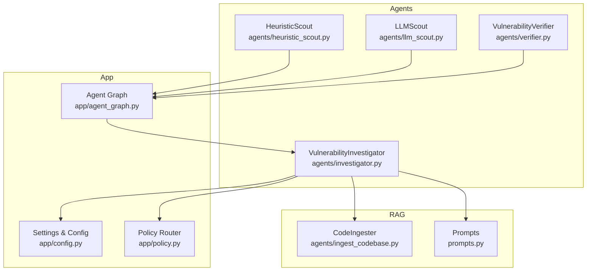
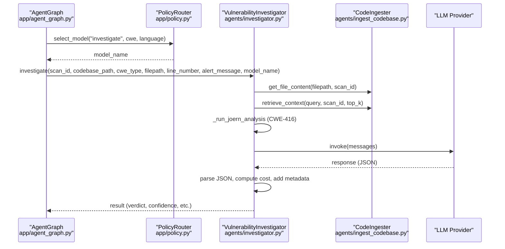
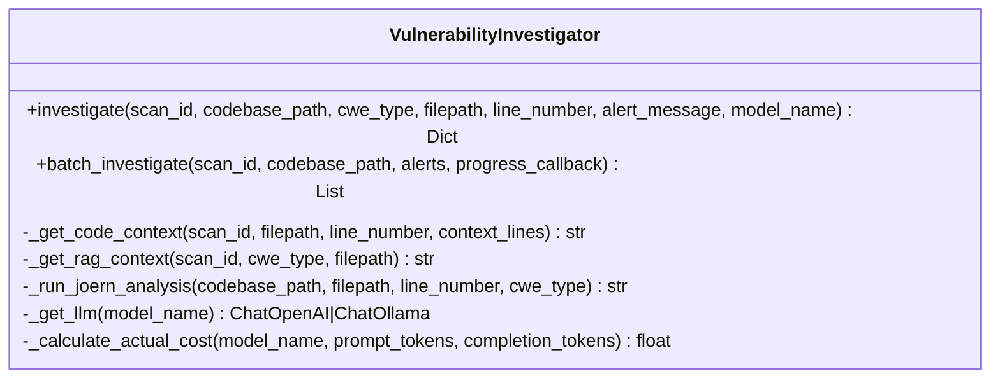
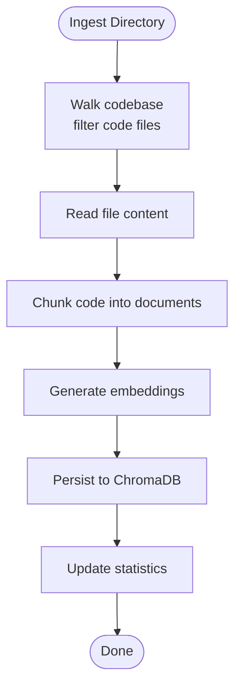
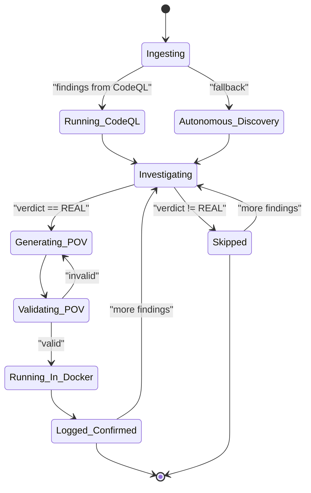
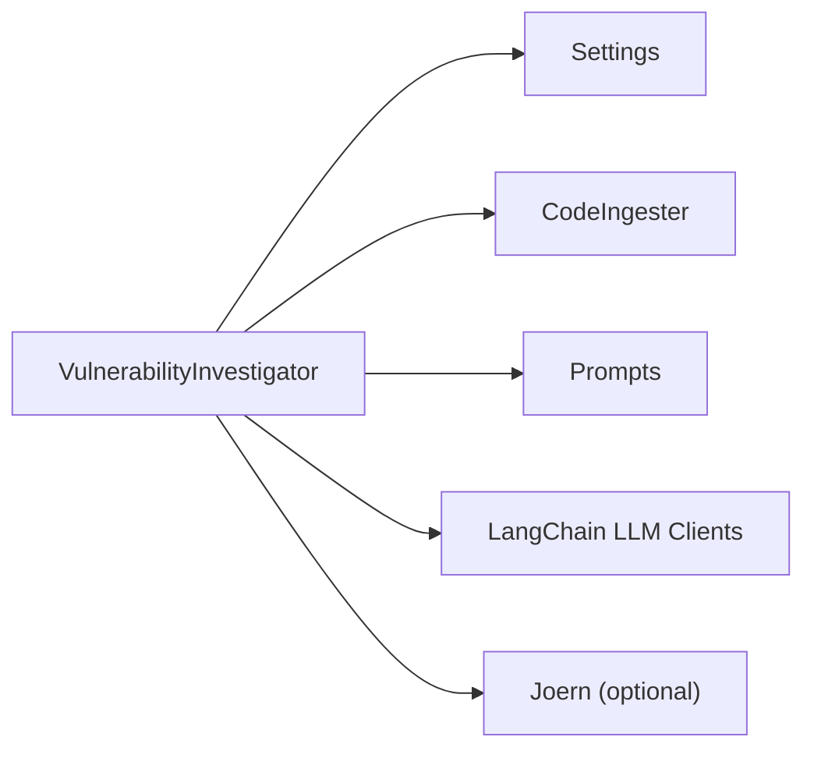

# Vulnerability Investigator

<cite>
**Referenced Files in This Document**
- [investigator.py](file://agents/investigator.py)
- [ingest_codebase.py](file://agents/ingest_codebase.py)
- [prompts.py](file://prompts.py)
- [config.py](file://app/config.py)
- [agent_graph.py](file://app/agent_graph.py)
- [policy.py](file://app/policy.py)
- [heuristic_scout.py](file://agents/heuristic_scout.py)
- [llm_scout.py](file://agents/llm_scout.py)
- [verifier.py](file://agents/verifier.py)
</cite>

## Table of Contents
1. [Introduction](#introduction)
2. [Project Structure](#project-structure)
3. [Core Components](#core-components)
4. [Architecture Overview](#architecture-overview)
5. [Detailed Component Analysis](#detailed-component-analysis)
6. [Dependency Analysis](#dependency-analysis)
7. [Performance Considerations](#performance-considerations)
8. [Troubleshooting Guide](#troubleshooting-guide)
9. [Conclusion](#conclusion)
10. [Appendices](#appendices)

## Introduction
The VulnerabilityInvestigator agent is the central analyzer in the AutoPoV multi-agent pipeline. It performs LLM-powered vulnerability investigations by combining:
- Code context extraction from a vector-backed codebase
- Retrieval-Augmented Generation (RAG) to enrich context
- Specialized external tooling for specific CWEs (notably CWE-416)
- Confidence scoring and verdict classification
- Cost tracking and token usage accounting
- Integration with the broader agent graph for end-to-end vulnerability detection and PoV generation

This document explains the investigation workflow, configuration options, error handling, performance optimization, and the agent’s role in the multi-agent pipeline.

## Project Structure
The VulnerabilityInvestigator lives in the agents module and collaborates with:
- Code ingestion and retrieval (vector store)
- Prompt templates for investigation and RAG
- Configuration for LLM providers and tool availability
- The agent graph orchestrating the full pipeline
- Supporting scouts and verifier for complementary capabilities

**Diagram sources**
- [investigator.py:37-519](file://agents/investigator.py#L37-L519)
- [ingest_codebase.py:41-413](file://agents/ingest_codebase.py#L41-L413)
- [prompts.py:7-424](file://prompts.py#L7-L424)
- [config.py:13-255](file://app/config.py#L13-L255)
- [agent_graph.py:82-800](file://app/agent_graph.py#L82-L800)
- [policy.py:12-40](file://app/policy.py#L12-L40)
- [heuristic_scout.py:13-242](file://agents/heuristic_scout.py#L13-L242)
- [llm_scout.py:32-208](file://agents/llm_scout.py#L32-L208)
- [verifier.py:42-562](file://agents/verifier.py#L42-L562)

**Section sources**
- [investigator.py:1-519](file://agents/investigator.py#L1-L519)
- [ingest_codebase.py:1-413](file://agents/ingest_codebase.py#L1-L413)
- [prompts.py:1-424](file://prompts.py#L1-L424)
- [config.py:1-255](file://app/config.py#L1-L255)
- [agent_graph.py:1-800](file://app/agent_graph.py#L1-L800)
- [policy.py:1-40](file://app/policy.py#L1-L40)
- [heuristic_scout.py:1-242](file://agents/heuristic_scout.py#L1-L242)
- [llm_scout.py:1-208](file://agents/llm_scout.py#L1-L208)
- [verifier.py:1-562](file://agents/verifier.py#L1-L562)

## Core Components
- VulnerabilityInvestigator: Orchestrates investigation, context retrieval, optional Joern analysis, LLM invocation, JSON parsing, confidence scoring, and cost tracking.
- CodeIngester: Handles code chunking, embeddings, and ChromaDB storage/retrieval for RAG.
- Prompts: Centralized templates for investigation, PoV generation/validation, and RAG enhancement.
- Settings: LLM provider configuration, tool availability checks, and cost/cap controls.
- Agent Graph: Multi-agent orchestration integrating CodeQL, scouts, investigator, verifier, and PoV runner.
- Policy Router: Selects appropriate models per stage based on routing mode.

Key responsibilities:
- Extraction of code context around a target line
- RAG-based enrichment using stored code chunks
- Optional CWE-416 analysis via Joern (CPG)
- LLM-powered verdict classification and confidence scoring
- Token usage extraction and cost calculation
- Integration with the broader pipeline for PoV generation and validation

**Section sources**
- [investigator.py:37-519](file://agents/investigator.py#L37-L519)
- [ingest_codebase.py:41-413](file://agents/ingest_codebase.py#L41-L413)
- [prompts.py:7-424](file://prompts.py#L7-L424)
- [config.py:13-255](file://app/config.py#L13-L255)
- [agent_graph.py:691-778](file://app/agent_graph.py#L691-L778)
- [policy.py:18-32](file://app/policy.py#L18-L32)

## Architecture Overview
The VulnerabilityInvestigator participates in a LangGraph-based workflow:
- Code ingestion into a vector store
- CodeQL or autonomous discovery of findings
- Investigation node selects a model and calls the investigator
- Real findings proceed to PoV generation and validation
- Costs and metrics are tracked across the pipeline

**Diagram sources**
- [agent_graph.py:691-778](file://app/agent_graph.py#L691-L778)
- [policy.py:18-32](file://app/policy.py#L18-L32)
- [investigator.py:270-433](file://agents/investigator.py#L270-L433)
- [ingest_codebase.py:315-391](file://agents/ingest_codebase.py#L315-L391)

**Section sources**
- [agent_graph.py:691-778](file://app/agent_graph.py#L691-L778)
- [policy.py:18-32](file://app/policy.py#L18-L32)
- [investigator.py:270-433](file://agents/investigator.py#L270-L433)
- [ingest_codebase.py:315-391](file://agents/ingest_codebase.py#L315-L391)

## Detailed Component Analysis

### VulnerabilityInvestigator
The investigator coordinates:
- Code context retrieval (full file content or RAG)
- RAG context enrichment
- Optional Joern analysis for CWE-416
- LLM prompt construction and invocation
- JSON result parsing and metadata enrichment
- Cost tracking and token usage extraction

**Diagram sources**
- [investigator.py:37-519](file://agents/investigator.py#L37-L519)

Key workflows:
- Code context extraction: Attempts to fetch full file content from the vector store; falls back to RAG retrieval if unavailable.
- RAG context: Queries the vector store for related code chunks to enrich the prompt.
- Joern integration: Executes CPG analysis for CWE-416 when available and configured.
- LLM invocation: Builds a structured prompt and invokes the selected LLM provider.
- JSON parsing: Extracts and validates the JSON response; defaults to a safe structure on parse failure.
- Cost tracking: Reads token usage from response metadata and computes cost based on pricing.

Confidence scoring and verdict classification:
- The LLM returns a JSON with a verdict ("REAL" or "FALSE_POSITIVE"), confidence (0.0–1.0), and supporting fields.
- The agent preserves and propagates these fields along with additional metadata.

Integration with external tools:
- Joern: Executed only for CWE-416; returns analysis output or error messages.

Implementation examples:
- Investigation request: See [investigator.investigate:270-433](file://agents/investigator.py#L270-L433)
- Response parsing and result interpretation: See [investigator.investigate:379-414](file://agents/investigator.py#L379-L414)
- Batch investigation: See [investigator.batch_investigate:473-509](file://agents/investigator.py#L473-L509)

**Section sources**
- [investigator.py:202-472](file://agents/investigator.py#L202-L472)
- [prompts.py:7-44](file://prompts.py#L7-L44)

### CodeIngester (RAG)
The ingester handles:
- Text splitting and chunking
- Embedding selection (online vs offline)
- ChromaDB persistence and retrieval
- File filtering and binary detection
- Batched embedding and insertion

**Diagram sources**
- [ingest_codebase.py:207-313](file://agents/ingest_codebase.py#L207-L313)

Key capabilities:
- Language detection from file extensions
- Binary file detection to skip non-text content
- Batched embedding and insertion for performance
- Retrieval by query embedding with top-k results

**Section sources**
- [ingest_codebase.py:41-413](file://agents/ingest_codebase.py#L41-L413)

### Prompts and Templates
Centralized prompt templates enable consistent investigation and PoV workflows:
- INVESTIGATION_PROMPT: Defines the structured JSON schema for verdict, confidence, and explanations.
- RAG_CONTEXT_PROMPT: Enhances context synthesis for better analysis.
- Other templates support PoV generation, validation, and retry analysis.

**Section sources**
- [prompts.py:7-424](file://prompts.py#L7-L424)

### Configuration Options
Settings control LLM providers, tool availability, and cost controls:
- Online vs offline model modes
- Provider-specific base URLs and keys
- Tool availability checks (CodeQL, Joern, Docker)
- Cost tracking and maximum cost limits
- Vector store and embedding model selection

Provider configuration:
- Online mode uses OpenRouter-compatible base URL and API key.
- Offline mode uses Ollama base URL.

Tool availability:
- CodeQL and Joern availability checked via subprocess calls.

**Section sources**
- [config.py:13-255](file://app/config.py#L13-L255)

### Multi-Agent Pipeline Integration
The investigator is part of a larger workflow orchestrated by AgentGraph:
- Ingestion node builds the vector store
- CodeQL or autonomous discovery produces findings
- Investigate node calls the investigator with a selected model
- Verified "REAL" findings proceed to PoV generation and validation

**Diagram sources**
- [agent_graph.py:88-168](file://app/agent_graph.py#L88-L168)

**Section sources**
- [agent_graph.py:691-778](file://app/agent_graph.py#L691-L778)
- [policy.py:18-32](file://app/policy.py#L18-L32)

### Supporting Agents and Tools
- HeuristicScout: Lightweight pattern-based candidate discovery.
- LLMScout: LLM-based candidate discovery with cost control.
- VulnerabilityVerifier: PoV generation, validation, and failure analysis.

These agents complement the investigator by providing initial candidates and confirming findings.

**Section sources**
- [heuristic_scout.py:13-242](file://agents/heuristic_scout.py#L13-L242)
- [llm_scout.py:32-208](file://agents/llm_scout.py#L32-L208)
- [verifier.py:42-562](file://agents/verifier.py#L42-L562)

## Dependency Analysis
The investigator depends on:
- Settings for provider configuration and tool availability
- CodeIngester for context retrieval and RAG
- Prompts for structured LLM interaction
- LangChain LLM clients for OpenAI and Ollama
- Optional Joern for CWE-416 analysis

**Diagram sources**
- [investigator.py:27-29](file://agents/investigator.py#L27-L29)
- [config.py:212-231](file://app/config.py#L212-L231)
- [ingest_codebase.py:33-94](file://agents/ingest_codebase.py#L33-L94)

**Section sources**
- [investigator.py:27-29](file://agents/investigator.py#L27-L29)
- [config.py:212-231](file://app/config.py#L212-L231)
- [ingest_codebase.py:33-94](file://agents/ingest_codebase.py#L33-L94)

## Performance Considerations
- RAG retrieval batching: The ingester embeds and inserts in batches to reduce overhead.
- Context window control: The investigator limits context lines and uses RAG when full file content is unavailable.
- Tool availability checks: Avoids expensive subprocess calls when tools are not installed.
- Cost-awareness: Token usage extraction and cost calculation prevent unexpected spending.
- Model selection: Policy routing chooses optimal models per stage to balance quality and cost.

[No sources needed since this section provides general guidance]

## Troubleshooting Guide
Common issues and resolutions:
- Missing provider libraries: The investigator raises explicit exceptions when required LangChain integrations are missing.
- Tool unavailability: Joern and CodeQL availability is checked; fallbacks are applied when tools are not present.
- Parsing failures: On JSON parse errors, the investigator returns a safe default result with error metadata.
- Timeout handling: Joern subprocess calls include timeouts to prevent hanging.
- Cost tracking: Token usage extraction attempts multiple response metadata formats; failures are logged and cost estimation proceeds.

**Section sources**
- [investigator.py:32-34](file://agents/investigator.py#L32-L34)
- [investigator.py:128-130](file://agents/investigator.py#L128-L130)
- [investigator.py:197-200](file://agents/investigator.py#L197-L200)
- [investigator.py:379-400](file://agents/investigator.py#L379-L400)
- [config.py:188-198](file://app/config.py#L188-L198)

## Conclusion
The VulnerabilityInvestigator agent provides a robust, configurable, and cost-conscious approach to vulnerability investigation. By combining precise code context extraction, RAG enrichment, specialized tooling for specific CWEs, and structured LLM analysis, it fits seamlessly into the AutoPoV multi-agent pipeline. Its integration with the agent graph ensures findings are validated and, when applicable, transformed into executable PoVs for further verification.

[No sources needed since this section summarizes without analyzing specific files]

## Appendices

### Implementation Examples

- Investigation request and response parsing
  - Request: [VulnerabilityInvestigator.investigate:270-433](file://agents/investigator.py#L270-L433)
  - Response parsing and metadata enrichment: [VulnerabilityInvestigator.investigate:379-414](file://agents/investigator.py#L379-L414)

- Batch investigation
  - [VulnerabilityInvestigator.batch_investigate:473-509](file://agents/investigator.py#L473-L509)

- Cost tracking and token usage
  - Token usage extraction: [VulnerabilityInvestigator.investigate:339-378](file://agents/investigator.py#L339-L378)
  - Pricing and cost calculation: [VulnerabilityInvestigator._calculate_actual_cost:434-472](file://agents/investigator.py#L434-L472)

- Configuration options
  - Provider selection and base URLs: [Settings.get_llm_config:212-231](file://app/config.py#L212-L231)
  - Tool availability checks: [Settings.is_joern_available:188-198](file://app/config.py#L188-L198), [Settings.is_codeql_available:176-186](file://app/config.py#L176-L186)

- Agent graph integration
  - Model selection and investigation node: [AgentGraph._node_investigate:691-778](file://app/agent_graph.py#L691-L778)
  - Policy routing: [PolicyRouter.select_model:18-32](file://app/policy.py#L18-L32)

**Section sources**
- [investigator.py:270-472](file://agents/investigator.py#L270-L472)
- [config.py:188-231](file://app/config.py#L188-L231)
- [agent_graph.py:691-778](file://app/agent_graph.py#L691-L778)
- [policy.py:18-32](file://app/policy.py#L18-L32)