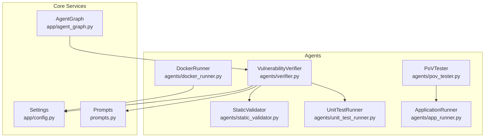
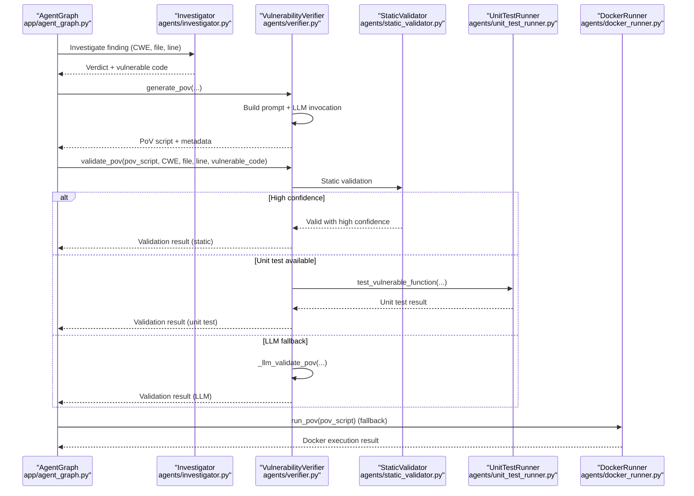
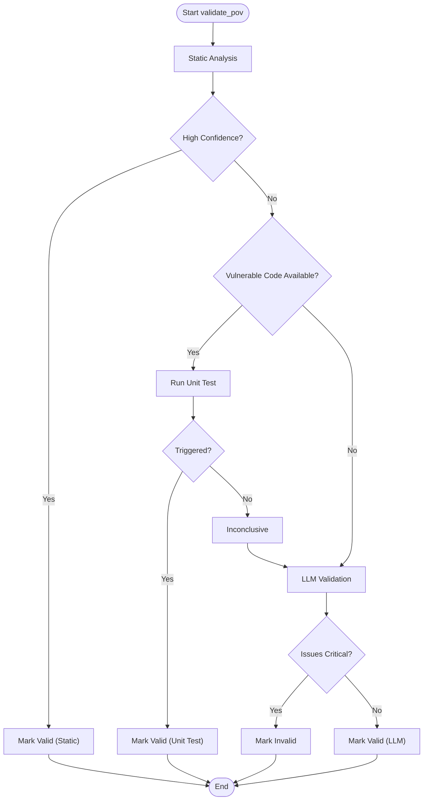
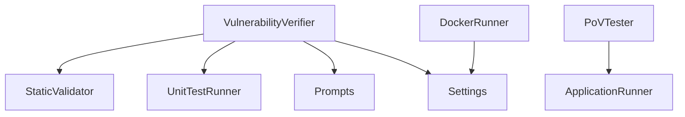

# Vulnerability Verifier

<cite>
**Referenced Files in This Document**
- [verifier.py](file://agents/verifier.py)
- [static_validator.py](file://agents/static_validator.py)
- [unit_test_runner.py](file://agents/unit_test_runner.py)
- [docker_runner.py](file://agents/docker_runner.py)
- [pov_tester.py](file://agents/pov_tester.py)
- [prompts.py](file://prompts.py)
- [config.py](file://app/config.py)
- [agent_graph.py](file://app/agent_graph.py)
- [app_runner.py](file://agents/app_runner.py)
- [test_agent.py](file://tests/test_agent.py)
</cite>

## Table of Contents
1. [Introduction](#introduction)
2. [Project Structure](#project-structure)
3. [Core Components](#core-components)
4. [Architecture Overview](#architecture-overview)
5. [Detailed Component Analysis](#detailed-component-analysis)
6. [Dependency Analysis](#dependency-analysis)
7. [Performance Considerations](#performance-considerations)
8. [Troubleshooting Guide](#troubleshooting-guide)
9. [Conclusion](#conclusion)

## Introduction
This document describes the Vulnerability Verifier agent responsible for Proof-of-Vulnerability (PoV) script generation and exploit validation within the AutoPoV pipeline. It explains the agent’s PoV creation algorithms, exploit template selection, and validation methodology. It also covers integration with Docker sandbox execution, unit testing frameworks, and static analysis tools, and documents the verification workflow from initial PoV generation through multiple validation stages. Implementation examples show PoV script generation, execution validation, and result interpretation. Configuration options for different exploit types, error handling strategies, and performance considerations are included, along with the agent’s role in ensuring exploit reliability and its integration with the broader AutoPoV validation pipeline.

## Project Structure
The Vulnerability Verifier resides in the agents module and collaborates with supporting components for static validation, unit testing, Docker sandboxing, and PoV testing against live applications. The agent integrates with the broader AutoPoV workflow orchestrated by the Agent Graph.

**Diagram sources**
- [verifier.py:42-562](file://agents/verifier.py#L42-L562)
- [static_validator.py:22-305](file://agents/static_validator.py#L22-L305)
- [unit_test_runner.py:28-344](file://agents/unit_test_runner.py#L28-L344)
- [docker_runner.py:27-377](file://agents/docker_runner.py#L27-L377)
- [pov_tester.py:21-296](file://agents/pov_tester.py#L21-L296)
- [app_runner.py:19-200](file://agents/app_runner.py#L19-L200)
- [prompts.py:46-424](file://prompts.py#L46-L424)
- [config.py:13-255](file://app/config.py#L13-L255)
- [agent_graph.py:82-168](file://app/agent_graph.py#L82-L168)

**Section sources**
- [verifier.py:1-562](file://agents/verifier.py#L1-L562)
- [agent_graph.py:82-168](file://app/agent_graph.py#L82-L168)

## Core Components
- VulnerabilityVerifier: Generates PoV scripts using LLM prompts and validates them using a hybrid approach (static, unit test, and LLM).
- StaticValidator: Performs static analysis to quickly assess PoV correctness and relevance.
- UnitTestRunner: Executes PoV scripts against isolated vulnerable code snippets in a controlled environment.
- DockerRunner: Runs PoV scripts in isolated Docker containers for sandboxed execution.
- PoVTester: Tests PoV scripts against live applications and manages application lifecycle.
- Prompts: Centralized LLM prompts for PoV generation, validation, and retry analysis.
- Settings: Configuration for LLM providers, Docker, and cost control.

**Section sources**
- [verifier.py:42-562](file://agents/verifier.py#L42-L562)
- [static_validator.py:22-305](file://agents/static_validator.py#L22-L305)
- [unit_test_runner.py:28-344](file://agents/unit_test_runner.py#L28-L344)
- [docker_runner.py:27-377](file://agents/docker_runner.py#L27-L377)
- [pov_tester.py:21-296](file://agents/pov_tester.py#L21-L296)
- [prompts.py:46-424](file://prompts.py#L46-L424)
- [config.py:13-255](file://app/config.py#L13-L255)

## Architecture Overview
The Vulnerability Verifier participates in the AutoPoV Agent Graph workflow. The graph orchestrates ingestion, CodeQL analysis, investigation, PoV generation, validation, and execution. The verifier generates PoV scripts and validates them using static analysis, unit tests, and LLM analysis. Docker execution serves as a fallback when validation is inconclusive.

**Diagram sources**
- [agent_graph.py:779-1004](file://app/agent_graph.py#L779-L1004)
- [verifier.py:90-387](file://agents/verifier.py#L90-L387)
- [static_validator.py:123-233](file://agents/static_validator.py#L123-L233)
- [unit_test_runner.py:34-116](file://agents/unit_test_runner.py#L34-L116)
- [docker_runner.py:62-192](file://agents/docker_runner.py#L62-L192)

## Detailed Component Analysis

### VulnerabilityVerifier
The VulnerabilityVerifier is responsible for PoV generation and validation. It selects an LLM based on configuration, formats prompts, and executes validation using a hybrid approach.

- PoV Generation
  - Determines target language awareness and PoV language.
  - Formats a prompt tailored to the CWE and code context.
  - Invokes the LLM and extracts token usage for cost tracking.
  - Cleans markdown code blocks and records timing and cost.

- Validation Workflow
  - Static Analysis: Uses StaticValidator to check PoV correctness and relevance.
  - Unit Test Execution: If vulnerable code is available, validates syntax and runs PoV against the isolated function.
  - LLM Validation: As a fallback, uses a dedicated validation prompt to assess PoV quality.
  - CWE-Specific Checks: Validates PoV against CWE-specific patterns and requirements.

- Error Handling
  - Catches exceptions during generation and returns structured failure metadata.
  - Validates syntax using AST and enforces standard library constraints.
  - Tracks issues and suggests improvements.

- Configuration Integration
  - Uses settings to select online/offline LLM mode and model.
  - Supports cost tracking via token usage extraction.

Implementation examples (paths only):
- [generate_pov(...) call site:810-819](file://app/agent_graph.py#L810-L819)
- [validate_pov(...) call site:862-868](file://app/agent_graph.py#L862-L868)
- [Static validation:259-284](file://agents/verifier.py#L259-L284)
- [Unit test validation:286-326](file://agents/verifier.py#L286-L326)
- [Traditional validation:327-387](file://agents/verifier.py#L327-L387)
- [LLM validation:453-491](file://agents/verifier.py#L453-L491)

**Section sources**
- [verifier.py:42-562](file://agents/verifier.py#L42-L562)
- [prompts.py:46-121](file://prompts.py#L46-L121)
- [agent_graph.py:779-1004](file://app/agent_graph.py#L779-L1004)

### StaticValidator
Performs static analysis on PoV scripts to quickly assess validity and relevance.

- Pattern Matching
  - CWE-specific required imports, attack patterns, and payload indicators.
  - Detects presence of “VULNERABILITY TRIGGERED” indicator.
  - Calculates confidence based on matched patterns, issues, and code relevance.

- Relevance Scoring
  - Compares keywords between PoV and vulnerable code to estimate alignment.

- Confidence Calculation
  - Balances matched patterns, vulnerability indicator presence, code relevance, and issues.

Implementation examples (paths only):
- [validate(...) method:123-233](file://agents/static_validator.py#L123-L233)
- [CWE patterns:25-118](file://agents/static_validator.py#L25-L118)
- [Relevance scoring:235-259](file://agents/static_validator.py#L235-L259)

**Section sources**
- [static_validator.py:22-305](file://agents/static_validator.py#L22-L305)

### UnitTestRunner
Executes PoV scripts against isolated vulnerable code in a controlled environment.

- Test Harness Creation
  - Builds a test harness that loads vulnerable code and executes the PoV.
  - Captures stdout/stderr and determines if the vulnerability was triggered.

- Execution
  - Runs in a subprocess with restricted environment and timeouts.
  - Records execution time, exit code, and output.

- Mock Inputs
  - Supports testing PoVs with mock inputs when real vulnerable code is unavailable.

Implementation examples (paths only):
- [test_vulnerable_function(...) method:34-116](file://agents/unit_test_runner.py#L34-L116)
- [Test harness creation:145-234](file://agents/unit_test_runner.py#L145-L234)
- [Isolated subprocess execution:236-286](file://agents/unit_test_runner.py#L236-L286)

**Section sources**
- [unit_test_runner.py:28-344](file://agents/unit_test_runner.py#L28-L344)

### DockerRunner
Executes PoV scripts in isolated Docker containers for sandboxed validation.

- Container Management
  - Ensures the configured image exists and pulls if missing.
  - Runs the PoV script with resource limits and no network access.

- Execution Results
  - Waits for completion with timeout and captures stdout/stderr.
  - Determines if the vulnerability was triggered based on output.

- Batch and Specialized Runs
  - Supports batch execution and specialized modes for input data and binary payloads.

Implementation examples (paths only):
- [run_pov(...) method:62-192](file://agents/docker_runner.py#L62-L192)
- [run_with_input(...) method:193-228](file://agents/docker_runner.py#L193-L228)
- [run_binary_pov(...) method:230-310](file://agents/docker_runner.py#L230-L310)

**Section sources**
- [docker_runner.py:27-377](file://agents/docker_runner.py#L27-L377)
- [config.py:92-98](file://app/config.py#L92-L98)

### PoVTester and ApplicationRunner
Tests PoV scripts against live applications and manages application lifecycle.

- Application Lifecycle
  - Starts Node.js applications, waits for readiness, and cleans up after testing.

- PoV Testing
  - Writes PoV scripts to temporary directories, patches target URLs, and executes them.
  - Supports both Python and JavaScript PoVs with environment variable injection.

Implementation examples (paths only):
- [start_nodejs_app(...) method:25-148](file://agents/app_runner.py#L25-L148)
- [test_pov_against_app(...) method:24-100](file://agents/pov_tester.py#L24-L100)
- [Full lifecycle test:224-286](file://agents/pov_tester.py#L224-L286)

**Section sources**
- [pov_tester.py:21-296](file://agents/pov_tester.py#L21-L296)
- [app_runner.py:19-200](file://agents/app_runner.py#L19-L200)

### Prompts and Configuration
- Prompts
  - Centralized prompts for investigation, PoV generation, validation, and retry analysis.
  - Provides structured JSON expectations for validation and analysis tasks.

- Configuration
  - Settings define LLM providers, Docker parameters, cost tracking, and supported CWEs.
  - Integrates with environment variables for runtime configuration.

Implementation examples (paths only):
- [PoV generation prompt:46-91](file://prompts.py#L46-L91)
- [PoV validation prompt:93-121](file://prompts.py#L93-L121)
- [Retry analysis prompt:188-221](file://prompts.py#L188-L221)
- [LLM configuration:212-231](file://app/config.py#L212-L231)
- [Docker settings:92-98](file://app/config.py#L92-L98)

**Section sources**
- [prompts.py:46-424](file://prompts.py#L46-L424)
- [config.py:13-255](file://app/config.py#L13-L255)

### Validation Methodology
The verifier employs a layered validation strategy:

**Diagram sources**
- [verifier.py:225-387](file://agents/verifier.py#L225-L387)

**Section sources**
- [verifier.py:225-387](file://agents/verifier.py#L225-L387)

### Integration with AutoPoV Pipeline
The verifier integrates with the Agent Graph to drive the end-to-end workflow:

- Investigation → PoV Generation → Validation → Execution
- Uses policy routing to select appropriate models for each stage.
- Records costs and token usage for each step.

Implementation examples (paths only):
- [Investigation to PoV generation:717-840](file://app/agent_graph.py#L717-L840)
- [Validation and execution:842-1004](file://app/agent_graph.py#L842-L1004)

**Section sources**
- [agent_graph.py:717-1004](file://app/agent_graph.py#L717-L1004)

## Dependency Analysis
The verifier depends on static validation, unit testing, and LLM prompts. It integrates with configuration for LLM selection and Docker execution. The Agent Graph orchestrates the end-to-end flow.

**Diagram sources**
- [verifier.py:33-34](file://agents/verifier.py#L33-L34)
- [static_validator.py:12-20](file://agents/static_validator.py#L12-L20)
- [unit_test_runner.py:16-26](file://agents/unit_test_runner.py#L16-L26)
- [docker_runner.py:19-20](file://agents/docker_runner.py#L19-L20)
- [pov_tester.py:13-14](file://agents/pov_tester.py#L13-L14)
- [app_runner.py:14-16](file://agents/app_runner.py#L14-L16)
- [prompts.py:28-32](file://prompts.py#L28-L32)
- [config.py:212-231](file://app/config.py#L212-L231)

**Section sources**
- [verifier.py:33-34](file://agents/verifier.py#L33-L34)
- [config.py:212-231](file://app/config.py#L212-L231)

## Performance Considerations
- Static Analysis First: Prioritizing static validation reduces cost and latency by catching obvious issues early.
- Unit Test Execution: When vulnerable code is available, unit tests provide fast, deterministic validation.
- Docker Sandboxing: Used as a fallback; configure timeouts and resource limits to prevent runaway executions.
- Token-Based Cost Tracking: Extract token usage from LLM responses to compute accurate costs.
- Model Selection: Choose appropriate models per stage to balance quality and cost.

[No sources needed since this section provides general guidance]

## Troubleshooting Guide
Common issues and resolutions:

- Generation Failures
  - Verify LLM configuration and API keys.
  - Check prompt formatting and model availability.

- Validation Failures
  - Syntax errors: Ensure PoV compiles without AST errors.
  - Missing “VULNERABILITY TRIGGERED”: Add the required print statement.
  - Non-stdlib imports: Restrict imports to standard library modules.

- Unit Test Failures
  - Inspect stdout/stderr for errors.
  - Confirm vulnerable code extraction and harness execution.

- Docker Execution Failures
  - Ensure Docker is available and image exists.
  - Check timeouts and resource limits.

- Retry Analysis
  - Use the analyzer to identify root causes and suggest improvements.

Implementation examples (paths only):
- [Generation error handling:213-223](file://agents/verifier.py#L213-L223)
- [Syntax validation:329-334](file://agents/verifier.py#L329-L334)
- [Unit test validation:286-326](file://agents/verifier.py#L286-L326)
- [Docker runner error handling:168-187](file://agents/docker_runner.py#L168-L187)
- [Retry analysis:492-551](file://agents/verifier.py#L492-L551)

**Section sources**
- [verifier.py:213-223](file://agents/verifier.py#L213-L223)
- [verifier.py:329-334](file://agents/verifier.py#L329-L334)
- [verifier.py:492-551](file://agents/verifier.py#L492-L551)
- [docker_runner.py:168-187](file://agents/docker_runner.py#L168-L187)

## Conclusion
The Vulnerability Verifier is a critical component of the AutoPoV pipeline, combining LLM-driven PoV generation with robust validation across static analysis, unit testing, and Docker sandboxing. Its integration with the Agent Graph ensures a reliable, cost-conscious, and scalable approach to vulnerability verification. By leveraging structured prompts, strict validation criteria, and layered execution strategies, the verifier improves exploit reliability and supports automated benchmarking at scale.