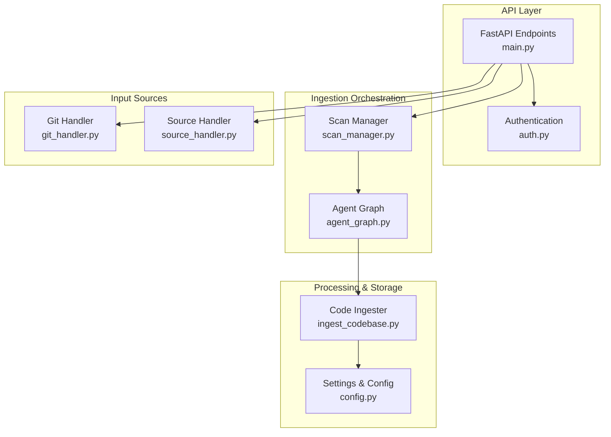
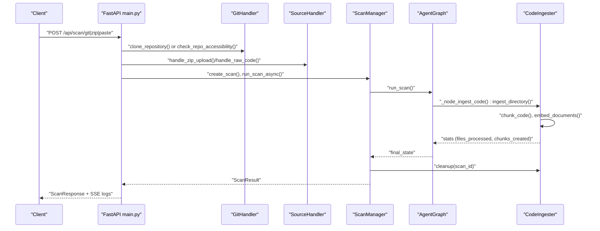
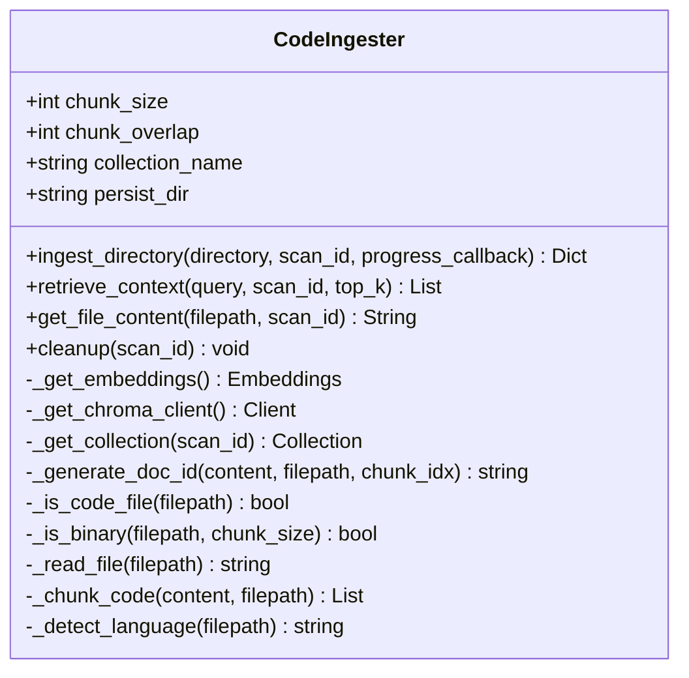
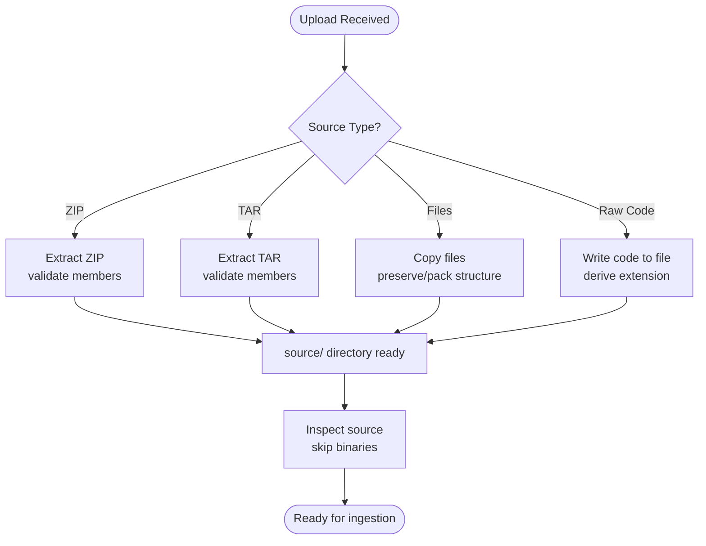
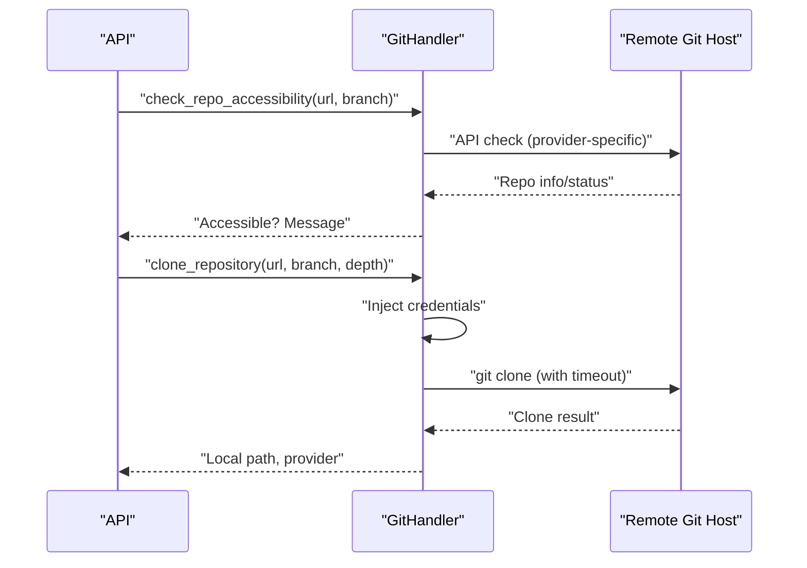
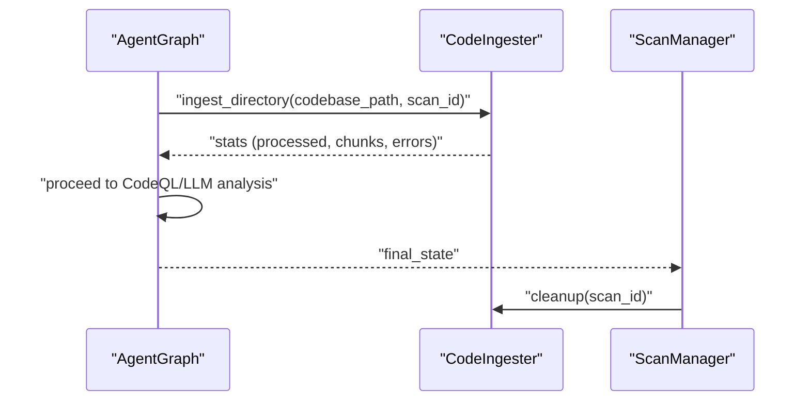
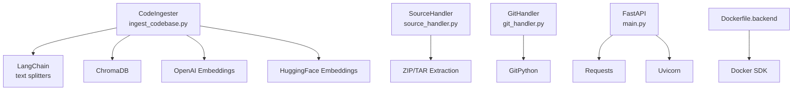

# Code Ingestion Agent

<cite>
**Referenced Files in This Document**
- [ingest_codebase.py](file://agents/ingest_codebase.py)
- [source_handler.py](file://app/source_handler.py)
- [git_handler.py](file://app/git_handler.py)
- [config.py](file://app/config.py)
- [main.py](file://app/main.py)
- [scan_manager.py](file://app/scan_manager.py)
- [agent_graph.py](file://app/agent_graph.py)
- [auth.py](file://app/auth.py)
- [requirements.txt](file://requirements.txt)
- [.env.example](file://.env.example)
- [Dockerfile.backend](file://Dockerfile.backend)
</cite>

## Table of Contents
1. [Introduction](#introduction)
2. [Project Structure](#project-structure)
3. [Core Components](#core-components)
4. [Architecture Overview](#architecture-overview)
5. [Detailed Component Analysis](#detailed-component-analysis)
6. [Dependency Analysis](#dependency-analysis)
7. [Performance Considerations](#performance-considerations)
8. [Troubleshooting Guide](#troubleshooting-guide)
9. [Security Considerations](#security-considerations)
10. [Conclusion](#conclusion)

## Introduction
This document describes the Code Ingester agent responsible for codebase ingestion and preprocessing in the AutoPoV framework. It explains how the agent handles multiple input sources (Git repositories, ZIP archives, local directories, and direct code pasting), filters files, detects programming languages, chunks code for embedding, and integrates with ChromaDB for vector storage. It also covers configuration options, error handling, performance optimization strategies, and security considerations for untrusted code ingestion.

## Project Structure
The ingestion pipeline spans several modules:
- Source input handlers manage multi-source ingestion (ZIP, TAR, file/folder, raw code).
- Git handler manages repository cloning and authentication.
- Config defines runtime settings and embedding/model configuration.
- Main API routes orchestrate ingestion workflows.
- Scan manager coordinates scan lifecycle and cleanup.
- Agent graph triggers ingestion as part of the vulnerability detection workflow.
- Auth provides API key management and rate limiting.

**Diagram sources**
- [main.py:204-400](file://app/main.py#L204-L400)
- [git_handler.py:199-294](file://app/git_handler.py#L199-L294)
- [source_handler.py:31-191](file://app/source_handler.py#L31-L191)
- [scan_manager.py:234-365](file://app/scan_manager.py#L234-L365)
- [agent_graph.py:178-204](file://app/agent_graph.py#L178-L204)
- [ingest_codebase.py:41-121](file://agents/ingest_codebase.py#L41-L121)
- [config.py:13-249](file://app/config.py#L13-L249)

**Section sources**
- [main.py:204-400](file://app/main.py#L204-L400)
- [git_handler.py:199-294](file://app/git_handler.py#L199-L294)
- [source_handler.py:31-191](file://app/source_handler.py#L31-L191)
- [scan_manager.py:234-365](file://app/scan_manager.py#L234-L365)
- [agent_graph.py:178-204](file://app/agent_graph.py#L178-L204)
- [ingest_codebase.py:41-121](file://agents/ingest_codebase.py#L41-L121)
- [config.py:13-249](file://app/config.py#L13-L249)

## Core Components
- CodeIngester: Handles code chunking, embedding generation, and ChromaDB storage. Implements language detection, binary file filtering, and batched ingestion with progress callbacks.
- SourceHandler: Manages ZIP/TAR extraction, file/folder uploads, and raw code paste with security checks against path traversal.
- GitHandler: Clones repositories from GitHub, GitLab, and Bitbucket with token injection and pre-checks for accessibility and size.
- Settings: Central configuration for chunk sizes, embeddings, vector store paths, and model selection.
- ScanManager: Coordinates scan lifecycle and triggers cleanup of vector store collections after completion.
- AgentGraph: Invokes ingestion as part of the vulnerability detection workflow.

**Section sources**
- [ingest_codebase.py:41-413](file://agents/ingest_codebase.py#L41-L413)
- [source_handler.py:18-382](file://app/source_handler.py#L18-L382)
- [git_handler.py:20-392](file://app/git_handler.py#L20-L392)
- [config.py:13-249](file://app/config.py#L13-L249)
- [scan_manager.py:47-205](file://app/scan_manager.py#L47-L205)
- [agent_graph.py:178-204](file://app/agent_graph.py#L178-L204)

## Architecture Overview
The ingestion workflow begins at the API layer, which routes requests to the appropriate handler. The handler extracts or clones the codebase into a temporary source directory. The Agent Graph then triggers the Code Ingester to split code into chunks, compute embeddings, and persist them to ChromaDB. Progress and errors are logged and surfaced to clients via streaming endpoints.

**Diagram sources**
- [main.py:204-400](file://app/main.py#L204-L400)
- [git_handler.py:199-294](file://app/git_handler.py#L199-L294)
- [source_handler.py:31-232](file://app/source_handler.py#L31-L232)
- [scan_manager.py:234-365](file://app/scan_manager.py#L234-L365)
- [agent_graph.py:178-204](file://app/agent_graph.py#L178-L204)
- [ingest_codebase.py:207-313](file://agents/ingest_codebase.py#L207-L313)

## Detailed Component Analysis

### CodeIngester
Responsibilities:
- Chunk code using RecursiveCharacterTextSplitter with language-aware separators.
- Detect programming language from file extensions.
- Filter binary and non-code files.
- Generate unique document IDs and metadata.
- Compute embeddings using OpenAI or HuggingFace models based on settings.
- Persist chunks to ChromaDB with batched inserts.
- Provide retrieval and cleanup utilities.

Key behaviors:
- Language detection maps file extensions to canonical language names.
- Binary detection reads a small header to identify null bytes.
- Embedding model selection depends on MODEL_MODE and configured providers.
- Batched ingestion improves throughput for large codebases.
- Cleanup removes per-scan collections to prevent storage bloat.

**Diagram sources**
- [ingest_codebase.py:41-413](file://agents/ingest_codebase.py#L41-L413)

**Section sources**
- [ingest_codebase.py:41-413](file://agents/ingest_codebase.py#L41-L413)

### SourceHandler
Responsibilities:
- Handle ZIP/TAR uploads with path traversal prevention.
- Manage file/folder uploads and raw code paste.
- Detect and skip binary files during source inspection.
- Provide source information and binary file detection.

Security highlights:
- Validates extracted members against the target directory to prevent path traversal.
- Skips binary files during source info computation.

**Diagram sources**
- [source_handler.py:31-232](file://app/source_handler.py#L31-L232)

**Section sources**
- [source_handler.py:18-382](file://app/source_handler.py#L18-L382)

### GitHandler
Responsibilities:
- Detect provider from URL and inject tokens into URLs.
- Pre-check repository accessibility and size.
- Clone repositories with timeouts and optional branch/commit targeting.
- Provide repository info and language detection for downstream steps.

Security highlights:
- Token injection into HTTPS URLs for private repositories.
- Path traversal checks for ZIP/TAR extraction are handled by SourceHandler; GitHandler focuses on repository cloning.

**Diagram sources**
- [git_handler.py:155-294](file://app/git_handler.py#L155-L294)

**Section sources**
- [git_handler.py:20-392](file://app/git_handler.py#L20-L392)

### Configuration and Settings
Key configuration impacting ingestion:
- Chunk sizing and overlap for text splitting.
- Embedding model selection (online vs offline).
- ChromaDB persistence directory and collection naming.
- Temporary directories for source extraction and CodeQL databases.
- Model routing modes and cost controls.

Environment variables and defaults are documented in the example environment file.

**Section sources**
- [config.py:13-249](file://app/config.py#L13-L249)
- [.env.example:1-108](file://.env.example#L1-L108)

### Integration with Agent Graph and Scan Lifecycle
The Agent Graph invokes ingestion as part of the vulnerability detection workflow. After ingestion, the system proceeds to CodeQL analysis or autonomous discovery. The Scan Manager coordinates lifecycle events, including cleanup of vector store collections upon completion.

**Diagram sources**
- [agent_graph.py:178-204](file://app/agent_graph.py#L178-L204)
- [scan_manager.py:202-203](file://app/scan_manager.py#L202-L203)

**Section sources**
- [agent_graph.py:178-204](file://app/agent_graph.py#L178-L204)
- [scan_manager.py:202-203](file://app/scan_manager.py#L202-L203)

## Dependency Analysis
External libraries and integrations:
- LangChain and text splitters for chunking.
- ChromaDB for vector storage.
- OpenAI or HuggingFace embeddings depending on configuration.
- GitPython for repository operations.
- Docker SDK for containerized environments.

**Diagram sources**
- [requirements.txt:1-44](file://requirements.txt#L1-L44)
- [Dockerfile.backend:1-64](file://Dockerfile.backend#L1-L64)

**Section sources**
- [requirements.txt:1-44](file://requirements.txt#L1-L44)
- [Dockerfile.backend:1-64](file://Dockerfile.backend#L1-L64)

## Performance Considerations
- Chunk sizing: Tune MAX_CHUNK_SIZE and CHUNK_OVERLAP for optimal recall/precision and embedding cost.
- Batched ingestion: The agent inserts embeddings in batches to reduce overhead.
- Embedding model choice: Online embeddings may be slower but more capable; offline embeddings are local and deterministic.
- Repository size: Large repositories should prefer ZIP upload or shallow clone to avoid timeouts.
- Cleanup: Collections are cleaned up after scans to prevent storage bloat.
- Concurrency: Background tasks and thread pools enable asynchronous processing.

[No sources needed since this section provides general guidance]

## Troubleshooting Guide
Common issues and resolutions:
- ChromaDB unavailable: Ensure chromadb is installed and persistent directory is writable.
- Embedding provider misconfiguration: Verify OPENROUTER_API_KEY or offline model availability.
- Git clone failures: Check network connectivity, repository visibility, and injected tokens.
- ZIP/TAR extraction errors: Validate archive integrity and ensure no path traversal attempts.
- Empty or binary files: These are filtered automatically; confirm encoding and file types.
- Timeout during ingestion: Reduce repository size or adjust chunk sizes and batch sizes.

**Section sources**
- [ingest_codebase.py:96-121](file://agents/ingest_codebase.py#L96-L121)
- [ingest_codebase.py:224-226](file://agents/ingest_codebase.py#L224-L226)
- [git_handler.py:243-294](file://app/git_handler.py#L243-L294)
- [source_handler.py:55-64](file://app/source_handler.py#L55-L64)

## Security Considerations
- Path traversal protection: ZIP/TAR extraction validates member paths against the target directory.
- Binary file filtering: Both SourceHandler and CodeIngester skip binary files to avoid ingestion of non-text content.
- Token injection: GitHandler injects provider tokens into URLs for private repository access.
- API key management: Strong admin keys and bearer token authentication with rate limiting.
- Sandboxing: While ingestion itself is read-only, consider running ingestion in restricted containers and validating file encodings. The Dockerfile backend image installs system dependencies and Docker CLI for advanced scenarios.

**Section sources**
- [source_handler.py:55-64](file://app/source_handler.py#L55-L64)
- [source_handler.py:115-123](file://app/source_handler.py#L115-L123)
- [git_handler.py:27-43](file://app/git_handler.py#L27-L43)
- [auth.py:192-236](file://app/auth.py#L192-L236)
- [Dockerfile.backend:1-64](file://Dockerfile.backend#L1-L64)

## Conclusion
The Code Ingester agent provides a robust, configurable pipeline for transforming codebases into vector embeddings for vulnerability analysis. It supports multiple ingestion sources, performs intelligent file filtering, and integrates seamlessly with the broader AutoPoV workflow. Proper configuration of chunking, embeddings, and cleanup ensures efficient and secure processing at scale.