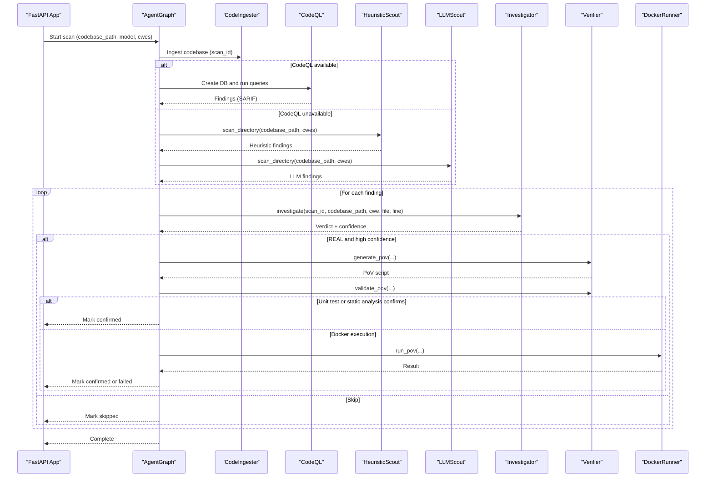
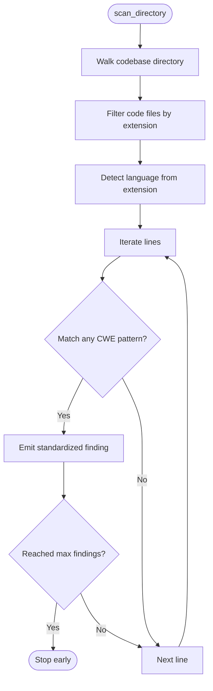
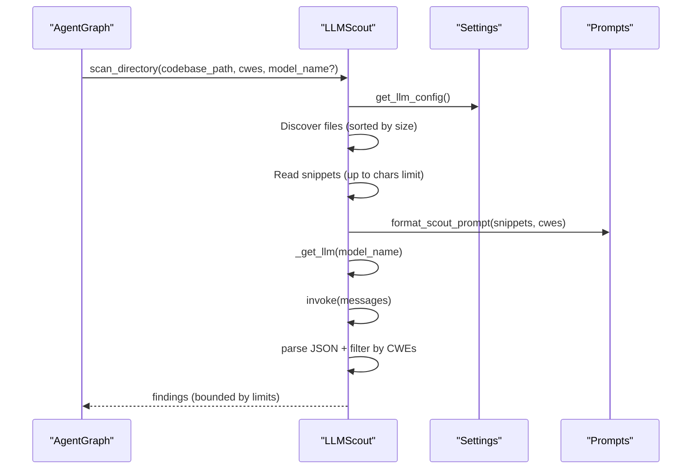
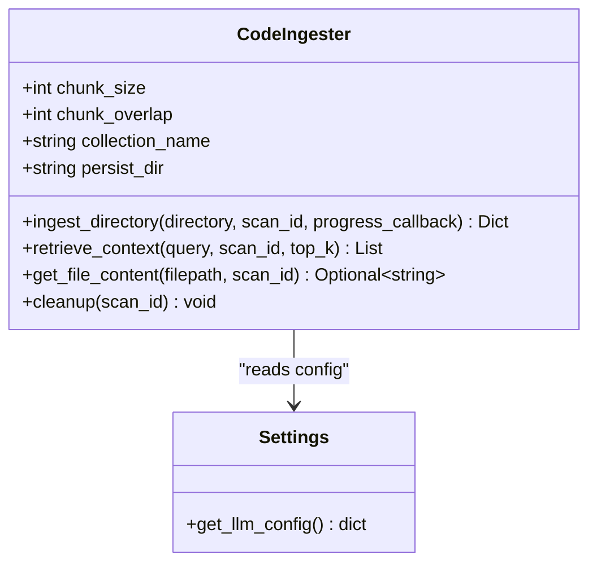
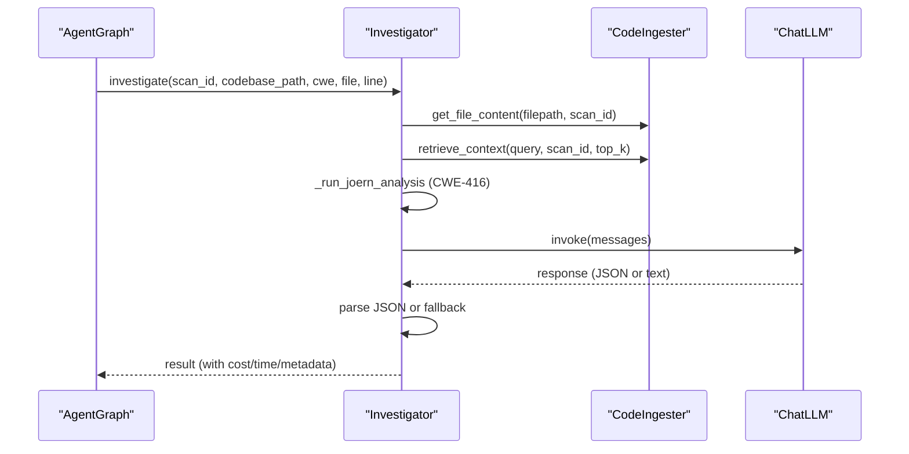
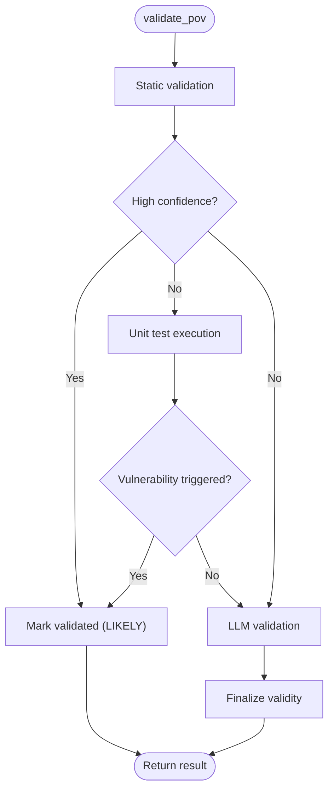
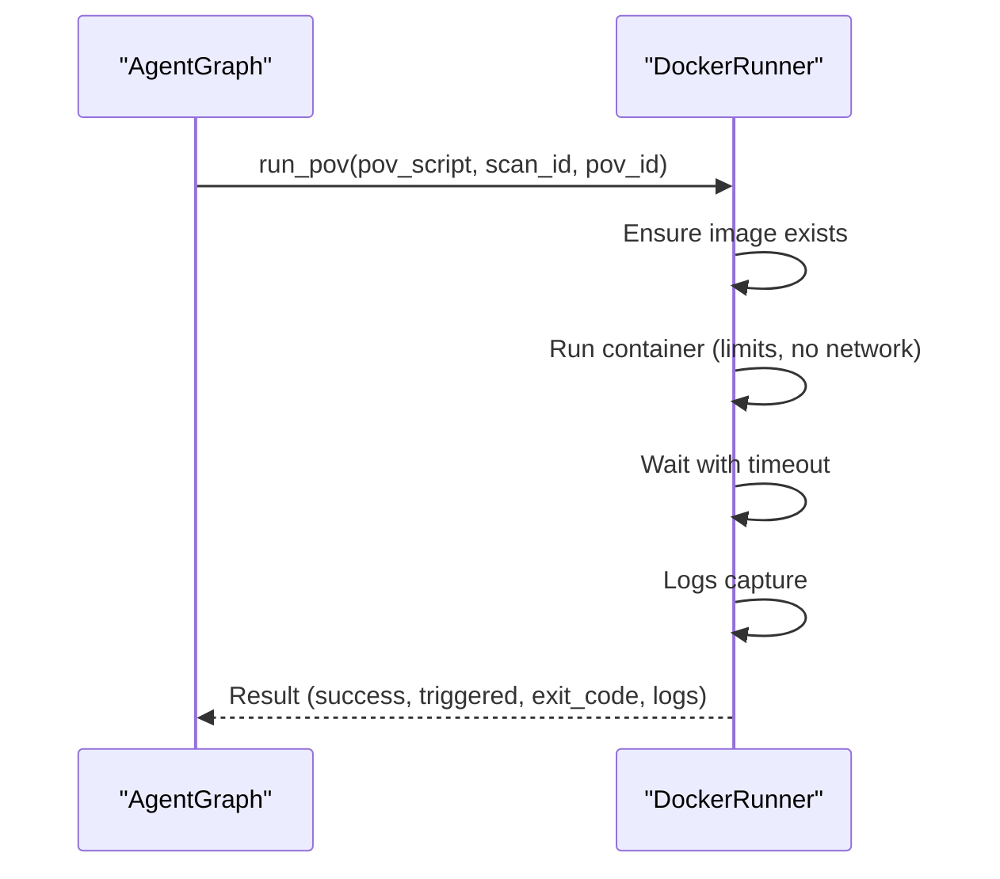
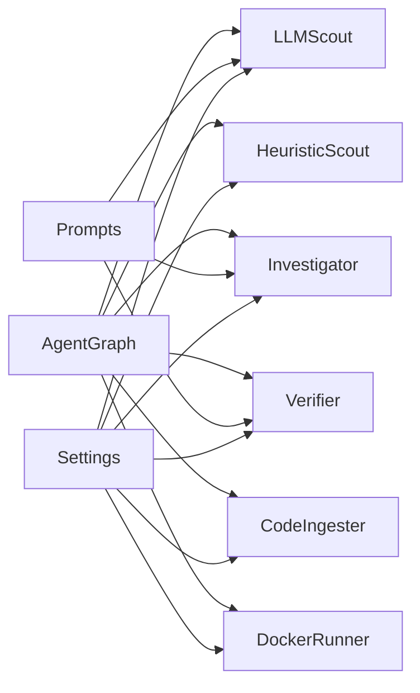

# Core Discovery Agents

<cite>
**Referenced Files in This Document**
- [heuristic_scout.py](file://agents/heuristic_scout.py)
- [llm_scout.py](file://agents/llm_scout.py)
- [ingest_codebase.py](file://agents/ingest_codebase.py)
- [investigator.py](file://agents/investigator.py)
- [verifier.py](file://agents/verifier.py)
- [docker_runner.py](file://agents/docker_runner.py)
- [agent_graph.py](file://app/agent_graph.py)
- [config.py](file://app/config.py)
- [prompts.py](file://prompts.py)
- [main.py](file://app/main.py)
</cite>

## Table of Contents
1. [Introduction](#introduction)
2. [Project Structure](#project-structure)
3. [Core Components](#core-components)
4. [Architecture Overview](#architecture-overview)
5. [Detailed Component Analysis](#detailed-component-analysis)
6. [Dependency Analysis](#dependency-analysis)
7. [Performance Considerations](#performance-considerations)
8. [Troubleshooting Guide](#troubleshooting-guide)
9. [Conclusion](#conclusion)

## Introduction
This document explains AutoPoV’s core discovery agents that power vulnerability identification and PoV generation. It focuses on:
- HeuristicScout: Pattern-based, signature-driven scanning across common vulnerability families
- LLMScout: AI-powered candidate generation using LLMs
- CodeIngester: Codebase ingestion, chunking, embedding, and ChromaDB storage for retrieval

It covers implementation specifics, configuration parameters, performance characteristics, integration patterns, agent interactions, state management, and result formatting. Guidance is included for troubleshooting and optimization.

## Project Structure
The discovery agents live under the agents/ directory and integrate with the orchestration engine in app/agent_graph.py. Configuration is centralized in app/config.py, prompts in prompts.py, and the REST API surface in app/main.py.

```mermaid
graph TB
subgraph "Agents"
HS["HeuristicScout<br/>(pattern-based)"]
LLM["LLMScout<br/>(AI-powered)"]
CI["CodeIngester<br/>(RAG ingestion)"]
INV["VulnerabilityInvestigator<br/>(RAG + LLM)"]
VER["VulnerabilityVerifier<br/>(PoV gen/val)"]
DR["DockerRunner<br/>(sandboxed execution)"]
end
subgraph "Orchestration"
AG["AgentGraph<br/>(LangGraph workflow)"]
end
subgraph "Config & Prompts"
CFG["Settings<br/>(app/config.py)"]
PROMPTS["Prompts<br/>(prompts.py)"]
end
subgraph "API"
API["FastAPI App<br/>(app/main.py)"]
end
API --> AG
AG --> HS
AG --> LLM
AG --> CI
AG --> INV
AG --> VER
AG --> DR
CI --> INV
INV --> VER
VER --> DR
CFG --> HS
CFG --> LLM
CFG --> CI
CFG --> INV
CFG --> VER
CFG --> DR
PROMPTS --> LLM
PROMPTS --> INV
PROMPTS --> VER
```

**Diagram sources**
- [agent_graph.py:82-168](file://app/agent_graph.py#L82-L168)
- [heuristic_scout.py:13-242](file://agents/heuristic_scout.py#L13-L242)
- [llm_scout.py:32-208](file://agents/llm_scout.py#L32-L208)
- [ingest_codebase.py:41-413](file://agents/ingest_codebase.py#L41-L413)
- [investigator.py:37-519](file://agents/investigator.py#L37-L519)
- [verifier.py:42-562](file://agents/verifier.py#L42-L562)
- [docker_runner.py:27-377](file://agents/docker_runner.py#L27-L377)
- [config.py:13-255](file://app/config.py#L13-L255)
- [prompts.py:1-424](file://prompts.py#L1-L424)
- [main.py:1-768](file://app/main.py#L1-L768)

**Section sources**
- [agent_graph.py:82-168](file://app/agent_graph.py#L82-L168)
- [config.py:13-255](file://app/config.py#L13-L255)

## Core Components
- HeuristicScout: Scans codebases using predefined regular expressions for known vulnerability families (e.g., SQL injection, XSS, deserialization). It walks directories, filters code files, detects language, and emits findings with minimal confidence and metadata.
- LLMScout: Selects top files by size, extracts code snippets, constructs a prompt, queries an LLM, parses JSON results, and returns structured findings with confidence and explanations.
- CodeIngester: Recursively chunks code, generates embeddings, persists to ChromaDB with a scan-scoped collection, and supports retrieval and file content lookup for RAG-assisted investigation.

**Section sources**
- [heuristic_scout.py:13-242](file://agents/heuristic_scout.py#L13-L242)
- [llm_scout.py:32-208](file://agents/llm_scout.py#L32-L208)
- [ingest_codebase.py:41-413](file://agents/ingest_codebase.py#L41-L413)

## Architecture Overview
The orchestration engine (AgentGraph) coordinates discovery, investigation, PoV generation, validation, and execution. It integrates CodeQL when available, otherwise falls back to autonomous discovery via HeuristicScout and LLMScout. It uses RAG via CodeIngester for context and invokes Investigator and Verifier agents.



**Diagram sources**
- [agent_graph.py:241-307](file://app/agent_graph.py#L241-L307)
- [agent_graph.py:691-777](file://app/agent_graph.py#L691-L777)
- [agent_graph.py:779-840](file://app/agent_graph.py#L779-L840)
- [agent_graph.py:842-903](file://app/agent_graph.py#L842-L903)
- [agent_graph.py:905-1004](file://app/agent_graph.py#L905-L1004)
- [ingest_codebase.py:207-313](file://agents/ingest_codebase.py#L207-L313)
- [investigator.py:270-432](file://agents/investigator.py#L270-L432)
- [verifier.py:90-223](file://agents/verifier.py#L90-L223)
- [docker_runner.py:62-191](file://agents/docker_runner.py#L62-L191)

**Section sources**
- [agent_graph.py:241-307](file://app/agent_graph.py#L241-L307)
- [agent_graph.py:691-777](file://app/agent_graph.py#L691-L777)
- [agent_graph.py:779-840](file://app/agent_graph.py#L779-L840)
- [agent_graph.py:842-903](file://app/agent_graph.py#L842-L903)
- [agent_graph.py:905-1004](file://app/agent_graph.py#L905-L1004)

## Detailed Component Analysis

### HeuristicScout
- Purpose: Lightweight, signature-based scanning across common vulnerability families using regex patterns.
- Key behaviors:
  - Directory traversal with hidden directory filtering
  - Code file filtering by extension
  - Language detection from file extension
  - Line-by-line scanning with per-CWE pattern sets
  - Early termination based on maximum findings
- Output format: Standardized finding entries with fields for cwe_type, filepath, line_number, code_chunk, confidence, and metadata; includes “heuristic” source and language.
- Configuration:
  - SCOUT_MAX_FINDINGS governs early stopping
  - Patterns are embedded in the class and mapped to CWE families
- Complexity:
  - Time: O(N_lines × N_CWE_patterns)
  - Space: Proportional to findings collected (bounded by SCOUT_MAX_FINDINGS)



**Diagram sources**
- [heuristic_scout.py:188-234](file://agents/heuristic_scout.py#L188-L234)

**Section sources**
- [heuristic_scout.py:13-242](file://agents/heuristic_scout.py#L13-L242)
- [config.py:46-52](file://app/config.py#L46-L52)

### LLMScout
- Purpose: AI-powered candidate generation by prompting an LLM with top files and CWE families.
- Key behaviors:
  - Discover code files (filtered by extension)
  - Sort by file size and cap by SCOUT_MAX_FILES
  - Read up to SCOUT_MAX_CHARS_PER_FILE per file
  - Build a multi-file prompt using format_scout_prompt
  - Invoke LLM with model selection from settings
  - Parse JSON response and filter by requested CWEs
  - Enforce SCOUT_MAX_COST_USD
  - Compute cost from token usage metadata
- Output format: Standardized findings with cwe_type, filepath, line_number, code_chunk, llm_explanation, confidence, and metadata; includes “llm_scout” source and language.
- Configuration:
  - SCOUT_MAX_FILES, SCOUT_MAX_CHARS_PER_FILE, SCOUT_MAX_FINDINGS, SCOUT_MAX_COST_USD
  - Model mode (online/offline), provider base URL, model name
- Complexity:
  - Time: O(N_files) plus LLM invocation and JSON parsing
  - Space: Proportional to file snippets and parsed findings



**Diagram sources**
- [llm_scout.py:88-200](file://agents/llm_scout.py#L88-L200)
- [prompts.py:413-424](file://prompts.py#L413-L424)
- [config.py:212-231](file://app/config.py#L212-L231)

**Section sources**
- [llm_scout.py:32-208](file://agents/llm_scout.py#L32-L208)
- [prompts.py:391-424](file://prompts.py#L391-L424)
- [config.py:46-52](file://app/config.py#L46-L52)
- [config.py:212-231](file://app/config.py#L212-L231)

### CodeIngester
- Purpose: Ingest codebases into a vector store for RAG-assisted investigation.
- Key behaviors:
  - Recursive character splitting with language-aware separators
  - Embedding selection based on online/offline mode
  - Persistent ChromaDB collection per scan_id
  - Batch embedding and insertion
  - Retrieval by query embedding and file content lookup
  - Binary file detection and skip
- Output:
  - Statistics for processed/skipped files and created chunks
  - Retrieval results with content, metadata, and distance
- Configuration:
  - MAX_CHUNK_SIZE, CHUNK_OVERLAP, CHROMA_PERSIST_DIR, CHROMA_COLLECTION_NAME
  - Embedding model selection (online vs offline)
- Complexity:
  - Chunking: O(N_chars)
  - Embedding: O(N_chunks × D_embeddings)
  - Insertion: O(N_chunks) batches
  - Query: O(D_embeddings × log N_chunks) depending on Chroma index



**Diagram sources**
- [ingest_codebase.py:41-121](file://agents/ingest_codebase.py#L41-L121)
- [config.py:74-91](file://app/config.py#L74-L91)
- [config.py:212-231](file://app/config.py#L212-L231)

**Section sources**
- [ingest_codebase.py:41-413](file://agents/ingest_codebase.py#L41-L413)
- [config.py:74-91](file://app/config.py#L74-L91)
- [config.py:104-105](file://app/config.py#L104-L105)

### Investigator Agent
- Purpose: RAG-assisted investigation of potential vulnerabilities using LLMs.
- Key behaviors:
  - Retrieve code context around a line and optionally augment with RAG-related chunks
  - Optionally run Joern CPG analysis for CWE-416
  - Prompt construction with format_investigation_prompt
  - Token usage extraction and cost calculation
  - JSON parsing with fallback handling
  - Batch investigation with progress callbacks
- Integration:
  - Uses CodeIngester for retrieval and file content
  - Uses settings for model selection and tracing
- Output:
  - Verdict (REAL/FALSE_POSITIVE), confidence, explanation, vulnerable_code, root_cause, impact
  - Metadata: inference_time_s, timestamp, model_used, cost_usd, token_usage



**Diagram sources**
- [investigator.py:270-432](file://agents/investigator.py#L270-L432)
- [prompts.py:7-43](file://prompts.py#L7-L43)
- [ingest_codebase.py:360-391](file://agents/ingest_codebase.py#L360-L391)

**Section sources**
- [investigator.py:37-519](file://agents/investigator.py#L37-L519)
- [prompts.py:7-43](file://prompts.py#L7-L43)
- [ingest_codebase.py:315-391](file://agents/ingest_codebase.py#L315-L391)

### Verifier Agent
- Purpose: Generate and validate Proof-of-Vulnerability scripts.
- Key behaviors:
  - Generate PoV via format_pov_generation_prompt and LLM
  - Hybrid validation:
    - Static analysis (high-confidence pass)
    - Unit test execution (when vulnerable code available)
    - LLM-based validation (fallback)
  - Retry analysis via format_retry_analysis_prompt
- Integration:
  - Uses prompts for generation, validation, and retry
  - Computes cost from token usage metadata
- Output:
  - PoV script, validation result, will_trigger indicator, and metadata



**Diagram sources**
- [verifier.py:225-387](file://agents/verifier.py#L225-L387)
- [prompts.py:46-121](file://prompts.py#L46-L121)

**Section sources**
- [verifier.py:42-562](file://agents/verifier.py#L42-L562)
- [prompts.py:46-121](file://prompts.py#L46-L121)

### DockerRunner
- Purpose: Execute PoV scripts in isolated Docker containers.
- Key behaviors:
  - Pull or ensure target runtime image
  - Run container with resource limits and no network
  - Capture stdout/stderr, compute execution time
  - Detect “VULNERABILITY TRIGGERED” in output
  - Support batch execution and various input modes
- Integration:
  - Used by AgentGraph when validation is inconclusive or Docker is available
- Output:
  - Success flag, vulnerability_triggered, exit_code, stdout/stderr, timing



**Diagram sources**
- [docker_runner.py:62-191](file://agents/docker_runner.py#L62-L191)
- [agent_graph.py:905-1004](file://app/agent_graph.py#L905-L1004)

**Section sources**
- [docker_runner.py:27-377](file://agents/docker_runner.py#L27-L377)
- [agent_graph.py:905-1004](file://app/agent_graph.py#L905-L1004)

## Dependency Analysis
- Configuration-driven model selection:
  - HeuristicScout and LLMScout read SCOUT_* settings
  - Investigator and Verifier read LLM configuration and pricing for cost tracking
- Orchestrator coordination:
  - AgentGraph orchestrates ingestion, discovery, investigation, PoV generation/validation, and execution
  - Uses settings for routing, cost caps, and tool availability checks
- Prompt-driven workflows:
  - All LLM-based agents depend on prompts.py for structured prompts and JSON schemas



**Diagram sources**
- [config.py:46-101](file://app/config.py#L46-L101)
- [prompts.py:257-389](file://prompts.py#L257-L389)
- [agent_graph.py:206-227](file://app/agent_graph.py#L206-L227)

**Section sources**
- [config.py:46-101](file://app/config.py#L46-L101)
- [prompts.py:257-389](file://prompts.py#L257-L389)
- [agent_graph.py:206-227](file://app/agent_graph.py#L206-L227)

## Performance Considerations
- HeuristicScout
  - Complexity proportional to lines scanned and number of patterns; bounded by SCOUT_MAX_FINDINGS
  - Optimize by narrowing cwes and ensuring efficient regex patterns
- LLMScout
  - File sampling by size reduces cost and latency
  - Tune SCOUT_MAX_FILES and SCOUT_MAX_CHARS_PER_FILE to balance recall vs cost
  - Respect SCOUT_MAX_COST_USD to prevent runaway spending
- CodeIngester
  - Adjust MAX_CHUNK_SIZE and CHUNK_OVERLAP to trade off recall and embedding cost
  - Batch embeddings improve throughput; ensure sufficient memory for embedding model
- Investigator
  - Cost tracking via token usage metadata; enable tracing for observability
  - Joern analysis is expensive; use selectively for CWE-416
- Verifier
  - Static and unit test validations are fast; LLM validation is slower and reserved for edge cases
- DockerRunner
  - Resource limits protect system resources; timeouts prevent hanging containers

[No sources needed since this section provides general guidance]

## Troubleshooting Guide
- HeuristicScout
  - Symptom: No findings
    - Cause: cwes not in SUPPORTED_CWES or patterns not matched
    - Action: Verify cwes and increase verbosity/logging
  - Symptom: Too many findings
    - Cause: SCOUT_MAX_FINDINGS too high
    - Action: Lower SCOUT_MAX_FINDINGS
- LLMScout
  - Symptom: Empty findings
    - Cause: LLM response not parseable or cost exceeded
    - Action: Check model availability, API key, and SCOUT_MAX_COST_USD
  - Symptom: High cost
    - Cause: Large files or many findings
    - Action: Reduce SCOUT_MAX_FILES/CHARS or adjust pricing model
- CodeIngester
  - Symptom: ChromaDB not available
    - Cause: Missing chromadb installation
    - Action: Install chromadb or switch to offline mode
  - Symptom: Binary files causing issues
    - Cause: Binary detection and skip
    - Action: Ensure code files only; review filters
- Investigator
  - Symptom: Missing token usage
    - Cause: Provider response format differences
    - Action: Inspect response metadata and update extraction logic
  - Symptom: Joern not available
    - Cause: Missing joern CLI
    - Action: Install joern or disable CPG analysis
- Verifier
  - Symptom: PoV validation fails
    - Cause: Static or unit test failures
    - Action: Review validation criteria and CWE-specific checks
- DockerRunner
  - Symptom: Docker not available
    - Cause: Docker not installed or not reachable
    - Action: Install Docker or disable sandboxed execution
  - Symptom: Timeouts or resource limits
    - Cause: Script hangs or exceeds limits
    - Action: Increase timeouts or CPU/memory limits

**Section sources**
- [heuristic_scout.py:188-234](file://agents/heuristic_scout.py#L188-L234)
- [llm_scout.py:126-171](file://agents/llm_scout.py#L126-L171)
- [ingest_codebase.py:96-121](file://agents/ingest_codebase.py#L96-L121)
- [investigator.py:339-377](file://agents/investigator.py#L339-L377)
- [verifier.py:259-387](file://agents/verifier.py#L259-L387)
- [docker_runner.py:50-61](file://agents/docker_runner.py#L50-L61)

## Conclusion
AutoPoV’s discovery agents combine signature-based scanning, AI-powered candidate generation, and RAG-assisted investigation to deliver a robust vulnerability discovery pipeline. HeuristicScout provides broad coverage with low overhead, LLMScout enhances precision with targeted LLM reasoning, and CodeIngester enables contextual retrieval for deeper analysis. Investigator and Verifier refine findings into actionable, validated PoVs, with DockerRunner offering safe execution. Configuration and cost controls ensure practical operation, while the orchestration engine coordinates the workflow end-to-end.