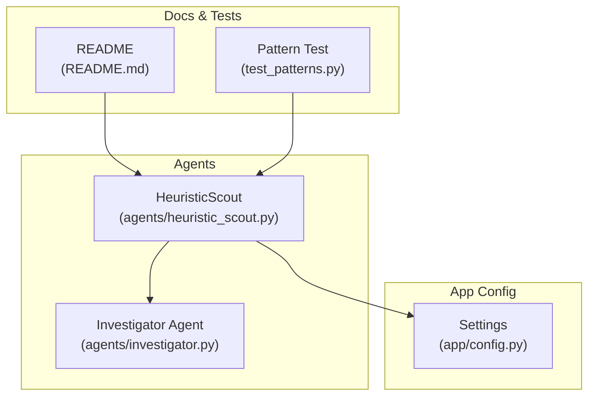
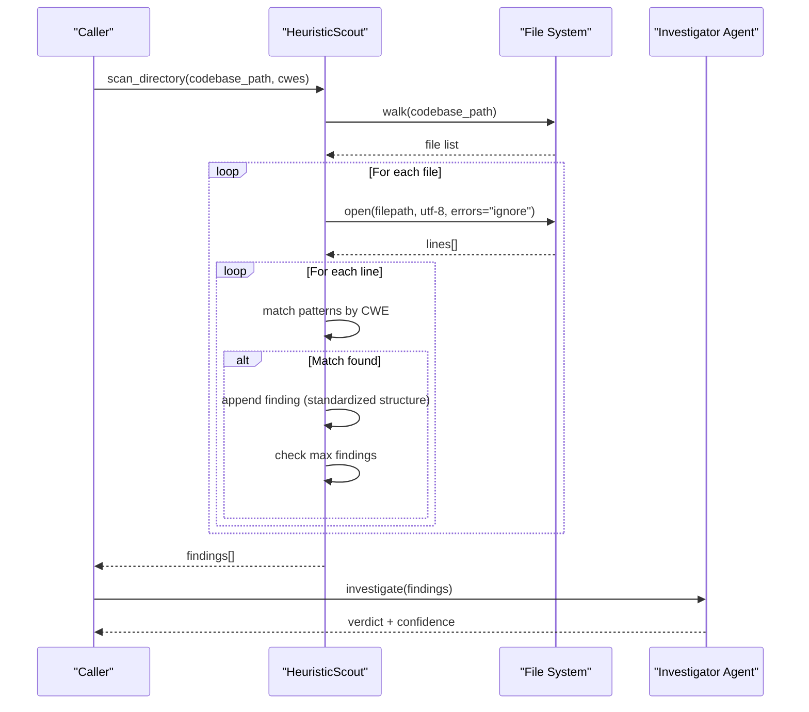
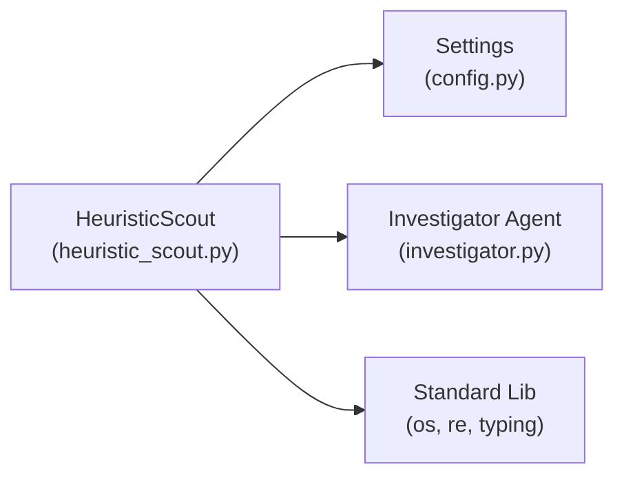

# HeuristicScout Agent

<cite>
**Referenced Files in This Document**
- [heuristic_scout.py](file://agents/heuristic_scout.py)
- [config.py](file://app/config.py)
- [README.md](file://README.md)
- [test_patterns.py](file://test_patterns.py)
- [investigator.py](file://agents/investigator.py)
</cite>

## Table of Contents
1. [Introduction](#introduction)
2. [Project Structure](#project-structure)
3. [Core Components](#core-components)
4. [Architecture Overview](#architecture-overview)
5. [Detailed Component Analysis](#detailed-component-analysis)
6. [Dependency Analysis](#dependency-analysis)
7. [Performance Considerations](#performance-considerations)
8. [Troubleshooting Guide](#troubleshooting-guide)
9. [Conclusion](#conclusion)

## Introduction
The HeuristicScout agent performs rapid, signature-based vulnerability discovery across codebases. It scans files systematically, applies language-aware regex patterns grouped by CWE categories, and surfaces candidate findings with minimal overhead. This document explains the pattern-matching algorithm, the 20+ predefined regex signatures, scanning methodology, configuration parameters, result formatting, and operational guidance for extending and optimizing the pattern library.

## Project Structure
The HeuristicScout agent resides under agents/, integrates with application configuration, and participates in the broader agent orchestration flow described in the project documentation.

**Diagram sources**
- [heuristic_scout.py:13-242](file://agents/heuristic_scout.py#L13-L242)
- [config.py:13-255](file://app/config.py#L13-L255)
- [README.md:1-444](file://README.md#L1-L444)
- [test_patterns.py:1-33](file://test_patterns.py#L1-L33)
- [investigator.py:380-519](file://agents/investigator.py#L380-L519)

**Section sources**
- [heuristic_scout.py:1-242](file://agents/heuristic_scout.py#L1-L242)
- [config.py:1-255](file://app/config.py#L1-L255)
- [README.md:1-444](file://README.md#L1-L444)
- [test_patterns.py:1-33](file://test_patterns.py#L1-L33)
- [investigator.py:380-519](file://agents/investigator.py#L380-L519)

## Core Components
- HeuristicScout class encapsulates:
  - Pattern registry organized by CWE identifiers
  - File filtering by extension
  - Language detection by extension
  - Directory traversal and line-by-line scanning
  - Finding aggregation with standardized result structure
- Configuration:
  - SCOUT_MAX_FINDINGS controls early termination
  - Other scout-related limits are defined in settings

Key behaviors:
- Scans recursively, skipping hidden directories
- Filters files by known code extensions
- Detects language by extension for downstream agents
- Applies all patterns for selected CWEs to each line
- Enforces a maximum number of findings to bound resource usage

**Section sources**
- [heuristic_scout.py:13-242](file://agents/heuristic_scout.py#L13-L242)
- [config.py:46-52](file://app/config.py#L46-L52)

## Architecture Overview
The HeuristicScout agent is part of the agent graph and feeds candidates to the Investigator Agent for deeper analysis. The Investigator Agent assigns a verdict and confidence score, enabling escalation to PoV generation only for high-confidence findings.

**Diagram sources**
- [heuristic_scout.py:188-234](file://agents/heuristic_scout.py#L188-L234)
- [investigator.py:473-509](file://agents/investigator.py#L473-L509)

**Section sources**
- [heuristic_scout.py:188-234](file://agents/heuristic_scout.py#L188-L234)
- [investigator.py:473-509](file://agents/investigator.py#L473-L509)

## Detailed Component Analysis

### Pattern Registry and Matching Algorithm
- Patterns are grouped by CWE identifiers and compiled into regex objects at initialization.
- Matching occurs line-by-line across all selected CWEs.
- Each match produces a standardized finding record with metadata such as filepath, line number, language, and confidence.

Signature coverage includes:
- SQL injection (CWE-89): patterns targeting dynamic SQL construction, parameter binding misuse, and f-string/executable SQL patterns
- Cross-site scripting (CWE-79): patterns targeting DOM manipulation and template rendering with user input
- Path traversal (CWE-22): patterns targeting unsafe path joins and traversal sequences
- Command injection (CWE-78): patterns targeting shell execution with user input
- Code injection (CWE-94), deserialization (CWE-502), hardcoded credentials (CWE-798), cleartext storage (CWE-312), cryptography flaws (CWE-327), CSRF (CWE-352), broken auth (CWE-287), missing auth (CWE-306), open redirect (CWE-601), SSRF (CWE-918), file upload (CWE-434), XXE (CWE-611), DoS (CWE-400), session fixation (CWE-384), information disclosure (CWE-200), integer overflow (CWE-190), buffer overflows (CWE-119), use-after-free (CWE-416)

Matching logic:
- For each line, iterate over selected CWEs and their patterns
- On match, append a finding with a fixed confidence and placeholder LLM fields
- Early exit when the maximum number of findings is reached

**Section sources**
- [heuristic_scout.py:18-157](file://agents/heuristic_scout.py#L18-L157)
- [heuristic_scout.py:207-233](file://agents/heuristic_scout.py#L207-L233)

### Scanning Methodology
- Directory traversal:
  - Uses os.walk with hidden directories filtered out
  - Skips non-code files based on extension whitelist
- File filtering:
  - Only files with recognized code extensions are considered
- Line-by-line pattern matching:
  - Reads files with UTF-8 and ignores decoding errors
  - Iterates over each line with 1-based indexing
- Language detection:
  - Maps file extensions to language names for downstream agents
- Early termination:
  - Stops adding findings once SCOUT_MAX_FINDINGS threshold is met

**Section sources**
- [heuristic_scout.py:159-187](file://agents/heuristic_scout.py#L159-L187)
- [heuristic_scout.py:188-234](file://agents/heuristic_scout.py#L188-L234)

### Result Formatting Structure
Each finding includes:
- cwe_type: CWE identifier
- filepath: Relative path from the scanned root
- line_number: 1-based line index
- code_chunk: The matched line content
- llm_verdict, llm_explanation: Placeholder fields for later stages
- confidence: Fixed heuristic confidence (0.35)
- pov_* fields: Placeholder fields for PoV generation
- retry_count, inference_time_s, cost_usd: Placeholder fields for later stages
- final_status: Placeholder status for later stages
- alert_message: Indicator that the finding came from heuristic scanning
- source: Indicates heuristic origin
- language: Detected language for downstream routing

These fields align with the Investigator Agent’s expectations and subsequent validation steps.

**Section sources**
- [heuristic_scout.py:212-230](file://agents/heuristic_scout.py#L212-L230)
- [investigator.py:380-432](file://agents/investigator.py#L380-L432)

### Configuration Parameters
- SCOUT_MAX_FINDINGS: Maximum number of candidate findings to collect before stopping
- SCOUT_ENABLED, SCOUT_LLM_ENABLED: Scout enablement flags
- SCOUT_MAX_FILES, SCOUT_MAX_CHARS_PER_FILE: Limits for LLM Scout (not used by HeuristicScout)
- SCOUT_MAX_COST_USD: Cost cap for LLM Scout (not used by HeuristicScout)
- SUPPORTED_CWES: Predefined set of CWEs commonly targeted by the system

SCOUT_MAX_FINDINGS is directly consumed by HeuristicScout to bound scanning and prevent excessive memory usage.

**Section sources**
- [config.py:46-52](file://app/config.py#L46-L52)
- [config.py:108-134](file://app/config.py#L108-L134)
- [heuristic_scout.py:17](file://agents/heuristic_scout.py#L17)

### Example Matches and Test Coverage
- A dedicated test script demonstrates matching behavior for SQL injection patterns, including f-string interpolation with SQL and cursor execution with dynamic SQL.
- The test validates that patterns compile successfully and match representative code constructs.

**Section sources**
- [test_patterns.py:6-33](file://test_patterns.py#L6-L33)

### False Positive Handling
- HeuristicScout emits findings with a low-to-moderate confidence (0.35) and placeholders for LLM verification.
- The Investigator Agent performs deeper analysis and assigns a final verdict and confidence score.
- Escalation thresholds:
  - Findings with confidence ≥ 0.7 proceed to PoV generation
  - Lower confidence findings are typically treated as false positives or require additional validation

**Section sources**
- [heuristic_scout.py:218](file://agents/heuristic_scout.py#L218)
- [investigator.py:473-509](file://agents/investigator.py#L473-L509)
- [README.md:50-51](file://README.md#L50-L51)

### Extending the Pattern Library
To add new patterns:
- Choose or define a CWE category
- Add one or more regex patterns to the appropriate CWE list
- Ensure patterns are compiled with appropriate flags (e.g., IGNORECASE)
- Validate with a test similar to test_patterns.py
- Consider performance: keep patterns efficient and avoid catastrophic backtracking

Guidelines:
- Prefer anchored or bounded patterns to reduce false positives
- Group related patterns by CWE for maintainability
- Test against representative code samples to balance precision and recall

**Section sources**
- [heuristic_scout.py:18-157](file://agents/heuristic_scout.py#L18-L157)
- [test_patterns.py:6-33](file://test_patterns.py#L6-L33)

## Dependency Analysis
- HeuristicScout depends on:
  - app.config.settings for SCOUT_MAX_FINDINGS
  - Standard library modules (os, re, typing)
- No circular dependencies detected within the agent module
- Integrates with Investigator Agent for downstream processing

**Diagram sources**
- [heuristic_scout.py:6-10](file://agents/heuristic_scout.py#L6-L10)
- [config.py:13-255](file://app/config.py#L13-L255)
- [investigator.py:380-519](file://agents/investigator.py#L380-L519)

**Section sources**
- [heuristic_scout.py:6-10](file://agents/heuristic_scout.py#L6-L10)
- [config.py:13-255](file://app/config.py#L13-L255)
- [investigator.py:380-519](file://agents/investigator.py#L380-L519)

## Performance Considerations
- Early termination: Enforced by SCOUT_MAX_FINDINGS to cap memory and CPU usage
- Minimal I/O: Reads files line-by-line with UTF-8 and error tolerance
- Regex compilation: Patterns are compiled once at initialization
- Language detection: Lightweight extension-to-language mapping
- Scalability tips:
  - Limit CWE scope to reduce pattern sets
  - Use targeted codebase roots to avoid scanning irrelevant directories
  - Monitor system resources during large scans

[No sources needed since this section provides general guidance]

## Troubleshooting Guide
Common issues and resolutions:
- Regex errors:
  - Ensure patterns are valid and compiled with appropriate flags
  - Validate patterns against representative code samples
- False positives:
  - Narrow patterns to reduce noise
  - Rely on Investigator Agent for final filtering
- Performance bottlenecks:
  - Reduce SCOUT_MAX_FINDINGS or CWE scope
  - Filter out large binary or generated files before scanning
- Encoding issues:
  - Files are opened with UTF-8 and errors ignored; ensure critical files are readable

**Section sources**
- [test_patterns.py:23-31](file://test_patterns.py#L23-L31)
- [heuristic_scout.py:198-202](file://agents/heuristic_scout.py#L198-L202)

## Conclusion
HeuristicScout provides fast, signature-based discovery across 20+ CWE categories using a straightforward, language-aware scanning pipeline. Its design emphasizes speed and scalability with early termination and minimal I/O. Findings are standardized for seamless integration with downstream agents, particularly the Investigator Agent, which applies deeper analysis to resolve false positives and determine exploit readiness.

[No sources needed since this section summarizes without analyzing specific files]