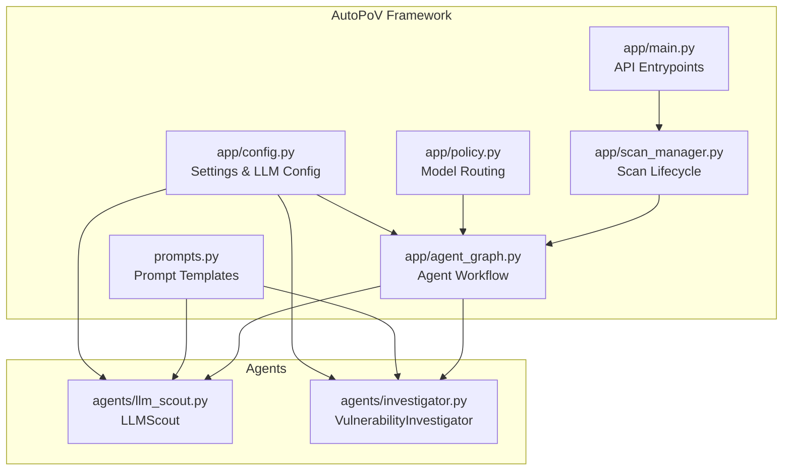
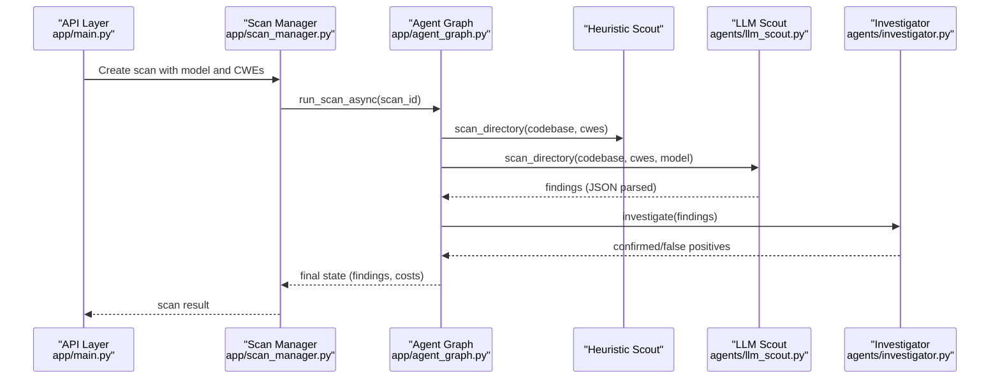
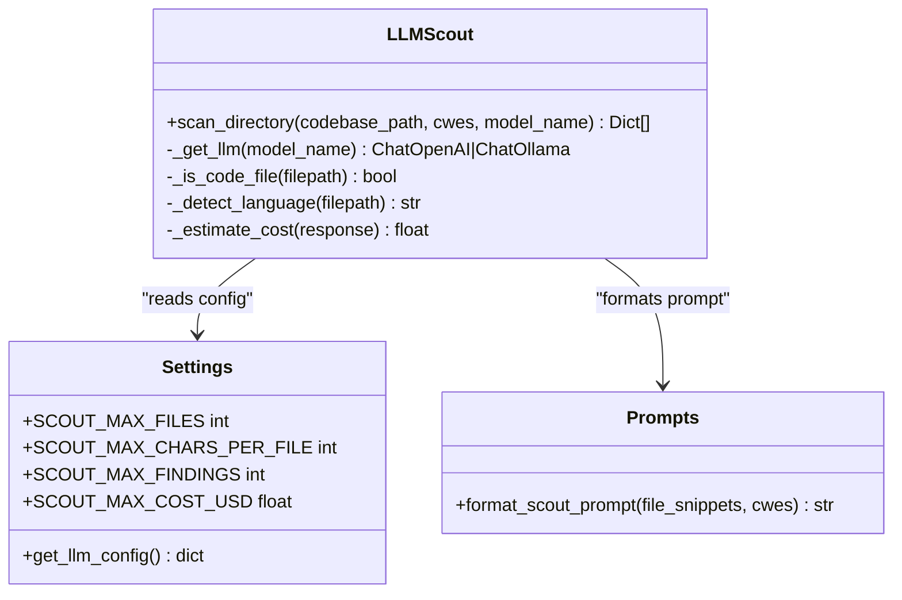
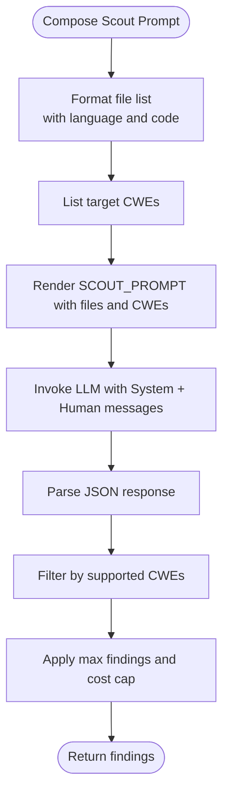
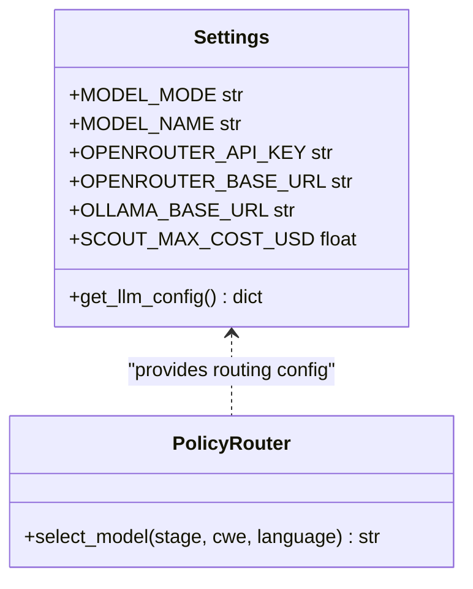
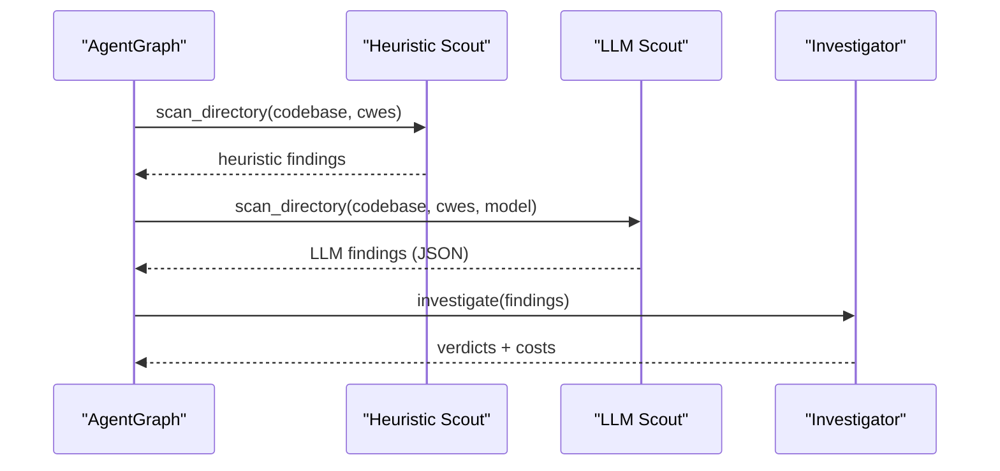
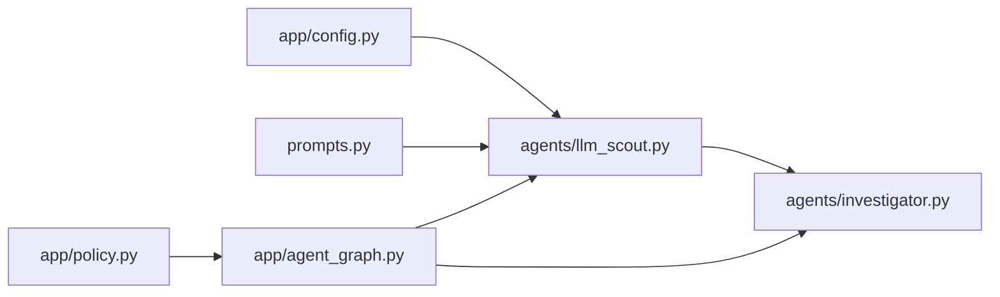

# LLMScout Agent

<cite>
**Referenced Files in This Document**
- [llm_scout.py](file://agents/llm_scout.py)
- [prompts.py](file://prompts.py)
- [config.py](file://app/config.py)
- [investigator.py](file://agents/investigator.py)
- [agent_graph.py](file://app/agent_graph.py)
- [scan_manager.py](file://app/scan_manager.py)
- [main.py](file://app/main.py)
- [policy.py](file://app/policy.py)
</cite>

## Table of Contents
1. [Introduction](#introduction)
2. [Project Structure](#project-structure)
3. [Core Components](#core-components)
4. [Architecture Overview](#architecture-overview)
5. [Detailed Component Analysis](#detailed-component-analysis)
6. [Dependency Analysis](#dependency-analysis)
7. [Performance Considerations](#performance-considerations)
8. [Troubleshooting Guide](#troubleshooting-guide)
9. [Conclusion](#conclusion)

## Introduction
The LLMScout agent provides AI-powered vulnerability discovery by analyzing codebases with large language models. It generates reasoning-based candidate vulnerabilities beyond simple pattern matching, integrating seamlessly with AutoPoV's broader agent ecosystem. This document explains the LLM integration, prompt engineering strategies, cost optimization, provider configuration, and operational resilience.

## Project Structure
The LLMScout agent is part of the AutoPoV framework and interacts with:
- Configuration and settings management
- Prompt templates for LLM tasks
- Agent orchestration and workflow
- Cost tracking and model selection policies
- Scan lifecycle management

**Diagram sources**
- [config.py:212-231](file://app/config.py#L212-L231)
- [prompts.py:391-423](file://prompts.py#L391-L423)
- [policy.py:18-32](file://app/policy.py#L18-L32)
- [scan_manager.py:47-72](file://app/scan_manager.py#L47-L72)
- [agent_graph.py:82-168](file://app/agent_graph.py#L82-L168)
- [main.py:204-285](file://app/main.py#L204-L285)
- [llm_scout.py:32-57](file://agents/llm_scout.py#L32-L57)
- [investigator.py:37-103](file://agents/investigator.py#L37-L103)

**Section sources**
- [config.py:212-231](file://app/config.py#L212-L231)
- [prompts.py:391-423](file://prompts.py#L391-L423)
- [policy.py:18-32](file://app/policy.py#L18-L32)
- [scan_manager.py:47-72](file://app/scan_manager.py#L47-L72)
- [agent_graph.py:82-168](file://app/agent_graph.py#L82-L168)
- [main.py:204-285](file://app/main.py#L204-L285)
- [llm_scout.py:32-57](file://agents/llm_scout.py#L32-L57)
- [investigator.py:37-103](file://agents/investigator.py#L37-L103)

## Core Components
- LLMScout: Autonomous candidate generator using LLMs with configurable providers and cost caps.
- Prompt Templates: Structured JSON prompts for vulnerability discovery, investigation, PoV generation, and validation.
- Configuration: Centralized settings for model selection, provider modes, and cost limits.
- Agent Orchestration: LangGraph workflow that integrates LLMScout with heuristic scouts, CodeQL, and PoV pipeline.
- Cost Tracking: Token usage extraction and cost estimation for online providers.

**Section sources**
- [llm_scout.py:32-200](file://agents/llm_scout.py#L32-L200)
- [prompts.py:391-423](file://prompts.py#L391-L423)
- [config.py:46-52](file://app/config.py#L46-L52)
- [agent_graph.py:206-227](file://app/agent_graph.py#L206-L227)
- [investigator.py:434-471](file://agents/investigator.py#L434-L471)

## Architecture Overview
The LLMScout participates in the AutoPoV agent workflow by generating candidate vulnerabilities alongside heuristic analysis. It selects models via the policy router and integrates with the broader scan lifecycle managed by the scan manager.

**Diagram sources**
- [main.py:204-285](file://app/main.py#L204-L285)
- [scan_manager.py:234-264](file://app/scan_manager.py#L234-L264)
- [agent_graph.py:206-227](file://app/agent_graph.py#L206-L227)
- [llm_scout.py:88-200](file://agents/llm_scout.py#L88-L200)
- [investigator.py:270-432](file://agents/investigator.py#L270-L432)

## Detailed Component Analysis

### LLMScout: AI-Powered Candidate Discovery
LLMScout performs autonomous vulnerability candidate generation by:
- Walking the codebase and collecting file snippets up to configured limits.
- Formatting a Scout prompt with files and target CWEs.
- Invoking the selected LLM provider (online or offline) with a system message.
- Parsing the LLM response into structured findings with confidence and reasoning.
- Estimating cost from token usage metadata and enforcing per-scan cost caps.

**Diagram sources**
- [llm_scout.py:32-200](file://agents/llm_scout.py#L32-L200)
- [config.py:46-52](file://app/config.py#L46-L52)
- [prompts.py:413-423](file://prompts.py#L413-L423)

**Section sources**
- [llm_scout.py:35-57](file://agents/llm_scout.py#L35-L57)
- [llm_scout.py:88-200](file://agents/llm_scout.py#L88-L200)
- [prompts.py:413-423](file://prompts.py#L413-L423)
- [config.py:46-52](file://app/config.py#L46-L52)

### Prompt Engineering Strategies
The Scout prompt template instructs the LLM to return a JSON object containing findings with:
- CWE classification
- File path and approximate line number
- Short code snippet
- Reasoning and confidence score

**Diagram sources**
- [prompts.py:391-423](file://prompts.py#L391-L423)
- [llm_scout.py:117-200](file://agents/llm_scout.py#L117-L200)

**Section sources**
- [prompts.py:391-423](file://prompts.py#L391-L423)
- [llm_scout.py:117-200](file://agents/llm_scout.py#L117-L200)

### Configuration Options and Model Selection
- Provider Modes:
  - Online (OpenRouter): Requires API key and base URL.
  - Offline (Ollama): Requires local base URL.
- Model Selection:
  - Fixed mode: Uses a single configured model.
  - Learning/Auto router: Uses recommendations from the learning store or auto router model.
- Cost Controls:
  - Per-scan cost cap enforced by LLMScout.
  - Global cost tracking in the investigator agent.

**Diagram sources**
- [config.py:30-62](file://app/config.py#L30-L62)
- [config.py:212-231](file://app/config.py#L212-L231)
- [policy.py:18-32](file://app/policy.py#L18-L32)

**Section sources**
- [config.py:30-62](file://app/config.py#L30-L62)
- [config.py:212-231](file://app/config.py#L212-L231)
- [policy.py:18-32](file://app/policy.py#L18-L32)
- [llm_scout.py:165-166](file://agents/llm_scout.py#L165-L166)

### Integration with the Agent Ecosystem
- Heuristic + LLM Discovery: The agent graph merges heuristic and LLM-generated findings, deduplicating by file/line/CWE.
- CodeQL Orchestration: When available, CodeQL runs first; otherwise, autonomous discovery is used.
- Cost Tracking: Token usage metadata is extracted from LLM responses to compute costs.

**Diagram sources**
- [agent_graph.py:206-227](file://app/agent_graph.py#L206-L227)
- [llm_scout.py:88-200](file://agents/llm_scout.py#L88-L200)
- [investigator.py:270-432](file://agents/investigator.py#L270-L432)

**Section sources**
- [agent_graph.py:206-227](file://app/agent_graph.py#L206-L227)
- [llm_scout.py:88-200](file://agents/llm_scout.py#L88-L200)
- [investigator.py:333-377](file://agents/investigator.py#L333-L377)

## Dependency Analysis
- LLMScout depends on:
  - Configuration for provider mode and model selection.
  - Prompt templates for Scout prompt construction.
  - LangChain chat adapters for provider integration.
- Agent Graph orchestrates LLMScout alongside other agents and tools.
- Cost tracking is shared across agents via token usage metadata.

**Diagram sources**
- [config.py:212-231](file://app/config.py#L212-L231)
- [prompts.py:413-423](file://prompts.py#L413-L423)
- [llm_scout.py:35-57](file://agents/llm_scout.py#L35-L57)
- [investigator.py:434-471](file://agents/investigator.py#L434-L471)
- [policy.py:18-32](file://app/policy.py#L18-L32)
- [agent_graph.py:206-227](file://app/agent_graph.py#L206-L227)

**Section sources**
- [config.py:212-231](file://app/config.py#L212-L231)
- [prompts.py:413-423](file://prompts.py#L413-L423)
- [llm_scout.py:35-57](file://agents/llm_scout.py#L35-L57)
- [investigator.py:434-471](file://agents/investigator.py#L434-L471)
- [policy.py:18-32](file://app/policy.py#L18-L32)
- [agent_graph.py:206-227](file://app/agent_graph.py#L206-L227)

## Performance Considerations
- File Sampling and Limits:
  - Maximum files scanned, characters per file, and maximum findings are configurable to balance coverage and cost.
- Temperature Setting:
  - LLMScout uses a low temperature for deterministic reasoning.
- Cost Control:
  - Per-scan cost cap prevents runaway spending; token usage is extracted from response metadata.
- Provider Selection:
  - Offline models reduce latency and cost; online models offer stronger reasoning when available.

[No sources needed since this section provides general guidance]

## Troubleshooting Guide
- Provider Availability:
  - LLMScout raises explicit errors when required provider libraries are missing or API keys are not configured.
- Response Parsing:
  - If the LLM response is not valid JSON, LLMScout returns no findings; ensure prompts enforce strict JSON output.
- Cost Cap Exceeded:
  - When the estimated cost exceeds the configured cap, LLMScout returns no findings to protect budget.
- Token Usage Extraction:
  - Investigator extracts token usage from multiple metadata formats; failures are handled gracefully.

**Section sources**
- [llm_scout.py:40-44](file://agents/llm_scout.py#L40-L44)
- [llm_scout.py:165-166](file://agents/llm_scout.py#L165-L166)
- [llm_scout.py:169-171](file://agents/llm_scout.py#L169-L171)
- [investigator.py:339-377](file://agents/investigator.py#L339-L377)

## Conclusion
The LLMScout agent augments AutoPoV’s vulnerability discovery with reasoning-based candidate generation, integrating seamlessly into the LangGraph workflow. Its prompt engineering emphasizes structured JSON outputs, while robust configuration supports multiple providers, cost control, and model selection strategies. Together with the broader agent ecosystem, it enables scalable, cost-aware AI-assisted security analysis.