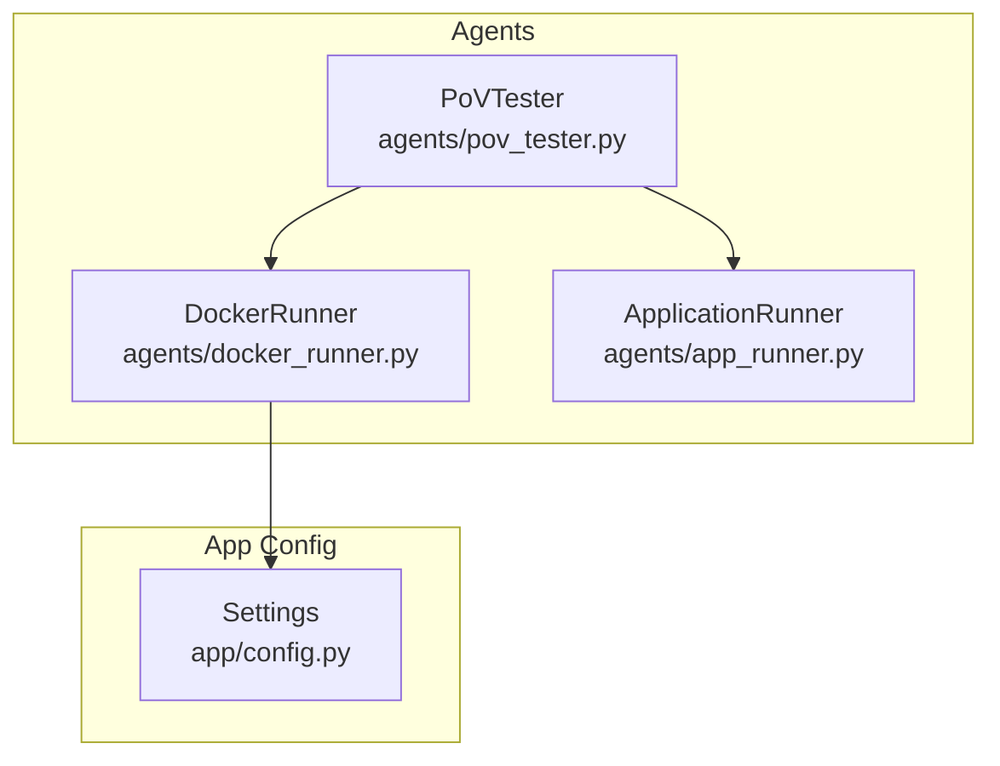
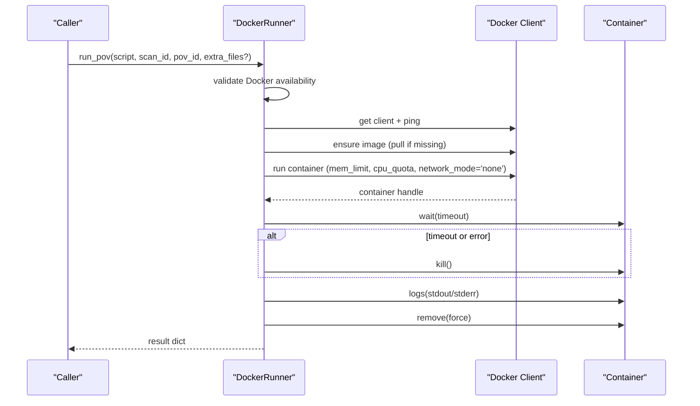
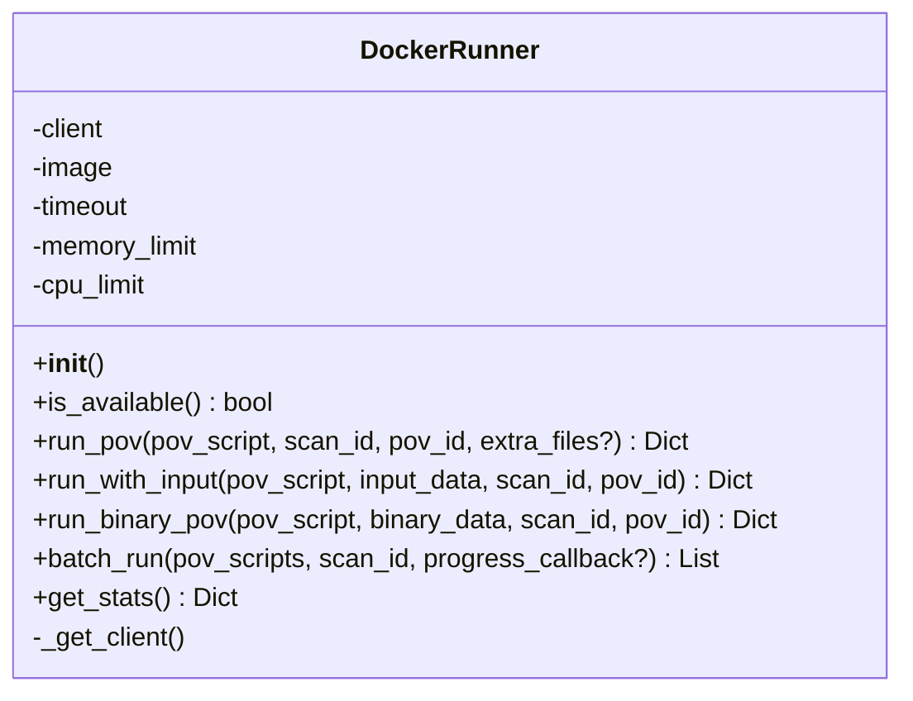
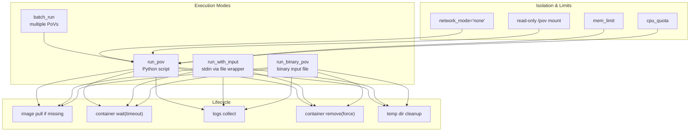
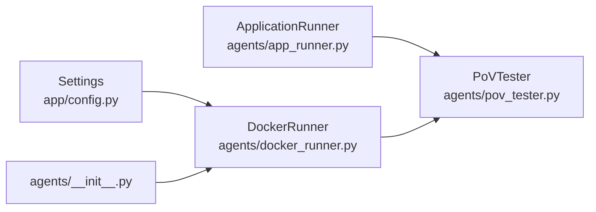

# Docker Runner Agent

<cite>
**Referenced Files in This Document**
- [docker_runner.py](file://agents/docker_runner.py)
- [config.py](file://app/config.py)
- [app_runner.py](file://agents/app_runner.py)
- [pov_tester.py](file://agents/pov_tester.py)
- [__init__.py](file://agents/__init__.py)
</cite>

## Table of Contents
1. [Introduction](#introduction)
2. [Project Structure](#project-structure)
3. [Core Components](#core-components)
4. [Architecture Overview](#architecture-overview)
5. [Detailed Component Analysis](#detailed-component-analysis)
6. [Dependency Analysis](#dependency-analysis)
7. [Performance Considerations](#performance-considerations)
8. [Troubleshooting Guide](#troubleshooting-guide)
9. [Conclusion](#conclusion)

## Introduction
This document describes the Docker Runner Agent responsible for executing Proof-of-Vulnerability (PoV) scripts in secure, isolated Docker containers. It covers container orchestration, sandbox execution, security isolation, and the three primary execution modes: running PoV scripts, injecting textual input via stdin, and testing with binary data. It also documents Docker configuration options, error handling, cleanup procedures, batch execution, and security considerations.

## Project Structure
The Docker Runner Agent resides in the agents module alongside related testing and application lifecycle management utilities. The configuration for Docker runtime parameters is centralized in the application settings.

**Diagram sources**
- [docker_runner.py:27-377](file://agents/docker_runner.py#L27-L377)
- [app_runner.py:19-200](file://agents/app_runner.py#L19-L200)
- [pov_tester.py:21-296](file://agents/pov_tester.py#L21-L296)
- [config.py:92-98](file://app/config.py#L92-L98)

**Section sources**
- [docker_runner.py:1-377](file://agents/docker_runner.py#L1-L377)
- [config.py:92-98](file://app/config.py#L92-L98)

## Core Components
- DockerRunner: Orchestrates container creation, execution, and cleanup; exposes methods for PoV execution variants and batch runs.
- Settings: Provides Docker configuration (image, timeouts, memory/cpu limits) and availability checks.
- ApplicationRunner: Manages lifecycle of target applications for live PoV testing.
- PoVTester: Executes PoV scripts against live targets and supports full lifecycle testing.

Key responsibilities:
- Isolation: Uses a read-only bind mount and disables networking for strict sandboxing.
- Resource control: Applies memory and CPU constraints per container.
- Reliability: Implements timeouts, cleanup, and robust error handling.
- Flexibility: Supports text and binary input injection, plus batch execution.

**Section sources**
- [docker_runner.py:27-377](file://agents/docker_runner.py#L27-L377)
- [config.py:92-98](file://app/config.py#L92-L98)
- [app_runner.py:19-200](file://agents/app_runner.py#L19-L200)
- [pov_tester.py:21-296](file://agents/pov_tester.py#L21-L296)

## Architecture Overview
The Docker Runner Agent integrates with the application configuration to pull or build a Python runtime image, spin up a container with strict isolation, execute the PoV script, and collect structured results. Optional wrappers enable stdin and binary input injection.

**Diagram sources**
- [docker_runner.py:62-192](file://agents/docker_runner.py#L62-L192)

## Detailed Component Analysis

### DockerRunner Class
The DockerRunner encapsulates all container orchestration logic. It initializes from application settings, ensures the runtime image exists, and executes PoV scripts with strict isolation and resource limits.

**Diagram sources**
- [docker_runner.py:27-377](file://agents/docker_runner.py#L27-L377)

Key methods and behaviors:
- run_pov: Writes the PoV script and optional extra files to a temporary directory, mounts it read-only into /pov, runs the Python interpreter, waits with timeout, collects logs, kills on timeout, removes container, and returns a standardized result dictionary.
- run_with_input: Creates a wrapper that writes input to a file and executes the PoV script, enabling stdin-like behavior without shell escaping complexities.
- run_binary_pov: Writes binary input to input.bin and executes the PoV script, suitable for fuzzing or binary protocol testing.
- batch_run: Iterates over a list of PoV configurations, invoking run_pov for each and optionally reporting progress.
- get_stats: Queries Docker daemon for runtime stats and returns configuration values alongside health metrics.

Security and isolation:
- Network isolation: network_mode='none' prevents outbound connections.
- Read-only filesystem: volumes specify mode='ro' for the mounted directory.
- Resource limits: mem_limit and cpu_quota applied per container.
- Cleanup: Containers are force-removed after execution; temporary host directories are deleted.

Error handling:
- Graceful degradation when Docker is unavailable.
- ContainerError handling returns structured failure results with captured stdout/stderr when available.
- General exceptions are caught and reported with empty stdout/stderr and negative exit codes.

**Section sources**
- [docker_runner.py:27-377](file://agents/docker_runner.py#L27-L377)
- [config.py:92-98](file://app/config.py#L92-L98)

### Configuration Options
Docker-related settings are defined in the application settings and consumed by DockerRunner:
- DOCKER_ENABLED: Controls whether Docker features are enabled.
- DOCKER_IMAGE: Base image used for PoV execution.
- DOCKER_TIMEOUT: Per-container execution timeout.
- DOCKER_MEMORY_LIMIT: Memory limit per container.
- DOCKER_CPU_LIMIT: CPU quota (as fractional CPUs) applied via docker-py’s cpu_quota.

Availability checks:
- is_docker_available: Validates Docker service readiness via docker info.

**Section sources**
- [config.py:92-98](file://app/config.py#L92-L98)
- [config.py:162-175](file://app/config.py#L162-L175)

### Application Lifecycle and Live Testing
While DockerRunner focuses on sandboxed execution, PoVTester coordinates live application testing:
- Starts a target application (e.g., Node.js) via ApplicationRunner.
- Injects TARGET_URL into the environment for PoV scripts.
- Executes PoV scripts against the running target and captures results.
- Stops the application regardless of outcome.

This complements DockerRunner by enabling both sandboxed and live vulnerability validation.

**Section sources**
- [app_runner.py:19-200](file://agents/app_runner.py#L19-L200)
- [pov_tester.py:21-296](file://agents/pov_tester.py#L21-L296)

## Architecture Overview

**Diagram sources**
- [docker_runner.py:62-310](file://agents/docker_runner.py#L62-L310)

## Detailed Component Analysis

### run_pov Method
Behavior:
- Validates Docker availability.
- Creates a temporary directory and writes the PoV script and any extra files.
- Ensures the configured image exists (pulls if missing).
- Runs a container with:
  - Working directory set to /pov
  - Read-only bind mount of the temp directory
  - Disabled networking
  - Memory and CPU limits applied
  - Detached execution with stdout/stderr capture
- Waits with timeout; on timeout or error, kills the container.
- Collects stdout/stderr, removes the container, computes execution duration, and determines if the vulnerability was triggered based on a specific marker in stdout.

Result structure:
- success: Boolean indicating success or vulnerability trigger
- vulnerability_triggered: Boolean flag derived from output
- stdout, stderr: Captured logs
- exit_code: Numeric exit code or -1 on timeout
- execution_time_s: Duration in seconds
- timestamp: ISO timestamp

**Section sources**
- [docker_runner.py:62-192](file://agents/docker_runner.py#L62-L192)

### run_with_input Method
Behavior:
- Writes input data to input_data.txt and the PoV script to pov_script.py.
- Generates a small wrapper that writes the input to /pov/input_data.txt and then executes the PoV script.
- Delegates to run_pov with extra files.

Use cases:
- Passing large or special-character-rich inputs without shell escaping issues.
- Enabling PoV scripts to read from files rather than relying on stdin piping.

**Section sources**
- [docker_runner.py:193-230](file://agents/docker_runner.py#L193-L230)

### run_binary_pov Method
Behavior:
- Writes binary input to input.bin and the PoV script to pov.py.
- Runs the container similarly to run_pov with read-only mount and isolation.
- Collects logs, removes container, and returns results.

Use cases:
- Fuzzing or protocol testing requiring raw binary payloads.

**Section sources**
- [docker_runner.py:230-310](file://agents/docker_runner.py#L230-L310)

### Batch Execution
Behavior:
- Iterates over a list of PoV configurations.
- Invokes run_pov for each item.
- Optionally invokes a progress callback with current count, total, and result.

**Section sources**
- [docker_runner.py:311-342](file://agents/docker_runner.py#L311-L342)

### Stats and Availability
Behavior:
- Checks Docker availability via is_docker_available.
- Retrieves Docker info and returns version, running/container counts, image count, and configured limits/timeouts.
- Returns an error payload if Docker is unreachable.

**Section sources**
- [docker_runner.py:344-367](file://agents/docker_runner.py#L344-L367)
- [config.py:162-175](file://app/config.py#L162-L175)

## Dependency Analysis
- DockerRunner depends on:
  - Docker SDK for Python (docker) for container orchestration.
  - Application settings for runtime configuration.
- PoVTester depends on:
  - ApplicationRunner for lifecycle management of target apps.
  - DockerRunner for sandboxed PoV execution when needed.
- Exports:
  - DockerRunner is exposed via a global instance and a getter for use across the application.

**Diagram sources**
- [docker_runner.py:19-377](file://agents/docker_runner.py#L19-L377)
- [config.py:92-98](file://app/config.py#L92-L98)
- [app_runner.py:19-200](file://agents/app_runner.py#L19-L200)
- [pov_tester.py:13-296](file://agents/pov_tester.py#L13-L296)
- [__init__.py:9-19](file://agents/__init__.py#L9-L19)

**Section sources**
- [docker_runner.py:19-377](file://agents/docker_runner.py#L19-L377)
- [config.py:92-98](file://app/config.py#L92-L98)
- [app_runner.py:19-200](file://agents/app_runner.py#L19-L200)
- [pov_tester.py:13-296](file://agents/pov_tester.py#L13-L296)
- [__init__.py:9-19](file://agents/__init__.py#L9-L19)

## Performance Considerations
- Resource limits: Configure DOCKER_MEMORY_LIMIT and DOCKER_CPU_LIMIT to prevent noisy-neighbor effects and ensure predictable execution times.
- Timeouts: DOCKER_TIMEOUT bounds container execution; tune based on expected workload complexity.
- Image caching: Reuse of the configured DOCKER_IMAGE avoids repeated pulls.
- Mount overhead: Read-only bind mounts are efficient; keep the number of mounted files minimal.
- Batch execution: Use batch_run to amortize overhead across multiple PoVs.

[No sources needed since this section provides general guidance]

## Troubleshooting Guide
Common issues and resolutions:
- Docker not available:
  - Verify DOCKER_ENABLED and that the Docker daemon is running.
  - Confirm is_docker_available returns True.
- Import errors for docker-py:
  - Ensure the docker SDK is installed; DockerRunner raises a clear error if not available.
- Container startup failures:
  - Check that DOCKER_IMAGE is valid and accessible; the runner attempts to pull if missing.
- Timeouts:
  - Increase DOCKER_TIMEOUT if PoVs require more time.
  - Review PoV logic for infinite loops or blocking operations.
- Network-dependent failures:
  - Sandboxed runs disable networking; move network-dependent logic to live testing via PoVTester.
- Resource exhaustion:
  - Adjust DOCKER_MEMORY_LIMIT and DOCKER_CPU_LIMIT to match workload characteristics.
- Logs and exit codes:
  - Inspect stdout/stderr and exit_code in returned results for diagnostics.

Cleanup:
- Containers are force-removed after execution.
- Temporary host directories are deleted in a finally block.

**Section sources**
- [docker_runner.py:37-48](file://agents/docker_runner.py#L37-L48)
- [docker_runner.py:168-187](file://agents/docker_runner.py#L168-L187)
- [docker_runner.py:188-191](file://agents/docker_runner.py#L188-L191)
- [config.py:162-175](file://app/config.py#L162-L175)

## Conclusion
The Docker Runner Agent provides a robust, secure, and configurable mechanism to execute PoV scripts in isolated containers. It enforces strong security boundaries, applies resource controls, and offers flexible execution modes for text and binary inputs. Combined with ApplicationRunner and PoVTester, it supports both sandboxed and live vulnerability validation workflows.