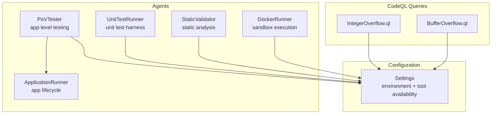
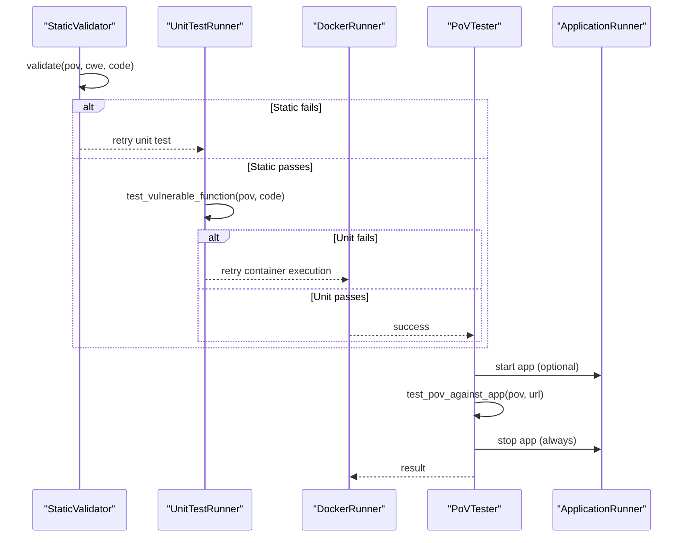
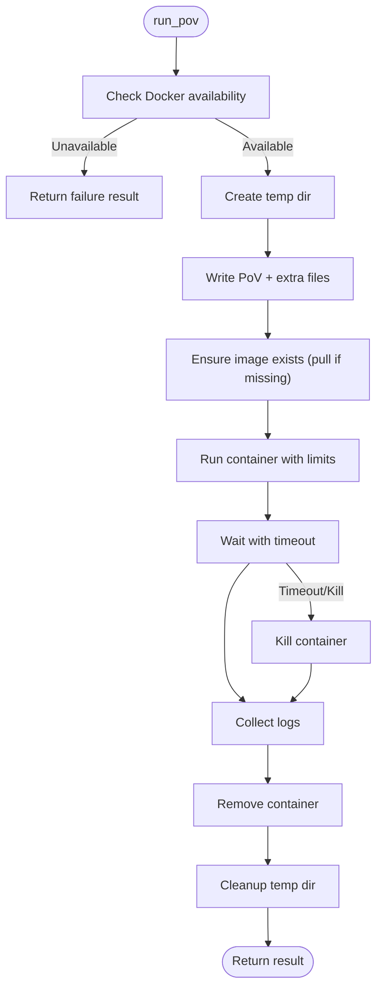
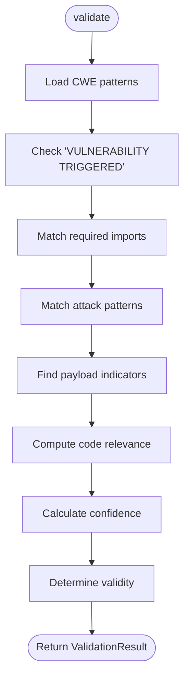
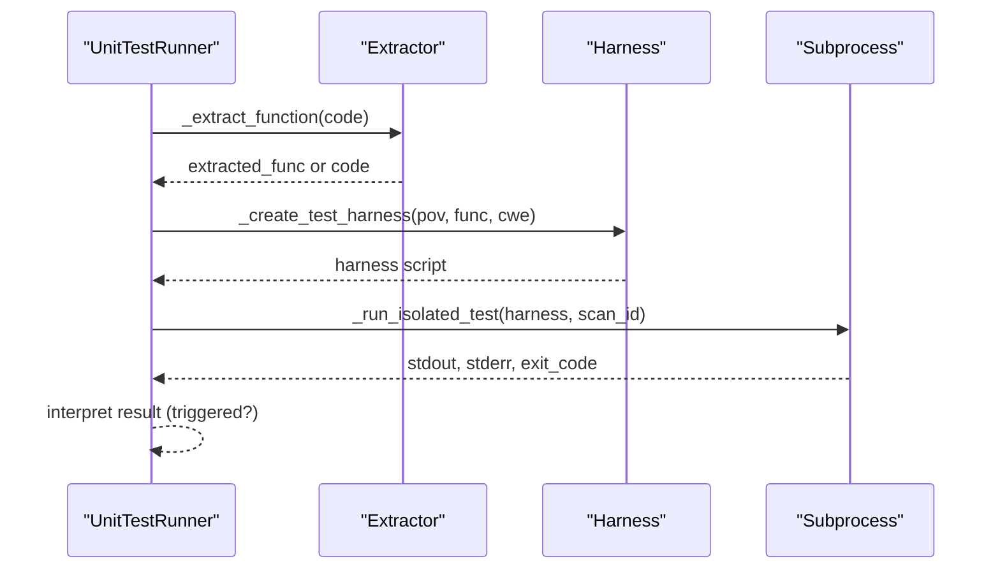
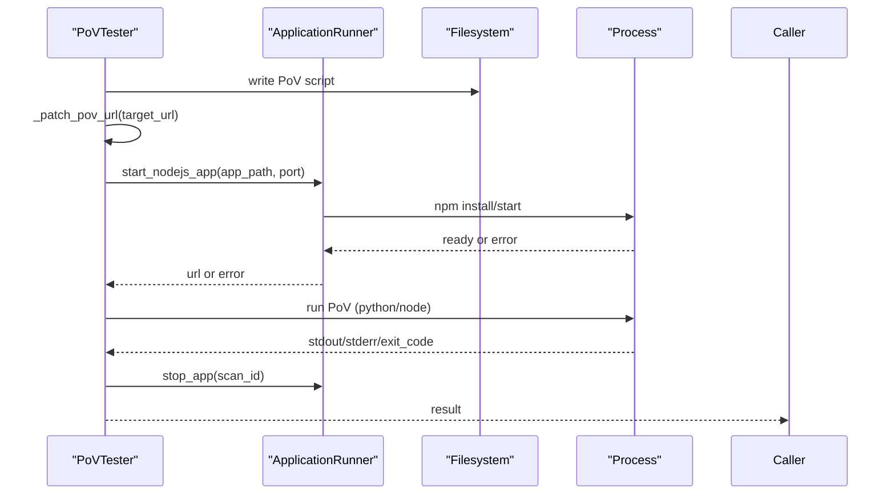
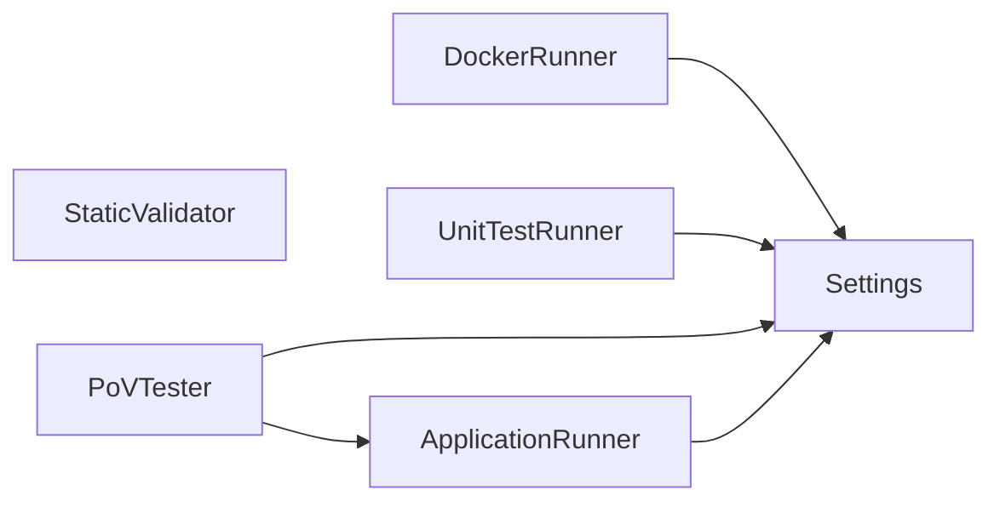

# Execution & Validation Agents

<cite>
**Referenced Files in This Document**
- [docker_runner.py](file://agents/docker_runner.py)
- [static_validator.py](file://agents/static_validator.py)
- [unit_test_runner.py](file://agents/unit_test_runner.py)
- [pov_tester.py](file://agents/pov_tester.py)
- [app_runner.py](file://agents/app_runner.py)
- [config.py](file://app/config.py)
- [README.md](file://README.md)
- [BufferOverflow.ql](file://codeql_queries/BufferOverflow.ql)
- [IntegerOverflow.ql](file://codeql_queries/IntegerOverflow.ql)
</cite>

## Table of Contents
1. [Introduction](#introduction)
2. [Project Structure](#project-structure)
3. [Core Components](#core-components)
4. [Architecture Overview](#architecture-overview)
5. [Detailed Component Analysis](#detailed-component-analysis)
6. [Dependency Analysis](#dependency-analysis)
7. [Performance Considerations](#performance-considerations)
8. [Troubleshooting Guide](#troubleshooting-guide)
9. [Conclusion](#conclusion)

## Introduction
This document explains AutoPoV’s execution and validation agents that collectively confirm whether a detected vulnerability can be exploited. It focuses on:
- DockerRunner: sandboxed containerized execution for PoV scripts
- StaticValidator: static analysis and pattern-based validation
- UnitTestRunner: unit-style validation against isolated vulnerable code
- PoVTester: application-level exploit testing with environment simulation

It also covers security considerations, performance characteristics, and troubleshooting guidance for each agent.

## Project Structure
The execution and validation agents reside under agents/, with configuration centralized in app/config.py. The README outlines the agent graph and validation pipeline.

**Diagram sources**
- [docker_runner.py:1-377](file://agents/docker_runner.py#L1-L377)
- [static_validator.py:1-305](file://agents/static_validator.py#L1-L305)
- [unit_test_runner.py:1-344](file://agents/unit_test_runner.py#L1-L344)
- [pov_tester.py:1-296](file://agents/pov_tester.py#L1-L296)
- [app_runner.py:1-200](file://agents/app_runner.py#L1-L200)
- [config.py:1-255](file://app/config.py#L1-L255)
- [BufferOverflow.ql:1-59](file://codeql_queries/BufferOverflow.ql#L1-L59)
- [IntegerOverflow.ql:1-62](file://codeql_queries/IntegerOverflow.ql#L1-L62)

**Section sources**
- [README.md:1-444](file://README.md#L1-L444)
- [config.py:1-255](file://app/config.py#L1-L255)

## Core Components
- DockerRunner: Orchestrates sandboxed execution of PoV scripts inside containers with strict resource limits and no network access. It supports multiple input modes (Python, stdin, binary) and batch execution.
- StaticValidator: Performs static analysis to validate PoV scripts by matching CWE-specific patterns, required imports, and payload indicators, and by scoring relevance to the vulnerable code.
- UnitTestRunner: Executes PoV scripts against isolated vulnerable code snippets in a controlled subprocess, capturing stdout/stderr and determining if the vulnerability was triggered.
- PoVTester: Tests PoVs against running applications, patching target URLs and running either Python or JavaScript PoVs. It integrates with ApplicationRunner to manage app lifecycle.

**Section sources**
- [docker_runner.py:27-377](file://agents/docker_runner.py#L27-L377)
- [static_validator.py:22-305](file://agents/static_validator.py#L22-L305)
- [unit_test_runner.py:28-344](file://agents/unit_test_runner.py#L28-L344)
- [pov_tester.py:21-296](file://agents/pov_tester.py#L21-L296)
- [app_runner.py:19-200](file://agents/app_runner.py#L19-L200)

## Architecture Overview
The validation pipeline escalates from least-risk to highest-confidence:
- StaticValidator: fast, static checks
- UnitTestRunner: isolated unit-style execution
- DockerRunner: sandboxed container execution
- PoVTester: application-level testing with lifecycle management

**Diagram sources**
- [static_validator.py:123-234](file://agents/static_validator.py#L123-L234)
- [unit_test_runner.py:34-117](file://agents/unit_test_runner.py#L34-L117)
- [docker_runner.py:62-192](file://agents/docker_runner.py#L62-L192)
- [pov_tester.py:24-106](file://agents/pov_tester.py#L24-L106)
- [app_runner.py:25-148](file://agents/app_runner.py#L25-L148)

## Detailed Component Analysis

### DockerRunner: Sandbox Execution, Container Orchestration, Secure Environment Management
DockerRunner executes PoV scripts in isolated containers with:
- Strict resource limits (CPU quota, memory limit)
- No network connectivity for safety
- Automatic image pull if missing
- Robust error handling and timeouts
- Support for multiple input modes (Python script, stdin, binary)

Key behaviors:
- Availability check via settings and Docker daemon ping
- Temporary directory creation per execution
- Container run with mounted volume, working directory, and resource constraints
- Wait with timeout and kill on timeout
- Logs extraction and cleanup
- Batch execution with progress callbacks
- Stats reporting for Docker daemon health

**Diagram sources**
- [docker_runner.py:62-192](file://agents/docker_runner.py#L62-L192)

Security considerations:
- Network isolation via network_mode='none'
- Resource quotas prevent resource exhaustion
- Temporary files are cleaned up after execution
- Exit code and “VULNERABILITY TRIGGERED” detection determine success

Performance considerations:
- CPU and memory limits configurable via settings
- Short timeout prevents runaway containers
- Batch mode reduces overhead by reusing client

Operational notes:
- Uses settings.DOCKER_IMAGE, DOCKER_TIMEOUT, DOCKER_MEMORY_LIMIT, DOCKER_CPU_LIMIT
- Supports run_with_input and run_binary_pov for varied inputs

**Section sources**
- [docker_runner.py:27-377](file://agents/docker_runner.py#L27-L377)
- [config.py:92-98](file://app/config.py#L92-L98)

### StaticValidator: Static Analysis, CodeQL Integration, Automated Scanning Processes
StaticValidator validates PoV scripts statically by:
- Matching CWE-specific patterns (imports, attack patterns, payload indicators)
- Requiring a “VULNERABILITY TRIGGERED” indicator
- Scoring relevance to the vulnerable code snippet
- Calculating confidence based on matched patterns, issues, presence of vulnerability check, and code relevance

Validation flow:
- Parse CWE-specific patterns
- Check for required imports and attack patterns
- Extract payload indicators
- Compute relevance score
- Combine metrics into confidence and validity determination

**Diagram sources**
- [static_validator.py:123-234](file://agents/static_validator.py#L123-L234)

Integration with CodeQL:
- The repository includes CodeQL query packs for memory safety (buffer overflow, integer overflow) that complement static validation.
- These queries can be used alongside StaticValidator to detect low-level memory safety issues.

**Section sources**
- [static_validator.py:22-305](file://agents/static_validator.py#L22-L305)
- [BufferOverflow.ql:1-59](file://codeql_queries/BufferOverflow.ql#L1-L59)
- [IntegerOverflow.ql:1-62](file://codeql_queries/IntegerOverflow.ql#L1-L62)

### UnitTestRunner: Unit Testing Validation, Test Case Execution, Result Interpretation
UnitTestRunner executes PoV scripts against isolated vulnerable code:
- Extracts the vulnerable function or code snippet
- Creates a test harness that injects the vulnerable code into a controlled namespace
- Executes the PoV script within the same namespace and captures stdout/stderr
- Determines success based on exit code and “VULNERABILITY TRIGGERED” presence
- Enforces a 30-second timeout and restricted environment variables

Key behaviors:
- Isolated subprocess with minimal PATH and PYTHONPATH
- Safe embedding of code via escaping
- Mock-data testing capability for input-driven PoVs
- Syntax validation via AST parsing

**Diagram sources**
- [unit_test_runner.py:34-117](file://agents/unit_test_runner.py#L34-L117)
- [unit_test_runner.py:145-235](file://agents/unit_test_runner.py#L145-L235)
- [unit_test_runner.py:236-287](file://agents/unit_test_runner.py#L236-L287)

**Section sources**
- [unit_test_runner.py:28-344](file://agents/unit_test_runner.py#L28-L344)

### PoVTester: Exploit Testing, Environment Simulation, Validation Methodology
PoVTester validates PoVs against running applications:
- Writes PoV script to a temporary directory
- Patches target URL placeholders and localhost references
- Executes PoV via Python or Node.js with environment variable injection
- Supports full lifecycle: start app, test PoV, stop app

Integration with ApplicationRunner:
- Starts Node.js apps by installing dependencies and launching via npm start
- Waits for readiness with a configurable timeout
- Tracks running apps and ensures cleanup

**Diagram sources**
- [pov_tester.py:24-106](file://agents/pov_tester.py#L24-L106)
- [pov_tester.py:224-287](file://agents/pov_tester.py#L224-L287)
- [app_runner.py:25-148](file://agents/app_runner.py#L25-L148)

**Section sources**
- [pov_tester.py:21-296](file://agents/pov_tester.py#L21-L296)
- [app_runner.py:19-200](file://agents/app_runner.py#L19-L200)

## Dependency Analysis
- DockerRunner depends on settings for Docker configuration and availability checks.
- StaticValidator relies on CWE-specific patterns and code relevance heuristics.
- UnitTestRunner depends on AST parsing and subprocess execution with restricted environments.
- PoVTester depends on ApplicationRunner for app lifecycle and on settings for tool availability checks.

**Diagram sources**
- [docker_runner.py:27-377](file://agents/docker_runner.py#L27-L377)
- [static_validator.py:22-305](file://agents/static_validator.py#L22-L305)
- [unit_test_runner.py:28-344](file://agents/unit_test_runner.py#L28-L344)
- [pov_tester.py:21-296](file://agents/pov_tester.py#L21-L296)
- [app_runner.py:19-200](file://agents/app_runner.py#L19-L200)
- [config.py:1-255](file://app/config.py#L1-L255)

**Section sources**
- [config.py:162-211](file://app/config.py#L162-L211)

## Performance Considerations
- DockerRunner
  - Resource limits reduce risk and improve fairness across scans.
  - Short timeouts prevent long-running PoVs from blocking the system.
  - Batch mode reduces repeated client initialization overhead.
- StaticValidator
  - Pattern matching is lightweight; confidence calculation is O(n) over matched items.
  - CWE-specific patterns minimize false positives for targeted CWEs.
- UnitTestRunner
  - Subprocess isolation adds overhead; 30-second timeout prevents hangs.
  - Restricted environment variables reduce side effects and improve reproducibility.
- PoVTester
  - Application startup costs can dominate; reuse or caching of app instances can help.
  - Target URL patching avoids hardcoding and improves portability.

[No sources needed since this section provides general guidance]

## Troubleshooting Guide
Common issues and resolutions:
- DockerRunner
  - Docker not available: Verify DOCKER_ENABLED and that docker info succeeds. Check DOCKER_IMAGE existence and pull if needed.
  - Timeout or killed container: Reduce PoV complexity or increase DOCKER_TIMEOUT; review resource limits.
  - Missing “VULNERABILITY TRIGGERED”: Ensure PoV prints the expected indicator and exits with success code.
- StaticValidator
  - Low confidence: Add required imports and attack patterns; align PoV with the vulnerable code snippet.
  - Unknown CWE: Validation defaults to conservative behavior; consider adding CWE-specific patterns.
- UnitTestRunner
  - Extraction failures: Ensure vulnerable code contains a function or identifiable code block.
  - Timeout: Simplify PoV or isolate heavier operations; verify stdin handling if applicable.
  - Syntax errors: Use validate_syntax to catch AST issues early.
- PoVTester
  - App start failures: Confirm package.json presence and npm install success; adjust start_timeout.
  - Target URL mismatch: Ensure placeholders are replaced and localhost references patched.
  - Lifecycle cleanup: Always verify stop_app is invoked to prevent orphaned processes.

**Section sources**
- [docker_runner.py:37-61](file://agents/docker_runner.py#L37-L61)
- [docker_runner.py:135-144](file://agents/docker_runner.py#L135-L144)
- [static_validator.py:154-164](file://agents/static_validator.py#L154-L164)
- [unit_test_runner.py:118-144](file://agents/unit_test_runner.py#L118-L144)
- [unit_test_runner.py:266-281](file://agents/unit_test_runner.py#L266-L281)
- [pov_tester.py:107-138](file://agents/pov_tester.py#L107-L138)
- [app_runner.py:55-73](file://agents/app_runner.py#L55-L73)
- [app_runner.py:135-148](file://agents/app_runner.py#L135-L148)

## Conclusion
AutoPoV’s execution and validation agents form a robust, multi-layered pipeline:
- StaticValidator quickly filters PoVs by pattern and relevance
- UnitTestRunner isolates and executes PoVs against vulnerable code
- DockerRunner provides the final sandboxed proof-of-concept
- PoVTester simulates realistic environments and cleans up afterward

Together, they balance speed, safety, and confidence, enabling autonomous vulnerability validation at scale.