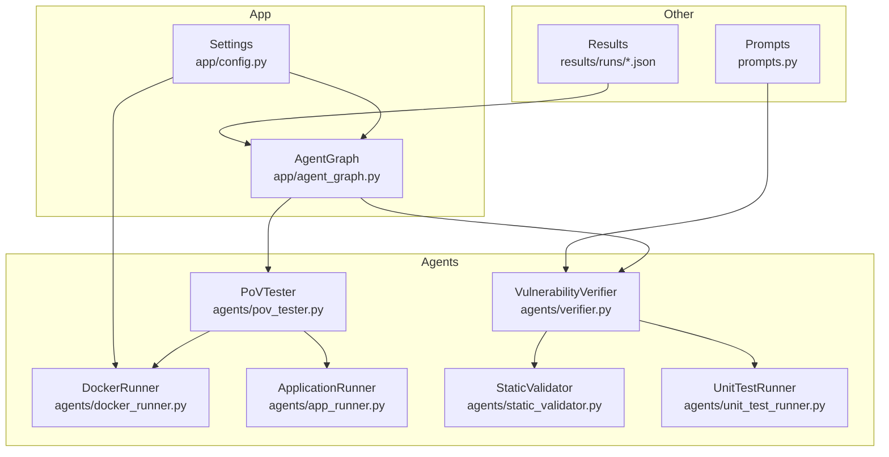
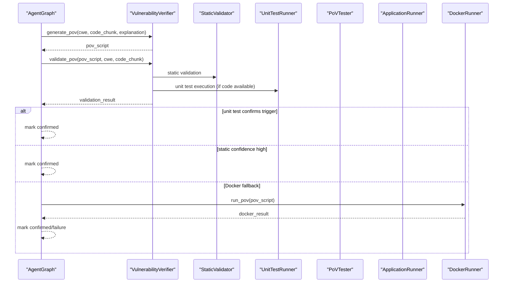
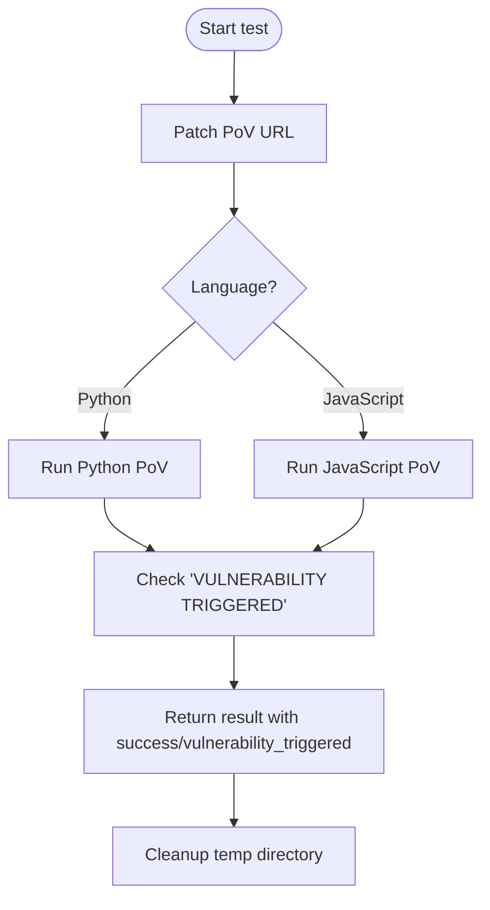
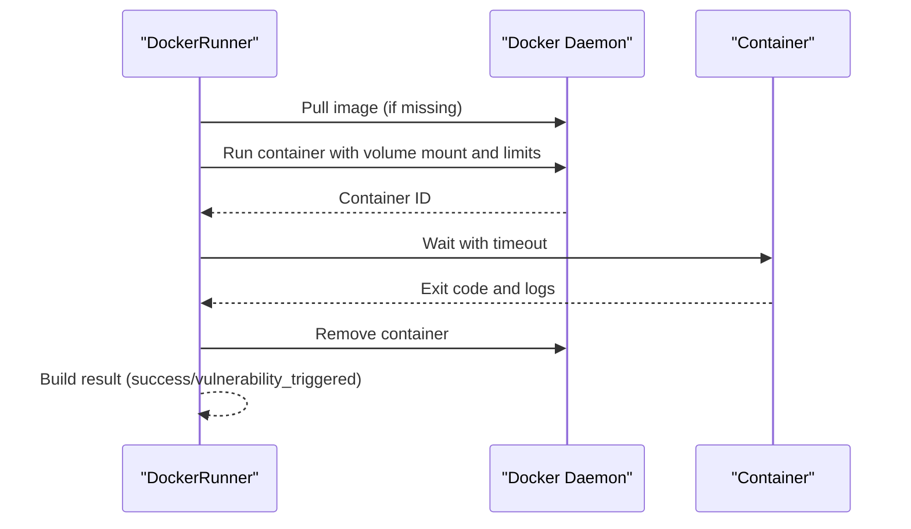
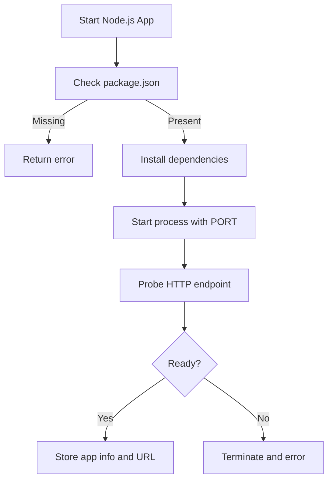
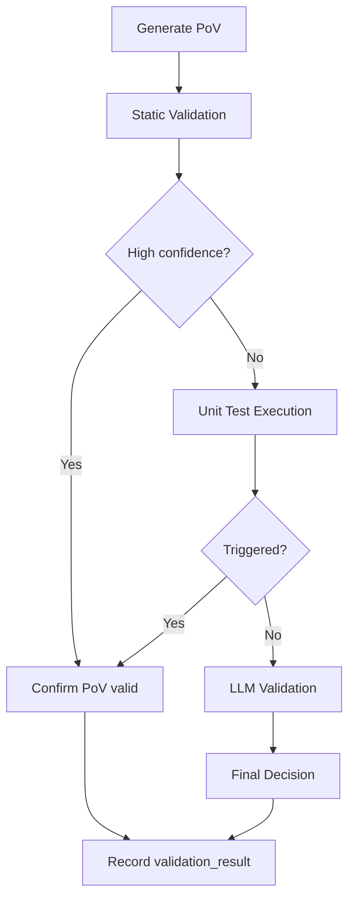
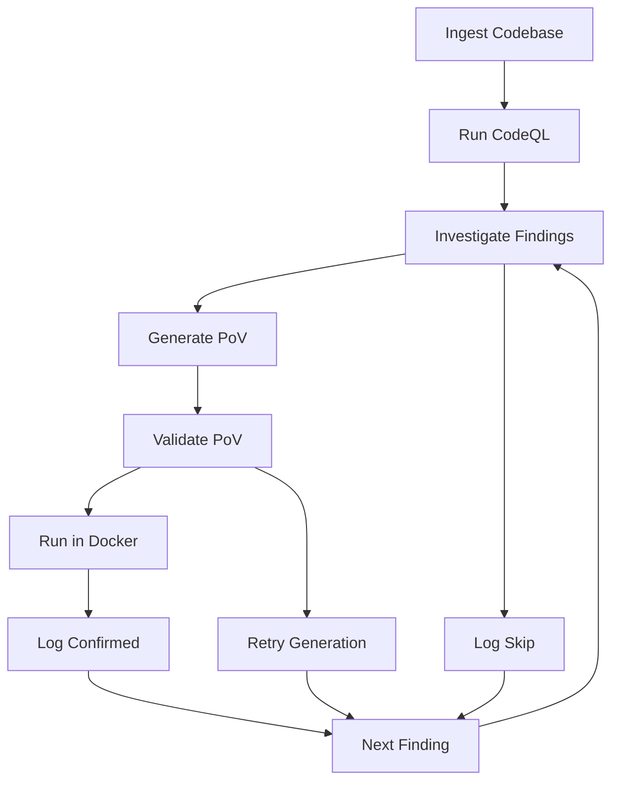
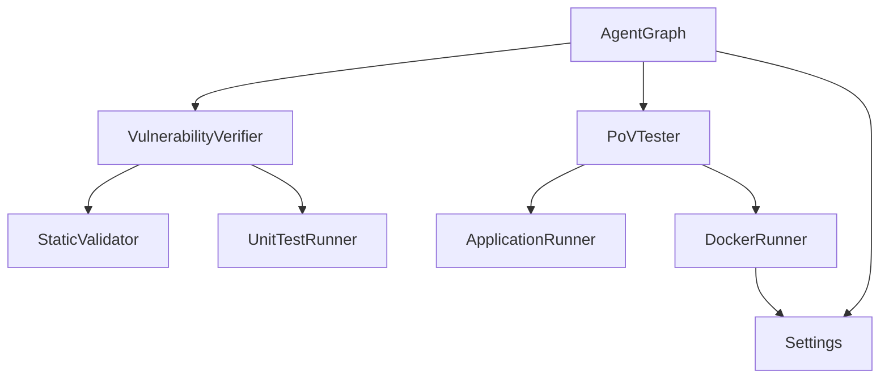

# PoV Tester Agent

<cite>
**Referenced Files in This Document**
- [pov_tester.py](file://agents/pov_tester.py)
- [docker_runner.py](file://agents/docker_runner.py)
- [app_runner.py](file://agents/app_runner.py)
- [agent_graph.py](file://app/agent_graph.py)
- [verifier.py](file://agents/verifier.py)
- [static_validator.py](file://agents/static_validator.py)
- [unit_test_runner.py](file://agents/unit_test_runner.py)
- [prompts.py](file://prompts.py)
- [config.py](file://app/config.py)
- [00457eac-35b4-4e40-a9bd-59f9443694a4.json](file://results/runs/00457eac-35b4-4e40-a9bd-59f9443694a4.json)
</cite>

## Table of Contents
1. [Introduction](#introduction)
2. [Project Structure](#project-structure)
3. [Core Components](#core-components)
4. [Architecture Overview](#architecture-overview)
5. [Detailed Component Analysis](#detailed-component-analysis)
6. [Dependency Analysis](#dependency-analysis)
7. [Performance Considerations](#performance-considerations)
8. [Troubleshooting Guide](#troubleshooting-guide)
9. [Conclusion](#conclusion)
10. [Appendices](#appendices)

## Introduction
This document describes the PoV Tester Agent within the AutoPoV system. The agent's role is to confirm whether a discovered vulnerability can be reliably exploited by executing Proof-of-Vulnerability (PoV) scripts under controlled environments. It integrates static validation, unit test execution, and Docker-based sandboxing to validate exploitability, interpret results, and handle edge cases. The documentation covers methodology, environment simulation, validation processes, Docker execution, isolation, and result interpretation.

## Project Structure
The PoV Tester Agent is part of a broader agentic workflow that includes code ingestion, CodeQL analysis, LLM-based investigation, PoV generation, validation, and execution. The relevant modules are organized as follows:
- Agents: PoV testing, Docker execution, application lifecycle, validation, and unit testing
- App: Orchestration via a LangGraph-based workflow
- Config: Environment and runtime settings
- Prompts: LLM prompts for PoV generation and validation

**Diagram sources**
- [agent_graph.py:82-168](file://app/agent_graph.py#L82-L168)
- [pov_tester.py:21-296](file://agents/pov_tester.py#L21-L296)
- [docker_runner.py:27-377](file://agents/docker_runner.py#L27-L377)
- [app_runner.py:19-200](file://agents/app_runner.py#L19-L200)
- [verifier.py:42-562](file://agents/verifier.py#L42-L562)
- [static_validator.py:22-305](file://agents/static_validator.py#L22-L305)
- [unit_test_runner.py:28-344](file://agents/unit_test_runner.py#L28-L344)
- [prompts.py:46-91](file://prompts.py#L46-L91)
- [config.py:13-255](file://app/config.py#L13-L255)
- [00457eac-35b4-4e40-a9bd-59f9443694a4.json:1-21](file://results/runs/00457eac-35b4-4e40-a9bd-59f9443694a4.json#L1-L21)

**Section sources**
- [agent_graph.py:82-168](file://app/agent_graph.py#L82-L168)
- [pov_tester.py:21-296](file://agents/pov_tester.py#L21-L296)
- [docker_runner.py:27-377](file://agents/docker_runner.py#L27-L377)
- [app_runner.py:19-200](file://agents/app_runner.py#L19-L200)
- [verifier.py:42-562](file://agents/verifier.py#L42-L562)
- [static_validator.py:22-305](file://agents/static_validator.py#L22-L305)
- [unit_test_runner.py:28-344](file://agents/unit_test_runner.py#L28-L344)
- [prompts.py:46-91](file://prompts.py#L46-L91)
- [config.py:13-255](file://app/config.py#L13-L255)
- [00457eac-35b4-4e40-a9bd-59f9443694a4.json:1-21](file://results/runs/00457eac-35b4-4e40-a9bd-59f9443694a4.json#L1-L21)

## Core Components
- PoVTester: Executes PoV scripts against live applications or in Docker, patches target URLs, and interprets results.
- DockerRunner: Runs PoV scripts in isolated containers with resource limits and no network access.
- ApplicationRunner: Starts/stops target applications for PoV testing against live services.
- VulnerabilityVerifier: Generates and validates PoV scripts using static analysis, unit tests, and LLM-based checks.
- StaticValidator: Validates PoV scripts statically with CWE-specific patterns and confidence scoring.
- UnitTestRunner: Executes PoVs against isolated vulnerable code snippets to confirm triggers deterministically.
- AgentGraph: Orchestrates the end-to-end workflow, integrating PoV generation, validation, and execution.

**Section sources**
- [pov_tester.py:21-296](file://agents/pov_tester.py#L21-L296)
- [docker_runner.py:27-377](file://agents/docker_runner.py#L27-L377)
- [app_runner.py:19-200](file://agents/app_runner.py#L19-L200)
- [verifier.py:42-562](file://agents/verifier.py#L42-L562)
- [static_validator.py:22-305](file://agents/static_validator.py#L22-L305)
- [unit_test_runner.py:28-344](file://agents/unit_test_runner.py#L28-L344)
- [agent_graph.py:82-168](file://app/agent_graph.py#L82-L168)

## Architecture Overview
The PoV Tester Agent participates in a multi-stage workflow:
1. Code ingestion and CodeQL analysis produce candidate vulnerabilities.
2. LLM-based investigation determines if findings are real.
3. PoV scripts are generated and validated using static analysis, unit tests, and LLM checks.
4. If validation is inconclusive, PoVs are executed in Docker for final confirmation.
5. Results are recorded and the next finding is processed until completion.

**Diagram sources**
- [agent_graph.py:779-1004](file://app/agent_graph.py#L779-L1004)
- [verifier.py:225-387](file://agents/verifier.py#L225-L387)
- [static_validator.py:123-233](file://agents/static_validator.py#L123-L233)
- [unit_test_runner.py:34-104](file://agents/unit_test_runner.py#L34-L104)
- [docker_runner.py:62-187](file://agents/docker_runner.py#L62-L187)

## Detailed Component Analysis

### PoVTester: Exploit Execution and Environment Simulation
Responsibilities:
- Patch PoV scripts to use the correct target URL.
- Execute PoV scripts in Python or JavaScript environments.
- Support full lifecycle testing by starting/stopping applications.
- Interpret results and detect successful exploit triggers.

Key behaviors:
- URL patching replaces placeholders and localhost patterns with the actual target URL.
- Execution timeouts are handled gracefully with explicit failure states.
- Vulnerability trigger detection relies on a standardized output marker.

**Diagram sources**
- [pov_tester.py:24-106](file://agents/pov_tester.py#L24-L106)
- [pov_tester.py:140-222](file://agents/pov_tester.py#L140-L222)

**Section sources**
- [pov_tester.py:21-296](file://agents/pov_tester.py#L21-L296)

### DockerRunner: Secure Sandboxing and Resource Control
Responsibilities:
- Execute PoV scripts in Docker containers with strict isolation.
- Enforce CPU/memory limits and disable network access.
- Provide batch execution and statistics collection.
- Handle timeouts and container cleanup.

Key behaviors:
- Uses a configurable Docker image and timeout.
- Mounts a temporary directory read-only inside the container.
- Parses container logs and exit codes to determine success.
- Supports stdin injection and binary input scenarios.

**Diagram sources**
- [docker_runner.py:62-187](file://agents/docker_runner.py#L62-L187)
- [docker_runner.py:193-310](file://agents/docker_runner.py#L193-L310)

**Section sources**
- [docker_runner.py:27-377](file://agents/docker_runner.py#L27-L377)
- [config.py:92-98](file://app/config.py#L92-L98)

### ApplicationRunner: Live Target Lifecycle Management
Responsibilities:
- Start Node.js applications for PoV testing against live services.
- Install dependencies automatically and wait for readiness.
- Stop applications and clean up resources.

Key behaviors:
- Detects package.json and installs dependencies if missing.
- Waits for HTTP 2xx/4xx responses to confirm readiness.
- Tracks running apps by scan_id and ensures termination on completion.

**Diagram sources**
- [app_runner.py:25-134](file://agents/app_runner.py#L25-L134)

**Section sources**
- [app_runner.py:19-200](file://agents/app_runner.py#L19-L200)

### VulnerabilityVerifier: Hybrid PoV Validation Pipeline
Responsibilities:
- Generate PoV scripts using LLM prompts tailored to target language and CWE.
- Validate PoVs using three stages: static analysis, unit test execution, and LLM analysis.
- Provide suggestions and confidence assessments for improvements.

Validation pipeline:
1. Static validation: CWE-specific patterns, required imports, payload indicators, and relevance to vulnerable code.
2. Unit test execution: Deterministic trigger confirmation against isolated code.
3. LLM validation: Advanced reasoning when static/unit tests are inconclusive.

**Diagram sources**
- [verifier.py:225-387](file://agents/verifier.py#L225-L387)
- [static_validator.py:123-233](file://agents/static_validator.py#L123-L233)
- [unit_test_runner.py:34-104](file://agents/unit_test_runner.py#L34-L104)

**Section sources**
- [verifier.py:42-562](file://agents/verifier.py#L42-L562)
- [static_validator.py:22-305](file://agents/static_validator.py#L22-L305)
- [unit_test_runner.py:28-344](file://agents/unit_test_runner.py#L28-L344)
- [prompts.py:46-91](file://prompts.py#L46-L91)

### AgentGraph: Orchestration of PoV Workflow
Responsibilities:
- Manage the end-to-end vulnerability detection and PoV workflow.
- Route findings to PoV generation and validation nodes.
- Execute PoVs in Docker when validation is inconclusive.
- Record outcomes and maintain scan state.

Key transitions:
- Investigate → Generate PoV (if verdict is real and confidence ≥ threshold)
- Validate PoV → Run in Docker (if validation inconclusive)
- Run in Docker → Log Confirmed (if vulnerability triggered)

**Diagram sources**
- [agent_graph.py:88-168](file://app/agent_graph.py#L88-L168)
- [agent_graph.py:905-1004](file://app/agent_graph.py#L905-L1004)

**Section sources**
- [agent_graph.py:82-168](file://app/agent_graph.py#L82-L168)
- [agent_graph.py:905-1004](file://app/agent_graph.py#L905-L1004)

## Dependency Analysis
The PoV Tester Agent integrates several modules with clear responsibilities and minimal coupling:
- AgentGraph orchestrates and depends on verifier, static validator, unit test runner, PoVTester, and DockerRunner.
- PoVTester depends on ApplicationRunner for live target testing and on DockerRunner for sandboxed execution.
- Verifier encapsulates validation logic and delegates to static and unit test components.
- DockerRunner and ApplicationRunner depend on configuration settings for runtime behavior.

**Diagram sources**
- [agent_graph.py:22-28](file://app/agent_graph.py#L22-L28)
- [pov_tester.py:13-13](file://agents/pov_tester.py#L13-L13)
- [docker_runner.py:19-36](file://agents/docker_runner.py#L19-L36)
- [app_runner.py:19-24](file://agents/app_runner.py#L19-L24)
- [verifier.py:33-34](file://agents/verifier.py#L33-L34)
- [config.py:13-255](file://app/config.py#L13-L255)

**Section sources**
- [agent_graph.py:22-28](file://app/agent_graph.py#L22-L28)
- [pov_tester.py:13-13](file://agents/pov_tester.py#L13-L13)
- [docker_runner.py:19-36](file://agents/docker_runner.py#L19-L36)
- [app_runner.py:19-24](file://agents/app_runner.py#L19-L24)
- [verifier.py:33-34](file://agents/verifier.py#L33-L34)
- [config.py:13-255](file://app/config.py#L13-L255)

## Performance Considerations
- Static validation is fast and should be prioritized to reduce compute usage.
- Unit test execution provides deterministic confirmation with low overhead.
- Docker execution is reserved for cases where validation is inconclusive; it introduces container startup and resource overhead.
- Timeouts and resource limits prevent runaway executions and protect the host system.
- Batch execution in DockerRunner reduces per-script overhead.

[No sources needed since this section provides general guidance]

## Troubleshooting Guide
Common issues and resolutions:
- Docker not available: The DockerRunner returns a failure result indicating Docker is not available; ensure Docker is installed and accessible.
- Application startup failures: ApplicationRunner returns an error if dependencies fail to install or the app does not become ready within the timeout; verify package.json and network connectivity.
- PoV execution timeouts: Both PoVTester and DockerRunner enforce timeouts; increase timeout settings if legitimate execution takes longer.
- Missing "VULNERABILITY TRIGGERED": Static and LLM validations flag missing markers; ensure PoV scripts print the required indicator.
- Non-stdlib imports: Static validation rejects non-standard library imports; restrict PoV scripts to standard libraries.
- Unit test failures: Review unit test stderr output for syntax or runtime errors; improve PoV logic or input handling.

**Section sources**
- [docker_runner.py:50-61](file://agents/docker_runner.py#L50-L61)
- [app_runner.py:135-148](file://agents/app_runner.py#L135-L148)
- [pov_tester.py:167-180](file://agents/pov_tester.py#L167-L180)
- [docker_runner.py:135-143](file://agents/docker_runner.py#L135-L143)
- [static_validator.py:328-361](file://agents/static_validator.py#L328-L361)
- [unit_test_runner.py:320-334](file://agents/unit_test_runner.py#L320-L334)

## Conclusion
The PoV Tester Agent provides a robust, multi-layered approach to confirming vulnerability exploitation. By combining static validation, unit test execution, and Docker-based sandboxing, it minimizes false positives while ensuring reliable results. The orchestration via AgentGraph coordinates the entire workflow, enabling scalable and repeatable PoV validation across diverse targets and CWE categories.

[No sources needed since this section summarizes without analyzing specific files]

## Appendices

### Interpreting Test Results
- success: Indicates whether the execution completed without fatal errors.
- vulnerability_triggered: True if the PoV printed the expected marker or a unit test confirmed the trigger.
- stdout/stderr: Captured output for debugging and evidence.
- exit_code: Process exit code; negative values indicate timeouts or exceptions.
- execution_time_s: Duration of the test for performance tracking.
- timestamp/target_url: Metadata for traceability.

**Section sources**
- [pov_tester.py:78-100](file://agents/pov_tester.py#L78-L100)
- [docker_runner.py:158-166](file://agents/docker_runner.py#L158-L166)
- [unit_test_runner.py:89-104](file://agents/unit_test_runner.py#L89-L104)

### Example Scan Results
Sample scan metadata and metrics demonstrate the workflow’s output structure and completion status.

**Section sources**
- [00457eac-35b4-4e40-a9bd-59f9443694a4.json:1-21](file://results/runs/00457eac-35b4-4e40-a9bd-59f9443694a4.json#L1-L21)