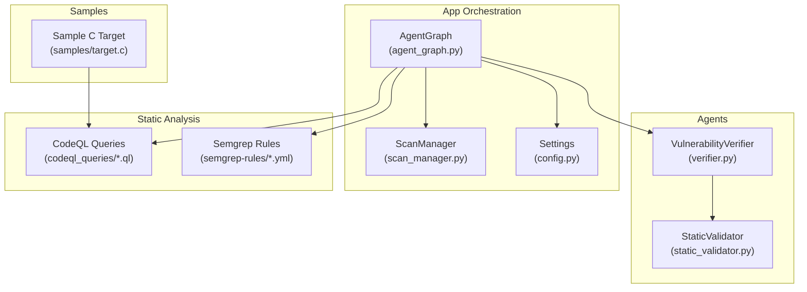
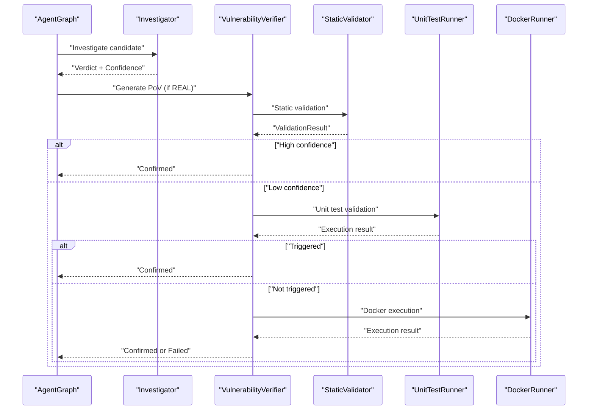
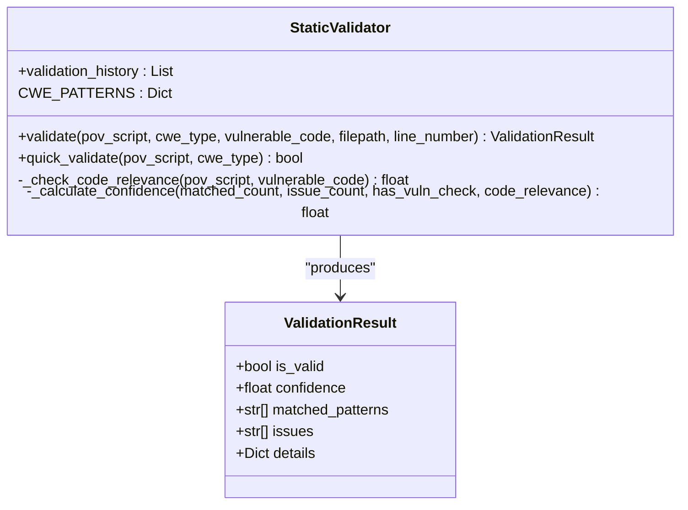
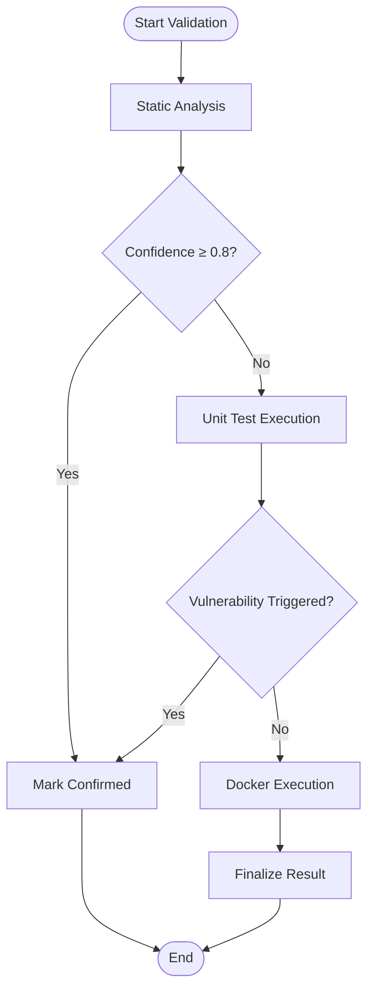
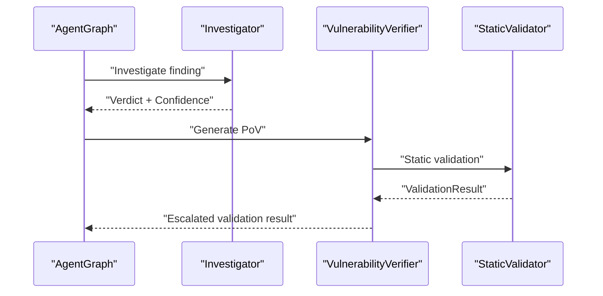
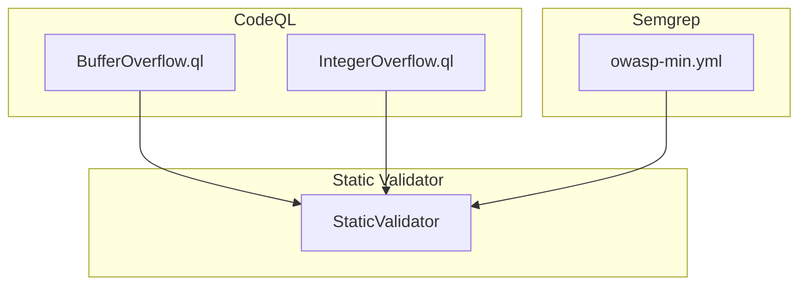
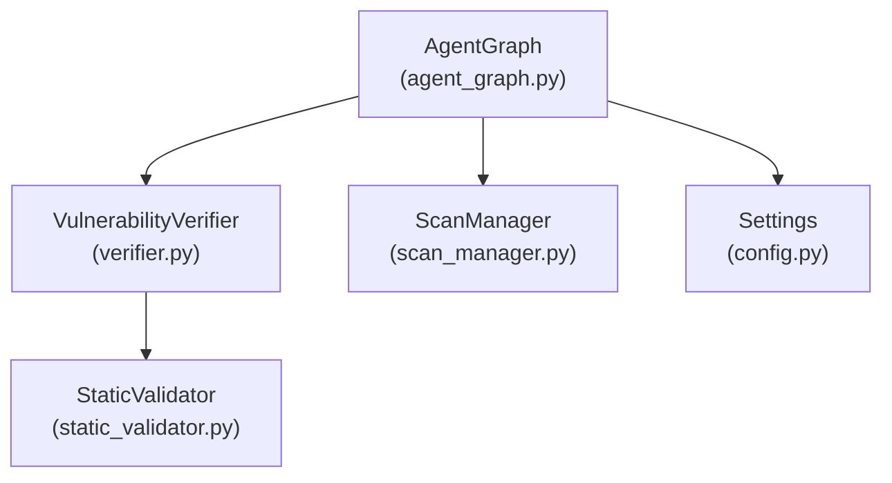
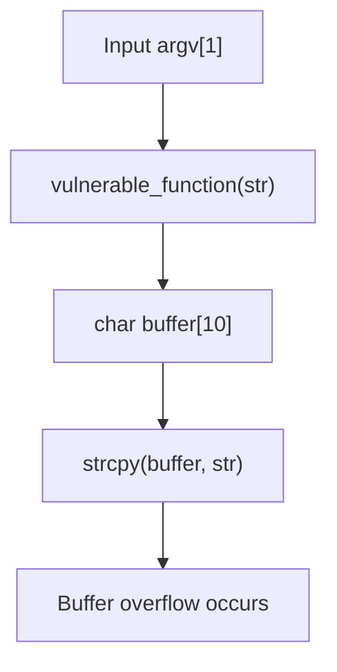

# Static Validator Agent

<cite>
**Referenced Files in This Document**
- [static_validator.py](file://agents/static_validator.py)
- [verifier.py](file://agents/verifier.py)
- [agent_graph.py](file://app/agent_graph.py)
- [scan_manager.py](file://app/scan_manager.py)
- [config.py](file://app/config.py)
- [BufferOverflow.ql](file://codeql_queries/BufferOverflow.ql)
- [IntegerOverflow.ql](file://codeql_queries/IntegerOverflow.ql)
- [owasp-min.yml](file://semgrep-rules/owasp-min.yml)
- [target.c](file://samples/target.c)
- [README.md](file://README.md)
</cite>

## Table of Contents
1. [Introduction](#introduction)
2. [Project Structure](#project-structure)
3. [Core Components](#core-components)
4. [Architecture Overview](#architecture-overview)
5. [Detailed Component Analysis](#detailed-component-analysis)
6. [Dependency Analysis](#dependency-analysis)
7. [Performance Considerations](#performance-considerations)
8. [Troubleshooting Guide](#troubleshooting-guide)
9. [Conclusion](#conclusion)
10. [Appendices](#appendices)

## Introduction
The Static Validator Agent is a core component of the AutoPoV autonomous vulnerability research platform. It performs static analysis validation of Proof-of-Vulnerability (PoV) scripts without requiring execution, enabling rapid triage and filtering of potentially exploitable findings. The agent integrates with AutoPoV’s broader ecosystem to support the agentic workflow that combines static analysis (CodeQL), LLM-powered investigation, PoV generation, and hybrid validation strategies.

Key responsibilities:
- Validate PoV scripts using static analysis patterns aligned with specific CWE categories
- Provide confidence scores and actionable feedback for PoV quality
- Support the escalation path in the validation pipeline (static → unit test → Docker)
- Enforce safe, deterministic PoV construction guidelines

## Project Structure
The Static Validator Agent resides within the agents package and collaborates with other agents and orchestration components in the app package. It participates in the LangGraph-based agent graph that orchestrates vulnerability detection and exploitation.

**Diagram sources**
- [static_validator.py:1-305](file://agents/static_validator.py#L1-L305)
- [verifier.py:1-562](file://agents/verifier.py#L1-L562)
- [agent_graph.py:1-800](file://app/agent_graph.py#L1-L800)
- [scan_manager.py:1-663](file://app/scan_manager.py#L1-L663)
- [config.py:1-255](file://app/config.py#L1-L255)
- [BufferOverflow.ql:1-59](file://codeql_queries/BufferOverflow.ql#L1-L59)
- [IntegerOverflow.ql:1-62](file://codeql_queries/IntegerOverflow.ql#L1-L62)
- [owasp-min.yml:1-53](file://semgrep-rules/owasp-min.yml#L1-L53)
- [target.c:1-16](file://samples/target.c#L1-L16)

**Section sources**
- [README.md:128-124](file://README.md#L128-L124)

## Core Components
- StaticValidator: Implements static analysis validation for PoV scripts, including pattern matching, confidence scoring, and relevance assessment.
- VulnerabilityVerifier: Orchestrates PoV generation and validation, integrating static validation as the first step in a multi-stage validation pipeline.
- AgentGraph: Defines the agentic workflow and integrates static validation into the broader vulnerability detection pipeline.
- ScanManager: Manages scan lifecycle and persists results, including validation outcomes.
- Configuration: Provides environment-driven settings for static analysis tool availability and paths.

**Section sources**
- [static_validator.py:22-305](file://agents/static_validator.py#L22-L305)
- [verifier.py:225-388](file://agents/verifier.py#L225-L388)
- [agent_graph.py:241-307](file://app/agent_graph.py#L241-L307)
- [scan_manager.py:47-663](file://app/scan_manager.py#L47-L663)
- [config.py:86-211](file://app/config.py#L86-L211)

## Architecture Overview
The Static Validator Agent operates within the validation phase of the AutoPoV workflow. It is invoked by the VulnerabilityVerifier as part of a hybrid validation strategy that escalates from static analysis to unit testing and finally to Docker execution when necessary.

**Diagram sources**
- [agent_graph.py:691-777](file://app/agent_graph.py#L691-L777)
- [verifier.py:225-388](file://agents/verifier.py#L225-L388)
- [static_validator.py:123-233](file://agents/static_validator.py#L123-L233)

## Detailed Component Analysis

### StaticValidator: Static Analysis Engine
The StaticValidator performs pattern-based validation of PoV scripts tailored to specific CWE categories. It evaluates:
- Presence of required imports for the target CWE
- Attack patterns matching known exploit signatures
- Payload indicators indicating intent
- Relevance to the vulnerable code under test
- Confidence calculation based on matched patterns and issues

**Diagram sources**
- [static_validator.py:22-305](file://agents/static_validator.py#L22-L305)

Key behaviors:
- Pattern Matching: Uses regular expressions and keyword matching to detect attack patterns and payload indicators for each CWE.
- Relevance Scoring: Compares PoV content with the vulnerable code to assess alignment.
- Confidence Calculation: Balances positive matches, vulnerability indicators, code relevance, and negative issues to compute a normalized confidence score.
- Validation History: Maintains a record of previous validations for auditing and analysis.

Supported CWE categories and patterns:
- SQL Injection (CWE-89): Validates SQL-related payloads and authentication bypass attempts.
- Cross-Site Scripting (CWE-79): Checks for script injection and event handlers.
- Code Injection (CWE-94): Looks for dynamic code execution patterns.
- Path Traversal (CWE-22): Identifies directory traversal attempts.
- Command Injection (CWE-78): Detects shell command injection patterns.
- Deserialization (CWE-502): Recognizes unsafe deserialization triggers.
- Hardcoded Credentials (CWE-798): Flags credential exposure patterns.

Validation thresholds:
- A PoV is considered valid if it includes a vulnerability trigger indicator, demonstrates sufficient matched patterns, and achieves a minimum confidence threshold.

**Section sources**
- [static_validator.py:26-118](file://agents/static_validator.py#L26-L118)
- [static_validator.py:123-233](file://agents/static_validator.py#L123-L233)
- [static_validator.py:235-284](file://agents/static_validator.py#L235-L284)

### VulnerabilityVerifier: Validation Pipeline Coordinator
The VulnerabilityVerifier coordinates PoV validation across multiple stages:
1. Static Analysis: Calls StaticValidator to quickly filter invalid or low-quality PoVs.
2. Unit Test Execution: Executes PoVs against the vulnerable function in a controlled environment when available.
3. LLM Validation: Uses LLM prompts to analyze PoVs when static/unit tests are inconclusive.

**Diagram sources**
- [verifier.py:225-388](file://agents/verifier.py#L225-L388)

Validation criteria enforced:
- Must contain “VULNERABILITY TRIGGERED” indicator.
- Uses only standard library imports.
- Includes error handling and deterministic logic.
- CWE-specific checks for correctness.

**Section sources**
- [verifier.py:225-388](file://agents/verifier.py#L225-L388)

### AgentGraph Integration
The Static Validator Agent is integrated into the agent graph’s validation node. The graph orchestrates the investigation-to-validation pipeline and ensures static validation is performed consistently across findings.

**Diagram sources**
- [agent_graph.py:779-800](file://app/agent_graph.py#L779-L800)
- [verifier.py:225-388](file://agents/verifier.py#L225-L388)
- [static_validator.py:123-233](file://agents/static_validator.py#L123-L233)

**Section sources**
- [agent_graph.py:779-800](file://app/agent_graph.py#L779-L800)

### Static Analysis Configuration and Tooling
Static analysis in AutoPoV leverages multiple complementary approaches:
- CodeQL: Automated discovery and SARIF-based reporting for multiple CWEs.
- Custom CodeQL Queries: Targeted queries for buffer overflows and integer overflows.
- Semgrep: Lightweight, rule-based scanning aligned with OWASP Top 10.

**Diagram sources**
- [BufferOverflow.ql:1-59](file://codeql_queries/BufferOverflow.ql#L1-L59)
- [IntegerOverflow.ql:1-62](file://codeql_queries/IntegerOverflow.ql#L1-L62)
- [owasp-min.yml:1-53](file://semgrep-rules/owasp-min.yml#L1-L53)
- [static_validator.py:26-118](file://agents/static_validator.py#L26-L118)

**Section sources**
- [BufferOverflow.ql:1-59](file://codeql_queries/BufferOverflow.ql#L1-L59)
- [IntegerOverflow.ql:1-62](file://codeql_queries/IntegerOverflow.ql#L1-L62)
- [owasp-min.yml:1-53](file://semgrep-rules/owasp-min.yml#L1-L53)

### Output Processing and Interpretation
Validation results are structured to inform downstream decisions:
- is_valid: Overall validity of the PoV.
- confidence: Normalized score derived from matched patterns and issues.
- matched_patterns: Indicators that support the PoV’s intent.
- issues: Specific problems identified by static analysis.
- details: Metadata including CWE type, file path, line number, and relevance score.

These results guide the agent graph to either confirm findings or escalate to unit testing and Docker execution.

**Section sources**
- [static_validator.py:13-20](file://agents/static_validator.py#L13-L20)
- [static_validator.py:144-233](file://agents/static_validator.py#L144-L233)

## Dependency Analysis
The Static Validator Agent interacts with several components across the AutoPoV ecosystem:

**Diagram sources**
- [static_validator.py:298-305](file://agents/static_validator.py#L298-L305)
- [verifier.py:225-388](file://agents/verifier.py#L225-L388)
- [agent_graph.py:241-307](file://app/agent_graph.py#L241-L307)
- [scan_manager.py:47-663](file://app/scan_manager.py#L47-L663)
- [config.py:86-211](file://app/config.py#L86-L211)

Coupling and cohesion:
- StaticValidator is cohesive around static analysis concerns and has minimal external dependencies.
- VulnerabilityVerifier depends on StaticValidator and integrates with unit testing and Docker execution.
- AgentGraph orchestrates the validation flow and delegates to verifier and validator.

Potential circular dependencies:
- None observed among the analyzed components.

External dependencies and integration points:
- CodeQL CLI availability and query paths are managed via configuration.
- Docker availability influences validation escalation to containerized execution.

**Section sources**
- [config.py:86-211](file://app/config.py#L86-L211)
- [scan_manager.py:47-663](file://app/scan_manager.py#L47-L663)

## Performance Considerations
Optimization techniques for static analysis and validation:
- Early Filtering: Static validation provides rapid rejection of invalid PoVs, reducing downstream costs.
- Confidence Thresholds: Using higher thresholds (e.g., 0.8) minimizes unnecessary unit test and Docker executions.
- Pattern Efficiency: Regular expressions and keyword matching are lightweight; avoid overly broad patterns to reduce false positives.
- Relevance Scoring: Code relevance helps prioritize PoVs that directly address the vulnerable code, improving signal-to-noise.
- Caching Strategies:
  - Validation history can be persisted to enable trend analysis and reduce repeated validations for identical PoVs.
  - CodeQL database creation and query execution can be cached per scan session to avoid redundant work.
- Cost Control: Leverage configuration settings to cap costs and control model usage.

[No sources needed since this section provides general guidance]

## Troubleshooting Guide
Common static analysis challenges and solutions:
- Missing “VULNERABILITY TRIGGERED”: Ensure PoVs include the required print statement to indicate successful triggering.
- Non-standard Library Imports: Restrict PoVs to standard library modules to maintain safety and determinism.
- Low Confidence Scores: Improve PoV specificity and include CWE-relevant patterns and payload indicators.
- CWE Mismatch: Align PoV logic with the target CWE category to increase relevance and confidence.
- Regex Errors: StaticValidator handles regex errors gracefully; review patterns for correctness.
- Code Relevance Issues: Ensure PoVs directly exercise the vulnerable function or code path.

Operational tips:
- Use the validation history to track recurring issues and refine PoV templates.
- Validate PoVs locally using unit tests before relying on Docker execution.
- Monitor logs from the agent graph and scan manager for detailed insights into validation failures.

**Section sources**
- [static_validator.py:167-172](file://agents/static_validator.py#L167-L172)
- [static_validator.py:184-188](file://agents/static_validator.py#L184-L188)
- [verifier.py:336-340](file://agents/verifier.py#L336-L340)

## Conclusion
The Static Validator Agent is a critical component of AutoPoV’s hybrid validation strategy. By combining pattern-based static analysis with confidence scoring and relevance assessment, it accelerates the identification of high-quality PoVs while minimizing unnecessary computational overhead. Its integration with the broader agent graph, verifier, and orchestration layers ensures seamless escalation and decision-making across the vulnerability detection pipeline.

[No sources needed since this section summarizes without analyzing specific files]

## Appendices

### Appendix A: Supported CWE Categories and Patterns
- CWE-89 (SQL Injection): Validates SQL-related payloads and authentication bypass attempts.
- CWE-79 (XSS): Checks for script injection and event handlers.
- CWE-94 (Code Injection): Looks for dynamic code execution patterns.
- CWE-22 (Path Traversal): Identifies directory traversal attempts.
- CWE-78 (Command Injection): Detects shell command injection patterns.
- CWE-502 (Deserialization): Recognizes unsafe deserialization triggers.
- CWE-798 (Hardcoded Credentials): Flags credential exposure patterns.

**Section sources**
- [static_validator.py:26-118](file://agents/static_validator.py#L26-L118)

### Appendix B: Sample Vulnerable Code for Testing
The sample C target demonstrates a classic buffer overflow scenario suitable for testing static analysis and PoV generation.

**Diagram sources**
- [target.c:4-8](file://samples/target.c#L4-L8)

**Section sources**
- [target.c:1-16](file://samples/target.c#L1-L16)