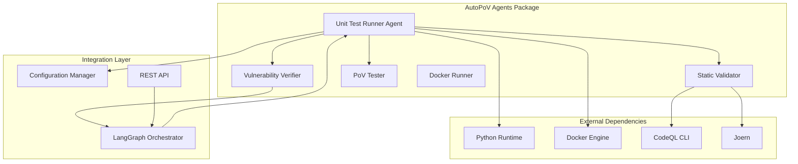
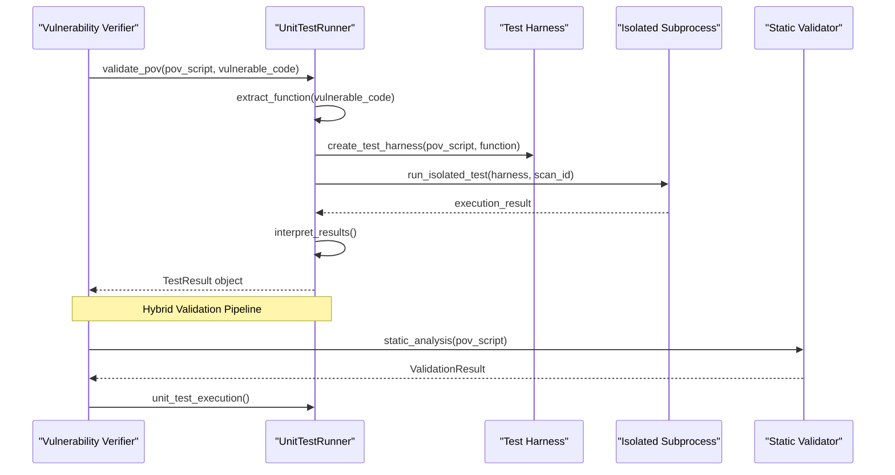
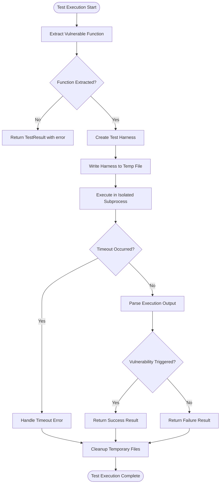
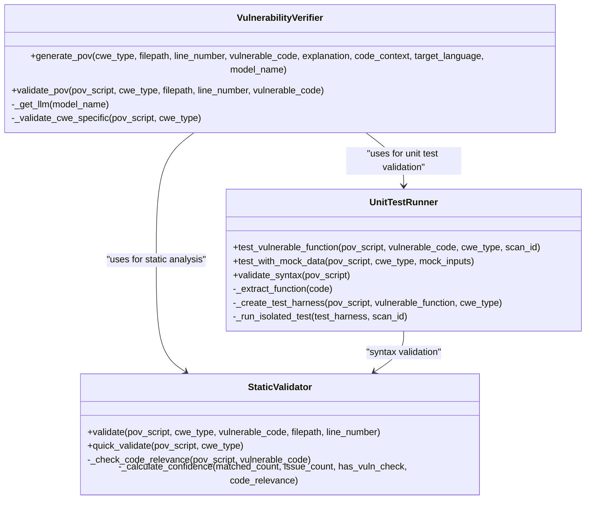
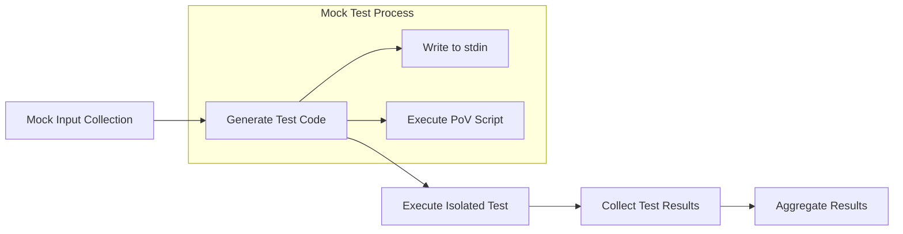
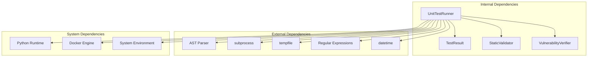

# Unit Test Runner Agent

<cite>
**Referenced Files in This Document**
- [unit_test_runner.py](file://agents/unit_test_runner.py)
- [verifier.py](file://agents/verifier.py)
- [static_validator.py](file://agents/static_validator.py)
- [pov_tester.py](file://agents/pov_tester.py)
- [config.py](file://app/config.py)
- [test_agent.py](file://tests/test_agent.py)
- [README.md](file://README.md)
- [main.py](file://app/main.py)
</cite>

## Table of Contents
1. [Introduction](#introduction)
2. [Project Structure](#project-structure)
3. [Core Components](#core-components)
4. [Architecture Overview](#architecture-overview)
5. [Detailed Component Analysis](#detailed-component-analysis)
6. [Dependency Analysis](#dependency-analysis)
7. [Performance Considerations](#performance-considerations)
8. [Troubleshooting Guide](#troubleshooting-guide)
9. [Conclusion](#conclusion)

## Introduction
The Unit Test Runner Agent is a specialized component within the AutoPoV autonomous vulnerability research platform. Its primary responsibility is to validate Proof-of-Vulnerability (PoV) scripts by executing them against isolated vulnerable code snippets in a controlled, secure environment. The agent performs unit-style validation that serves as a crucial intermediate step in AutoPoV's hybrid validation pipeline, bridging static analysis and full containerized execution.

The agent operates as part of a multi-agent system orchestrated by LangGraph, where each agent node performs autonomous reasoning and action. The Unit Test Runner Agent specifically focuses on rapid, isolated execution validation that can quickly determine if a PoV script would trigger a vulnerability when executed against the identified vulnerable code.

## Project Structure
The Unit Test Runner Agent resides within the agents package alongside other specialized agents in the AutoPoV ecosystem. The agent integrates with several key components:

**Diagram sources**
- [unit_test_runner.py:1-344](file://agents/unit_test_runner.py#L1-L344)
- [verifier.py:1-562](file://agents/verifier.py#L1-L562)
- [config.py:1-255](file://app/config.py#L1-L255)

**Section sources**
- [README.md:19-31](file://README.md#L19-L31)
- [README.md:34-69](file://README.md#L34-L69)

## Core Components
The Unit Test Runner Agent consists of several key components that work together to provide comprehensive validation capabilities:

### TestResult Data Structure
The agent uses a structured TestResult dataclass to standardize validation outcomes across all execution methods. This structure captures both success indicators and detailed execution metadata.

### UnitTestRunner Class
The central orchestrator that manages the complete validation workflow, from code extraction to result interpretation and history tracking.

### Test Harness Generation
The agent creates isolated execution environments that combine vulnerable code with PoV scripts while maintaining security boundaries and resource limitations.

**Section sources**
- [unit_test_runner.py:16-28](file://agents/unit_test_runner.py#L16-L28)
- [unit_test_runner.py:28-33](file://agents/unit_test_runner.py#L28-L33)

## Architecture Overview
The Unit Test Runner Agent participates in AutoPoV's multi-agent architecture as part of the validation pipeline:

**Diagram sources**
- [verifier.py:225-387](file://agents/verifier.py#L225-L387)
- [unit_test_runner.py:34-117](file://agents/unit_test_runner.py#L34-L117)

The architecture demonstrates a sophisticated three-tier validation approach where the Unit Test Runner Agent serves as the bridge between static analysis and full containerized execution, providing rapid feedback for PoV script validation.

## Detailed Component Analysis

### UnitTestRunner Implementation
The UnitTestRunner class implements the core validation logic through several specialized methods:

#### Function Extraction and Validation
The agent begins by extracting the vulnerable function from the provided code snippet using pattern matching and regular expressions. This ensures that only the relevant vulnerable code is executed in isolation.

#### Test Harness Creation
The agent generates a secure test harness that:
- Isolates the execution environment
- Provides necessary context variables
- Captures stdout/stderr output
- Implements proper error handling
- Validates vulnerability triggers

#### Isolated Execution Management
The agent executes PoV scripts in isolated subprocesses with strict resource limitations and security controls.

**Diagram sources**
- [unit_test_runner.py:118-144](file://agents/unit_test_runner.py#L118-L144)
- [unit_test_runner.py:236-287](file://agents/unit_test_runner.py#L236-L287)

**Section sources**
- [unit_test_runner.py:34-117](file://agents/unit_test_runner.py#L34-L117)
- [unit_test_runner.py:118-144](file://agents/unit_test_runner.py#L118-L144)
- [unit_test_runner.py:145-235](file://agents/unit_test_runner.py#L145-L235)

### TestResult Structure and Interpretation
The TestResult dataclass provides a standardized interface for capturing validation outcomes:

| Field | Type | Description |
|-------|------|-------------|
| success | bool | Indicates if the test executed successfully |
| vulnerability_triggered | bool | Whether the PoV script triggered vulnerability detection |
| execution_time_s | float | Total execution time in seconds |
| stdout | str | Standard output from test execution |
| stderr | str | Error output from test execution |
| exit_code | int | Process exit code |
| details | Dict[str, Any] | Additional metadata about the test |

The agent interprets execution results by checking for the presence of "VULNERABILITY TRIGGERED" in stdout output and evaluating the exit code status.

**Section sources**
- [unit_test_runner.py:16-26](file://agents/unit_test_runner.py#L16-L26)
- [unit_test_runner.py:84-104](file://agents/unit_test_runner.py#L84-L104)

### Integration with Validation Pipeline
The Unit Test Runner Agent integrates seamlessly with AutoPoV's hybrid validation approach:

**Diagram sources**
- [verifier.py:42-562](file://agents/verifier.py#L42-L562)
- [unit_test_runner.py:28-344](file://agents/unit_test_runner.py#L28-L344)
- [static_validator.py:22-305](file://agents/static_validator.py#L22-L305)

**Section sources**
- [verifier.py:225-387](file://agents/verifier.py#L225-L387)
- [static_validator.py:123-234](file://agents/static_validator.py#L123-L234)

### Mock Data Testing Capabilities
The agent supports mock data testing for scenarios where real vulnerable code is not available:

**Diagram sources**
- [unit_test_runner.py:288-318](file://agents/unit_test_runner.py#L288-L318)

**Section sources**
- [unit_test_runner.py:288-318](file://agents/unit_test_runner.py#L288-L318)

## Dependency Analysis
The Unit Test Runner Agent has well-defined dependencies that support its validation functionality:

**Diagram sources**
- [unit_test_runner.py:6-13](file://agents/unit_test_runner.py#L6-L13)
- [verifier.py:27-34](file://agents/verifier.py#L27-L34)

The agent maintains loose coupling with external systems while providing strong internal cohesion through its focused validation responsibilities.

**Section sources**
- [unit_test_runner.py:6-13](file://agents/unit_test_runner.py#L6-L13)
- [verifier.py:27-34](file://agents/verifier.py#L27-L34)

## Performance Considerations
The Unit Test Runner Agent implements several performance optimization strategies:

### Execution Time Management
- **30-second timeout limit** prevents hanging executions
- **Resource isolation** ensures predictable performance
- **Process cleanup** prevents resource leaks

### Memory and Security Controls
- **Restricted environment variables** limit system access
- **Limited PATH** reduces potential attack surface
- **Temporary file management** prevents persistent storage

### Scalability Features
- **Parallel execution capability** through separate subprocess instances
- **Result caching** through test_history tracking
- **Modular design** allows for easy scaling

**Section sources**
- [unit_test_runner.py:249-256](file://agents/unit_test_runner.py#L249-L256)
- [unit_test_runner.py:32-33](file://agents/unit_test_runner.py#L32-L33)

## Troubleshooting Guide

### Common Execution Issues
1. **Timeout Errors**: Occur when PoV scripts exceed the 30-second execution limit
2. **Syntax Errors**: Detected through AST parsing validation
3. **Function Extraction Failures**: Happen when vulnerable code format is not recognized
4. **Environment Restrictions**: Limited PATH and PYTHONPATH can prevent imports

### Debugging Strategies
The agent provides comprehensive logging through stdout/stderr capture and structured error reporting. Test results include detailed metadata that helps identify the root cause of failures.

### Configuration Options
The agent respects system-wide configuration settings for:
- **Execution timeouts** (hardcoded 30 seconds)
- **Security restrictions** (PATH and PYTHONPATH limits)
- **Resource limits** (memory and CPU constraints)

**Section sources**
- [unit_test_runner.py:266-281](file://agents/unit_test_runner.py#L266-L281)
- [unit_test_runner.py:320-334](file://agents/unit_test_runner.py#L320-L334)

## Conclusion
The Unit Test Runner Agent represents a sophisticated implementation of automated PoV validation within the AutoPoV ecosystem. Its design emphasizes security, reliability, and performance while providing comprehensive validation capabilities through multiple execution methods.

The agent's integration with AutoPoV's hybrid validation pipeline ensures that PoV scripts receive appropriate scrutiny through static analysis, unit testing, and containerized execution. This multi-layered approach maximizes the likelihood of identifying valid vulnerabilities while minimizing false positives.

Key strengths of the implementation include:
- **Secure execution environment** with strict resource limitations
- **Comprehensive error handling** and result interpretation
- **Flexible validation methods** supporting both real and mock scenarios
- **Integration with broader validation pipeline** ensuring consistent quality standards

The agent's modular design and clear separation of concerns make it maintainable and extensible, supporting future enhancements to the AutoPoV validation capabilities.