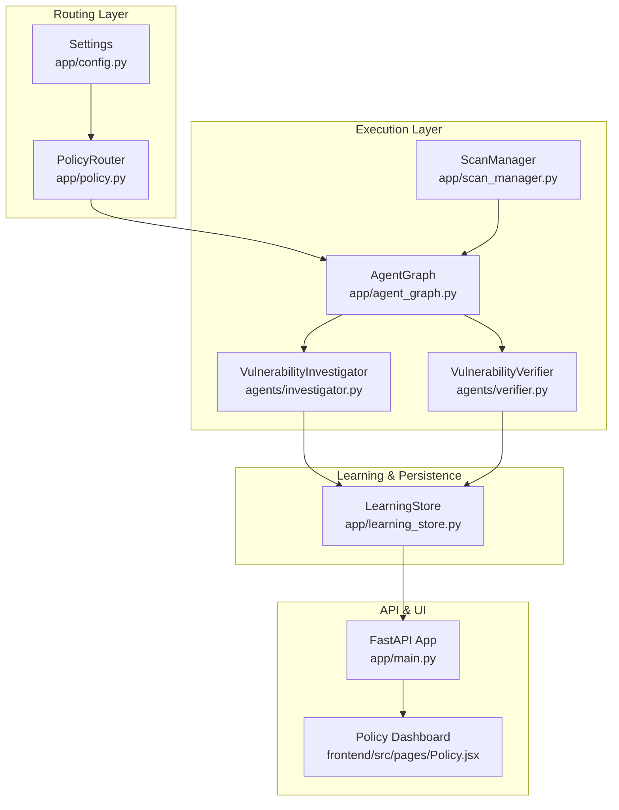
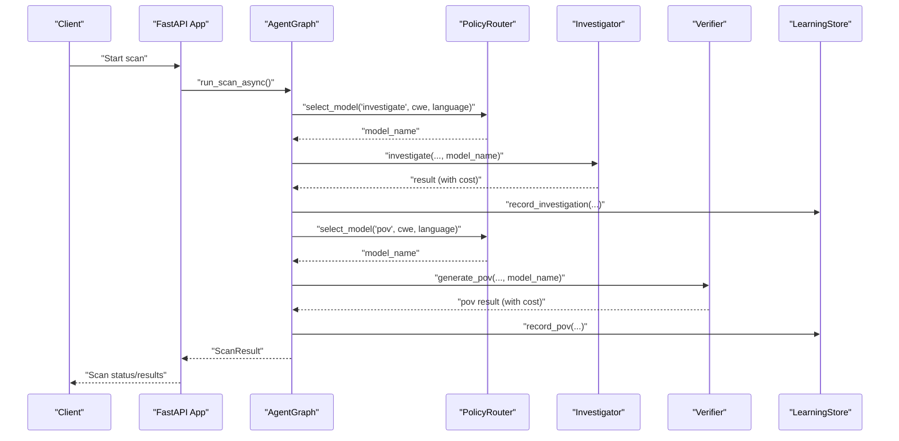
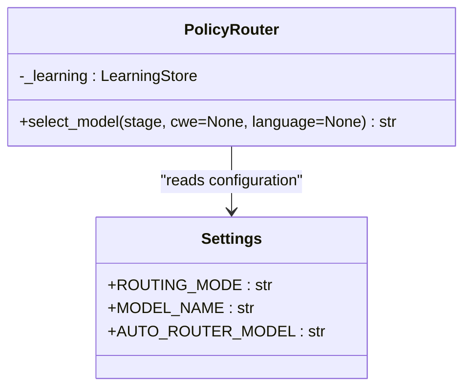
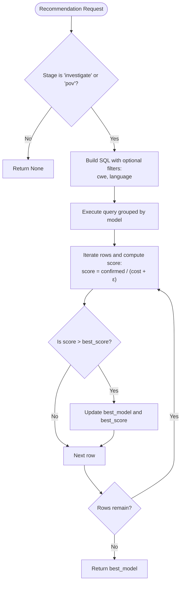
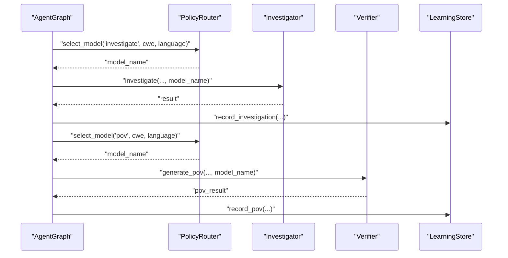
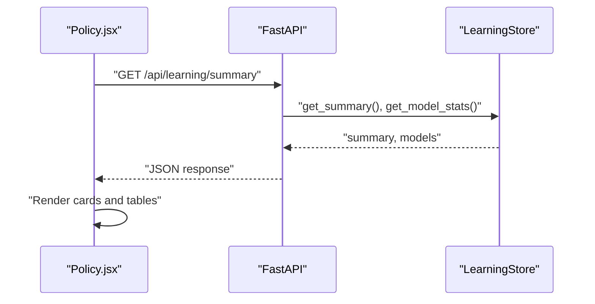
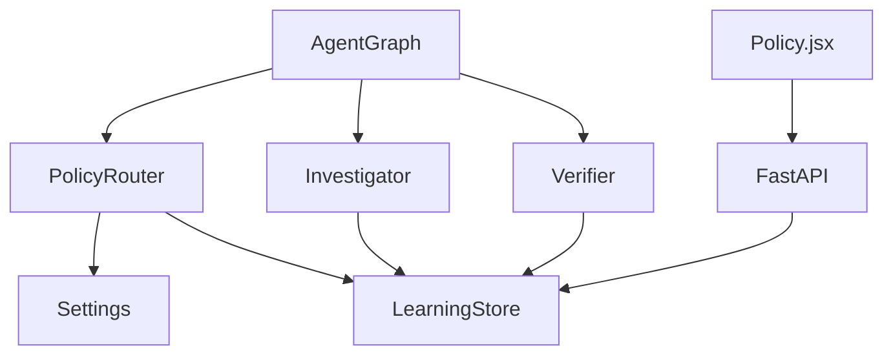

# Adaptive Policy Routing

<cite>
**Referenced Files in This Document**
- [policy.py](file://app/policy.py)
- [learning_store.py](file://app/learning_store.py)
- [config.py](file://app/config.py)
- [agent_graph.py](file://app/agent_graph.py)
- [scan_manager.py](file://app/scan_manager.py)
- [main.py](file://app/main.py)
- [investigator.py](file://agents/investigator.py)
- [verifier.py](file://agents/verifier.py)
- [Policy.jsx](file://frontend/src/pages/Policy.jsx)
</cite>

## Table of Contents
1. [Introduction](#introduction)
2. [Project Structure](#project-structure)
3. [Core Components](#core-components)
4. [Architecture Overview](#architecture-overview)
5. [Detailed Component Analysis](#detailed-component-analysis)
6. [Dependency Analysis](#dependency-analysis)
7. [Performance Considerations](#performance-considerations)
8. [Troubleshooting Guide](#troubleshooting-guide)
9. [Conclusion](#conclusion)

## Introduction
This document explains AutoPoV's adaptive model routing system, focusing on the policy-based model selection algorithm, performance tracking integration, automatic routing decisions, and learning store integration. It covers fixed versus automatic routing modes, model availability detection, fallback mechanisms, configuration strategies, monitoring dashboards, and continuous improvement workflows including A/B testing and model comparison.

## Project Structure
The adaptive routing system spans several modules:
- Policy routing logic and configuration
- Learning store for performance metrics and recommendations
- Agent graph orchestrating scan stages and model selection
- Frontend dashboard for policy monitoring

**Diagram sources**
- [policy.py:12-39](file://app/policy.py#L12-L39)
- [learning_store.py:14-256](file://app/learning_store.py#L14-L256)
- [config.py:13-255](file://app/config.py#L13-L255)
- [agent_graph.py:691-777](file://app/agent_graph.py#L691-L777)
- [scan_manager.py:234-366](file://app/scan_manager.py#L234-L366)
- [investigator.py:270-433](file://agents/investigator.py#L270-L433)
- [verifier.py:90-224](file://agents/verifier.py#L90-L224)
- [main.py:745-751](file://app/main.py#L745-L751)
- [Policy.jsx:1-111](file://frontend/src/pages/Policy.jsx#L1-111)

**Section sources**
- [policy.py:12-39](file://app/policy.py#L12-L39)
- [learning_store.py:14-256](file://app/learning_store.py#L14-L256)
- [config.py:13-255](file://app/config.py#L13-L255)
- [agent_graph.py:691-777](file://app/agent_graph.py#L691-L777)
- [scan_manager.py:234-366](file://app/scan_manager.py#L234-L366)
- [investigator.py:270-433](file://agents/investigator.py#L270-L433)
- [verifier.py:90-224](file://agents/verifier.py#L90-L224)
- [main.py:745-751](file://app/main.py#L745-L751)
- [Policy.jsx:1-111](file://frontend/src/pages/Policy.jsx#L1-111)

## Core Components
- PolicyRouter: Selects models per stage based on routing mode and learning signals.
- LearningStore: Persists scan outcomes and computes model recommendations.
- Settings: Centralized configuration for routing modes, models, and providers.
- AgentGraph: Integrates policy decisions into the vulnerability detection workflow.
- Investigator and Verifier: Record costs and outcomes for learning store integration.
- Frontend Policy Dashboard: Visualizes learning summaries and model statistics.

**Section sources**
- [policy.py:12-39](file://app/policy.py#L12-L39)
- [learning_store.py:14-256](file://app/learning_store.py#L14-L256)
- [config.py:13-255](file://app/config.py#L13-L255)
- [agent_graph.py:691-777](file://app/agent_graph.py#L691-L777)
- [investigator.py:270-433](file://agents/investigator.py#L270-L433)
- [verifier.py:90-224](file://agents/verifier.py#L90-L224)
- [Policy.jsx:1-111](file://frontend/src/pages/Policy.jsx#L1-111)

## Architecture Overview
The adaptive routing system operates as follows:
- Configuration defines routing mode (fixed, learning, auto) and model names.
- At runtime, PolicyRouter selects a model per stage using the configured mode.
- LearningStore aggregates outcomes (investigations and PoV runs) to compute recommendations.
- AgentGraph invokes PolicyRouter during investigation and PoV generation stages.
- Investigator and Verifier record costs and outcomes into LearningStore.
- Frontend consumes LearningStore metrics via API endpoints for monitoring.

**Diagram sources**
- [agent_graph.py:691-777](file://app/agent_graph.py#L691-L777)
- [policy.py:18-32](file://app/policy.py#L18-L32)
- [investigator.py:270-433](file://agents/investigator.py#L270-L433)
- [verifier.py:90-224](file://agents/verifier.py#L90-L224)
- [learning_store.py:61-124](file://app/learning_store.py#L61-L124)
- [main.py:745-751](file://app/main.py#L745-L751)

## Detailed Component Analysis

### PolicyRouter: Policy-Based Model Selection
PolicyRouter encapsulates the routing logic:
- Fixed mode: Always returns the configured model name.
- Learning mode: Queries LearningStore for a recommendation filtered by stage, optional CWE, and language; falls back to auto router model if none found.
- Auto mode: Returns the auto router model.

**Diagram sources**
- [policy.py:12-39](file://app/policy.py#L12-L39)
- [config.py:42-44](file://app/config.py#L42-L44)

**Section sources**
- [policy.py:12-39](file://app/policy.py#L12-L39)
- [config.py:42-44](file://app/config.py#L42-L44)

### LearningStore: Performance Tracking and Recommendations
LearningStore persists:
- Investigation outcomes with verdict, confidence, model, cost, and metadata.
- PoV runs with success flag, validation method, and cost.

It exposes:
- Aggregated summaries and model statistics.
- Recommendation engine that selects the best model per stage using a confirmed-per-cost score, optionally filtered by CWE and language.

**Diagram sources**
- [learning_store.py:188-248](file://app/learning_store.py#L188-L248)

**Section sources**
- [learning_store.py:14-256](file://app/learning_store.py#L14-L256)

### AgentGraph Integration: Automatic Routing Decisions
AgentGraph integrates PolicyRouter at two key points:
- During investigation: selects model for LLM-based vulnerability assessment.
- During PoV generation: selects model for PoV script generation.

It records outcomes into LearningStore and tracks total cost across findings.

**Diagram sources**
- [agent_graph.py:708-777](file://app/agent_graph.py#L708-L777)
- [investigator.py:270-433](file://agents/investigator.py#L270-L433)
- [verifier.py:90-224](file://agents/verifier.py#L90-L224)
- [learning_store.py:61-124](file://app/learning_store.py#L61-L124)

**Section sources**
- [agent_graph.py:708-777](file://app/agent_graph.py#L708-L777)
- [investigator.py:270-433](file://agents/investigator.py#L270-L433)
- [verifier.py:90-224](file://agents/verifier.py#L90-L224)
- [learning_store.py:61-124](file://app/learning_store.py#L61-L124)

### Frontend Policy Dashboard: Monitoring and Insights
The Policy page fetches learning summaries and model statistics from the backend and displays:
- Summary metrics (counts and costs).
- Model performance tables for investigation and PoV stages.

**Diagram sources**
- [Policy.jsx:1-111](file://frontend/src/pages/Policy.jsx#L1-111)
- [main.py:745-751](file://app/main.py#L745-L751)
- [learning_store.py:126-186](file://app/learning_store.py#L126-L186)

**Section sources**
- [Policy.jsx:1-111](file://frontend/src/pages/Policy.jsx#L1-111)
- [main.py:745-751](file://app/main.py#L745-L751)
- [learning_store.py:126-186](file://app/learning_store.py#L126-L186)

### Configuration and Modes
Routing modes and model availability:
- Fixed mode: ROUTING_MODE="fixed" with MODEL_NAME as the sole selector.
- Learning mode: ROUTING_MODE="learning" with recommendations from LearningStore; falls back to AUTO_ROUTER_MODEL when no signal.
- Auto mode: ROUTING_MODE defaults to "auto" and uses AUTO_ROUTER_MODEL.

Provider configuration supports online (OpenRouter) and offline (Ollama) models.

**Section sources**
- [config.py:42-44](file://app/config.py#L42-L44)
- [config.py:37-44](file://app/config.py#L37-L44)
- [config.py:212-231](file://app/config.py#L212-L231)

### Cost Tracking and Outcome Recording
Investigator and Verifier extract token usage from LLM responses to compute actual costs, which are recorded in LearningStore alongside findings and PoV runs. AgentGraph aggregates total cost across findings and persists results.

**Section sources**
- [investigator.py:334-472](file://agents/investigator.py#L334-L472)
- [verifier.py:147-224](file://agents/verifier.py#L147-L224)
- [agent_graph.py:746-777](file://app/agent_graph.py#L746-L777)
- [scan_manager.py:309-366](file://app/scan_manager.py#L309-L366)

### A/B Testing and Continuous Improvement
- A/B testing: Use replay scans to compare multiple models on the same findings. The replay endpoint creates new scans with specified models and limited findings.
- Model comparison: Use the Policy dashboard to compare confirm rates and success rates across models.
- Continuous improvement: As LearningStore accumulates outcomes, recommendations improve automatically in learning mode.

**Section sources**
- [main.py:404-491](file://app/main.py#L404-L491)
- [Policy.jsx:104-105](file://frontend/src/pages/Policy.jsx#L104-L105)
- [learning_store.py:142-186](file://app/learning_store.py#L142-L186)

## Dependency Analysis
The routing system exhibits clear separation of concerns:
- PolicyRouter depends on Settings and LearningStore.
- AgentGraph depends on PolicyRouter and integrates with Investigator/Verifier.
- Investigator/Verifier depend on Settings for provider configuration and record outcomes to LearningStore.
- Frontend depends on API endpoints backed by LearningStore.

**Diagram sources**
- [policy.py:12-39](file://app/policy.py#L12-L39)
- [config.py:13-255](file://app/config.py#L13-L255)
- [learning_store.py:14-256](file://app/learning_store.py#L14-L256)
- [agent_graph.py:691-777](file://app/agent_graph.py#L691-L777)
- [investigator.py:270-433](file://agents/investigator.py#L270-L433)
- [verifier.py:90-224](file://agents/verifier.py#L90-L224)
- [main.py:745-751](file://app/main.py#L745-L751)
- [Policy.jsx:1-111](file://frontend/src/pages/Policy.jsx#L1-111)

**Section sources**
- [policy.py:12-39](file://app/policy.py#L12-L39)
- [learning_store.py:14-256](file://app/learning_store.py#L14-L256)
- [agent_graph.py:691-777](file://app/agent_graph.py#L691-L777)
- [investigator.py:270-433](file://agents/investigator.py#L270-L433)
- [verifier.py:90-224](file://agents/verifier.py#L90-L224)
- [main.py:745-751](file://app/main.py#L745-L751)
- [Policy.jsx:1-111](file://frontend/src/pages/Policy.jsx#L1-111)

## Performance Considerations
- Cost-aware routing: The learning-based recommendation balances confirmed findings against cost, encouraging efficient model selection.
- Token usage extraction: Actual costs derived from LLM responses enable precise budget tracking.
- Fallback mechanisms: When learning lacks sufficient signal, the system falls back to a predefined auto router model.
- Provider flexibility: Online and offline providers allow tuning latency and cost trade-offs.

[No sources needed since this section provides general guidance]

## Troubleshooting Guide
Common issues and resolutions:
- No model recommendation in learning mode: Verify that LearningStore has sufficient data for the given stage, CWE, and language; fallback to AUTO_ROUTER_MODEL applies automatically.
- Missing token usage metadata: Some LLM providers may not expose usage in response metadata; Investigator/Verifier handle extraction variations and fall back to estimates.
- Learning store initialization: Ensure the SQLite database path exists and is writable; the store initializes tables on first use.
- Provider availability: Confirm API keys and base URLs for online providers or service availability for offline providers.

**Section sources**
- [policy.py:24-32](file://app/policy.py#L24-L32)
- [investigator.py:334-472](file://agents/investigator.py#L334-L472)
- [learning_store.py:17-21](file://app/learning_store.py#L17-L21)
- [config.py:30-36](file://app/config.py#L30-L36)
- [config.py:212-231](file://app/config.py#L212-L231)

## Conclusion
AutoPoV’s adaptive policy routing combines configuration-driven routing with data-driven recommendations powered by a persistent learning store. The system supports fixed, learning, and auto modes, integrates cost tracking, and provides a monitoring dashboard for continuous improvement. Operators can leverage replay-based A/B testing and model comparisons to optimize performance and cost over time.