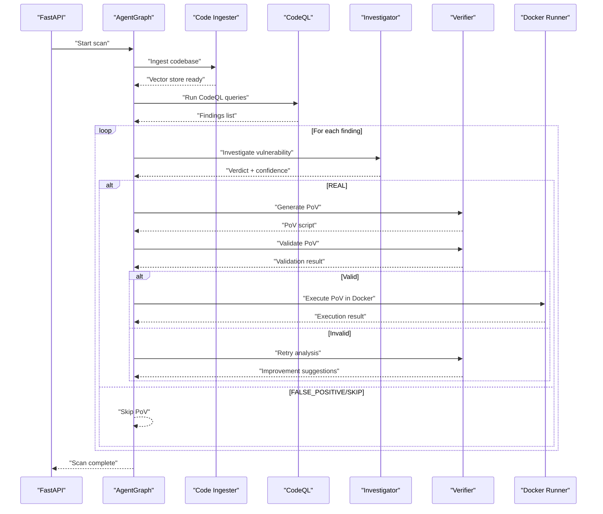
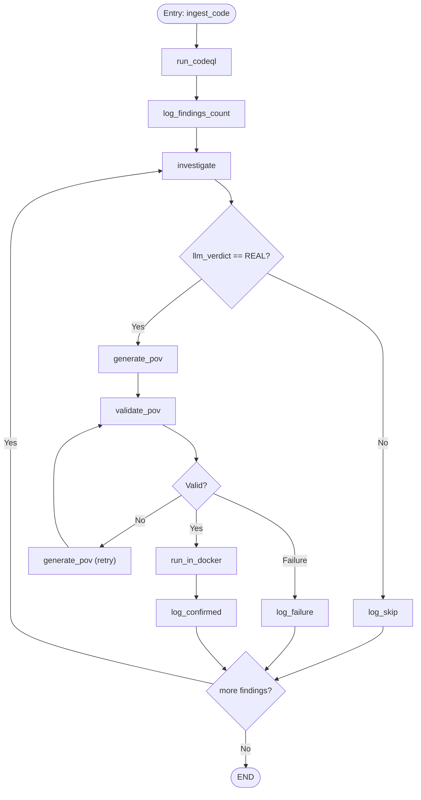
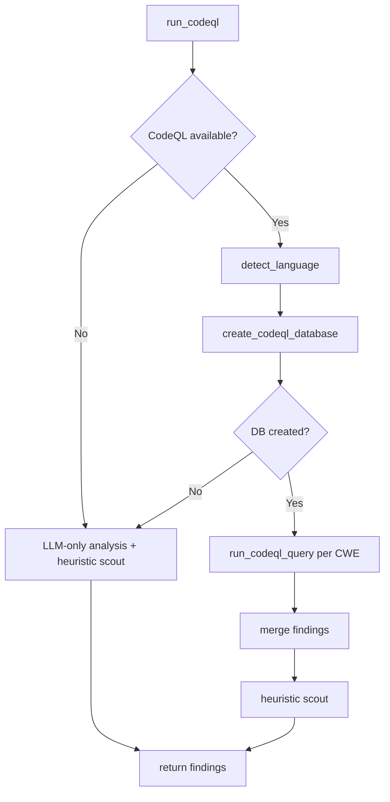
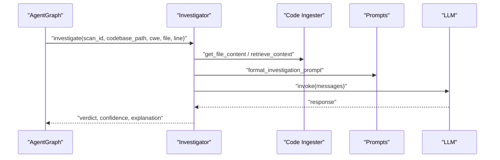
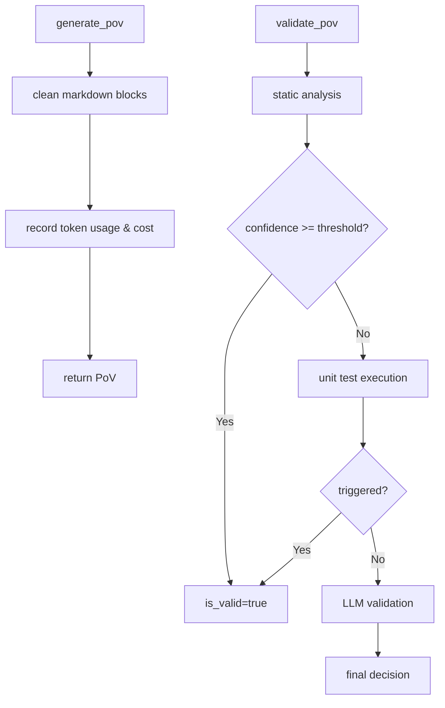
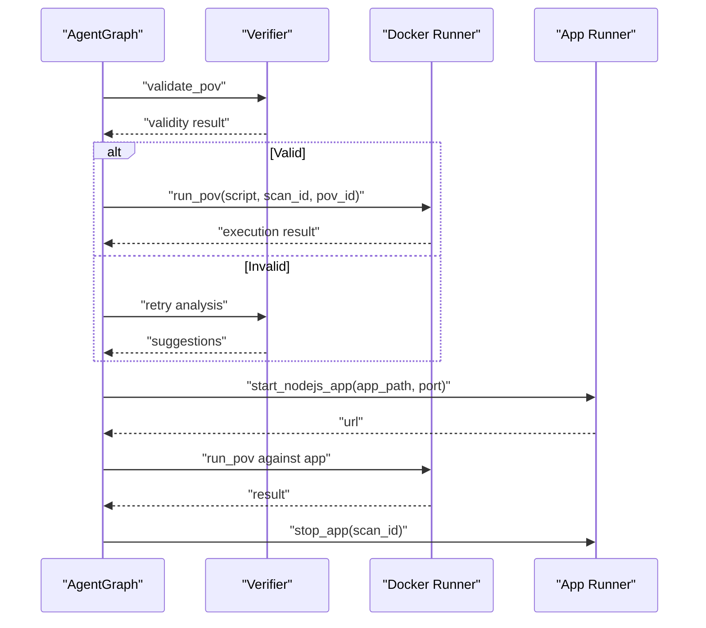
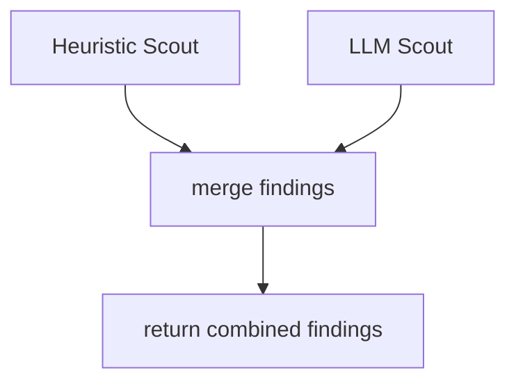
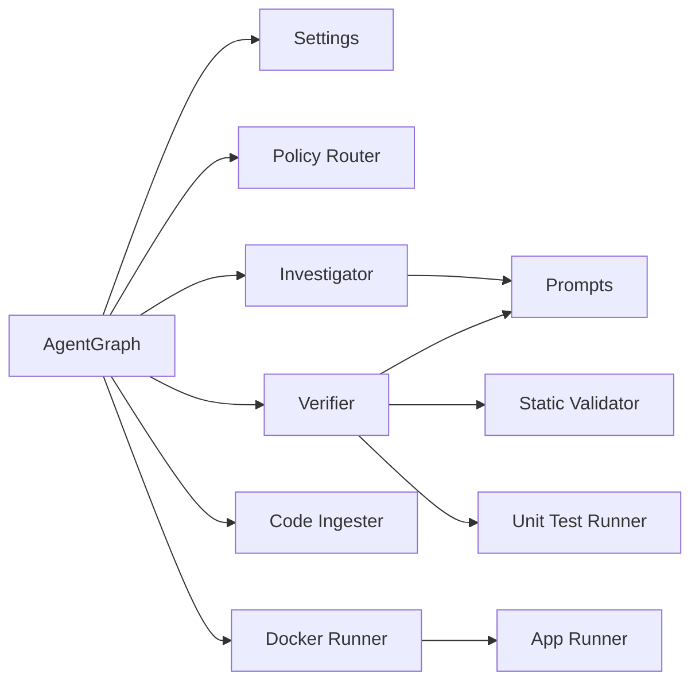

# Agent Graph Orchestration

<cite>
**Referenced Files in This Document**
- [agent_graph.py](file://app/agent_graph.py)
- [config.py](file://app/config.py)
- [policy.py](file://app/policy.py)
- [prompts.py](file://prompts.py)
- [main.py](file://app/main.py)
- [ingest_codebase.py](file://agents/ingest_codebase.py)
- [investigator.py](file://agents/investigator.py)
- [verifier.py](file://agents/verifier.py)
- [docker_runner.py](file://agents/docker_runner.py)
- [heuristic_scout.py](file://agents/heuristic_scout.py)
- [llm_scout.py](file://agents/llm_scout.py)
- [static_validator.py](file://agents/static_validator.py)
- [unit_test_runner.py](file://agents/unit_test_runner.py)
- [app_runner.py](file://agents/app_runner.py)
</cite>

## Table of Contents
1. [Introduction](#introduction)
2. [Project Structure](#project-structure)
3. [Core Components](#core-components)
4. [Architecture Overview](#architecture-overview)
5. [Detailed Component Analysis](#detailed-component-analysis)
6. [Dependency Analysis](#dependency-analysis)
7. [Performance Considerations](#performance-considerations)
8. [Troubleshooting Guide](#troubleshooting-guide)
9. [Conclusion](#conclusion)

## Introduction
This document explains AutoPoV's LangGraph-based agent orchestration system for autonomous vulnerability detection and Proof-of-Vulnerability (PoV) generation. It covers the state machine architecture, agent communication patterns, workflow management, and integration with individual agents. It also documents state transitions, decision-making logic, state persistence, error handling, and practical guidance for performance optimization, debugging, and scaling.

## Project Structure
AutoPoV organizes its orchestration around a central LangGraph workflow in the application layer, with specialized agents implementing domain capabilities:
- Orchestrator: LangGraph workflow managing scan lifecycle and agent handoffs
- Agents: Specialized modules for ingestion, investigation, PoV generation/validation, Docker execution, and auxiliary scouts
- Configuration and policies: Centralized settings and model routing
- API surface: FastAPI endpoints to trigger scans and stream progress

```mermaid
graph TB
subgraph "Orchestrator"
AG["AgentGraph<br/>LangGraph workflow"]
end
subgraph "Agents"
CI["Code Ingester"]
INV["Investigator"]
VER["Verifier"]
DR["Docker Runner"]
HS["Heuristic Scout"]
LS["LLM Scout"]
SV["Static Validator"]
UTR["Unit Test Runner"]
AR["App Runner"]
end
subgraph "Configuration"
CFG["Settings"]
POL["Policy Router"]
PR["Prompts"]
end
subgraph "API"
API["FastAPI Endpoints"]
end
API --> AG
AG --> CI
AG --> INV
AG --> VER
AG --> DR
AG --> HS
AG --> LS
VER --> SV
VER --> UTR
DR --> AR
INV --> CI
INV --> PR
VER --> PR
AG --> POL
AG --> CFG
```

**Diagram sources**
- [agent_graph.py:82-168](file://app/agent_graph.py#L82-L168)
- [config.py:13-255](file://app/config.py#L13-L255)
- [policy.py:12-39](file://app/policy.py#L12-L39)
- [prompts.py:1-424](file://prompts.py#L1-L424)
- [main.py:114-122](file://app/main.py#L114-L122)

**Section sources**
- [agent_graph.py:1-1225](file://app/agent_graph.py#L1-L1225)
- [config.py:1-255](file://app/config.py#L1-L255)
- [policy.py:1-40](file://app/policy.py#L1-L40)
- [prompts.py:1-424](file://prompts.py#L1-L424)
- [main.py:1-768](file://app/main.py#L1-L768)

## Core Components
- AgentGraph: Defines the LangGraph workflow, nodes, edges, and conditional logic for vulnerability detection and PoV lifecycle
- Agent modules: Implement ingestion, investigation, PoV generation/validation, Docker execution, and auxiliary discovery
- Configuration and policy: Centralized settings and model selection for agents
- API: Exposes endpoints to trigger scans, stream logs, and manage results

Key orchestration responsibilities:
- Build and compile the workflow graph
- Manage state transitions across nodes
- Route models per stage using policy
- Integrate vector store for RAG-backed investigation
- Coordinate Docker-based PoV execution
- Handle fallbacks and error propagation

**Section sources**
- [agent_graph.py:82-168](file://app/agent_graph.py#L82-L168)
- [config.py:13-255](file://app/config.py#L13-L255)
- [policy.py:12-39](file://app/policy.py#L12-L39)

## Architecture Overview
The orchestrator coordinates a linear-to-conditional workflow:
- Initial ingestion into a vector store
- CodeQL analysis with autonomous discovery fallback
- Investigation per finding with LLM and RAG
- PoV generation and validation
- Docker execution for confirmed vulnerabilities
- Iterative processing of findings until completion



**Diagram sources**
- [agent_graph.py:170-307](file://app/agent_graph.py#L170-L307)
- [agent_graph.py:691-777](file://app/agent_graph.py#L691-L777)
- [agent_graph.py:779-806](file://app/agent_graph.py#L779-L806)
- [investigator.py:270-432](file://agents/investigator.py#L270-L432)
- [verifier.py:90-223](file://agents/verifier.py#L90-L223)
- [verifier.py:225-387](file://agents/verifier.py#L225-L387)
- [docker_runner.py:62-191](file://agents/docker_runner.py#L62-L191)

## Detailed Component Analysis

### AgentGraph: State Machine and Workflow
AgentGraph defines the LangGraph workflow with typed state and conditional edges:
- State schema: ScanState and VulnerabilityState define the persistent state across nodes
- Nodes: Ingest, CodeQL, Investigate, Generate PoV, Validate PoV, Docker execution, logging, and termination
- Edges: Linear progression with conditional branches based on investigation and validation outcomes
- Decision logic: Branches to PoV generation, skip, or failure handling; iterative loop back to investigate for multiple findings



**Diagram sources**
- [agent_graph.py:88-168](file://app/agent_graph.py#L88-L168)
- [agent_graph.py:170-176](file://app/agent_graph.py#L170-L176)
- [agent_graph.py:241-307](file://app/agent_graph.py#L241-L307)
- [agent_graph.py:691-777](file://app/agent_graph.py#L691-L777)
- [agent_graph.py:779-806](file://app/agent_graph.py#L779-L806)

**Section sources**
- [agent_graph.py:31-80](file://app/agent_graph.py#L31-L80)
- [agent_graph.py:88-168](file://app/agent_graph.py#L88-L168)

### CodeQL Integration and Autonomous Discovery
The workflow integrates CodeQL with autonomous discovery:
- Detect language and create a CodeQL database
- Run queries per CWE and merge with heuristic/LLM scout findings
- Fallback to LLM-only analysis when CodeQL is unavailable
- Cleanup database artifacts after execution



**Diagram sources**
- [agent_graph.py:241-307](file://app/agent_graph.py#L241-L307)
- [agent_graph.py:309-341](file://app/agent_graph.py#L309-L341)
- [agent_graph.py:406-606](file://app/agent_graph.py#L406-L606)
- [agent_graph.py:607-689](file://app/agent_graph.py#L607-L689)

**Section sources**
- [agent_graph.py:241-307](file://app/agent_graph.py#L241-L307)
- [agent_graph.py:309-341](file://app/agent_graph.py#L309-L341)
- [agent_graph.py:406-606](file://app/agent_graph.py#L406-L606)
- [agent_graph.py:607-689](file://app/agent_graph.py#L607-L689)

### Investigation Agent: RAG and LLM
The Investigator agent:
- Retrieves context via RAG and optionally runs Joern for specific CWEs
- Builds a tailored prompt and invokes the selected model
- Parses structured JSON responses and records costs and token usage
- Stores investigation results in the learning store



**Diagram sources**
- [agent_graph.py:691-777](file://app/agent_graph.py#L691-L777)
- [investigator.py:270-432](file://agents/investigator.py#L270-L432)
- [prompts.py:257-273](file://prompts.py#L257-L273)

**Section sources**
- [agent_graph.py:691-777](file://app/agent_graph.py#L691-L777)
- [investigator.py:270-432](file://agents/investigator.py#L270-L432)
- [prompts.py:7-44](file://prompts.py#L7-L44)

### PoV Generation and Validation
The Verifier agent:
- Generates PoV scripts using a structured prompt and selected model
- Validates PoVs via static analysis, unit test execution, and LLM analysis
- Provides retry suggestions when validation fails



**Diagram sources**
- [verifier.py:90-223](file://agents/verifier.py#L90-L223)
- [verifier.py:225-387](file://agents/verifier.py#L225-L387)
- [static_validator.py:123-233](file://agents/static_validator.py#L123-L233)
- [unit_test_runner.py:34-116](file://agents/unit_test_runner.py#L34-L116)

**Section sources**
- [verifier.py:90-223](file://agents/verifier.py#L90-L223)
- [verifier.py:225-387](file://agents/verifier.py#L225-L387)
- [static_validator.py:123-233](file://agents/static_validator.py#L123-L233)
- [unit_test_runner.py:34-116](file://agents/unit_test_runner.py#L34-L116)

### Docker Execution and Application Lifecycle
The Docker Runner executes PoVs in isolated containers with resource limits. The App Runner can start target applications for live testing.



**Diagram sources**
- [agent_graph.py:779-806](file://app/agent_graph.py#L779-L806)
- [verifier.py:225-387](file://agents/verifier.py#L225-L387)
- [docker_runner.py:62-191](file://agents/docker_runner.py#L62-L191)
- [app_runner.py:25-148](file://agents/app_runner.py#L25-L148)

**Section sources**
- [docker_runner.py:62-191](file://agents/docker_runner.py#L62-L191)
- [app_runner.py:25-148](file://agents/app_runner.py#L25-L148)

### Auxiliary Scouts: Heuristic and LLM
- Heuristic Scout: Lightweight pattern matching across CWEs to discover candidates quickly
- LLM Scout: Summarizes files and proposes candidates with confidence and reasoning



**Diagram sources**
- [agent_graph.py:206-227](file://app/agent_graph.py#L206-L227)
- [heuristic_scout.py:188-234](file://agents/heuristic_scout.py#L188-L234)
- [llm_scout.py:88-200](file://agents/llm_scout.py#L88-L200)

**Section sources**
- [heuristic_scout.py:188-234](file://agents/heuristic_scout.py#L188-L234)
- [llm_scout.py:88-200](file://agents/llm_scout.py#L88-L200)

## Dependency Analysis
The orchestrator depends on configuration, policy routing, and agent modules. Agents depend on configuration and shared prompts.



**Diagram sources**
- [agent_graph.py:19-28](file://app/agent_graph.py#L19-L28)
- [config.py:13-255](file://app/config.py#L13-L255)
- [policy.py:12-39](file://app/policy.py#L12-L39)
- [prompts.py:1-424](file://prompts.py#L1-L424)

**Section sources**
- [agent_graph.py:19-28](file://app/agent_graph.py#L19-L28)
- [config.py:13-255](file://app/config.py#L13-L255)
- [policy.py:12-39](file://app/policy.py#L12-L39)
- [prompts.py:1-424](file://prompts.py#L1-L424)

## Performance Considerations
- Cost control: Configure maximum cost and per-stage cost caps; track token usage and actual costs
- Model routing: Use policy router to select optimal models per stage and CWE/language
- Vector store efficiency: Batch ingestion and reuse collections per scan; clean up after use
- CodeQL optimization: Detect language early, reuse database, and limit query scope
- Docker isolation: Enforce CPU/memory limits and timeouts to prevent resource exhaustion
- Parallelism: Use background tasks for API endpoints and asynchronous scan execution

[No sources needed since this section provides general guidance]

## Troubleshooting Guide
Common issues and remedies:
- CodeQL failures: Fallback to LLM-only analysis and heuristic scout; verify CLI availability and language detection
- Vector store ingestion errors: Continue scan without RAG context; inspect file filtering and binary detection
- Investigation errors: Default to conservative verdict and record learning store entry; check model availability and token usage extraction
- PoV validation failures: Apply static analysis, unit test execution, and LLM retry analysis; leverage suggestions for improvement
- Docker execution issues: Verify Docker availability and image presence; adjust timeouts and resource limits

**Section sources**
- [agent_graph.py:199-203](file://app/agent_graph.py#L199-L203)
- [agent_graph.py:293-299](file://app/agent_graph.py#L293-L299)
- [investigator.py:416-432](file://agents/investigator.py#L416-L432)
- [verifier.py:492-551](file://agents/verifier.py#L492-L551)
- [docker_runner.py:50-61](file://agents/docker_runner.py#L50-L61)

## Conclusion
AutoPoV’s LangGraph-based orchestration composes modular agents to deliver an end-to-end vulnerability detection pipeline. The workflow emphasizes robustness through fallbacks, cost-awareness, and layered validation. By leveraging RAG, CodeQL, and Docker execution, it achieves both breadth and depth in vulnerability triage and PoV generation. The design supports incremental improvements, dynamic model selection, and scalable deployment patterns.