# Authentication & Authorization

<cite>
**Referenced Files in This Document**
- [app/auth.py](file://app/auth.py)
- [app/main.py](file://app/main.py)
- [app/config.py](file://app/config.py)
- [data/api_keys.json](file://data/api_keys.json)
- [generate_key.py](file://generate_key.py)
- [add_api_key.py](file://add_api_key.py)
- [test_api_key.py](file://test_api_key.py)
- [frontend/src/api/client.js](file://frontend/src/api/client.js)
- [tests/test_auth.py](file://tests/test_auth.py)
</cite>

## Table of Contents
1. [Introduction](#introduction)
2. [Project Structure](#project-structure)
3. [Core Components](#core-components)
4. [Architecture Overview](#architecture-overview)
5. [Detailed Component Analysis](#detailed-component-analysis)
6. [Dependency Analysis](#dependency-analysis)
7. [Performance Considerations](#performance-considerations)
8. [Troubleshooting Guide](#troubleshooting-guide)
9. [Conclusion](#conclusion)
10. [Appendices](#appendices)

## Introduction
This document explains AutoPoV’s authentication and authorization system with a focus on API key management, rate limiting, and access control. It covers how keys are generated, validated, revoked, and rotated; how security middleware protects endpoints; how request validation works; and how administrative operations are enforced. It also includes practical examples, best practices, and guidance for integrating with external authentication systems.

## Project Structure
The authentication and authorization logic is primarily implemented in the backend FastAPI application:
- API key management and validation live in the authentication module.
- Endpoint dependencies enforce bearer token validation and rate limits.
- Administrative operations are protected by admin API key validation.
- Frontend client injects the API key into requests.
- Example scripts demonstrate key generation and testing.

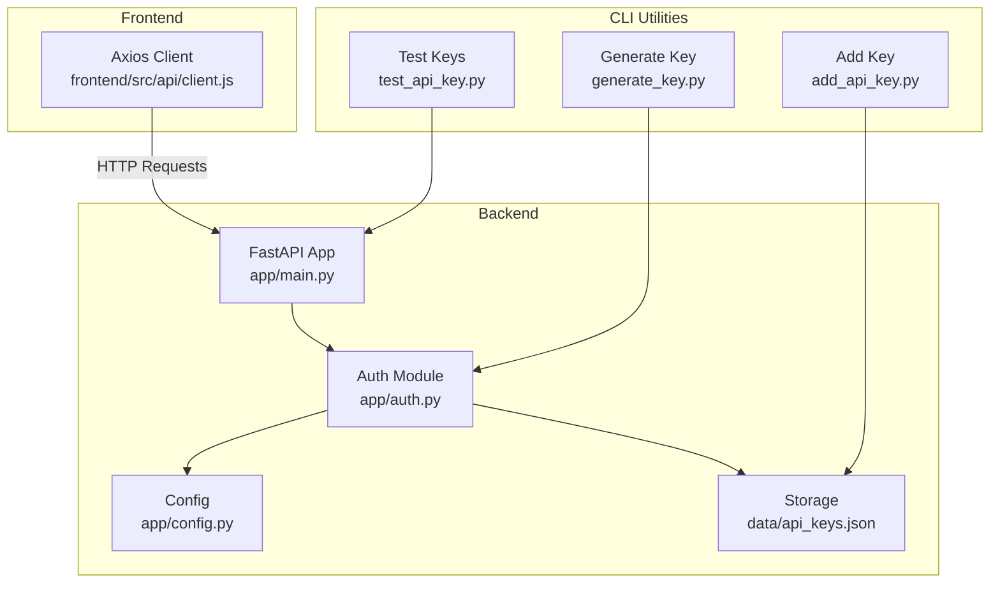

**Diagram sources**
- [app/main.py:114-122](file://app/main.py#L114-L122)
- [app/auth.py:40-52](file://app/auth.py#L40-L52)
- [app/config.py:26-28](file://app/config.py#L26-L28)
- [data/api_keys.json:1-42](file://data/api_keys.json#L1-L42)
- [frontend/src/api/client.js:18-25](file://frontend/src/api/client.js#L18-L25)
- [generate_key.py:7](file://generate_key.py#L7)
- [add_api_key.py:16-33](file://add_api_key.py#L16-L33)
- [test_api_key.py:15-31](file://test_api_key.py#L15-L31)

**Section sources**
- [app/main.py:114-122](file://app/main.py#L114-L122)
- [app/auth.py:40-52](file://app/auth.py#L40-L52)
- [app/config.py:26-28](file://app/config.py#L26-L28)
- [data/api_keys.json:1-42](file://data/api_keys.json#L1-L42)
- [frontend/src/api/client.js:18-25](file://frontend/src/api/client.js#L18-L25)
- [generate_key.py:7](file://generate_key.py#L7)
- [add_api_key.py:16-33](file://add_api_key.py#L16-L33)
- [test_api_key.py:15-31](file://test_api_key.py#L15-L31)

## Core Components
- API key model and manager:
  - Stores key metadata, hashes, activity status, and last-used timestamps.
  - Provides generation, validation, revocation, deletion, listing, and admin key validation.
- Security dependencies:
  - Bearer token extraction from Authorization header or query parameter for SSE.
  - Per-key rate limiting enforcement for scan-triggering endpoints.
  - Admin-only dependencies for privileged operations.
- Configuration:
  - Admin API key and other security-related settings.
- Frontend client:
  - Injects Authorization header and handles SSE with query-parameter fallback.

**Section sources**
- [app/auth.py:30-186](file://app/auth.py#L30-L186)
- [app/auth.py:192-250](file://app/auth.py#L192-L250)
- [app/config.py:26-28](file://app/config.py#L26-L28)
- [frontend/src/api/client.js:18-25](file://frontend/src/api/client.js#L18-L25)

## Architecture Overview
The system enforces authentication and authorization at the FastAPI dependency level. Requests must present a valid API key; sensitive administrative actions require an admin key. Rate limiting is applied to scan-triggering endpoints to prevent abuse.

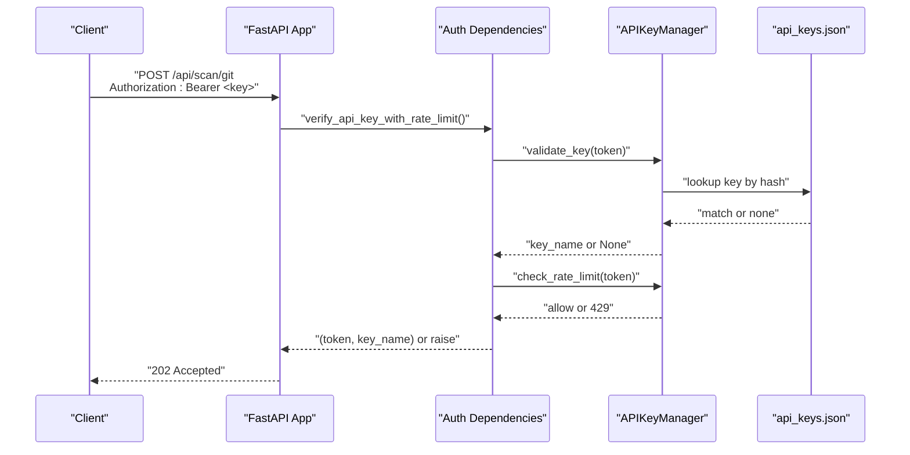

**Diagram sources**
- [app/main.py:204-209](file://app/main.py#L204-L209)
- [app/auth.py:192-236](file://app/auth.py#L192-L236)
- [app/auth.py:107-127](file://app/auth.py#L107-L127)
- [app/auth.py:129-146](file://app/auth.py#L129-L146)
- [data/api_keys.json:1-42](file://data/api_keys.json#L1-42)

## Detailed Component Analysis

### API Key Management
- Generation:
  - Creates a random key identifier and a secure raw key value.
  - Computes a SHA-256 hash for storage and lookup.
  - Persists immediately to disk.
- Validation:
  - Hashes the provided key and compares against stored hashes using constant-time comparison.
  - Updates last-used timestamps in memory and flushes periodically.
- Revocation and Deletion:
  - Sets activation flag to false or removes the key record.
- Listing:
  - Returns key metadata excluding hashes.
- Admin Key Validation:
  - Validates admin-only operations using constant-time comparison against a configured secret.

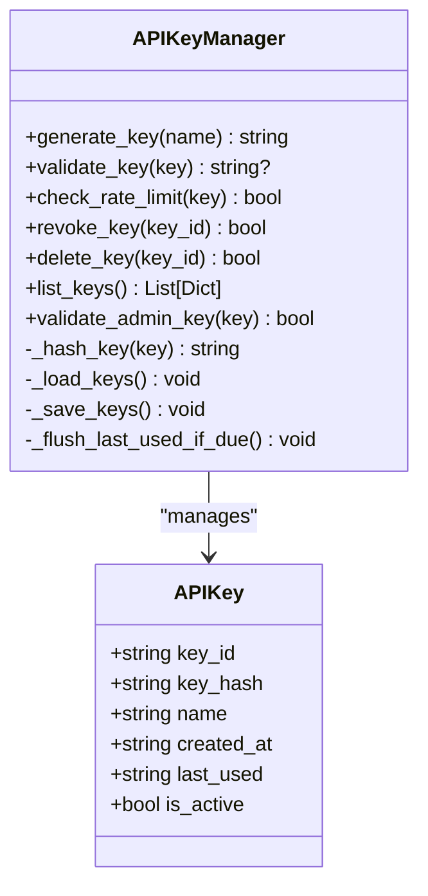

**Diagram sources**
- [app/auth.py:30-186](file://app/auth.py#L30-L186)

**Section sources**
- [app/auth.py:84-105](file://app/auth.py#L84-L105)
- [app/auth.py:107-127](file://app/auth.py#L107-L127)
- [app/auth.py:148-164](file://app/auth.py#L148-L164)
- [app/auth.py:166-178](file://app/auth.py#L166-L178)
- [app/auth.py:180-185](file://app/auth.py#L180-L185)

### Rate Limiting Mechanism
- Window-based sliding counter:
  - Maintains per-key request timestamps within a fixed time window.
  - Rejects requests exceeding the maximum allowed scans per window.
- Thread safety:
  - Uses a lock around rate-window updates.
- Flush interval:
  - Debounces last-used updates to disk to reduce I/O.

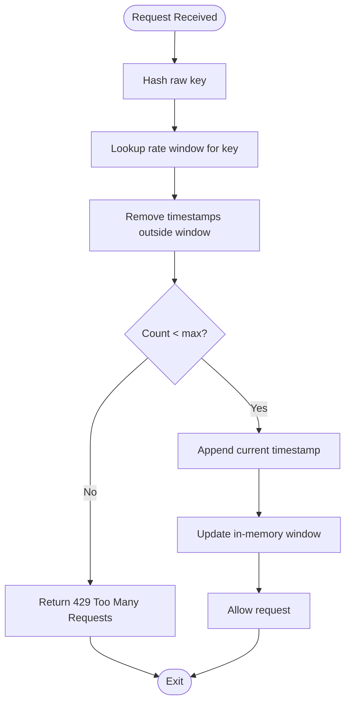

**Diagram sources**
- [app/auth.py:129-146](file://app/auth.py#L129-L146)

**Section sources**
- [app/auth.py:24-27](file://app/auth.py#L24-L27)
- [app/auth.py:129-146](file://app/auth.py#L129-L146)

### Access Control Policies
- Public endpoints:
  - Health checks and configuration retrieval require standard API key validation.
- Protected endpoints:
  - Scan initiation endpoints apply rate-limiting dependency.
  - Cancel, status, logs, history, reports, metrics require standard API key validation.
- Administrative endpoints:
  - Key generation, listing, revocation, and cleanup require admin API key validation.

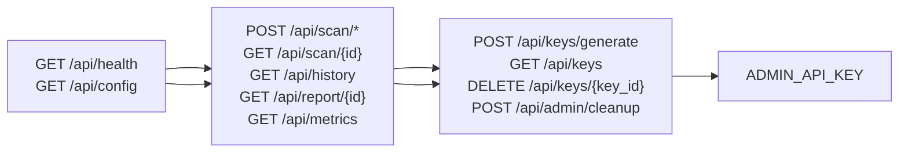

**Diagram sources**
- [app/main.py:176-201](file://app/main.py#L176-L201)
- [app/main.py:204-400](file://app/main.py#L204-L400)
- [app/main.py:492-596](file://app/main.py#L492-L596)
- [app/main.py:691-742](file://app/main.py#L691-L742)
- [app/config.py:26-28](file://app/config.py#L26-L28)

**Section sources**
- [app/main.py:176-201](file://app/main.py#L176-L201)
- [app/main.py:204-400](file://app/main.py#L204-L400)
- [app/main.py:492-596](file://app/main.py#L492-L596)
- [app/main.py:691-742](file://app/main.py#L691-L742)
- [app/config.py:26-28](file://app/config.py#L26-L28)

### Security Middleware and Request Validation
- Bearer token extraction:
  - Checks Authorization header for Bearer scheme.
  - Falls back to query parameter for SSE/EventSource compatibility.
- Constant-time comparisons:
  - HMAC-based comparison prevents timing attacks for both regular and admin keys.
- Endpoint dependencies:
  - verify_api_key: extracts and validates the key.
  - verify_api_key_with_rate_limit: adds rate-limit enforcement.
  - verify_admin_key: enforces admin-only access.

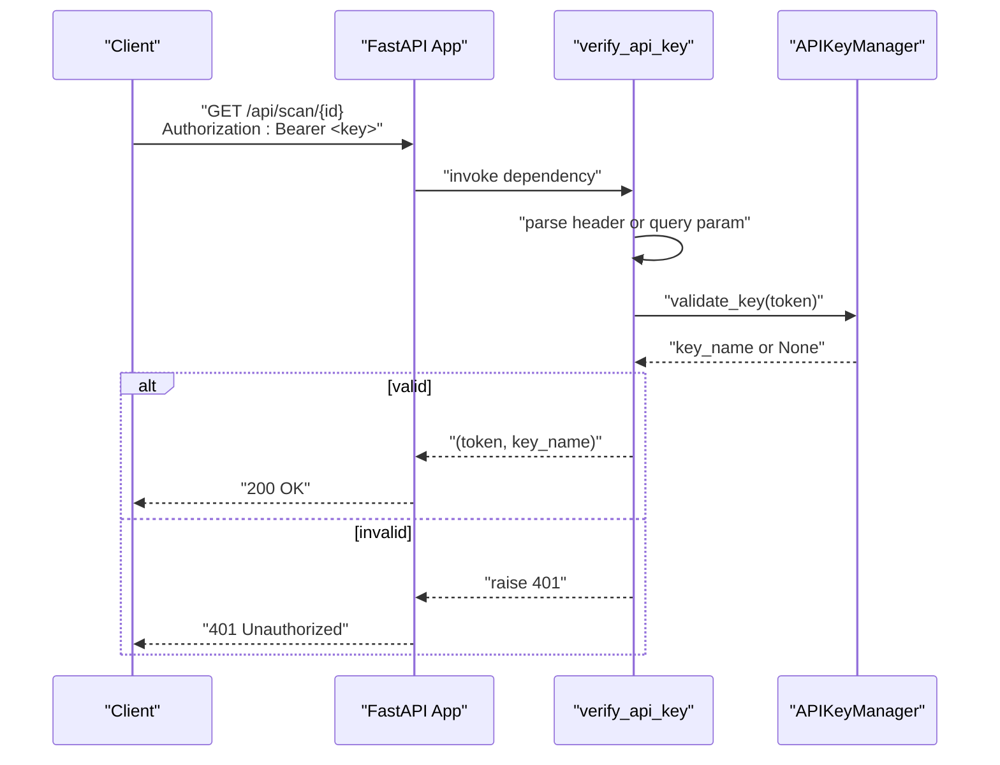

**Diagram sources**
- [app/auth.py:192-218](file://app/auth.py#L192-L218)
- [app/auth.py:107-127](file://app/auth.py#L107-L127)

**Section sources**
- [app/auth.py:192-218](file://app/auth.py#L192-L218)
- [app/auth.py:221-236](file://app/auth.py#L221-L236)
- [app/auth.py:239-250](file://app/auth.py#L239-L250)

### Administrative Access Controls
- Admin-only endpoints:
  - Key lifecycle operations and system cleanup require admin API key.
- Admin key configuration:
  - Loaded from environment variable and validated using constant-time comparison.

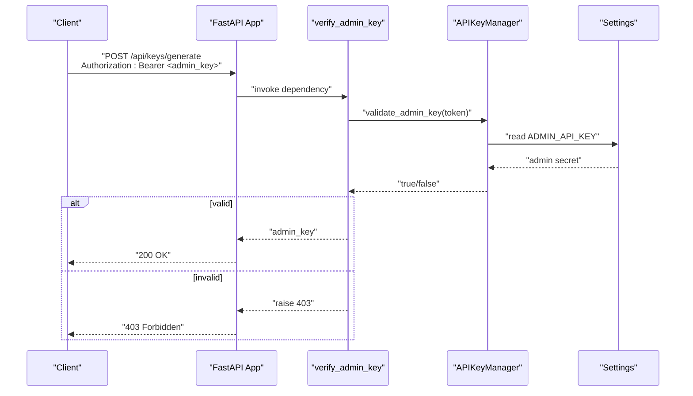

**Diagram sources**
- [app/main.py:691-702](file://app/main.py#L691-L702)
- [app/auth.py:239-250](file://app/auth.py#L239-L250)
- [app/auth.py:180-185](file://app/auth.py#L180-L185)
- [app/config.py:26-28](file://app/config.py#L26-L28)

**Section sources**
- [app/main.py:691-702](file://app/main.py#L691-L702)
- [app/auth.py:180-185](file://app/auth.py#L180-L185)
- [app/config.py:26-28](file://app/config.py#L26-L28)

### API Key Usage Examples
- Generating a key:
  - Use the provided script to generate a new key via the manager and print it to stdout.
- Testing keys:
  - Use the provided script to POST to a scan endpoint with Authorization: Bearer <key>.
- Frontend usage:
  - Axios client automatically attaches Authorization header if an API key is present in local storage or environment.
  - For SSE, the client passes the key as a query parameter.

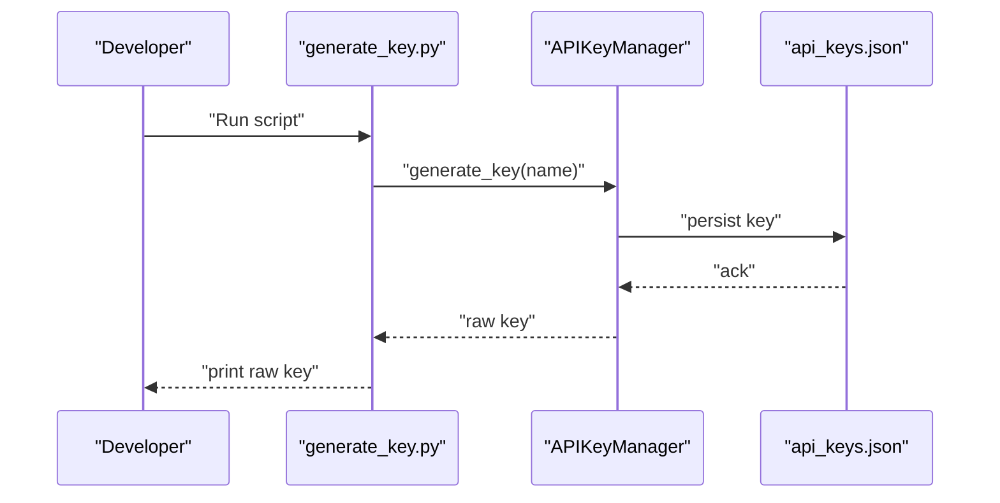

**Diagram sources**
- [generate_key.py:7](file://generate_key.py#L7)
- [app/auth.py:84-105](file://app/auth.py#L84-L105)
- [data/api_keys.json:1-42](file://data/api_keys.json#L1-L42)

**Section sources**
- [generate_key.py:7](file://generate_key.py#L7)
- [test_api_key.py:15-31](file://test_api_key.py#L15-L31)
- [frontend/src/api/client.js:18-25](file://frontend/src/api/client.js#L18-L25)
- [frontend/src/api/client.js:44-47](file://frontend/src/api/client.js#L44-L47)

### Rate Limiting Scenarios
- Normal operation:
  - Up to the configured maximum scans per minute per key are allowed.
- Exceeded limit:
  - Subsequent requests return 429 Too Many Requests until the window resets.

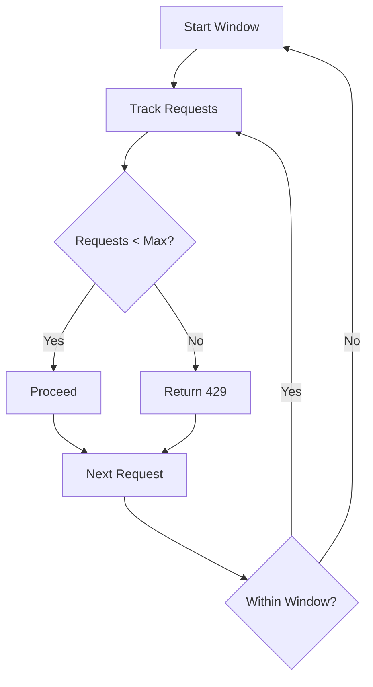

**Diagram sources**
- [app/auth.py:129-146](file://app/auth.py#L129-L146)

**Section sources**
- [app/auth.py:24-27](file://app/auth.py#L24-L27)
- [app/auth.py:129-146](file://app/auth.py#L129-L146)

### Administrative Operations
- Generate key:
  - Requires admin key; returns the newly generated raw key.
- List keys:
  - Requires admin key; returns metadata for all keys.
- Revoke key:
  - Requires admin key; deactivates the key.
- Cleanup:
  - Requires admin key; cleans old result files.

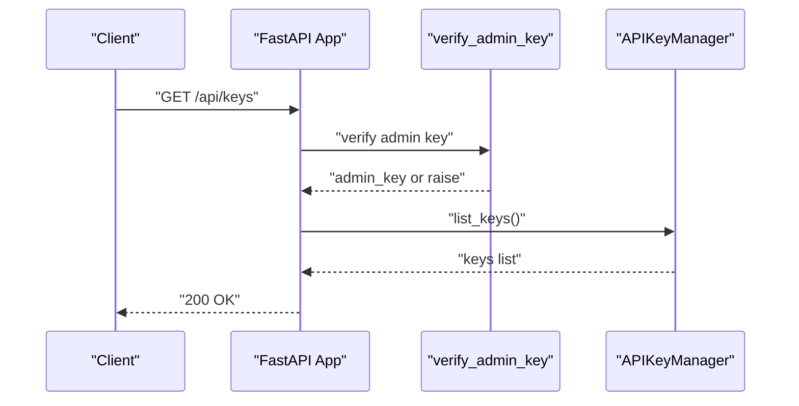

**Diagram sources**
- [app/main.py:705-711](file://app/main.py#L705-L711)
- [app/auth.py:239-250](file://app/auth.py#L239-L250)

**Section sources**
- [app/main.py:691-742](file://app/main.py#L691-L742)
- [app/auth.py:239-250](file://app/auth.py#L239-L250)

## Dependency Analysis
- Coupling:
  - Endpoints depend on authentication dependencies; dependencies depend on the API key manager; manager depends on configuration and storage.
- Cohesion:
  - Authentication logic is centralized in the auth module; configuration is centralized in the config module.
- External dependencies:
  - FastAPI for routing and dependency injection.
  - Python standard library for hashing and concurrency primitives.

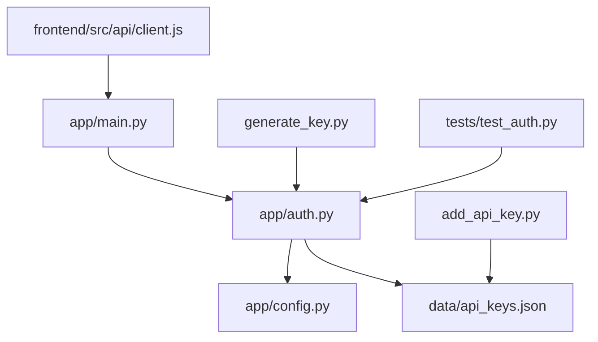

**Diagram sources**
- [app/main.py:19-20](file://app/main.py#L19-L20)
- [app/auth.py:19-19](file://app/auth.py#L19-L19)
- [app/config.py:26-28](file://app/config.py#L26-L28)
- [data/api_keys.json:1-42](file://data/api_keys.json#L1-L42)
- [frontend/src/api/client.js:18-25](file://frontend/src/api/client.js#L18-L25)
- [generate_key.py:7](file://generate_key.py#L7)
- [add_api_key.py:16-33](file://add_api_key.py#L16-L33)
- [tests/test_auth.py:8](file://tests/test_auth.py#L8)

**Section sources**
- [app/main.py:19-20](file://app/main.py#L19-L20)
- [app/auth.py:19-19](file://app/auth.py#L19-L19)
- [app/config.py:26-28](file://app/config.py#L26-L28)
- [data/api_keys.json:1-42](file://data/api_keys.json#L1-L42)
- [frontend/src/api/client.js:18-25](file://frontend/src/api/client.js#L18-L25)
- [generate_key.py:7](file://generate_key.py#L7)
- [add_api_key.py:16-33](file://add_api_key.py#L16-L33)
- [tests/test_auth.py:8](file://tests/test_auth.py#L8)

## Performance Considerations
- I/O batching:
  - Pending last-used updates are flushed periodically to reduce disk writes.
- Memory footprint:
  - Rate windows are maintained per key in memory; consider key cardinality when scaling.
- Hashing cost:
  - SHA-256 hashing is lightweight; constant-time comparison avoids timing leaks.
- Concurrency:
  - Locks protect shared mutable state; keep critical sections small.

[No sources needed since this section provides general guidance]

## Troubleshooting Guide
- 401 Unauthorized:
  - Ensure the Authorization header is present and formatted as Bearer <key>.
  - Verify the key exists and is active in storage.
- 429 Too Many Requests:
  - Wait for the rate window to reset or reduce request frequency.
- 403 Forbidden (admin endpoints):
  - Confirm ADMIN_API_KEY is set and matches the provided admin key.
- SSE connection issues:
  - For EventSource, pass the key as a query parameter when Authorization header is unavailable.
- Key not found errors:
  - Use the listing endpoint to confirm key existence and status.

**Section sources**
- [app/auth.py:212-218](file://app/auth.py#L212-L218)
- [app/auth.py:231-236](file://app/auth.py#L231-L236)
- [app/auth.py:243-249](file://app/auth.py#L243-L249)
- [frontend/src/api/client.js:44-47](file://frontend/src/api/client.js#L44-L47)
- [data/api_keys.json:1-42](file://data/api_keys.json#L1-L42)

## Conclusion
AutoPoV’s authentication and authorization system centers on secure, constant-time API key validation, per-key rate limiting, and strict admin-only controls for sensitive operations. The design balances simplicity with robustness, enabling straightforward integration and administration while preventing abuse and unauthorized access.

[No sources needed since this section summarizes without analyzing specific files]

## Appendices

### Best Practices
- Rotate keys regularly and revoke unused keys.
- Store ADMIN_API_KEY securely in environment variables.
- Use HTTPS in production to protect bearer tokens.
- Monitor rate-limit triggers and adjust thresholds as needed.
- Audit key usage via listing and last-used timestamps.

[No sources needed since this section provides general guidance]

### Integration with External Authentication Systems
- To integrate with external identity providers, replace the bearer token validation with a JWT verification dependency that validates issuer, audience, and claims. Ensure the dependency still returns a principal identifier usable by the application.

[No sources needed since this section provides general guidance]