# Backend Services

<cite>
**Referenced Files in This Document**
- [app/main.py](file://app/main.py)
- [app/agent_graph.py](file://app/agent_graph.py)
- [app/scan_manager.py](file://app/scan_manager.py)
- [app/config.py](file://app/config.py)
- [app/auth.py](file://app/auth.py)
- [app/git_handler.py](file://app/git_handler.py)
- [app/source_handler.py](file://app/source_handler.py)
- [app/webhook_handler.py](file://app/webhook_handler.py)
- [app/report_generator.py](file://app/report_generator.py)
- [app/learning_store.py](file://app/learning_store.py)
- [app/policy.py](file://app/policy.py)
- [agents/ingest_codebase.py](file://agents/ingest_codebase.py)
- [agents/investigator.py](file://agents/investigator.py)
</cite>

## Table of Contents
1. [Introduction](#introduction)
2. [Project Structure](#project-structure)
3. [Core Components](#core-components)
4. [Architecture Overview](#architecture-overview)
5. [Detailed Component Analysis](#detailed-component-analysis)
6. [Dependency Analysis](#dependency-analysis)
7. [Performance Considerations](#performance-considerations)
8. [Troubleshooting Guide](#troubleshooting-guide)
9. [Conclusion](#conclusion)
10. [Appendices](#appendices)

## Introduction
This document describes AutoPoV’s backend services built on FastAPI. It covers the main application entry point, the LangGraph-based agent orchestration system, background scan management, adaptive model policy routing, learning store for performance tracking, configuration management, authentication and authorization, Git repository handling, source code processing, webhook integration, and report generation. It explains the service architecture, API endpoints, real-time streaming capabilities, and inter-service communication patterns. It also includes configuration options, security considerations, and operational procedures.

## Project Structure
The backend is organized into cohesive modules:
- app: FastAPI application, configuration, authentication, Git and source handlers, scan manager, agent graph, webhook handler, report generator, learning store, and policy router
- agents: LangGraph agent components for vulnerability detection and processing
- data: persistent data stores (ChromaDB vector store, SQLite learning store)
- results: persisted scan results, snapshots, and reports
- codeql_queries: local CodeQL query packs for vulnerability detection
- frontend: optional React-based UI (not covered here)

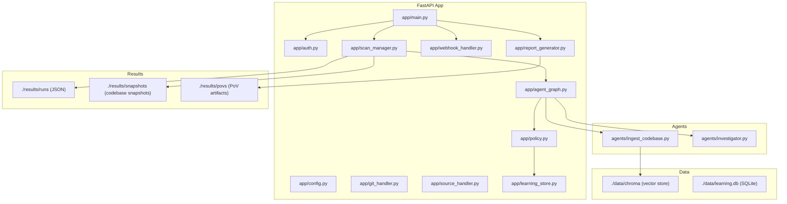

**Diagram sources**
- [app/main.py:1-768](file://app/main.py#L1-L768)
- [app/agent_graph.py:1-800](file://app/agent_graph.py#L1-L800)
- [agents/ingest_codebase.py:1-413](file://agents/ingest_codebase.py#L1-L413)
- [agents/investigator.py:1-519](file://agents/investigator.py#L1-L519)

**Section sources**
- [app/main.py:114-122](file://app/main.py#L114-L122)
- [app/config.py:13-255](file://app/config.py#L13-L255)

## Core Components
- FastAPI application entry point and API surface
- LangGraph agent orchestration for vulnerability detection and PoV validation
- Background scan manager with persistence and metrics
- Adaptive model policy routing backed by a learning store
- Authentication and rate-limiting for API access
- Git and source code ingestion handlers
- Webhook integrations for CI/CD automation
- Report generation (JSON/PDF) with metrics and PoV summaries
- Configuration management for models, tools, and directories

**Section sources**
- [app/main.py:175-768](file://app/main.py#L175-L768)
- [app/agent_graph.py:82-169](file://app/agent_graph.py#L82-L169)
- [app/scan_manager.py:47-663](file://app/scan_manager.py#L47-L663)
- [app/policy.py:12-40](file://app/policy.py#L12-L40)
- [app/auth.py:40-256](file://app/auth.py#L40-L256)
- [app/git_handler.py:20-392](file://app/git_handler.py#L20-L392)
- [app/source_handler.py:18-382](file://app/source_handler.py#L18-L382)
- [app/webhook_handler.py:15-363](file://app/webhook_handler.py#L15-L363)
- [app/report_generator.py:200-830](file://app/report_generator.py#L200-L830)
- [app/learning_store.py:14-256](file://app/learning_store.py#L14-L256)
- [app/config.py:13-255](file://app/config.py#L13-L255)

## Architecture Overview
AutoPoV’s backend is a FastAPI application that orchestrates vulnerability scans using a LangGraph workflow. Clients submit scans via REST endpoints, which delegate to the scan manager. The scan manager coordinates the agent graph, which performs code ingestion, CodeQL analysis, autonomous discovery, LLM investigation, PoV generation, and validation. Results are persisted and metrics are tracked. Webhooks integrate with Git providers to trigger scans automatically. Reports summarize findings and PoV outcomes.

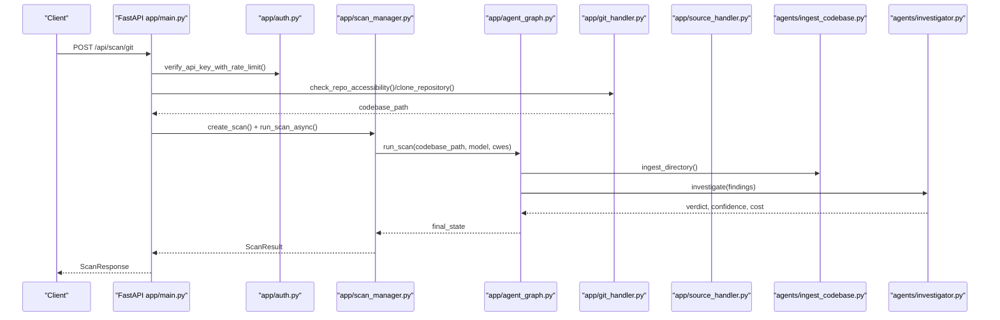

**Diagram sources**
- [app/main.py:204-286](file://app/main.py#L204-L286)
- [app/git_handler.py:155-294](file://app/git_handler.py#L155-L294)
- [app/scan_manager.py:234-366](file://app/scan_manager.py#L234-L366)
- [app/agent_graph.py:241-307](file://app/agent_graph.py#L241-L307)
- [agents/ingest_codebase.py:207-313](file://agents/ingest_codebase.py#L207-L313)
- [agents/investigator.py:270-433](file://agents/investigator.py#L270-L433)

## Detailed Component Analysis

### FastAPI Application and API Endpoints
- Health and configuration endpoints
- Scan initiation for Git, ZIP, and raw code
- Replay scans using prior findings
- Real-time log streaming via Server-Sent Events (SSE)
- History, metrics, and admin operations
- Report generation (JSON/PDF)
- Webhook endpoints for GitHub and GitLab

```mermaid
flowchart TD
Start(["Incoming Request"]) --> Route{"Route"}
Route --> |GET /api/health| Health["HealthResponse"]
Route --> |GET /api/config| Config["Config JSON"]
Route --> |POST /api/scan/git| GitScan["Clone + Background Run"]
Route --> |POST /api/scan/zip| ZipScan["Extract + Background Run"]
Route --> |POST /api/scan/paste| PasteScan["Write + Background Run"]
Route --> |GET /api/scan/{id}| Status["ScanStatusResponse"]
Route --> |GET /api/scan/{id}/stream| SSE["SSE Logs"]
Route --> |POST /api/scan/{id}/replay| Replay["Replay with Preloaded Findings"]
Route --> |GET /api/history| History["History CSV"]
Route --> |GET /api/metrics| Metrics["Metrics JSON"]
Route --> |GET /api/report/{id}?format=json| JSONRep["JSON Report"]
Route --> |GET /api/report/{id}?format=pdf| PDFRep["PDF Report"]
Route --> |POST /api/webhook/github| GHHook["GitHub Webhook"]
Route --> |POST /api/webhook/gitlab| GLHook["GitLab Webhook"]
Route --> |POST /api/keys/generate| GenKey["API Key"]
Route --> |GET /api/keys| ListKeys["API Keys"]
Route --> |DELETE /api/keys/{id}| RevokeKey["Revoke Key"]
Route --> |POST /api/admin/cleanup| Cleanup["Cleanup Old Results"]
Route --> End(["Response"])
```

**Diagram sources**
- [app/main.py:175-768](file://app/main.py#L175-L768)

**Section sources**
- [app/main.py:175-768](file://app/main.py#L175-L768)

### LangGraph-Based Agent Orchestration
The agent graph defines a state machine that orchestrates vulnerability detection:
- Ingest codebase into a vector store
- Run CodeQL queries or autonomous discovery
- Investigate findings with LLMs using policy-driven model selection
- Generate, validate, and run PoVs
- Loop through findings until completion

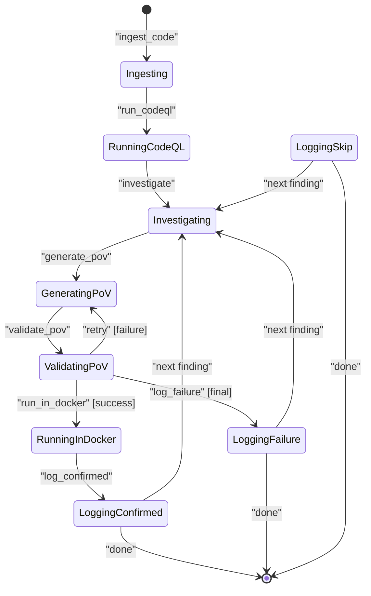

**Diagram sources**
- [app/agent_graph.py:82-169](file://app/agent_graph.py#L82-L169)
- [app/agent_graph.py:691-778](file://app/agent_graph.py#L691-L778)

**Section sources**
- [app/agent_graph.py:82-800](file://app/agent_graph.py#L82-L800)

### Background Scan Management
The scan manager coordinates asynchronous scans, persists results, tracks logs, and exposes metrics. It uses a thread pool executor to run scans off the main event loop and maintains a singleton instance for thread safety.

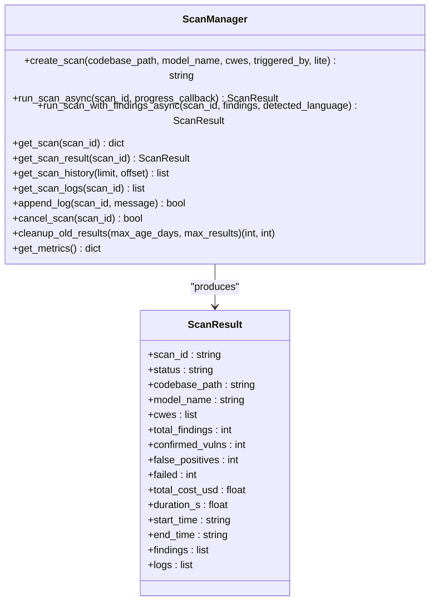

**Diagram sources**
- [app/scan_manager.py:47-663](file://app/scan_manager.py#L47-L663)

**Section sources**
- [app/scan_manager.py:47-663](file://app/scan_manager.py#L47-L663)

### Adaptive Model Policy Routing
The policy router selects models for each stage (investigate, PoV) based on routing mode:
- Fixed: use a configured model
- Auto router: use a configurable router model
- Learning: choose the best-performing model from the learning store

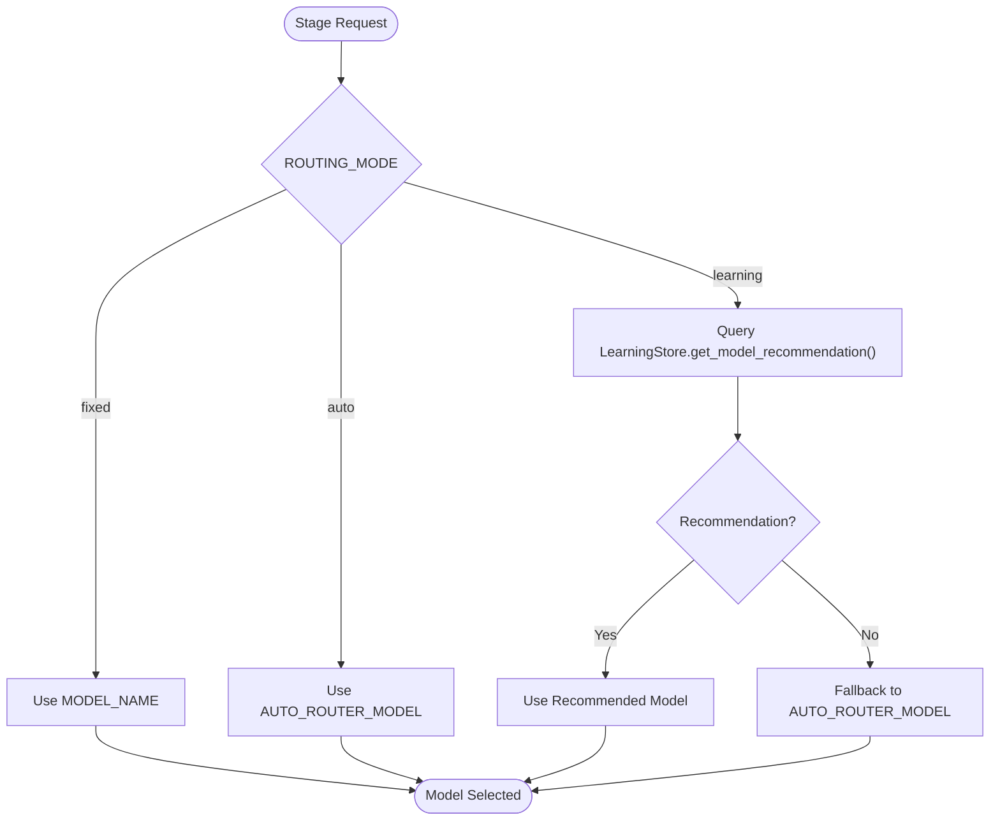

**Diagram sources**
- [app/policy.py:12-40](file://app/policy.py#L12-L40)
- [app/learning_store.py:188-248](file://app/learning_store.py#L188-L248)

**Section sources**
- [app/policy.py:12-40](file://app/policy.py#L12-L40)
- [app/learning_store.py:188-248](file://app/learning_store.py#L188-L248)

### Learning Store for Performance Tracking
The learning store persists investigation outcomes and PoV runs to a SQLite database. It aggregates model performance and recommends models for future scans.

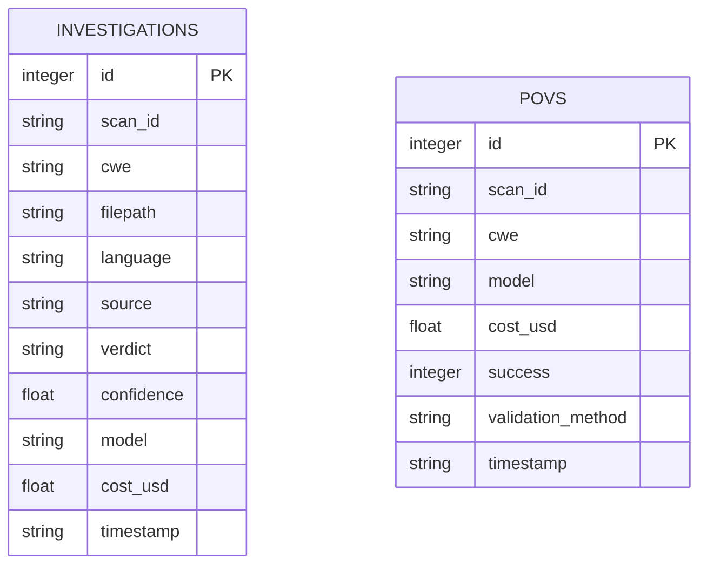

**Diagram sources**
- [app/learning_store.py:25-59](file://app/learning_store.py#L25-L59)

**Section sources**
- [app/learning_store.py:14-256](file://app/learning_store.py#L14-L256)

### Configuration Management System
Settings encapsulate environment-driven configuration for models, tools, directories, and feature flags. It validates model mode, checks tool availability, and ensures required directories exist.

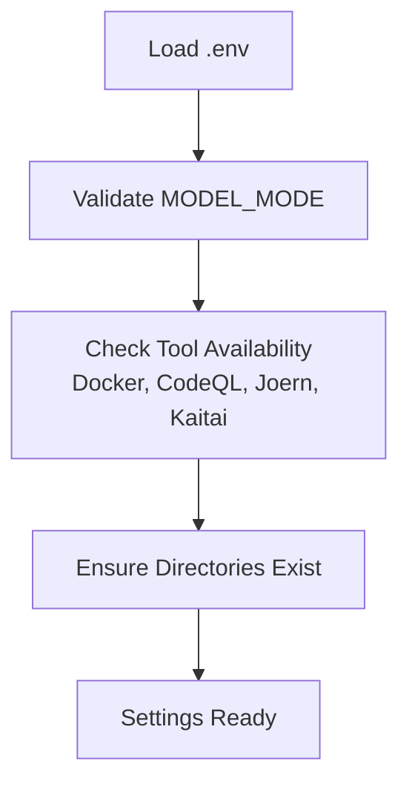

**Diagram sources**
- [app/config.py:13-255](file://app/config.py#L13-L255)

**Section sources**
- [app/config.py:13-255](file://app/config.py#L13-L255)

### Authentication and Authorization
- Bearer token authentication for API endpoints
- Admin-only endpoints protected by admin key verification
- Per-key rate limiting for scan-triggering endpoints
- API key storage with secure hashing and revocation

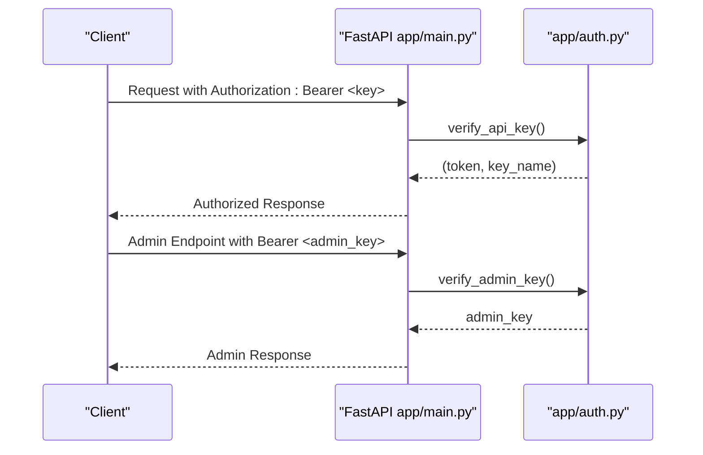

**Diagram sources**
- [app/main.py:188-201](file://app/main.py#L188-L201)
- [app/auth.py:192-251](file://app/auth.py#L192-L251)

**Section sources**
- [app/auth.py:40-256](file://app/auth.py#L40-L256)

### Git Repository Handling
The Git handler manages repository accessibility checks, cloning with credentials injection, branch verification, and cleanup. It supports GitHub, GitLab, and Bitbucket providers.

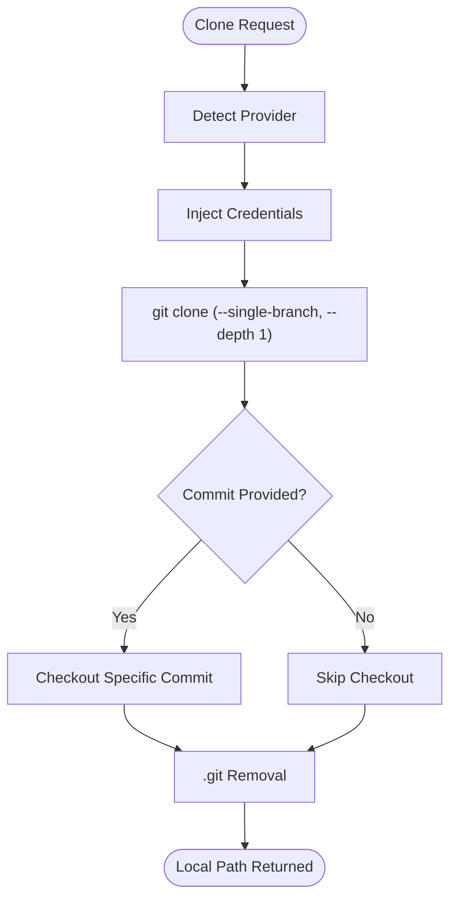

**Diagram sources**
- [app/git_handler.py:20-392](file://app/git_handler.py#L20-L392)

**Section sources**
- [app/git_handler.py:20-392](file://app/git_handler.py#L20-L392)

### Source Code Processing
The source handler supports ZIP/TAR extraction, file/folder uploads, and raw code paste. It enforces path traversal protection and preserves structure when requested.

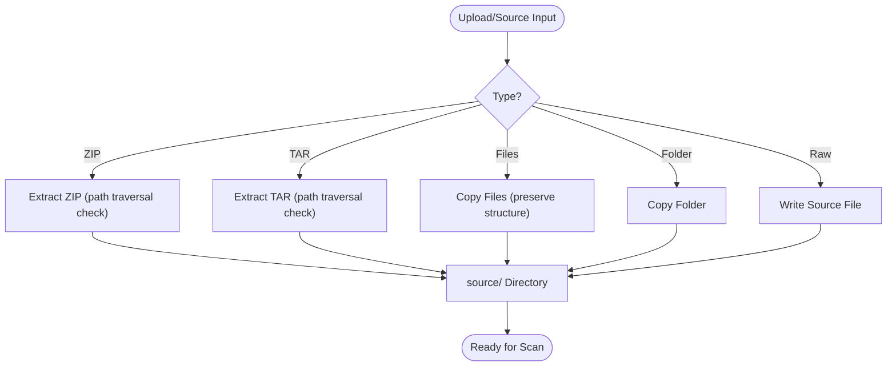

**Diagram sources**
- [app/source_handler.py:18-382](file://app/source_handler.py#L18-L382)

**Section sources**
- [app/source_handler.py:18-382](file://app/source_handler.py#L18-L382)

### Webhook Integration
Webhook handler verifies signatures/tokens and parses provider events to trigger scans. It supports GitHub and GitLab webhooks and returns structured responses.

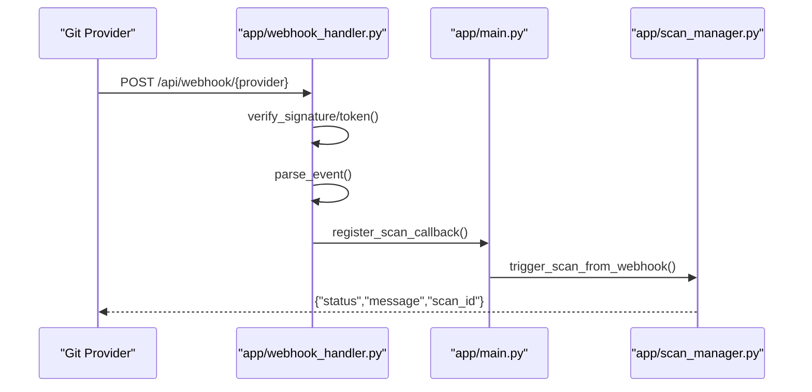

**Diagram sources**
- [app/webhook_handler.py:15-363](file://app/webhook_handler.py#L15-L363)
- [app/main.py:134-173](file://app/main.py#L134-L173)

**Section sources**
- [app/webhook_handler.py:15-363](file://app/webhook_handler.py#L15-L363)
- [app/main.py:134-173](file://app/main.py#L134-L173)

### Report Generation
The report generator creates JSON and PDF reports summarizing findings, PoV outcomes, model usage, and metrics. It optionally integrates with OpenRouter activity for detailed usage attribution.

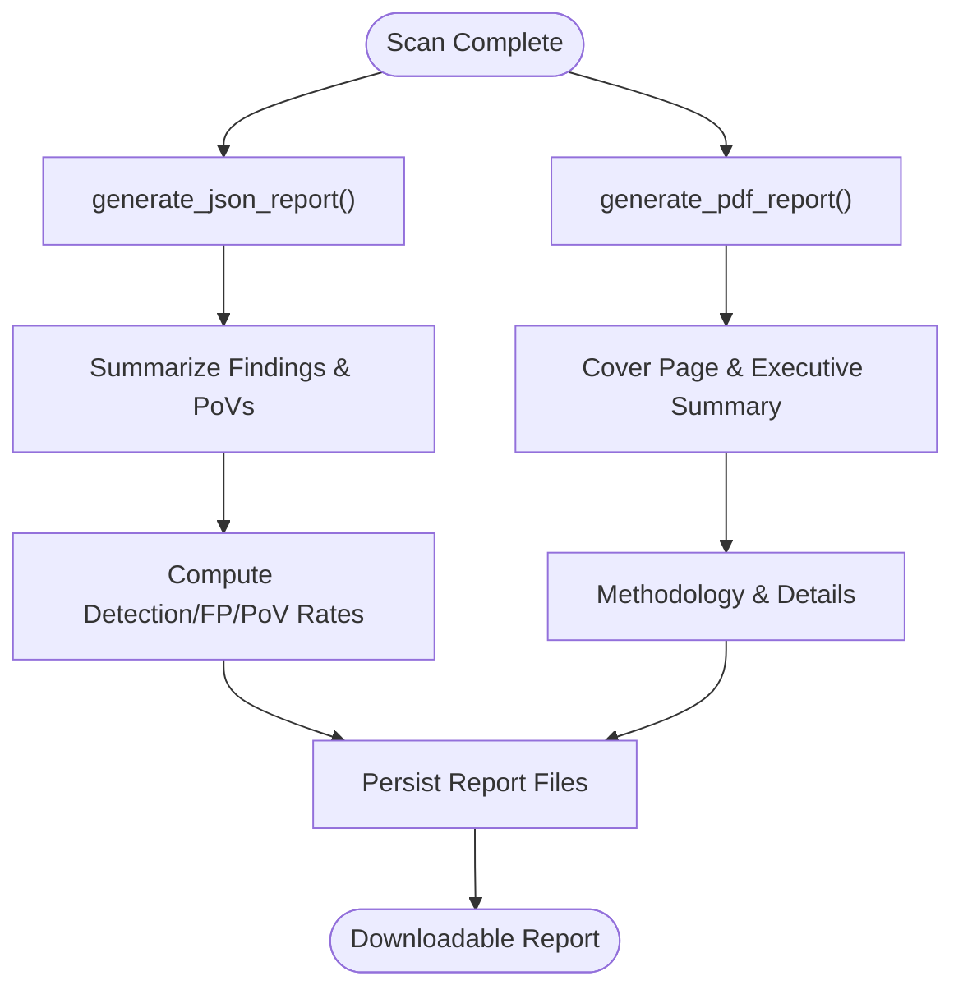

**Diagram sources**
- [app/report_generator.py:200-830](file://app/report_generator.py#L200-L830)

**Section sources**
- [app/report_generator.py:200-830](file://app/report_generator.py#L200-L830)

### Real-Time Streaming Capabilities
The SSE endpoint streams scan logs and final results to clients. It polls scan state and yields new log entries until completion.

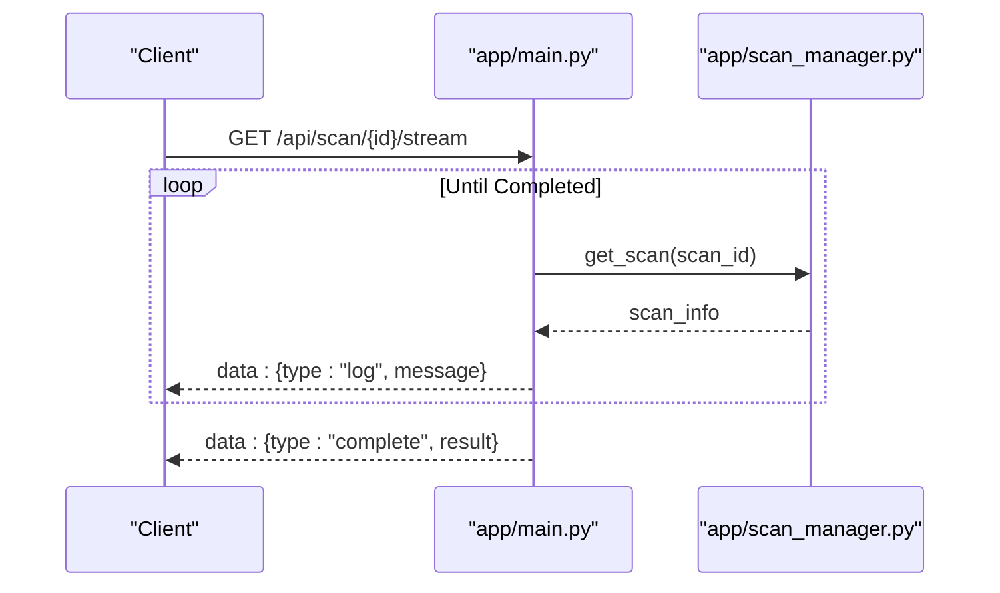

**Diagram sources**
- [app/main.py:548-584](file://app/main.py#L548-L584)
- [app/scan_manager.py:419-422](file://app/scan_manager.py#L419-L422)

**Section sources**
- [app/main.py:548-584](file://app/main.py#L548-L584)

## Dependency Analysis
The backend exhibits clear separation of concerns:
- FastAPI app depends on configuration, authentication, scan manager, agent graph, handlers, and report generator
- Agent graph depends on policy router, learning store, and agent components
- Scan manager depends on agent graph and persistence
- Handlers depend on configuration and external tools
- Report generator depends on scan results and optional OpenRouter activity

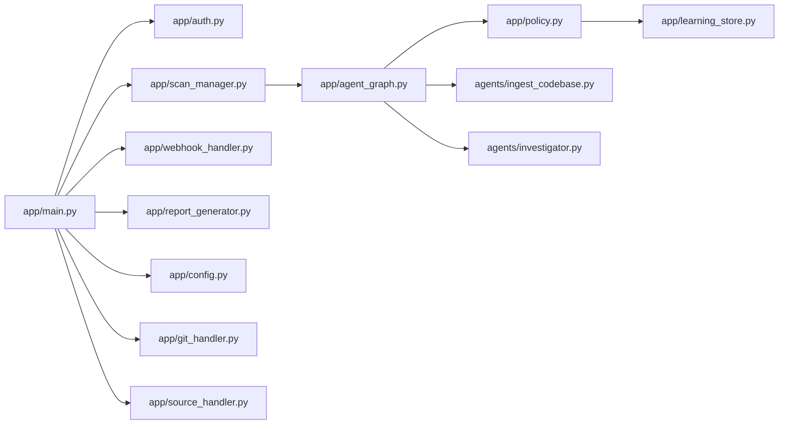

**Diagram sources**
- [app/main.py:19-28](file://app/main.py#L19-L28)
- [app/agent_graph.py:19-29](file://app/agent_graph.py#L19-L29)
- [app/scan_manager.py:18-21](file://app/scan_manager.py#L18-L21)

**Section sources**
- [app/main.py:19-28](file://app/main.py#L19-L28)
- [app/agent_graph.py:19-29](file://app/agent_graph.py#L19-L29)
- [app/scan_manager.py:18-21](file://app/scan_manager.py#L18-L21)

## Performance Considerations
- Asynchronous execution: Scans run in thread pool executors to avoid blocking the event loop
- Vector store batching: ChromaDB ingestion batches embeddings to reduce overhead
- Tool availability checks: CodeQL, Docker, and other tools are checked before use to avoid retries
- Cost tracking: Token usage and costs are recorded per finding to control spending
- Cleanup: Old results and temporary directories are cleaned up to prevent disk growth

[No sources needed since this section provides general guidance]

## Troubleshooting Guide
Common issues and resolutions:
- Authentication failures: Ensure Authorization header includes a valid Bearer token or api_key query param; admin endpoints require ADMIN_API_KEY
- Rate limit exceeded: Exceeded per-key scan rate; wait for the rate limit window to reset
- Repository access denied: Configure provider tokens (GITHUB_TOKEN, GITLAB_TOKEN, BITBUCKET_TOKEN) and verify branch/commit
- CodeQL not available: Install CodeQL CLI and ensure it is on PATH; otherwise, the system falls back to LLM-only analysis
- Docker disabled/unavailable: Some PoV validations may be skipped; enable DOCKER_ENABLED and ensure Docker is installed
- Large repository timeouts: Prefer ZIP upload for very large repositories; shallow clones are used to reduce time
- Report generation errors: Ensure fpdf2 is installed for PDF reports; JSON reports are always available

**Section sources**
- [app/auth.py:192-251](file://app/auth.py#L192-L251)
- [app/git_handler.py:251-294](file://app/git_handler.py#L251-L294)
- [app/config.py:162-211](file://app/config.py#L162-L211)
- [app/report_generator.py:264-268](file://app/report_generator.py#L264-L268)

## Conclusion
AutoPoV’s backend provides a robust, modular, and scalable vulnerability detection platform. It combines FastAPI, LangGraph, and adaptive model routing to deliver accurate and efficient assessments. With comprehensive authentication, real-time streaming, webhook automation, and detailed reporting, it supports both interactive and CI/CD-driven workflows.

[No sources needed since this section summarizes without analyzing specific files]

## Appendices

### API Endpoints Reference
- GET /api/health: Health status and tool availability
- GET /api/config: System configuration (supported CWEs, routing mode, model settings)
- POST /api/scan/git: Initiate scan from Git repository
- POST /api/scan/zip: Initiate scan from ZIP upload
- POST /api/scan/paste: Initiate scan from raw code paste
- POST /api/scan/{scan_id}/replay: Replay findings with selected models
- POST /api/scan/{scan_id}/cancel: Cancel a running scan
- GET /api/scan/{scan_id}: Get scan status and results
- GET /api/scan/{scan_id}/stream: Stream logs via SSE
- GET /api/history: Scan history
- GET /api/metrics: System metrics
- GET /api/report/{scan_id}?format=json|pdf: Download report
- POST /api/webhook/github: GitHub webhook
- POST /api/webhook/gitlab: GitLab webhook
- POST /api/keys/generate: Generate API key (admin)
- GET /api/keys: List API keys (admin)
- DELETE /api/keys/{id}: Revoke API key (admin)
- POST /api/admin/cleanup: Cleanup old results (admin)

**Section sources**
- [app/main.py:175-768](file://app/main.py#L175-L768)

### Configuration Options
Key environment variables and settings:
- Model selection: MODEL_MODE, MODEL_NAME, OPENROUTER_API_KEY, OLLAMA_BASE_URL
- Routing: ROUTING_MODE, AUTO_ROUTER_MODEL, LEARNING_DB_PATH
- Tools: CODEQL_CLI_PATH, CODEQL_PACKS_BASE, DOCKER_ENABLED, JOERN_CLI_PATH
- Security: ADMIN_API_KEY, WEBHOOK_SECRET, GITHUB_WEBHOOK_SECRET, GITLAB_WEBHOOK_SECRET
- Paths: DATA_DIR, RESULTS_DIR, RUNS_DIR, SNAPSHOT_DIR, CHROMA_PERSIST_DIR
- Limits: MAX_COST_USD, COST_TRACKING_ENABLED, SCOUT_MAX_COST_USD

**Section sources**
- [app/config.py:13-255](file://app/config.py#L13-L255)