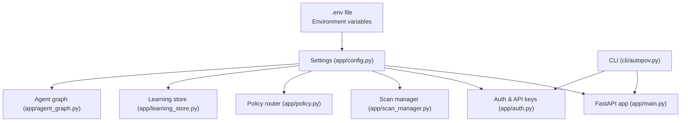
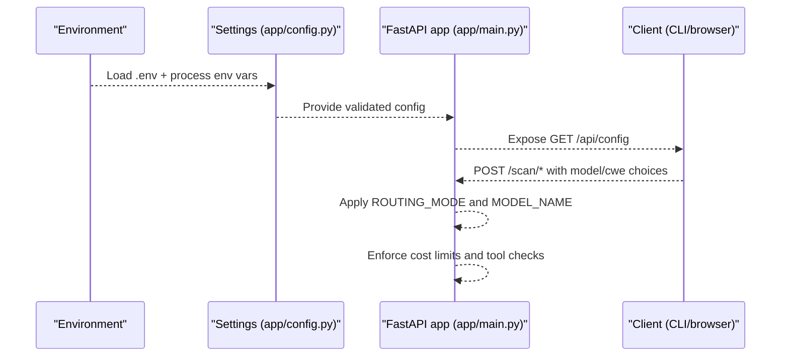
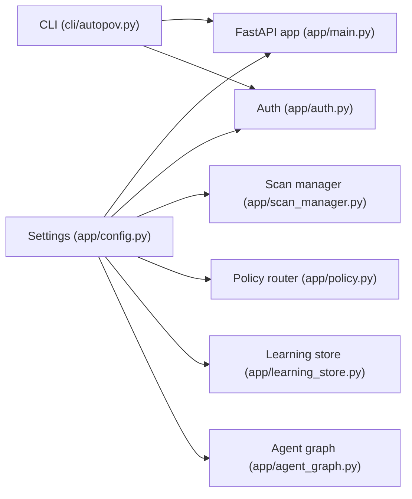

# Configuration System

<cite>
**Referenced Files in This Document**
- [app/config.py](file://app/config.py)
- [app/main.py](file://app/main.py)
- [app/auth.py](file://app/auth.py)
- [app/scan_manager.py](file://app/scan_manager.py)
- [app/agent_graph.py](file://app/agent_graph.py)
- [app/policy.py](file://app/policy.py)
- [app/learning_store.py](file://app/learning_store.py)
- [cli/autopov.py](file://cli/autopov.py)
- [data/api_keys.json](file://data/api_keys.json)
</cite>

## Table of Contents
1. [Introduction](#introduction)
2. [Project Structure](#project-structure)
3. [Core Components](#core-components)
4. [Architecture Overview](#architecture-overview)
5. [Detailed Component Analysis](#detailed-component-analysis)
6. [Dependency Analysis](#dependency-analysis)
7. [Performance Considerations](#performance-considerations)
8. [Troubleshooting Guide](#troubleshooting-guide)
9. [Conclusion](#conclusion)
10. [Appendices](#appendices)

## Introduction
This document explains AutoPoV’s configuration management system. It covers environment-based configuration loading, validation mechanisms, runtime checks, and how configuration parameters influence LLM providers, tool integrations, security settings, and performance tuning. It also documents the configuration hierarchy, defaults, overrides, and best practices for secure and reliable operation.

## Project Structure
AutoPoV centralizes configuration in a single Pydantic-based settings class that loads from environment variables and an optional .env file. The FastAPI application consumes these settings at startup and runtime. The CLI reads environment variables and a user-local config file for convenience. Supporting modules (authentication, scanning, routing, learning) consume settings to enforce policies and adapt behavior.

**Diagram sources**
- [app/config.py:150-154](file://app/config.py#L150-L154)
- [app/main.py:19](file://app/main.py#L19)
- [app/auth.py:19](file://app/auth.py#L19)
- [app/scan_manager.py:18](file://app/scan_manager.py#L18)
- [app/policy.py:8](file://app/policy.py#L8)
- [app/learning_store.py:11](file://app/learning_store.py#L11)
- [app/agent_graph.py:19](file://app/agent_graph.py#L19)
- [cli/autopov.py:26](file://cli/autopov.py#L26)

**Section sources**
- [app/config.py:150-154](file://app/config.py#L150-L154)
- [app/main.py:19](file://app/main.py#L19)
- [cli/autopov.py:26](file://cli/autopov.py#L26)

## Core Components
- Settings class: Loads environment variables, validates constrained fields, exposes helpers for tool availability and LLM configuration, and ensures required directories exist.
- FastAPI app: Reads settings for startup, CORS, health checks, and runtime behavior.
- Authentication: Uses settings for admin key verification and stores API keys in a file-backed store.
- Scan manager: Consumes settings for routing mode, model selection, and cost tracking.
- Policy router: Selects models based on routing mode and learned performance.
- Learning store: Persists outcomes to inform model selection.
- CLI: Reads environment variables and a user config file for API key convenience.

**Section sources**
- [app/config.py:13-254](file://app/config.py#L13-L254)
- [app/main.py:98-122](file://app/main.py#L98-L122)
- [app/auth.py:40-186](file://app/auth.py#L40-L186)
- [app/scan_manager.py:47-114](file://app/scan_manager.py#L47-L114)
- [app/policy.py:12-39](file://app/policy.py#L12-L39)
- [app/learning_store.py:14-200](file://app/learning_store.py#L14-L200)
- [cli/autopov.py:29-54](file://cli/autopov.py#L29-L54)

## Architecture Overview
The configuration system is environment-driven and validated at load time. At runtime, the app exposes configuration via an endpoint and uses settings to control routing, tool availability, and cost limits.

**Diagram sources**
- [app/config.py:150-154](file://app/config.py#L150-L154)
- [app/main.py:188-200](file://app/main.py#L188-L200)
- [app/main.py:204-285](file://app/main.py#L204-L285)

## Detailed Component Analysis

### Settings: Environment-Based Loading and Validation
- Loads from .env and process environment variables.
- Validates constrained fields (e.g., MODEL_MODE).
- Provides helpers to check tool availability and build LLM configuration.
- Ensures required directories exist at import time.

Key behaviors:
- Environment file binding and encoding are configured.
- Field validators constrain MODEL_MODE to “online” or “offline”.
- Tool availability checks wrap external CLI invocations with timeouts.
- LLM configuration builder returns provider-specific settings based on MODEL_MODE.

**Section sources**
- [app/config.py:150-154](file://app/config.py#L150-L154)
- [app/config.py:156-160](file://app/config.py#L156-L160)
- [app/config.py:162-210](file://app/config.py#L162-L210)
- [app/config.py:212-231](file://app/config.py#L212-L231)
- [app/config.py:233-245](file://app/config.py#L233-L245)

### FastAPI App: Using Settings at Runtime
- Uses settings for CORS origins, health checks, and startup/shutdown.
- Exposes GET /api/config to return supported CWEs and operational flags.
- Applies routing mode and model selection in scan endpoints.

Operational impact:
- Health endpoint reflects Docker and static analysis tool availability.
- Configuration endpoint surfaces routing mode and model settings.

**Section sources**
- [app/main.py:124-131](file://app/main.py#L124-L131)
- [app/main.py:176-185](file://app/main.py#L176-L185)
- [app/main.py:188-200](file://app/main.py#L188-L200)
- [app/main.py:204-285](file://app/main.py#L204-L285)

### Authentication and API Keys: Security Configuration
- Admin API key is compared using constant-time comparison.
- API keys are stored in a JSON file with hashed values and metadata.
- Rate limiting is enforced per key per time window.

Security considerations:
- Admin key validation uses timing-safe comparison.
- API key storage avoids exposing plaintext keys.
- Rate limiting protects against abuse.

**Section sources**
- [app/auth.py:180-186](file://app/auth.py#L180-L186)
- [app/auth.py:107-127](file://app/auth.py#L107-L127)
- [app/auth.py:129-146](file://app/auth.py#L129-L146)
- [data/api_keys.json:1-42](file://data/api_keys.json#L1-L42)

### Scan Manager: Applying Configuration
- Creates scans with model name and CWE lists derived from settings.
- Uses routing mode to decide whether to fix a model or auto-route.
- Manages concurrency and persistence of scan state.

**Section sources**
- [app/scan_manager.py:74-114](file://app/scan_manager.py#L74-L114)
- [app/scan_manager.py:117-200](file://app/scan_manager.py#L117-L200)

### Policy Router: Model Selection Based on Configuration
- Fixed mode: always uses MODEL_NAME.
- Auto router mode: uses AUTO_ROUTER_MODEL.
- Learning mode: uses historical performance to recommend models, falling back to auto router if no data.

**Section sources**
- [app/policy.py:18-32](file://app/policy.py#L18-L32)

### Learning Store: Persisting Outcomes
- Stores investigation and PoV outcomes in SQLite.
- Aggregates performance metrics for model recommendation.
- Supports model recommendation retrieval.

**Section sources**
- [app/learning_store.py:14-200](file://app/learning_store.py#L14-L200)

### CLI: Environment Setup and Overrides
- Reads AUTOPOV_API_URL for backend base URL.
- Retrieves API key from environment or a user-local config file.
- Provides model selection and scan controls.

**Section sources**
- [cli/autopov.py:26](file://cli/autopov.py#L26)
- [cli/autopov.py:29-54](file://cli/autopov.py#L29-L54)
- [cli/autopov.py:118-133](file://cli/autopov.py#L118-L133)

## Dependency Analysis
Configuration dependencies across modules:

**Diagram sources**
- [app/config.py:248-254](file://app/config.py#L248-L254)
- [app/main.py:19](file://app/main.py#L19)
- [app/auth.py:19](file://app/auth.py#L19)
- [app/scan_manager.py:18](file://app/scan_manager.py#L18)
- [app/policy.py:8](file://app/policy.py#L8)
- [app/learning_store.py:11](file://app/learning_store.py#L11)
- [app/agent_graph.py:19](file://app/agent_graph.py#L19)
- [cli/autopov.py:26](file://cli/autopov.py#L26)

**Section sources**
- [app/config.py:248-254](file://app/config.py#L248-L254)
- [app/main.py:19](file://app/main.py#L19)
- [app/auth.py:19](file://app/auth.py#L19)
- [app/scan_manager.py:18](file://app/scan_manager.py#L18)
- [app/policy.py:8](file://app/policy.py#L8)
- [app/learning_store.py:11](file://app/learning_store.py#L11)
- [app/agent_graph.py:19](file://app/agent_graph.py#L19)
- [cli/autopov.py:26](file://cli/autopov.py#L26)

## Performance Considerations
- Cost control: MAX_COST_USD and COST_TRACKING_ENABLED cap spending; enforcement occurs during scans.
- Concurrency: ThreadPoolExecutor in ScanManager balances CPU-bound tasks; tune workers based on hardware.
- Tool availability checks: Subprocess calls with timeouts prevent stalls; ensure external CLIs are installed and fast.
- Model selection: Auto router and learning modes reduce latency by choosing better-performing models.

[No sources needed since this section provides general guidance]

## Troubleshooting Guide
Common configuration issues and resolutions:
- Invalid MODEL_MODE: Ensure MODEL_MODE is “online” or “offline”.
- Missing LLM keys: Configure OPENROUTER_API_KEY for online mode or ensure Ollama is running for offline mode.
- Tool not found: Install and make available CodeQL, Joern, or Kaitai Struct compiler; settings expose availability checks.
- API key problems: Verify ADMIN_API_KEY for admin endpoints and ensure user API keys are stored and active.
- Rate limiting: If receiving 429 errors, reduce request frequency or increase limits by adjusting rate window and thresholds.
- Health checks: Use GET /api/health to confirm Docker and static analysis tool availability.

**Section sources**
- [app/config.py:156-160](file://app/config.py#L156-L160)
- [app/config.py:162-210](file://app/config.py#L162-L210)
- [app/auth.py:180-186](file://app/auth.py#L180-L186)
- [app/auth.py:129-146](file://app/auth.py#L129-L146)
- [app/main.py:176-185](file://app/main.py#L176-L185)

## Conclusion
AutoPoV’s configuration system is environment-first, validated at load time, and consumed consistently across the application. It supports flexible LLM providers, robust security controls, and operational safeguards like cost caps and tool availability checks. By adhering to the hierarchy and validation rules documented here, operators can reliably configure AutoPoV for development, CI, and production environments.

[No sources needed since this section summarizes without analyzing specific files]

## Appendices

### Configuration Parameters Reference
- Application
  - APP_NAME, APP_VERSION, DEBUG
- API
  - API_HOST, API_PORT, API_PREFIX
- Security
  - ADMIN_API_KEY, WEBHOOK_SECRET
- LLM Providers
  - MODEL_MODE (“online” | “offline”), MODEL_NAME, OPENROUTER_API_KEY, OPENROUTER_BASE_URL, OLLAMA_BASE_URL
  - ONLINE_MODELS, OFFLINE_MODELS
- Routing and Learning
  - ROUTING_MODE (“auto” | “fixed” | “learning”), AUTO_ROUTER_MODEL, LEARNING_DB_PATH
- Scout Settings
  - SCOUT_ENABLED, SCOUT_LLM_ENABLED, SCOUT_MAX_FILES, SCOUT_MAX_CHARS_PER_FILE, SCOUT_MAX_FINDINGS, SCOUT_MAX_COST_USD
- Version Control Tokens
  - GITHUB_TOKEN, GITLAB_TOKEN, BITBUCKET_TOKEN
- Webhooks
  - GITHUB_WEBHOOK_SECRET, GITLAB_WEBHOOK_SECRET
- Vector Store
  - CHROMA_PERSIST_DIR, CHROMA_COLLECTION_NAME
- Embeddings
  - EMBEDDING_MODEL_ONLINE, EMBEDDING_MODEL_OFFLINE
- Tracing
  - LANGCHAIN_TRACING_V2, LANGCHAIN_API_KEY, LANGCHAIN_PROJECT
- Code Analysis Tools
  - CODEQL_CLI_PATH, CODEQL_PACKS_BASE, JOERN_CLI_PATH, KAITAI_STRUCT_COMPILER_PATH
- Docker
  - DOCKER_ENABLED, DOCKER_IMAGE, DOCKER_TIMEOUT, DOCKER_MEMORY_LIMIT, DOCKER_CPU_LIMIT
- Cost Controls
  - MAX_COST_USD, COST_TRACKING_ENABLED
- Scanning Tuning
  - MAX_CHUNK_SIZE, CHUNK_OVERLAP, MAX_RETRIES
- Supported CWEs
  - SUPPORTED_CWES (list)
- Paths
  - DATA_DIR, RESULTS_DIR, POVS_DIR, RUNS_DIR, TEMP_DIR, SNAPSHOT_DIR
- Snapshots
  - SAVE_CODEBASE_SNAPSHOT
- Frontend
  - FRONTEND_URL

**Section sources**
- [app/config.py:16-154](file://app/config.py#L16-L154)

### Configuration Hierarchy and Overrides
- Highest precedence: Environment variables override .env values.
- Default values are embedded in the Settings class.
- Runtime overrides occur via API endpoints (e.g., selecting models per scan) but do not alter persistent settings.

**Section sources**
- [app/config.py:150-154](file://app/config.py#L150-L154)

### Security Best Practices
- Store ADMIN_API_KEY securely and avoid committing it to repositories.
- Use short-lived API keys and revoke unused ones regularly.
- Enable rate limiting and monitor logs for suspicious activity.
- Keep external tool binaries updated and restrict permissions where applicable.

**Section sources**
- [app/auth.py:180-186](file://app/auth.py#L180-L186)
- [app/auth.py:107-127](file://app/auth.py#L107-L127)

### Production Configuration Checklist
- Confirm MODEL_MODE aligns with infrastructure (online vs. offline).
- Validate tool availability via GET /api/health.
- Set MAX_COST_USD and enable COST_TRACKING_ENABLED.
- Configure routing mode appropriate for workload (auto/learning vs. fixed).
- Secure ADMIN_API_KEY and rotate API keys periodically.

**Section sources**
- [app/main.py:176-185](file://app/main.py#L176-L185)
- [app/config.py:99-101](file://app/config.py#L99-L101)
- [app/policy.py:18-32](file://app/policy.py#L18-L32)