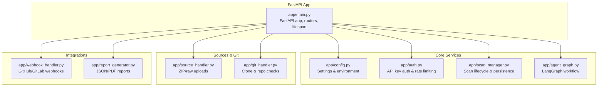
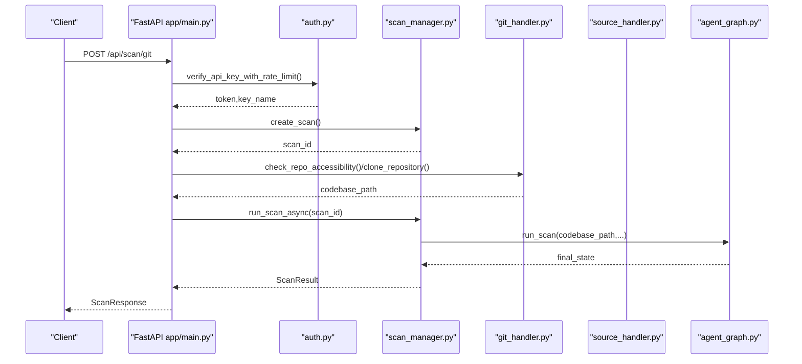
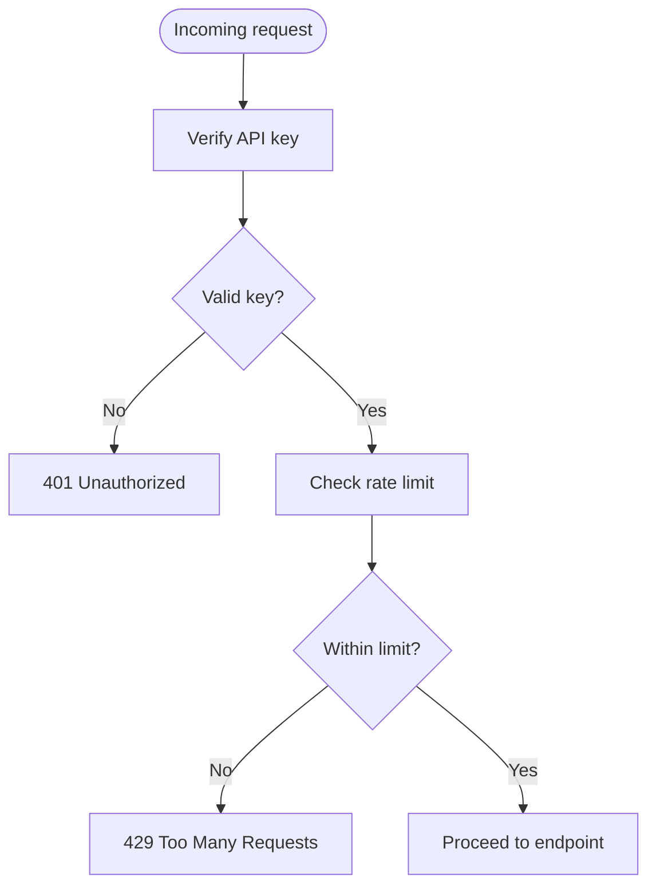
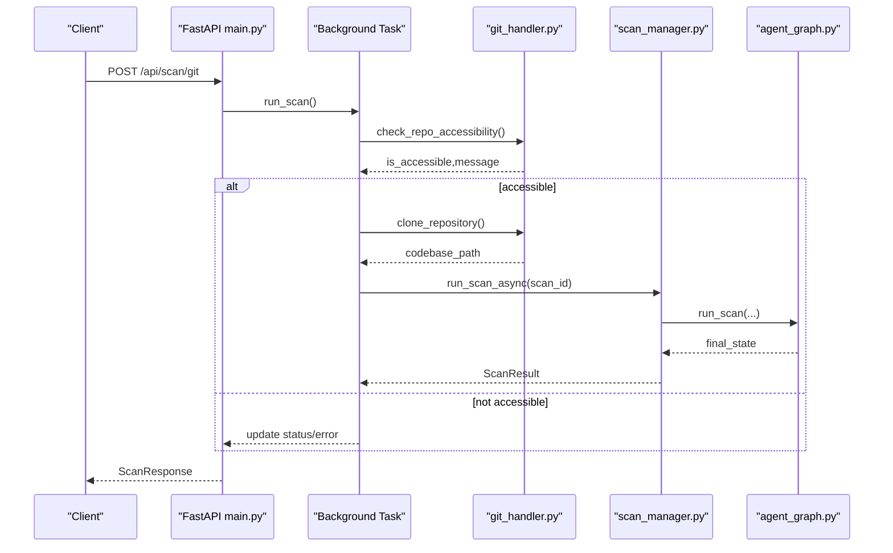
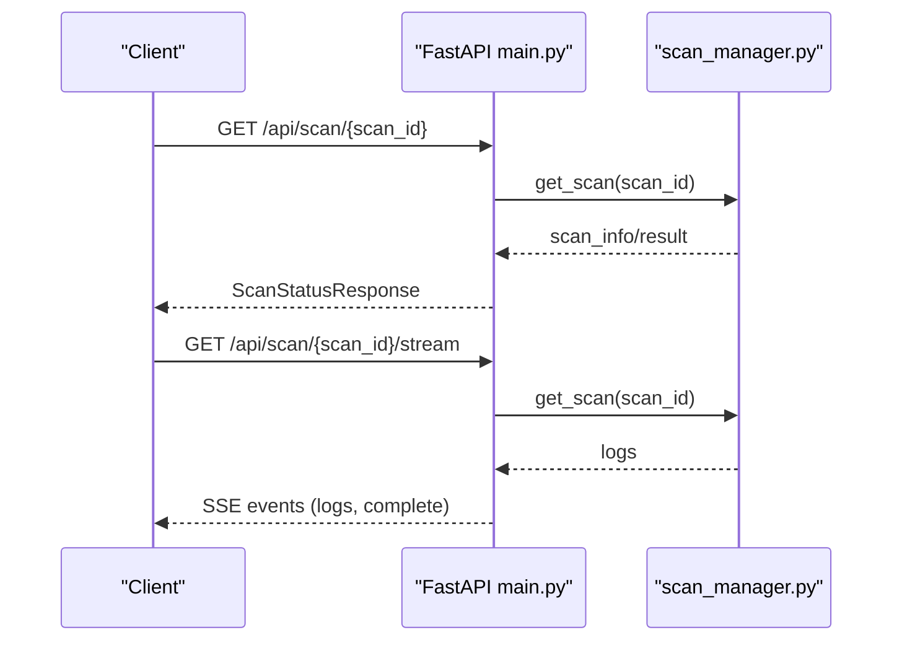
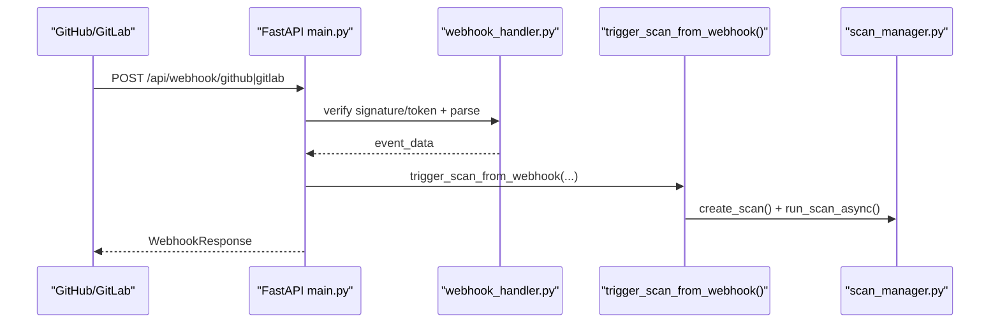
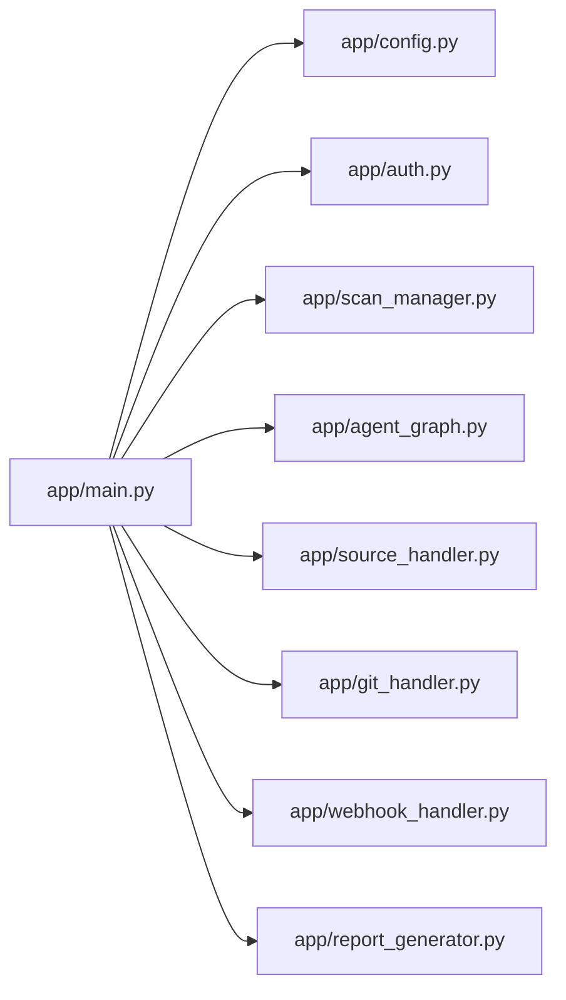

# FastAPI Application

<cite>
**Referenced Files in This Document**
- [app/main.py](file://app/main.py)
- [app/config.py](file://app/config.py)
- [app/auth.py](file://app/auth.py)
- [app/scan_manager.py](file://app/scan_manager.py)
- [app/webhook_handler.py](file://app/webhook_handler.py)
- [app/source_handler.py](file://app/source_handler.py)
- [app/git_handler.py](file://app/git_handler.py)
- [app/report_generator.py](file://app/report_generator.py)
- [app/agent_graph.py](file://app/agent_graph.py)
</cite>

## Table of Contents
1. [Introduction](#introduction)
2. [Project Structure](#project-structure)
3. [Core Components](#core-components)
4. [Architecture Overview](#architecture-overview)
5. [Detailed Component Analysis](#detailed-component-analysis)
6. [Dependency Analysis](#dependency-analysis)
7. [Performance Considerations](#performance-considerations)
8. [Troubleshooting Guide](#troubleshooting-guide)
9. [Conclusion](#conclusion)

## Introduction
This document describes the AutoPoV FastAPI application entry point and its surrounding ecosystem. It covers application initialization, lifespan management, CORS configuration, middleware setup, and all API endpoints. It documents request/response models, authentication and rate-limiting mechanisms, error handling patterns, and operational guidance for performance, security, and deployment.

## Project Structure
The FastAPI application is centered around a single entry point that wires together configuration, authentication, scanning orchestration, source ingestion, Git operations, webhooks, and report generation. The application exposes REST endpoints under `/api` with OpenAPI/Swagger documentation served at `/api/docs`.

**Diagram sources**
- [app/main.py:114-131](file://app/main.py#L114-L131)
- [app/config.py:13-249](file://app/config.py#L13-L249)
- [app/auth.py:192-255](file://app/auth.py#L192-L255)
- [app/scan_manager.py:47-662](file://app/scan_manager.py#L47-L662)
- [app/agent_graph.py:82-168](file://app/agent_graph.py#L82-L168)
- [app/source_handler.py:18-381](file://app/source_handler.py#L18-L381)
- [app/git_handler.py:20-391](file://app/git_handler.py#L20-L391)
- [app/webhook_handler.py:15-362](file://app/webhook_handler.py#L15-L362)
- [app/report_generator.py:200-800](file://app/report_generator.py#L200-L800)

**Section sources**
- [app/main.py:114-131](file://app/main.py#L114-L131)
- [app/config.py:13-249](file://app/config.py#L13-L249)

## Core Components
- Application initialization and lifespan:
  - Creates FastAPI app with title, version, and docs/redoc endpoints.
  - Registers a lifespan manager to initialize directories and register webhook callbacks.
- CORS middleware:
  - Configured to allow origins from the configured frontend URL plus common dev ports.
- Authentication and rate limiting:
  - Bearer token authentication with optional query param fallback for streaming.
  - Per-key rate limiting for scan-triggering endpoints.
  - Admin-only endpoints protected by admin API key verification.
- Request/response models:
  - Pydantic models define request shapes for Git/ZIP/paste scans, status, keys, health, and webhook responses.
- Endpoint coverage:
  - Health, configuration retrieval, scan initiation (Git, ZIP, paste), status and live logs, history, report generation, webhooks, admin functions, metrics, and learning summary.

**Section sources**
- [app/main.py:94-131](file://app/main.py#L94-L131)
- [app/main.py:175-200](file://app/main.py#L175-L200)
- [app/main.py:204-400](file://app/main.py#L204-L400)
- [app/main.py:511-583](file://app/main.py#L511-L583)
- [app/main.py:586-644](file://app/main.py#L586-L644)
- [app/main.py:646-690](file://app/main.py#L646-L690)
- [app/main.py:691-767](file://app/main.py#L691-L767)

## Architecture Overview
The application follows a layered architecture:
- Entry point: FastAPI app with routers and middleware.
- Domain services: Scan manager orchestrates workflows, agent graph executes the LangGraph pipeline, and handlers manage source ingestion and Git operations.
- Integrations: Webhook handler integrates with GitHub/GitLab, and report generator produces JSON/PDF reports.
- Persistence: Scan results are persisted to JSON and CSV, with optional codebase snapshots.

**Diagram sources**
- [app/main.py:204-285](file://app/main.py#L204-L285)
- [app/auth.py:221-236](file://app/auth.py#L221-L236)
- [app/scan_manager.py:74-114](file://app/scan_manager.py#L74-L114)
- [app/git_handler.py:155-198](file://app/git_handler.py#L155-L198)
- [app/agent_graph.py:1146-1192](file://app/agent_graph.py#L1146-L1192)

## Detailed Component Analysis

### Application Initialization and Lifespan
- Lifespan:
  - On startup, ensures required directories exist and registers a webhook callback to trigger scans from webhooks.
  - On shutdown, prints a simple message.
- CORS:
  - Allows credentials and all methods/headers for configured frontend origins.

**Section sources**
- [app/main.py:94-111](file://app/main.py#L94-L111)
- [app/main.py:124-131](file://app/main.py#L124-L131)

### Authentication and Rate Limiting
- API key verification:
  - Supports Bearer token from Authorization header or query param (for SSE).
  - Validates against stored keys and tracks last used timestamps.
- Admin key verification:
  - Enforces admin-only endpoints using a dedicated admin key.
- Rate limiting:
  - Per-key sliding window: max N scans per window seconds.
  - Debounced disk writes for last_used updates.

**Diagram sources**
- [app/auth.py:192-236](file://app/auth.py#L192-L236)

**Section sources**
- [app/auth.py:192-255](file://app/auth.py#L192-L255)

### Request/Response Models
- ScanGitRequest: URL, optional token/branch, model, CWE list.
- ScanPasteRequest: code, optional language/filename, model, CWE list.
- ReplayRequest: models list, include_failed flag, max_findings.
- ScanResponse: scan_id, status, message.
- ScanStatusResponse: status, progress, logs, result, findings, error.
- APIKeyResponse/APIKeyListResponse: key/key list metadata.
- HealthResponse: status, version, tool availability flags.
- WebhookResponse: status, message, optional scan_id.

**Section sources**
- [app/main.py:31-91](file://app/main.py#L31-L91)

### Scan Endpoints
- Git scan:
  - Validates repository accessibility, clones repository, sets codebase path, and runs scan asynchronously.
  - Uses a new event loop per background task to avoid blocking.
- ZIP upload:
  - Reads file content (non-thread-safe UploadFile), saves to temp, extracts, and runs scan.
- Paste:
  - Writes raw code to a temporary file, then runs scan.

**Diagram sources**
- [app/main.py:204-285](file://app/main.py#L204-L285)
- [app/git_handler.py:155-198](file://app/git_handler.py#L155-L198)
- [app/scan_manager.py:234-264](file://app/scan_manager.py#L234-L264)
- [app/agent_graph.py:1146-1192](file://app/agent_graph.py#L1146-L1192)

**Section sources**
- [app/main.py:204-400](file://app/main.py#L204-L400)
- [app/git_handler.py:155-294](file://app/git_handler.py#L155-L294)
- [app/scan_manager.py:234-366](file://app/scan_manager.py#L234-L366)

### Status Monitoring and Streaming Logs
- GET /api/scan/{scan_id} returns current status, progress, logs, findings, and result.
- GET /api/scan/{scan_id}/stream streams logs via Server-Sent Events until completion.

**Diagram sources**
- [app/main.py:511-583](file://app/main.py#L511-L583)
- [app/scan_manager.py:419-493](file://app/scan_manager.py#L419-L493)

**Section sources**
- [app/main.py:511-583](file://app/main.py#L511-L583)
- [app/scan_manager.py:419-493](file://app/scan_manager.py#L419-L493)

### History, Metrics, and Learning Summary
- GET /api/history lists recent scans with pagination.
- GET /api/metrics returns aggregated metrics across historical scans.
- GET /api/learning/summary returns learning store summaries and model stats.

**Section sources**
- [app/main.py:586-595](file://app/main.py#L586-L595)
- [app/main.py:745-757](file://app/main.py#L745-L757)
- [app/scan_manager.py:604-653](file://app/scan_manager.py#L604-L653)

### Report Generation
- GET /api/report/{scan_id}?format=json|pdf generates a comprehensive report.
- JSON report includes scan summary, model usage, metrics, findings, and methodology.
- PDF report uses a professional template with sections for executive summary, confirmed vulnerabilities, false positives, model usage, methodology, and appendix.

**Section sources**
- [app/main.py:599-644](file://app/main.py#L599-L644)
- [app/report_generator.py:200-800](file://app/report_generator.py#L200-L800)

### Webhook Handling
- GitHub: verifies HMAC signature, parses push/PR events, triggers scan via callback.
- GitLab: verifies token, parses push/MR events, triggers scan via callback.
- Both endpoints return structured WebhookResponse.

**Diagram sources**
- [app/main.py:646-690](file://app/main.py#L646-L690)
- [app/webhook_handler.py:196-336](file://app/webhook_handler.py#L196-L336)
- [app/main.py:134-172](file://app/main.py#L134-L172)
- [app/scan_manager.py:74-114](file://app/scan_manager.py#L74-L114)

**Section sources**
- [app/main.py:646-690](file://app/main.py#L646-L690)
- [app/webhook_handler.py:15-362](file://app/webhook_handler.py#L15-L362)

### Administrative Functions
- Generate API key (admin-only).
- List API keys (admin-only).
- Revoke API key (admin-only).
- Cleanup old results (admin-only).

**Section sources**
- [app/main.py:691-767](file://app/main.py#L691-L767)
- [app/auth.py:40-178](file://app/auth.py#L40-L178)

## Dependency Analysis
- FastAPI app depends on:
  - Settings for configuration and environment.
  - Auth for API key management and rate limiting.
  - Scan manager for lifecycle and persistence.
  - Agent graph for the LangGraph workflow.
  - Source and Git handlers for ingestion.
  - Webhook handler for external triggers.
  - Report generator for output artifacts.

**Diagram sources**
- [app/main.py:19-27](file://app/main.py#L19-L27)

**Section sources**
- [app/main.py:19-27](file://app/main.py#L19-L27)

## Performance Considerations
- Asynchronous execution:
  - Scans run in background tasks with new event loops to avoid blocking the main thread.
- Concurrency and resource limits:
  - Thread pool executor is used for CPU-bound work; tune workers according to hardware.
- Cost control:
  - Cost tracking enabled by default; consider setting MAX_COST_USD to constrain spending.
- Disk cleanup:
  - Old results can be cleaned up to prevent unbounded growth; use admin endpoint to reclaim space.
- Tool availability checks:
  - CodeQL and Docker availability are checked before use; fallbacks engage when unavailable.

[No sources needed since this section provides general guidance]

## Troubleshooting Guide
- Authentication failures:
  - Ensure Authorization header uses Bearer token or pass api_key via query param for streaming.
  - Admin endpoints require ADMIN_API_KEY configured.
- Rate limiting:
  - Exceeded max scans per key per window; wait for the next window or reduce request frequency.
- Git scan failures:
  - Private repositories require provider tokens; verify GITHUB_TOKEN/GITLAB_TOKEN/BITBUCKET_TOKEN.
  - Large repositories may fail to clone; prefer ZIP upload for very large codebases.
- Webhook signatures/tokens:
  - GitHub requires GITHUB_WEBHOOK_SECRET; GitLab requires GITLAB_WEBHOOK_SECRET.
- Report generation:
  - PDF requires fpdf2; install dependency if generating PDF reports.

**Section sources**
- [app/auth.py:192-255](file://app/auth.py#L192-L255)
- [app/git_handler.py:27-43](file://app/git_handler.py#L27-L43)
- [app/webhook_handler.py:25-73](file://app/webhook_handler.py#L25-L73)
- [app/report_generator.py:17-21](file://app/report_generator.py#L17-L21)

## Conclusion
The AutoPoV FastAPI application provides a robust, modular backend for autonomous vulnerability scanning. It integrates Git ingestion, LangGraph-based workflows, PoV generation, and comprehensive reporting, all secured with API key authentication and rate limiting. Administrators can manage keys, monitor metrics, and maintain disk usage. For production deployments, ensure proper environment configuration, tool availability, and security hardening.